# HTML 字体(或网络字体)完全指南

> 原文：<https://kinsta.com/blog/html-fonts/>

如果有一样东西对你网站的品牌和外观最重要，那可能就是字体。精心选择的字体可以传达个性，使大段文字更易读，并在人们的心目中巩固你的品牌。

但是你不能下载任何旧字体并在你的网站上使用。有相当多的事情需要首先考虑。

在哪里可以找到网页字体，哪些字体兼容 [HTML](https://kinsta.com/knowledgebase/what-is-html/) ，哪些是“网页安全”的，可以在任何网站上使用？我们将在本文中探索它们。

我们开始吧！

## HTML 字体:什么是网页字体？

字体有着丰富的历史，但是我们今天所知道的字体是随着计算机和互联网的兴起而广泛使用的。数字字体需要特殊处理才能呈现在屏幕上。当不同的屏幕尺寸和设备开始发挥作用时，事情只会变得更加复杂。

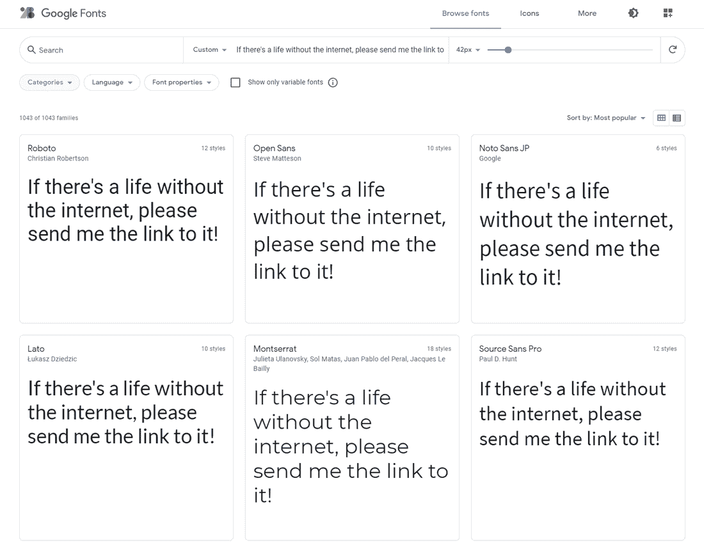

Google Fonts are a collection of trendy web fonts


说到数字字体，有几种不同的类型。有些字体主要用于印刷和图形设计。这些往往很大，不适合网站，但非常适合创建图形。大多数机器上都有“网络安全”字体。


> 需要在这里大声喊出来。Kinsta 太神奇了，我用它做我的个人网站。支持是迅速和杰出的，他们的服务器是 WordPress 最快的。
> 
> <footer class="wp-block-kinsta-client-quote__footer">
> 
> 
> 
> <cite class="wp-block-kinsta-client-quote__cite">Phillip Stemann</cite></footer>

[View plans](https://kinsta.com/plans/)

但是对于网页设计来说，你需要寻找的是网页字体，这种字体是专门为在网页上和各种设备上完美呈现而设计的。您还可以在电子邮件或其他在线服务中使用[网络字体。](https://kinsta.com/blog/best-fonts-for-email/)

有几件事使网页字体不同于标准的可下载桌面字体。首先，它们通常不能用于你电脑上的程序；它们必须被上传到服务器并在网络上使用。

它们也被设计成在不同的屏幕上和不同的尺寸下都清晰易读。它们可以用 CSS 进行[样式化(比如应用粗体或斜体、颜色和其他属性)，并提供对其他条件的支持，比如从右向左呈现。](https://kinsta.com/blog/how-to-change-font-in-wordpress/#changing-font-styles-in-block-editor-gutenberg)

虽然 web 字体不会安装在您或您的访问者的设备上，但有一些特殊的方法可以显示它们，这样任何访问您网站的人都可以看到它们。

你可以像平常一样下载这些字体并上传到你的服务器上，或者使用一个特殊的网络字体托管服务将它们嵌入到你的网站上而不需要下载。

### 在 HTML 中可以使用哪些字体？

有些字体不适合在网页上使用，但是哪些字体可以插入到你的 HTML 网站中呢？

本质上，你可以在你的网站上使用任何可下载的字体。你所需要做的就是上传并正确配置它，它应该会显示在你的网站上。


Scribble font isn’t practical for webpages


虽然从技术上讲，你可以在你的网站上使用任何字体，但这并不总是最好的主意。您应该专门寻找 web 字体，而不是用于印刷或图形设计的字体。有些字体过于风格化，或者用于如此大的文本尺寸，以至于它们不能在你的网站上正确呈现。对于网络字体，这不是问题。

在你的网站上使用桌面字体(或者使用网页字体进行打印设计)时，也需要担心许可问题。在不同的媒介中使用字体会给你带来麻烦。在购买之前，请务必仔细阅读您的字体许可证。

你也可以找到某些主机，它们允许你在 HTML 中使用一个简单的调用，通过免费或付费计划在你自己的网站上呈现它们的字体。

无论哪种方式，只要您使用的[字体被正确上传](https://kinsta.com/blog/how-to-change-font-in-wordpress/#how-to-add-locally-hosted-fonts-to-your-wordpress-site)并且具有正确的文件类型:

*   TrueType 字型文件
*   光学传递函数
*   WOFF/WOFF2
*   挽救（saving 的简写）
*   磁带结束符

有了这些字体文件类型，你就可以在整个网站上使用它们，并用 HTML 和 CSS 来设计它们。

还有 web 安全字体，通常可以在所有浏览器和程序中通用。

### 什么是网页安全字体？

大多数网络字体的一个问题是，不能保证它们能在你的网站上正确显示。与图形设计不同，在图形设计中，你可以在程序中创建一个图像，然后打印出来进行分发，[浏览器](https://kinsta.com/browser-market-share/)必须在每次有人打开页面时呈现网页字体。如果你的字体加载失败，你可能会得到一个空白的，破碎的网站。

出于这个原因，一些网站所有者选择只依赖[网络安全字体](https://kinsta.com/blog/web-safe-fonts/#what-fonts-are-web-safe)。这些都是预装在大多数系统上的，所以它们保证能在除了最不显眼的设备上正确显示。它们的加载速度也往往比网页字体快得多，网页字体显示起来可能会比较慢。

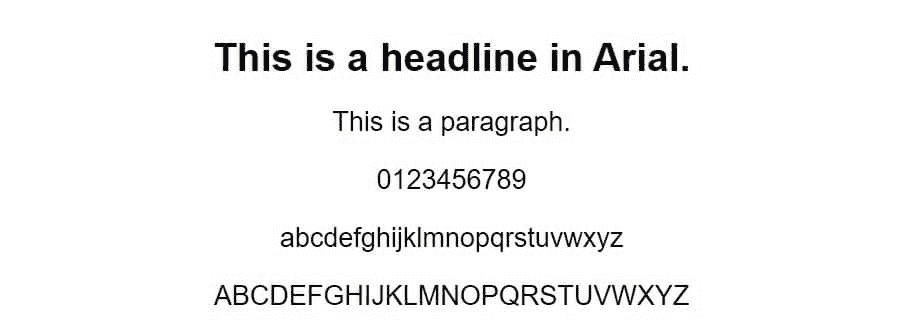

Arial is a common web safe font


如果你所担心的是最大化性能和绝对确保你的网站正确显示字体，那么网页安全字体是适合你的。

以下是通常可以使用的网页安全字体列表。

*   天线
*   笔刷脚本 MT
*   漫画无
*   信使新闻
*   加拉蒙字体
*   格鲁吉亚
*   Helvetica
*   影响
*   Lucida 控制台
*   帕拉蒂诺
*   前面有突出的护架
*   时代新罗马
*   投石机 MS
*   韦尔达纳

还有几十种网络安全字体，但这些是设备中最普遍的。

其中，Arial、Times New Roman、Helvetica 和 Courier New 是最安全的。尽管被认为是网络安全的，但其他一些软件在某些操作系统上无法运行。

问题是，除非你运行的是政府网站或简单的信息网站，否则不值得为了避免使用大多数字体而牺牲你的品牌。网页安全字体清晰易读，但它们也过于普通和过度使用。

选择一套更好、更独特的字体在你的网站上使用要好得多，尤其是因为有一个解决网页字体加载失败问题的方法:后备字体。

### 关于字体堆栈的一个注释

字体堆栈，也称为备用字体，是使用粗体和创造性 web 字体的唯一原因。

无论你做什么或采取什么预防措施，总会有人无法加载你的字体。也许他们禁用了 Javascript，所以你的托管字体无法正常显示，或者[代码](https://kinsta.com/blog/wordpress-debug/)出错，导致你上传的字体无法显示。或者某种字体与某人的设备不兼容。

多亏了[后备字体](https://www.w3schools.com/css/css_font_fallbacks.asp)，如果出现问题，很容易加载网页安全字体。这通过选择用户基于[字体系列](https://www.w3schools.com/cssref/pr_font_font-family.asp)安装的字体来实现:

*   **衬线字体**由附在字母线末端的小笔画定义。这些字体被认为是优雅和易读的。
*   **无衬线字体**设计类似于衬线字体，但缺少笔画。它们更简单，可读性更强。
*   **等宽字体**在每个字母之间均匀分布，给它们一个清晰的外观。
*   **草书字体**(或**手写体字体**)描绘正式的手写信件。它们不是很清晰，更适合标题或图形设计。
*   **幻想字体**(或**装饰字体**)高度风格化，像草书字体，不适合作为正文。

记住字体栈确实是一个“栈”；按顺序使用多种备用字体是完全可能的。只要确保你总是有一个网页安全字体在堆栈的最后，如果主字体失败了，你仍然有机会让你的品牌通过一个类似的字体。

## 如何用 HTML 添加字体

如果你想给你的网站添加一个网络字体，你有几个选择。

对于 WordPress 用户来说，把字体放到你的网站上最简单的方法就是使用插件。最受欢迎的两个是[简易谷歌字体](https://wordpress.org/plugins/easy-google-fonts/)和[使用任何字体](https://wordpress.org/plugins/use-any-font/)。前者简化了向网站添加谷歌字体的过程，而 UAF 允许你直接向网站上传字体。

如果你没有使用 WordPress，或者不想依赖插件，这个过程将需要一些手工修补。

首先，你可以使用其他地方的字体，比如谷歌字体。此处的说明取决于您选择的服务。使用谷歌字体，你需要在你的`<head>`中嵌入你想要使用的字体，然后在你想要使用它的时候调用它。

你也可以在你的网站上本地存放你从网上下载的字体。这可能更好，因为您不需要依赖第三方服务。

幸运的是，这很容易做到，只要你有一个正确配置的网络字体。只需将文件上传到服务器，然后使用样式表中的 [@font-face](https://www.w3schools.com/css/css3_fonts.asp) 规则来定义它。例如:

```
 @font-face {

font-family: FontName;

src: url(FontLocationOnServer);

}
```

然后，您可以使用`font-family`标签在 HTML 文档中您想要的任何地方调用您的字体。

### 用 HTML 和 CSS 设计字体样式

一旦你的字体安全上传到你的网站，你现在可以用 HTML 和 CSS 来设计它的样式。即使你没有什么编程技能，设计字体也是相当容易的。您可以更改文本颜色、背景颜色、大小、样式或粗细。

**注意:**如果你使用过旧的 HTML 版本，你可能还记得`<font>`标签。这不再受支持，也不应该使用。相反，您可以使用 CSS 或 HTML 样式元素来样式化文本。

首先，你可以用颜色代码改变字体。你可以使用一个[颜色名称](https://www.w3schools.com/colors/colors_names.asp)，比如“红色”，一个 RGB 代码，或者一个十六进制值。这是用`color`属性设置的，如下所示:

```
 p {

color: blue;

} 
```

或者在单个 HTML 样式元素中:

```
 <p style="color:blue;">Text.</p> 
```

背景色是相同的，但是使用了背景色属性。

## 注册订阅时事通讯


### 想知道我们是怎么让流量增长超过 1000%的吗？

加入 20，000 多名获得我们每周时事通讯和内部消息的人的行列吧！

[Subscribe Now](#newsletter)

```
 p {

background-color: blue;

}
```

接下来是[字号](https://www.w3schools.com/css/css_font_size.asp)。这既可以是像素，百分比，也可以是 [ems](https://css-tricks.com/why-ems/) (这对设计响应式网站很有好处)。

```
 p {

font-size: 16px;

}
```

或者:

```
<p style="font-size:200%;">Text.</p>
```

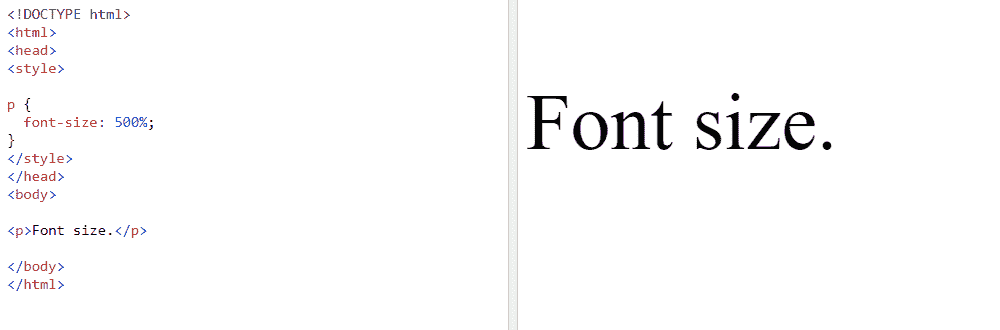

Setting the font size using CSS


最后是字体样式和粗细，或者斜体和粗体。对于倾斜的文本，使用“斜体”标签。

```
.italic {

font-style: italic;

}

And for bold: 

.bold {

font-weight: bold;

}
```

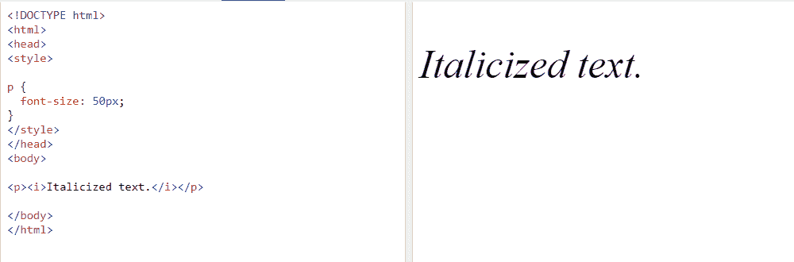

Setting the font style using CSS.


您也可以使用 HTML 标签来代替。对于斜体，您可以使用:

```
<em>
```

对于传达重点的文本，或使用:

```
 <i> 
```

对于想要在视觉上与众不同的文本。

对于粗体，使用:

```
<b> or <strong>
```

例如:

`<b>Bold Text</b>`

或者

```
<strong>I'm of special importance.</strong>
```

## 从哪里获取 HTML 字体？

无论您是想使用第三方字体主机还是下载它们，您都需要知道找到字体的最佳位置。有成百上千的发行商，但是有一些被认为是获得字体的可靠来源。以下是一些例子:

托管自己的字体？我们的性能优化主机包括一个支持 HTTP/2 的 CDN，包括免费带宽。[查看我们的计划](https://kinsta.com/plans/?in-article-cta)

*   [谷歌字体](https://fonts.google.com/)是获取字体的最佳途径之一。为什么？你可以很容易地把它们嵌入到你的网站上，而不需要下载任何东西，它的选择是巨大而美丽的，最重要的是，它是完全免费的。谷歌服务器总是很快，所以你可以相信他们会尽可能快地交付字体。

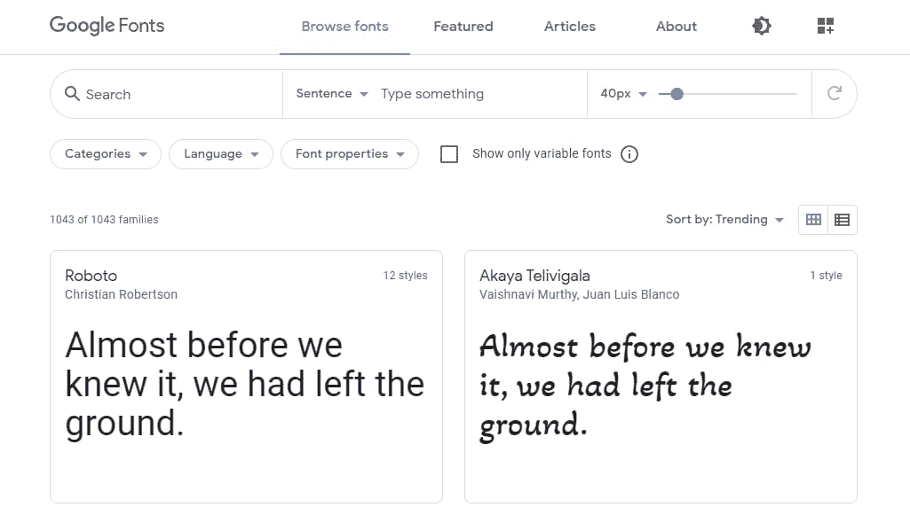

Google Fonts


*   [Adobe 字体](https://fonts.adobe.com/)提供数千种字体，可用于任何 Creative Cloud 订阅。对于其他服务(至少不依赖于像谷歌字体这样的开源字体)，你经常需要担心许可问题。这些字体可以在任何个人或商业项目中使用。
*   Fonts.com 为桌面和网络应用提供了广泛的字体选择。他们为你提供了在你的网站上获得它所需的代码。问题是有几种不同的许可证，这可能有点混乱。付款基于一次性费用或现收现付模式。
*   [TypeNetwork](http://www.typenetwork.com/) 通过各种许可选项为严肃的项目提供高质量的字体。购买桌面、web、应用程序或 ePub 字体。Web 字体还提供了一个额外的选项:托管或自托管。
*   在谷歌字体出现之前， [Font Squirrel](https://www.fontsquirrel.com/) 是一个可以找到任何项目中使用的免费商业许可字体的地方。它有很多选择，但遗憾的是没有字体托管选项。你需要下载字体并手动上传到你的网站。也不是所有的字体都是为网页优化的，但是你可以试试[网页字体生成器](https://www.fontsquirrel.com/tools/webfont-generator)。

## 十大 HTML 字体

有成千上万种网络字体，但是从哪里开始呢？这里有十种简单的 HTML 字体，在任何网站上都很好看。这些都是网络安全的，所以它们可以在几乎所有的设备上运行。它们也是很好的备用字体。

如果你需要一些更刺激的东西，我们有大量关于[草书字体](https://kinsta.com/blog/cursive-fonts/)、[书法字体](https://kinsta.com/blog/calligraphy-fonts/)和[现代字体](https://kinsta.com/blog/modern-fonts/)的文章。

### 1.天线

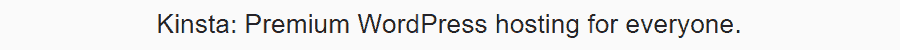

An example of the Arial font.


Arial 是所有字体中最著名的。它不是最漂亮的，但它很简单，在各种情况下都很有用。

### 2.时代新罗马

Times New Roman 也是一种极其常见的字体。最好是你在运营一个比较正规的网站。这种衬线字体不是特别令人兴奋，但也不会分散注意力。

### 3.帕拉蒂诺

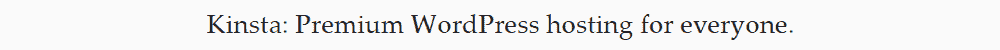

An example of the Palantino font.


Palatino 对你来说可能很熟悉，因为它经常用于书籍印刷。现在，它是一种优雅的数字字体，默认包含在许多设备中。

### 4.韦尔达纳

Verdana 以非常容易阅读而闻名，即使在大尺寸的情况下，它仍然看起来很棒。这种无衬线字体是很好的 Arial 替代字体。

### 5.信使新闻

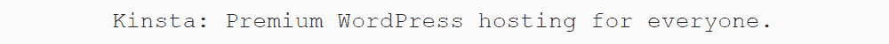

An example of the Courier New font.


Courier New 让人想起老式的打字机文本，它是一个很棒的等宽设计，适合想要老式但清晰外观的网站。

### 6.卡里布里布里布里布里布里布里布里布里布里布里布里布里布里布里布里布里布里布里布里布里布里布里布里布

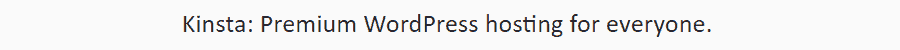

An example of the Calibri font.


Calibri 是一种简单、可爱的无衬线字体，是 Microsoft Office 等程序的标准字体。然而，它是一种专有字体，所以通常只在 Windows 操作系统上受支持。

### 7.格鲁吉亚

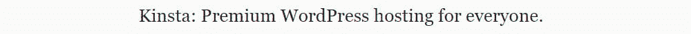

An example of the Georgia font.


这种圆形衬线字体的灵感来自类似的网页安全字体 Garamond。如果你需要一种不像 Times New Roman 那么严肃的正式字体，这是一个不错的选择。

### 8.加拉蒙字体

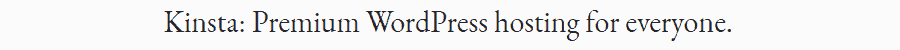

An example of the Garamond font.


与 Palatino 非常相似，Garamond 是一种常用于书籍印刷的经典字体。尽管针对现代操作系统进行了更新，但它看起来仍然相当过时。

### 9.狄多


An example of the Didot font.


这种衬线字体上最小的字母间距赋予了它独特的外观和感觉。你可以在大多数苹果设备上找到它。

### 10.前面有突出的护架

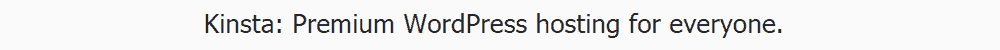

An example of the Tahoma font.


这种简洁的字体已经成为旧 Windows 操作系统的默认字体。它更大胆的外观使它足够突出而不分散注意力。

[在这些网页安全字体的帮助下，确保你的网站不仅外观好看，而且功能正常✨ 点击发推](https://twitter.com/intent/tweet?url=https%3A%2F%2Fbit.ly%2F3eW7uCh&via=kinsta&text=Make+sure+your+site+not+only+looks+good+but+also+functions+properly+with+help+from+these+web+safe+fonts+%E2%9C%A8&hashtags=Typography%2CFonts)

## 摘要

重要的是[选择在你的网站上看起来好的](https://kinsta.com/blog/wordpress-fonts/#why-wordpress-font-choice-matters)并且可读的[能够体现你的品牌](https://kinsta.com/blog/web-design-best-practices/#brand-standards)的网络字体。有各种各样的网站，你可以安装免费字体或付费下载授权字体，我们已经提供了一些好字体的例子。

你不必坚持使用几十年来在互联网上随处可见的无聊的网络安全字体。多亏了后备字体，你可以使用任何你喜欢的字体，并设置一个后备字体，当它不能加载时使用。

无论你是在你的网站上、电子邮件中还是在你的 logo 中使用这些 HTML 字体，确保你做了大量的测试，这样你的网站仍然是可读的，并且排版与你的设计的其他部分很好地配合。

* * *

让你所有的[应用程序](https://kinsta.com/application-hosting/)、[数据库](https://kinsta.com/database-hosting/)和 [WordPress 网站](https://kinsta.com/wordpress-hosting/)在线并在一个屋檐下。我们功能丰富的高性能云平台包括:

*   在 MyKinsta 仪表盘中轻松设置和管理
*   24/7 专家支持
*   最好的谷歌云平台硬件和网络，由 Kubernetes 提供最大的可扩展性
*   面向速度和安全性的企业级 Cloudflare 集成
*   全球受众覆盖全球多达 35 个数据中心和 275 多个 pop

在第一个月使用托管的[应用程序或托管](https://kinsta.com/application-hosting/)的[数据库，您可以享受 20 美元的优惠，亲自测试一下。探索我们的](https://kinsta.com/database-hosting/)[计划](https://kinsta.com/plans/)或[与销售人员交谈](https://kinsta.com/contact-us/)以找到最适合您的方式。