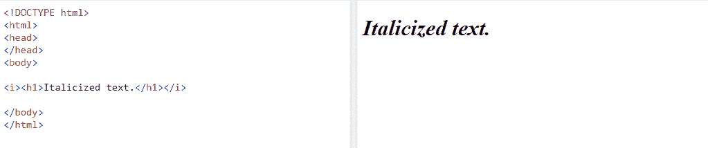
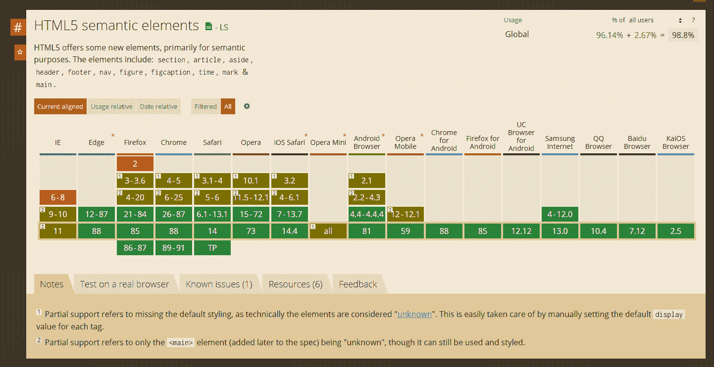
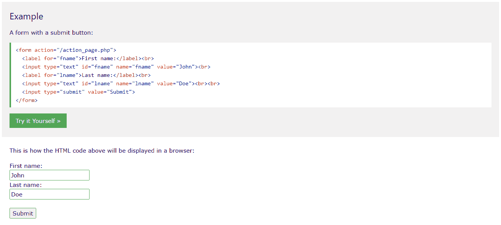
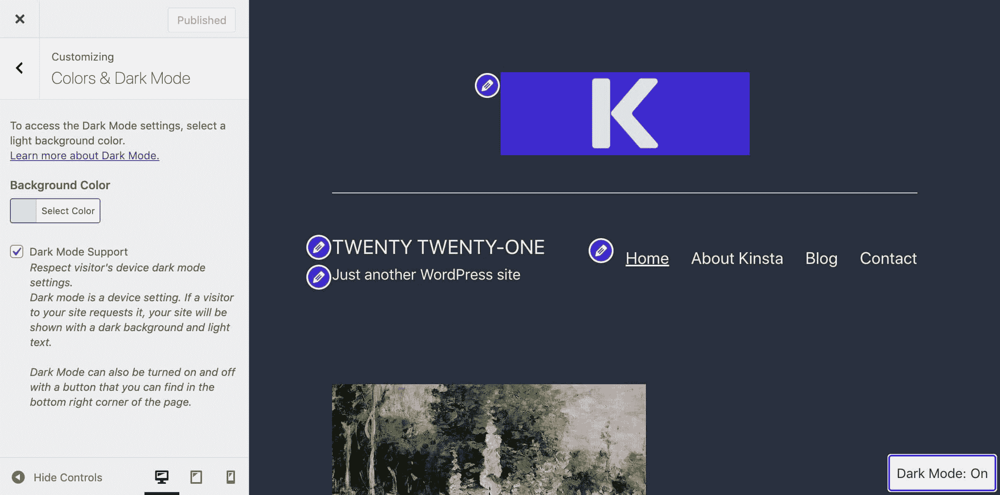

# HTML 与 HTML5:了解它们之间的重要区别

> 原文：<https://kinsta.com/blog/html-vs-html5/>

HTML vs HTML5。区别大吗？如果你想进入前端开发或者在 WordPress 中使用[代码，你需要知道两者的区别。这可能会特别令人困惑，因为有些人可能会互换使用这两个术语，但从技术上讲，它们是两个不同的东西——尽管它们也有关联。](https://kinsta.com/knowledgebase/edit-wordpress-code/)

让我们来看看 HTML 和 HTML5 的区别，哪个更好，流行的标记语言的最大更新改变了什么。

## 什么是 HTML？

HTML 代表**超文本标记语言**。它构成了网络的基石，可能是最广为人知的[编码语言](https://kinsta.com/blog/best-programming-language-to-learn/)。

HTML 是用于 web 开发的标准语言。当你使用 HTML 的时候，有很多 web 开发工具可以使用。它允许您使用称为标记标签的小标签来创建网页的基本结构。例如，要将一段文本设为斜体，您可以将它包装在 HTML 标记中，如下所示:

```
<i>Italicized text.</i>
```



HTML tag example


HTML 的大部分同样简单易读，所以即使非开发人员也觉得很容易使用。鉴于它对万维网的重要性，学习 HTML 非常容易。


> 需要在这里大声喊出来。Kinsta 太神奇了，我用它做我的个人网站。支持是迅速和杰出的，他们的服务器是 WordPress 最快的。
> 
> <footer class="wp-block-kinsta-client-quote__footer">
> 
> 
> 
> <cite class="wp-block-kinsta-client-quote__cite">Phillip Stemann</cite></footer>

[View plans](https://kinsta.com/plans/)

不用 HTML 做网站是不可能的。虽然有[网站建设者](https://kinsta.com/blog/wix-vs-wordpress/)可以让你不用接触任何代码就能设计一个网站，包括[WordPress](https://kinsta.com/blog/wordpress-page-builders/)，他们仍然在幕后为你处理 HTML 代码。

所以，如果你想成为一名 web 开发人员或者更深入地研究像 WordPress 这样的工具，你自然需要学习 HTML。

HTML 经常与其他语言结合使用，如 [CSS](https://kinsta.com/blog/wordpress-css/) 和 JavaScript 来扩展其功能。CSS 通过添加颜色、布局等来帮助您设计 HTML 样式，而 JavaScript 是一种更传统的编程语言，允许您添加高级功能。

虽然这两种语言与 HTML 捆绑得很好，但它们并不是创建网站所必需的。HTML 当然是必需的，这就是为什么它是最重要的网络语言。

[乍一看，它们可能看起来很相似，但它们之间有一些相当大的差异&👀请在这里查看流行的标记语言的最大更新中的变化👇 点击推文](https://twitter.com/intent/tweet?url=https%3A%2F%2Fkinsta.com%2Fblog%2Fhtml-vs-html5%2F&via=kinsta&text=They+may+look+similar+at+first+glance%2C+but+there+are+some+pretty+big+differences+between+HTML+%26amp%3B+HTML5+%F0%9F%91%80+See+what%27s+changed+in+the+popular+markup+language%E2%80%99s+biggest+update+right+here+%F0%9F%91%87&hashtags=HTML%2CWordPress)


## HTML5 是什么？


HTML5 logo (Source: [W3C](https://commons.wikimedia.org/wiki/File:HTML5_Badge.svg))


HTML5 不是一个独立的系统，而是 HTML 技术的最新版本。它的前身 HTML4 的第一次也是最后一次更新是在 1999 年 12 月。HTML5 本身其实并不算很新，几年前的 2014 年就发布了。

那么有什么大的区别呢？为什么大肆宣传？虽然许多标记标签保持不变(毕竟不要修复没有损坏的部分)，但其中一些已经被简化，因此编写代码变得更加容易和快速。它基于一个全新的标准，它的解析也完全不同。

不像旧版本的 HTML，它允许你创建主要是静态的网站，需要用 CSS 和 JavaScript 来增加趣味，HTML5 更具动态性，包括多媒体元素。它原生支持视频和音频，你甚至可以用它制作游戏或动画。

换句话说，HTML5 完全能够做你以前需要使用旧工具如 JavaScript、Flash 或 Silverlight 来做的事情。这意味着[您的网站更加安全，更不容易被试图进入的攻击者利用](https://kinsta.com/blog/wordpress-security/)。

虽然 CSS 和 JavaScript 对于创建一个成熟的网站来说仍然是必不可少的，但是你不再需要依赖它们来做任何动态的事情。

HTML5 不再仅仅是一个网站建设者。它本身就是一个完整的应用构建器。

HTML5 不是作为“HTML6”出现的下一个更新，而是作为一个生活标准随着 web 需求的发展而不断更新。这是这项持久技术的最新和最伟大的版本，它将在未来很长一段时间内继续存在。

## HTML 与 HTML5:权衡差异

当大多数人谈论“HTML”时，他们指的是整个技术，包括它的最新版本:HTML5。虽然它在许多方面都非常不同，但 HTML5 实际上只是旧标准的完美更新。

虽然 HTML 和 HTML5 是同一个系统的一部分，但这次重大更新为旧的编码语言带来了几项增强，使它更加高效。这里只是添加的几个例子。


### 和睦相处

当 HTML5 第一次出现时，兼容性是一个大问题，也是许多人选择不升级他们网站的主要原因。如果浏览器不知道如何解析 HTML5 标签，可能会导致页面损坏或看起来很奇怪。

事实正好相反:用旧的 HTML4 标准编写的网站经常会在现代浏览器中崩溃，因为浏览器早已不再支持过时的功能。如果你想和大多数人的浏览器保持兼容，HTML5 是个不错的选择。

虽然旧版本的 HTML 在像 Internet Explorer 这样的浏览器上工作得很好，但这些过时的版本不再被大多数用户支持或使用。大多数人不需要为这种旧浏览器编写网站代码，所以没有必要使用 HTML4。

正如你在这里看到的，HTML5 和它的大部分功能在所有现代浏览器上都得到了[的支持。除了 Internet Explorer 版本 6–8 和 Firefox 2 之外，所有版本都完全或部分支持它的新标签，所有版本都来自 21 世纪初，现在很少使用。](https://caniuse.com/?search=html5)



Checking for HTML vs HTML5 browser support


虽然所有现代浏览器在技术上都支持 HTML4，但对过时标签的支持充其量也只是零星的。你应该避免使用过时的标准，转而使用 HTML5。

### 多媒体支持

HTML5 带来的最大的东西之一是支持多媒体元素，如音频、视频、[矢量图形](https://kinsta.com/blog/image-file-types/#8-svg--scalable-vector-graphics)、动画和游戏。

在过去的网络时代，在你的网站上放一个简单的动画通常需要使用 JavaScript、Flash 或其他技术。现在，您可以用 HTML 或 CSS 来完成它，而不必向任何潜在的漏洞敞开大门。

有了[视频](https://www.w3schools.com/html/html5_video.asp)和[音频](https://www.w3schools.com/html/html5_audio.asp)，嵌入播放器就像放入一个简单的标签一样简单。在那里你可以做很多配置，比如打开自动播放或者添加播放器控制。


HTML5 Audio Player


HTML5 还支持嵌入 [SVG 矢量图形](https://kinsta.com/blog/what-is-an-svg-file/)——可以调整到任何分辨率而没有像素化的图像。SVG 越来越流行于在线显示图形，因为它们可以很好地扩展以填充任何尺寸的屏幕。

最后，你可以用 HTML5 制作成熟的视频游戏，尤其是如果你把它和 JavaScript 结合起来。许多游戏创作工具甚至可以移植到 HTML5，并允许你将结果嵌入到你的网站上。

这种多媒体支持使 HTML5 成为取代许多过时技术的理想候选，包括 Java Web Start、Silverlight 和最近的 [Flash](https://www.theverge.com/2020/12/31/22208190/adobe-flash-is-dead) 。几乎你可以用这些系统做的所有事情都可以在 HTML5 中更简单有效地完成。

## 注册订阅时事通讯


### 想知道我们是怎么让流量增长超过 1000%的吗？

加入 20，000 多名获得我们每周时事通讯和内部消息的人的行列吧！

[Subscribe Now](#newsletter)

### 标准通用标识语言

最初的 HTML 语言(直到版本 4)主要基于 SGML 标准或标准通用标记语言。

虽然 SGML 旨在标准化标记，消除混淆，并启发了 HTML 和 XML，但它是 20 世纪 60 年代创建的语言的后代。它很古老，因此在设计时没有考虑到现代网络应用程序。

HTML5 已经发展到不再符合 SGML 相反,[用自己独特的规则解析](https://www.w3.org/TR/2011/WD-html5-20110113/parsing.html)。虽然它的起源仍然是 SGML，HTML5 只是现有技术的扩展，但它不再符合这些标准。

这样做的一个结果是错误处理现在更加宽容了。一个小错误将不会再导致你的页面上出现一个明显的问题，或者一个根本无法加载的页面。

语义，或者说标签，也有了很大的改进。以前，构建页面需要不断使用`<div>`标签:`<div id=“header”>`、`<div id=“menu”>`和`<div class=“post”>`。

在 HTML5 中，那些笨拙的代码是`<header>`、 `<nav>`和`<article>`。这些标签更干净，响应更快。

还引入了几个新标签。它们中的许多都是为了取代以前用于构建页面的 div 和框架而创建的。

许多旧的标记标签完全没有改变，所以 HTML5 部分向后兼容旧版本。但是，在新的标准下，未经处理的 HTML4 文档将无法正确解析。

虽然 HTML 和 HTML5 之间有相当多的差异，但这些变化通常是更好的，旨在使标记语言更容易理解。


### 更好的性能和移动支持

HTML5 最大的好处之一是它比以前的版本更快，反应更灵敏。在最初的 HTML 时代，除了计算机之外的设备访问互联网甚至还不是一个梦想；现在，这一切都可以从我们的手机、手表和电视上获得，这在一定程度上要归功于 HTML5 的速度。

新版本带来了更好的标准，让网站在更小、功能更弱的设备上运行更流畅。许多性能问题仍然取决于您和您的代码质量。然而，HTML 方面的许多细节都与 HTML5 更新紧密相关。

例如，HTML5 支持 JavaScript Web Workers 的[多线程](https://www.htmlgoodies.com/html5/tutorials/introducing-html-5-web-workers-bringing-multi-threading-to-javascript.html)，允许您设备的处理器使用更多的能力来运行脚本。过去使页面陷入停滞的代码现在可以无缝运行了。

在 HTML5 中设计响应式网站也容易得多。HTML4 有许多不响应的元素，如 div，被在移动设备上更好工作的结构标签所取代。

[框架](https://html.com/frames/)也因可用性和可访问性问题而被移除。虽然它们仍然受支持，但它们已经被弃用，除非您有理由使用过时的技术，否则不应该使用它们。

需要为您的客户端站点提供快速、安全且对开发人员友好的托管服务吗？Kinsta 是为开发人员设计的，它提供了大量具有强大仪表板的工具。[查看我们的计划](https://kinsta.com/plans/?in-article-cta)

虽然 HTML5 没有直接替换框架的功能，但建议您使用 flex boxes 或 iframe(html 5 仍然支持这些功能)等 CSS 元素来替换旧的功能。

### 更好的表单控件

新的表单控件等同于对站点的新的控制级别。虽然这看起来是一个小特性，但这意味着必须少依赖一种外部技术来创建一个工作表单。



HTML 5 form example


最初，HTML 只支持文本、密码、隐藏、复选框/单选和文件上传输入类型。虽然这足以制作一个基本的输入表单，但是现在你可以用 [HTML5 输入类型](https://developer.mozilla.org/en-US/docs/Learn/Forms/HTML5_input_types)做更多的事情。

新增内容包括电子邮件、电话号码、URL、搜索框、滑块、数字、日期和时间选择器以及颜色选择器输入。

这种多样的输入类型允许您创建能够接受更多内容类型的[更好的表单](https://kinsta.com/blog/wordpress-forms/),并包含验证以确保它们是正确的。查看 [HTML 输入](https://www.w3schools.com/html/html_form_input_types.asp)的完整列表，了解更多信息。

### 网络存储

说到网络存储，HTML4 及以下版本基本上只支持 cookies，几乎不支持其他。在一个 4 千字节的小 cookie 中存储除了基本的用户跟踪之外的任何信息几乎是不可能的。

另一方面，本地存储允许您根据浏览器存储 5-10 兆字节的数据。这允许您保存有关以前会话、离线访问数据、个人定制等的客户端信息。此外，与 cookies 不同，本地存储不会自动清除。



Dark mode enabled in the WordPress Customizer


本地存储的一个例子是保存用户在你的网站上对浅色或深色主题的偏好，确保他们在下次访问时继续看到你的网站。虽然你也可以用 cookies 保存用户偏好，但浏览器不可避免地会在一段时间后清除它们。

HTML5 通过 [Web 存储 API](https://www.w3schools.com/html/html5_webstorage.asp) 支持本地存储。此外，它还支持 [Web SQL 数据库](https://www.tutorialspoint.com/html5/html5_web_sql.htm)存储、索引数据库存储，甚至支持使用[文件 API](https://www.w3.org/TR/FileAPI/) 进行文件访问。其中许多通过 API 与 JavaScript [集成。在此之前，它要么非常麻烦，要么在某些情况下，根本不可能或非常麻烦。](https://kinsta.com/blog/wordpress-http-api-part-1/)

## HTML 和 HTML5 哪个好？

如果你想学习编码，你一定要避免使用过时的标准。HTML5 是 HTML 的最新版本，应该总是在该语言的旧版本之上使用。

如上所列，HTML5 改进了 HTML4 的几个过时且难以使用的方面。此外，HTML5 本身可以做很多事情，而 HTML4 完全依赖于长期以来被弃用的系统，如 Silverlight、 [Java](https://kinsta.com/blog/best-programming-language-to-learn/#java) Web Start 和 Flash。

虽然 HTML5 并不总是能在超级旧的浏览器和操作系统(如 Internet Explorer 或旧版本的手机)上正常显示，但这些平台已经非常过时，很少再使用了。不再有任何好的理由在现代标准上使用 HTML 的过时版本。

不幸的是，网上和书中有很多关于旧版本 HTML 的信息。每当你查阅指南或从课程或书籍中学习时，请确保它谈论的是 HTML5，并且是在 2014 年之后发布或更新的。学习 1999 年的过时标准是没有用的。

## 如何将 HTML 转换成 HTML5

如果你有一个旧的网站，你需要更新它。遗憾的是，如果不做任何手工工作，就没有真正的方法来完成完全转换。

最好的办法是通读 HTML5 规范(如果你完全不熟悉这种语言，可以参加一个 HTML 课程)，熟悉其中的变化。之后，你可以重写代码，添加他们在 HTML5 中添加的新功能。

查看从 HTML4 迁移到 HTML5 的指南。它广泛地涵盖了您需要对代码进行的手动更改。

你也可以试试这个 [XHTML 到 HTML5 的转换器](http://mynthon.net/tools/xhtml-to-html5/)，但是要确保手动检查你的代码，或者在把它导入到一个活动站点之前把它插入到一个验证器中。

幸运的是，HTML5 大部分是新内容。有几个[弃用的标签](https://www.tutorialspoint.com/html5/html5_deprecated_tags.htm)你需要替换，但是除此之外，升级代码通常不是一件很大的事情，除非你的站点严重依赖像框架这样的弃用技术。

[如果你想从事前端开发或在 WordPress 中从事代码工作👩‍💻，你需要知道 HTML 和 HTML5 的区别...这篇文章涵盖了你💪](https://twitter.com/intent/tweet?url=https%3A%2F%2Fkinsta.com%2Fblog%2Fhtml-vs-html5%2F&via=kinsta&text=If+you%E2%80%99re+looking+to+get+into+frontend+development+or+work+with+code+in+WordPress+%F0%9F%91%A9%E2%80%8D%F0%9F%92%BB%2C+you+need+to+know+the+difference+between+HTML+and+HTML5...+and+this+post+has+you+covered+%F0%9F%92%AA&hashtags=WebDev%2CHTML)

## 摘要

HTML 和 HTML5 只是同一技术的两个部分，尽管它们的含义略有不同。HTML 是指整个标记语言，通常是指最新版本，而 HTML5 是它的最新更新。

如果你想学习 HTML，使用最新版本很重要:HTML5。它在各方面都更好，即使这意味着必须手动转换大量旧代码，也绝对值得付出努力。

HTML5 已经有几年的历史了，作为语言整体的生活标准，它只会继续更新以适应现代网络。

* * *

让你所有的[应用程序](https://kinsta.com/application-hosting/)、[数据库](https://kinsta.com/database-hosting/)和 [WordPress 网站](https://kinsta.com/wordpress-hosting/)在线并在一个屋檐下。我们功能丰富的高性能云平台包括:

*   在 MyKinsta 仪表盘中轻松设置和管理
*   24/7 专家支持
*   最好的谷歌云平台硬件和网络，由 Kubernetes 提供最大的可扩展性
*   面向速度和安全性的企业级 Cloudflare 集成
*   全球受众覆盖全球多达 35 个数据中心和 275 多个 pop

在第一个月使用托管的[应用程序或托管](https://kinsta.com/application-hosting/)的[数据库，您可以享受 20 美元的优惠，亲自测试一下。探索我们的](https://kinsta.com/database-hosting/)[计划](https://kinsta.com/plans/)或[与销售人员交谈](https://kinsta.com/contact-us/)以找到最适合您的方式。