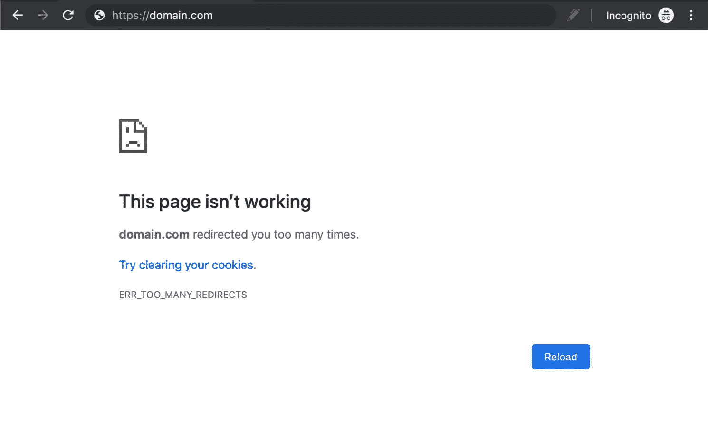
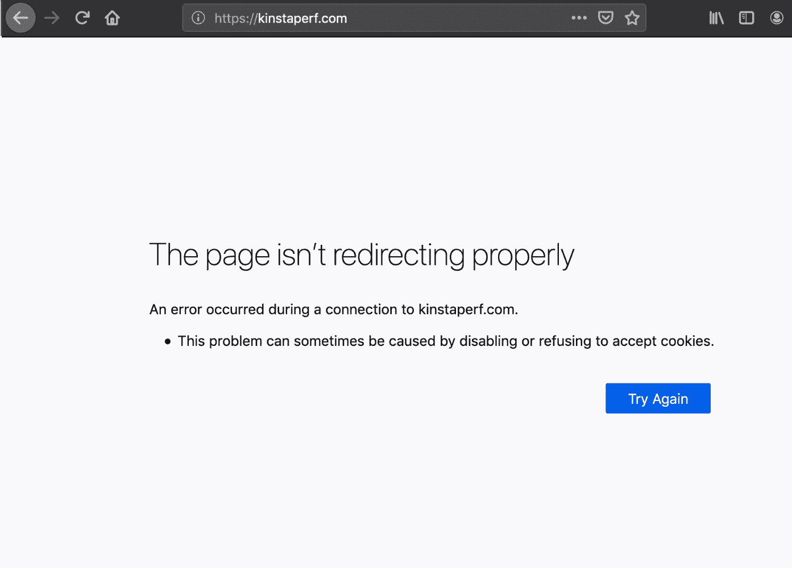
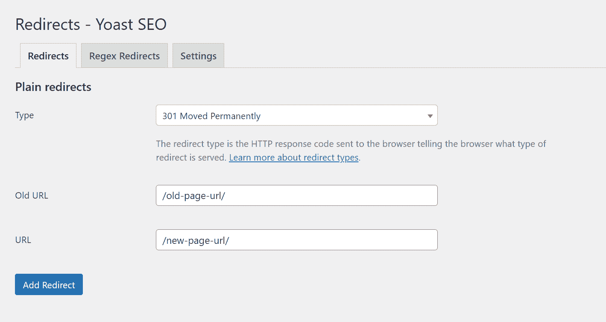
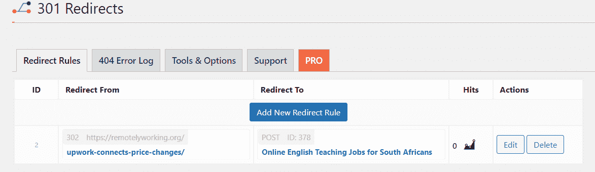
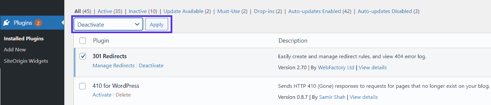
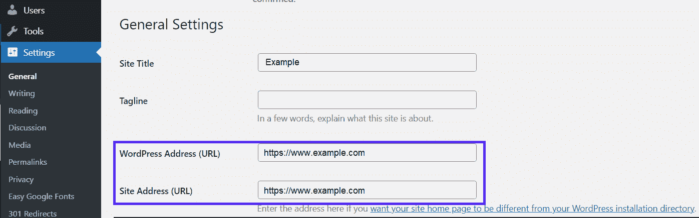
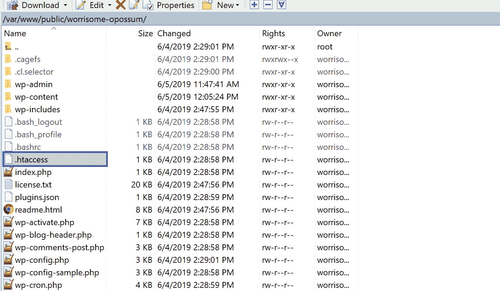
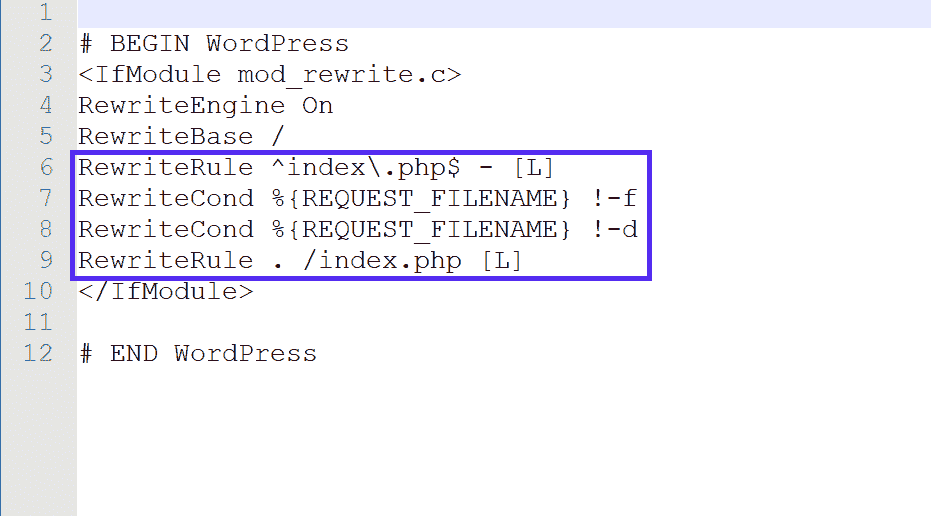
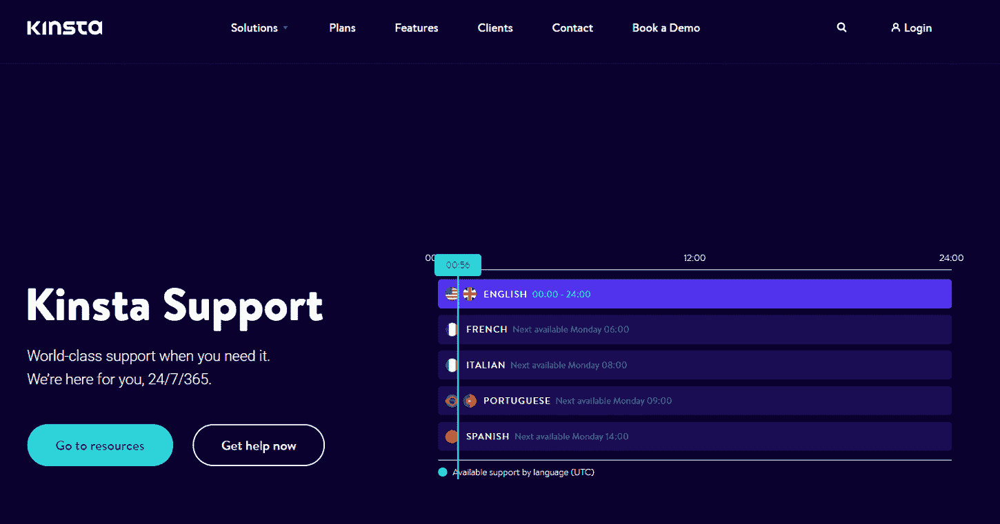

# 如何修复 HTTP 302 错误(5 种方法)

> 原文：<https://kinsta.com/blog/http-302/>

HTTP 302 代码是将网站用户临时重定向到不同 URL 的有效方法。然而，如果你的网站错误地发送了 302 重定向，那就表明有问题了。

不要担心，您可以解决这个问题，但是您需要进行一些故障排除。

第一步是准确理解 HTTP 302 代码是什么，它们是如何工作的，以及它们为什么会出现。一旦你知道了这一点，你就能找出哪里出了问题，以及如何改正。

在这篇文章中，我们将告诉你关于 HTTP 302 错误你需要知道的一切。然后，我们将分享五个故障排除技巧来帮助您解决这些问题。

我们开始吧！

### 查看我们的 302 HTTP 状态代码视频指南


## 什么是 HTTP 302 状态码？

302 代码是一种特定类型的 [HTTP 状态代码](https://kinsta.com/blog/http-status-codes/)。这些代码就像是服务器发送给浏览器的“笔记”。


> 需要在这里大声喊出来。Kinsta 太神奇了，我用它做我的个人网站。支持是迅速和杰出的，他们的服务器是 WordPress 最快的。
> 
> <footer class="wp-block-kinsta-client-quote__footer">
> 
> 
> 
> <cite class="wp-block-kinsta-client-quote__cite">Phillip Stemann</cite></footer>

[View plans](https://kinsta.com/plans/)

每当你点击一个链接或者[导航到一个 URL](https://kinsta.com/knowledgebase/what-is-a-url/) ，你的浏览器就向网络服务器请求同样的内容。作为回报，服务器发回相关资源(例如，您试图访问的页面)以及 HTTP 头。HTTP 状态代码在那个头中。

通常，您在网页的任何地方都看不到这些状态代码。您通常只会在发生错误时看到它们，或者如果您安装了使它们可见的[浏览器扩展](https://kinsta.com/blog/best-chrome-extensions/):


一个网页的 HTTP 状态码，使用 Chrome 浏览器扩展显示。


3xx 状态代码(301、302 等。)是一类称为“重定向代码”的状态代码每当服务器发送回一个新的资源而不是请求的资源时，就会返回它们。

换句话说，当您想要访问的网站页面将您重定向到不同的页面时，它们会显示出来。

代码 301 和代码 302 之间的关键区别在于，前者用于永久重定向，而后者用于临时重定向。

301 重定向也通过“链接果汁”，而 302 不通过。这对[搜索引擎优化(SEO)](https://kinsta.com/blog/what-does-seo-stand-for/) 有重大影响。

[呃哦...您刚才看到了一个弹出的 HTTP 302 代码。😬现在怎么办？🤷‍♀️以此开始深入引导⤵ 点击推文](https://twitter.com/intent/tweet?url=https%3A%2F%2Fkinsta.com%2Fblog%2Fhttp-302%2F&via=kinsta&text=Uh+oh...+you%27ve+just+seen+an+HTTP+302+code+pop+up.+%F0%9F%98%AC+Now+what%3F+%F0%9F%A4%B7%E2%80%8D%E2%99%80%EF%B8%8F+Start+with+this+thorough+guide+%E2%A4%B5&hashtags=WPTips%2CWordPress)


## 302 重定向如何工作

当你在你的网站上为一个暂时不可用的页面设置 302 重定向，并且用户访问该页面时，你的网络服务器将用一个特殊的[位置头](https://developer.mozilla.org/en-US/docs/Web/HTTP/Headers/Location)来响应访问者的浏览器。该标题将指示浏览器应该将用户重定向到的新 URL。

例如，假设用户在他们的浏览器地址栏中键入**blog.example.com**，但是网站被配置为将其重定向到【blogging.example.com】T2。

服务器响应将包括 302 状态代码和*位置:blogging.example.com*报头。该设置告诉用户的浏览器将该请求重定向到新的 URL。

当然，所有这些都是在幕后自动发生的。用户应该看不到这一切。相反，他们的浏览器应该自动带他们到新的资源。

## 为什么会发生 HTTP 302 错误

如果你的网站配置错误，可能会导致错误发布 302 代码。如果发生这种情况，您可能会遇到以下问题:

*   你网站上的一个页面，当它不应该的时候会把你的访问者重定向到其他地方
*   您网站上的一个页面会将您的访问者重定向到错误的资源
*   [ERR_TOO_MANY_REDIRECTS](https://kinsta.com/blog/err_too_many_redirects/) 错误(也称为“重定向循环”)

最后一个问题是唯一会显示实际错误页面的问题。如果您使用的是 Chrome 浏览器，重定向循环错误页面将如下所示:




Chrome ERR _ TOO _ MANY _ REDIRECTS 错误消息。


在 Mozilla Firefox 上，它看起来像这样:




Firefox ERR _ TOO _ MANY _ REDIRECTS 错误消息。


以上问题都是一些配置错误造成的。可能是插件冲突，不正确的 [URL 设置](https://kinsta.com/knowledgebase/wordpress-change-url/)，或者错误配置的**。htaccess** 文件。


## 如何修复 HTTP 302 错误(5 种方法)

接下来，我们将向您介绍五种故障排除方法，帮助您找出问题的原因并解决问题。

在我们开始之前，请确保首先对您的网站进行[完整备份。这样，如果出现任何问题，您可以随时恢复到以前的版本。你可以用一个 WordPress 插件来做这件事。](https://kinsta.com/blog/backup-wordpress-site/)

### 1.确定重定向是否有效

302 响应通常不是错误。暂时将用户重定向到不同的页面可能是一种有效的配置，通常不需要修复。

如果你的网站响应了 302 代码，而这是不应该由 T1 发布的，或者如果它导致了重定向循环，这只是一个错误。因此，第一步是仔细检查哪些 URL 正在生成 HTTP 302 代码，并确定重定向是否合适。

为此，您可以导航到您的网站上您怀疑发布 302 错误的页面，并亲自查看它们是否如预期那样运行。如果一个暂时不可用的页面重定向到正确的资源，它就得到适当的配置。

但是，如果页面将您重定向到错误的资源，或者您的浏览器通过显示 ERR_TOO_MANY_REDIRECTS 错误页面来报告重定向循环，则表明您的一个(或多个)重定向配置不正确。

### 2.检查你的插件

302 错误和重定向循环最常见的原因之一是插件。

## 注册订阅时事通讯


### 想知道我们是怎么让流量增长超过 1000%的吗？

加入 20，000 多名获得我们每周时事通讯和内部消息的人的行列吧！

[Subscribe Now](#newsletter)

一些 [WordPress 重定向](https://kinsta.com/blog/wordpress-redirect/)管理器插件和 SEO 工具，如 [Yoast SEO](https://kinsta.com/blog/yoast-seo/) 为你管理你的网站重定向，并允许你设置[重定向规则](https://kinsta.com/help/redirect-rules/):




Yoast SEO 高级插件重定向设置页面。


如果这些规则配置错误，或者两个插件冲突，就会导致意外的问题。因此，您需要检查安装在您网站上的每个相关工具。

例如，如果你正在使用流行的 [301 重定向](https://wordpress.org/plugins/eps-301-redirects/) WordPress 插件，你可以通过导航到**设置** > **301 重定向**来检查配置。在**重定向规则**下，您将看到您设置的所有重定向规则的列表:




301 重定向 WordPress 插件的重定向规则设置页面。


检查这里列出的所有 302 重定向，并确保它们都是正确的。

您还需要确保没有设置任何可能导致重定向循环的内容。例如，如果页面 A 被设置为重定向到页面 B，但是页面 B 也被设置为重定向到页面 A，这将导致错误。

如果你有多个重定向管理器插件，并且你不确定是哪一个导致了这个问题，你可以试着从 WordPress **插件**页面一个接一个地停用它们(确保[首先做一个备份](https://kinsta.com/help/external-backups/)):




WordPress 管理仪表板中的插件页面。


停用每个插件后，尝试重新访问问题 URL，看看 302 错误是否仍然存在。

如果问题突然被修复，你会知道是哪个插件导致了这个问题，然后你可以选择进一步排除故障或者从你的网站上删除它。


### 3.确保你的 WordPress URL 设置配置正确

HTTP 302 错误的另一个常见原因是 WordPress URL 设置中的错误配置。

要检查这一点，导航到[你的 WordPress 仪表盘](https://kinsta.com/knowledgebase/wordpress-admin/)中的**设置** > **常规**。这里，你应该看到一个 **WordPress 地址(URL)** 字段和一个**站点地址(URL)** 字段:




WordPress 中的通用设置页面。


在大多数情况下，这两个字段中的 URL 应该匹配。确保它们都是相同的，包括域名前的“www”部分(或没有)。

与我们世界一流的支持团队一起体验卓越的 WordPress 托管支持！与支持我们财富 500 强客户的同一个团队聊天。[查看我们的计划](https://kinsta.com/plans/?in-article-cta)

如果它们不匹配，更新设置，然后检查发出 HTTP 302 错误的页面的 URL，看它是否被修复。

### 4.检查您的服务器配置

错误配置的服务器有时也会导致 302 重定向错误。因此，下一步是检查您的服务器配置。

如果你的主机使用的是[Apache web 服务器](https://kinsta.com/knowledgebase/what-is-apache/)，你可以通过检查你的**来实现。htaccess** 文件。


### 信息

这一步不适用于托管在 [Nginx 服务器](https://kinsta.com/knowledgebase/what-is-nginx/)上的网站。如果你的主机使用 Nginx 服务器，[就像 Kinsta 使用](https://kinsta.com/features/)一样，你可以进入下一个故障诊断步骤。


首先，[通过像](https://kinsta.com/knowledgebase/how-to-use-sftp/) [cPanel](https://kinsta.com/knowledgebase/what-is-cpanel/) 或[FTP 客户端](https://kinsta.com/blog/best-ftp-clients/)这样的[控制器](https://kinsta.com/knowledgebase/what-is-cpanel/) [仪表板连接到你站点的服务器](https://kinsta.com/knowledgebase/what-is-cpanel/) [呃](https://kinsta.com/knowledgebase/how-to-use-sftp/)。然后导航到你的站点的根目录——与 **wp-admin** 和 **wp-content** 文件夹相同的位置——并找到**。htaccess** 文件:




了。网站根目录中的 htaccess 文件。


如果你没有找到**。htaccess** 文件(你肯定在 Apache 服务器上)，你可能需要[告诉 FileZilla 显示隐藏的文件](https://kinsta.com/knowledgebase/filezilla-show-hidden-files/)，然后它才会出现在文件列表中。

接下来，在您最喜欢的文本编辑器中打开文件。它应该是这样的:




改写了 XXX 指令中的一条。htaccess 文件。


现在，我们将寻找`RewriteXXX`指令(上面突出显示的元素)。不要太专业，`RewriteCond`和`RewriteRule`指令用于执行从一个 URL 到另一个 URL 的重定向。

`RewriteCond`指令指定了你想要将访问者从重定向到*的 URL，而 RewriteRule 指令指定了你想要将他们从*重定向到*的 URL。这里有一个例子:*

```
RewriteEngine on
RewriteCond %{HTTP_HOST} ^website.com$
RewriteRule ^(.*)$ http://www.temporary-website.com/$1 [R=302]
```

末尾的标志“[R=302]”告诉浏览器这是一个临时的 302 重定向。

如果您在**中注意到任何与上述类似的重写 XXX 组合。htaccess** 文件，您可以将其注释掉，保存更改，并重新加载有问题的 web 页面，看看它是否解决了问题。

请务必下载并保存一份**备份。htaccess** 文件，以防出错。

### 5.对你的网络主机说话

如果你已经尝试了以上所有的方法，但仍然有问题，下一步就是和你的虚拟主机交流。

排除超过这一点的 302 代码错误需要大量的技术知识。因此，除非你是专业开发人员，否则最好向专家寻求帮助。

在 Kinsta，我们认真对待支持。我们的[专家团队](https://kinsta.com/kinsta-support/)随时准备帮助您解决此类问题:




金斯塔支持页面。


我们全天候待命。您所要做的就是登录您的 MyKinsta 帐户，通过实时聊天与我们联系，以便与能够实时提供帮助的支持工程师取得联系。

[别让 HTTP 302 代码拖了你的后腿。🙅‍♀️通过以下 5 个故障排除技巧了解如何解决这些问题💥](https://twitter.com/intent/tweet?url=https%3A%2F%2Fkinsta.com%2Fblog%2Fhttp-302%2F&via=kinsta&text=Don%27t+let+HTTP+302+codes+slow+your+roll.+%F0%9F%99%85%E2%80%8D%E2%99%80%EF%B8%8F+Learn+how+to+resolve+them+with+these+5+troubleshooting+tips+%F0%9F%92%A5&hashtags=WPTips%2CWordPress)

## 摘要

HTTP 302 状态码是重定向网站访问者的一种完全正常的方式。然而，它们应该仅在资源页面[暂时不可用](https://kinsta.com/knowledgebase/307-redirect/)时使用。

假设你的网站发布了错误的 302 代码或者导致了重定向循环。在这种情况下，尽快解决这个问题是至关重要的，否则它可能会对你的搜索引擎优化和转化率产生负面影响。

您可以按照以下五个步骤来修复网站上的 HTTP 302 错误:

1.  通过检查发出 302 重定向的 URL 来确定重定向是否合适。
2.  检查您的插件，以确保任何重定向设置是有效的。
3.  确保你的 WordPress URL 设置配置正确。
4.  通过在您的**中查找不正确的`RewriteXXX`指令来检查您的服务器配置。htaccess** 文件(仅限 Apache 服务器)。
5.  如果问题仍然存在，请向您的网站管理员寻求进一步的技术支持。

关于 HTTP 302 错误，您还有什么问题吗？请在评论区告诉我们。

* * *

让您所有的[应用程序](https://kinsta.com/application-hosting/)、[数据库](https://kinsta.com/database-hosting/)和 [WordPress 网站](https://kinsta.com/wordpress-hosting/)在同一屋檐下联机。我们功能齐全的高性能云平台包括:

*   在 MyKinsta 仪表盘中轻松设置和管理
*   24/7 专家支持
*   最好的谷歌云平台硬件和网络，由 Kubernetes 提供最大的可扩展性
*   面向速度和安全性的企业级 Cloudflare 集成
*   全球受众覆盖全球多达 35 个数据中心和 275 多个 pop

在第一个月使用托管的[应用程序或托管](https://kinsta.com/application-hosting/)的[数据库，您可以享受 20 美元的优惠，亲自测试一下。探索我们的](https://kinsta.com/database-hosting/)[计划](https://kinsta.com/plans/)或[与销售人员交谈](https://kinsta.com/contact-us/)以找到最适合您的方式。