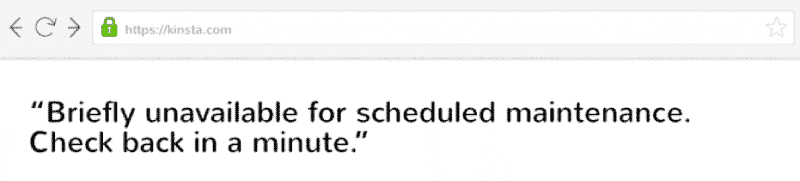
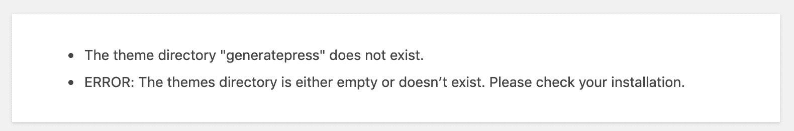
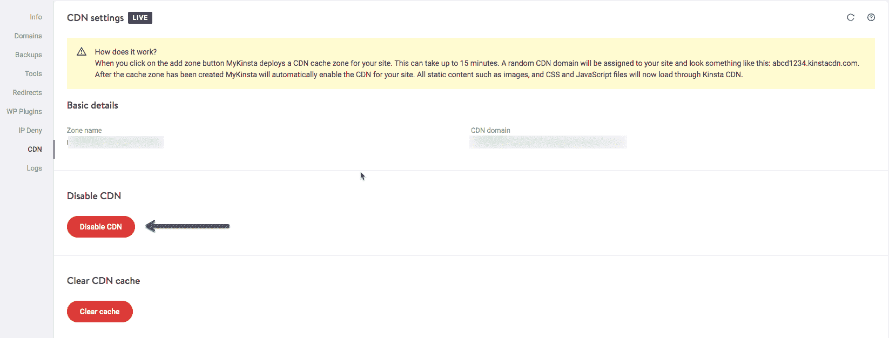
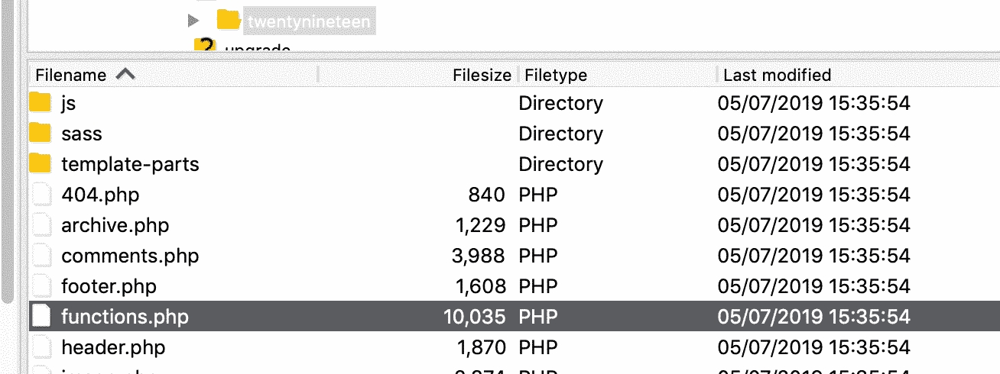
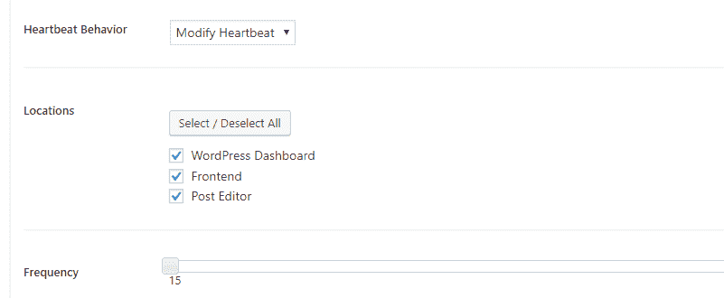
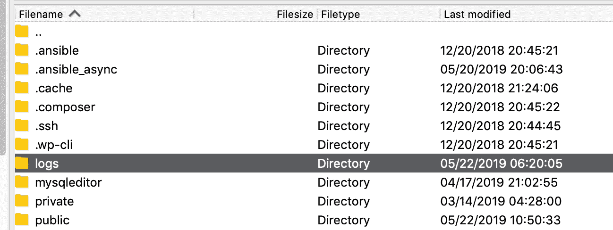

# 如何修复在 WordPress 中不可用的 HTTP 错误 503 服务

> 原文：<https://kinsta.com/blog/http-error-503/>

在你的 WordPress 网站上遇到错误可能是令人生畏的。然而，[大多数错误](https://kinsta.com/blog/http-status-codes/)会给你一些导致它们的线索，这可以使解决[这些常见问题](https://kinsta.com/blog/wordpress-errors/)容易得多。不幸的是，503 错误并不那么礼貌，它没有给你太多的信息。

这有助于理解 WordPress 中 503 错误的最常见原因。之后，您需要有条不紊地排除错误，这意味着要遵循几个步骤来定位根本原因。


## 什么是 HTTP 503 服务不可用错误？

WordPress 中的 503 错误表示您的网站目前无法访问，因为有问题的服务器不可用。这可能是因为它太忙，正在维护，或者其他需要更深入分析的原因。

Support

在本文中，我们将介绍什么是 503 错误以及它通常是如何表现的。然后，我们将指导您完成六个步骤来进行故障排除。我们开始工作吧！

## 什么是 HTTP 错误 503？

互联网工程任务组(IETF)将 [503 服务不可用](https://tools.ietf.org/html/rfc7231#section-6.6.4)定义为:

> *503(服务不可用)状态代码表示，由于临时过载或定期维护，服务器目前无法处理请求，这种情况可能会在延迟一段时间后得到缓解。服务器可以发送重试后报头字段，以建议客户端在重试请求之前等待的适当时间量。*

当您遇到 503 错误时，这意味着有问题的服务器不可用。例如，这可能是因为它太忙了，或者它正在维护中。与其他类似的错误代码不同，503 表示您的网站在线并正在运行，但目前无法访问。


> 需要在这里大声喊出来。Kinsta 太神奇了，我用它做我的个人网站。支持是迅速和杰出的，他们的服务器是 WordPress 最快的。
> 
> <footer class="wp-block-kinsta-client-quote__footer">
> 
> 
> 
> <cite class="wp-block-kinsta-client-quote__cite">Phillip Stemann</cite></footer>

[View plans](https://kinsta.com/plans/)

这个错误令人烦恼的地方在于，它几乎没有给你任何信息。大多数时候，它只是显示一条“**服务暂时不可用**”的消息。这相当于通过电话给一家餐馆打电话，结果他们告诉你他们关门了，却拒绝告诉你他们什么时候重新开门。

如果你幸运的话，503 错误代码会出现，因为你的 WordPress 网站正在维护中。当你更新插件、主题或核心软件时，WordPress 会非常短暂地将你的网站设置为[维护模式](https://kinsta.com/blog/wordpress-maintenance-mode/):



Maintenance mode


通常，这种暂停时间非常短暂，没有人会注意到。然而，在 503 错误仍然存在的情况下，您将有一个更大的问题要处理。毕竟，不仅用户将无法访问你的网站，你也将无法访问你的 WordPress 管理区。这意味着你不能以任何方式更新你的网站，为了解决这个问题，你需要挖掘它的文件。

### 查看我们的[视频指南](https://www.youtube.com/watch?v=O89MS6j0gJE&t=187s)到 503 错误


### 503 误差变化

503 错误可以以多种方式出现。然而，几乎每一个变化都伴随着 503 代码，使其易于识别。

根据您的服务器配置和浏览器，以下是您可能会遇到的一些变化:

*   503 服务不可用
*   503 服务暂时不可用
*   HTTP 服务器错误 503
*   HTTP 错误 503
*   错误 503 服务不可用
*   由于维护停机或容量问题，服务器暂时无法满足您的请求。请稍后再试。

无论您遇到的代码看起来像什么，这意味着您需要在它对您的用户产生负面影响之前快速开始工作。

[你在 WordPress 中遇到过 503 错误吗？真令人失望！😱遵循这 6 个步骤来修复它，让您的网站在几秒钟内恢复在线！ 点击推文](https://twitter.com/intent/tweet?url=https%3A%2F%2Fkinsta.com%2Fblog%2Fhttp-error-503%2F&via=kinsta&text=Have+you+ever+run+into+the+503+error+in+WordPress%3F+That%27s+a+bummer%21+%F0%9F%98%B1Follow+these+6+steps+to+fix+it+and+get+your+site+back+online+in+no+seconds%21&hashtags=wordpresshelp%2Cwebdev)


## 如何修复 WordPress 中的 503 错误(6 个步骤)

因为在任何给定的情况下，您通常都不能确定是什么导致了 503 错误，所以您需要有条不紊地进行故障排除。接下来的六个部分分别介绍了一个潜在的修复方法，旨在解决不同的潜在根本原因。

在每一步之后，花一点时间回到你的网站，看看 503 错误是否消失了。如果是，则说明您已经成功解决了该问题。如果没有，请继续下一步。

### 1.暂时停用你的 WordPress 插件

WordPress 中 503 错误最常见的原因之一是插件兼容性问题。要确定这是不是真的，你需要禁用你网站的所有插件。

由于 503 错误阻止你访问 WordPress 管理区，你需要使用一个 [FTP 客户端](https://kinsta.com/blog/best-ftp-clients/)来完成这个步骤。如果你还没有设置，我们推荐 [FileZilla](https://kinsta.com/blog/best-ftp-clients/#Filezilla) 。

一旦你的 FTP 客户端准备好了，通过它连接到你的网站并导航到你的 WordPress 根文件夹。万一找不到，一般叫 public_html，html，public，www，或者你网站的名字。如果你是 Kinsta 的客户，它就是你的公共文件夹。


WordPress root folder SFTP


打开该文件夹，并导航到 wp-content 目录。在里面，你会看到一个名为 *plugins* 的文件夹，其中包含安装在你的站点上的每个插件的单独子目录(活动的和不活动的)。

您现在要做的是右键单击 plugins 文件夹，并将其重命名为其他名称。我们推荐 *plugins.old* 或者 *plugins.deactivated* ，这样你以后就很容易认出来了。


WordPress plugins folder renamed


WordPress 现在将无法找到你的任何插件。当这种情况发生时，它会自动禁用这些插件。

现在，试着进入你的 WordPress 仪表盘。如果 503 错误消失了，那么你可以假设你的一个插件是罪魁祸首。你所要做的就是找出是哪一个出了问题。

返回到 *wp-content* 目录，并正确地重命名您原来的插件文件夹。然后，你需要一个接一个地禁用你的插件，直到你找到罪魁祸首。

为此，打开 *wp-content/plugins* 目录。在里面，你会发现每个插件都有一个文件夹。您要遵循的流程与之前基本相同:

1.  从第一个文件夹开始，根据自己的喜好将其重命名。
2.  检查您的网站，看看错误是否已经消失。
3.  如果不是，将上一步中的插件文件夹恢复为其原始名称。
4.  重复以上步骤，移动到列表中的下一个插件。

如果你有很多插件，这个过程可能需要一段时间，但是依次检查每个插件是至关重要的。如果你在任何时候发现了导致错误的插件，你可以卸载它或者用另一个工具替换它。

如果您完成了这些步骤却没有找到解决方案，您可以进入下一个故障诊断阶段。


### 2.停用你的 WordPress 主题

既然你已经排除了插件是 503 错误的原因，那么是时候对你的活动主题做同样的事情了。事实上，你的主题也可能产生兼容性问题。

不幸的是，这个过程与上面的不一样。WordPress 不会恢复到默认的主题，如果只是简单地重命名主题文件夹，你会得到一个错误，比如“主题目录”主题名称“不存在”或者，如果您试图重命名整个主题目录文件夹，您最终会得到“错误:主题目录要么是空的，要么不存在。请检查您的安装。



The theme directory does not exist error


因此，你需要通过登录 [phpMyAdmin](https://kinsta.com/help/wordpress-phpmyadmin/) 来访问你的 [WordPress 数据库](https://kinsta.com/knowledgebase/wordpress-database/)。如果你是 Kinsta 的客户，这可以在 MyKinsta 仪表板的“信息”部分找到。


MyKinsta phpMyAdmin


点击进入“wp_options”表，然后点击“Search”选项卡。您需要在“选项名称”下搜索**模板**。

## 注册订阅时事通讯


### 想知道我们是怎么让流量增长超过 1000%的吗？

加入 20，000 多名获得我们每周时事通讯和内部消息的人的行列吧！

[Subscribe Now](#newsletter)


phpMyAdmin wp_options table


在“选项值”栏下，你会看到你的主题的当前名称。将此更改为默认主题之一，如“twenty 19”


wp_options template name


再次检查您的网站，看看这是否已经修复了错误。如果是的话，这仅仅意味着你的 WordPress 主题有问题，你可能需要重新安装或者恢复到你最近的备份。

### 3.暂时禁用您的内容交付网络(CDN)

有时，503 错误不是因为您的网站有问题，而是因为您的内容交付网络(CDN)。如果你正在使用 CDN，一个快速的方法是暂时禁用它。

每个 CDN 都应该包含一些功能，使您能够暂停其服务。如果你在 Kinsta 上，你可以通过导航到 CDN→[MyKinsta 仪表盘](https://my.kinsta.com/)中的“禁用 CDN”来禁用[你的 Kinsta CDN](https://kinsta.com/help/kinsta-cdn/) :



MyKinsta CDN enable/disable option


根据您使用的 CDN，您需要遵循的流程可能会有所不同。众所周知，Cloudflare 有时也会导致 503 错误。如果您找不到暂停您的服务的选项，请查看您的服务知识库，其中通常包含详细的说明。

如果你不使用 CDN 或者发现暂停服务对你的问题没有帮助，还有一些修复方法可以尝试。请记住在继续之前重新激活您的 CDN。

### 4.限制 WordPress“心跳”API

WordPress Heartbeat 是一个内置在 WordPress 中的 API，平台使用它来自动保存内容，向你显示插件通知，让你知道别人正在处理你试图访问的帖子，等等。

就像有规律的心跳一样，API 以很高的频率在后台工作，这样就不会错过任何东西。可以想象，这个 API 会消耗服务器资源。通常，这不是问题，但在某些情况下，如果您的服务器无法处理负载，可能会导致 503 错误。

确定 Heartbeat API 是否是问题的核心的最快方法是暂时禁用它。要做到这一点，再次通过 FTP 连接到你的 WordPress 网站，然后打开你当前的主题文件夹，在下面的目录中寻找*functions.php*文件:



WordPress theme functions.php file


右键单击文件并选择*查看/编辑*选项，这将使用您的本地文本编辑器打开它。打开后，您需要在其中添加以下代码片段:

```
add_action( 'init', 'stop_heartbeat', 1 );
function stop_heartbeat() {
wp_deregister_script('heartbeat');
}
```

这三行代码告诉 WordPress 禁用 Heartbeat API。保存对*functions.php*文件的更改，关闭它，并尝试再次访问您的网站。

厌倦了处理停机时间和 WordPress 问题？Kinsta 支持每两分钟检查一次您网站的状态，以预测任何重大故障并主动采取行动。[查看我们的计划](https://kinsta.com/plans/?in-article-cta)

如果 503 错误消失了，您将知道 API 是问题所在。然而，完全禁用它会删除许多有用的功能。相反，我们建议你“放慢”心跳，这样就不会引起问题。

最简单的方法是安装[心跳控制插件](https://wordpress.org/plugins/heartbeat-control/)。激活插件并导航至*设置>心跳控制*部分。寻找*修改心跳*选项，将频率降到尽可能低的数字:



Heartbeat Control plugin frequency


保存对你设置的更改，并返回到你不久前修改的*functions.php*文件。要使上述更改生效，您需要删除之前添加的代码字符串，并将更改保存到文件中。

在这个阶段，如果心跳 API 是问题所在，那么 503 错误应该会消失。如果不是，那么是时候尝试一些不同的东西了。


### 5.增加服务器的资源

如果 503 错误仍然出现，尽管你尝试修复它，那么这个问题很可能是由于缺乏服务器资源。也就是说，你需要升级你的主机方案，看看是否能解决这个问题。如果你正在使用便宜的 WordPress 托管服务，这一点尤其正确，因为它们倾向于节流资源。

我们在金斯塔不这样做。我们提供优秀的托管 WordPress 托管服务(以及 T2 应用托管服务和 T4 数据库托管服务)。

然而，升级你的计划是一个重大的决定。明智的做法是首先联系你的虚拟主机支持服务，并与他们讨论 503 错误，以及迄今为止你所采取的尝试和解决它的步骤。支持团队应该能够帮助您找出原因，并建议您是否需要升级您的计划。

### 6.查看日志并启用 WP_DEBUG

您还应该利用您的[错误日志](https://kinsta.com/knowledgebase/wordpress-error-log/)。如果你是一个 Kinsta 客户端，你可以很容易地在日志查看器中看到错误，并在 MyKinsta 仪表板中[启用 WordPress 调试模式](https://kinsta.com/blog/wordpress-debug/#how-to-enable-wordpress-debug-mode-in-mykinsta)。这可以帮助你快速缩小问题范围，尤其是如果问题是由你网站上的插件引起的。


Check error logs for 503 errors


如果您的主机没有日志记录工具，您也可以将以下代码添加到 wp-config.php 文件中以启用日志记录:

```
define( 'WP_DEBUG', true );
define( 'WP_DEBUG_LOG', true );
define( 'WP_DEBUG_DISPLAY', false );
```

日志通常位于/wp-content 目录中。在其中，找到一个名为 *debug.log* 的文件并打开它。

其他人，比如金斯塔，可能有一个专门的文件夹叫做“日志”。



WordPress error logs folder (SFTP)


解释您的调试日志可能有点吓人，但它并不像您想象的那么难读懂。简而言之，日志包含了您的站点上按时间顺序弹出的每个错误。它显示了哪个文件导致了每个错误，以及涉及了哪些特定的代码行。

注意:你不会在你的日志中找到对 503 错误的直接引用。即便如此，如果所有这些都失败了，它可以通过向您显示哪些文件导致了问题，为您指出正确的方向。这样，你就知道下一步该把精力放在哪里了。正如我们在上一步中提到的，如果您需要进一步的帮助来解决这个错误，现在是与您的主机提供商取得联系的好时机。

您还可以查看 [Apache](https://kinsta.com/knowledgebase/what-is-apache/) 和 [Nginx](https://kinsta.com/knowledgebase/what-is-nginx/) 中的日志文件，它们通常位于以下位置:

*   **Apache:**/var/log/Apache 2/error . log
*   **nginux:**/var/log/nginnx/error . log

要了解更多，请查看我们的 [web 服务器对决:Nginx vs Apache](https://kinsta.com/blog/nginx-vs-apache/) 。

如果你是 Kinsta 的客户，你还可以利用我们的[分析工具](https://kinsta.com/help/mykinsta-analytics/)获得 503 个错误的总数，并查看它们发生的频率和时间。如果这是一个持续存在的问题，或者某个问题已经自行解决，这可以帮助您进行故障诊断。

如果由于致命的 PHP 错误而显示 503 错误，您也可以尝试启用 PHP 错误报告。只需将下面的代码添加到抛出错误的文件中。通常你可以在 Google Chrome DevTools 的控制台标签中缩小文件范围。

```
ini_set('display_errors', 1);
ini_set('display_startup_errors', 1);
error_reporting(E_ALL);
```

您可能还需要修改 php.ini 文件，如下所示:

```
display_errors = on
```

## 摘要

如果你够幸运的话，503 错误只会在你将网站置于维护模式时出现。然而，如果它出现时没有警告，那么你必须卷起袖子做一些故障诊断。

要找到 503 错误的根本原因，您需要按照以下步骤来修复它:

*   暂时停用你的 WordPress 插件。
*   停用你的 WordPress 主题。
*   禁用您的 CDN。
*   限制 WordPress 心跳 API。
*   增加您的服务器资源。
*   查看您的日志并启用 WP_DEBUG。

你在 WordPress 遇到过 HTTP 503 错误吗？在下面的评论区和我们分享你的经历吧！

* * *

让你所有的[应用程序](https://kinsta.com/application-hosting/)、[数据库](https://kinsta.com/database-hosting/)和 [WordPress 网站](https://kinsta.com/wordpress-hosting/)在线并在一个屋檐下。我们功能丰富的高性能云平台包括:

*   在 MyKinsta 仪表盘中轻松设置和管理
*   24/7 专家支持
*   最好的谷歌云平台硬件和网络，由 Kubernetes 提供最大的可扩展性
*   面向速度和安全性的企业级 Cloudflare 集成
*   全球受众覆盖全球多达 35 个数据中心和 275 多个 pop

在第一个月使用托管的[应用程序或托管](https://kinsta.com/application-hosting/)的[数据库，您可以享受 20 美元的优惠，亲自测试一下。探索我们的](https://kinsta.com/database-hosting/)[计划](https://kinsta.com/plans/)或[与销售人员交谈](https://kinsta.com/contact-us/)以找到最适合您的方式。