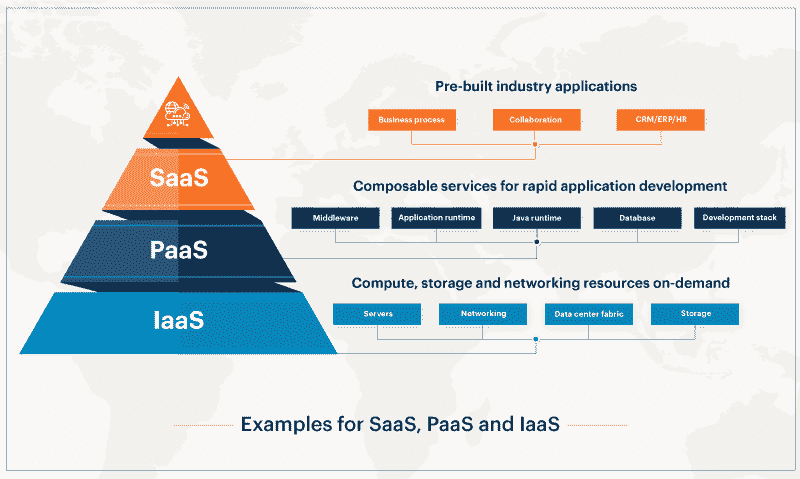
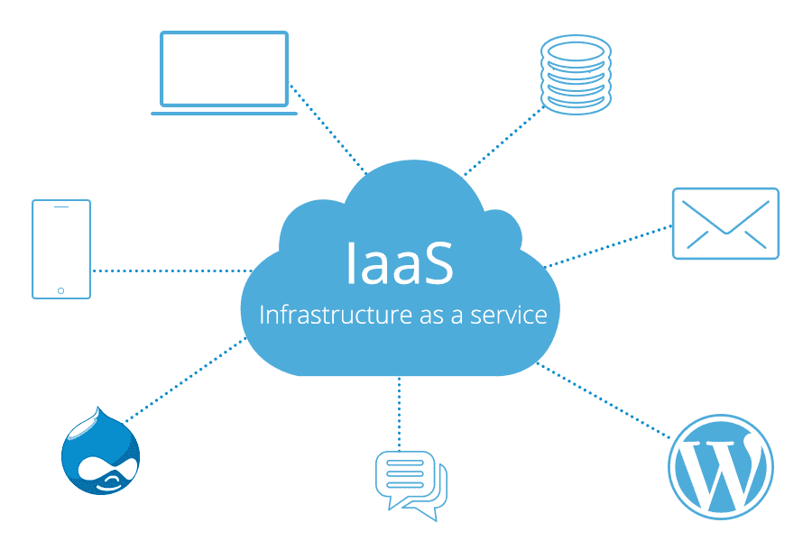
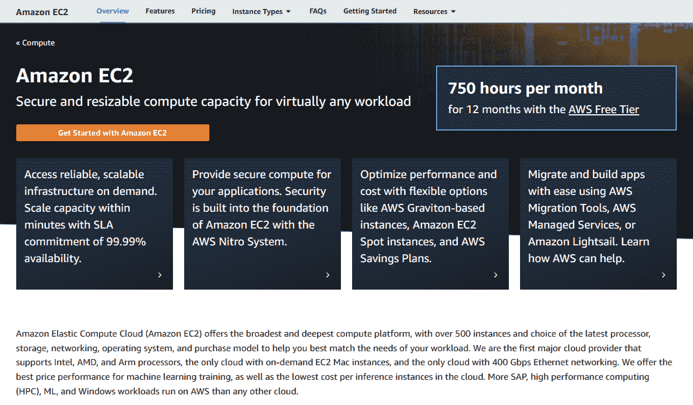
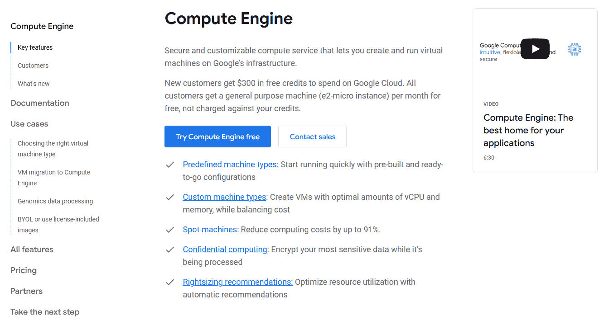
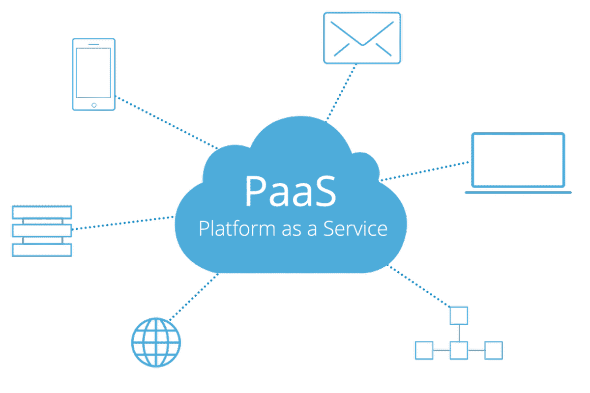
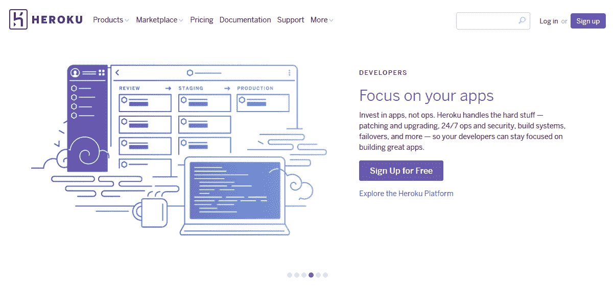
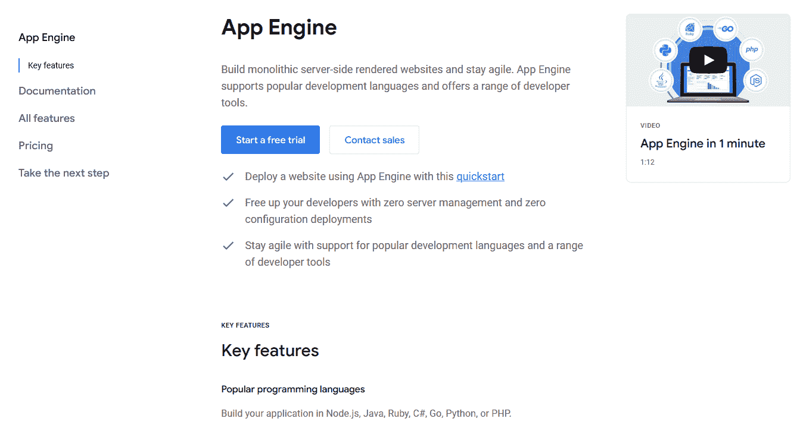
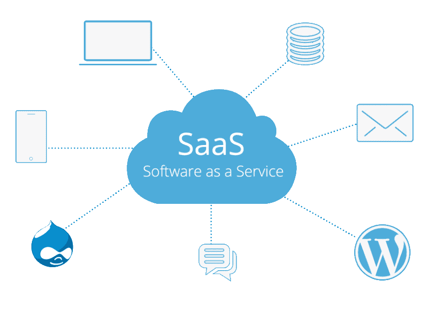
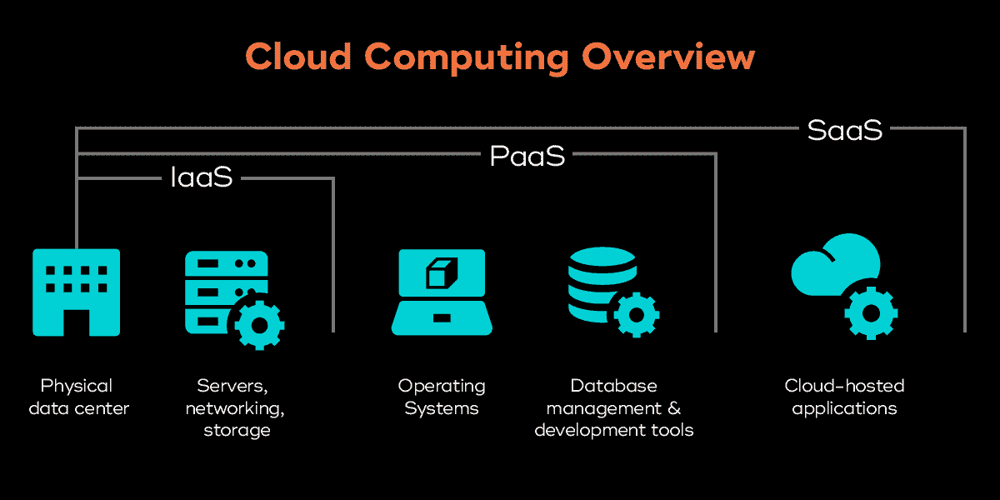

# IaaS vs PaaS:有什么区别？

> 原文:# t0]https://kinta . com/blog/iaas-vs-PAAs/

术语 IaaS 和 PaaS 几乎是可以互换的——尽管它们不能互换。那么它们之间有什么区别呢？

虽然你可能听说过[软件即服务(SaaS)](https://kinsta.com/blog/saas-marketing/) ，但 IaaS 和 PaaS 在特定的技术社区之外却鲜为人知。分别简称为*基础设施即服务*和*平台即服务*，这些工具和 SaaS 一起[通过云交付资源](https://kinsta.com/topic/cloud-computing-platforms/)。然而，是交付的资源类型造成了所有的差异。

但是你应该选择哪一个呢？请继续阅读，我们将深入探讨每种工具，并重点介绍 IaaS 与 PaaS 的[主要差异](https://kinsta.com/blog/types-of-cloud-computing/)和最佳用途。

## 什么是 IaaS？

SaaS vs IaaS vs PaaS (**Source:** [eG Innovations](//www.eginnovations.com/blog/saas-vs-paas-vs-iaas-examples-differences-how-to-choose/%E2%80%9D))

[基础设施即服务(IaaS)](https://kinsta.com/blog/what-is-iaas/) 有时也称为基础设施云服务，为用户提供基于云的数字基础设施替代方案，例如用于存储和虚拟化的服务器。

WordPress hosting and other services provided by an IaaS (**Source:** [FileCloud](//www.filecloud.com/blog/2020/03/what-is-iaas-infrastructure/%E2%80%9D))

这些资源中的大部分传统上位于内部，许多企业已经采用 IaaS 和类似的云解决方案来降低成本，同时提高灵活性。

> Kinsta 把我宠坏了，所以我现在要求每个供应商都提供这样的服务。我们还试图通过我们的 SaaS 工具支持达到这一水平。
> 
> <footer class="wp-block-kinsta-client-quote__footer">
> 
> 
> 
> <cite class="wp-block-kinsta-client-quote__cite">Suganthan Mohanadasan from @Suganthanmn</cite></footer>

[View plans](https://kinsta.com/plans/)

这些好处来自允许用户“按需付费”的提供商。因此，公司将其基础架构支出限制在他们需要的范围内，同时避免了昂贵的内部维护和保养。

虽然这些优势对于其他[云计算服务](https://kinsta.com/blog/best-cloud-storage/)来说是常见的，但它们对基础设施尤其有影响——尽管基础设施是主要的内部成本中心，但这一点往往没有得到充分利用。

但是怎样才能成为一个好的 IaaS 提供商呢？在下一节中，我们将探讨一个可靠的 IaaS 所共有的一些基本特征，以及一些 IaaS 的实际例子。

[The terms IaaS and PaaS are thrown around almost interchangeably — even though they’re anything but. 😅 Learn the key differences here 🚀Click to Tweet](https://twitter.com/intent/tweet?url=https%3A%2F%2Fkinsta.com%2Fblog%2Fiaas-vs-paas%2F&via=kinsta&text=The+terms+IaaS+and+PaaS+are+thrown+around+almost+interchangeably+%E2%80%94+even+though+they%E2%80%99re+anything+but.+%F0%9F%98%85+Learn+the+key+differences+here+%F0%9F%9A%80&hashtags=SaaS%2CPaaS)

### 特征

IaaS 平台有几个区别于其他云服务和传统基础设施的特征。一般来说，这个想法是提供比内部基础设施更好的灵活性和经济性**。**

*   **Just the infrastructure:** When you use an IaaS, you’re [renting a part of a server](https://kinsta.com/knowledgebase/shared-hosting/) from your IaaS provider. Unless you pay for a [dedicated server](https://kinsta.com/knowledgebase/dedicated-server/) or rack, this means you’re sharing the same server with other users and companies paying for the same service.

    虽然这听起来有点拥挤，但这是共享和分配服务器资源的一种非常有效的方式。单个服务器中的资源可以根据需要动态分配给多个用户，而不仅仅是将整个服务器出租给单个用户。换句话说，服务器的任何部分都不会被利用不足，从而允许 IaaS 提供商收取更低的费用。

    正是这种模式使得 IaaS 变得经济、灵活并且[可扩展](https://kinsta.com/help/scalable-cloud-hosting/)。由于资源是虚拟分配的，获得更多(或更少)的服务器空间或内存只是一个请求。这意味着，随着需求和要求的变化，您可以增加或减少您的资源。将这种灵活性与内部服务器进行比较，无论使用多少，内部服务器都具有相同的成本和限制。

*   **Accessible online by multiple users:** Though every IaaS provider has a unique dashboard or interface, all of them provide their services through the internet.

    虽然这一特性适用于所有云服务，但在围绕 IaaS 平台规划堆栈或工作流时，记住这一点尤为重要。因为使用 IaaS 意味着您将通过仪表板或 API 访问关键基础设施，所以您可能需要围绕它进行规划。

    谢天谢地，这是一个主要的好处。通过在多个接口上分发相同的服务，IaaS 提供商确保所有用户都能完全访问(并完全控制)他们的计算基础设施。

*   **Pay-as-you-go pricing:** As an extension of offering a flexible service, most IaaS providers also offer flexible pricing.

    通常，大多数 IaaS 提供商按使用小时数收费。该指标分为两个主要部分:(I)消耗的资源和(ii)使用的小时数。正如您可能想象的那样，这两个变量都是灵活的，大多数提供商对长时间的小资源消耗和短时间的大资源消耗都收取适度的费用。这里，资源消耗可能是每小时使用的 RAM(内存)、以千兆字节(GB)为单位的存储，等等。

虽然确切的定价模式因提供商而异，但 IaaS 几乎总是比维护您自己的基础架构更具成本效益。

### 例子

如果您已经购买了 IaaS 平台，您可能已经遇到了这些流行的例子之一。

#### 亚马逊 EC2

最早的 IaaS 提供商之一， [Amazon](https://kinsta.com/blog/aws-vs-azure/) 弹性计算云(EC2)提供由全球超过 77 个数据中心支持的可扩展云基础设施。

Amazon EC2

Amazon EC2 之所以成为 IaaS，是因为它在云中提供了“裸机”基础设施。

换句话说，没有操作系统、软件等的虚拟服务器空间。这允许用户使用和比较他们选择的操作系统，甚至启动虚拟机的多个实例。

#### 谷歌计算引擎

就像亚马逊 EC2 一样，[谷歌](https://kinsta.com/blog/google-cloud-hosting/)计算引擎为在云中启动虚拟服务器和其他基础设施提供服务器空间。

Google Compute Engine

像任何其他 IaaS 服务一样，谷歌计算引擎允许用户使用自己的操作系统和软件在谷歌的基础设施上运行虚拟机。同样，该服务是云中的“裸机”硬件，用户可以根据自己的需求进行定制。

### 优点和局限性

在设置基础设施时，IaaS 提供了无与伦比的灵活性和可伸缩性。然而，这并不意味着它总是正确的选择——灵活性或可伸缩性也不总是每种情况下最重要的因素。

#### IaaS 优势

IaaS 的一些优势包括:

*   **Lower cost:** IaaS presents many areas for [cost savings](https://kinsta.com/wordpress-hosting/). The biggest of these savings is the eliminated overhead of purchasing and maintaining physical infrastructure.

    例如，在高性能服务器机架的设备和维护成本可能高达数千美元的情况下，IaaS 已被证明可以在五年内降低高达 [79%](https://www.sherweb.com/blog/cloud-server/total-cost-of-ownership-of-servers-iaas-vs-on-premise/) 的 IT 成本。结合扩展时的额外节省，IaaS 通常是许多 IT 预算的救星。

*   **Less maintenance:** No matter how reliable, servers require ongoing maintenance to guarantee the right performance and adequate security. Though necessary, this maintenance is also very expensive, often requiring entire IT teams to manage the infrastructure.Between routine maintenance, troubleshooting, and administration, in-house infrastructure can be a massive [money sink](https://kinsta.com/blog/sysadmin/). By contrast, using an IaaS cuts nearly all of these tasks by replacing all maintenance teams with the IaaS provider.

    这一优势对于需要遵守安全要求的公司尤其重要。维护内部基础设施可能需要无数小时的审计和合规程序，一些 IaaS 提供商可以为您处理所有这些。

*   **更易访问:**现在，服务器管理和维护以直观的仪表盘和 API 的形式出现，您不再需要(或不需要)IT 专家来管理您的基础架构。
*   **易于扩展:**无论是向上扩展还是向下扩展，IaaS 都会始终为您提供您所需要的东西，即使这些需求会定期发生变化。您还可以替换和更改现有的解决方案，而不会在硬件投资或耗时的过渡上造成损失。

#### IaaS 限制

考虑 IaaS 的一些潜在缺点也很重要:

*   **新的安全风险:**将您的基础设施从现场迁移到云中会带来一些新的[网络攻击](https://kinsta.com/blog/zero-day-exploit/)。虽然大多数成熟的提供商拥有出色的[云安全](https://kinsta.com/blog/cloud-security/)，但是组织仍然应该研究和跟踪这些新的安全威胁。由于提供商服务器的漏洞超出了您的控制范围，因此建立灾难恢复和补救策略尤为重要。
*   **与传统系统的不兼容性:**虽然大多数 IaaS 服务都提供了广泛的兼容性，但对传统软件的支持有时会失败。在进行转换之前，一定要确保您选择的 IaaS 提供商能够支持您的堆栈！
*   **训练障碍:**切换到一个新系统总是伴随着一个学习曲线。转向 IaaS 平台意味着您需要在员工培训上投入时间和金钱。

## 什么是 PaaS？

IaaS 仅提供虚拟硬件，平台即服务( [PaaS](https://kinsta.com/blog/what-is-paas/) )还提供软件和框架，用于在云中构建应用。

Email and other apps provided by a PaaS (**Source:** [Iron.io](//blog.iron.io/what-is-platform-as-a-service/%E2%80%9D))

尽管将 PaaS 视为 IaaS 的更全面版本可能会有所帮助，但它同样可以被视为 SaaS 的另一种风格——这两种假设都是正确的。

本质上，PaaS 是虚拟硬件(IaaS)和虚拟软件(SaaS)之间的一种“中间地带”，它提供了在虚拟硬件上构建虚拟软件的工具。

## 注册订阅时事通讯

### 想知道我们是怎么让流量增长超过 1000%的吗？

加入 20，000 多名获得我们每周时事通讯和内部消息的人的行列吧！

[Subscribe Now](#newsletter)

当然，像任何云服务一样，PaaS 可以通过互联网访问。你所访问的内容才是最重要的。现在让我们深入了解 PaaS 的独特特征，以及它与其他云服务的区别。

### 特征

PaaS 平台与 IaaS 等其他云服务有许多相同的特征和优势。然而，总的想法是为支持应用和软件的平台提供同样的灵活性和可伸缩性。

*   **Flexible app development:** If you’ve ever [built an app or developed software](https://kinsta.com/blog/open-source-database/), you know how important it is to test it under a wide range of circumstances. Where testing would otherwise be cumbersome using physical servers, PaaS can set up multiple environments in an instant.This characteristic is useful for many reasons. What powers this easy [app development](https://kinsta.com/blog/node-js-apps/) and testing is the smooth app deployment that PaaS offers. Here, where on-site servers would have to be specially configured for every deployment, PaaS allows [developers](https://kinsta.com/knowledgebase/dev-features/) to set up custom configurations and multiple deployments in an instant.

    正如我们将在下一点中看到的，PaaS 的灵活性也源于与其他服务的轻松集成。在任何情况下，PaaS 通过将服务器和部署管理卸载给提供商，使开发变得容易。

*   **服务集成:**作为 [app 托管](https://kinsta.com/blog/what-is-web-hosting/)的一部分，大部分 PaaS 云平台也支持与 web 服务和数据库的集成。无论是运行 [Java 环境](https://kinsta.com/blog/php-vs-javascript/)还是与机器学习框架集成，PaaS 都让开发者能够构建和使用他们需要的环境。
*   **Pre-configured environments:** Speaking of environments, setting up a development environment from scratch is one of the biggest hassles of building an app. That’s especially true if you have to develop or test across multiple environments for different use cases.

    虽然开发人员肯定可以使用 PaaS 设置自定义环境，但许多 PaaS 平台已经配备了预配置的环境。结合近乎即时的部署，这一特性使得测试、部署和托管应用变得非常容易，而不会耗尽 it 资源。

*   **可供多个用户在线访问:**与任何其他云技术一样，PaaS 可供多个用户通过互联网访问。这对分布式开发团队来说是一个很大的好处，尤其是那些不得不通过远程方式如[VPN](https://kinsta.com/blog/how-does-a-vpn-work/)连接到内部资源的团队。多用户支持也有助于确保每个人都了解最新的发展。

### 例子

随着软件和应用开发的持续繁荣，PaaS 平台已经变得非常受欢迎。这里有两个你可能听说过(甚至用过)的很棒的例子。

#### Heroku

专为应用程序开发而构建的, [Heroku](https://www.heroku.com/) 是一个 PaaS，它使开发人员能够轻松构建和部署应用程序。

Heroku

尽管 Heroku 最初是为 Ruby 编程语言开发的，但现在它几乎支持从 Java 到 Python 的每一种主要语言。

Heroku 不仅非常方便原型制作和共享，还支持全面的应用部署。作为一个 PaaS，Heroku 为开发者提供了全方位的环境，没有服务器维护的麻烦。

#### 谷歌应用引擎

谷歌计算引擎只提供服务器基础设施，而应用引擎扩展了[谷歌云](https://kinsta.com/blog/google-cloud-vs-aws/)来提供功能齐全的开发环境。

Google App Engine

作为一种 PaaS 服务，应用引擎负责设置服务器软件，并导入开发人员需要的任何框架或库。

与其他 PaaS 服务一样，我们的目标是虚拟化开发环境，否则使用现场硬件进行设置和管理将非常耗时。

Struggling with downtime and WordPress problems? Kinsta is the hosting solution designed to save you time! [Check out our features](https://kinsta.com/features/)

### 优点和局限性

像 IaaS 一样，PaaS 提供了非凡的灵活性和可伸缩性。然而，与 IaaS 和其他云服务一样，虚拟化仍然有其局限性。

#### PaaS 优势

以下是采用 PaaS 的一些主要优势:

*   **更简单的设置:**无论是设置开发环境还是托管成品 app，搭建自己需要的平台都很难从零开始。PaaS 解决方案不仅能为您设置一个环境，还能让您灵活地进行重大更改和部署其他环境，而无需手动完成繁重的工作。
*   **快速应用部署:**除了开发工具，PaaS 平台还可以轻松托管和测试应用。即使是 Heroku 的免费版本也允许开发者在网上公开他们的应用程序(尽管减少了处理)。
*   **减轻 IT 压力:**我们已经提到从头开始构建环境非常耗时，更不用说复杂、令人沮丧和资源密集型了。虽然许多开发人员建立了自己的环境，但在使用现场设备时，仍然需要 it 骨干。因此，迁移到云也减轻了 IT 人员和资源的压力，使他们能够专注于更重要的事情。
*   **节省成本和时间:**我们讨论的所有优势都可以节省大量成本和时间。从避免现场设备的初始投资到在长期维护上花费更少的时间和金钱，PaaS 是削减预算、节省时间和[提升性能](https://kinsta.com/blog/boosting-wordpress-performance/)的绝佳选择。

#### PaaS 限制

与 IaaS 一样，PaaS 也有自己的潜在缺点:

*   **数据安全风险:**使用第三方供应商进行数据存储存在固有的安全风险，PaaS 平台也不例外。您选择的提供商也可能会限制您可以使用的安全软件，这取决于它们的兼容性。
*   **不保证兼容性:**说到兼容性，您使用的一些应用程序可能并不总是与您选择的 PaaS 平台兼容。然而，这通常只是遗留系统的问题。
*   **并非总是优化:**由于其灵活性和可伸缩性，PaaS 平台并非总是针对特定语言、库或框架进行优化。当然，他们会完成工作，但他们可能不会像一些团队希望的那样调整得很好。

## IaaS 和 PaaS 对 SaaS

有时被称为云应用服务，软件即服务( [SaaS](https://kinsta.com/blog/saas-products/) )通过云提供软件。

WordPress hosting and other services provided by a SaaS (**Source:** [Medium](//medium.com/@pratyush.choudhury.bme16/saas-implified-6e0fd344225d%E2%80%9D))

IaaS 和 PaaS 都以这样或那样的方式处理服务器，而 SaaS 只处理托管软件和应用。尽管软件最终是托管在云服务器上，但服务器本身已经预先配置好运行它。

这意味着用户不必担心繁琐的安装和设备兼容性。只要他们能上网，他们就能使用这个软件。

然而，由于它们完全由第三方管理，SaaS 设置固有地涉及数据安全风险，IaaS 和 PaaS 都不会成为受害者。此外，SaaS 的便利性通常是以控制和定制为代价的。根据您的提供商，您的定制选项可能有限，对操作系统、服务器性能、资源分配和其他重要功能的控制甚至更少。

## IaaS 与 PaaS:各自的最佳用途

既然您已经知道了 Saas、IaaS 和 PaaS 之间的区别，那么您可能知道哪一种最适合您的需求。

The roles of IaaS, PaaS, and SaaS in cloud computing (**Source:** [Teradata](//www.teradata.com/Trends/Cloud/Intro-to-IaaS%E2%80%9D))

底线是一个不一定能取代另一个。相反，每个服务在云计算中扮演一个独特的角色。因此，适合您的服务取决于您对云服务的确切需求。

### 何时使用 IaaS

你想要云基础设施，你可以自己配置。IaaS 平台通过从第三方租赁空间，帮助您避免昂贵的开销以及现场服务器和其他基础架构的长期维护。

### 何时使用 PaaS

您希望在云中开发和部署自己的应用程序。PaaS 使得通过云建立开发环境和部署应用变得快速而简单。虽然您也可以使用 IaaS 来实现这一目的，但是 PaaS 是为您的语言、框架和库预先配置的。

(如果你认为这三个足够令人困惑，现在还有 [XaaS](https://kinsta.com/blog/xaas/) 要考虑！)

[They may look similar, but IaaS and Paas are unique in some key ways. 👀 Learn more here ✅Click to Tweet](https://twitter.com/intent/tweet?url=https%3A%2F%2Fkinsta.com%2Fblog%2Fiaas-vs-paas%2F&via=kinsta&text=They+may+look+similar%2C+but+IaaS+and+Paas+are+unique+in+some+key+ways.+%F0%9F%91%80+Learn+more+here+%E2%9C%85&hashtags=IaaS%2CPaaS) ## 摘要

IaaS 和 PaaS 都是将物理硬件、工作流和工具迁移到云环境的优秀资源。当然，一个并不比另一个更好。取而代之的是，每家公司都提供了一些其他公司没有的云计算的独特优势。

虽然 IaaS 看起来是虚拟主机的一个很好的选择，但是它可能需要更多的工作——特别是当你使用 WordPress 的时候。有了 Kinsta 的托管 web 主机，您可以获得云的所有好处，而不必担心 IaaS 设置和管理的技术方面。

如需了解更多信息，请查看我们的[应用托管](https://kinsta.com/application-hosting/)、[数据库托管](https://kinsta.com/database-hosting/)和[托管 WordPress 托管](https://kinsta.com/wordpress-hosting/)计划，或者[安排一次与 Kinsta 云专家的现场演示](https://kinsta.com/schedule-demo/)。

* * *

让你所有的[应用程序](https://kinsta.com/application-hosting/)、[数据库](https://kinsta.com/database-hosting/)和 [WordPress 网站](https://kinsta.com/wordpress-hosting/)在线并在一个屋檐下。我们功能丰富的高性能云平台包括:

*   在 MyKinsta 仪表盘中轻松设置和管理
*   24/7 专家支持
*   最好的谷歌云平台硬件和网络，由 Kubernetes 提供最大的可扩展性
*   面向速度和安全性的企业级 Cloudflare 集成
*   全球受众覆盖全球多达 35 个数据中心和 275 多个 pop

在第一个月使用托管的[应用程序或托管](https://kinsta.com/application-hosting/)的[数据库，您可以享受 20 美元的优惠，亲自测试一下。探索我们的](https://kinsta.com/database-hosting/)[计划](https://kinsta.com/plans/)或[与销售人员交谈](https://kinsta.com/contact-us/)以找到最适合您的方式。