# 如何将 Tumblr 导入 WordPress(快速简单)

> 原文：<https://kinsta.com/blog/import-tumblr-to-wordpress/>

你在 Tumblr 上写过博客吗？虽然它无疑是一个很好的微博平台，但它有些局限，尤其是当你把它与大多数其他内容管理系统和博客平台相比时。如果你想让你的博客更上一层楼，那么我们建议你把它移到 WordPress。

Tumblr 在首次发布时获得了很多关注。并且它仍然被一些流行的网站使用，比如[《实业家》](http://industryforever.com/)。但根据谷歌趋势，它在过去五年中一直在下降。据 W3Techs 统计，只有 0.1%的网站[使用 WordPress，而超过 43.3%的网站](https://w3techs.com/technologies/details/cm-tumblr/all/all)[使用 WordPress](https://kinsta.com/wordpress-market-share/)。

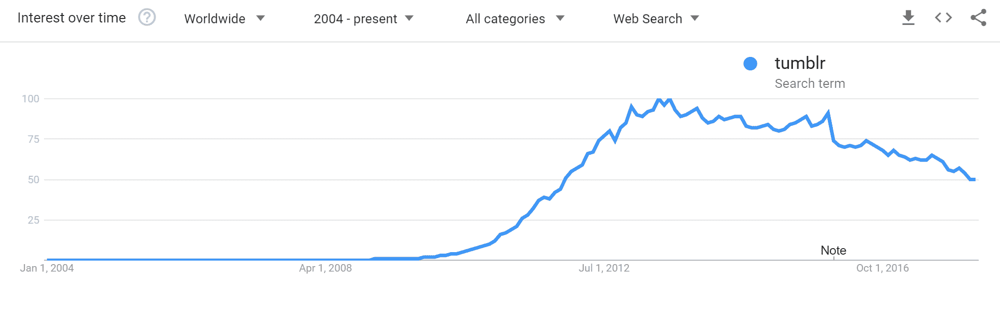

Tumblr trends (Image source: [Google Trends](https://trends.google.com/trends/explore?date=all&q=tumblr))

2019 年 8 月，Automattic(WordPress.com 背后的公司)[从威瑞森收购了 Tumblr](https://techcrunch.com/2019/08/12/verizon-is-selling-tumblr-to-wordpress-parent-automattic/) 。然而，目前，Tumblr 品牌将保持独立。

因此，WordPress 是博客作者的一个很好的选择，因为它是一个容易学习的平台，有很多可用的支持，并且你拥有自己的内容。更不用说你可以用成千上万的第三方插件和主题做任何你想做的事情。

如果你已经在 Tumblr 上写了一段时间的博客，你可能已经建立了一个很大的博客档案。不要担心，当你过渡到一个更加[先进的博客平台](https://kinsta.com/blog/best-blogging-platform/)时，你不必丢失你的任何工作。你可以**轻松将 Tumblr 导入 WordPress** 。

*   [选项 1–将内容从 Tumblr 导入 WordPress](#import-content-tumblr-to-wordpress)
*   [选项 2–Tumblr 到 WordPress 的自动迁移](#automate-tumblr-to-wordpress-migration)

## 选项 1–将内容从 Tumblr 导入 WordPress

导入是一个简单的过程，通常只需要几分钟，你就可以开始在自己的平台上建立你的博客了。以下是如何做到这一点，一步一步。

我们总是建议在进行任何类型的导入工作之前，对你的 WordPress 站点做一个[备份。这样，如果出现问题，您可以轻松地回滚。](https://kinsta.com/help/wordpress-backups/)

> 需要在这里大声喊出来。Kinsta 太神奇了，我用它做我的个人网站。支持是迅速和杰出的，他们的服务器是 WordPress 最快的。
> 
> <footer class="wp-block-kinsta-client-quote__footer">
> 
> 
> 
> <cite class="wp-block-kinsta-client-quote__cite">Phillip Stemann</cite></footer>

[View plans](https://kinsta.com/plans/)

### 第一步

从 WordPress 仪表盘，进入工具→导入。在该页面中，您可以选择导入几个不同的平台。点击 Tumblr 选项下的“立即安装”。这个插件实际上是由 WordPress 团队和贡献者开发的。它导入帖子、草稿、页面和媒体(音频、视频和图像帖子)。

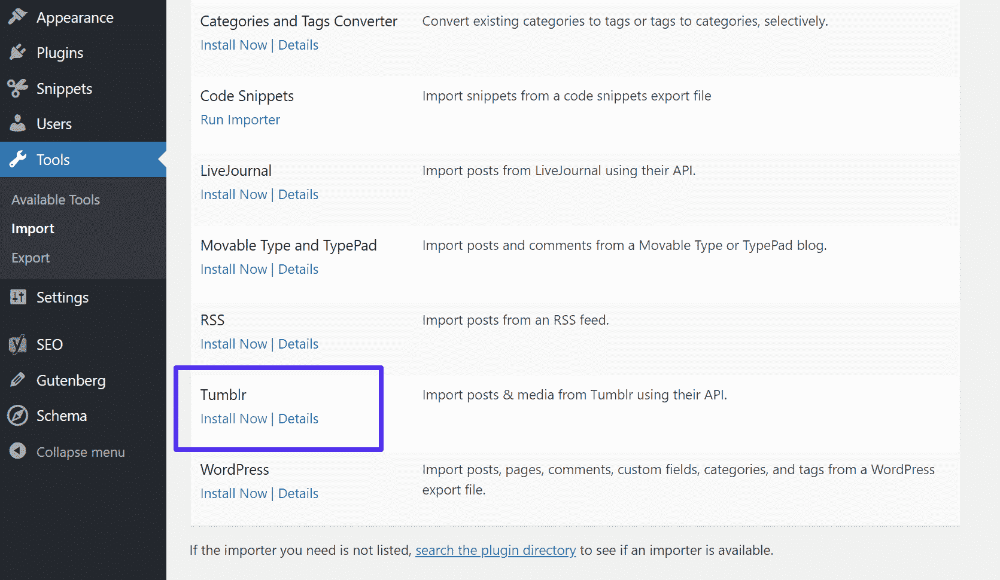

Tools import Tumblr

### 第二步

然后点击“运行导入程序”

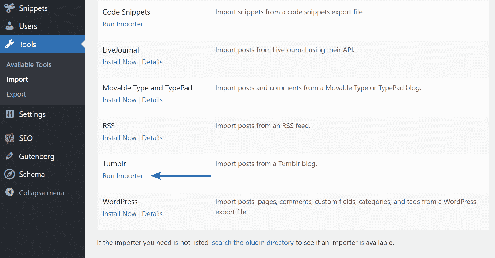

Tumblr run importer

### 第三步

在导入您的 Tumblr 博客之前，您必须创建一个 Tumblr 应用程序，作为您的 WordPress 站点和 Tumblr 服务器之间的连接点。导入 Tumblr 页面会提示你访问以下网址:[http://www.tumblr.com/oauth/apps](http://www.tumblr.com/oauth/apps "http://www.tumblr.com/oauth/apps")。

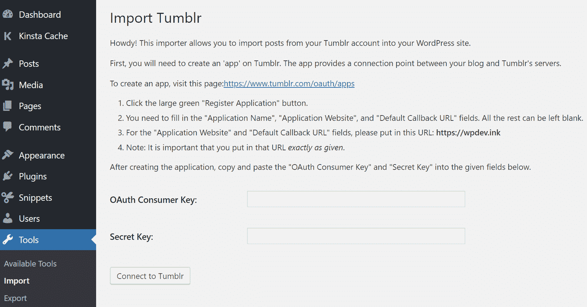

Import Tumblr settings

### 第四步

要创建应用程序，请进入 Tumblr 应用程序，点击绿色的“注册应用程序”按钮。

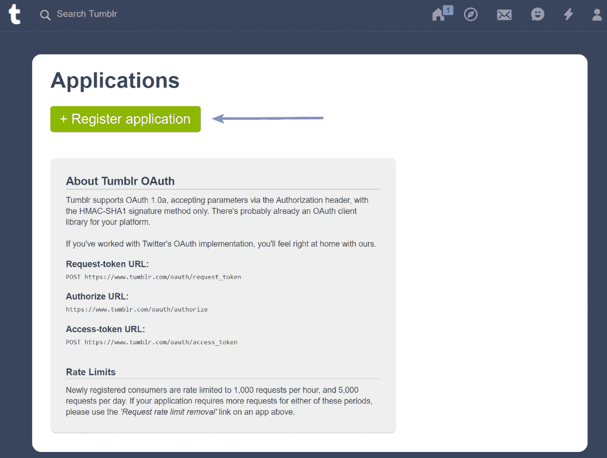

Register Tumblr application

### 第五步

要注册，您需要填写以下信息:

*   应用程序名称
*   应用网站
*   默认回拨 URL
*   应用程序描述
*   管理联系人电子邮件

其余字段可以留空。插件中导入 Tumblr 页面上的说明将为您提供应用程序网站和默认回调 URL(通常只是您的完整域名)的 URL。填写信息后，点击应用程序底部的注册。

## 注册订阅时事通讯

### 想知道我们是怎么让流量增长超过 1000%的吗？

加入 20，000 多名获得我们每周时事通讯和内部消息的人的行列吧！

[Subscribe Now](#newsletter)

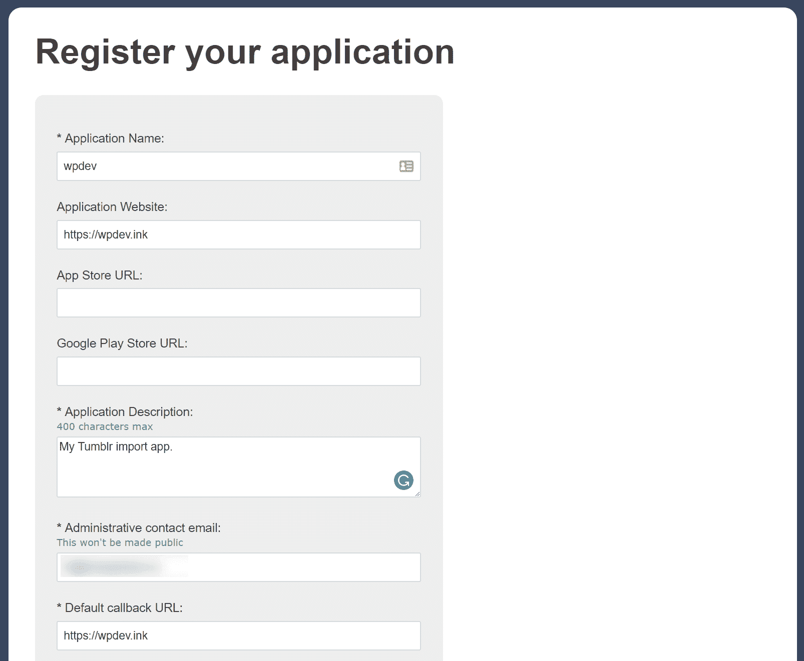

Tumblr application

注意:新注册的应用程序被限制为每小时 1，000 个请求，每天 5，000 个请求。如果您的应用程序在这两个时间段需要更多请求，您将能够在完成注册过程后请求取消速率限制。

### 第六步

您被重定向到的页面上有您的 OAuth 消费者密钥和秘密密钥。将这些内容添加回 WordPress 仪表盘的导入 Tumblr 页面，然后点击“连接到 Tumblr”

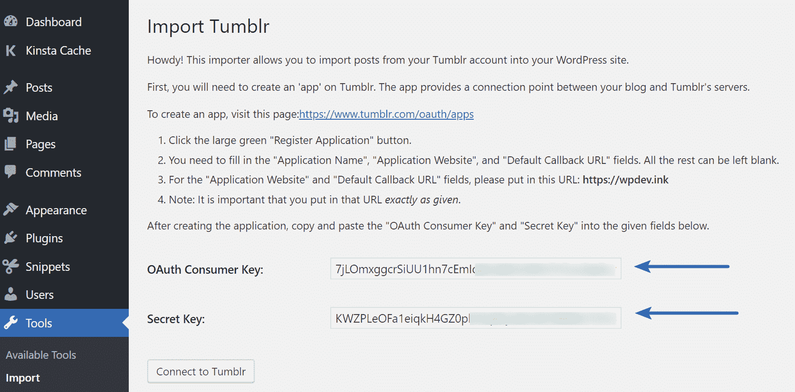

Tumblr application keys

### 第七步

点击“授权应用程序”

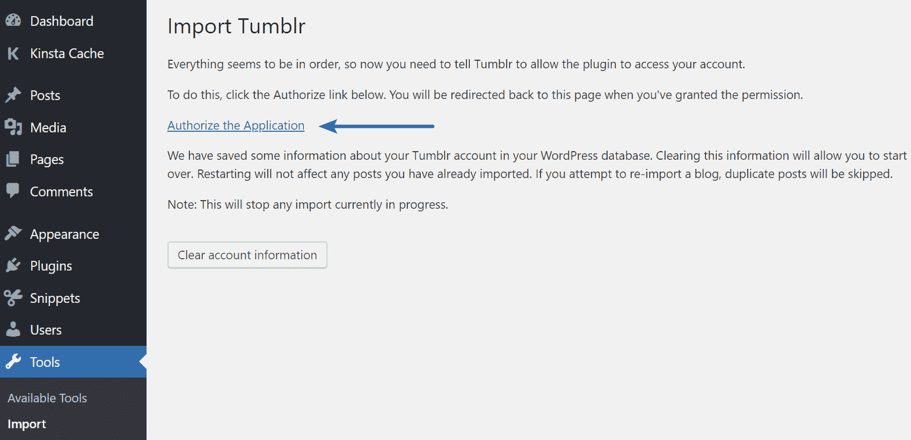

Tumblr authorize the application

### 第八步

然后你会被重定向到 Tumblr。他们会问你“这个应用程序可以访问你的一些数据并发布到你的账户吗？”点击“允许”

Struggling with downtime and WordPress problems? Kinsta is the hosting solution designed to save you time! [Check out our features](https://kinsta.com/features/)

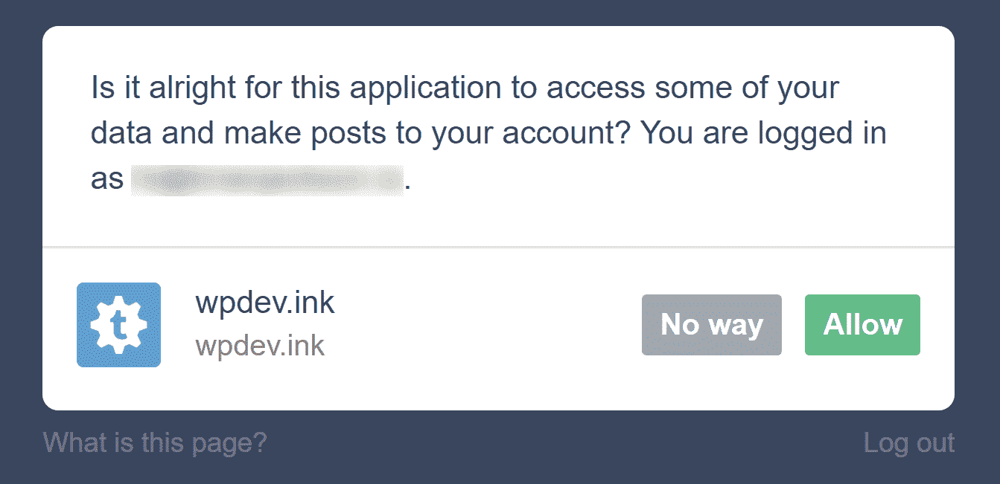

Authorize Tumblr

### 第九步

然后，您将看到与您的用户名和电子邮件地址相关联的 Tumblr 博客，以及有多少帖子将被导入。如果需要，您可以指定不同的作者。当你准备好导入你的 Tumblr 博客文章时，点击“导入博客”

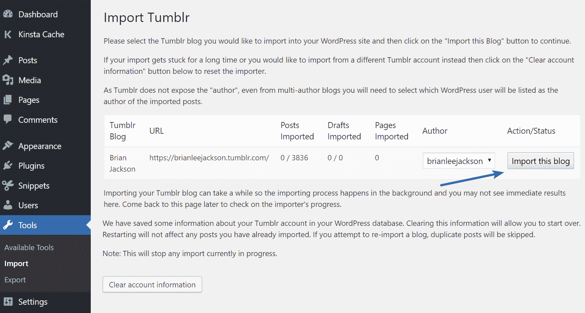

Tumblr import this blog

导入您的 Tumblr 博客可能需要一段时间，这取决于您的归档文件有多大。导入过程在后台进行，因此您可以返回“导入 Tumblr”页面查看导入程序的进度。一旦你所有的博客文章被导入，它们将会被列在你的 WP 管理→文章面板中。

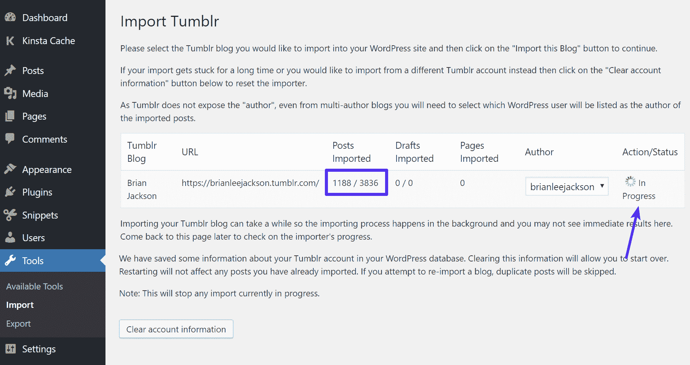

Tumblr import progress

WordPress 还允许你在完成后清除你的 Tumblr 账户信息。只需点击“清除账户信息”

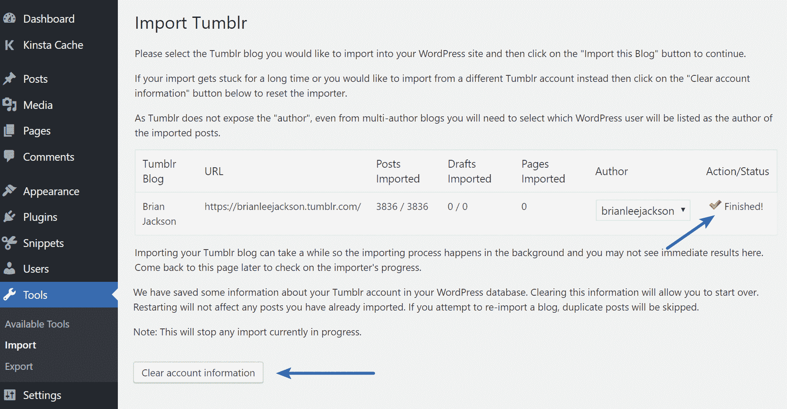

Finished Tumblr import

这不会影响你已经导入的任何文章，但是它可以让你重新开始或者导入另一个博客。如果您尝试导入同一个博客，任何重复的帖子都将被跳过。别忘了你的搜索引擎优化。如果你改变了域名和我们的网址，你需要[设置 301 重定向从 Tumblr 到 WordPress](https://robsobers.com/redirect-tumblr-post-urls-migrating-blog/) 。

## 选项 2–自动从 Tumblr 迁移到 WordPress

如果你对上述方法有任何问题，或者你需要更高级的映射选项，我们建议你查看 CMS2CMS 的 Tumblr 到 WordPress 迁移插件。这些人除了在各种 CMS 平台之间迁移之外什么都不做，所以他们已经经历了可能出错的每一件怪事。

[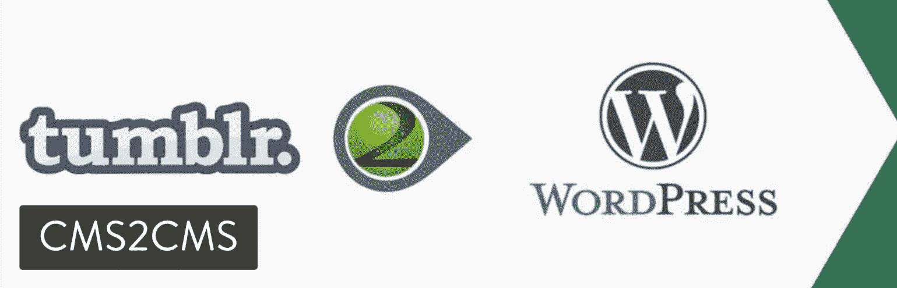](https://wordpress.org/plugins/cms2cms-automated-tumblr-to-wp-migration/)

CMS2CMS Tumblr to WordPress Import plugin

该插件实际上是免费的，将允许您在完成数据迁移之前完成一个演示迁移，看看它是如何工作的。价格取决于你从 Tumblr 转移到 WordPress 的数据量。这个插件比默认导入器有更多的特性，例如:

*   数据映射选项，允许您选择要移动的内容。
*   迁移页面、帖子、附件(图像和视频)以及内容正文中包含的图像。
*   你可以利用搜索引擎友好的网址。
*   迁移关键字和元数据/ [元描述](https://kinsta.com/blog/meta-description-wordpress/)。

他们甚至会从你现有的 Tumblr 网站设置 301 重定向到你的新 WordPress 网站。这是留住你的 [SEO](https://kinsta.com/blog/wordpress-seo/) 链接汁的重要一步。

## 摘要

Tumblr 对刚起步的人来说可能很棒，但是一旦你认真起来，你就会想要一个你可以控制的平台。看看为什么你应该使用 WordPress 的另外 10 个理由[。](https://kinsta.com/blog/why-use-wordpress/)

既然你已经将所有 Tumblr 上的精彩文章导入到新的自托管 WordPress 网站，你可以专注于建立你的博客了。你拥有内容并控制网站。现在去用你 Tumblr 博客上的所有内容做些了不起的事吧。

有什么问题吗？导入 Tumblr 博客时遇到任何问题？请在评论中告诉我们。

* * *

让你所有的[应用程序](https://kinsta.com/application-hosting/)、[数据库](https://kinsta.com/database-hosting/)和 [WordPress 网站](https://kinsta.com/wordpress-hosting/)在线并在一个屋檐下。我们功能丰富的高性能云平台包括:

*   在 MyKinsta 仪表盘中轻松设置和管理
*   24/7 专家支持
*   最好的谷歌云平台硬件和网络，由 Kubernetes 提供最大的可扩展性
*   面向速度和安全性的企业级 Cloudflare 集成
*   全球受众覆盖全球多达 35 个数据中心和 275 多个 pop

在第一个月使用托管的[应用程序或托管](https://kinsta.com/application-hosting/)的[数据库，您可以享受 20 美元的优惠，亲自测试一下。探索我们的](https://kinsta.com/database-hosting/)[计划](https://kinsta.com/plans/)或[与销售人员交谈](https://kinsta.com/contact-us/)以找到最适合您的方式。