# 如何增加 WordPress 的最大上传大小

> 原文：<https://kinsta.com/blog/increase-max-upload-size-wordpress/>

较低的 WordPress 上传大小限制会阻止你上传大文件、插件和主题。如果你正在建立一个媒体密集的网站，这可能是一个相当大的障碍。在这种情况下，有必要增加 WordPress 或你的服务器(或两者)的最大上传大小。

取决于你的主机提供商和服务器，有很多方法可以解决这个问题。我们将在这篇文章中涵盖所有这些，并向你展示如何快速增加 WordPress 中的最大上传大小。

让我们开始吧！

### 更喜欢看[视频版](https://www.youtube.com/watch?v=y7gXigngzUI)？

## WordPress 中的最大上传大小是多少？

将大文件上传到服务器会消耗大量服务器资源。为了防止用户导致服务器超时，WordPress 中默认的最大上传大小通常从 **4 MB** 到 **128 MB** 不等。通常，主机提供商在服务器级别设置这个限制。

WordPress 也包括定义这个限制的常量，但是在大多数情况下它们不能覆盖服务器级的设置。


### 信息

Kinsta 的默认最大上传文件大小设置为 **128 MB** 。


为了验证这一点，去你的 WordPress 网站的[媒体库](https://kinsta.com/blog/wordpress-media-library/)。这里，尝试上传一个超过最大上传文件大小限制的文件。您将看到一条类似如下的错误消息:

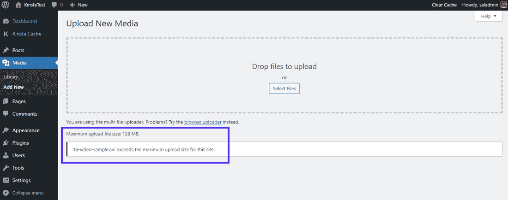

Error while uploading a large file in WordPress


“超过此站点的最大上载大小”错误可能会令人沮丧，但它的存在有两个主要原因:安全性和效率。它阻止网站所有者和其他用户(包括恶意行为者)上传大文件(例如，高分辨率图像、大视频)。

否则，它会导致你的网站服务器瘫痪，让你的网站爬行。或者更糟的是，它会让你的网站完全瘫痪！

[想要上传大型文件、插件或主题...但是受到最大上传大小的限制？🗂学习如何快速解决这一常见问题&轻松就在这里⬇️ 点击推文](https://twitter.com/intent/tweet?url=https%3A%2F%2Fkinsta.com%2Fblog%2Fincrease-max-upload-size-wordpress%2F&via=kinsta&text=Want+to+upload+a+large+file%2C+plugin%2C+or+theme...+but+limited+by+the+max+upload+size%3F%F0%9F%97%82+Learn+how+to+resolve+this+common+issue+quickly+%26amp%3B+easily+right+here+%E2%AC%87%EF%B8%8F&hashtags=WordPressTips%2CWPThemes)

## 如何在 WordPress 中检查当前最大上传大小

有很多方法可以检查你的 WordPress 站点当前的最大上传大小。让我们把它们都过一遍。

### 在媒体库中

检查你的网站当前最大上传大小的最快方法是去你的 WordPress 仪表盘，然后从那里去**媒体>图书馆**。在这里，点击**添加新的**按钮来激活媒体上传工具。

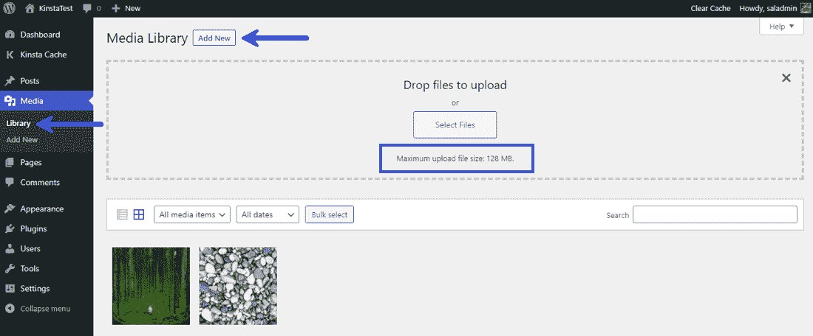

The “Maximum upload size limit” in WordPress


由于 Kinsta 是这个站点的主机，所以在**选择文件**按钮下面会显示`**Maximum upload file size: 128 MB.**`消息。如果您使用不同的虚拟主机提供商，您可能会看到这里列出的不同限制。

您也可以直接进入**媒体>添加新的**，并在底部看到相同的消息。

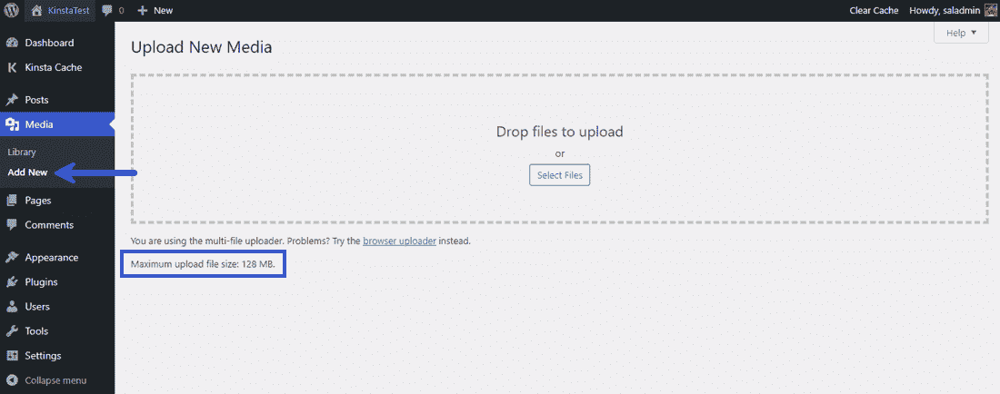

The “Maximum upload file size” in WordPress’ Media Library


同样，你可以在这里看到 **128 MB** 的最大上传文件大小。
T3】

### 在站点健康信息中

WordPress 5.2 增加了[站点健康信息](https://kinsta.com/blog/wordpress-5-2/#site-health-info)工具来帮助你[更好地调试你的 WordPress 站点](https://kinsta.com/blog/wordpress-debug/)。在这里，你可以找到几乎所有关于你的服务器和 WordPress 配置的信息。

由于服务器和 WordPress 都处理最大上传文件大小，有两种方法可以在这个屏幕上找到它的值。

首先，您可以在**媒体处理**下拉列表中找到它。这里，寻找`**Max size of an uploaded file**`常量的值。

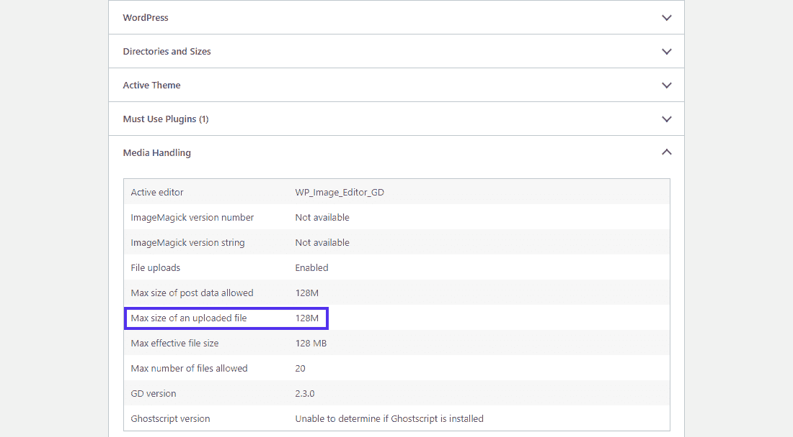

‘Media Handling’ settings in the ‘Site Health Info’ panel


第二种方法是在**服务器的**下拉列表中查找。你可以在这里找到许多与你的网络服务器设置相关的选项。请搜索`**Upload max filesize**`常量的值，看看它是什么。在这个网站上，最大上传文件大小限制是 **128 MB** 。


‘Server’ settings in the ‘Site Health Info’ panel


您还可以看到其他 PHP 常量及其值，例如:

*   **`PHP post max size` :** 定义了[帖子请求](https://kinsta.com/blog/wordpress-http-api-part-1/#method-names)的最大上传限制。
*   **`PHP memory limit` :** 定义了为 PHP 分配的内存。它应设置为等于或高于`**Upload max filesize**`限值。否则上传将会失败。

您的 web 主机设置这些选项。通常，[初级托管计划](https://kinsta.com/plans/)的上传大小限制比[企业托管计划](https://kinsta.com/enterprise-wordpress-hosting/)要小。一些主机可能允许您覆盖这些限制。但是在大多数情况下，你可能需要你的主机提供商的帮助(和[也许一个计划升级](https://kinsta.com/knowledgebase/wordpress-hosting-plans/))来增加它们。


## 为什么在 WordPress 中增加最大上传文件大小？

你可能需要增加你的 WordPress 站点的最大上传文件大小有很多原因。以下是最常见的几种:

*   你想通过 [WordPress 管理面板](https://kinsta.com/knowledgebase/wordpress-admin/)直接安装一个大型主题或插件。
*   [定期更新你的 WordPress 网站](https://kinsta.com/blog/evergreen-content/#5-update-your-content-occasionally-if-necessary)是吸引读者并吸引更多读者的好方法。这包括定期上传新的图片、视频、音频和其他媒体。然而，当你上传的文件有大小限制时，这并不总是可行的。
*   你想上传一个大的视频或者图片作为你的[站点的背景](https://kinsta.com/blog/wordpress-background-image/)或者标题。
*   你计划[直接从你的网站销售数字文件](https://kinsta.com/blog/easy-digital-downloads/)，比如电子书、照片、视频、主题和插件。有时，这些文件可能高达数百兆字节(或更多)。

现在我们已经介绍了 WordPress 中最大上传文件大小的基础知识，让我们学习如何增加它。

## 增加 WordPress 最大上传文件大小的 10 种方法

有很多方法可以解决 WordPress 最大上传大小的问题。我们将首先从最简单的开始，然后继续学习中级教程。

T3】

### 请联系您的主机提供商寻求帮助

如果你面临上传文件和文件大小限制的问题，向你的主机提供商寻求帮助是最快的解决方案之一。提高上传限制对于技术支持来说是一件小事，所以大多数主机公司可以帮助你快速解决这个问题。

修补您的服务器或站点配置文件总是一个挑战。因此，我们总是建议您首先尝试这种方法。

如果您使用 Kinsta 托管您的网站，我们知识渊博的支持团队[只需点击一下](https://kinsta.com/help/wordpress-support-ticket/)即可提供全天候服务。要开始，请转到 MyKinsta 仪表盘，点击右下角的聊天图标。

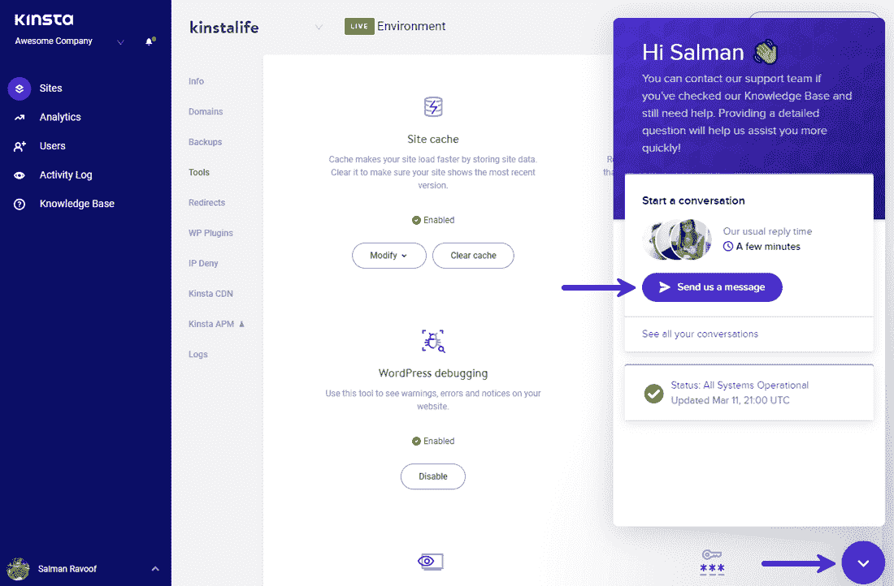

Contact Kinsta support easily through MyKinsta


我们有代表以多种语言为您提供帮助，包括英语、西班牙语、法语、德语、意大利语和葡萄牙语。
T3】

### 增加 WordPress Multisite 中的最大上传文件大小

如果你运行的是一个 [WordPress 多站点网络](https://kinsta.com/blog/wordpress-multisite/)，那么你可以为你的网络修改最大上传文件大小。

首先，前往你的**网络管理**仪表板，然后前往**设置>网络设置**屏幕。在这里，向下滚动直到找到**上传设置**部分。您将在该区域找到`**Max upload file size**`字段。

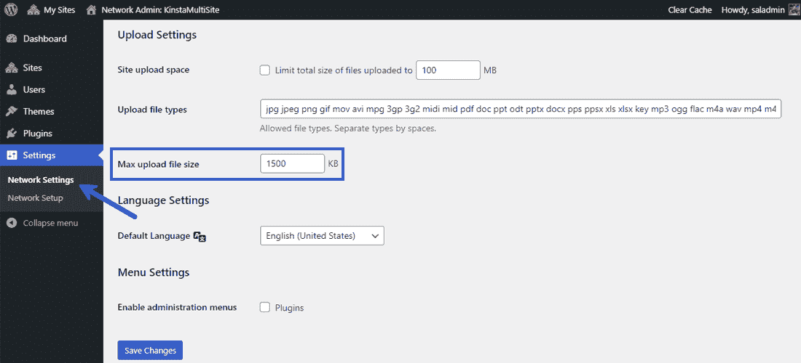

The ‘Max upload file size’ field in ‘Network Settings’


WordPress 多站点中**最大上传文件大小**的默认值为 **1500 KB** (~ **1.5 MB** )。您可以将其更改为更高的值，并点击**保存更改**按钮。

**注意:**从这里开始，您无法规避服务器级的最大上传大小限制。如果您在此设置的限制高于服务器的最大上传大小限制，服务器将忽略它。您可以使用上述方法来查找您的 web 服务器的配置。

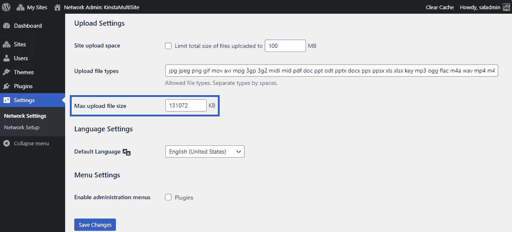

The new ‘Max upload file size’ in ‘Network Settings’


这里，我们已经将新的最大上传文件大小设置为 **131072 KB** (~ **128 MB** )。

您还可以限制上传到多站点网络中单个站点的文件的总大小。但是，默认情况下它是禁用的。

### 更新您的。“htaccess”文件

如果你的 web 服务器运行在 Apache 上，你可以更新你的站点的[。htaccess 文件](https://kinsta.com/knowledgebase/wordpress-htaccess-file/)来增加 WordPress 的最大上传大小。你可以找到你的**。WordPress 站点根目录下的 htaccess** 文件。

根据 PHP 文档，三个 PHP 指令负责 WordPress 如何处理上传。它们是:

*   `**upload_max_filesize**`
*   `**post_max_size**`
*   `**memory_limit**`

我们已经在上面的**站点健康信息**部分讨论了它们。如果您修改这三个指令的值来允许您的文件大小，将会有所帮助。例如，如果您计划上传的最大文件是 **32 MB** ，我们推荐以下设置:

*   `**upload_max_filesize = 32M**`
*   `**post_max_size = 64M**`
*   `**memory_limit = 128M**`

注意，所有的值都使用 **M** 而不是 **MB** 。这就是 PHP 处理指令的方式。

除了文件本身，上传还可以包含额外的信息。因此，给所有其他与上传相关的指令一些喘息的空间是一个好主意。你可以阅读我们关于如何在 WordPress 中提高 PHP 内存限制的深入教程。

访问您的**。htaccess** 文件通过 FTP/SFTP 或你的主机提供商的文件管理器。

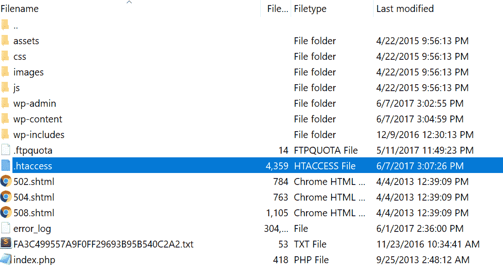

Finding the ‘.htaccess’ file


打开**。用[文本编辑器](https://kinsta.com/blog/best-text-editors/)或[代码编辑器](https://kinsta.com/blog/free-html-editor/)htaccess**文件，然后添加以下代码:

```
php_value upload_max_filesize 32M
php_value post_max_size 64M
php_value memory_limit 128M
php_value max_execution_time 300
php_value max_input_time 300
```

您可以注意到上面代码中的另外两个 PHP 指令:`**max_execution_time**`和`**max_input_time**`。它们定义了服务器在一个 PHP 任务上花费的时间。你上传的越多，花费的时间就越长。您需要将它们的值设置为适合您的用例的数字。

**注意:**使用上述方法后，您可能会得到一个 [500 内部服务器错误](https://kinsta.com/blog/500-internal-server-error/)。很有可能，这是因为你的服务器正在 CGI 模式下运行[PHP](https://www.php.net/manual/en/install.unix.commandline.php)。在这种情况下，您不能在**中使用上述命令。htaccess** 文件。

### 创建或修改“php.ini”文件

在 **php.ini** 文件中，您可以定义对默认 php 设置的更改。通常，它包含定义文件超时、最大上传大小和资源限制的指令。

使用 SSH 或 FTP，您可以在 WordPress 根目录中找到 **php.ini** 文件。在某些情况下，您可能无法在那里找到它。不要烦恼！您可以在站点的根目录下创建一个同名的新文件。

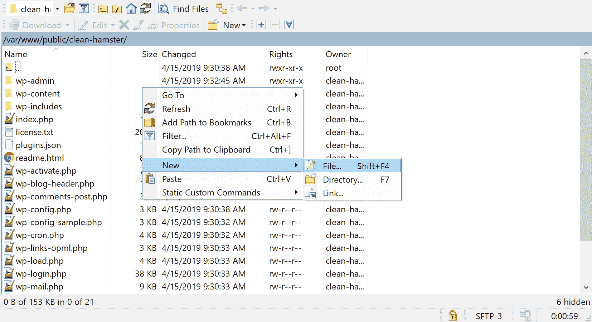

How to create a new php.ini file


使用代码或文本编辑器，将以下代码添加到现有的或新的 **php.ini** 文件中:

## 注册订阅时事通讯


### 想知道我们是怎么让流量增长超过 1000%的吗？

加入 20，000 多名获得我们每周时事通讯和内部消息的人的行列吧！

[Subscribe Now](#newsletter)

```
upload_max_filesize = 32M
post_max_size = 64M
memory_limit = 128M
```

更改后不要忘记保存文件。有些主机不允许你通过这种方法修改 PHP 设置。在这种情况下，您可以尝试以下解决方案。

### 创建或修改“. user.ini”文件

如果你的主机提供商已经锁定了全局 PHP 设置，他们可能已经配置服务器使用 **.user.ini** 文件，而不是 **php.ini** 文件。

像 **php.ini** 和**。htaccess** 文件，你可以在你站点的根目录下找到 **.user.ini** 。如果找不到，那么可以在同一位置创建一个新的 **.user.ini** 文件。按照前面方法中描述的相同过程创建一个新的 **php.ini** 文件。

接下来，将以下代码添加到您的 **.user.ini** 文件中:

```
upload_max_filesize = 32M
post_max_size = 64M
memory_limit = 128M
```

您会注意到它重复了前面的方法，只是文件名不同。

### 通过 cPanel 更改 PHP 选项

如果你的主机提供商使用 [cPanel dashboard](https://kinsta.com/knowledgebase/what-is-cpanel/) 来帮助你管理你的服务器和站点配置，你可以通过它的界面改变最大上传文件大小。

首先，进入 cPanel 仪表板，在**软件**部分选择**选择 PHP 版本**。

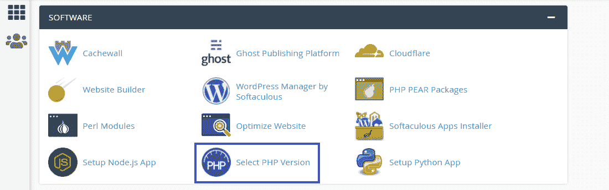

Click ‘Select PHP Version’ in the cPanel dashboard


在这里，您可以更改服务器的当前 PHP 版本，并启用/禁用许多 PHP 扩展。点击导航菜单中的**选项**链接，进入 **PHP 选项**面板。

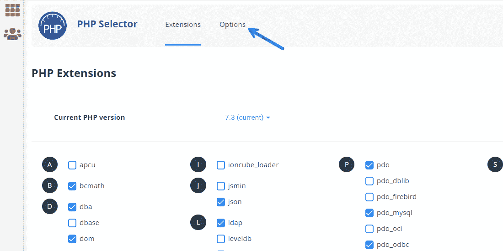

Go to the ‘PHP Options’ settings in cPanel


向下滚动到这里，修改 PHP 指令的值，如`**upload_max_filesize**`、`**post_max_size**`、`**memory_limit**`、`**max_execution_time**`和`**max_input_time**`。您可以在此设置的最大值取决于您当前的主机方案。

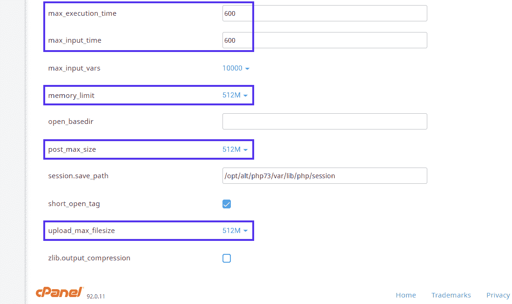

The ‘PHP Options’ screen in cPanel


如果您对这些值有任何疑问，我们建议您联系您的主机提供商。最新的 cPanel 仪表板会自动保存更改，因此您不必单击任何内容。但是如果您使用的是旧版本的 cPanel，请确保点击**保存更改**按钮。

### 增加 Nginx 中的最大上传文件大小

Nginx 是另一个类似于 [Apache](https://kinsta.com/knowledgebase/what-is-apache/) 的网络服务器，但它也有更多。通常， [Nginx 可以处理比 Apache](https://kinsta.com/blog/nginx-vs-apache/) 更多的并发请求，这使得它快了很多。Kinsta 使用 Nginx 为 WordPress 提供其[性能优化的托管](https://kinsta.com/wordpress-hosting/)解决方案。

如果你在 Nginx 上运行你的 WordPress 站点，你需要修改你的 **php.ini** 和 **nginx.conf** 文件。我们以前处理过前一个文件。后者被称为 Nginx 配置文件。

在 Nginx 服务器上，你可以在`**/etc/php/7.4/fpm/php.ini**`找到 **php.ini** 文件。根据您安装的 PHP 版本，确切的路径可能略有不同。

```
upload_max_filesize = 64M
post_max_size = 128M
```

您不必在上面的文件中设置`**memory_limit**`,因为 Nginx 会以不同的方式处理它。更多信息，你可以查看这个堆栈溢出线程。在保存了你的 **php.ini** 文件后，在你的终端中使用下面的代码重启 PHP-FPM 来进行修改:

```
sudo service php7.4-fpm restart
```

同样，根据服务器上安装的 PHP 版本的不同，确切的代码可能会略有不同。

接下来，使用 Nginx 的`**client_max_body_size**`指令来设置新的最大上传大小限制。您需要在 **nginx.conf** 文件中声明这个指令，您可以在`**/etc/nginx/nginx.conf**`找到这个文件。

厌倦了缓慢的 WordPress 托管？我们的性能优化服务器几乎可以即时向您的访问者提供内容。[查看我们的托管计划](https://kinsta.com/plans/?in-article-cta)

您可以在`**http {...}**`块、`**server {...}**`块或`**location {...}**`块中声明这个指令。

在 **http** 块中设置它将影响该服务器上托管的所有站点/应用。

```
http {
    ...
    client_max_body_size 128M;
}
```

在**服务器**块中定义它只会影响该服务器托管的特定站点/应用。

```
server {
    ...
    client_max_body_size 128M;
}
```

**位置**屏蔽只影响一个站点/app 内的指定目录(如**文件**、**上传**)。

```
location /files {
    ...
    client_max_body_size 128M;
}
```

不要忘记保存文件并重启 Nginx 来应用更改。为此，您可以在终端中使用以下命令:

```
sudo service nginx reload
```

如果你是 Kinsta 客户，你不能直接访问你的 Nginx 配置。但是，您可以联系我们的支持团队，他们会很快为您做出更改。

### 使用“上传大小限制”过滤器

WordPress 2.5 引入了 [upload_size_limit](https://developer.wordpress.org/reference/hooks/upload_size_limit/) 过滤器，过滤 **php.ini** 中允许的最大上传大小。甚至 WordPress 也使用这个过滤器来显示允许的最大上传大小，就像在媒体库和网站健康信息屏幕中一样。

下面是 WordPress 撰稿人 Drew Jaynes 的一个例子。它定义了所有非管理员角色的上传大小限制。

```
/**
* Filter the upload size limit for non-administrators.
*
* @param string $size Upload size limit (in bytes).
* @return int (maybe) Filtered size limit.
*/
function filter_site_upload_size_limit( $size ) {
// Set the upload size limit to 10 MB for users lacking the 'manage_options' capability.
if ( ! current_user_can( 'manage_options' ) ) {
// 10 MB.
$size = 1024 * 10000;
}
return $size;
}
add_filter( 'upload_size_limit', 'filter_site_upload_size_limit', 20 );
```

上面的代码使用 WordPress' `**manage_options**` 功能来为非管理员设置这个限制。您可以修改代码以针对特定的用户角色或用户 id。更多信息，请阅读我们深入的 [WordPress 角色和能力文章](https://kinsta.com/blog/wordpress-user-roles/)。

### 使用 WordPress 插件

使用 SSH 或 FTP/SFTP 修改代码并不适合每个人。如果你不习惯编写或编辑代码，你可以使用 WordPress 插件。

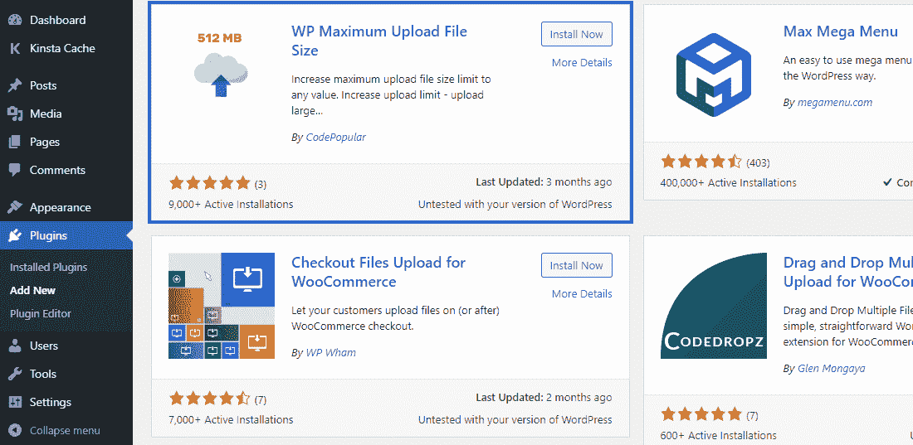

WP Maximum Upload File Size plugin


我们将在这里使用 [WP 最大上传文件大小插件](https://wordpress.org/plugins/wp-maximum-upload-file-size/)。在我写这篇文章的时候，这是 WordPress 插件库中唯一能帮助你完成这项工作的最新插件。

首先，安装并激活 WP 最大上传文件大小插件。接下来，在你的 WordPress 仪表盘中进入它的设置界面。在这里，你可以看到你的主机提供商和 WordPress 设置的最大上传文件大小。


WP Maximum Upload File Size settings screen


在这里，你可以看到 WordPress 设置的最大上传文件大小小于你的主机提供商设置的大小。因此，您可以通过下拉菜单选择**最大上传文件大小**来增加上传文件大小。

**注意:**如果你想设置一个比你的主机提供商设置的更大的最大上传文件大小限制，通过这个插件是不可能的。为此，你需要联系你的主机提供商。

### 通过 FTP/SFTP 上传文件

以上方法你还在纠结吗？或者让你的主机提供商提高上传文件的大小限制？您可以随时通过 [FTP/SFTP](https://kinsta.com/knowledgebase/ftp-vs-sftp/) 上传大文件。

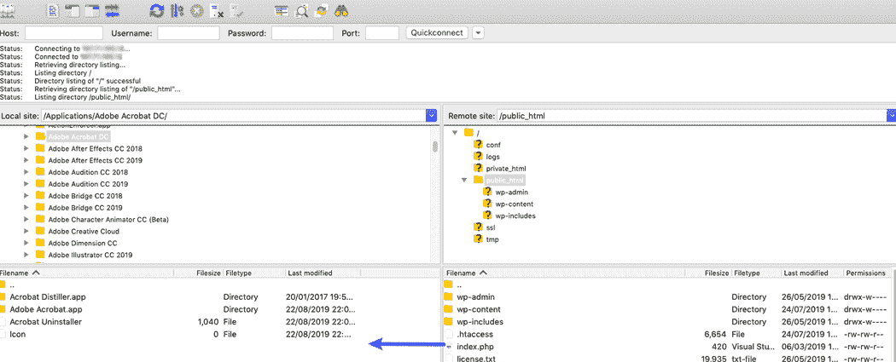

Drag and drop files to and for your server and computer with SFTP


如果你有很多大文件要上传，这是最快的方法。你可以阅读我们关于如何[批量上传文件到 WordPress 媒体库](https://kinsta.com/knowledgebase/bulk-upload-files-wordpress-media-library-ftp/)的深入教程来获得更多信息。

有时候，WordPress 无法识别通过 FTP/SFTP 上传的文件。如果是这样，你可以使用免费的 [Add From Server 插件](https://wordpress.org/plugins/add-from-server/)将上传的文件导入 WordPress。

或者，您可以直接从命令行通过使用 WP-CLI 导入图像来做同样的事情。`**wp media import**`命令允许您从本地文件或[URL](https://kinsta.com/knowledgebase/what-is-a-url/)创建附件。

## 不要编辑“wp-config.php”文件

编辑[wp-config.php](https://kinsta.com/blog/wp-config-php/)文件不再有效。我们把它加在这里是因为我们发现许多网络教程把它列为增加 WordPress 最大上传大小的合法方式。

它包括通过 FTP/SFTP 或 SSH 进入你网站的根目录，然后编辑 wp-config.php 的文件。

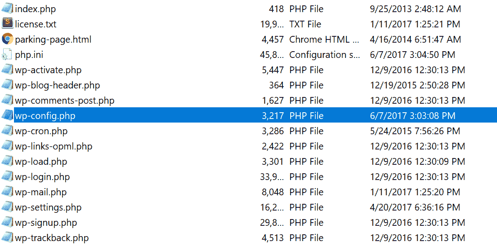

Finding the ‘wp-config.php’ file


建议您将以下代码添加到**wp-config.php**文件中:

```
@ini_set( 'upload_max_size' , '64M' );
@ini_set( 'post_max_size', '128M');
@ini_set( 'memory_limit', '256M' );
```

它无法工作，因为你只能使用 [ini_set()函数](https://www.php.net/manual/en/configuration.changes.modes.php)来设置属于 [PHP_INI_ALL](https://www.php.net/manual/en/ini.list.php) 可变模式的 PHP 指令。

由于`**upload_max_size**`和`**post_max_size**`属于 PHP_INI_PERDIR 可变模式。你只能通过 **php.ini** 、**来设置。htaccess** ， **http.conf** ，或者 **.user.ini** 。

如果你以前试过这种方法，但没有看到任何结果，现在你知道为什么它失败了。

## 验证你的 WordPress 站点新的最大上传文件大小

最后，是时候验证你的 WordPress 站点是否实现了新的最大上传文件大小限制。要做到这一点，请按照我们上面讨论的相同步骤来检查 WordPress 中的最大上传文件大小。

在 WordPress 仪表盘中进入你的**媒体库**，检查最大上传文件大小限制是否已经改变。

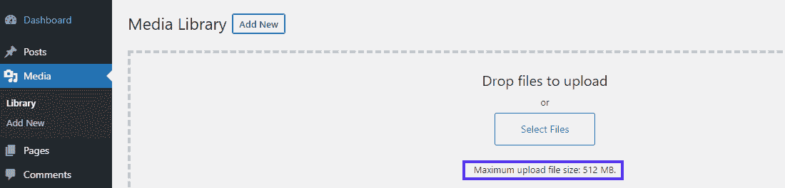

Verifying the new max upload file size in ‘Media Library’


是的，它已经改变了。那就是成功了！

您也可以进入**站点健康信息**面板，在**媒体处理**和**服务器**下拉列表中查看相同信息。

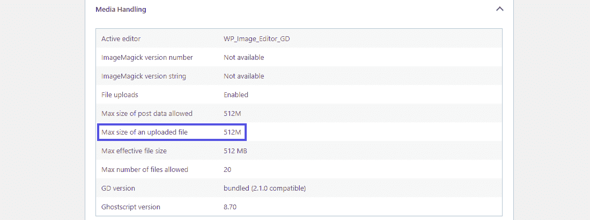

Verifying the new max upload file size in ‘Site Health Info > Media Library’


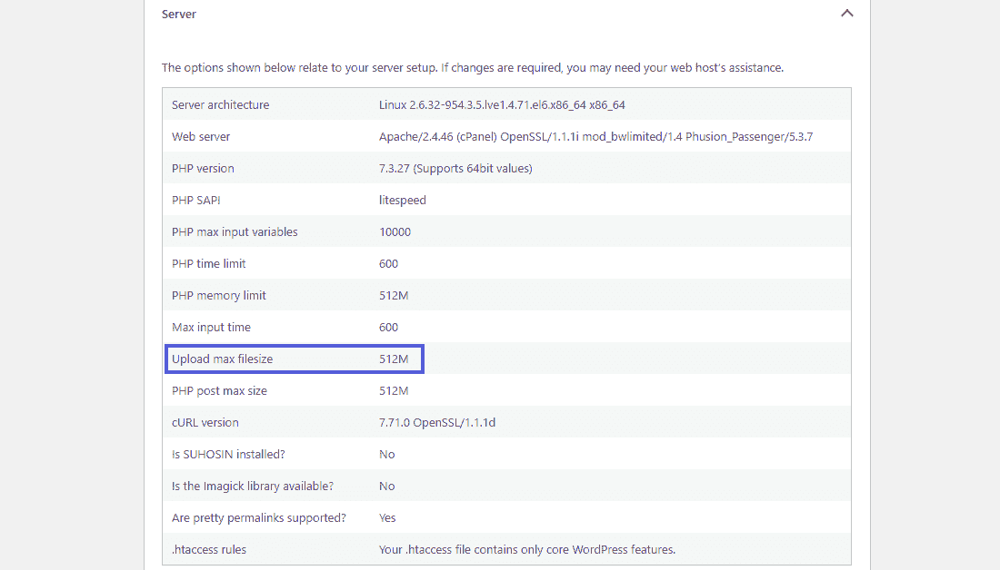

Verifying the new max upload file size in ‘Site Health Info > Server’


[不要让 WordPress 中的最大上传大小拖了你的后腿！🙅‍♂️这个指南将告诉你如何轻松地增加限制来容纳你的大文件👇](https://twitter.com/intent/tweet?url=https%3A%2F%2Fkinsta.com%2Fblog%2Fincrease-max-upload-size-wordpress%2F&via=kinsta&text=Don%27t+let+the+maximum+upload+size+in+WordPress+hold+you+back%21+%F0%9F%99%85%E2%80%8D%E2%99%82%EF%B8%8F+This+guide+will+show+you+how+you+can+easily+increase+the+limit+to+accommodate+your+larger+files+%F0%9F%91%87&hashtags=WordPress%2CWPTips)

## 摘要

正如你所看到的，在 WordPress 中增加最大上传文件大小并不复杂。无论你是在建立一个媒体密集的组合网站还是安装一个大的主题，你只需要知道去哪里找以及使用什么命令或工具。

在大多数情况下，[联系你的主机提供商](https://kinsta.com/kinsta-support/)就足够了。然而，如果你受困于一个麻烦的主机，我们已经向你展示了一些替代方法，你可以在[迁移到更好的主机](https://kinsta.com/blog/migrate-wordpress-site/)之前尝试。

开始上传！

我们都谈到了吗？如果你遇到了上传文件大小限制的难题，请告诉我们你是如何解决的。

* * *

让你所有的[应用程序](https://kinsta.com/application-hosting/)、[数据库](https://kinsta.com/database-hosting/)和 [WordPress 网站](https://kinsta.com/wordpress-hosting/)在线并在一个屋檐下。我们功能丰富的高性能云平台包括:

*   在 MyKinsta 仪表盘中轻松设置和管理
*   24/7 专家支持
*   最好的谷歌云平台硬件和网络，由 Kubernetes 提供最大的可扩展性
*   面向速度和安全性的企业级 Cloudflare 集成
*   全球受众覆盖全球多达 35 个数据中心和 275 多个 pop

在第一个月使用托管的[应用程序或托管](https://kinsta.com/application-hosting/)的[数据库，您可以享受 20 美元的优惠，亲自测试一下。探索我们的](https://kinsta.com/database-hosting/)[计划](https://kinsta.com/plans/)或[与销售人员交谈](https://kinsta.com/contact-us/)以找到最适合您的方式。