# 如何使用浏览器的 inspect lemon 工具来编辑网页

> 原文：<https://kinsta.com/blog/inspect-element/>

有许多有价值的网络开发资源，比如书籍、视频、[在线课程](https://kinsta.com/blog/web-design-courses/)等等。学习如何使用浏览器的 Inspect Element 工具就是这样一种强大的能力。这是一个无价的学习工具——就在你的指尖下，随时可用。

通过 Inspect Element 特性，你可以看到网站的内部运作。虽然你只能看到前端标记，如 HTML，CSS，有时 JavaScript，但它给了你一个方法来准确地看到开发者是如何构建一个网站的。

在本帖中，我们将向您展示如何使用 Inspect Element 工具以及您将遇到的一些相关技术、特性和功能。首先，让我们正式介绍一下 Inspect Element 工具本身。

### 查看我们的[视频指南](https://www.youtube.com/watch?v=TYYB8s4uUI4)，了解如何使用 inspect element 编辑网站

## 介绍检查元素工具

在 web 的早期，只有一种方法可以查看网站的代码——**查看源代码**功能。

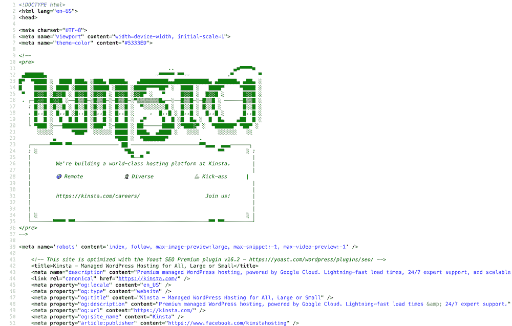

Kinsta.com’s “View Source” page.

在我们大量拥有[层叠样式表(CSS)](https://kinsta.com/blog/wordpress-css/) 和 [JavaScript](https://kinsta.com/blog/javascript-libraries/) 之前，这种情况很普遍。Web 开发人员将 HTML 用于所有的站点元素，包括内容、设计和…嗯，所有的东西。

一旦 web 开始发展，底层技术的能力增强，就有必要开发更好的工具。Firefox 的 Firebug 是一个早期的解决方案，用于发现一个网站如何在幕后运行和工作:

The Firefox and Firebug logos.

过了一段时间，这种功能在几乎所有的浏览器中都找到了自己的位置。今天，我们知道该功能被称为检查元素工具:

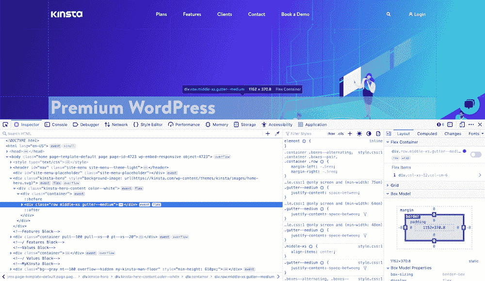

The Inspect Element tool on the Kinsta website.

这是一种了解网站底层技术和代码的有效方式。因此，您可以在几个不同的地方找到它——通常通过工具栏菜单、右键单击页面并选择选项，或者使用键盘快捷键。

虽然 Inspect Element 工具的主要焦点是页面的 HTML 和 CSS，但是您可以用它做更多的事情。

### 巡视检查元素面板

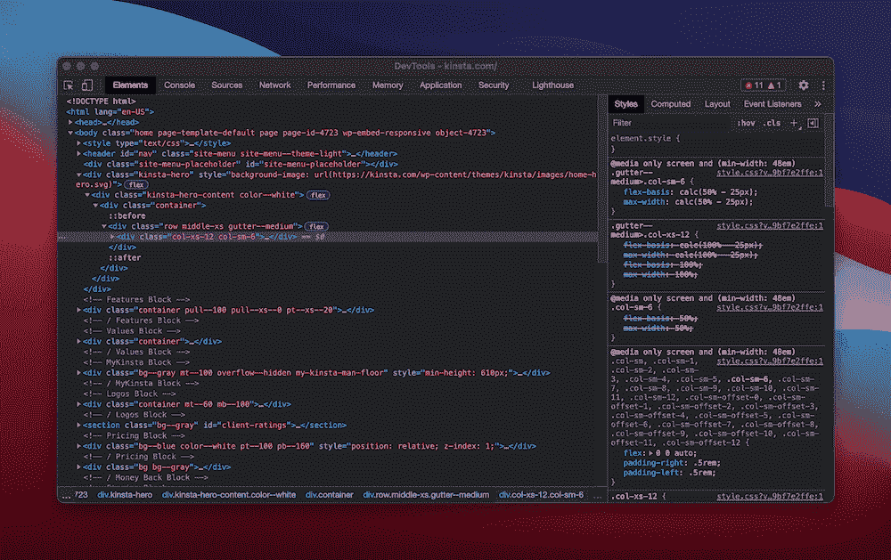

Brave’s DevTools.

Inspect Element 工具不仅仅是一种显示代码的方式。通常有几个面板可以访问:

*   **Inspector —** 这在一些浏览器中被称为**元素**。这是 Inspect Element 工具的主屏幕，向您显示页面代码，以及特定于元素的 CSS。你还会发现一个站点的“网格系统”和其他方面的更多细节。
*   **控制台—** 这是一个网站的前端警告日志，您也可以在这里输入代码片段，对某个想法进行快速测试。
*   **Network —** 在这里，您将看到服务器发出和接收的请求，比如所有的 POST 和 GET 请求。
*   **性能—** 当然，一个场地[也要有性能](https://kinsta.com/learn/speed-up-wordpress/)。因此，有一个专门的工具来帮助你衡量一些重要的网站指标。这里有些浏览器比其他浏览器做得更好。
*   **内存—** 这个面板让你看到一个站点是如何使用内存的，同样，一些浏览器提供了广泛的指标。
*   **应用程序—** 在这个面板中，您可以看到网站缓存、后台服务等一系列信息。

除此之外，您还可以添加更多面板:

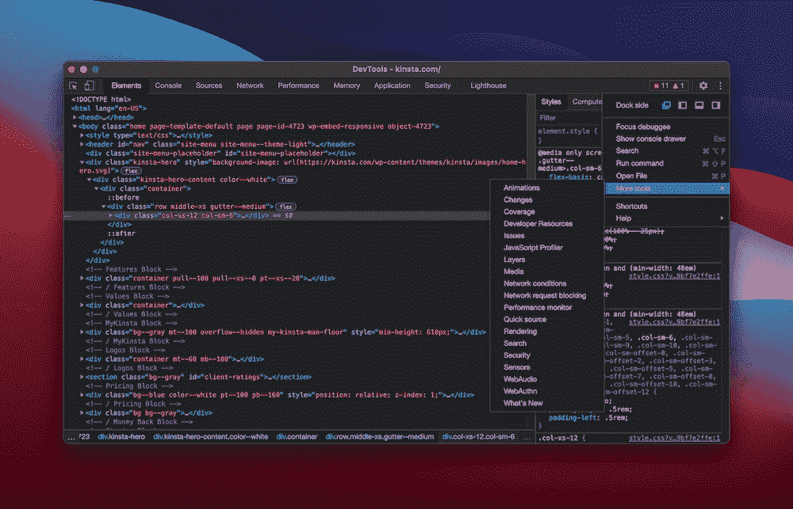

A list of other panels within Brave’s DevTools.

有简单的面板，如**媒体**，也有更复杂的面板，如 **JavaScript 分析器**和**性能监视器**。简而言之，Inspect Element 工具的名字对所有功能造成了损害。它拥有巨大的力量，应该是任何 web 开发人员工作流程的核心。

## 为什么要使用 Inspect 元素

Inspect Element 工具几乎是您在开发过程中需要拥有的唯一“固定”解决方案。在本文的其余部分，我们将深入探讨技术细节。不过，首先，有必要谈谈您使用 Inspect Element 的动机。

您想使用该工具有几个原因:

*   你可以浏览其他网站，寻找如何在你的网站上工作的灵感。
*   您将了解其他网站或开发者如何实现特定的技术。
*   它给你一个许可证，让你在你的网站上进行实验，而不承担任何后果。
*   在大多数 Inspect Element 工具中，您有机会调试站点。
*   最好能找到更多关于该网站的信息。

简而言之，学习 web 开发包括查看优秀的网站示例，并找出它们的成功之处。

Inspect Element 工具允许您检查站点上使用的 HTML 和 CSS，这为您在工作中实现这些方面和技术提供了很好的机会。

## 如何找到浏览器的检查元素工具

好消息是找到 Inspect Element 工具很简单。在大多数情况下，你可以在页面上点击右键，选择**检查**或**检查元素**:

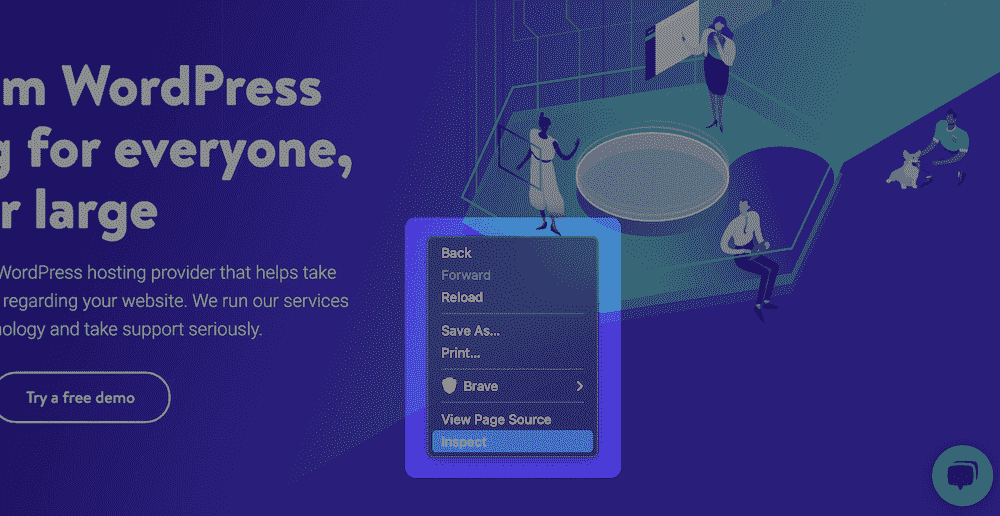

Choosing the Inspect Element tool.

默认情况下，它会在一个拆分窗口中打开该工具。它通常默认为右侧。但是您可以根据自己的喜好对其进行定制，甚至将该工具弹出到它的窗口中:

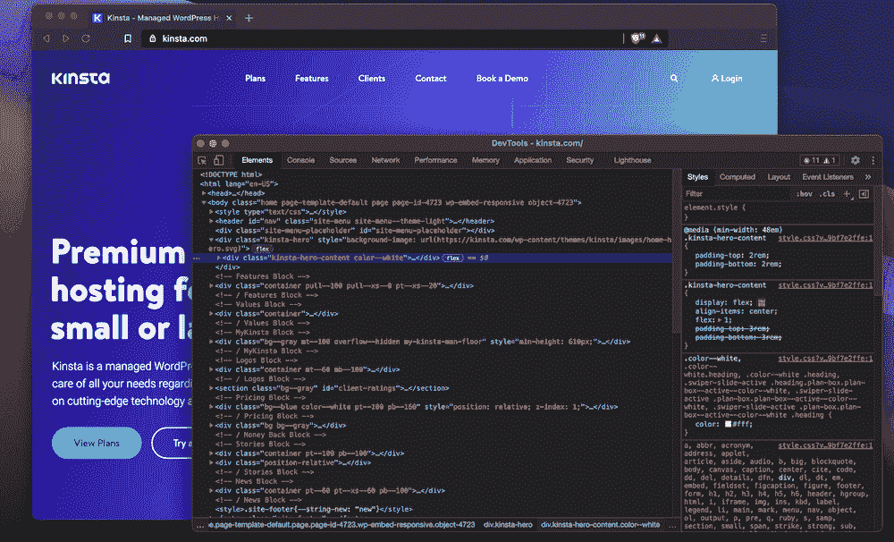

The Inspect Element tool in its window.

当然，您也可以从浏览器工具栏或通过键盘快捷键来访问 Inspect Element。具体位置因浏览器而异。比如 Firefox 中的[，你会在**工具>浏览器工具**菜单中找到 **Web 开发者工具**。相比之下，](https://developer.mozilla.org/en-US/docs/Tools) [Brave](https://kinsta.com/blog/brave-browser-review/) (和其他基于 Chromium 的浏览器)在**视图>开发者**菜单中有**开发者工具**选项:

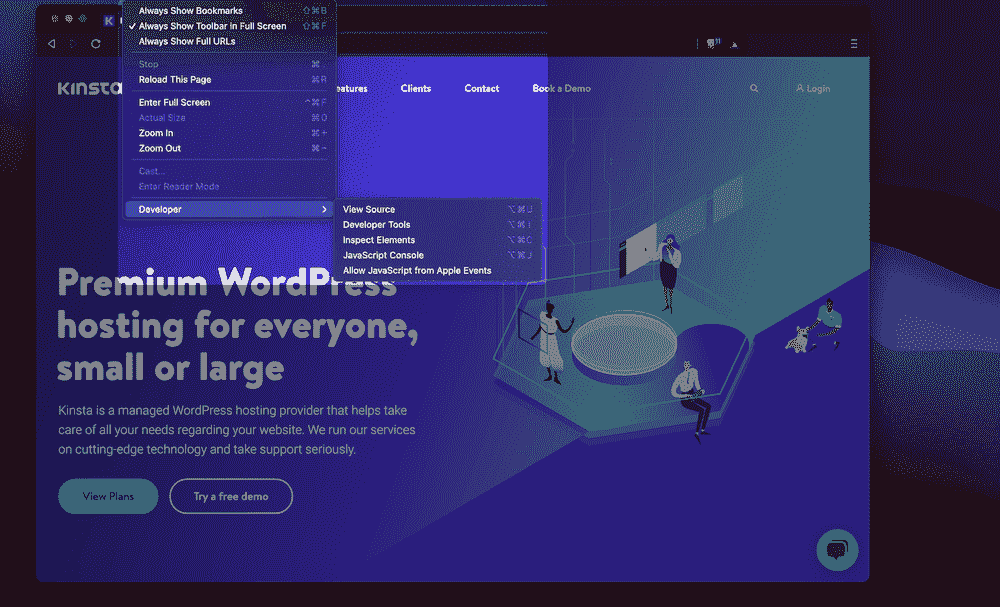

Brave’s toolbar menu, showing its developer tools.

跨浏览器的键盘快捷键往往都差不多:**Command+Shift+C**(Windows 的 **Control + Shift + C** )。这种快捷方式可以让您很快找到需要使用的工具。

如果您以前从未打开过 Inspect Element 工具，它通常会显示在菜单的右侧，正如我们前面提到的。要改变这一点，点击 Inspect 元素工具栏中的 [traffic](https://kinsta.com/blog/how-to-drive-traffic-to-your-website/) light 菜单。在这里，您可以切换“dock”显示的一侧:

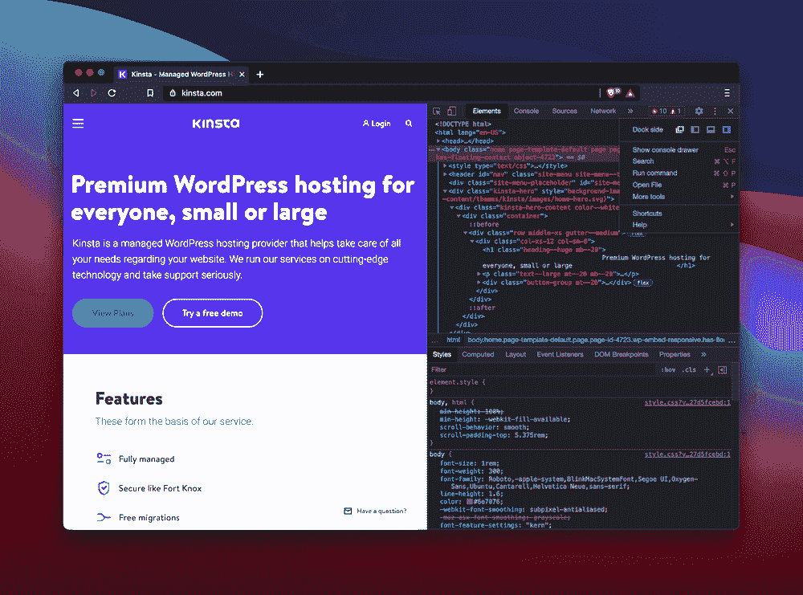

The “Dock side” options in the Inspect Element tool.

请注意，Firefox 还默认使用“三窗格”视图，这有助于您在 Inspect Element 工具中获得尽可能多的信息:

Firefox’s “triple pane” view.

既然您已经打开了工具，那么了解一下您可以用它做什么是一个好主意。我们接下来会谈到这个。

## 使用检查元素工具的 3 种情况

我们已经谈到了使用 Inspect Element 工具的一些方法，但是我们可以更进一步提供一些用例。我们简单讨论一下这些。

### 1.在网页上搜索特定元素

顾名思义，检查元素工具的主要目标是检查网站元素。为此，您将前往所需的网页，然后选择打开[开发工具](https://kinsta.com/blog/code-review-tools/)的方法。

面板打开后，您将单击箭头，作为所需元素的选择器:

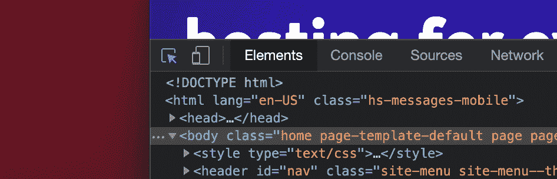

The Inspector Arrow icon.

从这里，您可以将鼠标悬停在页面上的任何元素上，您会看到它在**检查器/元素**窗口中高亮显示:

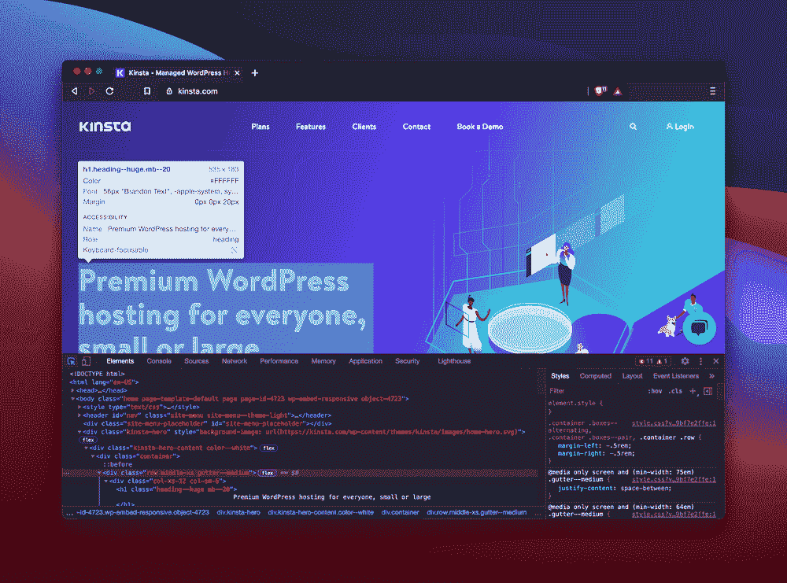

Highlighting an element in the development tools panel.

这是一个简单的过程——这也是 Inspect Element 工具如此有价值并受 web 开发人员欢迎的原因之一。

### 2.模拟目标设备、显示器和浏览器

Inspect 元素还充当某种设备模拟器。换句话说，你可以看到一个网站在特定设备上的外观。选项很多:

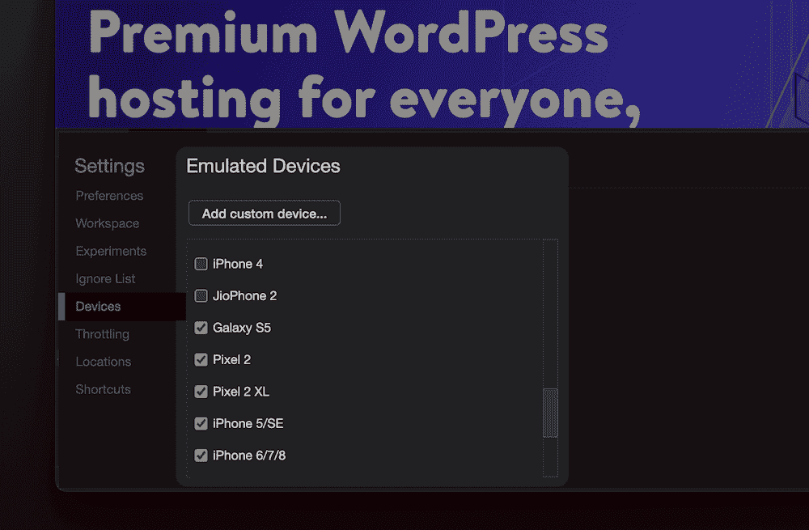

A list of emulated devices shown in Brave.

这个模拟器将非常有助于判断你的移动优先战略或[响应式设计](https://kinsta.com/blog/responsive-web-design/)是否准确有效。这是非常宝贵的，也比让 200 台设备在你的办公桌上漂浮更具成本效益。

您通常可以通过 Inspect Element 面板上的小图标访问设备仿真:

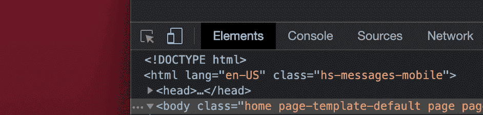

Emulating a device with the Inspect Element tool.

单击此图标将显示您的站点在您选择的设备上的外观:

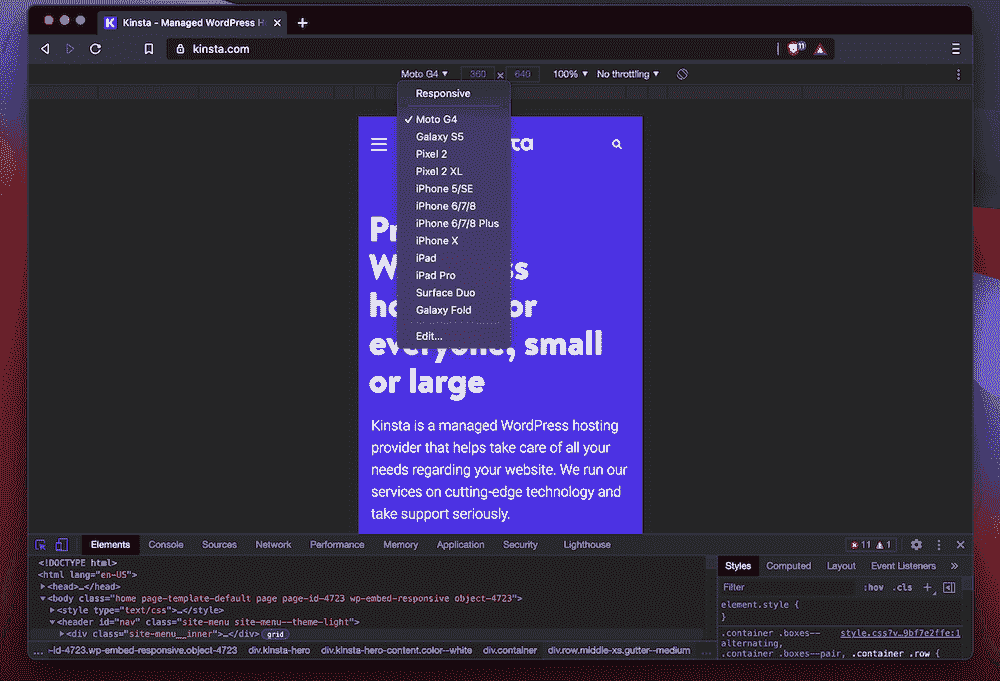

Choosing a device to emulate from the Inspect Element tool.

我们稍后将对此进行更详细的探讨，但这是使您的设计在不同设备间保持一致的可靠方法。

### 3.确定网页的性能

Inspect Element 工具还可以通过**性能**面板帮助你判断一个网站的[速度和性能](https://kinsta.com/blog/website-speed-test/):

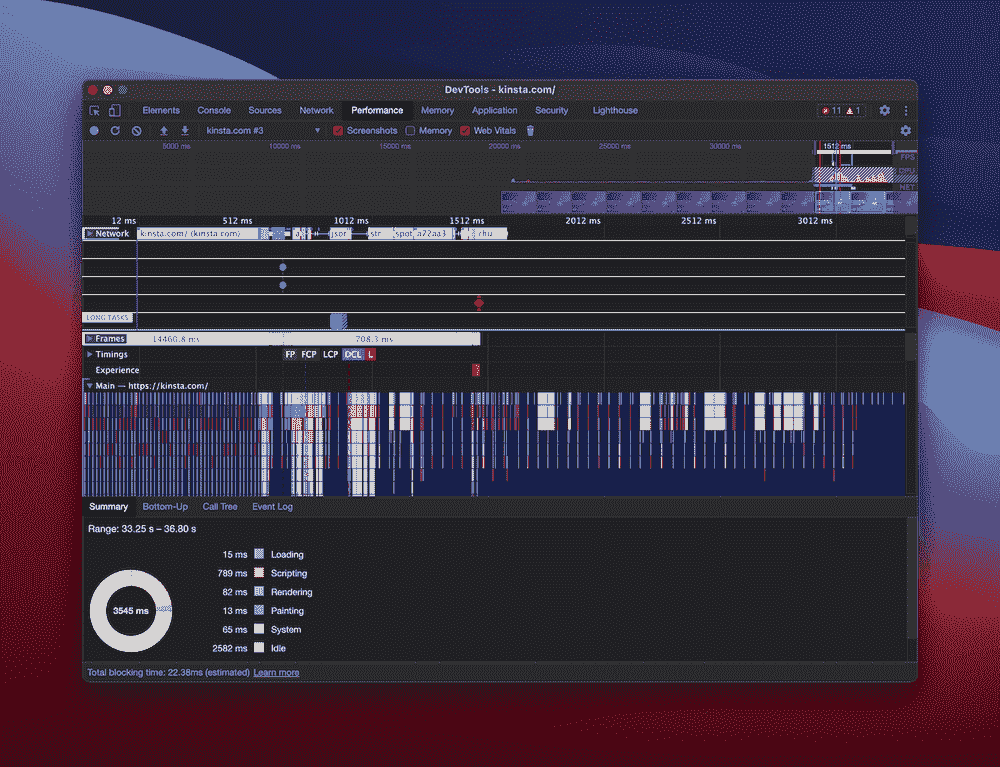

The Inspect Element Performance panel.

这个特性通过“记录”特定元素和脚本的加载时间来工作。基于 Chromium 的浏览器在提供这些信息方面表现出色。您将在页面加载时对其进行记录，然后以时间线格式查看结果。

这是一个很好的方法来确定一个页面是否具有一般的性能。从那以后，你会想要使用一个工具，比如谷歌页面速度洞察(Google PageSpeed Insights)或者 T2 灯塔(new York light house)来进一步提高你的网站的性能。基于 Chromium 的浏览器将内置一个 Lighthouse 报告生成器:

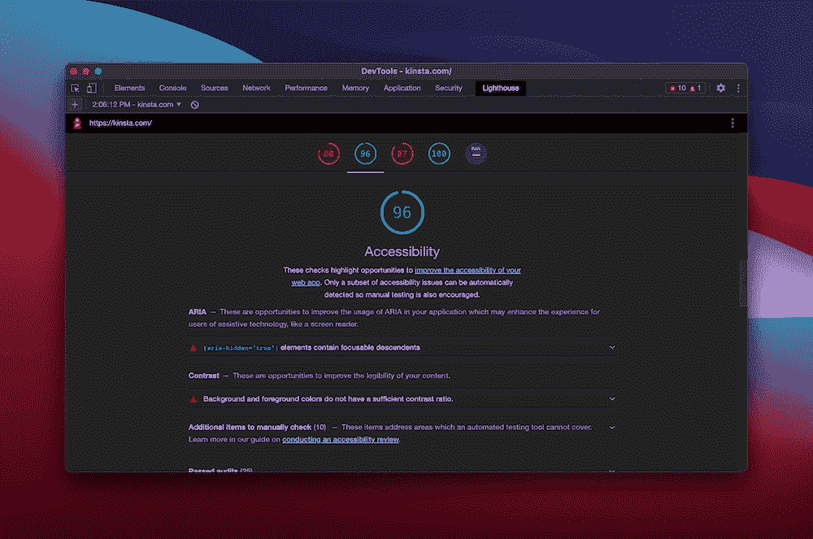

A built-in Google Lighthouse report.

您还可以在其他几个选项卡中看到性能测试的摘要。例如，您可以查看一个**调用树**、一个总体摘要和一个**事件日志**:

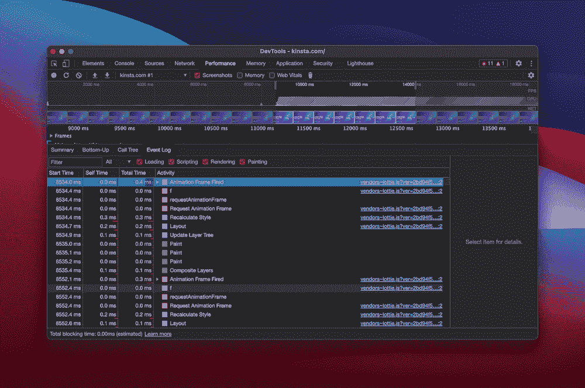

The Inspect Element’s Event Log.

可以想象，你不需要任何其他工具来判断你的网站如何运行。了解它在实践中是如何工作的是我们接下来要讨论的事情。

## 使用检查元素工具的技巧和提示

我们已经讨论过 Inspect Element 工具是如何比乍看起来更强大的。让我们从基础开始，看看一些技巧和提示，以充分利用它的特性集。

## 注册订阅时事通讯

### 想知道我们是怎么让流量增长超过 1000%的吗？

加入 20，000 多名获得我们每周时事通讯和内部消息的人的行列吧！

[Subscribe Now](#newsletter)

### 更改元素属性、值和状态

到目前为止，我们只涉及了使用 Inspect Element 工具对站点进行临时更改的概念。让我们更详细地讨论如何做到这一点。

步骤很简单。首先，使用箭头图标选择您选择的元素。当您将鼠标悬停在各个组件上时，您会看到一个突出显示这些组件的覆盖图:

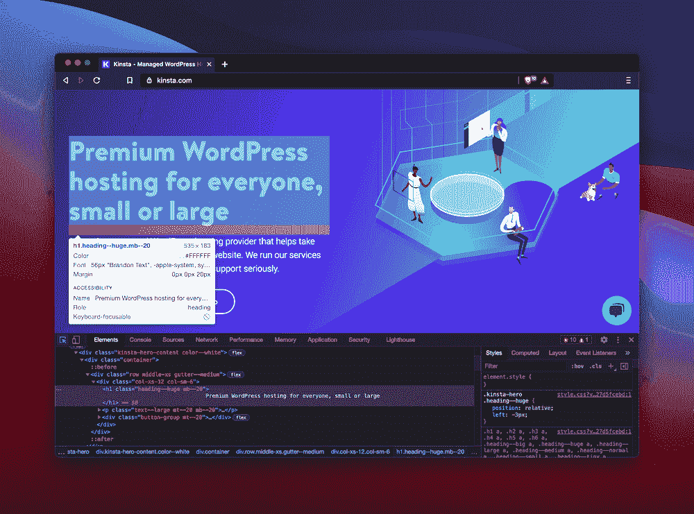

Selecting elements in the Inspect Element tool.

一旦你找到你想要的元素，你可以双击**元素**面板中任何你看到标签的地方，然后输入一个修改。例如，我们希望将 Kinsta 主页上的原始英雄文本更改为不同的内容:

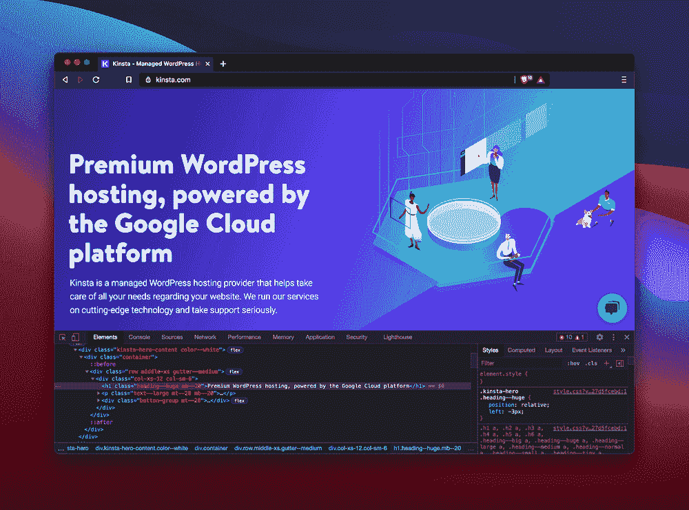

Changing text on the Kinsta home page.

你也可以像使用 HTML 一样使用 CSS。例如，以 Kinsta 主页上的行动号召(CTA)按钮为例:

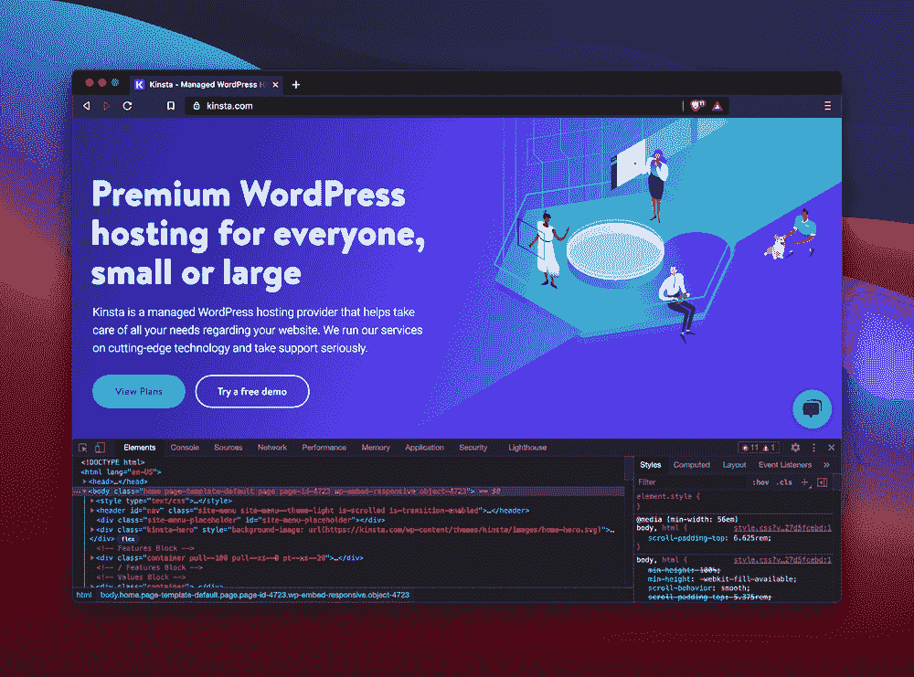

Selecting a button on the Kinsta home page.

如果您使用指针选择按钮，您可以在右侧的**样式**面板中看到其相关的 CSS:

The Style panel within the Inspect Element tool.

与 HTML 元素一样，您也可以更改值并添加 CSS:

Changing the button color in the Styles panel.

当然，对于像按钮这样的元素，您可能想要处理它的各种状态。在这种情况下， **:hover** 状态也值得改变。为此，点击样式面板中的 **:hov** 链接。选择此选项将显示一个元素状态列表，您可以选择想要查看悬停状态 CSS 的元素:

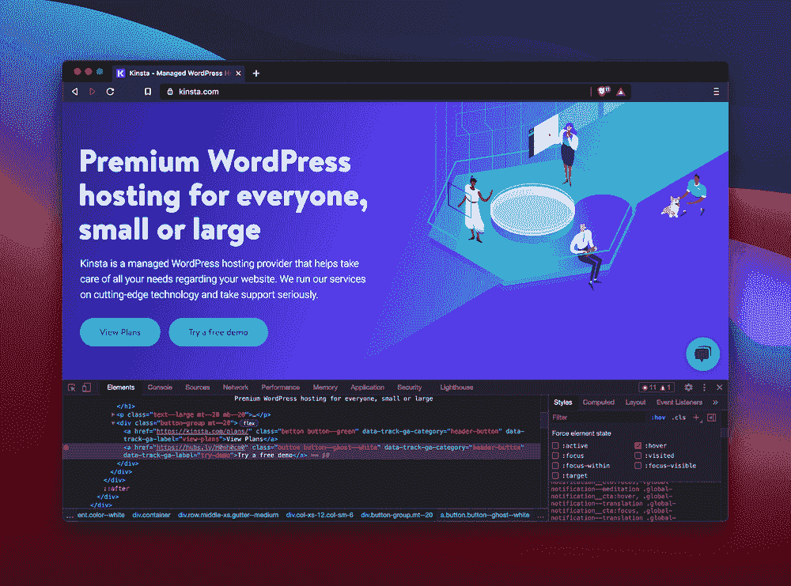

Bringing up the “States” options in the Styles panel.

网页将显示状态，而无需您采取行动。这里，我们更改了悬停颜色，以区别于默认按钮状态:

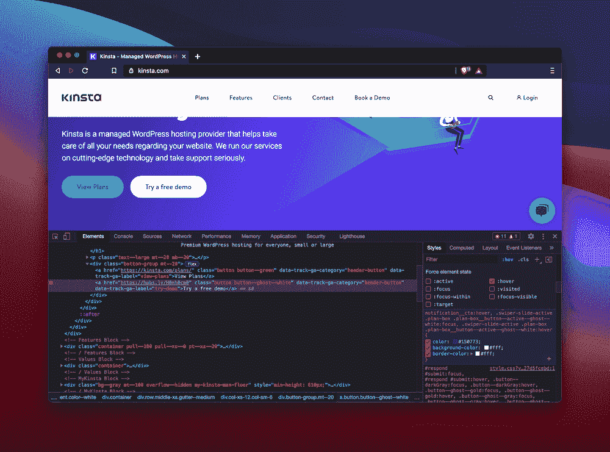

Changing hover state colors in the Styles panel.

你甚至可以把图片的网址换成其他的。在 Kinsta 主页上，我们展示了 [MyKinsta 仪表板](https://my.kinsta.com/login)的屏幕截图:

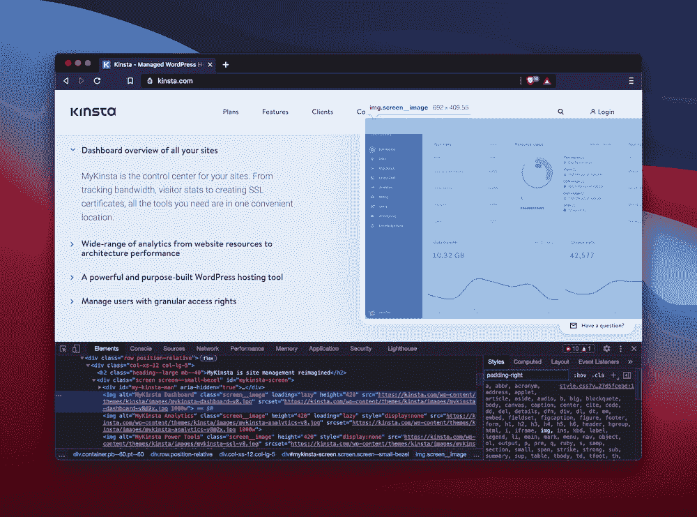

The MyKinsta dashboard on the Kinsta homepage.

通过定位元素并更改图像的源 URL，您可以在它的位置测试其他图片:

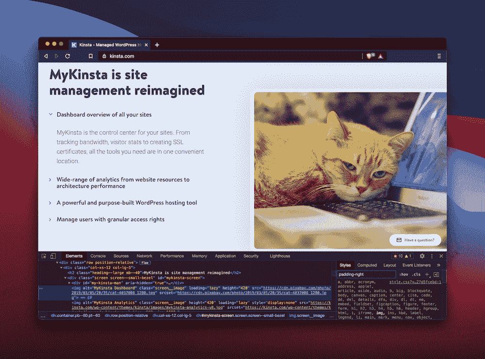

In this case, the change went live within minutes (Image source: [Pixabay](https://pixabay.com/photos/cat-red-cat-red-headed-cat-kitten-4037008/)).

正如您所料，这些更改不是永久的，通过快速刷新页面，您可以让一切恢复正常。或者，你也可以将 HTML 和 CSS 复制到你的编辑器中，并将它们包含在你的代码中，使这些改变永久化。

### 搜索元素

可能在你改变一个元素之前，你需要找到它。“检查元素”工具具有简单的搜索功能，可以帮助您找到网页的任何方面。

也就是说，如果你不知道去哪里找，就很难找到。基于 Chromium 的浏览器的“官方”方式是前往页面右侧的“红绿灯”菜单，选择**搜索**选项:

您的新网站需要卓越、快捷、安全的托管服务吗？Kinsta 提供闪电般快速的服务器和来自网络专家的 24/7 世界级支持。[查看我们的计划](https://kinsta.com/plans/?in-article-cta)

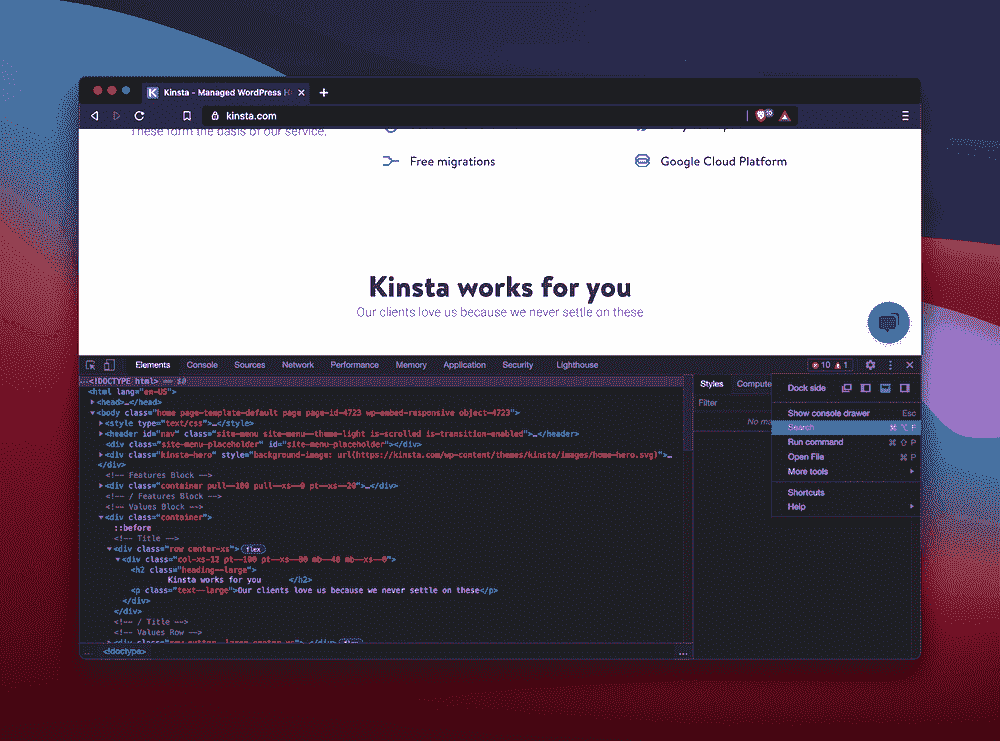

The “Search” option in Brave’s DevTools.

使用这个将打开**控制台**面板，以及**搜索**选项卡。从这里，在文本框中键入您想要的标签，您将在页面上看到相关元素的列表:

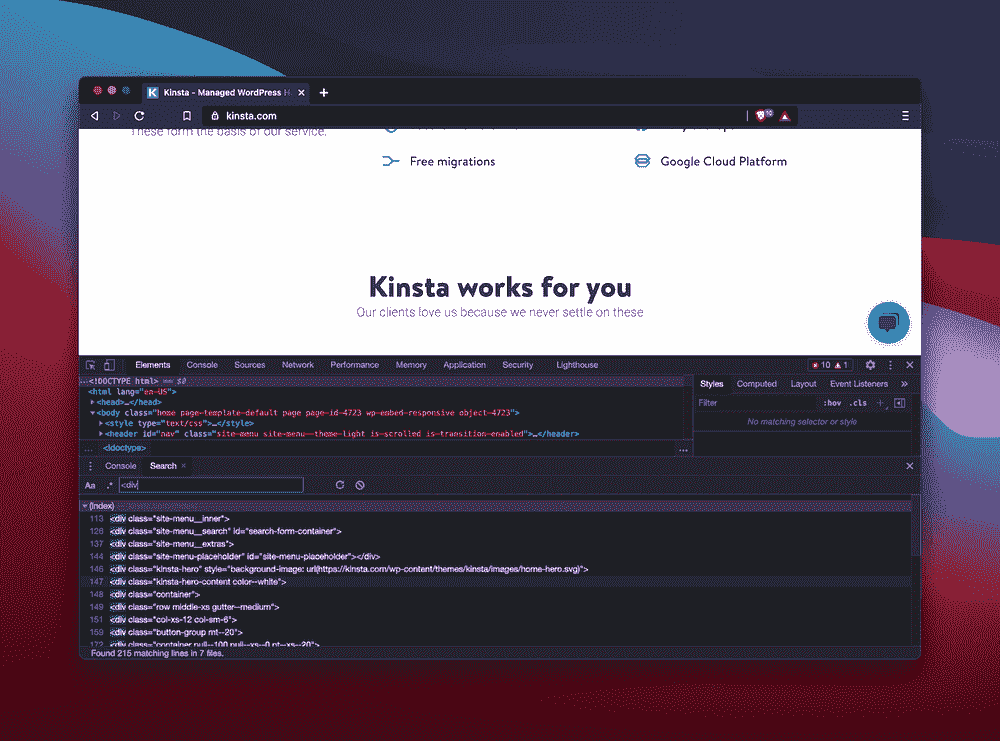

Searching for elements in Brave’s DevTools.

请注意，在其他浏览器中，您可能会在别处找到该功能。例如，Firefox 在其**检查器**面板的顶部包括一个[搜索框](https://kinsta.com/blog/alternative-search-engines/):

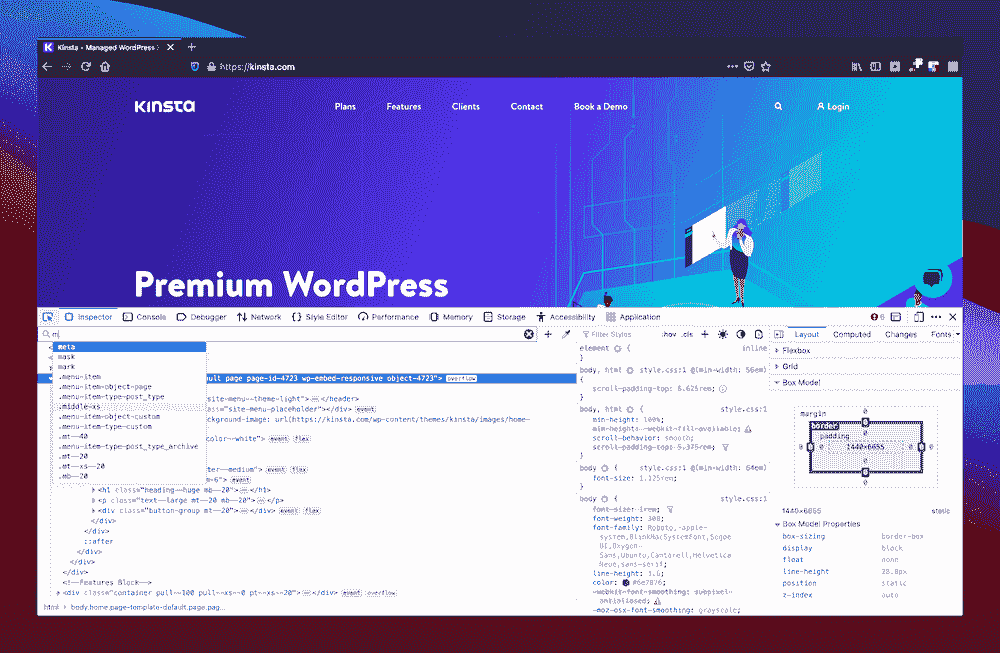

Searching for elements in the Firefox Inspector panel.

这里有另一个快速提示:您可以通过在**元素**窗格中右键单击并选择**递归展开**来执行各种节点和元素的递归展开:

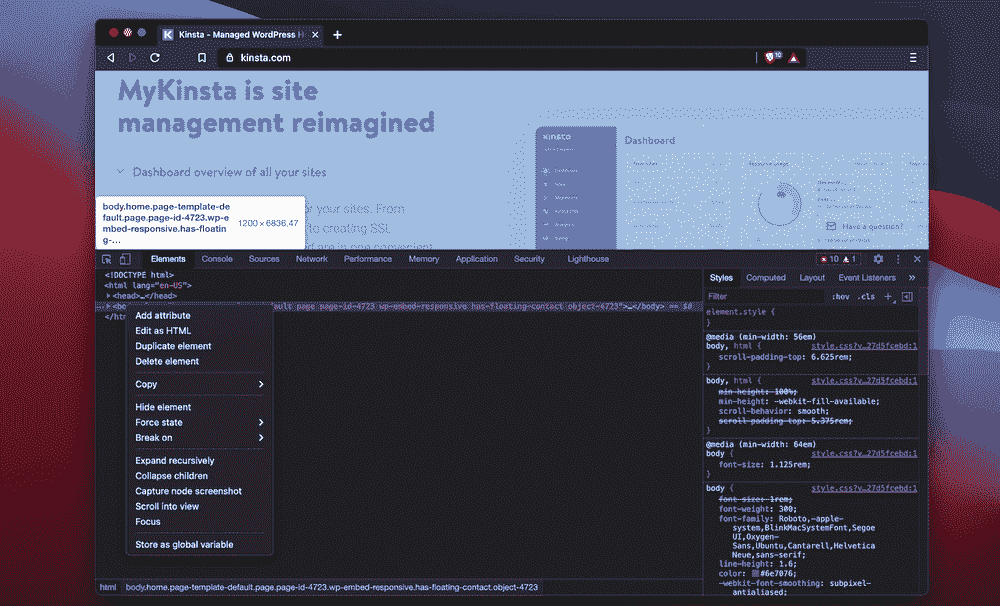

The Expand recursively option in the Elements panel.

如果你看一下**样式**面板，你也会发现一个**过滤器**文本框。此字段允许您按 CSS 属性进行筛选，使其成为全局搜索功能的绝佳伴侣:

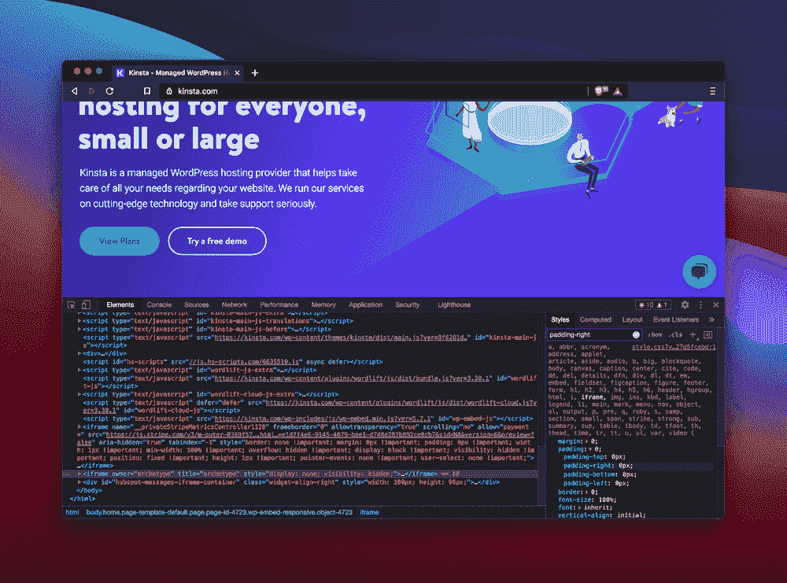

Filtering by properties in the Styles panel.

总的来说，用两个专用的过滤和搜索工具找到你需要的东西应该不难。

### 箱式模型的快速入门

“检查元素”工具可以帮助您了解 CSS 属性如何作用于元素的最佳方式之一是可视化的“盒子模型”面板。

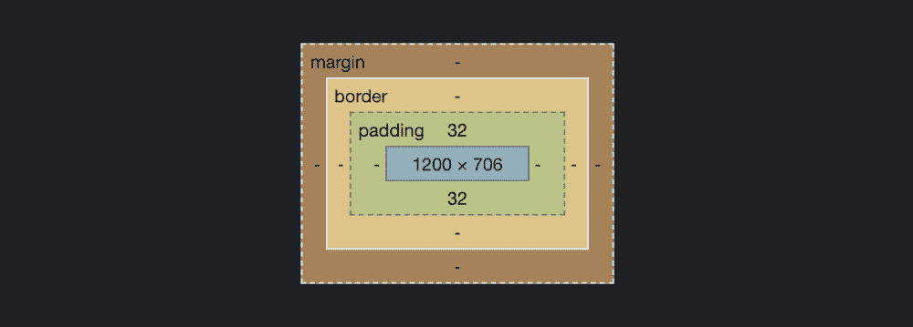

The Box Model.

这个概述向您展示了一个特定的框(比如“element”或“div”)是如何出现在屏幕上的。换句话说，它概述了边距、填充、边框和内容如何组合成您在屏幕上看到的部分。

解释完整的 CSS 盒子模型以及它如何与一个[网页的 HTML](https://kinsta.com/blog/html-vs-html5/) 交互超出了本文的范围，尽管 [Mozilla 有一个极好的指南](https://developer.mozilla.org/en-US/docs/Learn/CSS/Building_blocks/The_box_model)来解释这个概念的来龙去脉。

您通常会在 Inspect Element 工具右侧窗格的**布局**或**计算**部分找到**盒模型**面板:

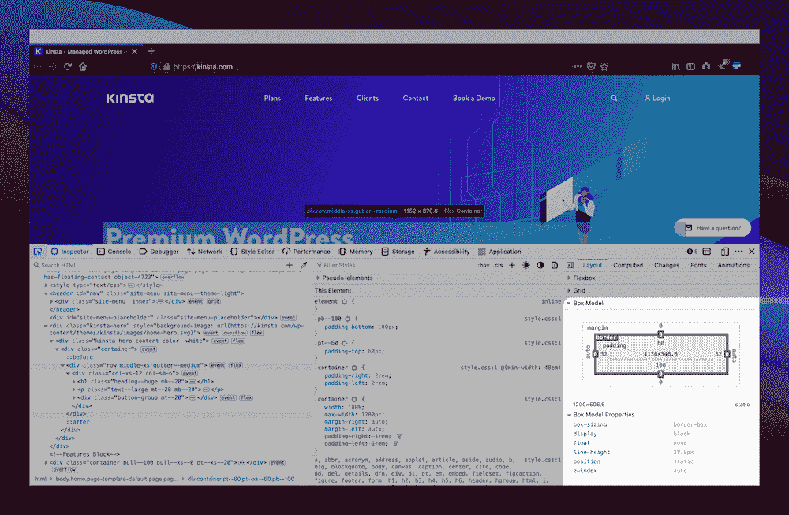

The “Box Model” panel within the Inspect Element tool.

与任何元素和属性一样，您也可以更改特定框的值和设置。还会有一个其他属性的列表来帮助您定位框，设置 z 索引，应用浮动和显示设置，等等。

在使用盒子模型时，您还可以从查看页面上的网格系统中获益。为此，看一下**布局**面板——您需要的选项将在**网格**菜单下:

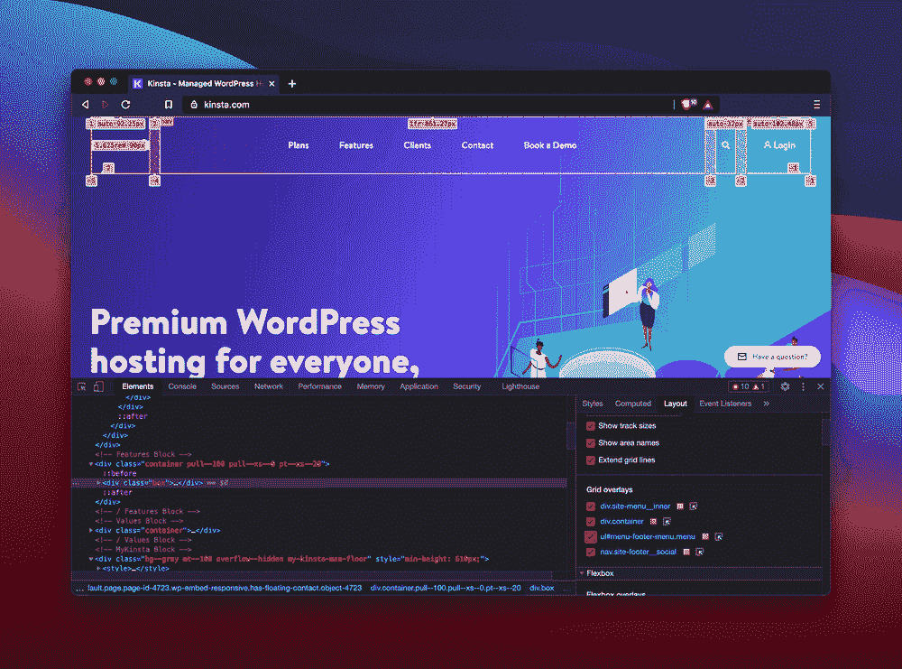

The Grid settings menu.

点击你想要的显示设置，然后选择一个相关的覆盖将显示在屏幕上，让你更准确地决定使用框模型来操纵网站元素。

### 使用 Inspect 元素仿真设备

它们已经从流行词汇变成了综合词汇，但是“响应迅速”和“移动友好”是关键的网络开发因素。因此,“检查元素”工具通过几个功能来处理这个方面。

在大多数浏览器中,“检查元素”工具在顶部工具栏上会有一个移动设备图标:

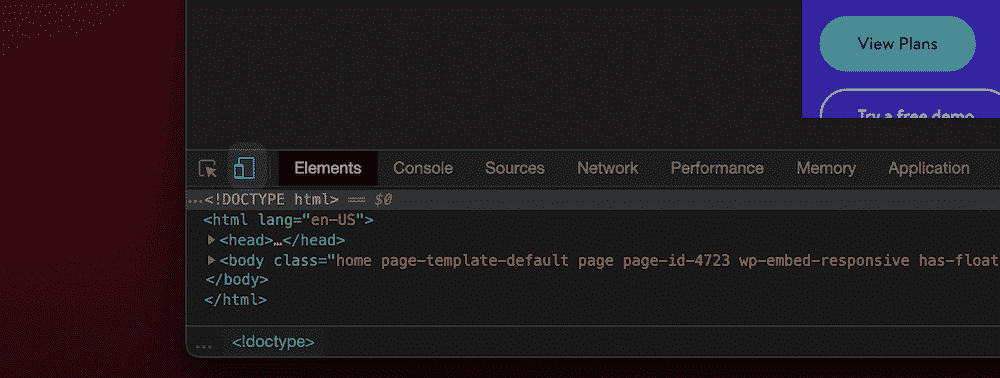

Toggling mobile responsive viewing within Brave.

然而，Safari 是不同的。相反，在**开发**菜单中有一个**进入/退出响应设计模式**开关:

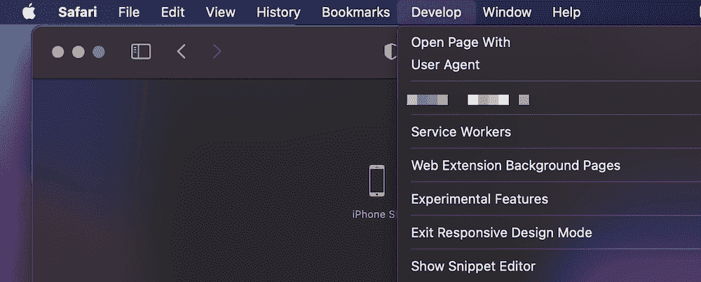

The “Exit Responsive Design Mode” option in Safari.

无论您如何访问，一旦您选择了该选项，网页将显示为好像您正在较小的设备上查看它:

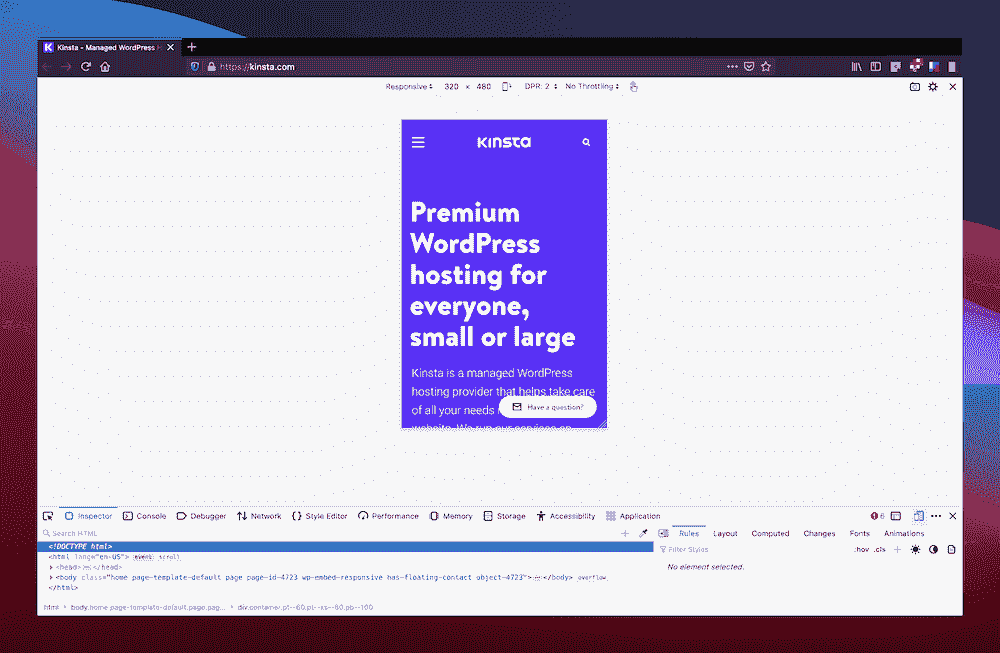

A mobile device layout view in Firefox.

虽然 Safari 只让你选择不同的苹果设备，但其他浏览器会为你提供你需要的工具，以移动优先的原则进行设计。例如，您可以选择视口的方向，以及要模拟的设备:

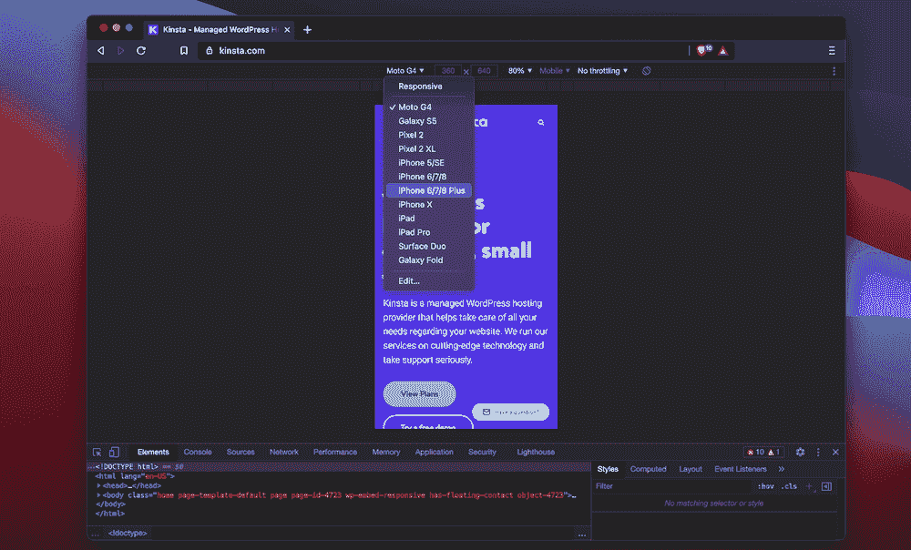

The “Device Emulation” list in Brave.

这里还有另外两个有趣的特性。首先，你可以选择一个仿真的网络速度。Safari 不包含这方面的任何选项，基于 Chromium 的浏览器提供了一个小的、通用的网络节流选择:

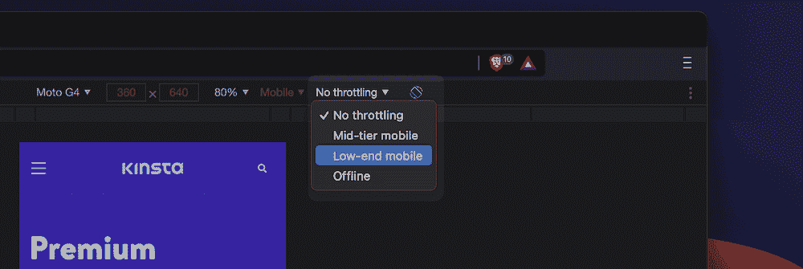

The throttling options in Brave.

Firefox 在这方面做得最好，有很多网络选项可供选择:

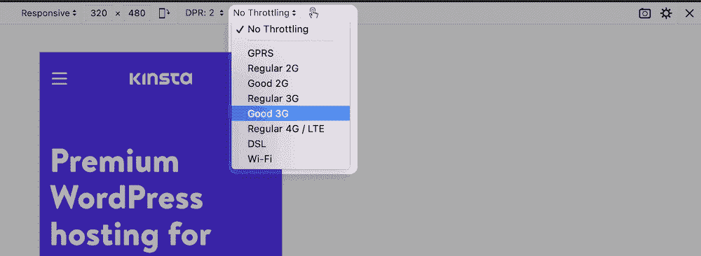

Firefox’s throttling options.

为了使事情更完整，你也可以模拟触觉反馈和传感器识别。这是基于 Chromium 的浏览器的默认设置，在 Firefox 中，你必须打开它:

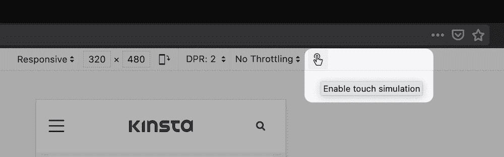

The haptic feedback option in Firefox.

Firefox 在这方面落后了，因为 Chrome、Brave 和其他公司将你的光标显示为一个小的“指尖状”覆盖层。这个功能对任何浏览器来说都不是完美的，尽管它是一个确定你的网站如何在其他设备上运行的可靠方法。

对于许多 web 开发人员来说，这种测试经常半途而废。也就是说，当浏览器提供这样全面的解决方案时，现在没有借口了。

### 使用检查元素工具时的键盘快捷键

大多数浏览器的键盘快捷键在不同的浏览器中通常是相同的。如果您在各种工具之间转换来测试您的站点，这是一个好消息。

以下是一些最流行(也是最有价值)的快捷方式的快速列表:

| 打开检查元素工具 | **Mac 的 Command + Shift + C** ，Windows 的 **Control + Shift + C** |
| 在节点间移动 | **向上**和**向下**箭头 |
| 展开选定的节点 | **右**箭头 |
| 折叠选定的节点 | **左**箭头 |
| 递归展开和折叠节点 | **Option + Click** 用于 Mac， **Alt + Click** 用于 Windows |
| 在节点内移动以使用属性 | **回车**或**回车** |
| 向前遍历节点的属性 | **选项卡** |
| 向后遍历节点的属性 | **Shift + Tab** |
| 隐藏或显示选定的节点 | **H** |
| 以 HTML 格式编辑和停止编辑节点 | **F2** |
| 当选择 CSS 属性时，将该值递增 1 | **向上**箭头 |
| 当选择 CSS 属性时，将该值减 1 | **向下**箭头 |
| 当选择 CSS 属性时，将该值递增 10 | **Shift +向上**箭头 |
| 当选择 CSS 属性时，将该值减 10 | **Shift +向下**箭头 |
| 当选择 CSS 属性时，将该值增加 0.1 | **Option +向上**箭头用于 Mac， **Alt +向上**箭头用于 Windows |
| 选择 CSS 属性时，将该值减 0.1 | **Option +向下**箭头用于 Mac， **Alt +向下**箭头用于 Windows |

当然，还有更多快捷方式可用。Mozilla 为 Firefox 提供了出色的文档，而 Chrome、Brave、Edge 和其他 T2 共享快捷方式。苹果对 Safari 开发者快捷方式的帮助不大，因为他们的帮助页面中没有定义的列表。相反，我们建议通读 Safari 开发者工具的[官方文档](https://support.apple.com/en-us/guide/safari-developer/welcome/mac)。

[Take a deep dive into the browser's Inspect Element feature (and all the tools it has in store) with this extensive guide 🔎Click to Tweet](https://twitter.com/intent/tweet?url=https%3A%2F%2Fkinsta.com%2Fblog%2Finspect-element%2F&via=kinsta&text=Take+a+deep+dive+into+the+browser%27s+Inspect+Element+feature+%28and+all+the+tools+it+has+in+store%29+with+this+extensive+guide+%F0%9F%94%8E&hashtags=HTML%2CCSS)

## 摘要

Web 开发不再只是 HTML。这里面涉及到很多技术。即使坚持 HTML、CSS 和 JavaScript 的三位一体，您仍然需要了解网站如何将所有这些组件整合在一起。

浏览器的 Inspect Element 工具是查看网站内部并明确了解其工作细节的最佳方式之一。虽然它是一个很好的学习辅助工具，但它也可以帮助你测试你的网站的变化，并发现它在不同的设备和移动网络上是如何工作的。

你经常使用 Inspect 元素吗？如果有，你最喜欢的功能是什么？在评论区分享你的观点吧！

* * *

让你所有的[应用程序](https://kinsta.com/application-hosting/)、[数据库](https://kinsta.com/database-hosting/)和 [WordPress 网站](https://kinsta.com/wordpress-hosting/)在线并在一个屋檐下。我们功能丰富的高性能云平台包括:

*   在 MyKinsta 仪表盘中轻松设置和管理
*   24/7 专家支持
*   最好的谷歌云平台硬件和网络，由 Kubernetes 提供最大的可扩展性
*   面向速度和安全性的企业级 Cloudflare 集成
*   全球受众覆盖全球多达 35 个数据中心和 275 多个 pop

在第一个月使用托管的[应用程序或托管](https://kinsta.com/application-hosting/)的[数据库，您可以享受 20 美元的优惠，亲自测试一下。探索我们的](https://kinsta.com/database-hosting/)[计划](https://kinsta.com/plans/)或[与销售人员交谈](https://kinsta.com/contact-us/)以找到最适合您的方式。