# 如何在本地安装 WordPress(Windows，macOS，Linux)

> 原文：<https://kinsta.com/blog/install-wordpress-locally/>

有时候在本地机器上使用 WordPress 会更方便。然而，如果你不熟悉如何在本地安装 WordPress，你可能想知道这是否是你可以自己管理的事情。

好消息是在本地安装 WordPress 可以通过几个简单的步骤完成。无论你是想测试新功能，试验开发项目，还是在发布之前建立一个 WordPress 站点，本地 WordPress 安装程序都可以帮你做到。

在本帖中，我们将分享如何使用 DevKinsta、DesktopServer、XAMPP、WAMP 或 MAMP 在 Windows、Mac 和 Ubuntu/Linux 上本地安装 WordPress。

我们开始吧！

## 本地安装 WordPress 的介绍

在 Kinsta，我们有一个[准备环境](https://kinsta.com/help/staging-environment/),允许轻松开发和测试。但是，在本地安装 WordPress 也有一些好处。例如，您可能正在旅行，但无法使用 Wi-Fi。如果是这种情况，您可能需要本地安装才能继续工作。

此外，在处理文件和本地编辑时，本地安装有时会更快。启动和运行它通常需要较少的设置。

当你想在本地安装 WordPress 时，你需要在你的机器上设置一个本地 AMP 栈。以 WordPress 为例，AMP 代表 Apache、MySQL、PHP。这些软件需要模仿一个[管理的 WordPress 主机](https://kinsta.com/blog/managed-wordpress-hosting/)在它的网络服务器上为你运行的内容。


> 需要在这里大声喊出来。Kinsta 太神奇了，我用它做我的个人网站。支持是迅速和杰出的，他们的服务器是 WordPress 最快的。
> 
> <footer class="wp-block-kinsta-client-quote__footer">
> 
> 
> 
> <cite class="wp-block-kinsta-client-quote__cite">Phillip Stemann</cite></footer>

[View plans](https://kinsta.com/plans/)

有多种方法可以用来做这件事。最常见的选项包括 WAMP、XAMPP 和 MAMP。这些都是很棒的工具，我们将带您了解每一个工具。

然而，它们*被设计成与各种其他软件和工具一起工作，可能需要一点学习曲线。因此，我们将首先向您介绍 DesktopServer，它实际上是专门为 WordPress 设计和优化的本地 AMP 堆栈。*

[将 WordPress 放在离家近的地方安装🏡 点击推文](https://twitter.com/intent/tweet?url=https%3A%2F%2Fkinsta.com%2Fblog%2Finstall-wordpress-locally%2F&via=kinsta&text=Keep+WordPress+close+to+home+with+local+installation+%F0%9F%8F%A1&hashtags=webdev%2Cstagingenvironment)


## 如何用 DevKinsta 在本地安装 WordPress

DevKinsta 是 Kinsta 自己的[WordPress](https://kinsta.com/feature-updates/local-wordpress-development/)本地开发工具。DevKinsta 让你只需点击一下就可以创建本地 WordPress 网站，它配备了先进的数据库和电子邮件管理工具，并与 [MyKinsta](https://kinsta.com/mykinsta/) 完全集成。

最棒的是，DevKinsta 完全免费！


DevKinsta


在我们深入研究如何安装 DevKinsta 之前，这里有一些关键特性:

*   支持多站点和 [WP-CLI](https://kinsta.com/blog/wp-cli/) 的一键式 WordPress 网站创建。
*   由 [Nginx](https://kinsta.com/knowledgebase/what-is-nginx/) 、 [MySQL](https://kinsta.com/blog/mariadb-vs-mysql/) 和最新版本的 [PHP](https://kinsta.com/knowledgebase/what-is-php/) 支持的现代堆栈。
*   MyKinsta 集成——导入 Kinsta 托管的站点，并将更改推送到 Kinsta。
*   用[管理员](https://www.adminer.org/)进行数据库管理。
*   [SMTP 服务器](https://kinsta.com/blog/free-smtp-server/)和用于检查外发电子邮件的电子邮件捕获工具。

DevKinsta 可以在 macOS、Windows 和 Linux (Ubuntu)上免费下载。

让我们来看看如何在您的计算机上设置 DevKinsta。

### 步骤 2:如何下载并安装 DevKinsta

要开始，请在这里下载 DevKinsta 的最新版本。

*   要在 macOS 上安装 DevKinsta，请打开 DMG 文件，并将 DevKinsta 应用程序拖到“应用程序”文件夹中。双击“应用程序”文件夹中的 DevKinsta。
*   要在 Windows 上安装 DevKinsta，双击 DevKinsta 可执行文件并逐步完成安装向导。
*   要在 Ubuntu 上安装 DevKinsta，请下载。deb 打包安装。这可以在命令行上完成，或者使用您首选的软件包安装程序。

当你第一次启动 DevKinsta 时， [Docker Desktop](https://www.docker.com/products/docker-desktop) 会作为一个依赖项被安装。DevKinsta 使用 Docker 桌面来创建容器化的 WordPress 环境。

在 DevKinsta 安装过程中，您可能会看到一条弹出消息，上面写着“Docker 桌面需要特权访问”如果您看到该消息，请单击“确定”并提供您的用户帐户密码，以便 Docker Desktop 可以正确安装。

在您提供安装密码后，DevKinsta 将安装 Docker 桌面以及一些 Docker 映像。安装可能需要一些时间，这取决于您的互联网连接速度，因此您可以暂时离开电脑。

### 如何用 DevKinsta 创建一个本地 WordPress 站点

DevKinsta 支持三种创建本地 WordPress 站点的方法。


在站点创建过程中，根据您的 macOS 或 Windows 版本，可能会提示您提供用户密码或确认权限弹出窗口。在某些操作系统上，DevKinsta 需要扩展权限才能将站点文件写入磁盘。


1.  **新的 WordPress 站点**让你创建一个本地站点，默认的主机栈由 Nginx，MySQL，PHP 7.4 和 WordPress 的最新版本组成。
2.  **从 Kinsta 导入**让您只需点击几下鼠标，就可以将 Kinsta 上的站点克隆到您的本地计算机上。在您完成工作之后，您甚至可以将更改推回到一个 Kinsta 暂存环境中！
3.  **自定义站点**让你用自定义的[托管栈](https://kinsta.com/blog/fastest-wordpress-hosting/)创建一个本地站点。这个选项允许你[选择你的 PHP 版本](https://kinsta.com/blog/install-php/)，指定你的数据库名称，并启用 [WordPress multisite](https://kinsta.com/blog/wordpress-multisite/) 。


DevKinsta has three methods for creating local WordPress sites.


让我们更仔细地看看每一种站点创建方法。

#### 新的 WordPress 站点

要开始，选择[“新的 WordPress 站点”选项](https://kinsta.com/knowledgebase/devkinsta/creating-a-site/#new-wordpress-site)。对于这种网站创建方法，你所要做的就是指定一个网站名称、WordPress 管理员用户名和 WordPress 管理员密码。填写完这三个字段后，单击“创建站点”。


Create a new WordPress site in DevKinsta.


#### 从 Kinsta 导入

第二种选择是导入已经托管在 Kinsta 上的站点环境。为此，[点击“从 Kinsta 导入”](https://kinsta.com/knowledgebase/devkinsta/creating-a-site/#import-from-mykinsta)并提供您的 MyKinsta 登录信息。

登录后，选择您想要克隆到本地计算机的 Kinsta 环境。DevKinsta 在 Kinsta 上支持实时环境和临时环境，所以一定要选择正确的环境。

单击环境后，指定该站点是否为多站点安装，然后单击“导入站点”开始克隆您的站点。

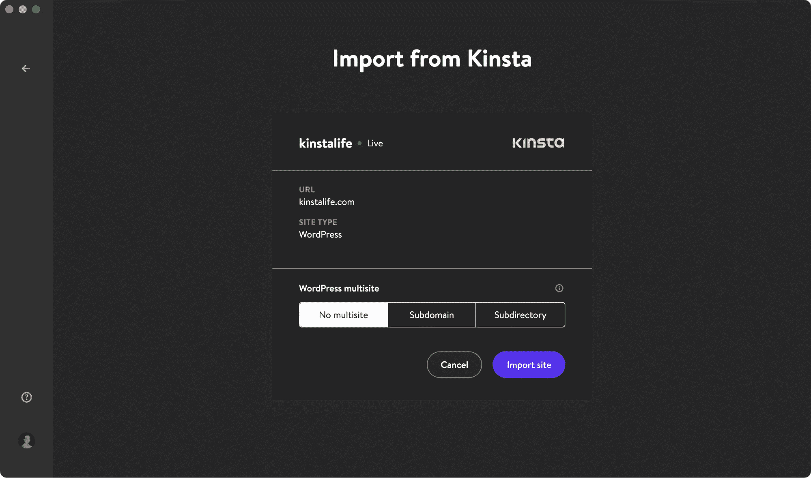

Clone your live site with the “Import from Kinsta” feature.


#### 自定义网站

第三个也是最后一个选项，[“自定义站点”，](https://kinsta.com/knowledgebase/devkinsta/creating-a-site/#custom-site)让你为你的本地 WordPress 安装配置特定的设置。

以下是使用这种网站创建方法可以调整的设置:

*   站点名
*   PHP 版本(PHP 7.2、7.3、7.4 和 8.0)
*   数据库名称
*   启用 HTTPS
*   WordPress 网站标题
*   WordPress 管理邮件
*   WordPress 管理员用户名
*   WordPress 管理员密码
*   WordPress 多站点模式

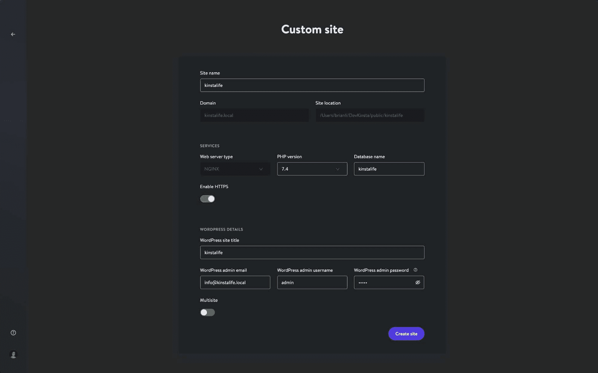

Customize a local WordPress installation with DevKinsta.


配置所需设置后，单击“创建网站”开始网站创建过程。

#### 导航 DevKinsta 的“站点信息”屏幕

创建一个站点后，你会看到[“站点信息”屏幕](https://kinsta.com/knowledgebase/devkinsta/site-information/)。DevKinsta 中创建的每个站点都有自己的“站点信息”页面，你可以把这个屏幕想象成本地 WordPress 站点的 mission control 仪表板。

在这个屏幕上，你可以找到有用的信息，比如站点身份细节、PHP 版本、WordPress 版本、 [SSL 模式](https://kinsta.com/blog/http-to-https/)、数据库凭证、站点主机名。

“站点信息”屏幕也有方便的按钮，用于在网络浏览器中打开你的本地站点，将站点推至 [Kinsta staging environment](https://kinsta.com/help/staging-environment/) ，启动 [Adminer](https://kinsta.com/blog/adminer/) 进行数据库管理，以及访问你的本地 WordPress 安装的 WordPress 管理仪表板。

让我们浏览一下“站点信息”屏幕每个部分的关键方面。

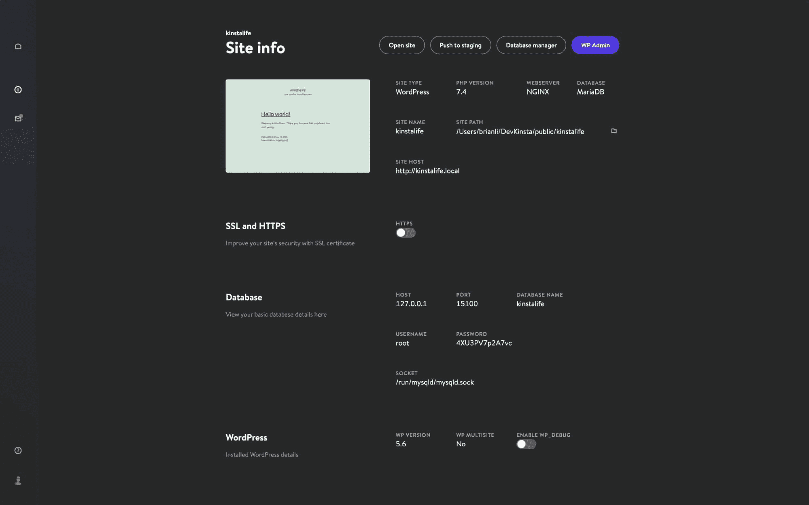

The “Site Info” screen in DevKinsta.


“站点信息”屏幕的顶部有关于你的 WordPress 站点的一般信息。对于开发者来说，“站点路径”和“站点主机”尤其有用。“站点路径”指的是 WordPress 安装在本地文件系统上的位置，你可以点击文件夹图标直接进入文件夹，开始编辑主题、插件等等。“站点主机”是一个定制的`.local`域名(例如 [https://kinstalife.local](https://kinstalife.local) )，你可以用它在网络浏览器中访问本地 WordPress 站点。

“SSL 和 HTTPS”部分包含一个 HTTPS 开关，它自动为你的本地 WordPress 站点生成一个 [SSL 证书](https://kinsta.com/help/how-to-install-ssl-certificate/)，并允许你通过 HTTPS 访问该站点。

“数据库”部分显示了本地 WordPress 站点的数据库设置。如果你想通过 MySQL 命令行工具或第三方数据库管理工具访问你的 [WordPress 数据库](https://kinsta.com/knowledgebase/wordpress-database/),请提供这些信息。

最后,“WordPress”部分显示你的 WordPress 核心版本，多站点模式状态，甚至还有一个启用 [WP_DEBUG 模式](https://kinsta.com/blog/wordpress-debug/)的开关来排除你的 WordPress 站点的故障。
T3】

### 管理 DevKinsta 中的多个站点

对于同时从事多个项目的机构和开发者来说，DevKinsta 可以让你部署和管理多个本地 WordPress 站点！DevKinsta 管理的每个本地 WordPress 站点都运行在自己的容器化环境中。这意味着每个网站都有自己可定制的 PHP 版本、WordPress 版本、电子邮件收件箱等等。

要查看您的 DevKinsta 站点列表，请单击左侧边栏中的站点图标。

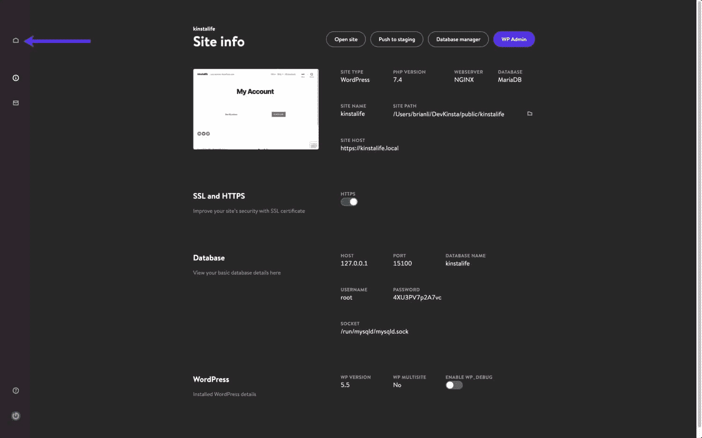

Deploy multiple WordPress local environments with DevKinsta.


在这个屏幕上，你可以看到所有本地 WordPress 站点的列表。要添加另一个站点，只需点击“添加站点”按钮。

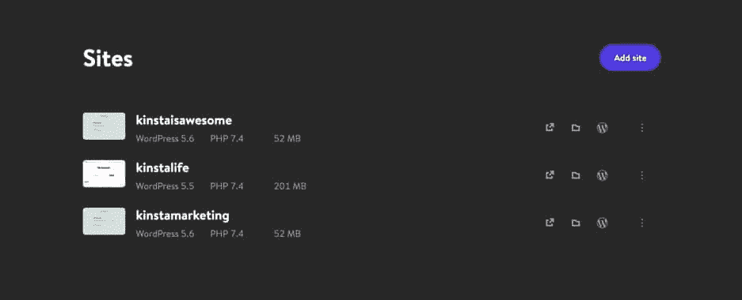

Manage multiple local WordPress sites with DevKinsta.


### DevKinsta 中的 MyKinsta 集成

对于在 Kinsta 上托管 WordPress 站点的用户来说，DevKinsta 使得在线推送变更到 Kinsta 暂存环境变得更加容易。要将本地站点推送至 Kinsta，只需点击“站点信息”页面上的“推送至暂存”按钮。

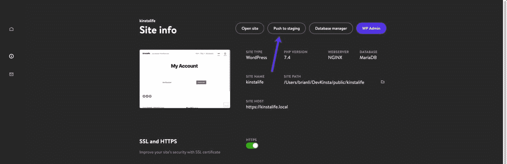

Push your local WordPress site to a Kinsta staging environment.


如有必要，系统会提示您输入 MyKinsta 凭据。

然后，您需要选择要推送的目标站点。请记住，此过程将覆盖当前暂存环境的内容(如果存在)。

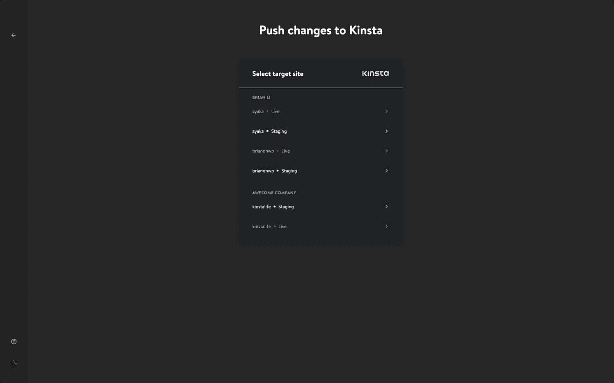

Choose a staging environment to push changes to.


最后，单击“推送至暂存”以确认操作。

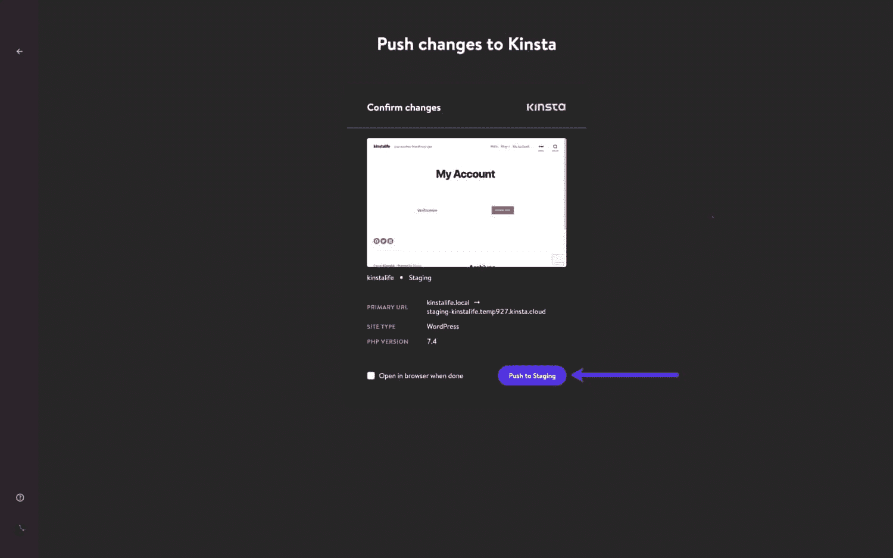

Confirm the “Push to Staging” action.


将您的本地 WordPress 站点推送到 Kinsta 之后，您就可以通过 staging environment [URL](https://kinsta.com/knowledgebase/what-is-a-url/) 查看该站点。如果有必要，你可以接着[推送 staging 到 MyKinsta](https://kinsta.com/help/push-staging-live/) 居住。

### 如何使用 Adminer 管理您的数据库

DevKinsta 附带了一个名为 [Adminer](https://kinsta.com/knowledgebase/devkinsta/database-manager/) 的轻量级数据库管理工具。像我们用于 Kinsta 上托管的站点的 [phpMyAdmin](https://kinsta.com/help/wordpress-phpmyadmin/) 一样，Adminer 为您提供了一个 web 界面来编辑数据库表、运行数据库查询、导入和导出备份等等。

要启动 Adminer，点击“站点信息”页面顶部的[“数据库管理器”按钮](https://kinsta.com/knowledgebase/devkinsta/database-manager/#accessing-database-manager)。Adminer 将在您的默认 web 浏览器中打开。

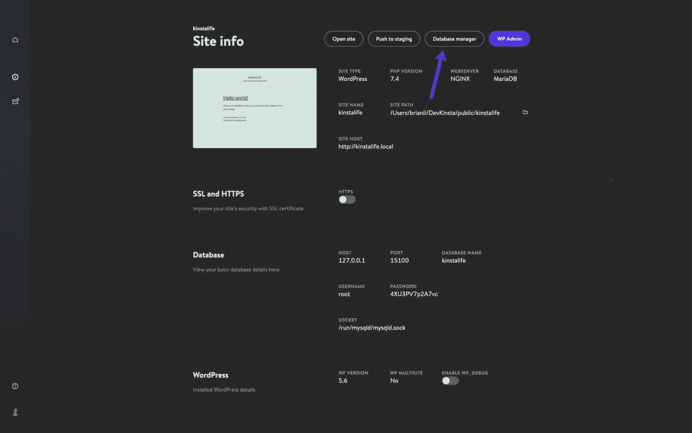

Click “Database Manager” to access Adminer in DevKinsta.


启动 Adminer 后，你会看到你的 WordPress 数据库的表格。下面的截图显示了我们的“kinstalife”测试站点的数据库。在“表格”栏下，你可以看到默认的 WordPress 表格，如`wp_comments`、`wp_posts`等。

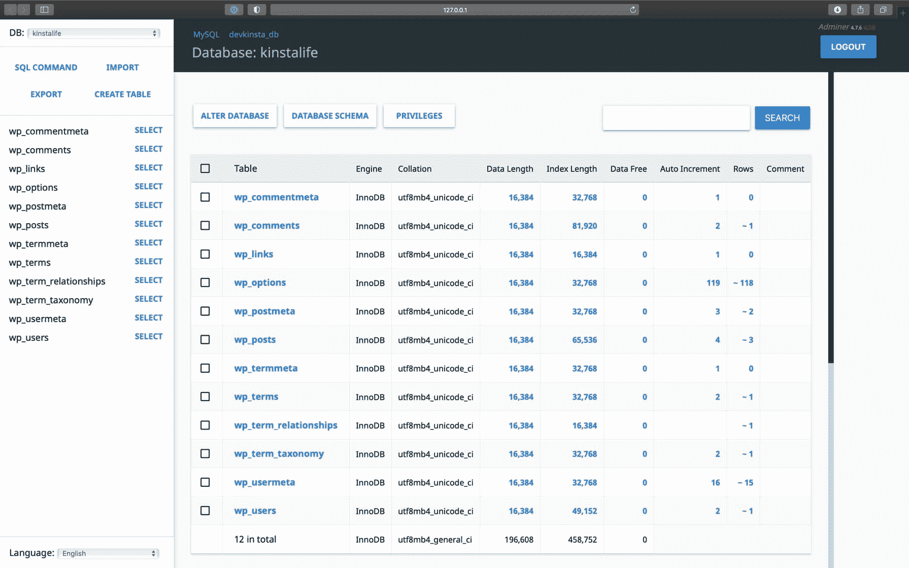

WordPress database in Adminer.


要编辑数据库条目，请单击所需的表格。例如，如果我们想编辑 WordPress 站点的 home 和 ite URL，我们可以点击`wp_options`表。

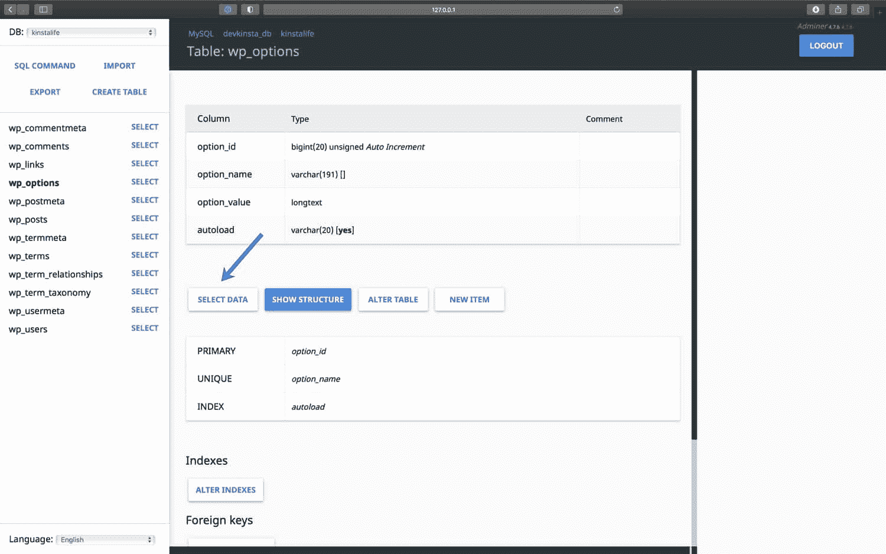

Click “Select Data” to edit your WordPress database tables.


在这个页面上，我们可以编辑`siteurl`的`option_value`来更新我们 WordPress 站点的 URL，同样的事情也可以在主页 URL 上进行。

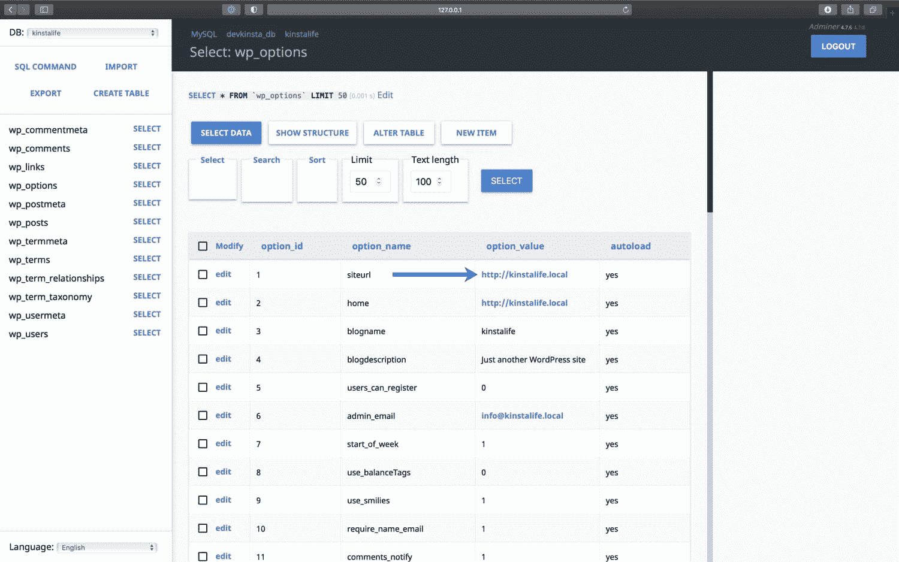

Edit a WordPress database “option_value” with Adminer.


Adminer 也支持数据库导入和导出。这对于处理数据库备份文件很有用，比如我们在[可下载备份](https://kinsta.com/feature-updates/downloadable-backups/)中包含的文件。

要导入数据库文件，单击 Adminer 左上角的“import”。单击“选择文件”选择数据库备份，然后单击“执行”开始导入过程。Adminer 支持原始的`.sql`文件和压缩的`.sql.gz`文件。

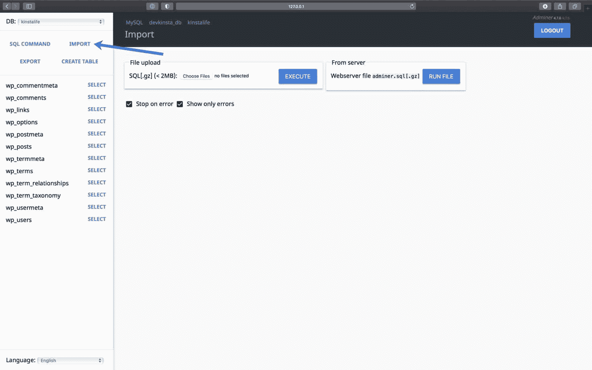

Import a database backup with Adminer.


要导出完整的数据库备份，请单击 Adminer 左上角的“导出”。选择“gzip”作为输出格式，选择“SQL”作为数据库格式，其他设置保持不变。单击“导出”开始备份过程。

Adminer 会将你的 WordPress 数据库导出到一个压缩的`.sql.gz`文件中。

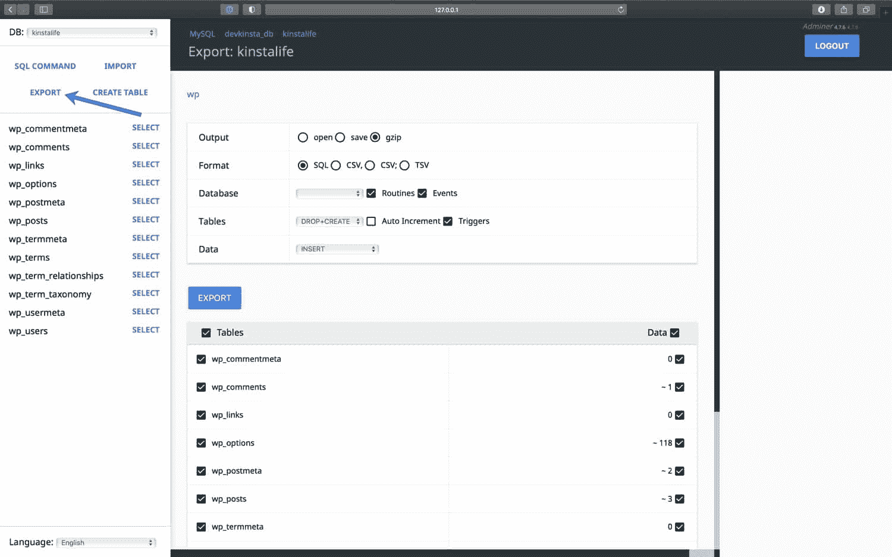

Export a database backup from Adminer.


最后，Adminer 支持 SQL 命令执行，这意味着您可以在您的 WordPress 数据库上运行数据库查询。例如，如果您试图查找数据库中自动加载的数据量，您可以在 Adminer 中运行下面的 SQL 命令。

```
SELECT SUM(LENGTH(option_value)) as autoload_size FROM wp_options WHERE autoload='yes';
```

要运行数据库查询，请单击 Adminer 左上角的“SQL Command”。指定数据库查询，然后单击“执行”运行命令。

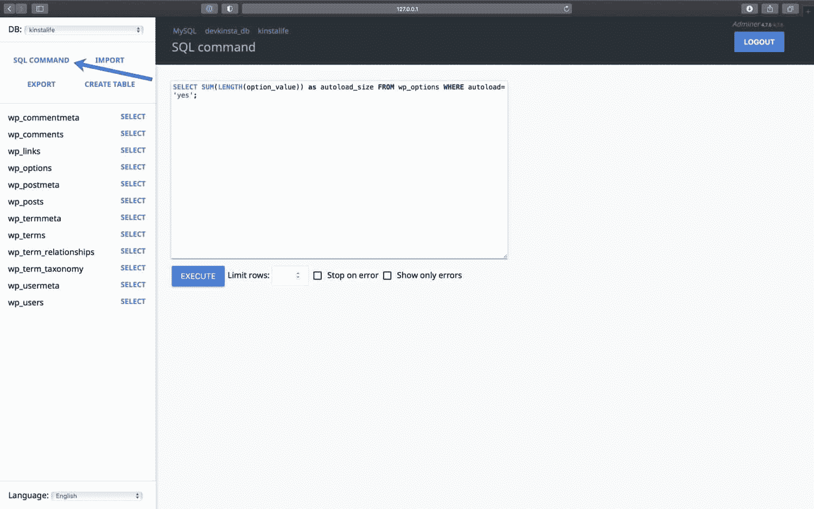

Query your database with a SQL command in Adminer.


有了 DevKinsta 的 Adminer 集成，你可以更好地控制你的 WordPress 数据库。

无论您需要编辑数据库表、导入或导出备份，还是运行复杂的 SQL 命令，DevKinsta 都能满足您的需求！

### 如何检查从 WordPress 发出的电子邮件

DevKinsta 包括一个[内置的 SMTP 服务器和电子邮件捕获工具](https://kinsta.com/knowledgebase/devkinsta/email-inbox/)。这允许你的本地 WordPress 站点像一个活的生产站点一样发送邮件。然而，发送的电子邮件将被捕获并存储在 DevKinsta 的电子邮件收件箱中。

这为您提供了两全其美的体验——您可以使用 DevKinsta 测试针对[营销自动化工作流](https://kinsta.com/blog/email-marketing-statistics/#most-popular-email-marketing-automation)、 [WooCommerce](https://kinsta.com/learn/woocommerce-guide/) 订单确认等的外发电子邮件功能，而无需向您的访客和客户的电子邮件收件箱发送垃圾邮件。

要访问 DevKinsta 的电子邮件收件箱，请点击左侧边栏中的邮件图标。

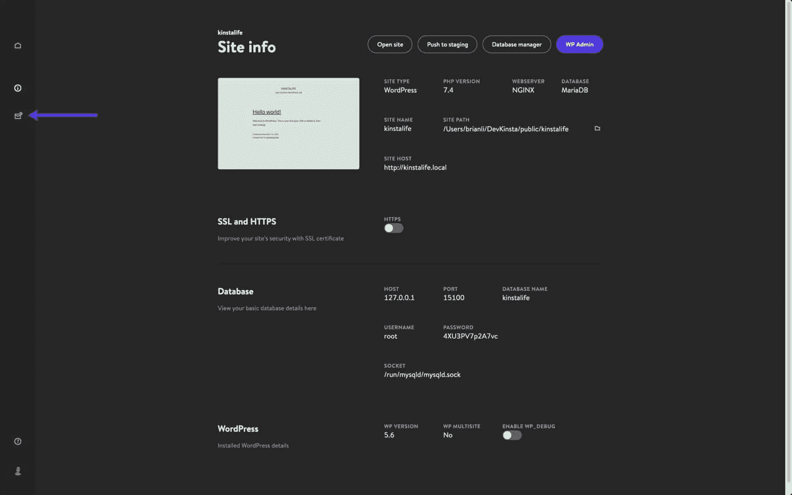

DevKinsta includes a built-in SMTP server and email capture tool.


在电子邮件收件箱中，您将看到已捕获的待发电子邮件列表。在下面的截图中，你可以看到一封来自我们的“kinstalife”测试网站的邮件。

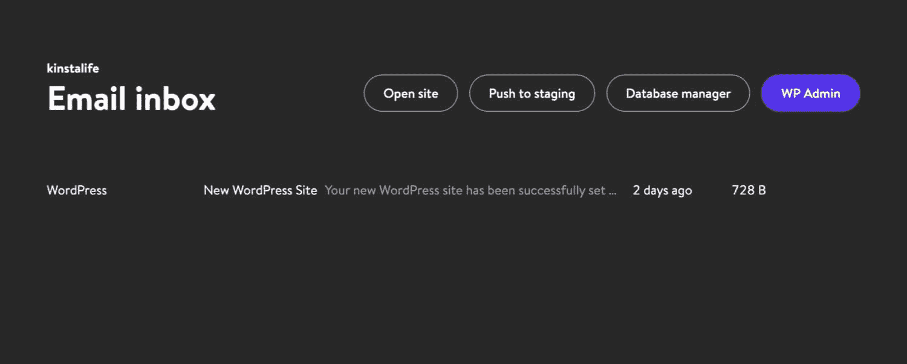

An outgoing email in DevKinsta’s email inbox.


要检查发出的电子邮件，只需点击它。对于每封电子邮件，DevKinsta 允许您检查“发件人地址”、“收件人地址”、正文内容、发送时间等等。

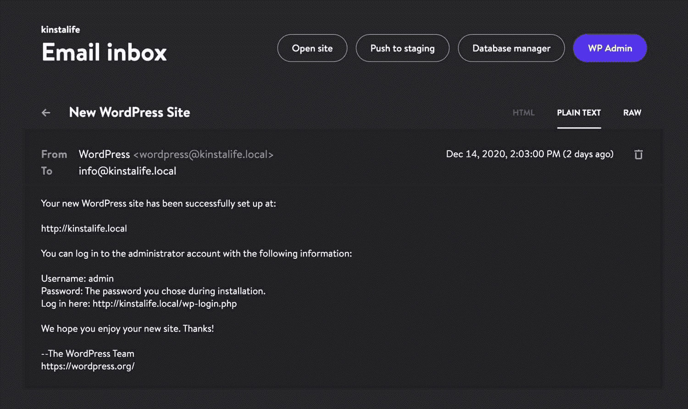

DevKinsta email inbox display modes.


您还可以选择以 HTML、纯文本或 Raw 模式显示电子邮件。HTML 模式对于测试 [HTML 电子邮件](https://kinsta.com/blog/html-email/)模板很有用，而 Raw 模式可以让你直接检查[电子邮件标题](https://kinsta.com/blog/email-header/)，比如`MIME-Version`和`X-Mailer`。

要了解更多关于 DevKinsta 的信息，请务必加入[官方社区论坛](https://community.devkinsta.com/)并阅读 [DevKinsta 文档](https://kinsta.com/knowledgebase/devkinsta/)。


## 如何使用 WAMP 在 Windows 上本地安装 WordPress

如果你想在 Windows 电脑上安装 WordPress，你也可以使用 WampServer，也就是 WAMP。WAMP 是一个专门为 Windows 设备捆绑了 Apache web 服务器、PHP 和 MySQL 的软件。下面我们来看看如何使用它在本地安装 WordPress。

### 第一步:在你的电脑上下载并安装 WAMP

第一步是下载并安装 WAMP 软件到你的电脑上。您可以通过[访问 WAP server 网站](http://www.wampserver.com/en/)并选择**开始使用 WAP server**来完成此操作:

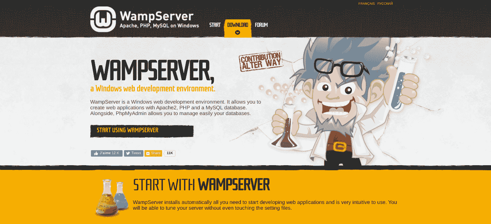

The WampServer website


这将自动把你带到网站的下载部分，在那里你将有两个版本可供选择:WampServer 32 位和 WampServer 64 位。选择适合您的操作系统的推荐选项。

如果您不确定您的操作系统是 32 位还是 64 位，您可以通过导航到**设置>关于**找到此信息:

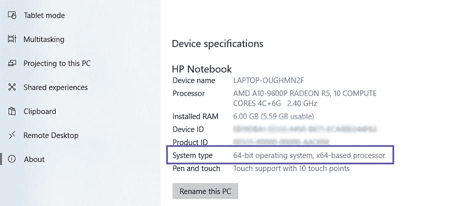

The device specifications page on Windows


在**设备规格**部分，您将能够找到您的操作系统类型。

### 步骤 2:运行 Wampserver.exe 文件开始安装

下载完软件后，点击**wampserver.exe**文件运行安装程序。这可能需要一两分钟。

此外，记下该文件下载到的位置，因为您稍后需要重新访问它:

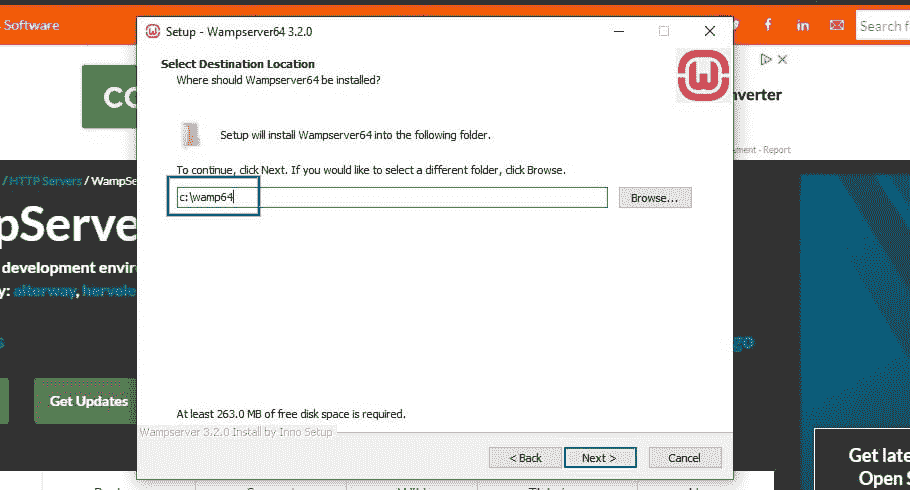

The Wamp setup window


屏幕上会出现一系列指示，提示您完成安装过程。

在此过程中，您将被要求定义一个 web 浏览器。您可以通过导航到您计算机的**程序文件**将此选项更改为您喜欢的浏览器。

### 步骤 3:创建一个新的 MySQL 数据库

下一步是建立一个空白的 MySQL 数据库。启动 WAMP 后，屏幕右下角会出现一个绿色图标。

点击图标，后面跟着 **phpMyAdmin** 。这将自动将您带到浏览器的登录屏幕:

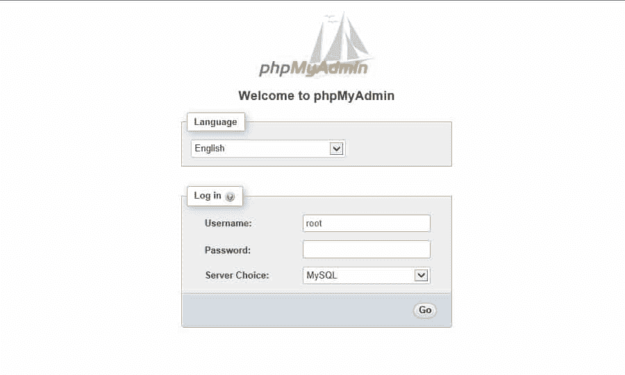

The phpMyAdmin login page


在用户名字段中，输入“root”，将密码字段留空，然后选择 **Go** 按钮。接下来，点击**数据库**:

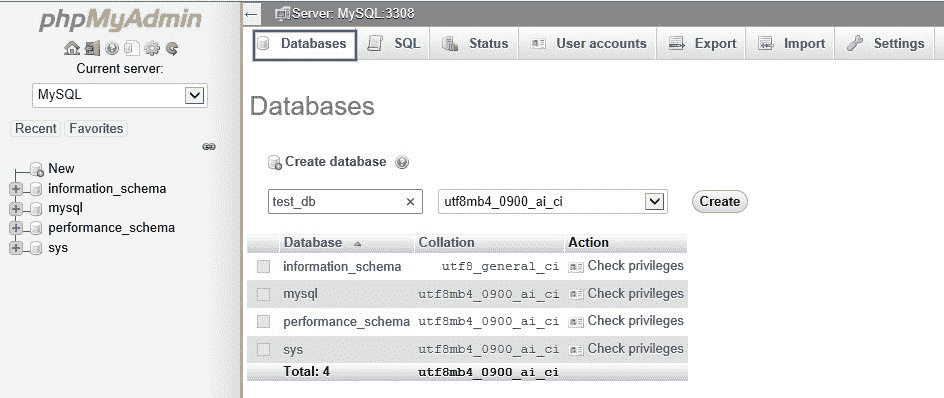

The Databases page of phpMyAdmin


在**创建数据库**部分，您需要命名新的数据库。接下来，点击**创建**。就是这样。现在你已经建立了你的[数据库](https://kinsta.com/knowledgebase/wordpress-database/)。

### 步骤 4:安装 WordPress 并解压文件

一旦你完成了数据库的创建，下一步就是在本地安装 WordPress。为此，访问[WordPress.org](https://wordpress.org/)，点击**获取 WordPress** ，然后**下载 WordPress** :

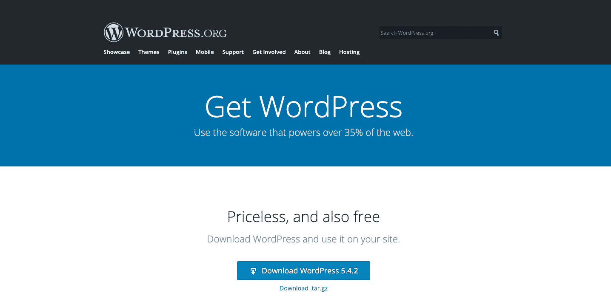

The download page on WordPress.org


这会下载一个*。将*文件压缩到你的电脑上。下一步是提取文件。点击文件夹，并选择**提取全部。**

## 注册订阅时事通讯


### 想知道我们是怎么让流量增长超过 1000%的吗？

加入 20，000 多名获得我们每周时事通讯和内部消息的人的行列吧！

[Subscribe Now](#newsletter)

完成后，右击文件夹并选择**复制**。导航回到你电脑上下载 WAMP 的文件夹，将“wordpress”文件夹粘贴到那个目录中。

此时，如果你愿意，你也可以重命名“wordpress”文件夹。文件夹的名字将是你的本地 WordPress 安装的 URL。对于本教程，我们将把我们的重命名为“mytestsite”。

### 第五步:在你的网络浏览器中访问你的本地 WordPress 站点

打开 web 浏览器，在搜索栏中键入“http://localhost/mytestsite/”。当然，用你命名的“wordpress”文件夹替换“mytestsite”。

然后软件会给出一系列提示让你设置你的 [WordPress 安装](https://kinsta.com/knowledgebase/manually-install-wordpress/)。您将选择一种语言并检查数据库信息(与我们在上一节中讨论的步骤相同)。完成后，点击**我们走吧！**:

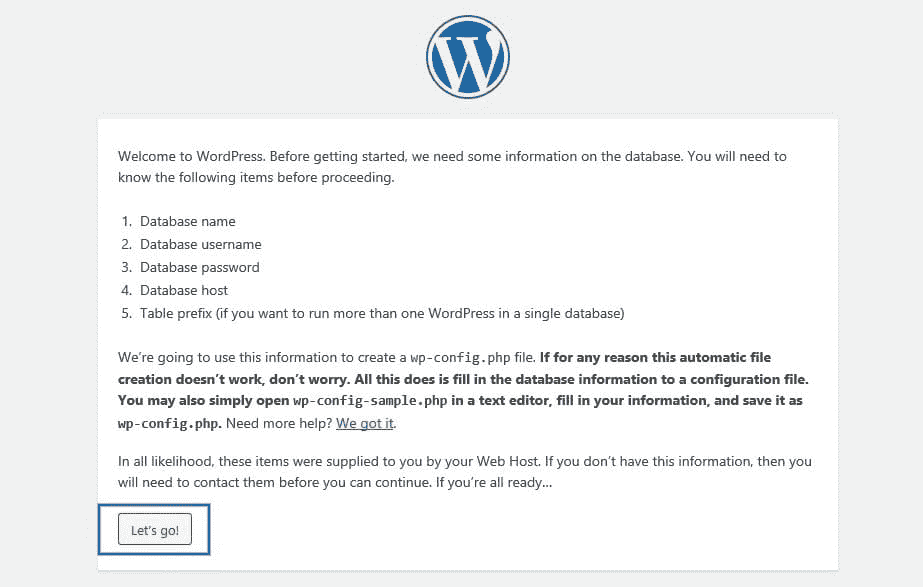

The database details page of a new WordPress installation


在下一个屏幕上，您将输入您的数据库信息。名称将是您对数据库的称呼，用户名是“root ”,您可以将密码字段留空。

接下来，点击**运行安装**按钮。然后，您可以命名您的网站，并创建用户名和密码。当你完成后，选择**安装 WordPress** 。当软件安装完成后，它会显示一个**成功！**消息。

之后可以在中点击**登录。这将把你带到你的 WordPress 站点的管理员登录页面。**

就是这样！现在您已经安装了一个本地测试环境。


## 如何使用 MAMP 在 Mac 上本地安装 WordPress

如果你正在寻找用于 Mac 电脑的本地服务器软件，你可能会考虑 MAMP。MAMP 是 Macintosh、Apache、MySQL 和 PHP 的简称。它非常用户友好，易于使用。

### 第一步:在你的电脑上下载并安装 MAMP

与前两个部分一样，第一步是下载并在您的计算机上安装 MAMP。您可以在 MAMP 官方网站上完成此操作[:](https://www.mamp.info/en/downloads/)

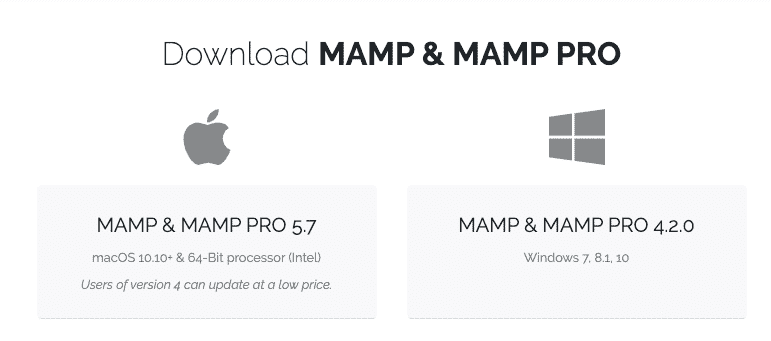

The MAMP download screen


请注意，虽然你可以免费下载和使用 MAMP，但也有[高级计划](https://www.mamp.info/en/store/)可用。

### 步骤 2:启动 MAMP 并启动您的服务器

下载完成后，点击 **mamp.pkg** 文件。将弹出一个安装窗口。选择**继续**按钮，按照一系列提示进行操作:

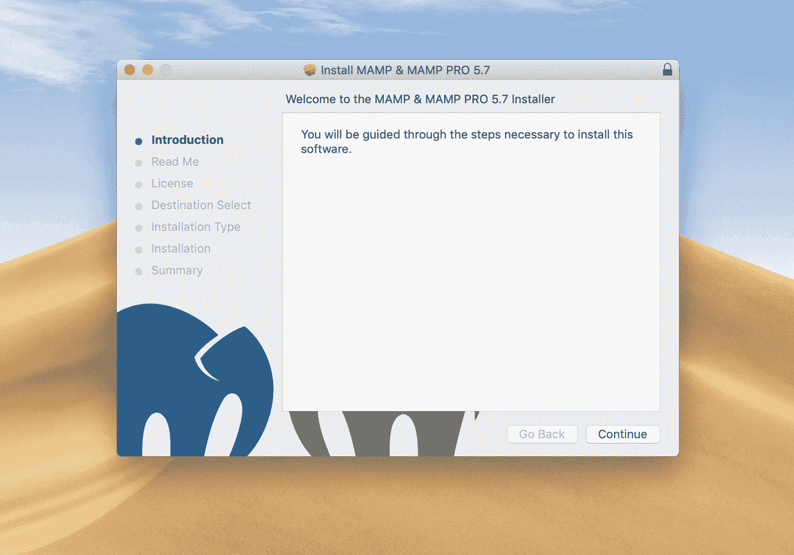

The MAMP installation window


接下来，在你的电脑上导航到 **Go >应用**，点击 MAMP 文件夹:

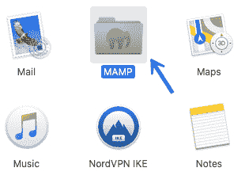

The MAMP application folder


在该文件夹中，点击 MAMP 大象图标:

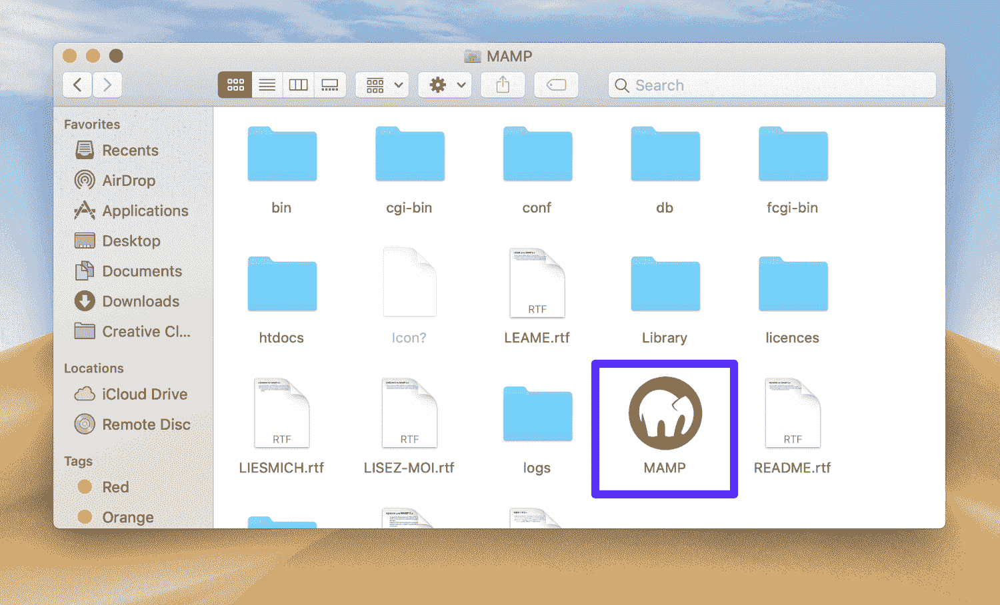

The MAMP application icon


这将打开一个新窗口。点击**启动服务器**:

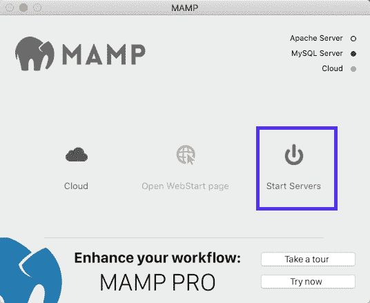

The MAMP start servers option


一旦 Apache 和 MySQL 服务器启动，MAMP 将自动在您的浏览器中打开 WebStart 页面。

### 步骤 3:创建数据库并更新用户信息

现在是创建新数据库的时候了。在 WebStart 页面上，选择**工具> phpMyAdmin** :

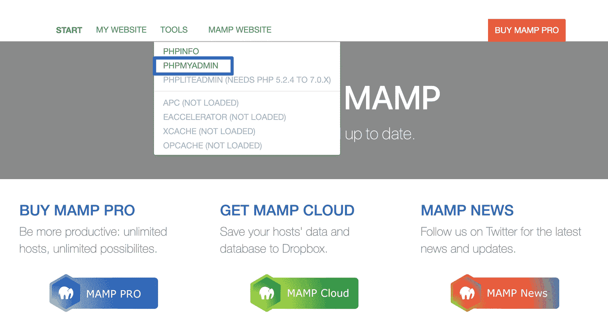

Opening phpMyAdmin via the MAMP WebStart page


一旦 phpMyAdmin 打开，点击**数据库**选项卡。命名你的数据库，然后选择**创建**:

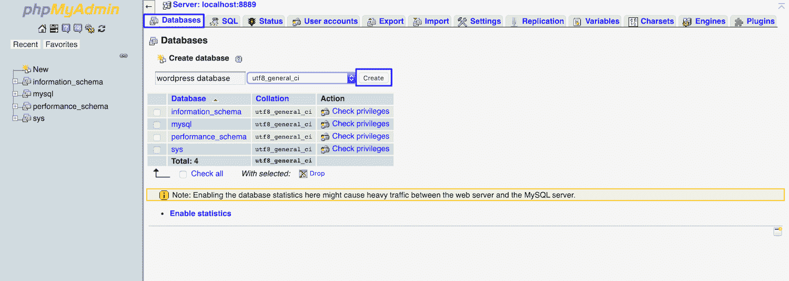

Creating a new database for your local MAMP site


接下来，你需要更新 MAMP 为你创建的默认账户的 MySQL 数据库用户证书，因为你需要它们来完成 WordPress 的安装过程。导航回 phpMyAdmin 主屏幕，点击**用户账户**选项卡。

然后，点击用户名为 **mamp:** 的账户的**编辑权限**

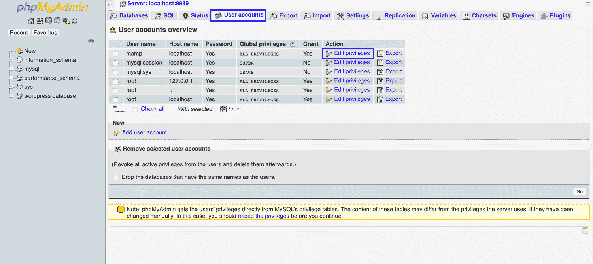

Editing the default MAMP phpMyAdmin user account


选择**更改密码**选项卡，输入您喜欢的密码，然后点击 **Go:**

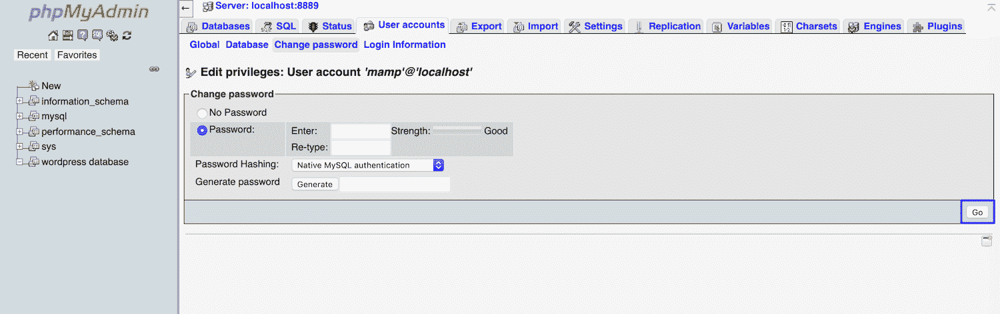

Changing the default MAMP phpMyAdmin account password


然后可以关闭 phpMyAdmin。

### 步骤 4:安装 WordPress 并从本地主机访问你的站点

现在，访问[WordPress.org 网站](https://wordpress.org/)并下载 WordPress 的最新版本。下载完成后，解压“wordpress”文件夹。右键点击文件夹，选择**复制**。

在电脑上导航回 **Go >应用> MAMP** ，打开 **htdocs** 文件夹:

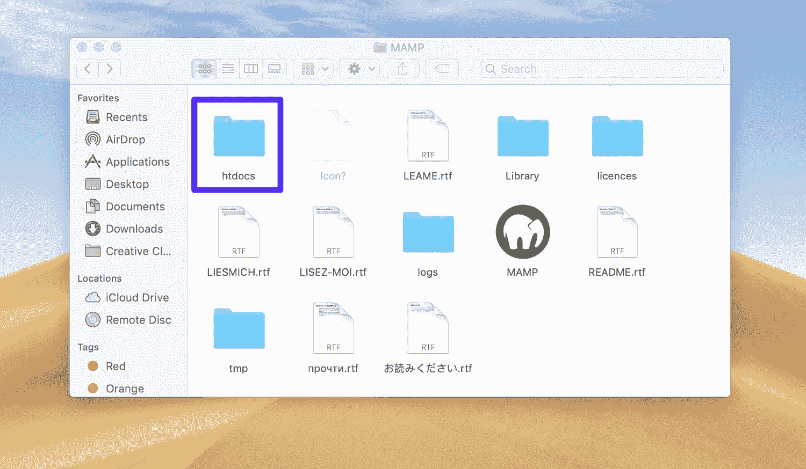

The htdocs folder in the MAMP application


在那个文件夹中，粘贴你刚刚复制的 WordPress 文件夹。我们建议将其重命名为“mytestsite”或类似的名称:

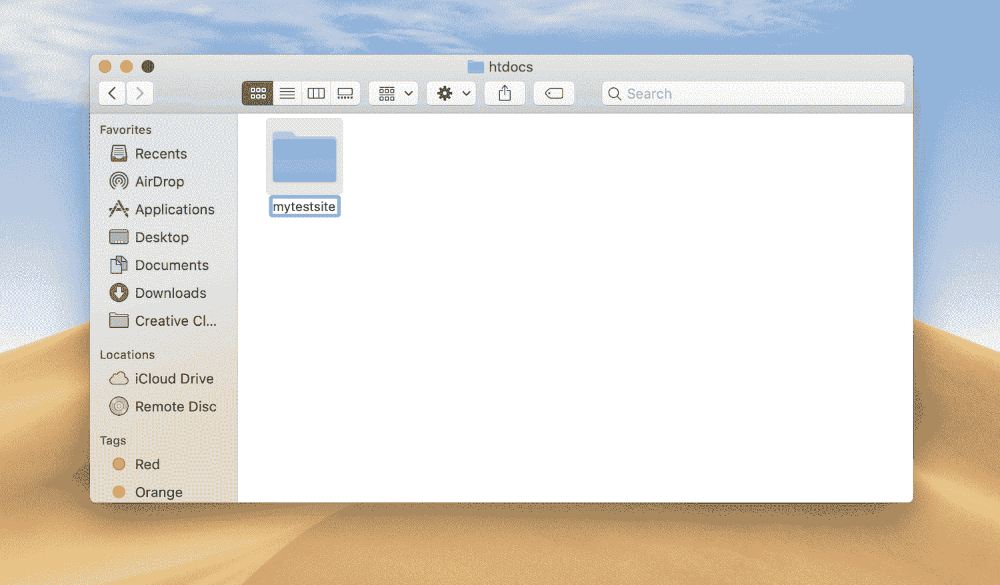

Renaming the MAMP local WordPress installation


然后，在新选项卡中浏览到“http://localhost/8888/mytestsite”。它将提示您输入您的数据库凭证，并命名您的站点:

需要为您的客户站点提供一个非常快速、安全且对开发人员友好的托管服务吗？Kinsta 是为 WordPress 开发者设计的，提供了大量的工具和强大的仪表板。[查看我们的计划](https://kinsta.com/plans/?in-article-cta)

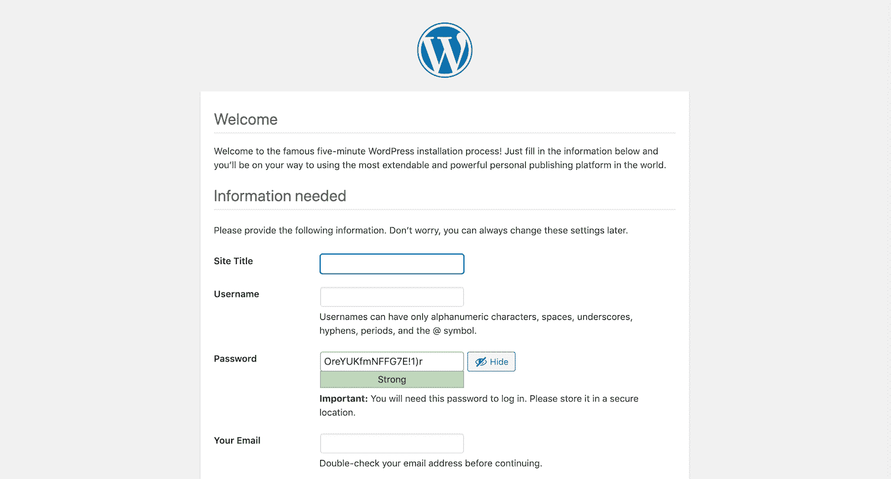

Completing the WordPress installation wizard


一旦你完成了 WordPress 的安装提示，你就完成了！如果你需要更多关于这一步的指导，你可以参考这篇文章的前一部分。

你可以在这里阅读我们的指南，了解如何在使用 MAMP 时修复“该站点无法提供安全连接”的错误。

## 如何使用 XAMPP 在本地安装 WordPress

XAMPP 是另一个流行的 PHP 开发环境，你可以用它在本地安装 WordPress。您可以在 Windows、macOS 或 Linux 上使用它。在这里，我们将带您了解如何在 Windows 上做到这一点，尽管这个过程对于 Mac 用户来说基本上是相同的。

### 第一步:在你的电脑上下载并安装 XAMPP

访问 [Apache Friends](https://www.apachefriends.org/index.html) 网站，在绿色**下载**按钮旁边，选择 **XAMPP for Windows** (或者你正在使用的任何操作系统):

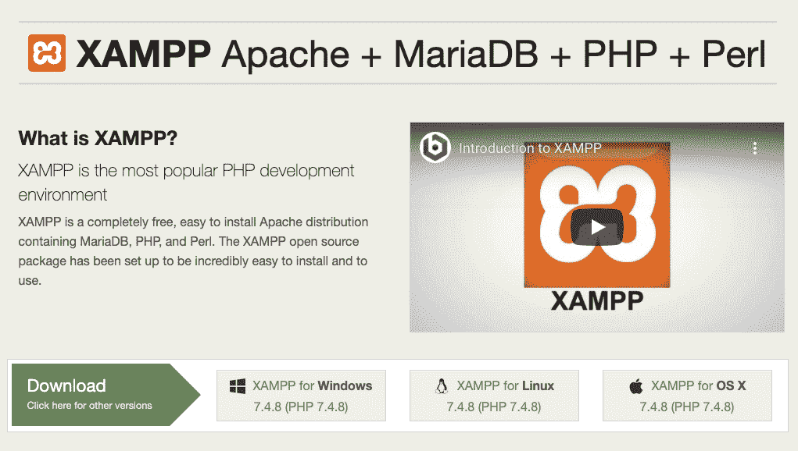

The Apache Friends website


该软件将自动下载到您的计算机上。完成后，点击**。exe** 文件来启动安装程序。

注意，对于 macOS，这将是一个**。dmg** 文件。一旦你打开它，点击 XAMPP 图标并把它拖到你的**应用**文件夹。

### 步骤 2:选择要安装的组件

运行安装程序后，会要求您选择要安装的组件。最重要的选择是 **Apache、MySQL、PHP** 和 **phpMyAdmin** :

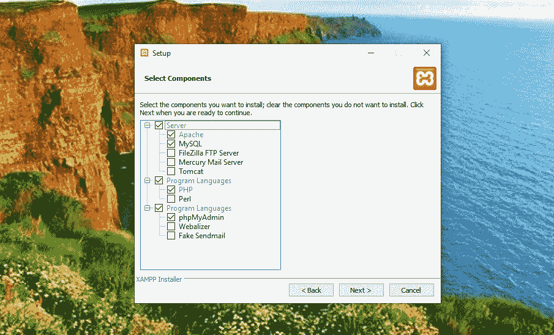

The XAMPP set up components screen


您可以取消选中其他组件，因为它们不是必需的。完成后，点击**下一个**按钮，选择你想安装 XAMPP 的文件夹。

再次点击**下一个**按钮，忽略 Bitnami 提示，再次选择**下一个**。

### 步骤 3:启动 XAMPP 控制面板并测试您的服务器

在最后一个屏幕上，选择启动 XAMPP 控制面板。在打开的 XAMPP 控制面板中，你可以点击 **Apache** 和 **MySQL** 旁边的**开始**按钮:

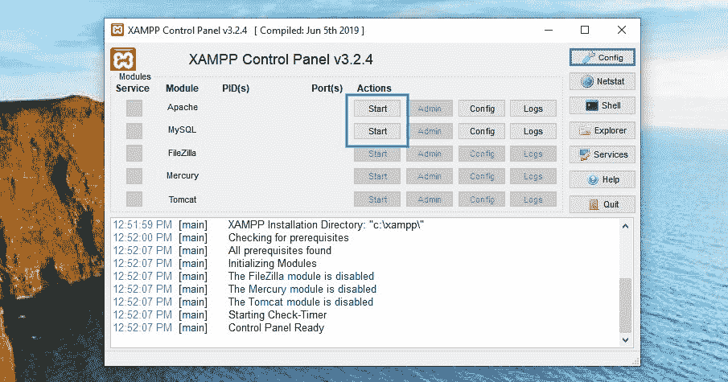

The XAMPP Control Panel


启动后，状态应该会变成绿色。现在是时候测试您的服务器了。您可以通过在 web 浏览器中输入“http://localhost/”来完成此操作。如果成功，您已经成功地将 XAMPP 添加到您的计算机中。

### 步骤 4:下载 WordPress 并创建一个数据库

下一步是在你的电脑上安装 WordPress。你可以通过去[WordPress.org](https://wordpress.org/)并点击**获取 WordPress** 来做到这一点。

包下载完成后，提取文件，然后复制文件夹。接下来，导航到你电脑上的 XAMPP 文件夹，找到并打开 **htdocs** 文件夹。

接下来，在 **htdocs** 文件夹中创建一个新文件夹。您可以按照“我的测试站点”的思路给它命名。在那个文件夹中，粘贴 WordPress 文件。

现在是创建数据库的时候了。

导航回你的 XAMPP 控制面板，选择 **MySQL** 旁边的 **Admin** 。这将启动 phpMyAdmin。

点击**数据库**，然后命名你的数据库并选择**创建**(如果你需要更多的指导，你可以参考前面的章节)。

您可以随意命名您的数据库。但是，我们建议保持简单易记，比如“test_db”。

### 第五步:在浏览器中访问你的站点，在本地安装 WordPress

要完成此过程，您可以在浏览器中访问“http://localhost/mytestsite”。记住用你命名的 WordPress 文件夹替换“mytestsite”。

系统会提示您选择一种语言，命名您的站点，并填写您的数据库详细信息。然后你可以登录到你的 WordPress 站点，开始使用你的本地环境！

## 如何用 DesktopServer 在本地安装 WordPress


### 信息

DesktopServer 现已关闭，不再可用。应该注意的是，如果你是高级订户，ServerPress 将继续支持你，直到你的订阅到期。所以，如果这是你，那么所有这些步骤仍然适用。


桌面服务器是 ServerPress 的一个伟大的 WordPress 产品，它使得在本地安装 WordPress 变得轻而易举:

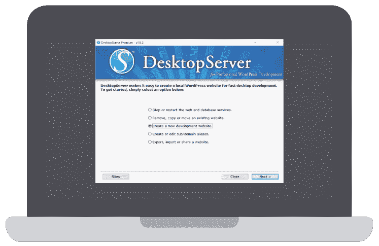

The DesktopServer screen


只需点击一个按钮，您就可以在几秒钟内启动新的开发安装。该工具还完全支持多站点和 T2，并且可以在 Windows 和 Mac 上运行。

ServerPress 有免费版和高级版，后者每年收费 99.95 美元。高级版包括一些高级功能，例如:

*   多站点支持
*   导入和导出第三方备份
*   直接部署到您的实时站点
*   绕过任何登录插件

您可以根据自己的需求选择最适合自己的版本。如果你只是需要做一些快速测试，免费版本工作得很好。

### 步骤 1:将 DesktopServer 下载到您的计算机

要在本地安装 WordPress，你首先需要在你的机器上安装一个 DesktopServer。

有 Windows 版本和 Mac 版本。对于本例，我们将使用 Windows 版本。

### 步骤 2:启动桌面服务器安装程序

文件下载完成后，下一步是启动 DesktopServer 安装程序。在此之前，解压缩您刚刚下载的文件。这可能需要几分钟才能完成。

完成后，点击**安装 DSL** :

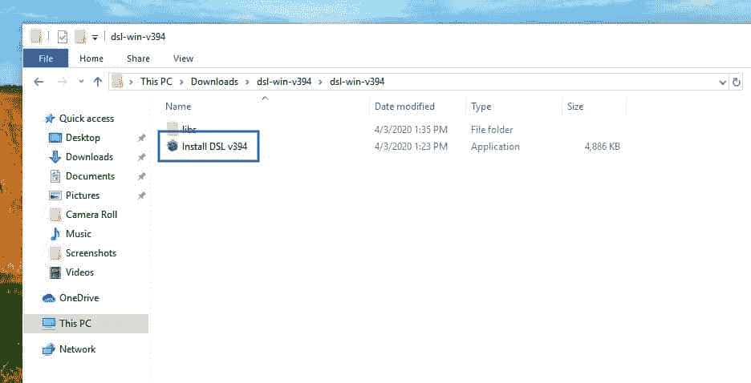

The DesktopServer Installer application


当您第一次启动该程序时，系统会提示您以管理员权限重新启动。选择**继续**。然后会提示您接受服务条款，并为您的安装选择一个选项:

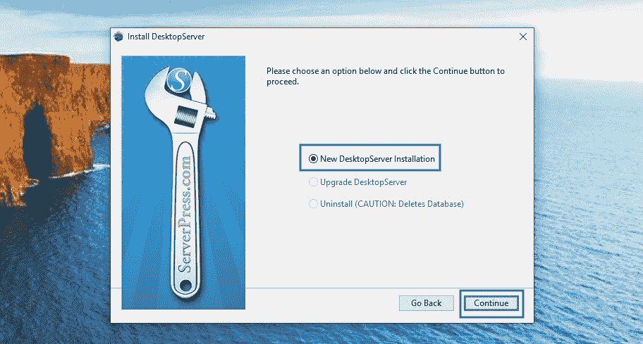

The DesktopServer Installation window


保持**新桌面安装**选中，然后点击**继续**。安装过程将开始，这可能需要一些时间。

完成后，它会弹出一个窗口让你知道它已经完成了。它还会告诉您在电脑目录的什么地方可以找到该应用程序。完成后，点击**完成**。

### 步骤 3:启用插件并启动 Apache 和 MySQL 服务

安装完成后，您可以启用大量不同的开发人员插件:

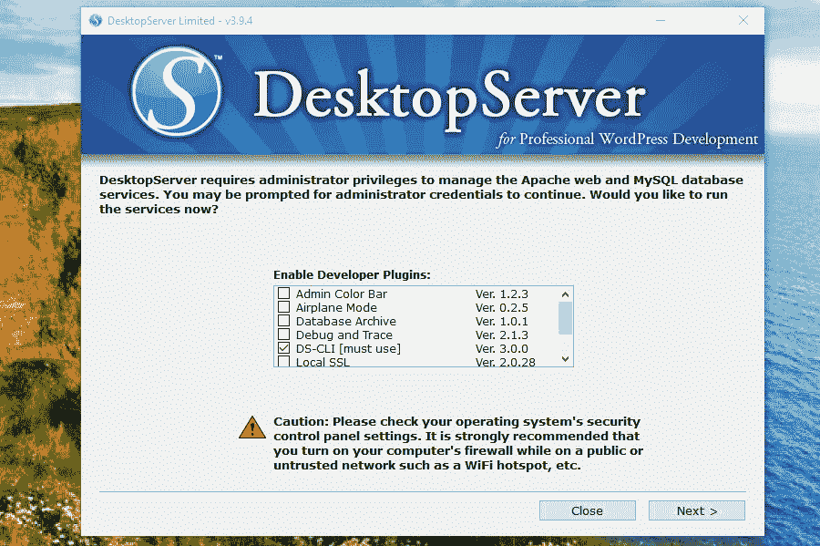

The DesktopServer developer plugins screen


当你在本地安装 WordPress 的时候，这里有一个开发者插件的简要介绍。我们强烈推荐旁路登录和 DS-CLI 插件。

*   **飞行模式:**控制本地开发时外部文件的加载。
*   **绕过登录:**允许开发者绕过登录凭证，在组合框中快速选择前 100 个用户名中的任意一个。
*   **干净导入:**重置*。 [htaccess](https://kinsta.com/knowledgebase/wordpress-htaccess-file/)* ，清除第三方主机的缓存
*   **调试和跟踪:**强制 [WP_DEBUG](https://kinsta.com/blog/wordpress-debug/) = true，在 PHP 和 JavaScript 中启用跨平台/语言的跟踪语句。
*   **Dreamweaver 支持:**支持自动创建 Dreamweaver 项目文件，以及处理模板文件和 style.css 时所见即所得的模式。
*   DS-CLI: 这是一个面向专业开发人员的增强型跨平台命令行界面。它可以让你轻松地[使用 CLI](https://kinsta.com/blog/wp-cli/) 、Composer、 [Git](https://kinsta.com/help/git/) 和 PHPUnit。包含 NodeJS 和 NPM 是为了允许安装 GRUNT、Gulp 和其他节点依赖项。
*   **DS-Deploy:** 用于将站点从本地桌面服务器安装移动到实时服务器。
*   **InnoDB Autoconvert:** [在创建、复制、移动和导入操作时，将站点的表转换为 InnoDB](https://kinsta.com/knowledgebase/convert-myisam-to-innodb/) 。
*   **本地管理颜色条:**改变管理条的颜色。
*   **邮箱查看器:**提供邮件传递服务的快速开发者离线查看。

请记住，其中一些选项仅适用于高级版。完成后，选择下一个的**。然后会询问你是否要启动网络和数据库服务，所以再次点击**下一步**。**

### 步骤 4:创建新的开发站点

当您完成启用插件并启动 web 和数据库服务后，下一个提示将是选择**创建新的开发网站**:

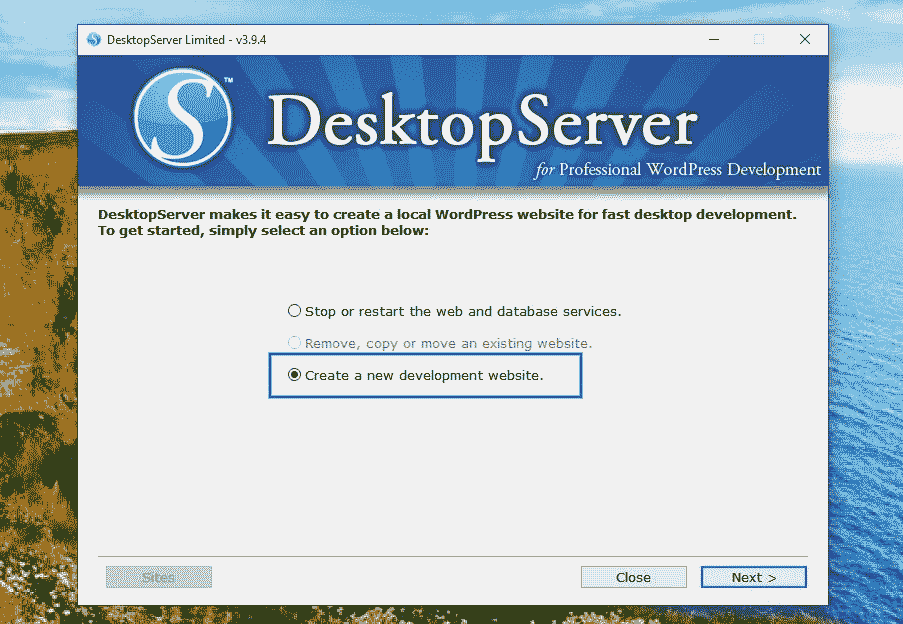

The option to create a new development website in DesktopServer


这是程序将为你安装 WordPress 的地方。你必须选择你的网站名称，这也将是它的本地地址。我们称我们的为“testsite ”,所以我们的开发 URL 将是本地机器上的“testsite.dev ”:

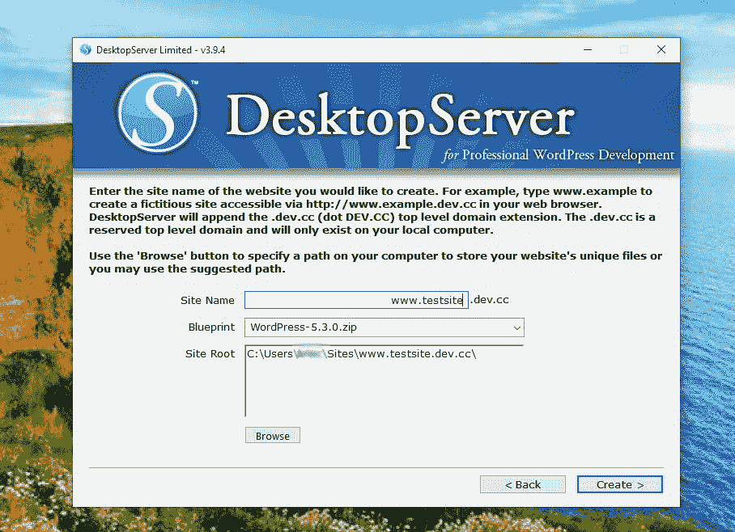

The screen to create a site name in DesktopServer


DesktopServer 使您能够实际创建不同的蓝图，使其几乎像一个预建的模板。然而，在我们的例子中，我们只是想要一个全新的安装。

DesktopServer 总是将 WordPress 的最新版本作为默认蓝图。这意味着您不必担心从存储库中手动下载并解压缩它。

默认情况下，网站的根目录位于您的 **My Documents** 文件夹中。如果你对此满意，你可以让它保持原样。然而，为了便于组织，我们把我们的文件夹改成了我们在 C: drive 的根目录下创建的名为“wordpress”的文件夹。

准备好后，点击**创建**。然后你会看到本地 WordPress 安装的 URL。单击该按钮完成安装。

### 步骤 5:安装并配置你的 WordPress 站点

当你点击我们刚才提到的链接时，你的本地 WordPress 站点将在浏览器标签中打开:

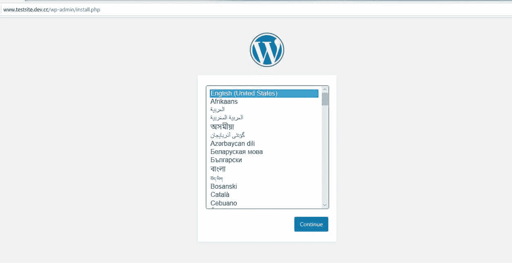

A new WordPress installation setup page


在你选择了你的语言之后，下一步就是给你的网站起一个标题，选择一个用户名(如果你打算以后让网站上线，不要用“admin”作为用户名，你可以在我们的 [WordPress 安全指南](https://kinsta.com/blog/wordpress-security/)中读到更多)，一个强密码，以及你的电子邮件地址:

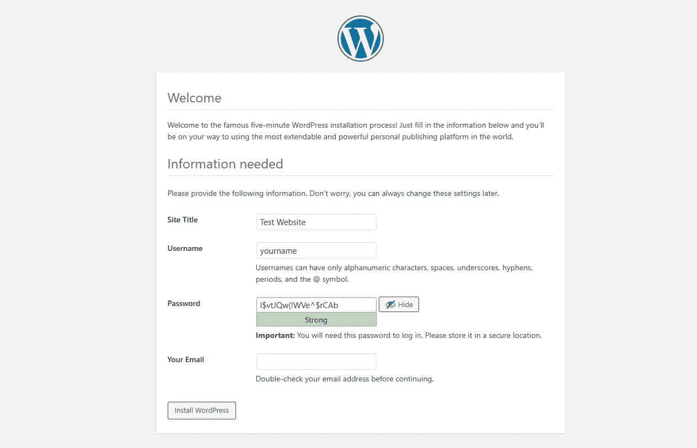

The welcome page of a new WordPress site


完成后，选择**安装 WordPress** 。就是这样！您刚刚在本地安装了 WordPress，您的站点已经启动并运行。现在，您可以浏览到您的本地安装并进行测试。

在我们的例子中，我们将转到浏览器地址栏中的“testsite.dev”。由于我们在设置期间选择了绕过登录插件功能，因此有一个[下拉菜单](https://kinsta.com/knowledgebase/wordpress-dropdown-menu/)，我们可以在其中选择我们的管理员并自动登录。显然，您不会在生产站点上使用它，但是对于开发环境来说，它非常方便。

### 使用 DesktopServer 在本地安装 WordPress 的其他提示

由于 Windows 处理文件权限的方式，你可能会也可能不会在登录时看到一条关于 [WordPress 未能更新](https://kinsta.com/knowledgebase/wordpress-updating-failed/)的消息[:](https://kinsta.com/blog/wordpress-login-url/)

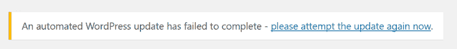

A WordPress update failed message


要解决这个问题，只需以管理员身份打开命令提示符，并在 WordPress 目录文件夹中运行以下命令:

```
attrib -s *.*
```

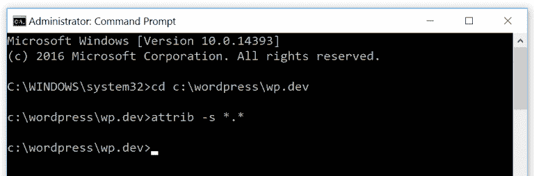

LAMP permissions for WordPress


如果你需要更多的指导或说明，你可以在 ServerPress 上了解更多的细节。

要创建额外的 WordPress 站点或编辑它们，只需再次启动*DesktopServer.exe*文件。您可以停止和重新启动服务，创建新站点，编辑它们，导出和导入它们，等等。要[访问 phpMyAdmin](https://kinsta.com/help/wordpress-phpmyadmin/) ，可以点击左下角的**站点**按钮:

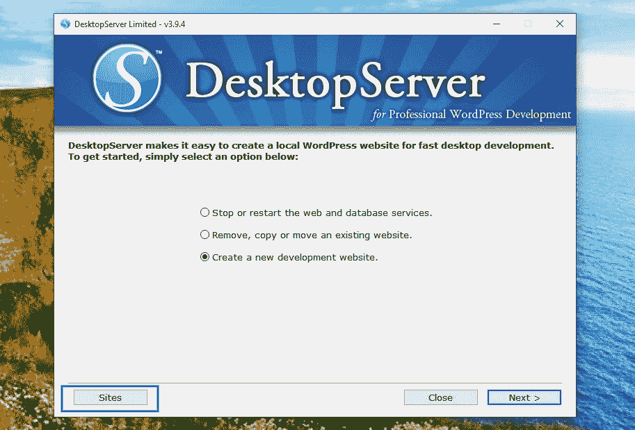

The ‘Sites’ button in the DesktopServer application


或者，您可以在浏览器的地址栏中输入“localhost”。这将在[本地主机](https://kinsta.com/knowledgebase/what-is-localhost/)上打开管理员界面:

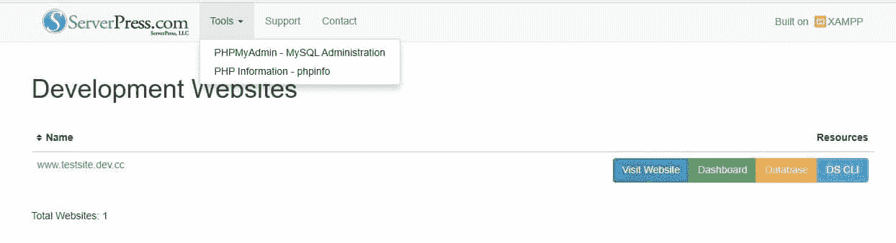

The administrator interface of the DesktopServer localhost


在那里，你可以获得所有 WordPress 站点的链接，以及 dashboard 链接和 phpMyAdmin 链接。

另一个令人惊叹的功能是只需轻轻一点就能启动 [WP-CLI](https://kinsta.com/blog/wp-cli/) (或 DS-CLI)。如果您在上面的设置过程中选择了 **DS-CLI** 选项，在您的控制面板中将会有一个链接。只需点击它，您就可以开始启动 WP-CLI 命令。

DesktopServer 还包括一个导出功能，允许你将你的 WordPress 站点直接导出到一个实时站点或*。zip* 文件。请注意，您将需要高级版本。

[Whether you're headed to a location with limited Wi-Fi or want to quickly edit and manipulate files, a local WordPress installation can make your life easier. Check out how to do it! 💻Click to Tweet](https://twitter.com/intent/tweet?url=https%3A%2F%2Fkinsta.com%2Fblog%2Finstall-wordpress-locally%2F&via=kinsta&text=Whether+you%27re+headed+to+a+location+with+limited+Wi-Fi+or+want+to+quickly+edit+and+manipulate+files%2C+a+local+WordPress+installation+can+make+your+life+easier.+Check+out+how+to+do+it%21+%F0%9F%92%BB&hashtags=webdev%2CManagedHosting)

## 摘要

通过建立一个 WordPress 本地环境，你可以在投入使用之前测试新的特性并充分开发你的 WordPress 站点。事实上，有很多种方法可以用来在你的电脑上安装 WordPress。

在本文中，我们解释了如何通过本地服务器环境软件(如 DevKinsta、DesktopServer、WAMP、MAMP 或 XAMPP)在 Mac 和 Windows 上实现这一点。虽然具体的说明会根据您使用的工具而有所不同，但是该过程可以总结为五个主要步骤:

1.  将本地环境软件下载并安装到您的计算机上。
2.  打开*。exe/。dmg* 文件并运行安装程序。
3.  创建一个空白的 MySQL 数据库。
4.  [下载最新版本的 WordPress](https://kinsta.com/knowledgebase/manually-install-wordpress/) 。
5.  在浏览器中访问测试站点，完成本地主机设置过程。

* * *

让你所有的[应用程序](https://kinsta.com/application-hosting/)、[数据库](https://kinsta.com/database-hosting/)和 [WordPress 网站](https://kinsta.com/wordpress-hosting/)在线并在一个屋檐下。我们功能丰富的高性能云平台包括:

*   在 MyKinsta 仪表盘中轻松设置和管理
*   24/7 专家支持
*   最好的谷歌云平台硬件和网络，由 Kubernetes 提供最大的可扩展性
*   面向速度和安全性的企业级 Cloudflare 集成
*   全球受众覆盖全球多达 35 个数据中心和 275 多个 pop

在第一个月使用托管的[应用程序或托管](https://kinsta.com/application-hosting/)的[数据库，您可以享受 20 美元的优惠，亲自测试一下。探索我们的](https://kinsta.com/database-hosting/)[计划](https://kinsta.com/plans/)或[与销售人员交谈](https://kinsta.com/contact-us/)以找到最适合您的方式。