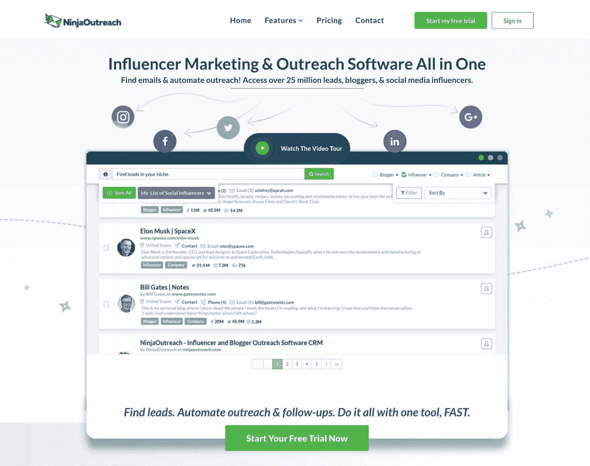
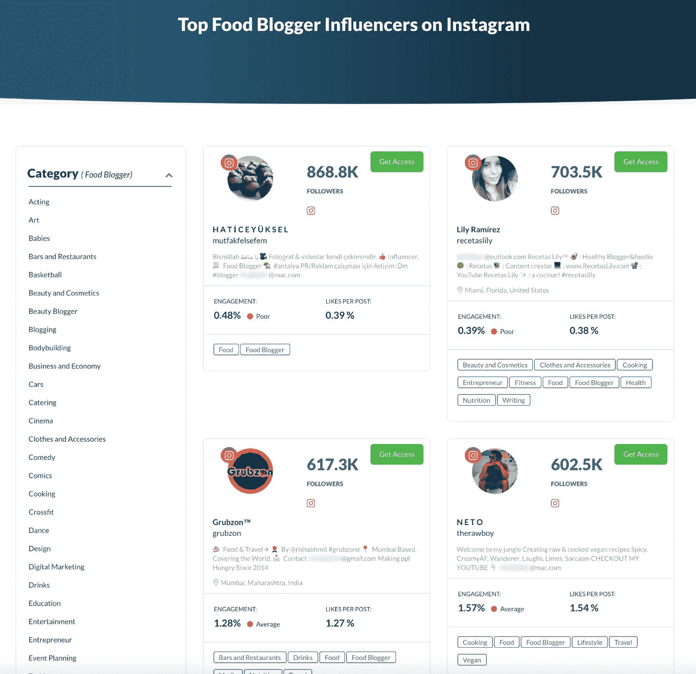

# 金斯塔·金并:巴西尔·卡诺迪斯访谈

> 原文：<https://kinsta.com/blog/interview-basilis-kanonidis/>

你可以在 Twitter 或 LinkedIn 上找到巴西利斯。这是我们最近对他的采访，作为我们[金斯塔·金并](https://kinsta.com/?post_type=post&s=kingpin)系列的一部分。

### Q1:你的背景是什么，你是如何开始使用 WordPress 的？

我在 WordPress 还不叫 WordPress 的时候就开始使用它了！

我不确定是否有很多人记得它，但在当时，它被称为 [B2](https://kinsta.com/learn/wordpress-history/#history-of-wordpress) 。加入 WordPress 运动很容易，因为在当时，它要么是 WP，要么是 Expression Engine。我刚刚完成我的多媒体&设计硕士，我需要一些东西来将设计转化为代码。WordPress 是我能找到的最简单的解决方案，这就是一切的开始。从那以后，我正在做的所有项目都在 WordPress 平台上；开发自定义插件、功能，或者使用其他开发者已经创建的东西。

### Q2:读者应该知道你最近在 WordPress 做了些什么？

我和 [NinjaOutreach](https://ninjaoutreach.com/) 一起工作，我负责网站的前端。NinjaOutreach 通过自动化推广和跟进，帮助简化影响者营销和线索生成流程。我们正在最大化 WordPress，并在整个网站上挑战极限。

NinjaOutreach

我们最新的插件， [Instagram Influencers](https://ninjaoutreach.com/instagram-influencers/) 正在基于我们的 [Instagram API](https://ninjaoutreach.com/social-api/) 创建虚拟 WordPress 页面。我们也在优化 WordPress 的速度和性能方面做了很多工作。金斯塔在其中扮演了重要角色。

Top food bloggers – influencers on Instagram

### Q3:在职业生涯中，你遇到了哪些挑战？

最大的挑战是定位自己真正擅长的领域。有这么多不同的东西，有了 WordPress，你实际上可以自己做任何事情，然后卖掉它。然而，这并不能让你成长为一名专业人士。

有一个时刻，我需要考虑我真正想做什么，当我 30 岁的时候，啊哈时刻来到了我身边。我决定帮助更多的人启动他们的在线业务，并教育他们如何快速轻松地建立他们的 WordPress 网站。

### 在 WordPress 的世界里，有没有什么让你感到惊讶的事情？

是的。开源和优质业务如何完美结合？WordPress 占整个网络的 43.3%——想象一下有多少人以不同的方式从 WordPress 谋生。👍

## 注册订阅时事通讯

### 想知道我们是怎么让流量增长超过 1000%的吗？

加入 20，000 多名获得我们每周时事通讯和内部消息的人的行列吧！

[Subscribe Now](#newsletter)

从建立网站和电子商务业务到销售主题和插件。这是 WordPress 的优点，但也有其丑陋的地方。

有很多人不想适应新事物。有些公司和机构仍然运行他们自己的服务器，不把他们的用户转移到像 Kinsta 这样的服务上，这样他们就可以把注意力从艰难的管理上移开，转而专注于网站优化。

[With Google pointing out that speed is important, a website that runs fast should be number one priority. 🚀Click to Tweet](https://twitter.com/intent/tweet?url=https%3A%2F%2Fkinsta.com%2Fblog%2Finterview-basilis-kanonidis%2F&via=kinsta&text=With+Google+pointing+out+that+speed+is+important%2C+a+website+that+runs+fast+should+be+number+one+priority.+%F0%9F%9A%80&hashtags=webperf%2Cwebdev)

### Q5:你认为 WordPress 世界的未来会是怎样的？

建筑工人和砌块。像[element 或](https://kinsta.com/partners/elementor/)这样的插件正在帮助更多的用户加入 WordPress 生态系统。[一个登陆页面](https://kinsta.com/blog/wordpress-landing-page-plugins/)可以在一天内设计并发布，初创公司可以在 2-3 小时内建立新页面，他们可以在短短 30 分钟内测试 A/B 元素。WordPress 有助于更快地做出决策和实施。WordPress 现在只是商业增长的一部分。

### 问题 Kinsta 的主机服务对您的业务有什么帮助？

我们已经从不同的 WordPress 主机转移到 Kinsta，使用我们的新网站。我们热衷于优化网站(即速度)。经过几次测试后，它向我们展示了**切换到 Kinsta 是一个显而易见的事情**。不仅如此，Kinsta 的支持帮助我们监控我们的速度和我们网站的性能，实施新的解决方案，并指导我们实现可能的最佳结果。

### 问题 7:当你离开笔记本电脑时，你喜欢做什么？

保持良好的状态。在我的笔记本电脑前工作这么长时间，会消耗很多能量，还会养成坏习惯。所以我一直忙于在工作和生活之间找到平衡——出去走走，锻炼身体，结识新朋友，享受生活！😄

### 问题 8:接下来我们应该采访谁&为什么？

[Gerasimos](https://twitter.com/tsiger) ，来自 CSSIgniter。我坚信 Gerasimos 完全理解 WordPress 以及事情的发展方向。你可以从他的公司的成长和他快速做出的方向和支点中看到这一点。他是第一批考虑加入 T2 古腾堡 T3 项目的人之一。

* * *

让你所有的[应用程序](https://kinsta.com/application-hosting/)、[数据库](https://kinsta.com/database-hosting/)和 [WordPress 网站](https://kinsta.com/wordpress-hosting/)在线并在一个屋檐下。我们功能丰富的高性能云平台包括:

*   在 MyKinsta 仪表盘中轻松设置和管理
*   24/7 专家支持
*   最好的谷歌云平台硬件和网络，由 Kubernetes 提供最大的可扩展性
*   面向速度和安全性的企业级 Cloudflare 集成
*   全球受众覆盖全球多达 35 个数据中心和 275 多个 pop

在第一个月使用托管的[应用程序或托管](https://kinsta.com/application-hosting/)的[数据库，您可以享受 20 美元的优惠，亲自测试一下。探索我们的](https://kinsta.com/database-hosting/)[计划](https://kinsta.com/plans/)或[与销售人员交谈](https://kinsta.com/contact-us/)以找到最适合您的方式。