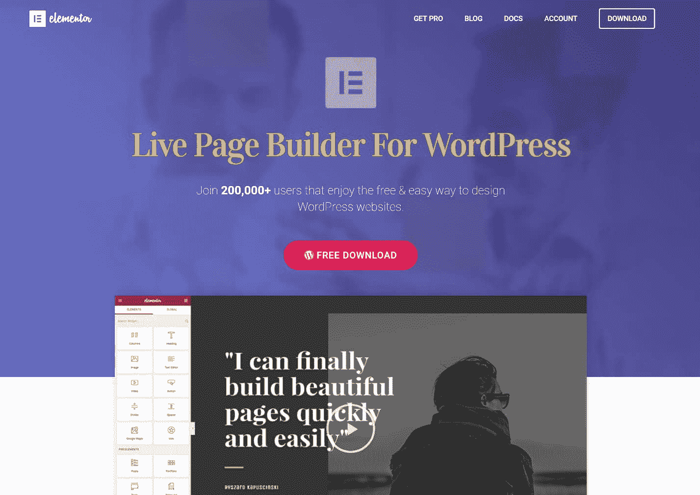

# 金斯塔·金并:本·派恩斯访谈

> 原文：<https://kinsta.com/blog/interview-ben-pines/>

你可以在 LinkedIn 或者 T2 的 Twitter 上找到本。这是我们最近对他的采访，作为我们[金斯塔·金并](https://kinsta.com/?post_type=post&s=kingpin)系列的一部分。

### Q1:你的背景是什么，你是如何开始使用 WordPress 的？

2006 年，我在一家搜索引擎优化公司开始了我的营销生涯。那是 SEO 的狂野西部时代，为了获得甜美的谷歌流量，你所要做的就是建立一个内容丰富的网站，并链接回客户的网站。我就是这么做的。我实际上设法得到了我为我的客户的推广高排名的唯一目的而建立的 WordPress 网站。这时我意识到了 WordPress 的潜力。我记得和我的老板有过一次争论，他是以色列最顶尖的 SEO 人物之一，他声称 WordPress 是一个只为博客而建的平台。在他看来，它不适合其他类型的网站。我很高兴我坚持了我的信念，坚持使用 WordPress。

然后我开始了自己的生意，管理几个基于 WordPress 的联盟网站。我这样做了 7 年，然后两年前开始作为[element 或页面生成器](https://elementor.com)的 CMO 工作。

[Elementor helps empower designers to speed up and improve their design workflow. ?Click to Tweet](https://twitter.com/intent/tweet?url=https%3A%2F%2Fbit.ly%2F2ZrLVA0&via=kinsta&text=Elementor+helps+empower+designers+to+speed+up+and+improve+their+design+workflow.+%3F&hashtags=WordPress%2Cdesign)

### Q2:读者应该知道你最近在 WordPress 做了些什么？

Elementor 的愿景是极大地改善用户在 WordPress 上设计网站的方式。WordPress 最大的劣势一直是在设计方面。我们致力于将最先进的设计能力引入 WordPress，让设计者加速和改进他们的设计工作流程。设计师不再需要依赖开发人员，支持他们需要做的每一个小的改变。他们可以利用我们的实时和可视化编辑器创建任何他们可以想象的网站，只需以前花费他们一半的时间。

WordPress Elementor page builder plugin

这些天我们在 WordPress 所做的一切都是为了实现我们的愿景。在我们推出以来的短时间内，我们成功地吸引了成千上万的 WordPress 用户。他们都选择 Elementor 作为他们的主要设计工具，并且在他们的反馈中非常支持。我们计划继续为 Elementor 的免费用户和付费用户改进和扩展 Elementor 的功能。除了开发我们的页面生成器，我们正在努力提供更多高质量的视频教程，支持我们不断增长的脸书社区[(现在有超过 7000 名成员)，并通过我们的博客、WordPress 相关的博客以及参加 WordPress 夏令营进一步交流。](https://www.facebook.com/groups/Elementors/)

### Q3:在职业生涯中，你遇到了哪些挑战？

在我的职业生涯中，我的一大挑战一直是知道下一步该做什么，以便对我正在从事的项目的发展产生最大的影响。作为一名营销人员，你经常需要在不确定的情况下做出决策。这种持续的挑战会转化为您每天都会遇到的具体问题:

*   我怎样才能在精通每一项技能的同时获得全面的营销技能？
*   我怎样才能最好地了解我的听众和潜在客户？
*   我如何利用项目的当前状态作为进一步促进增长的基础？
*   我如何消除客户对广告的主要异议，并赢得用户的信任？

当我开始开发 Elementor 时，这些挑战和许多其他挑战不断出现。我们正在进入一个已经被几家成熟的网页制作商占据的市场。我们的任务不仅是接纳新客户，还要说服客户从他们当前使用的页面构建工具中迁移出来。相信我，这可不是件容易的事。这是一个持续的挑战，但这个挑战性的因素是我如此热爱营销的原因。

## 注册订阅时事通讯

### 想知道我们是怎么让流量增长超过 1000%的吗？

加入 20，000 多名获得我们每周时事通讯和内部消息的人的行列吧！

[Subscribe Now](#newsletter)

### 在 WordPress 的世界里，有没有什么让你感到惊讶的事情？

在我自己的网站上使用 WordPress 这么多年后，我确信我对它了如指掌。在我开始在 Elementor 上工作后，我意识到我对 WordPress 社区是如何运作的，以及如何在里面获得影响力一无所知。如果你有一个基于 WordPress 的业务，在社区中获得适当的整合和建立并不像你想象的那么容易。不仅仅是参加单词营。

不像相当同质的社区，如营销社区或设计社区，文字记者是一个多样化的群体。从新手、硬核开发者到博主，你要让你的产品迎合广泛的受众，你还需要了解你正在沟通的特定成员属于哪种角色，并相应地调整你的语言和沟通技巧。此外，许多 WordPress 社区是封闭的，这使得介绍你的新产品更加困难。加入和参与一个现有的社区或者创建一个你自己的社区需要付出很多努力，但是正如我们所发现的，这是发展你基于 WordPress 的业务的必要步骤。

我不得不强调 WordPress 社区的巨大优势。我们从等式的各个方面得到了大量的支持，从像 [Lee Jackson](https://angledcrown.com/) 和 [Kim Doyal](https://thewpchick.com/) 这样的播客到像 [Josh Pollock](https://joshpress.net/) 这样的开发者，以及所有从一开始就支持我们的早期采用者。

### Q5:你认为 WordPress 世界的未来会是怎样的？

在 Elementor，我们在玩长线游戏，我们的目标很高。未来，你可以期待 Elementor 超越页面层面，进入整个 WordPress 网站设计层面。这已经从我们的[导航菜单](https://elementor.com/introducing-nav-menu/)发布开始，预计在不久的将来会进一步增长。

Struggling with downtime and WordPress problems? Kinsta is the hosting solution designed to save you time! [Check out our features](https://kinsta.com/features/)

### 你在 WordPress 主机中寻找什么？

除了 Elementor，我还维护自己的网站资产，所以我有超过 10 年的经验与托管公司打交道。这些是我个人认为最重要的特性:

频繁备份，HTTPS 和 HTTP/2 支持，最快的服务器，安全性，FTP 访问，无限存储，专家支持，服务器位于我在多个国家的目标受众/ CDN 附近。

### 问题 7:当你离开笔记本电脑时，你喜欢做什么？

我曾经参与过即兴表演，并计划在我的两个孩子长大一点后再回来(一个 4 岁，一个 1 岁，他们是我现在的主要关注点)。我喜欢伟大的电影(迷失在翻译中)，伟大的电视剧(法戈第三季)，伟大的脱口秀(比尔·伯尔)和伟大的书籍(艺术家和玛格丽特)。我的热情是写作，我试着不仅为 Elementor 博客写作。

### 问题 8:接下来我们应该采访谁&为什么？

Freemius 的创始人 Vova Feldman 给我介绍了很多 WordPress 社区的人物，所以我很乐意回报这个人情。在这次采访中，我们讨论了很多关于建立 WordPress 相关业务的问题，我认为没有人比 Vova 更了解这一点，因为他的公司帮助 WordPress 业务增加利润。

* * *

让你所有的[应用程序](https://kinsta.com/application-hosting/)、[数据库](https://kinsta.com/database-hosting/)和 [WordPress 网站](https://kinsta.com/wordpress-hosting/)在线并在一个屋檐下。我们功能丰富的高性能云平台包括:

*   在 MyKinsta 仪表盘中轻松设置和管理
*   24/7 专家支持
*   最好的谷歌云平台硬件和网络，由 Kubernetes 提供最大的可扩展性
*   面向速度和安全性的企业级 Cloudflare 集成
*   全球受众覆盖全球多达 35 个数据中心和 275 多个 pop

在第一个月使用托管的[应用程序或托管](https://kinsta.com/application-hosting/)的[数据库，您可以享受 20 美元的优惠，亲自测试一下。探索我们的](https://kinsta.com/database-hosting/)[计划](https://kinsta.com/plans/)或[与销售人员交谈](https://kinsta.com/contact-us/)以找到最适合您的方式。