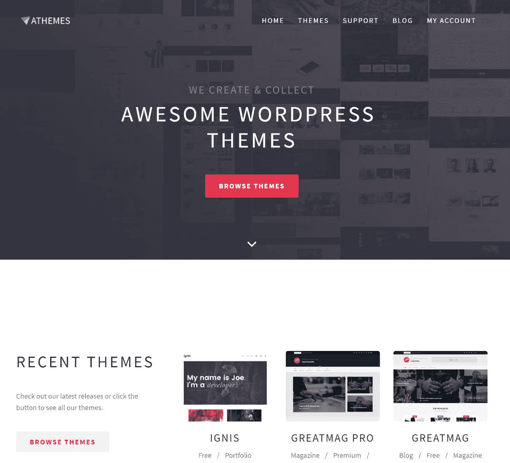
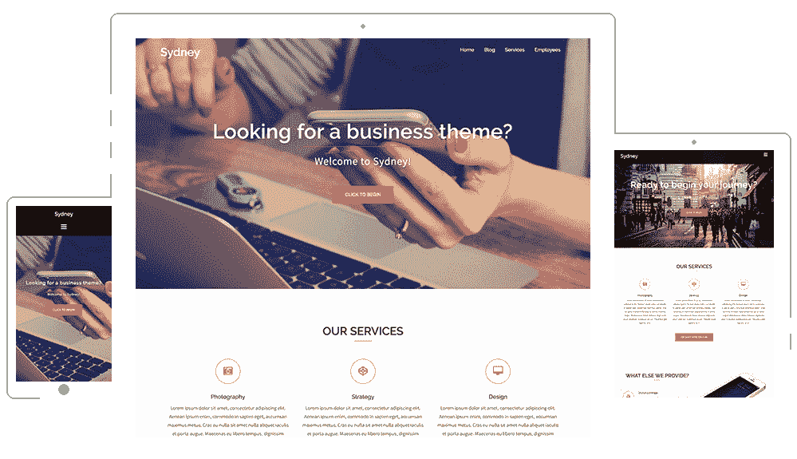

# 金斯塔·金并:查理·利文斯顿访谈

> 原文：<https://kinsta.com/blog/interview-charlie-livingston/>

你可以在 LinkedIn 或 T2 的 Twitter 上找到查理。这是我们最近对他的采访，作为我们[金斯塔·金并](https://kinsta.com/?post_type=post&s=kingpin)系列的一部分。

### Q1:你的背景是什么，你是如何开始使用 WordPress 的？

我的背景是法律，我在大学学的是法律，在决定做其他事情之前，我从事了几年的出版工作。其他的事情变成了想要做一些创业，虽然当时我不确定到底是什么。我有一个想法，我可以在网上赚钱，所以我用 WordPress 创建了一个网站，是关于我在一分钱拍卖网站上尝试赢得奖品的策略。该网站变得相对受欢迎，但从未真正赚过钱(直到几年后，即使是在那时也赚不了多少)。

但它确实让我接触到了 WordPress。以我的非技术背景，我甚至能够制作和编辑一个网站，这让我有些吃惊。我当时使用的是 Twenty Eleven 主题，并且很喜欢编辑标题之类的东西，这样我就可以给它添加社交分享按钮之类的东西。听起来不多，但对我来说很重要。

我又做了几个网站，都不太成功，但我越来越多地使用 WordPress，最终我开始在 Flippa 上买卖网站。早在 2013 年，我就是在那里购买了《阿斯麦》。那时候没什么大不了的。开发商发布了几个免费的主题，在官方回购上，相当受欢迎。大概就是这样。我不确定我会用它做什么，但我认为这个网站很有潜力，所以我买下了它。我们不断发布免费主题，并在 2014 年发布了我们的第一个高级主题。

aThemes

### Q2:读者应该知道你最近在 WordPress 做了些什么？

我还在运行主题，我们还在发布主题。我们最受欢迎的免费主题是 [Sydney](https://athemes.com/theme/sydney/) ，它有超过 100，000 个活跃安装，我们希望在今年年底达到 200，000 个。目前，我们正在为[悉尼专业版](https://athemes.com/theme/sydney-pro/)进行设计更新，这是我们最畅销的高级主题。我们还在筹备一个电子商务主题。我们正在做的另一件事是为我们的主题改进入职流程。所以我们现在很忙，有很多事情要做。主题市场现在竞争更加激烈，所以我们必须不断寻找前进的方法。

Sydney WordPress theme

### Q3:在职业生涯中，你遇到了哪些挑战？

我觉得我能走到这一步已经很幸运了。或许最大的挑战是雇佣合适的人。我们是没有成功的被雇佣者。但是我们也接受了一些仍然和我们在一起的伟大的人。

## 注册订阅时事通讯

### 想知道我们是怎么让流量增长超过 1000%的吗？

加入 20，000 多名获得我们每周时事通讯和内部消息的人的行列吧！

[Subscribe Now](#newsletter)

### 在 WordPress 的世界里，有没有什么让你感到惊讶的事情？

一个是人们可以从免费产品中期待多少。我们的模式是免费增值，所以我们提供免费主题，希望有足够多的人选择付费版本，这样我们就能盈利。但是有些人，不管你的免费版本有多好，都不会满意，即使他们没有为此付出任何代价。在某些时候，你必须接受无论你做什么，有些人都不会喜欢。所以你必须坚持下去。

[Some people, no matter how good your free version is, will not be happy. Press on. 💪Click to Tweet](https://twitter.com/intent/tweet?url=https%3A%2F%2Fkinsta.com%2Fblog%2Finterview-charlie-livingston%2F&via=kinsta&text=Some+people%2C+no+matter+how+good+your+free+version+is%2C+will+not+be+happy.+Press+on.+%F0%9F%92%AA&hashtags=webdev%2CWordPress)

### 你在 WordPress 主机中寻找什么？

我在寻找一些东西。一个是速度。没有人喜欢一个缓慢的网站，所以这是绝对必须的。另一个是 24/7 支持:我喜欢能够在一天中的任何时间与人交谈。对安全性的关注。以及对 PHP 7 等最新技术的支持。

### 问题 6:当你离开笔记本电脑时，你喜欢做什么？

我非常喜欢运动，所以我喜欢定期打网球、骑自行车和打羽毛球。

### 问题 7:接下来我们应该采访谁&为什么？

也许是某个经营网页制作公司的人，因为目前有很多关于网页制作的传言，听听参与其中的人的意见会很有趣。

* * *

让你所有的[应用程序](https://kinsta.com/application-hosting/)、[数据库](https://kinsta.com/database-hosting/)和 [WordPress 网站](https://kinsta.com/wordpress-hosting/)在线并在一个屋檐下。我们功能丰富的高性能云平台包括:

*   在 MyKinsta 仪表盘中轻松设置和管理
*   24/7 专家支持
*   最好的谷歌云平台硬件和网络，由 Kubernetes 提供最大的可扩展性
*   面向速度和安全性的企业级 Cloudflare 集成
*   全球受众覆盖全球多达 35 个数据中心和 275 多个 pop

在第一个月使用托管的[应用程序或托管](https://kinsta.com/application-hosting/)的[数据库，您可以享受 20 美元的优惠，亲自测试一下。探索我们的](https://kinsta.com/database-hosting/)[计划](https://kinsta.com/plans/)或[与销售人员交谈](https://kinsta.com/contact-us/)以找到最适合您的方式。