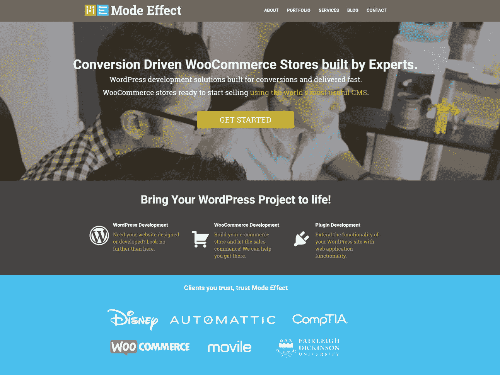

# 金斯塔·金并:科迪·兰德菲尔德访谈

> 原文：<https://kinsta.com/blog/interview-cody-landefeld/>

你可以在 LinkedIn 或 T2 的 Twitter 上找到科迪。这是我们最近对他的采访，作为我们[金斯塔·金并](https://kinsta.com/?post_type=post&s=kingpin)系列的一部分。

Q1:你的背景是什么，&你最初是如何加入 WordPress 的？

早在 2000 年上大学的时候，我就开始自学网站设计。我学习了 Photoshop 和 HTML 的基础知识，这使我能够建立静态网站。我继续使用不同的框架创建了多个网站，结果喜忧参半，直到 2006 年我发现其他网站也在使用 WordPress 作为成熟的 CMS。在用 WP 创建了我的第一个网站后，我再也没有回头。

Q2:读者应该知道你最近在 WordPress 做了些什么？

我们涵盖了很多 WooCommerce 商店的转化策略。在[模式效果](https://modeeffect.com/)中，我们使用 WooCommerce 创建不同的项目来管理体验的一个方面。不久将会有更多的内容介绍我们如何在我们的客户项目中成功地使用它。

[T2】](https://modeeffect.com/)

在职业生涯中，你遇到过哪些挑战？

伙计，你还有多少时间？我认为我的挑战与如何经营企业有关。我从未寻求为别人工作，一直想建立自己的公司，所以从一个人的军队成长为一个小机构是一个过程。

这些挑战总是与建立企业所需的工具有关。所以从 WP 转行后，我可以卖保险或者虫害防治。；)

在 WordPress 的世界里，有什么让你感到惊讶的事情吗？

了解 WordPress 社区并发现如此多真诚和有思想的人。并非每个社区都是如此。我是其中的一员。

你认为 WordPress 世界的未来会是怎样的？

我们显然喜欢 WP 作为 CMS，并希望继续将其作为我们客户网站的首选解决方案。我想继续在 WP 活动中发言，并在更多的场合分享我们的知识，为使用 WP 的客户带来价值。

更多即将推出！

你在 WordPress 主机中寻找什么？

稳定性和速度是关键。然后是可用的[支持](https://kinsta.com/kinsta-support/)来帮助我们解决客户的常见问题。WP 作为一个平台的独特性对我们的客户来说也很重要。

当你离开笔记本电脑时，你喜欢做什么？

我喜欢现场音乐、运动、电子游戏和看电影。和家人在一起也很重要！这就是我做我所做的事情的原因。

问题 8:接下来我们应该采访谁&为什么？

在 Metorik 赶上 [Bryce](https://twitter.com/bryceadams) ！

* * *

让你所有的[应用程序](https://kinsta.com/application-hosting/)、[数据库](https://kinsta.com/database-hosting/)和 [WordPress 网站](https://kinsta.com/wordpress-hosting/)在线并在一个屋檐下。我们功能丰富的高性能云平台包括:

*   在 MyKinsta 仪表盘中轻松设置和管理
*   24/7 专家支持
*   最好的谷歌云平台硬件和网络，由 Kubernetes 提供最大的可扩展性
*   面向速度和安全性的企业级 Cloudflare 集成
*   全球受众覆盖全球多达 35 个数据中心和 275 多个 pop

在第一个月使用托管的[应用程序或托管](https://kinsta.com/application-hosting/)的[数据库，您可以享受 20 美元的优惠，亲自测试一下。探索我们的](https://kinsta.com/database-hosting/)[计划](https://kinsta.com/plans/)或[与销售人员交谈](https://kinsta.com/contact-us/)以找到最适合您的方式。