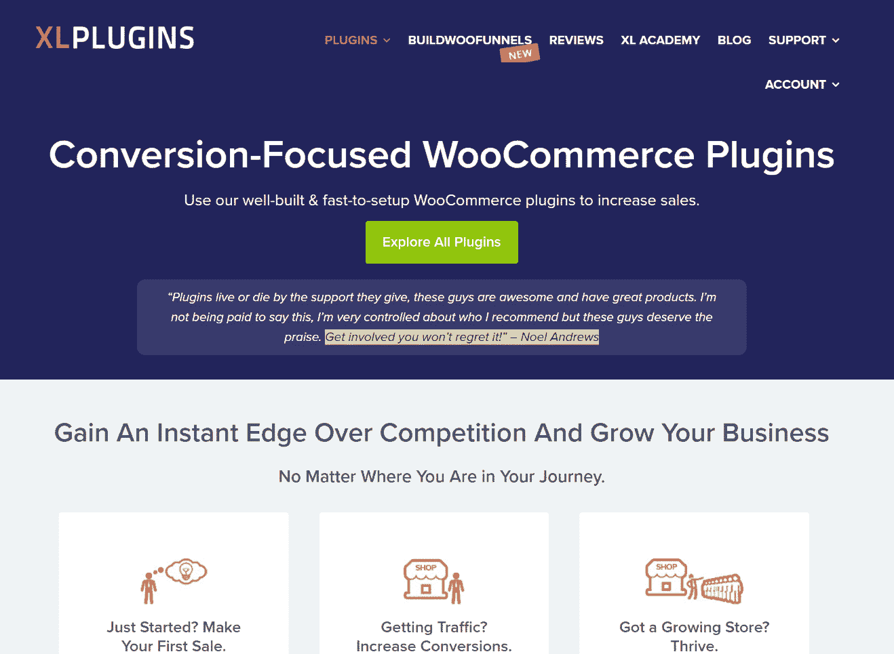

# 金斯塔·金并:采访达曼·吉特

> 原文：<https://kinsta.com/blog/interview-daman-jeet/>

你可以在推特(Twitter)或领英(LinkedIn)上找到达曼。这是我们最近对他的采访，作为我们[金斯塔·金并](https://kinsta.com/?post_type=post&s=kingpin)系列的一部分。

### Q1:你的背景是什么，你是如何开始使用 WordPress 的？

我作为一名工科毕业生学习电子和通信。大学期间，我和朋友一起创业，帮助学生在网上获得职业建议。我们需要一个网站来把这个想法变成现实。所以我们先把项目外包给一个程序员同学，然后外包给一个专业开发人员。

不幸的是，我们不得不为两次失败的尝试付出我们的积蓄和大量时间！从那时起，我们开始寻找可扩展的可靠解决方案。我们的搜索让我们发现了 WordPress。

这就像在炎热的沙漠中看到一个水塘——谢天谢地，这不是海市蜃楼！调整 CSS 并看到输出的快乐是无价的。

虽然我们的主要项目关闭了，但我们获得并磨练了在 WordPress 上开发网站的技能。我开始兼职做自由职业者。尽管我的客户不知道(当时也不关心)我们正在使用的 CMS，但当他们与它互动时，他们发现它非常直观。

我对软件的信心建立起来了。更多的项目开始向我走来；在某一点上，超过了我的承受能力。我从一个孤独的自由职业者转变为一个开发机构，有几个全栈开发人员和我一起工作。

### Q2:读者应该知道你最近在 WordPress 做了些什么？

最近，我的大部分时间和精力都花在了开发和支持 WooCommerce 插件上，这些插件可以帮助小店主提高转化率。它始于 2017 年 2 月的一个微弱的想法，现已拥有超过 15，000 家店铺。

我们在 [XLPlugins](https://xlplugins.com/) 分享的核心理念只有一个——我们开发的每一个新插件都应该**积极影响 WooCommerce 店主的底线**。

XLPlugins

我们最近在 BuildWooFunnels.com 名下推出了一系列新产品。我们的第一个产品是 Upstroke One Click Upsells。这使得在 WooCommerce 中进行购后追加销售变得可能和容易。

我们非常高兴将销售渠道的概念引入 woo commerce——这是一个主要的电子商务购物车解决方案。

### Q3:在职业生涯中，你遇到了哪些挑战？

挑战是企业成长过程中不可或缺的一部分，其性质会随着时间不断变化。在早期，我们的主要挑战是理解 WordPress 并满意地满足客户的需求。

一旦我们更好地掌握了这一点，下一个挑战就是在不遇到障碍的情况下，为具有不同需求的不同客户扩展流程。一旦我们从客户服务过渡到产品，我们的挑战进一步发展。

我们现在需要考虑周到的功能，以及它们将如何大规模使用。最重要的是，在我们发布一个插件之前，我们需要知道它在不同的，有时是冲突的环境中会如何表现。严格的测试已经成为我们的首要任务。

总的来说，通过在 [WordPress 知识库](https://profiles.wordpress.org/xlplugins#content-plugins)上发布我们的插件，我们学到了很多。并继续构建我们的代码库——所有这些都基于我们从慷慨的 WordPress 社区得到的反馈。

### 在 WordPress 的世界里，有没有什么让你感到惊讶的事情？

WordPress 作为一个平台从未停止进化。从一个简单的博客工具到现在的平台，它的发展总是让我惊讶。

## 注册订阅时事通讯

### 想知道我们是怎么让流量增长超过 1000%的吗？

加入 20，000 多名获得我们每周时事通讯和内部消息的人的行列吧！

[Subscribe Now](#newsletter)

我们很多人可能认为这种演变是理所当然的，但将代码发布到数百万个网站并不容易。对我来说，这就像一个大海，表面看起来平静，但下面却是复杂的。

有趣的是，WordPress 优雅地执行了它。他们说养育一个孩子需要一个村庄。这对于 WordPress 社区来说是如此的真实，它还在继续提高。因为 WordPress，我和许多志同道合的人互动，建立了联系，了解了他们的旅程。

[I have yet to encounter any other business community which is as diverse and connected as #WordPress. 🤘 -- @djeetClick to Tweet](https://twitter.com/intent/tweet?url=https%3A%2F%2Fbit.ly%2F3dWtCbt&via=kinsta&text=I+have+yet+to+encounter+any+other+business+community+which+is+as+diverse+and+connected+as+%23WordPress.+%F0%9F%A4%98+--+%40djeet)

### Q5:你认为 WordPress 世界的未来会是怎样的？

对我们来说，未来充满了令人兴奋的可能性。我们很高兴看到 WooCommerce 将如何发展成为一个生态系统并扩大其覆盖范围。

今天，WooCommerce 为 35%的在线商店提供支持，也就是大约 170 万个网站！这个数字已经很大了，也显示了一个新兴弱势群体的力量。

这些数字给了我们使命存在的理由，给了我们继续成长的理由。

我们将继续在 XLPlugins 的旗帜下拓展我们的插件产品线，同时继续与 BuildWooFunnels.com 一起构建销售漏斗工具。

### 你在 WordPress 主机中寻找什么？

我通常寻找三个——速度、安全性和支持。对我个人来说，支持是最大的决定因素。一个企业完全依靠托管来运行其业务。有时事情会不顺利。

在那种情况下，作为一个消费者，我需要的是一个知识渊博、值得信赖的支持者。一个能解决或给我们指出正确方向的人。

作为开发人员，我们了解技术，但并不是每个企业主都了解技术。当一个问题出现在我们面前时，他们可能不理解其中的细微差别，这对他们来说可能是一次紧张的经历。一个好的主持人会理解这种循环。很多主机公司都在关注 WordPress，这是一个健康的趋势。作为消费者，很难知道哪一个是最好的。

这里有一个提示:

在过去，每当我们与一个新的主机打交道时，我们都会尝试托管几个站点来判断主机的响应能力。只有当我们满意时，我们才扩大规模。你可能会被便宜的价格所吸引，但是在某些时候，一台便宜的主机会让你多花上几千美元。

不要追求廉价的主机。

### 问题 7:当你离开笔记本电脑时，你喜欢做什么？

老实说，我很少离开笔记本电脑。但无论何时，我都会抽出时间和妻子一起看太空纪录片。

我们也准备好迎接家里的小家伙了！对此欣喜若狂…😄

### 问题 8:接下来我们应该采访谁&为什么？

来自《科技银行家》的 Varun Sharma 。我在 2017 年德里世界夏令营遇到了 Varun，在交谈的几分钟内，我就知道我在和一位专业人士交谈。他定期举办 WordPress 聚会，并会分享有价值的见解。

* * *

让你所有的[应用程序](https://kinsta.com/application-hosting/)、[数据库](https://kinsta.com/database-hosting/)和 [WordPress 网站](https://kinsta.com/wordpress-hosting/)在线并在一个屋檐下。我们功能丰富的高性能云平台包括:

*   在 MyKinsta 仪表盘中轻松设置和管理
*   24/7 专家支持
*   最好的谷歌云平台硬件和网络，由 Kubernetes 提供最大的可扩展性
*   面向速度和安全性的企业级 Cloudflare 集成
*   全球受众覆盖全球多达 35 个数据中心和 275 多个 pop

在第一个月使用托管的[应用程序或托管](https://kinsta.com/application-hosting/)的[数据库，您可以享受 20 美元的优惠，亲自测试一下。探索我们的](https://kinsta.com/database-hosting/)[计划](https://kinsta.com/plans/)或[与销售人员交谈](https://kinsta.com/contact-us/)以找到最适合您的方式。