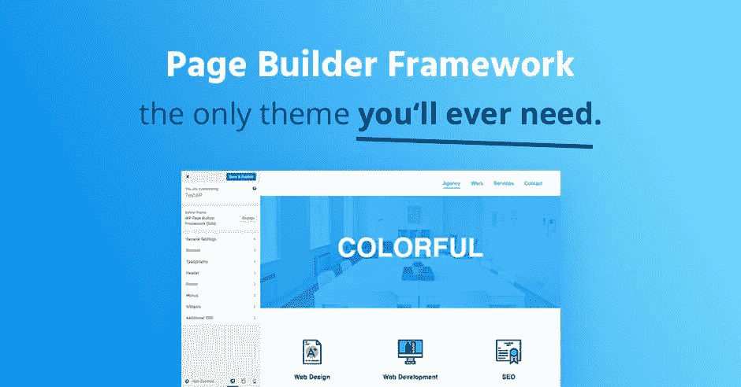

# 金斯塔·金并:大卫·冯格里斯访谈

> 原文：<https://kinsta.com/blog/interview-david-vongries/>

你可以在推特或[脸书](https://www.facebook.com/david.vongries)上找到大卫。这是我们最近对他的采访，作为我们[金斯塔·金并](https://kinsta.com/?post_type=post&s=kingpin)系列的一部分。

### Q1:你的背景是什么，你是如何开始使用 WordPress 的？

我在 13 岁的时候就发现了我的热情，当时我作为一个德国盗车爱好者网站的程序员在一起做黑客工作。我们是一小群扩展和修改游戏(罪恶之城)的人。当我有机会谈论这个话题时，我仍然很兴奋。我很喜欢扩展游戏并引入我自己的想法。

这就是我今天在 WordPress 上做的事情。

作为一个印刷背景的人，我总是对网站更感兴趣。结束媒体设计师的学徒生涯后，我开始了我的网页开发职业生涯，并成立了我的第一家公司。

当我第一次接触 WordPress 的时候，我和几个朋友在一间闲置的办公室里工作。我正在寻找一种创建网上商店的方法，我的朋友建议我使用 WordPress。我记得我看着主题文件，却不知道它们有什么用——这就是一切开始的地方。从那天起，我想了解关于 WordPress 的一切，它是如何工作的，以及我如何以最有效的方式完成工作。

今天，我帮助世界各地的机构进行他们的 WordPress 项目。2017 年，随着[页面构建器框架](https://wp-pagebuilderframework.com/)和 Ultimate Dashboard Pro 的推出，我成功地从客户工作过渡到成为一名全职 WordPress 开发者。然而，我没有放弃所有的客户工作，我很高兴在过去的一年里我有机会与一些令人敬畏的大型公司合作。

Page Builder Framework

### Q2:读者应该知道你最近在 WordPress 做了些什么？

终极仪表板是我在我的第一个 [WordPress 多站点网络](https://kinsta.com/wordpress-multisite-hosting/)工作时创建的。我记得在移交了一个客户的网站后，我和他进行了一次对话。他们登录了他们的 WordPress admin，被 WordPress 仪表盘淹没了，尽管那天早些时候我在一次会议中带他们走过了后台。

每当客户登录他们的网站时，他们首先看到的就是 WordPress 仪表盘。那么，我能做什么——而不只是隐藏所有的部件——让它有更有意义的用途呢？终极仪表盘就是这样诞生的。

Ultimate Dashboard

页面构建器框架是一个 WordPress 主题，专门用来与像 Beaver Builder、 [Elementor、Divi](https://kinsta.com/blog/divi-vs-elementor/) 等页面构建器[一起工作。它是每个页面生成器项目的基础。](https://kinsta.com/blog/wordpress-page-builders/)

有很多主题，有预定义的部分甚至页面，为了使网站完整，你必须“填充”它们。使用页面生成器，一切都是在前端设计和创建的。这就是为什么页面生成器框架关注导航等关键领域，并提供极大的灵活性。

你可以在众多的菜单和移动菜单中进行选择，轻松创建粘性导航，并在一个地方定制你网站的每个细节 WordPress 定制器。

## 注册订阅时事通讯

### 想知道我们是怎么让流量增长超过 1000%的吗？

加入 20，000 多名获得我们每周时事通讯和内部消息的人的行列吧！

[Subscribe Now](#newsletter)

您甚至可以使用主题设置自己的响应断点。这个口号也是我的使命宣言——我试图让页面生成器框架成为“你需要的唯一主题”。这些是我现在全职工作的产品。除此之外，我还帮助世界各地的机构开发 WordPress——尤其是 WordPress 多站点项目。

### Q3:在职业生涯中，你遇到了哪些挑战？

过去，我很难获得新客户。我住在德国的一个小城市，在这里，我觉得没有人有预算，也没有人看到一个开发良好和优化的网站背后的价值。老实说，试图一遍又一遍地向公司解释这一点真的很有挑战性。

从那时起，我开始专注于产品的打造、品牌和营销。

### 在 WordPress 的世界里，有没有什么让你感到惊讶的事情？

令人敬畏和支持的社区。

[Has anything surprised you in the #WordPress world? 'Yes, the awesome and supportive community.' 🙌 - David, @MapStepsClick to Tweet](https://twitter.com/intent/tweet?url=https%3A%2F%2Fkinsta.com%2Fblog%2Finterview-david-vongries%2F&via=kinsta&text=Has+anything+surprised+you+in+the+%23WordPress+world%3F+%27Yes%2C+the+awesome+and+supportive+community.%27++%F0%9F%99%8C++-+David%2C+%40MapSteps)

### Q5:你认为 WordPress 世界的未来会是怎样的？

我真的很高兴我现在有时间完全专注于向页面生成器框架和终极仪表板专业版添加功能。这仍然令人兴奋，我对 WordPress 世界的未来持开放态度。

### 你在 WordPress 主机中寻找什么？

我正在寻找一个安全和现代的主机，它提供了一个漂亮和干净的界面包装的选项数量。我痴迷于页面速度，因此使用 VPS 是我的首要任务之一。除此之外，HTTP/2 支持、自动(可恢复)备份+易于部署的 SSL 证书对我来说是最重要的。老式的基于 cPanel 的提供商是行不通的，尤其是涉及到专业的 WordPress 托管时。

### 问题 7:当你离开笔记本电脑时，你喜欢做什么？

我几乎一周 7 天 24 小时都在用笔记本电脑，这是我今年试图改变的事情。我想很多开发者都会有同感(哈哈)。事实上，我打算买一辆货车，把它改装成活动房屋，来一次心灵之旅。每当我不在电脑前的时候，我就看书、享受自然、冥想——或者只是看看《网飞》。

### 问题 8:接下来我们应该采访谁&为什么？

我的 snapchat 好友李·杰克逊，WP-Innovator 播客的主持人。对我来说，他是 WordPress 社区最有价值的成员之一。他不断推出大量优秀的内容，并帮助许多人建立和发展他们的代理机构。

* * *

让你所有的[应用程序](https://kinsta.com/application-hosting/)、[数据库](https://kinsta.com/database-hosting/)和 [WordPress 网站](https://kinsta.com/wordpress-hosting/)在线并在一个屋檐下。我们功能丰富的高性能云平台包括:

*   在 MyKinsta 仪表盘中轻松设置和管理
*   24/7 专家支持
*   最好的谷歌云平台硬件和网络，由 Kubernetes 提供最大的可扩展性
*   面向速度和安全性的企业级 Cloudflare 集成
*   全球受众覆盖全球多达 35 个数据中心和 275 多个 pop

在第一个月使用托管的[应用程序或托管](https://kinsta.com/application-hosting/)的[数据库，您可以享受 20 美元的优惠，亲自测试一下。探索我们的](https://kinsta.com/database-hosting/)[计划](https://kinsta.com/plans/)或[与销售人员交谈](https://kinsta.com/contact-us/)以找到最适合您的方式。