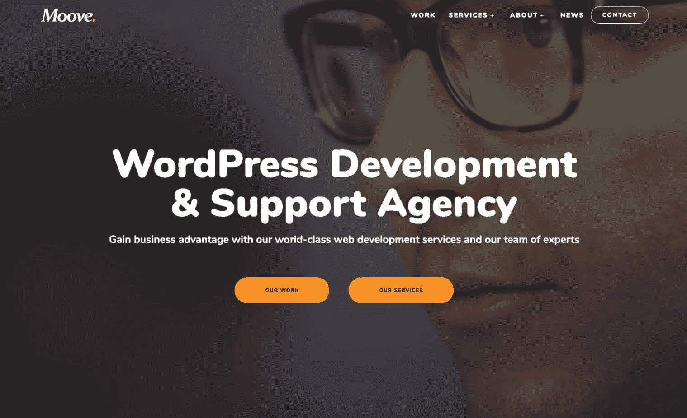

# 金斯塔·金并:伊洛娜·费利皮访谈

> 原文：<https://kinsta.com/blog/interview-ilona-filipi/>

伊洛娜·费利皮是 Moove Agency 的首席执行官和创始人，Moove Agency 是一家总部位于伦敦的 WordPress 机构，负责构建和支持高性能的网站和应用程序，使企业在数字世界中取得成功。Ilona 曾与 O2、索尼、丰田和雷克萨斯等全球品牌合作。

你可以在 [LinkedIn](https://www.linkedin.com/in/ilonafilipi/) 上找到 Ilona。这是我们最近对她的采访，作为我们[金斯塔·金并](https://kinsta.com/?post_type=post&s=kingpin)系列的一部分。

### Q1:你的背景是什么，你是如何开始使用 WordPress 的？

我从很小的时候就对计算机感兴趣。当我大约 13 岁的时候，我们家有了第一台电脑，这非常令人兴奋！我当时已经在参加一个学习编程的课后班，我被吸引住了。我一有机会就用家用电脑练习基本编程——当时我一点也不知道由此引发的好奇心会成为我未来的职业。

我继续在布拉格学习计算机工程，然后在伦敦学习多媒体。大学期间，我开始做自由网页设计师，毕业后继续工作。作为一名自由职业者，我变得越来越忙，因此在 2010 年我在伦敦成立了 Moove Agency，一家 WordPress 代理公司，并招募了更多的人来帮助这项工作。

Moove

进入 Moove 几年后，我们开始专门使用 WordPress。我们的大多数客户是营销团队，他们想要一个易于使用的 CMS，能够可靠和快速地获得他们的内容，WordPress 是完美的合作伙伴。

我们是 WordPress 的忠实拥护者，我们一直积极参与 WordPress 社区，早年共同组织了 WordPress 伦敦营，并在 WordPress 伦敦营和 WordPress 欧洲营发表演讲。我认为 WordPress 社区真的很特别，WordPress camps 提供了一个平台，让各种各样的人分享他们的知识、经验和见解，造福于更广泛的社区。

### Q2:读者应该知道你最近在 WordPress 做了些什么？

我们专注于建设高性能的大型网站，多年来一直与索尼、雷克萨斯和丰田等全球品牌以及企业公司合作。我们为全球客户建立了许多 WordPress 网站，他们有不同的定制需求，从大型多语言网站到复杂的预订系统和电子商务网站。

如今，网站很少是独立的，我们的客户通常有 [WordPress API](https://www.mooveagency.com/services/api-integrations-development/) 需求，所以我们将我们的网站与一个或另一个平台集成，如 SalesForce、Pardot、Hubspot 或任何其他定制或专有的 API。对于需要快速、主动支持的客户，我们越来越成为他们的重要合作伙伴，他们可以通过我们的 [WordPress 支持服务](https://www.mooveagency.com/services/wordpress-support/)获得可靠的支持。

### Q3:在职业生涯中，你遇到了哪些挑战？

与大多数企业一样，在早期，主要的挑战是寻找客户，建立我们的声誉和客户基础。我们致力于创建高质量的网站和提供卓越的客户服务。

在最初的几年后，业务真的起飞了，我们有一个坚实的投资组合和伟大的客户推荐，这真的帮助我们达到其他客户，赢得新的业务。我们发现我们适合与市场营销和产品团队合作，这些团队在持续的基础上有大量的工作，需要我们的团队作为他们团队的无缝扩展，快速工作，可靠并提供高质量的工作。

我们拥有出色的客户保持率，这是我们真正引以为豪的；我们的业务已经进入了第九个年头，我们的许多客户都与我们一起走过了漫长的旅程。

## 注册订阅时事通讯

### 想知道我们是怎么让流量增长超过 1000%的吗？

加入 20，000 多名获得我们每周时事通讯和内部消息的人的行列吧！

[Subscribe Now](#newsletter)

### 在 WordPress 的世界里，有没有什么让你感到惊讶的事情？

能成为 WordPress 发展的一部分，并看到它成为如此成功和占主导地位的 CMS，这是一件非常美妙的事情。当我们刚开始的时候，我们的许多客户都是从其他 CMS 转到 WordPress 的，现在我们看到我们的许多新客户已经在使用 WordPress 了——所以看到这一变化是一个惊喜，我们不再需要将人们“转换”到 WordPress。

很高兴看到人们对 WordPress 的态度发生了变化，不再认为它只是“一个博客平台”——WordPress 现在正在为世界上一些最大的品牌和大型网站提供支持，并且没有放缓的迹象。

[It's been great to see the changing attitude towards WordPress. It's no longer 'just a platform for blogs.' 🤘 -- Ilona Filipi @MooveAgencyClick to Tweet](https://twitter.com/intent/tweet?url=https%3A%2F%2Fkinsta.com%2Fblog%2Finterview-ilona-filipi%2F&via=kinsta&text=It%27s+been+great+to+see+the+changing+attitude+towards+WordPress.+It%27s+no+longer+%27just+a+platform+for+blogs.%27+%F0%9F%A4%98+--+Ilona+Filipi+%40MooveAgency&hashtags=WordPress%2CCMS)

### Q5:你认为 WordPress 世界的未来会是怎样的？

我们非常适合营销和产品团队。我们努力了解他们的痛点以及对他们来说什么是重要的，并满足他们的需求，因此我们将继续与客户合作，确保我们满足并超越他们的期望。

在我们的产品和服务方面，过去几年我们已经发布了八个开源的 WordPress 插件,最近开始提供额外的插件，这真的很有趣，也是一个很好的挑战，来学习更多关于构建和支持数字产品的知识。

我们的 [GDPR Cookie 合规插件](https://www.mooveagency.com/wordpress-plugins/gdpr-cookie-compliance/)表现得非常好，目前已经有超过 50，000 个活跃安装，这很好，所以我们也将继续在业务的产品方面进行建设。

### 你在 WordPress 主机中寻找什么？

我们发现大多数可靠的主机提供商提供 99.9%的正常运行时间作为标准，所以我们希望通过提供支持的质量来区分服务。我们关注的方面包括:通过聊天/电话联系他们的难易程度，工程师的知识和经验，以及当客户有更多定制需求时他们的灵活性。

### 问题 7:当你离开笔记本电脑时，你喜欢做什么？

我喜欢旅行——最好是去阳光明媚的地方！我发现旅行和在新环境中充满活力和灵感。我也读了很多。我通常有几本书，大多是关于商业和行业新闻的，总是有更多的东西要学！

### 问题 8:接下来我们应该采访谁&为什么？

你已经采访了来自 Human Made 的 Tom Wilmot，他是我在 WordPress 领域的巨大灵感，所以我建议 [Harry Metcalfe](https://twitter.com/harrym) 是 [DXW](https://www.dxw.com/) 的创始人，因为他建立了一个非常有趣和令人印象深刻的机构，专注于支持英国政府和公共部门。

* * *

让你所有的[应用程序](https://kinsta.com/application-hosting/)、[数据库](https://kinsta.com/database-hosting/)和 [WordPress 网站](https://kinsta.com/wordpress-hosting/)在线并在一个屋檐下。我们功能丰富的高性能云平台包括:

*   在 MyKinsta 仪表盘中轻松设置和管理
*   24/7 专家支持
*   最好的谷歌云平台硬件和网络，由 Kubernetes 提供最大的可扩展性
*   面向速度和安全性的企业级 Cloudflare 集成
*   全球受众覆盖全球多达 35 个数据中心和 275 多个 pop

在第一个月使用托管的[应用程序或托管](https://kinsta.com/application-hosting/)的[数据库，您可以享受 20 美元的优惠，亲自测试一下。探索我们的](https://kinsta.com/database-hosting/)[计划](https://kinsta.com/plans/)或[与销售人员交谈](https://kinsta.com/contact-us/)以找到最适合您的方式。