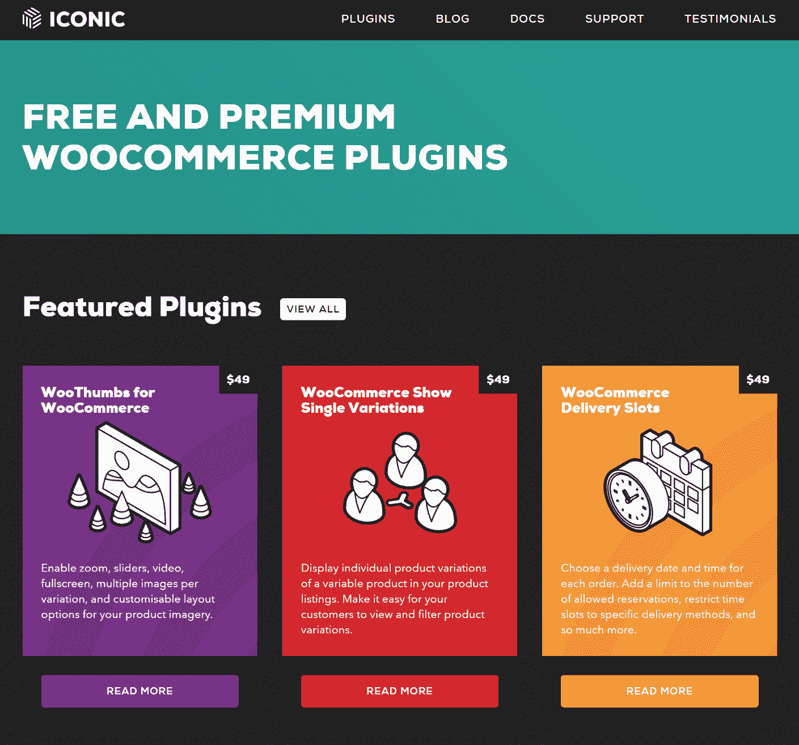

# 金斯塔·金并:詹姆斯·坎普访谈

> 原文：<https://kinsta.com/blog/interview-james-kemp/>

你可以在推特、[图标](https://iconicwp.com/)和 [Github](https://github.com/jamesckemp) 上找到詹姆斯。这是我们最近对他的采访，作为我们的[金斯塔·金并](https://kinsta.com/?post_type=post&s=kingpin)系列的一部分。

### Q1:你的背景是什么，你是如何开始使用 WordPress 的？

2009 年，我在英国莱斯特郡的一家网页设计公司找到了一份工作。WordPress 刚刚开始渗透进公司，不久我就开始用它建立网站。这是我以前从未用过的。创建主题非常简单(与 Magento 相比，Magento 是我们当时的 CMS/电子商务解决方案)，而且作为管理员用户管理起来非常直观。我被迷住了。

我很快就成为了 WordPress 所有事务的核心员工之一，包括为公司及其员工举办一些研讨会。

正如我提到的，我们是 Magento T1 的大力支持者。这让我创建了我的第一个 WordPress 插件；Magento WordPress 集成。我最终将这个项目货币化，卖给了另一家开发商。

### Q2:读者应该知道你最近在 WordPress 做了些什么？

随着时间的推移，越来越明显的是，WooCommerce 将会非常庞大。我用这个平台建立了一些网站，也创建了一些定制插件。最终，我决定在 Envato marketplace 上发布一些我正在制作的高级插件。

2016 年初，Iconic([https://iconicwp.com](https://iconicwp.com/))正式成立。在这个标志性的品牌下，我开发了许多流行的免费和高级 WooCommerce 插件。我最受欢迎的插件包括 [WooThumbs](https://iconicwp.com/products/woothumbs/) 用于为你的产品添加额外的变化图像，以及增强的画廊体验， [Show Single Variations](https://iconicwp.com/products/woocommerce-show-single-variations/) 用于在你的目录列表中显示单一产品变化，以及 [WooCommerce Delivery Slots](https://iconicwp.com/products/woocommerce-delivery-slots/) 用于让你的客户选择具体的送货时间。

[T2】](https://iconicwp.com/)

### Q3:在职业生涯中，你遇到了哪些挑战？

我现在几乎全职从事 Iconic 的工作。达到那个阶段最困难的部分是在我的全职工作、插件更新、插件支持和陪伴家人之间平衡时间。现在我把工作时间花在了 Iconic 上，这种平衡变得更容易管理了。

### 在 WordPress 的世界里，有没有什么让你感到惊讶的事情？

我确信每个人都这么说，但是我总是惊喜于 WordPress 社区的帮助。有那么多优秀的开发者和 WordPress 用户喜欢尽他们所能提供帮助。在我通过自己的网站销售插件的过程中，Vova Feldman 给了我很大的帮助。一定要看看他的[免费软件](https://freemius.com/)。

### Q5:你认为 WordPress 世界的未来会是怎样的？

我计划继续为我的插件发布令人惊叹的新特性。我也有一个全新的插件想法，与 WooCommerce 无关，只要我有时间，我就会着手做。最终，我的重点将是产品，而不是网站。

### 你在 WordPress 主机中寻找什么？

当我托管 WordPress 网站时，我关注的重点是:定期备份、[改进的安全性、](https://kinsta.com/secure-wordpress-hosting/)、[中转区和 git 兼容性。](https://kinsta.com/help/premium-staging-environments/)

### 问题 7:当你离开笔记本电脑时，你喜欢做什么？

“远离你的笔记本电脑”是什么意思？开玩笑的。我喜欢摄影([https://creativemarket.com/jamesckemp](https://creativemarket.com/jamesckemp))、旅游，以及和家人共度时光。

### 问题 8:接下来我们应该采访谁&为什么？

我总是喜欢收到 Pippin Williamson 的来信，因为他在 WordPress 领域做得非常好。我也有兴趣听听其他插件作者的意见，他们开始使用 Envato，但后来离开，通过他们自己的网站销售。

* * *

让你所有的[应用程序](https://kinsta.com/application-hosting/)、[数据库](https://kinsta.com/database-hosting/)和 [WordPress 网站](https://kinsta.com/wordpress-hosting/)在线并在一个屋檐下。我们功能丰富的高性能云平台包括:

*   在 MyKinsta 仪表盘中轻松设置和管理
*   24/7 专家支持
*   最好的谷歌云平台硬件和网络，由 Kubernetes 提供最大的可扩展性
*   面向速度和安全性的企业级 Cloudflare 集成
*   全球受众覆盖全球多达 35 个数据中心和 275 多个 pop

在第一个月使用托管的[应用程序或托管](https://kinsta.com/application-hosting/)的[数据库，您可以享受 20 美元的优惠，亲自测试一下。探索我们的](https://kinsta.com/database-hosting/)[计划](https://kinsta.com/plans/)或[与销售人员交谈](https://kinsta.com/contact-us/)以找到最适合您的方式。