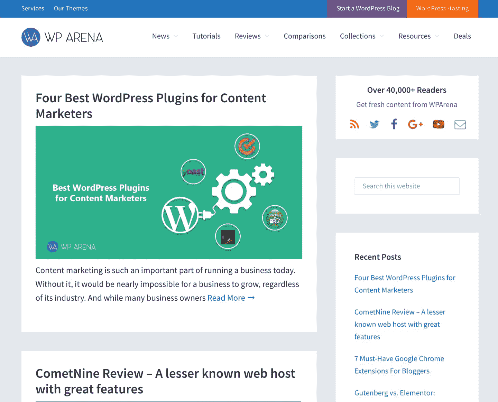

# 金斯塔·金并:贾兹布·扎曼访谈

> 原文：<https://kinsta.com/blog/interview-jazib-zaman/>

Jazib Zaman 是 WPArena、TechEngage 和许多其他令人兴奋的 WordPress 项目的首席执行官和创始人。其中一些包括开发主题、插件和运行流行的技术博客。在制作内容、管理多个项目以及策划如何成功实现网站盈利方面，Jazib 是一位经验丰富的企业主。

你可以在 Twitter 和 LinkedIn 上找到 Jazib。这是我们最近对他的采访，作为我们[金斯塔·金并](https://kinsta.com/?post_type=post&s=kingpin)系列的一部分。

### Q1:你的背景是什么，你是如何开始使用 WordPress 的？

除了国际关系硕士学位，软件开发是我的爱好。我信奉为社会做有价值的事情的哲学。我为自己设定的这些价值观鼓励我为改善人们的生活做出越来越多的贡献。

当我在 2006 年开始了解开源的 WordPress 社区时，与世界分享利益的可能性促使我投身于这个行业。它鼓励我为社区工作，因为我可以帮助很多使用这个平台的人。从那以后，我再也没有回头。

### Q2:读者应该知道你最近在 WordPress 做了些什么？

WordPress 不仅仅是一个内容管理平台。古腾堡编辑器更新已经登陆，它将改变网站的工作方式。我正在做几个令人兴奋的项目，用户会发现这些项目很有用，比如在[ThemeBounce.com](https://www.themebounce.com/)、[WPDesigner.com](https://wpdesigner.com/)和[CTRSpace.com](https://ctrspace.com/)上构建主题。我还参与了在 [WPBanner](https://wpbanner.com/) 和 [WPLocation](https://wplocation.com/) 上开发插件。

我还是知名权威 WordPress 教程网站 [WPArena](https://wparena.com/) 和 [WPDesigner](https://wpdesigner.com/) 的创始人。如果这还不够让我忙的话，我还经营[法律诊所](https://legalbench.com/)和[健康竞技场](https://healtharena.com/)。

WPArena

我热衷的另一个项目是 [TechEngage](https://techengage.com/) ，它是 [TechAbout](https://www.techabout.com/) 的子公司。这个项目聚焦于技术世界。

### Q3:在职业生涯中，你遇到了哪些挑战？

我面临的最大挑战是在我的国家缺少机会。幸运的是，现在这种趋势已经发生了变化，人们开始把它当成一种严肃的职业。我在巴基斯坦长大，那里有很多像 PayPal 这样的支付处理器不可用的问题。为了进一步解决这个问题，巴基斯坦的第一个单词营直到 2018 年年中才开始运行。

## 注册订阅时事通讯

### 想知道我们是怎么让流量增长超过 1000%的吗？

加入 20，000 多名获得我们每周时事通讯和内部消息的人的行列吧！

[Subscribe Now](#newsletter)

非常感谢 WordPress 团队在我们国家开办了 WordPress 训练营！👏

### 在 WordPress 的世界里，有没有什么让你感到惊讶的事情？

当我开始在这个行业工作时，WordPress 的无限世界和它的可能性让我吃惊。该平台封装整个网站开发过程的能力，简而言之，令人印象深刻。它极大地简化了终端用户建立网站的工作，WordPress 比其他任何 CMS 都做得好。

['The ability of WordPress to encapsulate the whole website development process is impressive.' 😄 -- @jazibzamanClick to Tweet](https://twitter.com/intent/tweet?url=https%3A%2F%2Fkinsta.com%2Fblog%2Finterview-jazib-zaman%2F&via=kinsta&text=%27The+ability+of+WordPress+to+encapsulate+the+whole+website+development+process+is+impressive.%27+%F0%9F%98%84+--+%40jazibzaman&hashtags=WordPress%2Cwebdev)

### Q5:你认为 WordPress 世界的未来会是怎样的？

当我开始涉足 WordPress 世界的时候，我从来不知道它会如此巨大。

### 你在 WordPress 主机中寻找什么？

这完全取决于网站的需求。对我来说，支持、正常运行时间、速度和性能是最重要的。如果 WordPress 主机不能提供所有这些，我不会使用它。Kinsta 从来没有让我失望过，这就是为什么它是我最喜欢的 WordPress 托管提供商。

### 问题 7:当你离开笔记本电脑时，你喜欢做什么？

我和父母很亲近。他们的爱、支持和祈祷是我成功的原因。当我不在笔记本电脑上的时候，我更喜欢花时间和他们在一起，听他们讲述我童年的故事和恶作剧。我们分享经验，一起欢笑。

### 问题 8:接下来我们应该采访谁&为什么？

我建议[Syed Balkhi](https://twitter.com/syedbalkhi)(WP beginner 的创始人)接受下一次采访。Syed 了解他在 WordPress 行业的道路，并且总是与社区分享他的经验。我很想读他的采访，我相信你的读者也会从中受益。

* * *

让你所有的[应用程序](https://kinsta.com/application-hosting/)、[数据库](https://kinsta.com/database-hosting/)和 [WordPress 网站](https://kinsta.com/wordpress-hosting/)在线并在一个屋檐下。我们功能丰富的高性能云平台包括:

*   在 MyKinsta 仪表盘中轻松设置和管理
*   24/7 专家支持
*   最好的谷歌云平台硬件和网络，由 Kubernetes 提供最大的可扩展性
*   面向速度和安全性的企业级 Cloudflare 集成
*   全球受众覆盖全球多达 35 个数据中心和 275 多个 pop

在第一个月使用托管的[应用程序或托管](https://kinsta.com/application-hosting/)的[数据库，您可以享受 20 美元的优惠，亲自测试一下。探索我们的](https://kinsta.com/database-hosting/)[计划](https://kinsta.com/plans/)或[与销售人员交谈](https://kinsta.com/contact-us/)以找到最适合您的方式。