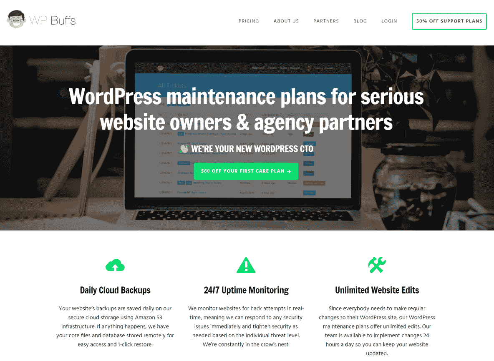
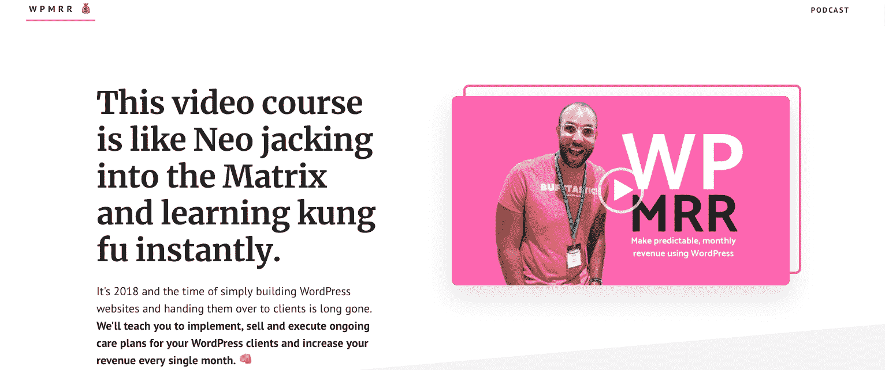
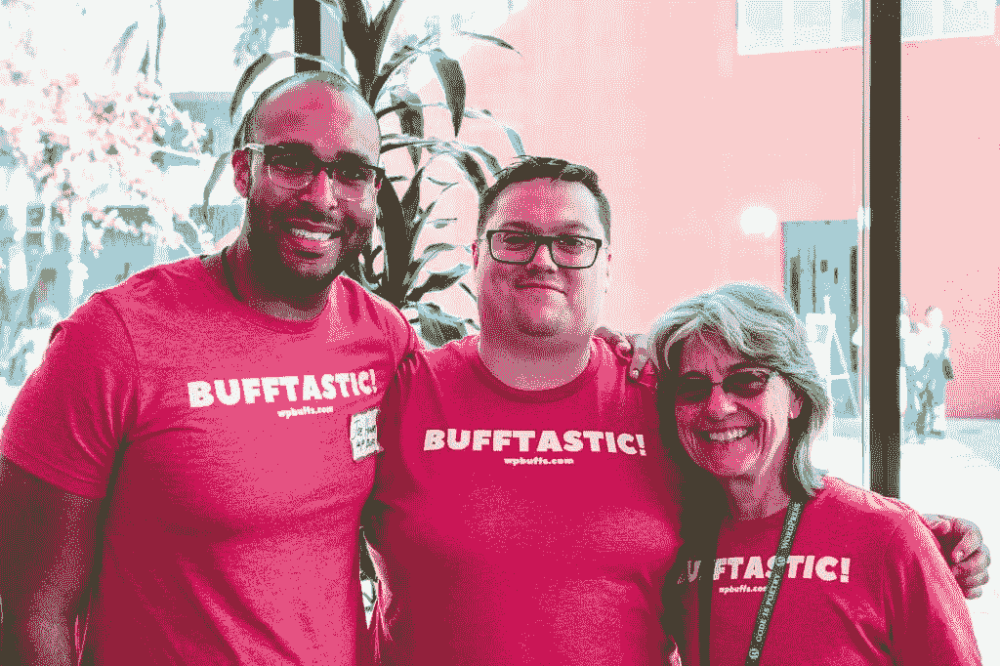
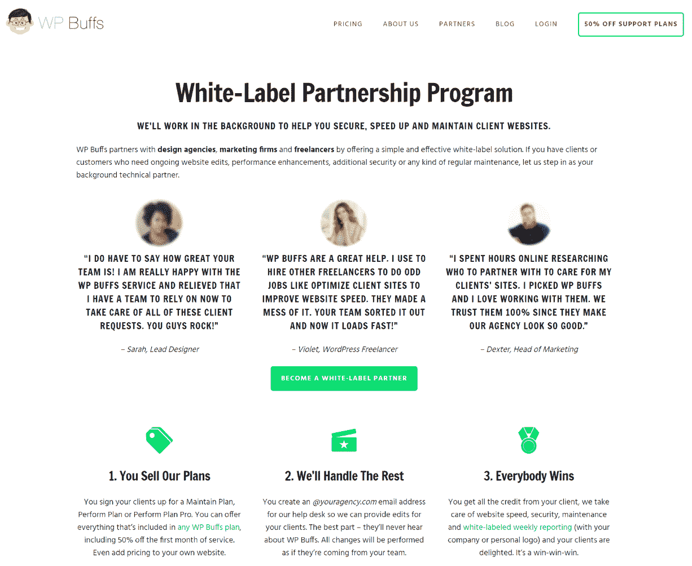

# 金斯塔·金并:乔·霍华德访谈

> 原文：<https://kinsta.com/blog/interview-joe-howard/>

你可以在 LinkedIn 或 T2 的 Twitter 上找到乔。这是我们最近对他的采访，作为我们[金斯塔·金并](https://kinsta.com/?post_type=post&s=kingpin)系列的一部分。

[The biggest challenge I ever faced wasn’t WordPress-related at all. -- Joe 😉Click to Tweet](https://twitter.com/intent/tweet?url=https%3A%2F%2Fkinsta.com%2Fblog%2Finterview-joe-howard%2F&via=kinsta&text=The+biggest+challenge+I+ever+faced+wasn%E2%80%99t+WordPress-related+at+all.+--+Joe+%F0%9F%98%89&hashtags=WordPress%2Cbusiness)

### Q1:你的背景是什么，你是如何开始使用 WordPress 的？

像 WordPress 世界中的许多人一样，我是在跳了几份不同的工作之后进入这个领域的。我本科时学的是数学和教育，所以我继续在 DC 的公立学校教了几年高中数学。

当我决定脱离这种模式时，我加入了一家早期的 SEO 代理公司。我被提升为运营总监。虽然这个头衔听起来令人印象深刻，但当你是公司的第一名员工时，它实际上只是意味着你在忙着做几乎所有的事情。

这是塞翁失马焉知非福！有；这项工作相当繁忙。但是我学到了很多关于 WordPress 和建立网站的知识！我们决定使用 WordPress 作为我们的内容管理系统，有几个主要原因:它对非技术人员来说**足够简单**(比如我)可以托管、启动和建立网站，而**的开源组件**意味着一个充满活力的社区，当我们陷入困境时可以得到帮助。

我也有机会学到了很多关于数字营销和创建在线业务的知识，这些技能我一直用到今天。

因此，尽管第一份创业工作很艰难，但为了提高我达到今天的地位(以及明天的目标)所需的技能，我付出的血汗和泪水是值得的。

### Q2:读者应该知道你最近在 WordPress 做了些什么？

大概只是我对 WP 社区很投入吧！我通过 [PostStatus 求职板](https://poststatus.com/job/wp-buffs-remote-1899-customer-happiness-buff/)进行招聘，并在 WordPress Meetups (DC、巴尔的摩和北弗吉尼亚)上发言。我还将在匹兹堡世界夏令营和巴尔的摩世界夏令营举办我的第一次世界夏令营讲座。嘣！

> Kinsta 把我宠坏了，所以我现在要求每个供应商都提供这样的服务。我们还试图通过我们的 SaaS 工具支持达到这一水平。
> 
> <footer class="wp-block-kinsta-client-quote__footer">
> 
> 
> 
> <cite class="wp-block-kinsta-client-quote__cite">Suganthan Mohanadasan from @Suganthanmn</cite></footer>

[View plans](https://kinsta.com/plans/)

我也是[WP Buff](https://wpbuffs.com/)的头部 Buff。我们为认真的网站所有者和[代理合作伙伴](https://kinsta.com/blog/wordpress-agency/)提供技术支持计划。今年，我们[将会赞助 5 个单词营。WordPress 空间给了我的商业发展，所以我们应该回报它。](https://2017.dc.wordcamp.org/sponsors/)

WP Buffs

最后，在 WP Buffs 大获成功后，我推出了 [WPMRR](https://wpmrr.com/) 和[WPMRR WordPress 播客](https://wpmrr.com/podcast/)。前者是一个视频课程，教授 WordPress 专业人士如何为他们的客户实施、销售和执行持续的护理计划，并增加他们每个月的收入。后者是一个播客，完全专注于发展成功的 WordPress 业务和每月经常性收入，而不太把自己当回事。

WPMRR

### Q3:在职业生涯中，你遇到了哪些挑战？

这么，这么多！大多数人听起来印象深刻，当他们听到可湿性粉剂是在那里，只有一岁，但我必须告诉人们，它成长出 7 年的错误和加速学习。已经有 7-10 个失败的项目让我走到了这一步。

老实说，我来到这里所面临的最大挑战与 WordPress 毫无关系。

我要保持真实。离开一份朝九晚五、高薪的咨询工作，全职为我的初创公司工作，对我来说真的非常非常艰难。一旦我做出了决定，我知道这是正确的，但是当你的生活相当舒适时，要打破这个循环就变得越来越难了。

我坚信时间是我最有价值的货币，所以我必须停止浪费我的时间。此外，我是一个相当糟糕的员工，所以做我自己的事情是我需要做的。

克服我必须朝九晚五工作才能成功的期望只是第一步，但我认为这是我在过去几年中迈出的最重要的一步。

当谈到 WordPress 的时候，你说出挑战的名字，我已经面对了。迁移出错、[白屏死机](https://kinsta.com/blog/wordpress-white-screen-of-death/)、数据库连接错误、营销活动失败等等。

诀窍是花时间真正评估哪里出了问题，下次你可以更好地控制什么，以获得你想要的结果。我非常专注于此，所以我总是能够提高。

### 在 WordPress 的世界里，有没有什么让你感到惊讶的事情？

老实说，WordPress 社区是多么受欢迎。

## 注册订阅时事通讯

### 想知道我们是怎么让流量增长超过 1000%的吗？

加入 20，000 多名获得我们每周时事通讯和内部消息的人的行列吧！

[Subscribe Now](#newsletter)

你可能是一个彻底的 00b(就像我 7 年前一样),有人在 WordPress Meetups 和 WordPress happy bar 上随时准备帮助你。

不管我经营什么生意，成为 WordPress 空间的一部分并不是我想当然的事情。这是一个充满活力的社区，充满了真诚的人，他们自己也不会道歉。你能把一个外向的营销人员和一个内向的开发人员放在同一个房间里，看到他们轻松相处的地方并不多；那真的很特别。

同时，我也很惊讶有多少人关注 WordPress，却没有花足够的时间去学习如何真正发展和扩大业务。我认为社区中有很大的空间让人们从小企业中创造可扩展的价值，而不是每周做 80 个小时的自由职业者。

在我看来，这是我们社区需要努力的事情。做出明智的商业决策，将我们正在做的事情扩展成我们不必一周 7 天、一天 12 小时都在做的事情。

这就是为什么我真的很喜欢看到 Troy Dean 这样的人在 WP Elevation 试图帮助人们建立 WordPress 业务，为人们创造真正的价值并解决大问题。

### Q5:你认为 WordPress 世界的未来会是怎样的？

与 WP Buffs 一起向前向上！

我们希望成为任何拥有 WordPress 网站的个人、企业或组织的最佳技术支持伙伴。这是一项正在进行的工作，但我们有近 100 个客户，所以我认为可以肯定地说，我们已经过了概念验证阶段。

Struggling with downtime and WordPress problems? Kinsta is the hosting solution designed to save you time! [Check out our features](https://kinsta.com/features/)

专注于发展我们的[白标合作伙伴计划](https://wpbuffs.com/partnerships/)对我来说是重中之重。找到合适的营销机构、设计公司和 WP 自由职业者来合作以获得持续的支持是我们增长的一大领域，我继续看到它继续推动我们前进。

White-label partnership

像大多数企业家一样，我总是在思考我想开始的新项目或业务，无论是在 WordPress 空间还是在它之外。但是我正在尽我最大的努力不让自己患上闪亮物体综合症，这样我就可以集中精力确保 WP Buffs 为我们的客户提供难以置信的价值。

### 你在 WordPress 主机中寻找什么？

说到托管，我最看重的是它的全面管理。

我理解为什么廉价的共享主机对一些人有吸引力。它不贵，而且如果你只是在运营一个流量不大的个人博客，共享主机可能是你的最佳选择。

但是如果你正在做一些严肃的事情，并且有一个高流量的网站，那么与一个能够为你处理整个后台的托管公司合作是至关重要的。

再说一次，在我看来，时间是我最宝贵的财富。一天只有 24 小时，我的带宽也就这么多。为了继续发展壮大 WP 爱好者，我需要把所有精力放在雇佣合适的人、参加会议、在单词营演讲和解决大问题上。我不想花时间在我们客户的主机仪表板上解决问题，所以我与负责此事的主机提供商合作。

当然，你需要一个主机来保证你的网站快速、安全、正常运行。但是老实说，有很多高质量的主机提供商；如果你选择了其中的一个，你可能会在这类事情上表现得相当稳健。

区别在于客户服务和处理一切我不想做或没有时间做的事情。专家 WordPress 的支持可能是为什么你们在 [Kinsta](https://kinsta.com/plans/) 已经成为这么多[大品牌](https://kinsta.com/why-us/)的首选主机合作伙伴之一！

推荐阅读:[WP 爱好者为什么要和 Kinsta 合作](https://kinsta.com/clients/wp-buffs/)

### 问题 7:当你离开笔记本电脑时，你喜欢做什么？

我住在芒特普莱森特，紧挨着岩石溪公园，在那里我可以享受大自然，每天还可以遛狗马文。

当我不在 WordPress 工作的时候，我可能会和我的妻子 Sterling 在一起。我们上个月刚结婚！我们喜欢去 DC 的华盛顿郊外露营和徒步旅行。我们也经常旅行(火人节快到了)。

我也是一个名为[沙盒](http://sandbox.is/)的社区的成员。我们在巴拿马的丛林和克罗地亚的一个岛屿举行了全球峰会。他们是我的部落！

说到阅读，我很喜欢科幻小说。我可能一个月看完几本书。大多数时候，我可能会听一个小时左右的播客(蒂姆·费里斯、乔·罗根等)。外面有这么多好东西！

### 问题 8:接下来我们应该采访谁&为什么？

布莱恩·克劳斯加德！在参加了[帖子状态发布](https://poststatus.com/publish/)后，我对他关于 WordPress 和数字空间的知识印象更加深刻。他还凭空创造了一个充满活力的 WordPress 领导者社区。他会成为一个杀手级的采访:)

* * *

让你所有的[应用程序](https://kinsta.com/application-hosting/)、[数据库](https://kinsta.com/database-hosting/)和 [WordPress 网站](https://kinsta.com/wordpress-hosting/)在线并在一个屋檐下。我们功能丰富的高性能云平台包括:

*   在 MyKinsta 仪表盘中轻松设置和管理
*   24/7 专家支持
*   最好的谷歌云平台硬件和网络，由 Kubernetes 提供最大的可扩展性
*   面向速度和安全性的企业级 Cloudflare 集成
*   全球受众覆盖全球多达 35 个数据中心和 275 多个 pop

在第一个月使用托管的[应用程序或托管](https://kinsta.com/application-hosting/)的[数据库，您可以享受 20 美元的优惠，亲自测试一下。探索我们的](https://kinsta.com/database-hosting/)[计划](https://kinsta.com/plans/)或[与销售人员交谈](https://kinsta.com/contact-us/)以找到最适合您的方式。