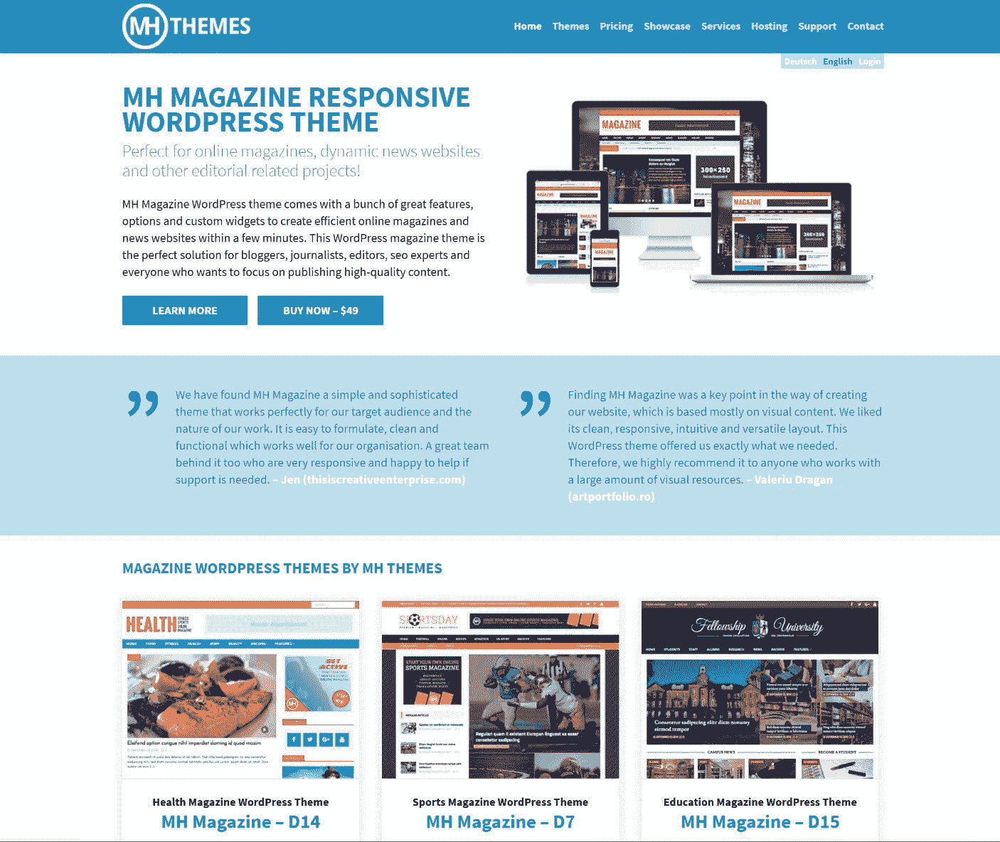
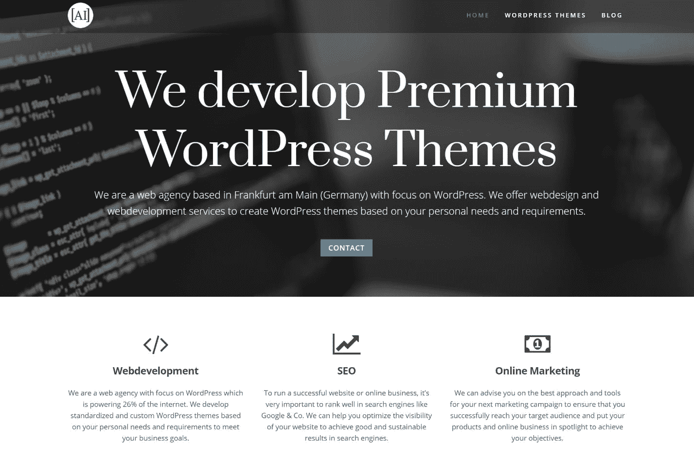

# 金斯塔·金并:迈克尔·赫本斯特雷特访谈

> 原文：<https://kinsta.com/blog/interview-michael-hebenstreit/>

你可以在推特和 T2 脸书上找到带有 MH 主题的迈克尔。这是我们最近对他的采访，作为我们[金斯塔·金并](https://kinsta.com/?post_type=post&s=kingpin)系列的一部分。

### Q1:你的背景是什么，你是如何开始使用 WordPress 的？

我的背景实际上与我今天所做的非常不同。在我开始我的 WordPress 之旅之前，我是一名股票经纪人(机构股权交易)。来自银行业，我不会想象有一天会经营一家 WordPress 主题公司。但是正如你可能已经注意到的，金融市场在过去的几年里相当动荡，我认为在你的生活中寻找你喜欢做的新事情永远不会太晚。

在银行业工作时，我一直对在线营销和 SEO 感兴趣。作为业余爱好，我创办了各种网站和在线杂志。在此过程中，我了解了 WordPress。我总是有调整我的 WordPress 主题的冲动，因为它并没有真正做到我当时运行一个专业网站所需要的。这也是我参与编码的方式，一步一步地学习。

过了一段时间，我开始编写自己的杂志主题，这正是我所需要的。我从朋友、家人和网站访问者那里得到了很好的反馈，以至于我决定有一天开始创业。那是几年前的事了，今天我还在经营一家已经相当受欢迎的 WordPress 主题商店。

### Q2:读者应该知道你最近在 WordPress 做了些什么？

我大部分时间都在运行 [MH Themes](https://www.mhthemes.com/) ，在那里你可以为在线杂志、新闻网站和其他编辑项目找到杂志&新闻 WordPress 主题。我们的旗舰产品是 [MH 杂志](https://www.mhthemes.com/themes/mh/magazine/)，这也是我们推出的第一个产品，多年来它已经成为 WordPress 最受欢迎的杂志主题之一。

MH Themes

如果有人在几年前告诉我，我们将拥有来自 110 多个国家的 20，000 多名客户，我可能不会相信。尤其是这一切都是从爱好开始的。但我认为成功的一个关键是对产品的奉献和对支持的关注。例如，在我们的营业时间内，客户的请求很少会在几分钟内得到回复。

看到客户在他们的网站上用我们的 WordPress 主题做什么总是很棒的。你可以在 [MH 主题展示区](https://www.mhthemes.com/themes/showcase/)看到一些不错的例子。非常令人鼓舞的是，当大公司和组织开始使用我们的 WordPress 主题时，例如，Imgur 或 NYPD(纽约警察局)。

> Kinsta 把我宠坏了，所以我现在要求每个供应商都提供这样的服务。我们还试图通过我们的 SaaS 工具支持达到这一水平。
> 
> <footer class="wp-block-kinsta-client-quote__footer">
> 
> 
> 
> <cite class="wp-block-kinsta-client-quote__cite">Suganthan Mohanadasan from @Suganthanmn</cite></footer>

[View plans](https://kinsta.com/plans/)

### Q3:在职业生涯中，你遇到了哪些挑战？

显然是在学习编码。我倾向于学东西很快，但是编程仍然是完全不同于每天交易股票的事情。所以，在开始的时候，我花了大部分时间来学习代码、最佳实践，并尝试一些东西来适应代码。众所周知，对于编程来说，学习永远不会停止，尤其是在框架和最佳实践发展迅速的今天。

另一件事是经营全球业务。显然，经营自己的企业与在公司工作时只做自己的工作是完全不同的。你很快就会知道，这不仅仅是处理日常业务，还涉及到许多其他事情，如成立公司、处理税务(尤其是当你开始在全球销售时)、雇用人员、做营销和让官僚高兴，尤其是当你在德国这样一个受监管的国家运营时，更不用说欧盟了。

### 在 WordPress 的世界里，有没有什么让你感到惊讶的事情？

是的，虽然来自一个竞争激烈和以商业为中心的环境，但找到一个热情而生动的 WordPress 社区还是很不错的。人们花费大量时间为 WordPress 做贡献(通常是免费的)是非常令人钦佩的。老实说，对我来说，有时仍然感觉有点奇怪，因为我习惯了人们为他们的工作获得报酬，但开源似乎是一个不同的世界，这当然不一定是一件坏事。至少在人们仍然觉得他们的贡献得到了回报的时候，不管这种回报对他们来说是多么重要。

## 注册订阅时事通讯

### 想知道我们是怎么让流量增长超过 1000%的吗？

加入 20，000 多名获得我们每周时事通讯和内部消息的人的行列吧！

[Subscribe Now](#newsletter)

### Q5:你认为 WordPress 世界的未来会是怎样的？

虽然我们的 WordPress 主题业务非常健康，但我也看到 WordPress 主题市场已经高度饱和且竞争激烈。我很幸运在这个有点不同的时候开始创业。在那个时候，让一个 WordPress 主题流行起来并不难，只需要全身心投入和一个坚实的营销计划。然而，如今营销一个新主题并脱颖而出已经变得相当昂贵。

此外，似乎有一种趋势，大公司正在控制 WordPress 生态系统，这使得小公司更难竞争。更不用说 WordPress 是如何发展的了([、古腾堡](https://kinsta.com/blog/gutenberg-wordpress-editor/)、Rest API 等等)，前面还有各种新的挑战和机遇，我们将看到未来几年的发展趋势。

对我们来说，这意味着我们将继续专注于我们的主要产品，并调整它以应对 WordPress 的变化。我认为这并不总是容易的，尤其是因为 WordPress 目前正在重塑自己，有时还不确定核心开发将采取什么路线。在未来的几个月里，我们可能会看到更多的核心实验，直到有可能合理地提前计划。

我还预计我们会看到越来越多的托管解决方案和 SaaS 企业涌现出来。这也助长了与 Wix、Medium、Squarespace 等一体化解决方案竞争的冲动。这些公司提供比现在的 WordPress 更容易的入职体验，如果你想获得 50%的市场份额，你需要设法让不太懂技术的客户也加入进来。

[If #WordPress wants to reach 50% market share 📈, it needs to attract less tech-savvy customers as well.Click to Tweet](https://twitter.com/intent/tweet?url=https%3A%2F%2Fkinsta.com%2Fblog%2Finterview-michael-hebenstreit%2F&via=kinsta&text=If+%23WordPress+wants+to+reach+50%25+market+share+%F0%9F%93%88%2C+it+needs+to+attract+less+tech-savvy+customers+as+well.)

然而，在这样做的同时，我认为不牺牲 WordPress 今天的成就，数以千计的小主题和插件开发者是非常重要的。如果没有一个你能想到的几乎所有东西的插件，WordPress 今天不会这么成功。打破成千上万的主题和插件来为 WordPress 提供一个新的编辑器(例如，放弃对自定义元框的支持)可能不是一个好主意。但是我相信核心开发者在向前推进的时候会考虑到这一点。

Struggling with downtime and WordPress problems? Kinsta is the hosting solution designed to save you time! [Check out our features](https://kinsta.com/features/)

此外，我还打算睁大眼睛寻找其他有趣的机会和商业创意(不一定是 WordPress)。2015 年，我成立了一家名为 [Array Internet](https://arrayinternet.com/) 的公司。它目前只是我们 WordPress 业务的控股公司，但是我们也计划投资其他业务。如果你有一个有趣而可靠的商业想法，需要资金、咨询和可靠的营销计划，请随时联系。

Array Internet

### 你在 WordPress 主机中寻找什么？

我觉得说到主机最重要的是可靠性和性能。没有人希望停机。除此之外，还应提供支持，并在合理的时间内做出响应。似乎现在的最终用户也在寻找一键式的 WP 安装。我个人也认为托管[应该定价合理](https://kinsta.com/blog/how-to-price-a-product-wordpress/)，而不是竞相压价(这也适用于 WP 生态系统中的其他产品)。

### 问题 7:当你离开笔记本电脑时，你喜欢做什么？

在这个行业中，业余时间确实是一个问题，虽然每周工作 60-70 个小时，但我尽可能放松。我和我老婆一月份就当爸妈了。我们目前尽量花所有的时间陪我们的女儿(在家工作，当然是有益的)，这是一个伟大的和非常有益的经验。除此之外，我试着过健康的生活方式，同时享受健康的食物和定期锻炼。

### 问题 8:接下来我们应该采访谁&为什么？

我很想看对唐娜查·麦克格琳的采访。他最近在 WP Mayor 上发表了一篇关于 WooCommerce 在没有进一步通知的情况下提高续订价格的文章，他分享了他的观点，即这将为其他公司带来 WordPress 历史上最大的机会。

* * *

让你所有的[应用程序](https://kinsta.com/application-hosting/)、[数据库](https://kinsta.com/database-hosting/)和 [WordPress 网站](https://kinsta.com/wordpress-hosting/)在线并在一个屋檐下。我们功能丰富的高性能云平台包括:

*   在 MyKinsta 仪表盘中轻松设置和管理
*   24/7 专家支持
*   最好的谷歌云平台硬件和网络，由 Kubernetes 提供最大的可扩展性
*   面向速度和安全性的企业级 Cloudflare 集成
*   全球受众覆盖全球多达 35 个数据中心和 275 多个 pop

在第一个月使用托管的[应用程序或托管](https://kinsta.com/application-hosting/)的[数据库，您可以享受 20 美元的优惠，亲自测试一下。探索我们的](https://kinsta.com/database-hosting/)[计划](https://kinsta.com/plans/)或[与销售人员交谈](https://kinsta.com/contact-us/)以找到最适合您的方式。