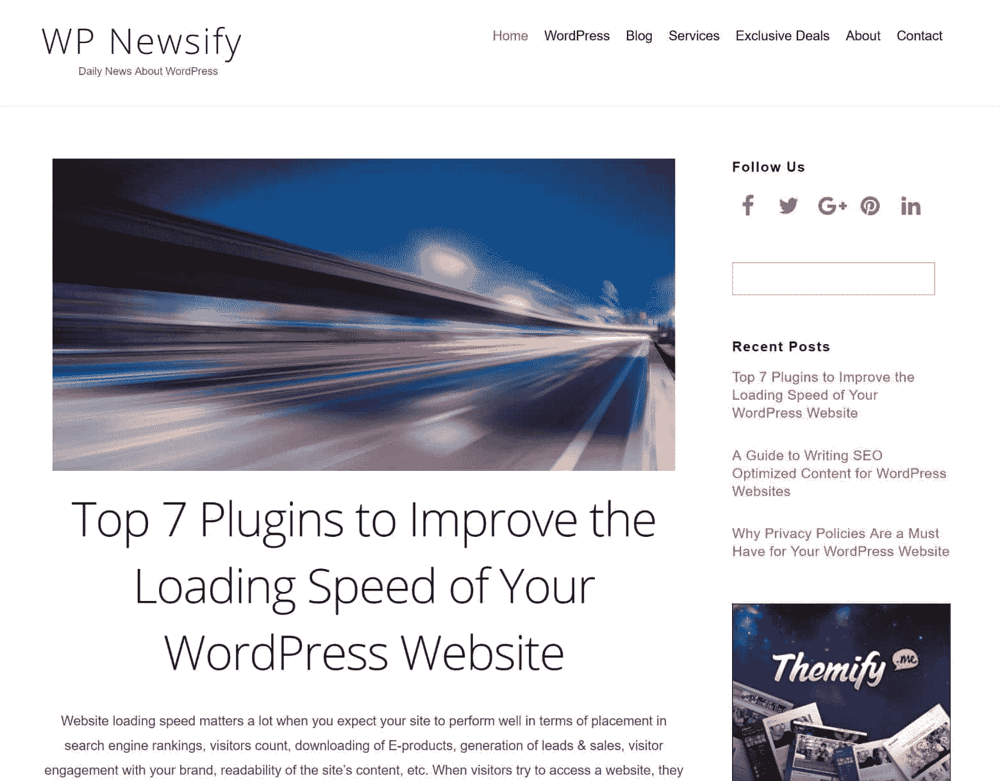

# 金斯塔·金并:彼得·尼尔森访谈

> 原文：<https://kinsta.com/blog/interview-peter-nilsson/>

你可以在 [LinkedIn](https://www.linkedin.com/in/peter-nilsson-0582a723/) 或 [Twitter](https://twitter.com/PeterMNilsson) 上找到彼得。这是我们最近对他的采访，作为我们[金斯塔·金并](https://kinsta.com/?post_type=post&s=kingpin)系列的一部分。

### Q1:你的背景是什么，你是如何开始使用 WordPress 的？

我在 WordPress 之前的背景和我现在做的有点不一样。在偶然发现 WordPress 之前，我是一名建筑工人和网络技术员。

我在 2008 年发现了 WordPress，并很快意识到博客和 WordPress 的潜力。一个新的世界真的打开了。对我来说，之前我只是调整了 HTML 模板并使用了谷歌的博客平台 Blogger T1，发现 WordPress 确实是朝着正确的方向迈出了一步。

我开始用瑞典语建立了几个博客，事情进展得很快。其中一个博客成为瑞典最大的面向 WordPress 的博客之一，我真的找到了我的关注点。

2011 年，我想走向国际，卖掉了我所有的瑞典博客。我建立了几个新的英文网站。大多数人可能是通过我的网站 WP 每日主题认识我的，这个网站我已经运营了五年。2016 年收购 WP 每日主题。我还卖掉了我的其他网站重新开始。

今天，我有四个新博客，但主要网站是 [WP Newsify](https://wpnewsify.com/) ，它真的开始起飞了。

### Q2:读者应该知道你最近在 WordPress 做了些什么？

我正在全速运行 WP Newsify。WP Newsify 是一个专注于 WordPress 的网站(当然)。我和我的团队撰写关于 WordPress、主题、插件和教程的文章。

WP Newsify

网站占用了我很多时间，所以我的日子很充实，但我真的很高兴从事我喜欢的工作。

当我有空闲的时候，我会翻译，主要是在 WordPress 插件库中，但也为那些对翻译他们的插件感兴趣的人。目前，我正和 WP 市长的[们一起将他们著名的插件](https://kinsta.com/blog/interview-with-wp-mayor/) [WP RSS 聚合器](https://wordpress.org/plugins/wp-rss-aggregator/)翻译成瑞典语。

### Q3:在职业生涯中，你遇到了哪些挑战？

这些年来有很多(我是说很多)挑战。我基本上是从 2008 年开始用 WordPress 工作的，所以我在这个行业已经有好几年了。我确信的一件事是永远不要害怕失败。我在项目、网站和其他与网络相关的事情上失败过很多次。很艰难！

[Learn from the mistakes. Roll up your sleeves and keep working. 👍Click to Tweet](https://twitter.com/intent/tweet?url=https%3A%2F%2Fkinsta.com%2Fblog%2Finterview-peter-nilsson%2F&via=kinsta&text=Learn+from+the+mistakes.+Roll+up+your+sleeves+and+keep+working.+%F0%9F%91%8D&hashtags=startup%2Centrepreneur)

事后看来，这些失败本身就是关键的转折点。如果你能从任何一种失败中变得更强大，你实际上已经比你想象的更成功了！

## 注册订阅时事通讯

### 想知道我们是怎么让流量增长超过 1000%的吗？

加入 20，000 多名获得我们每周时事通讯和内部消息的人的行列吧！

[Subscribe Now](#newsletter)

说到 WordPress，我确信我在客户端和我自己的网站上都遇到了 WordPress 中可能出现的大多数问题。如果你知道那种可怕的感觉，并且在点头，那么你就知道我在说什么。

但老实说，从错误中吸取教训。卷起袖子继续工作。没有别的办法。

### 在 WordPress 的世界里，有没有什么让你感到惊讶的事情？

一个字:社群！

我从未如此惊讶于全球 WordPress 社区的社区和帮助。如此多的人通过博客、论坛、WordPress 和 meetups 传播和分享他们的知识，所有这些对于任何想要学习或需要任何帮助的人来说都是极好的资源，从安装插件到更高级的故障排除。

这个美好社区的另一个伟大之处是，这些年来，我遇到了来自世界各地的这么多了不起的人和朋友。如今通过社交媒体联系是如此容易。没有人比点击更远。

### Q5:你认为 WordPress 世界的未来会是怎样的？

就我的业务和小团队而言，我希望专注于简化，但同时改进和优化我们当前的一些流程。我只是想变得更有效率，同时不失去对雇佣我们的人的关注。当然，我希望 WP Newsify 在各个层面都有所增长。

我还在做一个新网站，还在规划阶段。对于那些想使用 WordPress 或者正在寻找 WordPress 相关工作的人来说，这将是一笔财富。这是一个新的挑战，我对未来非常乐观。

### 你在 WordPress 主机中寻找什么？

谈到托管，我关注的一些事情是**速度、性能和可靠性**。伟大的技术和坚实的支持意味着很多。价格也是一个需要考虑的因素，至少对我来说是这样。我有过收取天价费用的托管平台，虽然性能很好，但支持却很差。这些关系是短暂的。

### 问题 7:当你离开笔记本电脑时，你喜欢做什么？

当我不在电脑前时，我会花时间和家人在一起。我们住在美丽的瑞典南部，附近有迷人的风景。我们一年中也有一部分时间住在泰国，享受泰国的自然和生活方式。

因为我是一个户外运动的人，我喜欢散步、跑步、划独木舟、露营和其他激发自然灵感的经历。我喜欢周游世界，体验新的国家和文化。我最喜欢的国家肯定是澳大利亚和泰国。

### 问题 8:接下来我们应该采访谁&为什么？

我很想看到对大卫·阿塔尔德的采访，他是一位励志作家，有很多关于 WordPress 的深入文章。

布莱恩，谢谢你接受我的采访。

* * *

让你所有的[应用程序](https://kinsta.com/application-hosting/)、[数据库](https://kinsta.com/database-hosting/)和 [WordPress 网站](https://kinsta.com/wordpress-hosting/)在线并在一个屋檐下。我们功能丰富的高性能云平台包括:

*   在 MyKinsta 仪表盘中轻松设置和管理
*   24/7 专家支持
*   最好的谷歌云平台硬件和网络，由 Kubernetes 提供最大的可扩展性
*   面向速度和安全性的企业级 Cloudflare 集成
*   全球受众覆盖全球多达 35 个数据中心和 275 多个 pop

在第一个月使用托管的[应用程序或托管](https://kinsta.com/application-hosting/)的[数据库，您可以享受 20 美元的优惠，亲自测试一下。探索我们的](https://kinsta.com/database-hosting/)[计划](https://kinsta.com/plans/)或[与销售人员交谈](https://kinsta.com/contact-us/)以找到最适合您的方式。