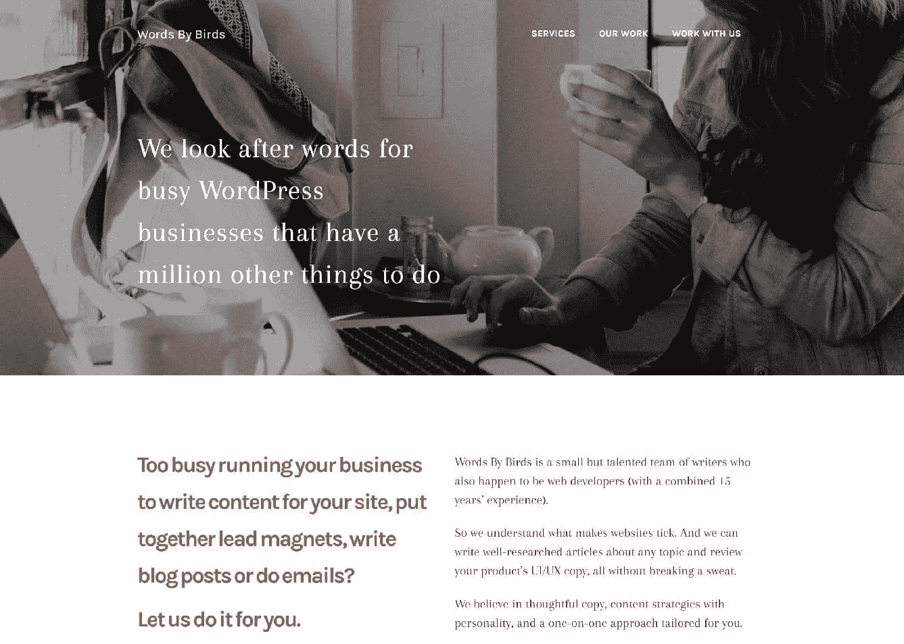

# 金斯塔·金并:采访蕾琳·莫雷

> 原文：<https://kinsta.com/blog/interview-raelene-morey/>

你可以在 LinkedIn 或者 T2 的 Twitter 上找到瑞琳。这是我们最近对她的采访，是我们[金斯塔·金并](https://kinsta.com/?post_type=post&s=kingpin)系列的一部分。

### Q1:你的背景是什么，你是如何开始使用 WordPress 的？

十几岁时，我喜欢建立网站。没有任何特别的目的，我只是喜欢学习 HTML 和 CSS，看看我能创造什么。我建立了如此多的网站——我擅长创建它们，但每当有新想法出现，我想建立更好的东西时，我总是放弃它们。当到了选择我想在大学学习什么的时候，我在追求写作生涯(我一直喜欢写故事)和追随我对技术的热爱之间左右为难。所以我两个都选了——我主修新闻和计算机科学。

毕业后，我做了一名报社记者，这是我绝对热爱的工作。以结识他人和写他们的故事为生——我实现了自己的梦想。在业余时间，我继续在网站上工作。主要是社区团体和朋友的网站。那时，我已经离开了 Geocities 和 Blogspot，开始使用 WordPress，主要是因为它易于定制，而且我可以毫不费力地建立自托管网站。

直到 2012 年我才开始专业使用 WordPress。我决定离开新闻业，去网站开发碰碰运气。我在 WPMU DEV 的母公司 Incsub 找到了一份文字编辑的工作。我后来成为了执行主编，负责管理最大的在线 WordPress 资源之一(5000 多篇帖子，还在增加！).我喜欢和才华横溢的人为 WordPress 开发非常酷的产品。但 4+年后，我在 11 月告别了 WPMU DEV，开始了自己的创业。

### Q2:读者应该知道你最近在 WordPress 做了些什么？

我最近开始了自己的事业。我的重点是为 WordPress 企业创造高质量的内容，包括博客帖子、销售和营销文案、内容策略……几乎所有涉及网站和产品用词的内容。

Words By Birds

由于谷歌越来越频繁地更新质量算法，去年对许多网站来说是流量不稳定的一年。自从谷歌的企鹅和熊猫算法改变后，搜索引擎优化主要依赖于优质内容。而不是像几年前那样，把适量的关键词塞进不自然的文章，建立尽可能多的(通常是垃圾邮件)反向链接。因此，我对《鸟语》(Words By Birds)的关注点是创造那种人们喜欢阅读的**高质量内容，并认为这些内容是真实的、有价值的和信息丰富的，同时也满足了谷歌对质量的渴望。**

### Q3:在职业生涯中，你遇到了哪些挑战？

我的职业生涯很幸运。我曾与一些令人难以置信的组织和导师一起工作，他们给了我学习和成长的空间，无论是在新闻业还是在网络开发方面。所以我在职业生涯中没有面临过什么大的挑战。

最近，开始我自己的生意是一个挑战。我是创业的新手，所以让鸟儿们说出来既有挑战性，也有巨大的回报。最初，我与 Jenni McKinnon 合作，她是另一个了不起的 WordPress 作家，住在温哥华。但是在国际范围内建立一家公司有很多挑战。所以我们决定保持简单，经营我们自己的生意(她现在经营 WP Pros(e) ),当两个人的智慧胜过一个人的时候，我们在联合项目和合资企业上合作。
T3】

### 在 WordPress 的世界里，有没有什么让你感到惊讶的事情？

[I hope we can hold on to the diversity of small and larger businesses in the #WordPress ecosystem. 👍Click to Tweet](https://twitter.com/intent/tweet?url=https%3A%2F%2Fbit.ly%2F2NUN6Tg&via=kinsta&text=I+hope+we+can+hold+on+to+the+diversity+of+small+and+larger+businesses+in+the+%23WordPress+ecosystem.+%F0%9F%91%8D)

看着 WordPress 这些年的发展，与其说是令人惊讶，不如说是令人大开眼界。在过去的几年里，许多大公司已经开始收购较小的 WordPress 公司。WordPress 已经发生了翻天覆地的变化，从草根时代开始，开发人员几乎陷入使用这个平台经营业务的困境。我真的希望我们能够保持存在于 WordPress 生态系统中的大小企业的多样性。

## 注册订阅时事通讯

### 想知道我们是怎么让流量增长超过 1000%的吗？

加入 20，000 多名获得我们每周时事通讯和内部消息的人的行列吧！

[Subscribe Now](#newsletter)

然而，让我措手不及的是，自从我开始专业地使用 WordPress 工作以来，我已经建立了惊人的友谊。我真的很幸运，这些年来遇到了很多和我一起工作和合作的人。为此我要感谢 WordCamps，更不用说我在 Incsub 工作期间在欧洲工作和旅行的六个月了。

最让我惊讶的是，从《鸟语》开始，我很快就找到了客户。企业开始认识到对精心编写的高质量内容的需求，而不是选择那些在页面上乱写文字的低端博客作者，他们开始转向像我这样的企业，寻找在谷歌上排名很好的有用和有价值的内容。所以，幸运的是，我选择了追随我的两个爱好，写作和网络开发，因为它们让我在人生的这个阶段创建了一个满足日益增长的需求的企业。

### Q5:你认为 WordPress 世界的未来会是怎样的？

我真的很兴奋看到 2018 年为我准备了什么！既然我已经把 Birds 的话说到了拉面有利可图的地步，我下一步的重点是投资品牌和网站重新设计。我不是一个设计师，所以我的网站需要很多的爱！

Struggling with downtime and WordPress problems? Kinsta is the hosting solution designed to save you time! [Check out our features](https://kinsta.com/features/)

我今年的目标是成为 WordPress 企业优质内容的最佳提供商。但我只有一个人，所以毫无疑问，围绕如何扩展会有挑战。我还想创建和销售一些资源，帮助那些想创建自己的高质量内容但不知道如何创建的企业主。

### 你在 WordPress 主机中寻找什么？

这真的取决于你需要托管的网站，但一般来说，我优先考虑四件事:可靠性，性能，价格和支持。这些年来，我在不同的公司有很多主机账户，在 WPMU DEV 博客上写文章和评论时，我花了很多时间测试主机包。我发现**最好的主持人总是提供顶级的支持**并尽力帮助你。

我一般不会把时间浪费在[廉价主机](https://kinsta.com/blog/cheap-wordpress-hosting/)上。以我的经验来看，这是得不偿失的。当我帮助社区团体和朋友建立新网站时(我仍然不时地这样做)，我经常告诉他们，虽然他们可能不会为我的时间支付报酬，但他们不应该在高质量的主机服务上吝啬。因为如果流量因为关闭而无法到达你的网站，那么你实际上就关门了。简而言之，这就是为什么高质量的主机如此重要。
T3】

### 7.离开笔记本电脑时，你喜欢做什么？

我知道这是老生常谈，但像许多企业主一样，我花了太多时间工作。你很少会发现我离我的笔记本电脑很远。幸运的是，我有一个非常有耐心的伙伴！所以当我不工作的时候，我试着放松并充分利用它。

我喜欢徒步旅行和露营。我最近在我的家乡塔斯马尼亚进行了一次为期六天、长达 65 公里的陆上徒步旅行。每天醒来都能看到山景、新鲜空气和野生动物，这是令人难以置信的，更不用说离开移动范围几乎一周了。完全离线是一种幸福。

在周末，我喜欢和我的伴侣离开墨尔本。他冲浪，所以我们经常开车去偏远地区的海滩。没有什么比躺在沙滩毛巾上读一本好书更好的了。我也喜欢电影，骑着自行车在墨尔本兜风，当然，还有咖啡——你不可能住在墨尔本而不喜欢咖啡！

### 8.接下来我们应该采访谁&为什么？

[布伦特·谢泼德](https://twitter.com/thenbrent),[出版社](https://prospress.com/)的创始人。他是非常受欢迎的 WooCommerce 订阅扩展背后的大脑，并且正在用[机器人忍者](https://robotninja.com/)做令人惊讶的事情，这是 WooCommerce 商店的第一个自动化测试解决方案。他也是一个可爱的家伙，去年我在旧金山时，他向我介绍了墨西哥玉米煎饼的美味。

* * *

让你所有的[应用程序](https://kinsta.com/application-hosting/)、[数据库](https://kinsta.com/database-hosting/)和 [WordPress 网站](https://kinsta.com/wordpress-hosting/)在线并在一个屋檐下。我们功能丰富的高性能云平台包括:

*   在 MyKinsta 仪表盘中轻松设置和管理
*   24/7 专家支持
*   最好的谷歌云平台硬件和网络，由 Kubernetes 提供最大的可扩展性
*   面向速度和安全性的企业级 Cloudflare 集成
*   全球受众覆盖全球多达 35 个数据中心和 275 多个 pop

在第一个月使用托管的[应用程序或托管](https://kinsta.com/application-hosting/)的[数据库，您可以享受 20 美元的优惠，亲自测试一下。探索我们的](https://kinsta.com/database-hosting/)[计划](https://kinsta.com/plans/)或[与销售人员交谈](https://kinsta.com/contact-us/)以找到最适合您的方式。