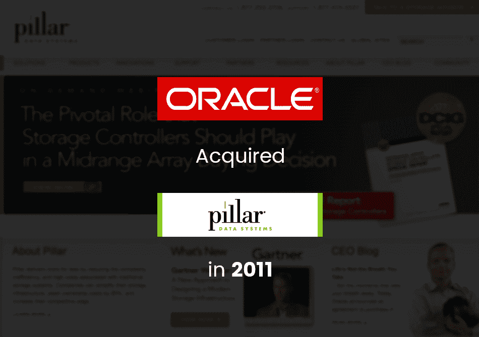
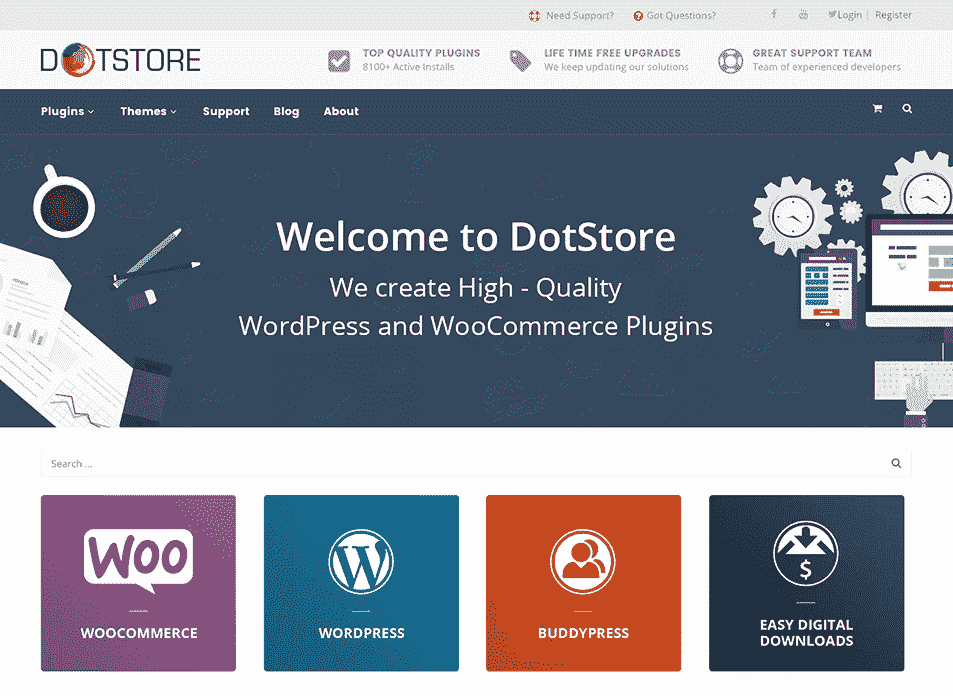
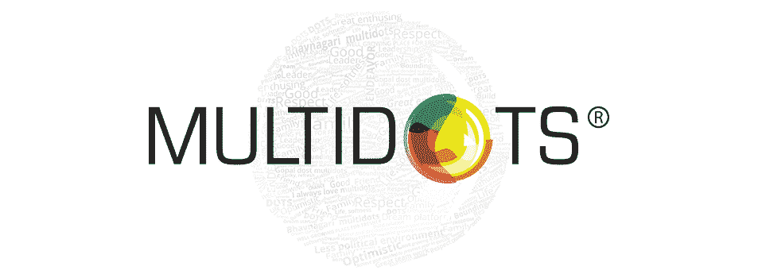

# 金斯塔·金并:阿尼尔·古普塔访谈

> 原文：<https://kinsta.com/blog/interview-with-anil-gupta/>

你可以在 LinkedIn 或 T2 的 Twitter 上找到阿尼尔。这是我们最近对他的采访，作为我们[金斯塔·金并](https://kinsta.com/search/kingpin/)系列的一部分。

Q1:你的背景是什么，&你最初是如何加入 WordPress 的？

我第一次接触 WordPress 是在 2004 年，当时我在大学学习计算机科学。作为我研究的一部分，我在探索 Linux/PHP/WordPress，甚至是 Linux/开源小组的一员。PHP 最吸引我，我决定成为一名 PHP 开发人员。我还参与了各种 web 开发工作，学习用 PHP 和 MySQL 开发网站、web 应用程序等。我的经历使我获得了 PHP 5 和 Zend 认证。

当我在 2007 年作为一名网络开发人员开始为一些机构工作时，我有使用 WordPress 建立博客、网站、社交网络应用等的第一手经验。我还与 Joomla、T2、Drupal 和其他类似的 CMS 平台合作过。其中，WordPress CMS 最让我感兴趣。我喜欢使用 WordPress，并为客户特定的项目量身定制。我的一个客户对我用 WordPress 管理她的博客的方式非常满意，这进一步引发了我对 WordPress 的兴趣。

所有这一切都归结于我和我的朋友阿斯拉姆，他们决定在 2009 年启动 WordPress 代理公司 [Multidots](http://www.multidots.com/) ，专注于建立博客、网站、网络应用、电子商务、社交网络等。以 WordPress 为核心的一切，以及 BuddyPress、WooCommerce 等其他工具。

我们的第一个大型 WordPress 项目是为硅谷一家非常大且声誉卓著的企业建立一个企业网站——[Pillar Data](https://en.wikipedia.org/wiki/Pillar_Data_Systems)(后来被甲骨文收购)。我们用 WordPress 建立了他们的官方网站，还用 BuddyPress 建立了他们的第一个员工和客户社交网络平台。

**Q2:读者应该了解你的机构 Multidots 什么，&什么样的客户是一个很好的选择？**

作为 WordPress 的核心代理机构，我们拥有急需的专业知识，在使用 WordPress、WooCommerce 和 BuddyPress 构建网络应用程序、博客、网站、社交网站和电子商务商店时，我们可以提供解决方案和合理的商业建议。

我们主要与初创企业和小型企业合作，通过有针对性的网络和移动解决方案帮助他们实现增长。我们的目标是为机构和企业工作，并在构建网络和移动产品时充当他们的延伸臂，甚至为他们提供持续的技术支持。

> Kinsta 把我宠坏了，所以我现在要求每个供应商都提供这样的服务。我们还试图通过我们的 SaaS 工具支持达到这一水平。
> 
> <footer class="wp-block-kinsta-client-quote__footer">
> 
> 
> 
> <cite class="wp-block-kinsta-client-quote__cite">Suganthan Mohanadasan from @Suganthanmn</cite></footer>

[View plans](https://kinsta.com/plans/)

我们的 100 多名团队在为大机构和全球品牌构建后端服务、前端解决方案、以用户为中心的用户界面等方面拥有丰富的经验。我们作为一个远程团队工作，到目前为止，这是我们最成功的工作模式。简而言之，我们在为初创企业、精益企业、小型机构和全球组织构建 web 和移动产品方面拥有世界级的经验。

就我们的理念而言，我们专注于为员工提供完全的自由和责任，并满足他们的个人需求，从而给予他们最大的关怀。而这反过来又会产生一个快乐、满意的员工队伍——自动为我们的客户提供无与伦比的关怀——反过来，客户也会对我们提供的服务和支持感到满意。

我们的团队对开源贡献非常积极和开放。访问我们的 [GitHub 简介](https://github.com/multidots)和 [WordPress 简介](https://profiles.wordpress.org/dots/)，了解我们团队的所有活动和贡献。我们也有自己的高级主题和插件官方商店——[网店](http://store.multidots.com/)。

[T2】](http://store.multidots.com/)

**Q3:在建立代理机构的过程中，你遇到了哪些挑战？**

开创自己的事业，放弃高薪稳定工作的舒适，绝非易事。但是开办自己的公司所带来的兴奋和挑战本身就是一个助推器。

当我们开始 Multidots 时，我们的第一个主要挑战是吸引合适的人，他们分享我们对技术的热情，并有实现目标的心态，不会因障碍而气馁。当你创办一家公司时，它不是一份朝九晚五的工作。你将不得不投入大量时间，不怕麻烦地为客户提供高质量的工作。因此，简而言之，找到有创业精神和勇气说出自己想法的人是一个棘手的问题。

这还没有结束。当你吸引到合适的人才时，留住他们并创造一种培养他们创造力并鼓励他们留下来的文化也是一项挑战。

幸运的是，通过采用正确的价值观，我们能够留住 96%的员工。我们的流失率几乎不到 4%。这也有助于我们留住客户。

其次，“外包”的概念给我们国家带来了积极和消极的影响。我将集中讨论后一部分。这不仅增加了竞争，也给印度公司创造了某种负面形象——就像你以低廉的价格完成了一般质量的工作，如果你想以低成本完成某些事情——印度是人们脑海中的第一个名字。我不同意这一点。

## 注册订阅时事通讯

### 想知道我们是怎么让流量增长超过 1000%的吗？

加入 20，000 多名获得我们每周时事通讯和内部消息的人的行列吧！

[Subscribe Now](#newsletter)

仅仅因为我们在印度工作，并不意味着我们会以低成本和低质量的工作。我们正努力改变这种形象，以有竞争力的价格提供高质量的工作。

我们做一些非常高质量的工作，而且不便宜。即使这意味着对工作说不，我们也会去做。我们从不做项目，我们致力于建立关系。

[We never work on projects, we work on building relationships. @guptaanilgClick to Tweet](https://twitter.com/intent/tweet?url=https%3A%2F%2Fkinsta.com%2Fblog%2Finterview-with-anil-gupta%2F&via=kinsta&text=We+never+work+on+projects%2C+we+work+on+building+relationships.+%40guptaanilg&hashtags=webdev%2Cagency)

**Q4:在成长的过程中有没有什么让你惊喜的事情？**

我们一开始投资了将近 200 美元，几台台式电脑&一套租来的公寓。我们从来不知道这项投资会在五年后变成百万美元的生意。这是我们有过的最愉快的惊喜之一。

其次，我们有机会与一些初创企业合作，我们看到他们成长为价值数百万美元的企业和 500 强公司。

我们已经开发了移动应用程序([event edge](http://www.eventedge.co/)——用于会议和活动的移动应用程序)，现在世界各地的大品牌(如 LinkedIn、沃达丰等)都在使用这些程序。)和他们的受众。它正被数百万人使用。我们的另一个客户， [ABUV Media](http://www.prweb.com/releases/abuvmedia/inc5000/prweb13623742.htm) ，入选了今年的 500 强。然后，我们与土耳其最受欢迎的支付网关 [iyzico](http://www.iyzico.com/) 合作。这些人就像我们一样从咖啡店起家，现在已经获得了数百万美元的资助。

我认为，与我们一起成长并帮助我们的客户成长，以及一起踏上旅程，对我们来说是令人愉快的惊喜。

Struggling with downtime and WordPress problems? Kinsta is the hosting solution designed to save you time! [Check out our features](https://kinsta.com/features/)

**问题 5:该机构的未来是什么样的？**

我们的重点是让 Multidots 成为一个全球品牌，因此我们正在向美国和英国等国家扩张。我们的想法是进一步加强与现有客户的关系，甚至扩大客户群。

[T2】](http://www.multidots.com/)

我们也计划成为经验证的 WooExperts 和 WordPress VIP 合作伙伴，因为我们认为我们拥有在 WordPress 中工作和服务企业客户的所有要素。

此外，我们日复一日地努力，打造世界级的产品和平台，满足现有客户和其他企业的特定需求。

我们还希望在增强现实、虚拟现实和物联网(IoT)领域进行冒险。

最后，我们也希望参加更多的 WordPress 社区和技术会议，与世界分享我们的专业技能和知识，并与这个社区一起学习、贡献和成长。

问 6:你在托管的 WordPress 主机中寻找什么？
作为我们项目的一部分，我们需要向我们的客户推荐良好的托管 WordPress 主机。以下是我们关注的 4 件事:

*   **成本**–根据客户的类型(初创企业、企业或中小型企业)，我们必须考虑托管的成本。每个客户都有不同的需求和预算。因此，我们研究了定价以及每个价格包中提供的内容。
*   速度/可伸缩性–这是选择托管 WordPress 主机时最重要的因素。必须考虑主机的可伸缩性和健壮性，以快速适应业务增长的需求。调整速度。
*   **安全/支持**–托管需要安全，支持必须非常有效。在启动、发布和迁移阶段尤其如此。
*   **备份/恢复**–[备份&恢复选项](https://kinsta.com/blog/restore-wordpress-from-backup/)和流程必须是一流的。

印度的 WordPress 社区&市场怎么样？

与美国和英国相比，WordPress 社区相对较小。但是，人们的兴趣正在逐渐增加。越来越多的单词营和本地聚会正在组织起来，很高兴看到这种兴趣在增长。我们已经看到越来越多的 WordPress 代理公司成立，越来越多的人倾向于走 WordPress 的职业道路，如开发人员、设计师、顾问等。开发者社区也在增长，我看到了 WordPress 在印度的巨大潜力。

问题 8:当你离开笔记本电脑时，你喜欢做什么？

当我不工作的时候，我是一个完全的健康怪胎——做瑜伽和冥想以达到正念。最近，我买了苹果手表，并开始测量我的健康活动，以表明身体和情绪都更健康。旅行是我的第二大爱好。我一定会抽出时间去看世界，从各种文化中学习新事物，并在参观技术会议的同时探索和体验全球各地的社区。

我也喜欢为技术社区做贡献，所以我是 WordCamps(本地和全球)的常客，甚至参加本地聚会来学习、交流、分享和成长。我也喜欢读书寻找灵感，我最喜欢的是吉姆·科林斯的《从优秀到伟大》和沃尔特·伊萨克森的《T2 传》。

* * *

让你所有的[应用程序](https://kinsta.com/application-hosting/)、[数据库](https://kinsta.com/database-hosting/)和 [WordPress 网站](https://kinsta.com/wordpress-hosting/)在线并在一个屋檐下。我们功能丰富的高性能云平台包括:

*   在 MyKinsta 仪表盘中轻松设置和管理
*   24/7 专家支持
*   最好的谷歌云平台硬件和网络，由 Kubernetes 提供最大的可扩展性
*   面向速度和安全性的企业级 Cloudflare 集成
*   全球受众覆盖全球多达 35 个数据中心和 275 多个 pop

在第一个月使用托管的[应用程序或托管](https://kinsta.com/application-hosting/)的[数据库，您可以享受 20 美元的优惠，亲自测试一下。探索我们的](https://kinsta.com/database-hosting/)[计划](https://kinsta.com/plans/)或[与销售人员交谈](https://kinsta.com/contact-us/)以找到最适合您的方式。