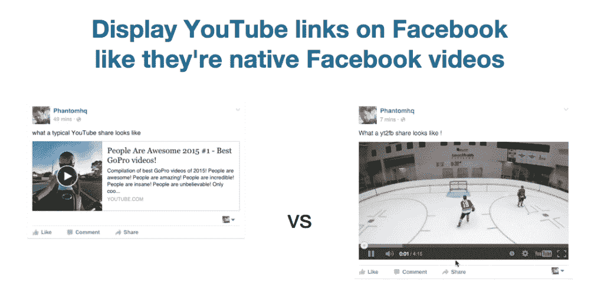

# 金斯塔·金并:采访 FlowPress 的巴特·达贝克

> 原文：<https://kinsta.com/blog/interview-with-bart-dabek/>

Q1:你有什么背景，你是如何加入 WordPress 的？

我在谢里丹学院学习，一直想成为一名电脑动画师，然而当我毕业时，市场上充斥着动画师。我在加拿大多伦多的一家初创公司做动画工作。我们在 2000 年就为酒店行业制作了在线视频，远远早于 YouTube。我的工作最终让我进入了 JavaScript 开发领域。

我第一次使用 WordPress 是在我想开一个名为 AboutMyPlanet.com 的博客的时候。无论是从内容管理的角度，还是从我的开发者需求来看，WordPress 都感觉不错。

最终，我开办了自己的 WordPress 公司，生意非常好。然后，我们与本·福克斯经营的另一家 WordPress 代理公司合并。我们在 2013 年成立了 FlowPress Inc .，这是我们着手建立 [Sidekick](http://www.sidekick.pro) 培训平台的时候，在这里我们继续为各种企业级客户运行 [WordPress DevOps](https://kinsta.com/blog/wordpress-devops/) 。

Q2:有很多关于你和本·福克斯合作的新项目 YT2FB 的传言。那是怎么发生的？

[YouTube 到脸书](http://yt2fb.com/)这个想法是由我们的首席开发人员之一 Mario Dabek 提出的。他看到了改善脸书 YouTube 观看体验的机会。脸书使得 YouTube 视频嵌入体验不如脸书本地视频。

它做得很好。它在第一个月就有超过 500 万的浏览量，我们对此感到非常自豪。

**Q3:寻找产品的体验如何？**

这是在合适的观众面前展示你的产品的一个很好的平台。我们在[产品搜寻](https://www.producthunt.com/)中取得了巨大的成功和反馈。第一次我们创造了 1000 多条线索，并在 Sidekick 周围引起了相当大的反响。

什么样的客户适合你的公司 FlowPress？

我们寻找运行 WordPress 的企业级客户。我总是开玩笑说我们喜欢噩梦项目。我们希望能够参与进来，为客户的 WordPress 基础设施带来巨大的改变。我们的工作时间非常紧，客户需要我们优化他们的 WordPress 版本。这可以从完全重建到 WordPress 审计…都集中在性能和 WordPress 标准上。

问题 5:为什么有人会选择 FlowPress 而不是另一家 WP 公司？

我们正在寻找那些[理解开发者运营需求](https://kinsta.com/blog/wordpress-devops/)的客户。了解[业绩对其业务底线意味着什么的客户](https://kinsta.com/learn/page-speed/#section2)。我们正在寻找长期的合作关系，我们会帮助你运行你的 WordPress 基础设施和一个不怕说不，但有理由说不的团队。

我们关注三个主要领域:性能、标准和流程。我们的目标一直是运行非常高性能的基于 WordPress 的网站。这意味着执行深入的审计，清楚地确定哪些方面需要修复或重建。这导致了编码标准的改进，无论是通过教育还是重构。最后，这意味着一个干净的过程，使事情运行更顺畅。我们将进入并实施清晰的流程，以改善日常技术任务。

**Q6:在 2016 年剩余时间里，您会参加任何会议/活动吗？T3】**

正如我们所说的，我们正在前往 PressNomics，这是与许多 WordPress 产品的创始人建立联系、发展和维护关系的最佳会议之一。除此之外，我确信我会参加多伦多的世界夏令营。你也可以[在推特](https://twitter.com/bartdabek)上关注我，了解我的日程安排。

**Q7:作为一名 CTO，你的工具箱里有什么？**

我的日常工具分为管理工具和编码工具。从管理的角度来看，我们使用 Teamwork.com、StoriesOnBoard.com、谷歌应用程序、& Slack。在开发端，我使用 Sublime，但切换到 Atom、Sequel Pro、SourceTree、Gulp、& WP-CLI。

Q8:你有哪一件事是大多数人不知道的，会让他们感到惊讶的？T3】

嗯，夏天我每天骑自行车去上班，到现在我已经被车撞了三次了…谢天谢地没有什么损坏:)

**Q9:多伦多的创业场景是怎样的？**

太棒了！自从我 2000 年搬到多伦多以来，这里一直有一个充满活力的科技创业社区。你可以每周参加很多科技聚会。你可以称多伦多为加拿大的硅谷。

如果你能遇到一位著名的企业家，你会选择谁？为什么？

埃隆·马斯克无疑是你能找到的最伟大的榜样之一。我爱他的动力，努力工作的精神，他愿意冒一切风险，让世界变得更美好。地球上这样的人不多。他可能早就退休了，但他是那种愿意为改善人类而不惜一切的人。

* * *

让你所有的[应用程序](https://kinsta.com/application-hosting/)、[数据库](https://kinsta.com/database-hosting/)和 [WordPress 网站](https://kinsta.com/wordpress-hosting/)在线并在一个屋檐下。我们功能丰富的高性能云平台包括:

*   在 MyKinsta 仪表盘中轻松设置和管理
*   24/7 专家支持
*   最好的谷歌云平台硬件和网络，由 Kubernetes 提供最大的可扩展性
*   面向速度和安全性的企业级 Cloudflare 集成
*   全球受众覆盖全球多达 35 个数据中心和 275 多个 pop

在第一个月使用托管的[应用程序或托管](https://kinsta.com/application-hosting/)的[数据库，您可以享受 20 美元的优惠，亲自测试一下。探索我们的](https://kinsta.com/database-hosting/)[计划](https://kinsta.com/plans/)或[与销售人员交谈](https://kinsta.com/contact-us/)以找到最适合您的方式。