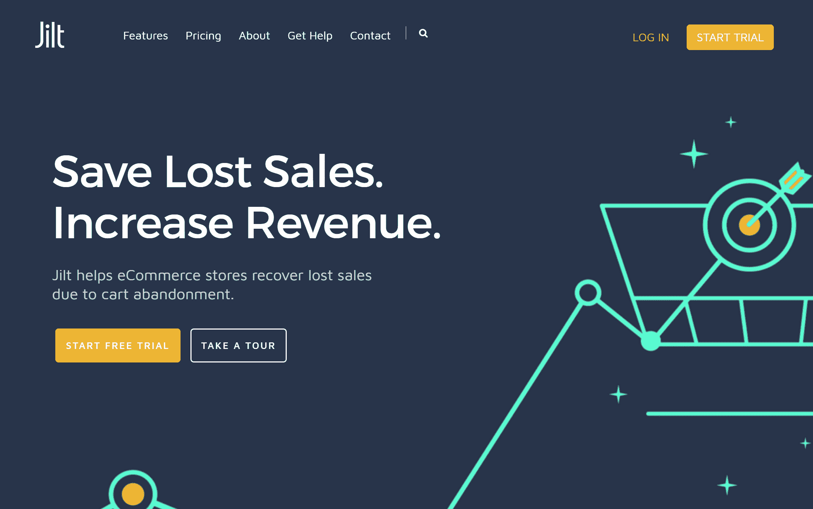

# 金斯塔·金并:采访贝卡·赖斯

> 原文：<https://kinsta.com/blog/interview-with-beka-rice/>

你可以在 [LinkedIn](https://www.linkedin.com/in/bekarice/) 或 [Twitter](https://twitter.com/Beka_Rice) 上找到贝卡。这是我们最近对她的采访，是我们[金斯塔·金并](https://kinsta.com/?post_type=post&s=kingpin)系列的一部分。

Q1:你的背景是什么，&你最初是如何加入 WordPress 的？

我的背景是化学而不是网络开发，所以我开始使用 WordPress 时是作为一个试图维护网站的用户，而不是作为一个开发人员或自由职业者。

我在大学的时候用过一点 WordPress，但是当我毕业的时候，我正在教高中化学，并且是大学垒球队的教练。我想有一种方式与我的班级共享资源，但学校网站和 [LMS 软件](https://kinsta.com/blog/wordpress-lms-plugins/)真的很麻烦而且不直观，所以我为我的两个班级建立了简单的网站，并分享关于我们垒球队的进展更新。

因为我知道如何使用 WordPress，[安装插件](https://kinsta.com/knowledgebase/how-to-install-wordpress-plugins/)和主题等。当我丈夫为 WordPress 构建插件时，他会让我测试、使用插件，并为插件编写用户文档。有一次，他和他的商业伙伴正在编写几个新的 WooCommerce 插件，做测试、文档和回答基本问题成了我的第二份全职工作，所以我选择离开教学岗位，转而用 WordPress 远程工作。

Q2:读者应该知道你最近在 WordPress 做了些什么？

如今，我在我们团队中的角色已经发生了相当大的变化:)虽然我可以修改一些小代码，但我学到了很多正确的软件开发知识。这些天来，我在 SkyVerge 领导我们 WooCommerce 插件的产品方向，为新插件设计 UI 和功能列表，根据我们的用户反馈整理产品路线图，偶尔还会通过修复漏洞或为插件添加新功能来解决问题。

[T2】](https://www.skyverge.com/)

作为一家公司，我们已经完成了一系列令人兴奋的项目，从完整的会员解决方案、履行集成、支付网关，到在线商店的礼券/优惠券生成器。

我们非常兴奋的一个新项目是甩，这是一个 WooCommerce，Easy Digital Downloads 和 [Shopify](https://kinsta.com/blog/shopify-alternatives/) 的应用程序，通过回收废弃的购物车，帮助商店[在 10 分钟内增加收入](https://kinsta.com/blog/ecommerce-strategies/) 20%。

[T2】](https://jilt.com/)

当我不做产品的时候，我喜欢在 SellwithWP.com 为商家写教程和建议，这是一家专注于用 WordPress 开店的公司。

在职业生涯中，你遇到过哪些挑战？

我开始在 SkyVerge 工作时，我们的团队只有创始人和我，因此学习大量的工作和技能具有挑战性，因为在最初的几年里，你每天做的事情可能不是 3 个月后你正在做的事情。关于组建团队，有很多技能需要学习，有很多东西需要发现，作为一名开发人员，我必须提高自己的技能，以便能够在我们的产品开发中承担更多的领导责任。

当你没有全职工作时，学习如何成为一名高效的远程工作者也是一个挑战，尤其是当你试图四处旅行/工作时，因为在没有专用工作空间的情况下，开始进入“工作心态”可能很难，这使得向“工作模式”的过渡更容易。

## 注册订阅时事通讯

### 想知道我们是怎么让流量增长超过 1000%的吗？

加入 20，000 多名获得我们每周时事通讯和内部消息的人的行列吧！

[Subscribe Now](#newsletter)

在 WordPress 的世界里，有什么让你感到惊讶的事情吗？

我所遇到的这个社区的人们是多么的慷慨。在过去的一年里，我一直在美国的各个城市旅行，几乎在每个城市，我都会在 WordPress 空间遇到和我一起工作或聊天(甚至是顺便)的人。

毫无疑问，由于我的工作，我遇到了一些最好的、最真诚的、乐于助人的人，他们总是愿意提供旅游或餐馆建议，或者一起吃顿饭，聊聊天。

你认为 WordPress 世界的未来会是怎样的？

我们在 SkyVerge 享受乘坐电子商务火箭船的乐趣，我们不打算很快离开:)我们热衷于为商家提供支持，这样他们就可以建立自己的业务，而不必花太多时间在商店上。

我们将继续在 WooCommerce 和 Easy Digital Downloads 平台上每天与商家合作，帮助他们在网上销售他们能想象到的任何东西。

你在 WordPress 主机中寻找什么？

这取决于我们是为自己还是为客户寻找主机:)对于我们的团队来说，我们非常重视获得高级的、开发人员友好的支持，以及获得我们需要的工具，例如 [WP-CLI](https://kinsta.com/blog/wp-cli/) 、 [SSH 访问](https://kinsta.com/blog/how-to-use-ssh/)、git 部署，并确保主机真正知识渊博并提供出色的服务。虽然我们喜欢在我们的站点上工作，但是我们不想维护服务器、[配置缓存](https://kinsta.com/blog/wordpress-caching-plugins/)，或者担心根级管理；我们需要一个合作伙伴来维护我们的网络基础设施。

对于客户或商家来说，我们非常关注他们将获得的支持，以及他们商店所需工具的易用性，例如暂存站点、 [SSL 证书安装](https://kinsta.com/blog/free-ssl-certificate/)和插件自动更新。

当你离开笔记本电脑时，你喜欢做什么？

我一直喜欢运动和户外活动，所以天气好的时候，我喜欢去远足或跑步。

我也喜欢大量阅读，弹吉他或钢琴(虽然不是很好)，偶尔周末去玩电子游戏。

问题 8:接下来我们应该采访谁&为什么？

选择太多了！我有几个最佳选择:

*   Brian Krogsgard (因帖子状态而出名)，这样他就可以扭转局面，成为被采访者:)但主要是因为他建立了一个了不起的专业人士社区和一个成功的电子商务业务/会员网站。
*   Prospress 的创始人布伦特·谢泼德(Brent Shepherd)——布伦特不仅是一名顶尖的开发人员，而且他对经营电子商务商店有着深刻的见解，将 WordPress 发挥到了极致，对电影也有着无可挑剔的品味。
*   托德·威尔肯斯(Todd Wilkens)几个月前成为 Automattic 的 WooCommerce 主管。他是从 Atlassian 进入 WordPress 领域的，所以他一定会对 WordPress 有一些有趣的观点，因为他曾经使用过很多不同类型的软件。

* * *

让你所有的[应用程序](https://kinsta.com/application-hosting/)、[数据库](https://kinsta.com/database-hosting/)和 [WordPress 网站](https://kinsta.com/wordpress-hosting/)在线并在一个屋檐下。我们功能丰富的高性能云平台包括:

*   在 MyKinsta 仪表盘中轻松设置和管理
*   24/7 专家支持
*   最好的谷歌云平台硬件和网络，由 Kubernetes 提供最大的可扩展性
*   面向速度和安全性的企业级 Cloudflare 集成
*   全球受众覆盖全球多达 35 个数据中心和 275 多个 pop

在第一个月使用托管的[应用程序或托管](https://kinsta.com/application-hosting/)的[数据库，您可以享受 20 美元的优惠，亲自测试一下。探索我们的](https://kinsta.com/database-hosting/)[计划](https://kinsta.com/plans/)或[与销售人员交谈](https://kinsta.com/contact-us/)以找到最适合您的方式。