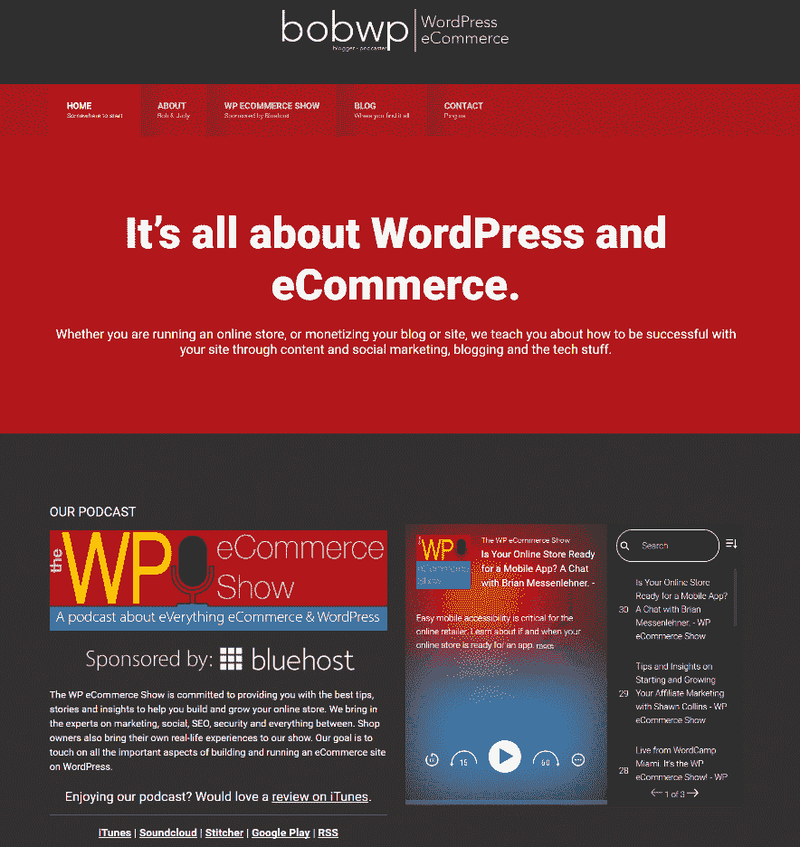
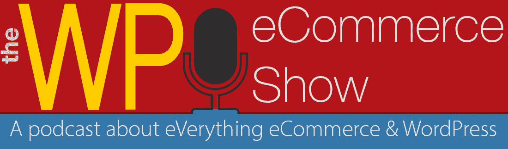

# 金斯塔·金并:BobWP 访谈

> 原文：<https://kinsta.com/blog/interview-with-bobwp/>

你可以在 [LinkedIn](https://www.linkedin.com/in/bobwp/) 或 [Twitter](https://twitter.com/bobWP) 上找到鲍勃。这是我们最近对他的采访，作为我们[金斯塔·金并](https://kinsta.com/?post_type=post&s=kingpin)系列的一部分。

### Q1:你的背景是什么，你是如何开始使用 WordPress 的？

嗯，我想这取决于你想让我追溯到多久以前。我在 20 世纪 90 年代中期开始从事自由平面设计。之后不久，我们开设了第一家公司，猫眼营销，帮助中小型企业进行品牌推广、营销、设计和文案撰写。我们这样做了将近 17 年。2007 年，在努力将我们的触角延伸到网页设计领域后，我开始寻找一个更简单的解决方案。那是我发现 WordPress 的一年。到 2008 年，我们用它来建立客户网站，到 2010 年，我们完全转向 WordPress，放弃了所有的打印客户。那一年，我开始了 BobWP，最初，我做了很多指导、培训，是的，甚至是支持。

BobWP current WordPress site

### Q2:读者应该知道你最近在 WordPress 做了些什么？

现在的焦点是我们的博客和播客。我们有大量过去 7 年的档案，可以帮助人们处理 WordPress 的几乎每个方面。在过去的一年里，我们更多地转向了 WordPress 和电子商务，这也是我们的播客 WP 电子商务秀的来源。

the WP eCommerce show podcast

### Q3:在职业生涯中，你遇到了哪些挑战？

我相信任何和我一样长时间在游戏中的人都可以列出一长串的挑战。如果你没有很多，那一定意味着你要么没有成长，没有适应时代，要么没有认真对待你的生意。我想，如果我要选择一个的话，销售方面的东西不是我的强项，在我的职业生涯中我一直面临着这个挑战。

[If you don't have challenges, you're either not growing, adapting, or taking your #business seriously.Click to Tweet](https://twitter.com/intent/tweet?url=https%3A%2F%2Fkinsta.com%2Fblog%2Finterview-with-bobwp%2F&via=kinsta&text=If+you+don%27t+have+challenges%2C+you%27re+either+not+growing%2C+adapting%2C+or+taking+your+%23business+seriously.)

### 在 WordPress 的世界里，有没有什么让你感到惊讶的事情？

没什么。再说一次，身处商界，参与过不同的商业社区，参加过商会和许多其他“标准”的商业活动，很难对任何事情感到惊讶。我知道很多人认为 WordPress 世界或者社区是非常特别的。从某种意义上来说，的确如此。但与此同时，它与其他商业社区并无不同，因为它有自己的挑战、自我和政治。

## 注册订阅时事通讯

### 想知道我们是怎么让流量增长超过 1000%的吗？

加入 20，000 多名获得我们每周时事通讯和内部消息的人的行列吧！

[Subscribe Now](#newsletter)

### Q5:你认为 WordPress 世界的未来会是怎样的？

我是一个适应性强、灵活的人，所以我很难预测我和 WordPress 的关系在一年 后 ，三年甚至更久。我想我会以这样或那样的方式继续存在一段时间。

### 你在 WordPress 主机中寻找什么？

就我个人而言，我寻求速度和支持。而不仅仅是接受性支持。我必须聊天。门票不适合我，我也不是打电话的人。当然，随着其他元素的到位，这些年来我已经使用了相当多不同的主机。另外，我的建议是，如果有人第一次寻找主持人，或者考虑更换主持人，不要在脸书小组中寻求建议，因为那只会让你更加困惑。找一个你认识并信任的人，你可以亲自问问他，或者，凭直觉行事。

### 问题 7:当你离开笔记本电脑时，你喜欢做什么？

首先，我是一个狂热的读者。我爱我的书。给我任何虚构的东西，典型的犯罪，神秘，有时是恐怖，如果更多的是心理方面的东西。还有，我是老电影的忠实粉丝，我指的是老经典。阿尔弗雷德·希区柯克的东西。几乎任何有汉弗莱·鲍嘉、加里·格兰特、凯瑟琳·赫本、詹姆斯·贾克内、罗伊·米兰德等明星出演的电影。但我的口味是非常折中的，因为我也喜欢喜剧片，如克里斯托弗·盖斯的电影和史蒂夫·马丁、伍迪·艾伦的电影等。

### 问题 8:接下来我们应该采访谁&为什么？

哇，我能列出 30 个人吗？不，但是说真的，我突然想到？帕特里克·劳兰。我认识 Patrick 已经有一段时间了，我们甚至计划在不久的将来一起做一些很酷的事情。他是一个聪明、创新的家伙。他知道 WordPress 和电子商务。我有没有提到他是个聪明创新的家伙？

* * *

让你所有的[应用程序](https://kinsta.com/application-hosting/)、[数据库](https://kinsta.com/database-hosting/)和 [WordPress 网站](https://kinsta.com/wordpress-hosting/)在线并在一个屋檐下。我们功能丰富的高性能云平台包括:

*   在 MyKinsta 仪表盘中轻松设置和管理
*   24/7 专家支持
*   最好的谷歌云平台硬件和网络，由 Kubernetes 提供最大的可扩展性
*   面向速度和安全性的企业级 Cloudflare 集成
*   全球受众覆盖全球多达 35 个数据中心和 275 多个 pop

在第一个月使用托管的[应用程序或托管](https://kinsta.com/application-hosting/)的[数据库，您可以享受 20 美元的优惠，亲自测试一下。探索我们的](https://kinsta.com/database-hosting/)[计划](https://kinsta.com/plans/)或[与销售人员交谈](https://kinsta.com/contact-us/)以找到最适合您的方式。