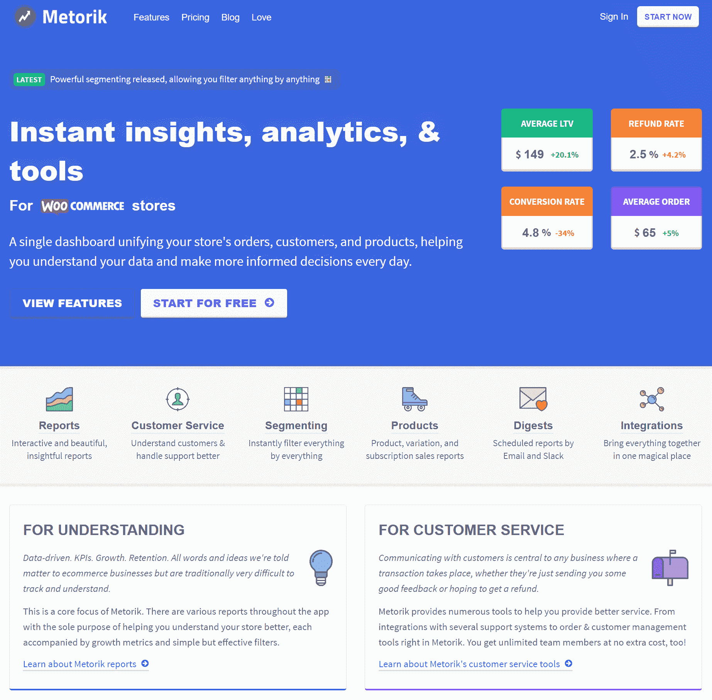
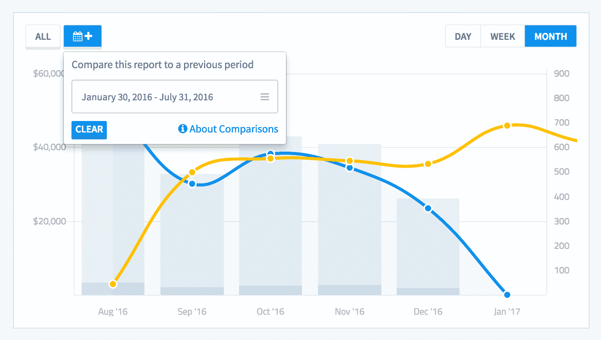

# 金斯塔·金并:布莱斯·亚当斯访谈

> 原文：<https://kinsta.com/blog/interview-with-bryce-adams/>

你可以在 LinkedIn 或 T2 的 Twitter 上找到布莱斯。这是我们最近对他的采访，作为我们[金斯塔·金并](https://kinsta.com/?post_type=post&s=kingpin)系列的一部分。

### Q1:你的背景是什么，你是如何开始使用 WordPress 的？

像 WordPress 领域的大多数人一样，我最初是通过为自己和周围的朋友建立简单的博客和网站而进入这个领域的。我一直都知道 WooThemes，所以当我看到他们关于 WooCommerce 支持团队空缺职位的推文时，我抓住了申请的机会，谢天谢地，我得到了这份工作！从那以后，我转到了一个开发人员的位置，最终在 Automattic 公司收购了我们之后，我加入了这家公司。从那以后，我就离开了，去追求和打造我自己的产品 [Metorik](https://metorik.com) 。

Metorik website

### Q2:读者应该知道你最近在 WordPress 做了些什么？

这些天我 100%专注于我自己的产品，Metorik，这是一个 WooCommerce 的报告和管理工具(很快[其他电子商务平台](https://kinsta.com/blog/ecommerce-platforms/))。这是一项利用 WordPress&woo commerce API 提供令人惊叹的用户体验的服务，这是插件无法做到的。

WooCommerce reporting

### Q3:在职业生涯中，你遇到了哪些挑战？

老实说，我认为我过得很轻松，对此我非常感激。我来自澳大利亚，英语是我的第一语言，在 WordPress 领域找到一份工作并不困难。我认为从支持职位过渡到开发职位是一个挑战，当然放弃一切从零开始追求自己的产品是一个挑战，但我仍然觉得我比大多数人更容易一些。

### 在 WordPress 的世界里，有没有什么让你感到惊讶的事情？

可能只是接受每个人的程度。当然，我曾经在 WordPress 行业最大的两家公司工作过(WooThemes & Automattic ),所以我认为这让我更容易在早期结识新朋友。尽管如此，与其他社区相比，WordPress 非常欢迎外来者。

## 注册订阅时事通讯

### 想知道我们是怎么让流量增长超过 1000%的吗？

加入 20，000 多名获得我们每周时事通讯和内部消息的人的行列吧！

[Subscribe Now](#newsletter)

在过去的几年里，我很幸运地在尼泊尔、印度、泰国、日本和其他国家参加了很多亚洲的单词营和 WordPress 聚会。那里的社区之大和参与度之高总是让我感到惊讶。我不知道有多少其他的软件生态系统像 WordPress 一样具有国际影响力。

### Q5:你认为 WordPress 世界的未来会是怎样的？

我的产品 Metorik 不像 WordPress 领域的许多产品，因为它是一项服务而不是插件。我非常相信 WordPress 的未来不会是在 zip 文件中，并且展望未来，服务将在 WordPress 生态系统中扮演重要角色，补充和支持插件,提供根本不存在于插件中的功能。Jetpack 实际上是我认为 WordPress 产品空间发展方向的一个很好的例子，它提供的许多服务是通过 WordPress.com 作为服务[完成的，而不是直接在插件中。](https://kinsta.com/blog/wordpress-com-vs-wordpress-org/)

[The future of #WordPress is not in a zip file. Services will play a big part in the ecosystem...Click to Tweet](https://twitter.com/intent/tweet?url=https%3A%2F%2Fbit.ly%2F2txAO7T&via=kinsta&text=The+future+of+%23WordPress+is+not+in+a+zip+file.+Services+will+play+a+big+part+in+the+ecosystem...)

### 你在 WordPress 主机中寻找什么？

良好的安全性、速度和简单性。客户服务也很重要。此外，我更喜欢那些不会过多“破坏”客户网站的主机。我见过一些主机在他们托管的网站上屏蔽 WordPress API，这最终伤害了他们的客户和像我一样的服务，因为客户需要联系主机来“解除屏蔽”。WordPress 因其为用户提供的自由而广受欢迎，我认为主机需要效仿。

### 问题 7:当你离开笔记本电脑时，你喜欢做什么？

收集和听唱片，旅游，偶尔园艺:)

### 问题 8:接下来我们应该采访谁&为什么？

我的朋友 Patrick Garman 正在 WordPress & WooCommerce 空间做一些超级酷的东西。我还推荐与[新一](https://twitter.com/shinichiN)和乔聊天，他们都是我在曼谷结识的朋友，都在开发令人惊叹的 WordPress 相关产品。

* * *

让你所有的[应用程序](https://kinsta.com/application-hosting/)、[数据库](https://kinsta.com/database-hosting/)和 [WordPress 网站](https://kinsta.com/wordpress-hosting/)在线并在一个屋檐下。我们功能丰富的高性能云平台包括:

*   在 MyKinsta 仪表盘中轻松设置和管理
*   24/7 专家支持
*   最好的谷歌云平台硬件和网络，由 Kubernetes 提供最大的可扩展性
*   面向速度和安全性的企业级 Cloudflare 集成
*   全球受众覆盖全球多达 35 个数据中心和 275 多个 pop

在第一个月使用托管的[应用程序或托管](https://kinsta.com/application-hosting/)的[数据库，您可以享受 20 美元的优惠，亲自测试一下。探索我们的](https://kinsta.com/database-hosting/)[计划](https://kinsta.com/plans/)或[与销售人员交谈](https://kinsta.com/contact-us/)以找到最适合您的方式。