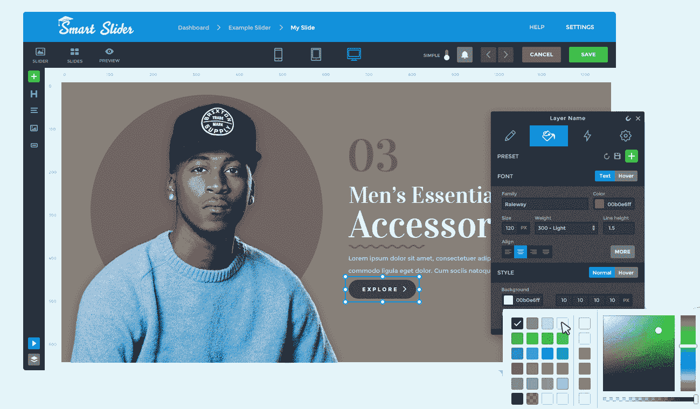
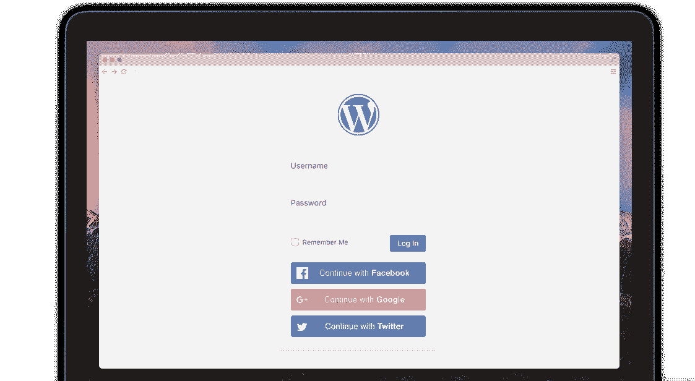

# 金斯塔·金并:丹尼尔·大卫访谈

> 原文：<https://kinsta.com/blog/interview-with-daniel-david/>

丹尼尔·大卫是 Nextendweb 的联合创始人，也是其插件的设计者，这些插件为全球超过 60 万个网站提供动力。

这是丹尼尔的社交账户，尽管他在那里并不活跃:LinkedIn 和 T2 Twitter。

如果你喜欢采访，请务必查看我们的[金斯塔·金并](https://kinsta.com/?post_type=post&s=kingpin)系列了解更多！

### Q1:你的背景是什么，你是如何开始使用 WordPress 的？

首先，来自匈牙利的问候给所有的 Kinsta 读者！👋

总结一下，8 年前我毕业于软件工程专业，2008 年左右，我想象自己是一名前端开发人员。但是当我在大学的时候，我爱上了设计。

我们公司的旅程始于第一学期，当时我遇到了 Nextendweb 的另一位联合创始人 Roland。他是绝对的编码天才，真正的全栈开发者独角兽。我们立刻意识到，我们应该一起创造一些令人敬畏的东西。

我第一次接触 WordPress 是在 2009 年左右，当时我在暑假期间为当地企业制作了几个简单的网站。三年后，我们成立了自己的公司，开始开发 Joomla 扩展，后来又开发了 WordPress 插件。今天，Nextendweb 已经 7 岁了，毫无疑问，WordPress 现在是我们的主要平台。老实说，那时我无法想象我在这次旅程中经历的成功、恐惧、感激和怀疑。

### Q2:读者应该知道你最近在 WordPress 做了些什么？

我们仍然是一个只有 6 个人的小公司，但我们的愿景从一开始就没有改变:交付具有世界级支持的优秀软件。在我们的团队中，我是设计师，但我负责我们的营销、内容战略，我还处理公司的行政任务。这种多样性让我的日子与众不同，也许这就是我热爱我的工作的原因。

我日复一日做什么真的很难回答，大多是产品和 UI 设计。简而言之:在 Nextend，我让事情看起来和工作起来都很酷。我们有两个插件，读者可能知道:

我们的旗舰产品是[智能滑块 3](https://smartslider3.com/) ，它更像一个可视化构建工具，而不是一个简单的[滑块插件](https://kinsta.com/blog/wordpress-slider/)。你可以创建漂亮的滑块、方块、旋转木马甚至页面。该编辑器允许您通过简单的拖放操作进行设计，并直观地操作您的设计。

我们有一个[滑块库](https://smartslider3.com/sample-sliders/)，里面有 100 多个预设计的模板，从产品传送带和英雄模块到视差页面和层滑块，应有尽有。我建议您查看一下这些模板，这样您就可以感受一下您可以用它来构建什么。

此外，Smart Slider 3 在 WordPress.org 获得了超过 600 条评论和超过 400，000 次活跃安装的 4.9 星评级。它的增长速度超过了官方插件库中所有其他的免费滑动插件。

Smart Slider 3

我们的最新产品， [Nextend Social Login](https://nextendweb.com/social-login/) 是一个非常简单和轻量级的插件，允许您的用户通过他们喜欢的社交账户登录。它易于设置，并且在您的登录页面上开箱即用。添加您的网站根本不需要时间，一旦它启动并运行，您的用户将立即享受到好处。很快我们的登录插件将达到 200，000 个活跃安装，我们对这个结果非常满意。

## 注册订阅时事通讯

### 想知道我们是怎么让流量增长超过 1000%的吗？

加入 20，000 多名获得我们每周时事通讯和内部消息的人的行列吧！

[Subscribe Now](#newsletter)

Social Login WordPress plugin

### Q3:在职业生涯中，你遇到了哪些挑战？

我们和罗兰在一个小公寓里开始了我们的事业。上午我们处理支持请求，下午我们尝试实现新的特性和错误修复。那时候我们没有睡太多。这是我生活中非常艰难但有趣的一部分。7 年后，我们面临着完全不同的挑战，如项目管理、营销或在团队中招聘合适的人员。我真的很喜欢这些新的挑战，因为它让我走出了自己的舒适区。

### 在 WordPress 的世界里，有没有什么让你感到惊讶的事情？

是的，三件事。首先是合作医疗的发展。核心开发人员年复一年地推出出色的功能和更新，这真的很神奇。其次，主题、插件和服务的巨大可能性。毫无疑问，WordPress 拥有最大的第三方开发者社区，这在 WordPress 目前的状态中发挥了巨大的作用。最后但同样重要的是，初学者的用户体验是独一无二的。整个网站编辑过程对最终客户来说是最容易的。

[WordPress has undoubtedly the biggest third-party developer community and this plays a key role in WordPress’ current adoption rate. 🙌 - @dvddnlClick to Tweet](https://twitter.com/intent/tweet?url=https%3A%2F%2Fkinsta.com%2Fblog%2Finterview-with-daniel-david%2F&via=kinsta&text=WordPress+has+undoubtedly+the+biggest+third-party+developer+community+and+this+plays+a+key+role+in+WordPress%E2%80%99+current+adoption+rate.+%F0%9F%99%8C+-+%40dvddnl&hashtags=WordPress%2Centrepreneurship)

### Q5:你认为 WordPress 世界的未来会是怎样的？

WordPress 行业现在比以前复杂多了。很多人以不同的方式从 WordPress 谋生。今天，一个好的产品不足以取得成功。你必须非常擅长支持、营销、沟通和高质量的内容发布。

无论是发布新插件，更新现有插件，还是发布新视频，我们总是在寻找方法让它变得更好。除此之外，我们正在为 Smart Slider 3 做一些大的事情。我是说，真的很大，我等不及要分享了。

### 你在 WordPress 主机中寻找什么？

对我来说，最重要的是页面速度和服务器的正常运行时间。此外，我寻找一个安全的、维护良好的、有良好客户支持的服务器。此外，我真的很喜欢监控我们网站的性能，我想知道是否有任何问题。

### 问题 7:当你离开笔记本电脑时，你喜欢做什么？

在我完成我的日常工作后，我去体育馆做一些锻炼。如果我满脑子都是想法和任务，没有什么比举重更好的了。如果我有一点时间，我会尝试阅读或观看我清单上的一些东西，科幻书籍和系列绝对是我的最爱。但是如果我真的想在工作日休息的话，我通常会玩电子游戏。在周末，我所有的时间都和我的妻子在一起，我们试着去看我们的朋友、家人或者做一些户外活动。

### 问题 8:接下来我们应该采访谁&为什么？

我觉得你应该采访一下 Nick Roach，优雅主题的创始人。迪维周围有一个很大的嗡嗡声多年来，可能你的访客会发现阅读尼克的答案很有趣。在我看来，他们的沟通和设计在 WordPress 的世界里确实是出类拔萃的。

* * *

让你所有的[应用程序](https://kinsta.com/application-hosting/)、[数据库](https://kinsta.com/database-hosting/)和 [WordPress 网站](https://kinsta.com/wordpress-hosting/)在线并在一个屋檐下。我们功能丰富的高性能云平台包括:

*   在 MyKinsta 仪表盘中轻松设置和管理
*   24/7 专家支持
*   最好的谷歌云平台硬件和网络，由 Kubernetes 提供最大的可扩展性
*   面向速度和安全性的企业级 Cloudflare 集成
*   全球受众覆盖全球多达 35 个数据中心和 275 多个 pop

在第一个月使用托管的[应用程序或托管](https://kinsta.com/application-hosting/)的[数据库，您可以享受 20 美元的优惠，亲自测试一下。探索我们的](https://kinsta.com/database-hosting/)[计划](https://kinsta.com/plans/)或[与销售人员交谈](https://kinsta.com/contact-us/)以找到最适合您的方式。