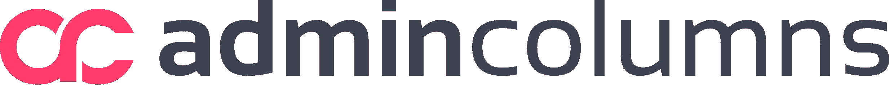
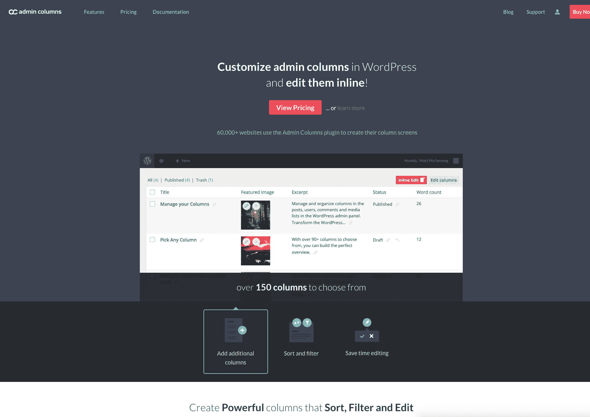
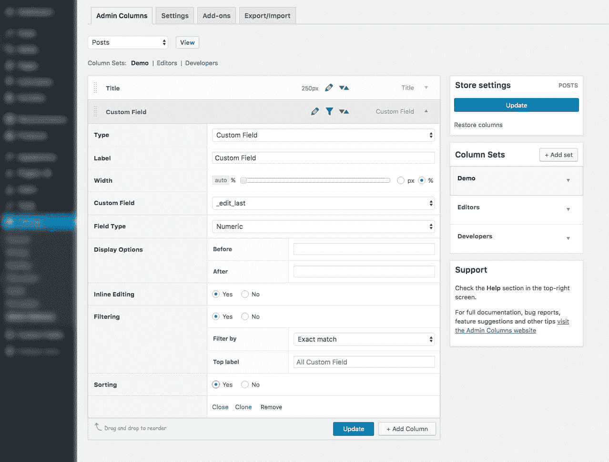

# 金斯塔·金并:大卫·莫斯特德访谈

> 原文：<https://kinsta.com/blog/interview-with-david-mosterd/>

你可以在 LinkedIn 或 T2 的 Twitter 上找到大卫。这是我们最近对他的采访，作为我们[金斯塔·金并](https://kinsta.com/?post_type=post&s=kingpin)系列的一部分。

Q1:你的背景是什么，&你最初是如何加入 WordPress 的？

我从 17 岁起就喜欢上了网络。很久以前，当 56K 调制解调器、网景和 AltaVista 流行的时候。用代码创造东西的能力是如此迷人。毕业、结婚、当爸爸后，我找了一份工作，做了两个月。那是我意识到为一家公司工作不是我的事情所需要的全部时间。所以我开始做自由职业者，觉得自己想专攻某个东西。当 WordPress 2.7 发布时，我被 WordPress 的外观和用它管理网站的简单性所吸引。我决定只专注于 WordPress 和 WordPress。那时候没有现在这么明显的选择。

我的一个朋友正在寻找一种按自己的方式工作的方法。我们决定合作，每周建立一两个 WordPress 网站，每个网站的费用高达 400 美元。我们专攻编码，并开始与需要 WordPress 专家的优秀设计师和机构合作。在某个时候，我们为我们的一个客户编写了一个管理栏目的解决方案，并将它提交到 WordPress 知识库中；只是因为你可以，我们希望帮助别人。那是在 2011 年的某个时候，不知何故，开发最好的 WordPress 插件成了我们的全职工作。顺便说一句，这是一件很棒的事情。

Q2:关于 Codepress，&管理专栏，读者应该知道些什么？

目前，我们的产品“是”我们的公司。我们大部分时间都是这么做的。我们制作了[管理专栏](https://www.admincolumns.com/)给用户更好的管理体验。我们一直在改进代码和界面，目前正在开发新的功能。我们关心人们对我们的看法以及他们如何使用我们的产品。当有人提出建议时，我们会认真倾听，看看是否合适。最近，我们做了一项调查，[在网上公布了调查结果](https://www.admincolumns.com/blog/survey-2016/)，同时公布了一项计划，所有这些反馈将在何时以及如何整合到管理专栏中。我们来自荷兰，这当然也很酷；)

[T2】](https://www.admincolumns.com/)

**Q3:你在创业过程中遇到了哪些挑战？**

我们最大的挑战是(现在仍然有一点)迈出这一步，开始做你最热爱的事情。我们为客户工作已经有一段时间了。这带来了稳定的收入流，而且做起来很有趣。然而，我们真正的梦想是做一些可扩展的东西，而不仅仅是帮助一个客户。它必须对整个 WordPress 社区有益。很难开始对吸引人的项目说“不”来应用 focus。但最终我们还是做到了。我们开始说“不”，接受了一段时间的低收入，并把管理专栏做得非常好。

**Q4:在成长的过程中有没有什么让你惊喜的事情？**

总是有 x 功能或 y 功能或其他改进。当你为客户做一个项目时，通常会有一个自然的结局。完成了，项目交付了。但是当你有一个插件被成千上万的人使用时，想法和改进的潮流就不会停止。这也是一个真正的陷阱，因为你会喜欢将所有这些想法构建到管理专栏中，并使它变得更好。

## 注册订阅时事通讯

### 想知道我们是怎么让流量增长超过 1000%的吗？

加入 20，000 多名获得我们每周时事通讯和内部消息的人的行列吧！

[Subscribe Now](#newsletter)

你和你的公司的未来是什么样的？

我认为明年将主要是关于管理专栏。产品非常成熟；但是由于它可以很好地与任何添加自定义数据到你的站点的插件一起工作，我们将为这些插件编写集成。我们有一些其他的插件或服务的想法，我们很乐意开发。因此，在可预见的未来，我们将创建非常酷的 WordPress 插件，帮助你更好地管理你的内容。

问 6:你在托管的 WordPress 主机中寻找什么？

我不会讨论像安全、备份、速度和自动更新 WordPress 这样显而易见的方面。他们应该做得很好，否则不要称自己为托管 WordPress 主机。

说你客户的语言，满足他们的需求。我喜欢能够对我的客户说:选择主机，他们会照顾一切。但是作为一名开发人员，我可能有不同的需求，比如外部 MySQL 访问或者 Git 集成。一个托管的 WordPress 主机应该让那些选项对于不需要的人来说几乎看不见，但是对于需要的人来说容易使用。这样，代理商、开发者和客户都可以使用同一个主机，并出于不同的原因欣赏它。

我发现非常重要的一点是“正常运行时间”的沟通。许多主机仍然使用我认为已经过时的正常运行时间的定义。他们只关心构建平台的基础设施。但是从客户的角度来看，“正常运行时间”要宽泛得多。主页显示类似 500 或 404 的 [HTTP 错误，SSL 证书过期，日志充满致命错误；所有的事情，主机可能能够写启发，通知用户一些奇怪的事情可能会发生在他们的网站上。换句话说:让你安心。](https://kinsta.com/blog/500-internal-server-error/)

最后但同样重要的是:当出现问题时，试着从客户的角度看问题。有些客户不属于你的公司，但是客户可以暴露你服务中的漏洞。一定要留意那些花时间和精力来报告事情的客户。

当你离开电脑时，你喜欢做什么？

我喜欢在树林里跑步，游泳，旅游，看书，和家人或朋友出去玩。排名不分先后。我做的和我想的一样多吗？差远了。我有三个正在成长的小孩；所以接下来的三年睡眠很可能会取代列表中的大部分内容:)

接下来我们应该采访谁，为什么？

《美味大脑》中的布拉德·图斯纳德或[伊恩·鲍尔森](https://twitter.com/polevaultweb)。这些家伙有很多关于 WordPress 编码、创建插件和事件的知识。最棒的是，他们会详细地分享给每个人。非常有趣的东西。他们最出名的是 Migrate DB，一个帮助你轻松地在 WordPress 安装之间迁移内容的插件。

* * *

让你所有的[应用程序](https://kinsta.com/application-hosting/)、[数据库](https://kinsta.com/database-hosting/)和 [WordPress 网站](https://kinsta.com/wordpress-hosting/)在线并在一个屋檐下。我们功能丰富的高性能云平台包括:

*   在 MyKinsta 仪表盘中轻松设置和管理
*   24/7 专家支持
*   最好的谷歌云平台硬件和网络，由 Kubernetes 提供最大的可扩展性
*   面向速度和安全性的企业级 Cloudflare 集成
*   全球受众覆盖全球多达 35 个数据中心和 275 多个 pop

在第一个月使用托管的[应用程序或托管](https://kinsta.com/application-hosting/)的[数据库，您可以享受 20 美元的优惠，亲自测试一下。探索我们的](https://kinsta.com/database-hosting/)[计划](https://kinsta.com/plans/)或[与销售人员交谈](https://kinsta.com/contact-us/)以找到最适合您的方式。