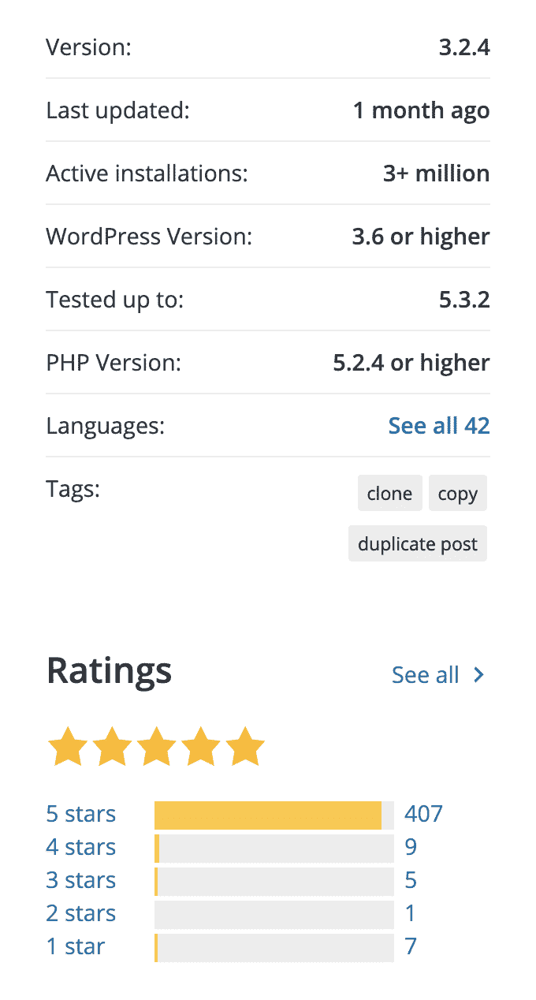
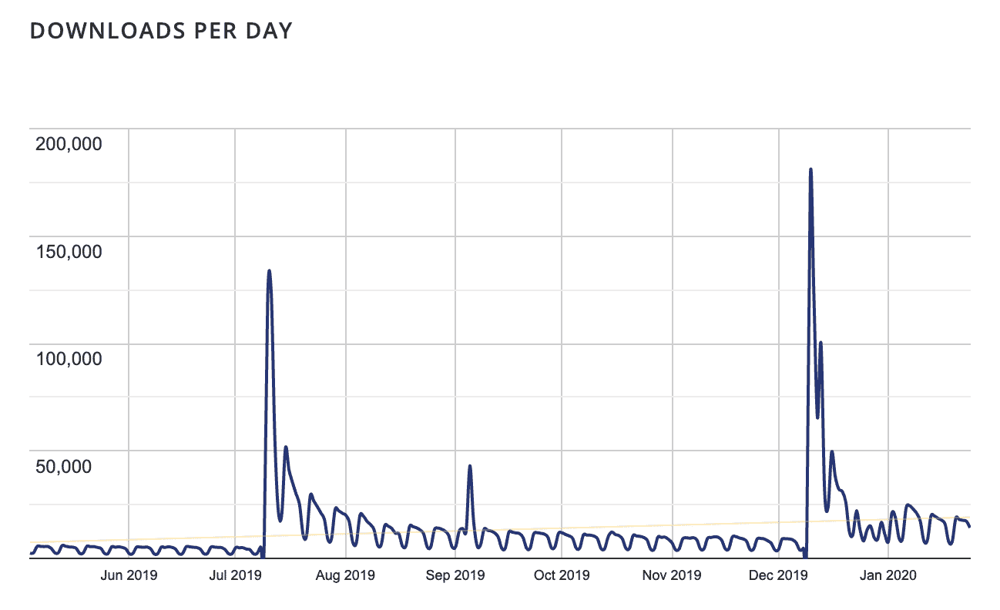

# 金斯塔·金并:采访恩里科·巴托奇

> 原文：<https://kinsta.com/blog/interview-with-enrico-battocchi/>

Enrico Battocchi(又名 [Lopo](https://profiles.wordpress.org/lopo/) )是意大利托斯卡纳的一名自由职业者，在 WordPress 社区以插件开发者和 WordPress 演讲者而闻名。

Enrico 是 [Duplicate Posts](https://wordpress.org/plugins/duplicate-post/) 的幕后黑手，这是 WordPress.org 目录中下载量最大、评分最高的插件之一。

你可以在我们的知识库、[插件的伙伴网站](https://duplicate-post.lopo.it/)和 [Github](https://github.com/enricobattocchi/duplicate-post) 上了解更多关于[重复帖子的信息。](https://kinsta.com/knowledgebase/duplicate-page-post-wordpress/#duplicate-post-plugin)

你可以在推特上找到[恩里科。](https://twitter.com/lopo)

如果你喜欢采访，请务必查看我们的[金斯塔·金并系列](https://kinsta.com/?post_type=post&s=kingpin)了解更多！

[Check out our interview with the awesome @lopo, the guy behind Duplicate Posts plugin! Learn also how he's managing plugin development and user support! 👤👥Click to Tweet](https://twitter.com/intent/tweet?url=https%3A%2F%2Fkinsta.com%2Fblog%2Finterview-with-enrico-battocchi%2F&via=kinsta&text=Check+out+our+interview+with+the+awesome+%40lopo%2C+the+guy+behind+Duplicate+Posts+plugin%21+Learn+also+how+he%27s+managing+plugin+development+and+user+support%21+%F0%9F%91%A4%F0%9F%91%A5&hashtags=duplicateposts%2Cwordpressplugins)

The huge numbers of Duplicate Posts Stats

### Q1:你的背景是什么，你是如何开始使用 WordPress 的？

一开始，我使用 JavaServer Pages，但也使用前端技术，如 [JavaScript/HTML/CSS](https://kinsta.com/knowledgebase/edit-wordpress-code/) 。毕业后，我专注于网络技术(那是 2006/2007 年)，并以自由职业者的身份开始了网站开发。

那时我已经把 WordPress 视为网站建设最有前途的选择之一。事实证明，这个选项即使对于非技术用户来说也很容易使用。然后我开始了[插件开发](https://kinsta.com/blog/hire-wordpress-developer/)和为我的项目设计定制的 WordPress 解决方案。

### Q2:读者应该知道你最近在 WordPress 做了些什么？

嗯，在这段时间里，以及在过去的 12 年里，我主要关注的是[复制帖子](https://it.wordpress.org/plugins/duplicate-post/)插件，这是我用 WordPress 开发的第一批东西之一。这个想法来自一个客户，他需要克隆他网站上的现有文章。当时 WordPress 是 2.3 版本，所以我们这里说的是“考古”。

也没有自动插件安装，你必须下载。zip 包，然后[通过 FTP](https://kinsta.com/blog/best-ftp-clients/) 上传文件。

从那以后，我的插件在下载量、活跃安装量和评分方面越来越受欢迎。无论如何，我尽量保持简单，在代码和界面上都没有任何花哨的东西。

### Q3:在职业生涯中，你遇到了哪些挑战？

我职业生涯中最喜欢的一个方面是在小城市里窝那(托斯卡纳)做一名自由职业者。从专业和个人的角度来看，这都很好，但也有一些负面影响，例如感觉“置身于”真实的开发世界之外，并且您与通常规模较小、预算有限的客户或潜在客户打交道。

但我也参与了大客户的重要项目，如比萨高等师范学校和扎尼切利。

在商业世界发生的事情与在 WordPress 社区发生的事情非常相似。目前，我们在里窝那和周边地区没有当地的集会。这也是我喜欢参加所有可能在意大利和欧洲举办的单词营的原因之一。

花几天时间和各个领域的 WordPress 工作人员在一起，参加一些讲座，这些讲座有时是真正的速成课程，主题对你来说是部分或完全陌生的，这给你很多机会去了解与 WordPress 和整个生态系统相关的热门话题。

Duplicate Posts downloads per day

### 在 WordPress 的世界里，有没有什么让你感到惊讶的事情？

我对社区感到非常惊讶。我一直是[自由软件和开源](https://kinsta.com/blog/is-wordpress-free/)的爱好者。然而，在最受欢迎的社区中，比如 Linux 社区，演讲主要是针对拥有高级技术技能的人。

## 注册订阅时事通讯

### 想知道我们是怎么让流量增长超过 1000%的吗？

加入 20，000 多名获得我们每周时事通讯和内部消息的人的行列吧！

[Subscribe Now](#newsletter)

WordPress 的世界更加多样化。它由从勉强能管理一个网站的临时用户到高调的专业开发人员组成。

即使人们有不同的兴趣和观点，社区本身的力量是每个人都有相同的目标，不管差异如何。

每个人都想听和了解许多不同的事情。例如，作为一名开发人员，我非常喜欢听关于用户体验或图形设计的谈话，因为了解游戏中其他玩家的兴趣很重要，并学习新概念和更接近新的视角。

> Enrico Battocchi:我如何编写一个流行的插件做错了一切
> 在这里获取您的门票:[https://t.co/N89MhlzQSo](https://t.co/N89MhlzQSo)[# WCDublin](https://twitter.com/hashtag/WCDublin?src=hash&ref_src=twsrc%5Etfw)[# Plugins](https://twitter.com/hashtag/Plugins?src=hash&ref_src=twsrc%5Etfw)[@ lopo](https://twitter.com/lopo?ref_src=twsrc%5Etfw)[pic.twitter.com/dpA7XKDsjU](https://t.co/dpA7XKDsjU)
> 
> -都柏林的 word camp(@ word camp Dublin)[2019 年 9 月 27 日](https://twitter.com/WordCampDublin/status/1177493251202306048?ref_src=twsrc%5Etfw)