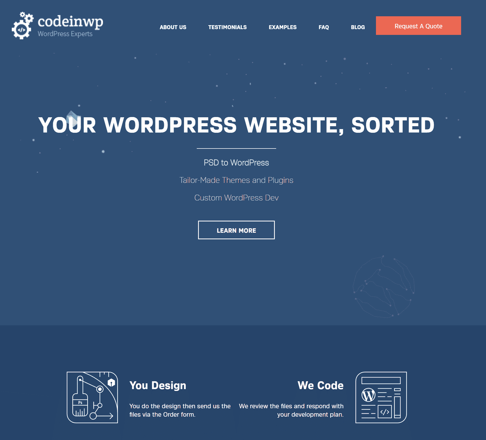

# 金斯塔·金并:约纳特·尼古访谈

> 原文：<https://kinsta.com/blog/interview-with-ionut-neagu/>

你可以在 LinkedIn 或者 T2 的 Twitter 上找到我的名字。这是我们最近对他的采访，作为我们[金斯塔·金并](https://kinsta.com/?post_type=post&s=kingpin)系列的一部分。

### Q1:你的背景是什么，你是如何开始使用 WordPress 的？

我有一个软件工程师的背景，然而，我一路走来了解到我有其他的激情和技能，所以我用我作为一名开发人员的自由职业收入开始了我的创业之旅。在我们获得了“PSD to WordPress”的良好排名后，我开始认真地参与 WordPress，我以前也做过一些事情，比如创建一些博客，但是没有那么认真。

### Q2:读者应该知道你最近在 WordPress 做了些什么？

我现在大部分时间都在思考/头脑风暴 WordPress，没有做太多其他事情，有时我在 codeinwp.com/blog/写一些关于 WordPress 的文章，或者在 T2 主题岛修改一些免费主题的代码。

[T2】](https://www.codeinwp.com/)

### Q3:在职业生涯中，你遇到了哪些挑战？

极度好奇意味着我在向他人学习方面也有问题，我的意思是大多数时候我更喜欢尝试一些事情，并按照我的想法去做，这通常意味着我会犯很多错误，这使我面临不同的挑战。对我来说，最大的挑战之一是开始创造一些“产品销售收入”，一旦你达到一定水平的经常性收入，它会给你很多精神自由来构建东西。

### 在 WordPress 的世界里，有没有什么让你感到惊讶的事情？

我从一个营销/SEO 世界中学到了很多关于同情、隐私和沟通的知识，在这个世界里，人们大多只吹嘘他们赚了多少钱，这对我来说有点令人震惊和难以适应，然而，这是一个我感觉更舒服的世界。

### Q5:你认为 WordPress 世界的未来会是怎样的？

对我来说，最大的收获是社区是如何工作的，我个人不确定 WP 社区的未来会是怎样，但是，我确信我会继续成为开源社区的一员。

### 你在 WordPress 主机中寻找什么？

我认为最重要的方面是承诺，我的意思是对我来说，一个托管公司就像一个医生，我不希望它做实验或失败，换句话说，我想了解每个网站有多重要。

[A #hosting company is like a doctor, I don't want it to do experiments or fail. @hackinglife7Click to Tweet](https://twitter.com/intent/tweet?url=https%3A%2F%2Fkinsta.com%2Fblog%2Finterview-with-ionut-neagu%2F&via=kinsta&text=A+%23hosting+company+is+like+a+doctor%2C+I+don%27t+want+it+to+do+experiments+or+fail.+%40hackinglife7)

### 问题 7:当你离开笔记本电脑时，你喜欢做什么？

我喜欢游泳、散步和旅游，所以我正在努力为所有这些活动找到足够的时间，我还在努力学习当我不在的时候如何更好地脱离工作，有时我发现这很难。

### 问题 8:接下来我们应该采访谁&为什么？

我总是喜欢阅读赛义德的见解，我相信你的读者也会喜欢，因为他有丰富的知识和理解力。

* * *

让你所有的[应用程序](https://kinsta.com/application-hosting/)、[数据库](https://kinsta.com/database-hosting/)和 [WordPress 网站](https://kinsta.com/wordpress-hosting/)在线并在一个屋檐下。我们功能丰富的高性能云平台包括:

*   在 MyKinsta 仪表盘中轻松设置和管理
*   24/7 专家支持
*   最好的谷歌云平台硬件和网络，由 Kubernetes 提供最大的可扩展性
*   面向速度和安全性的企业级 Cloudflare 集成
*   全球受众覆盖全球多达 35 个数据中心和 275 多个 pop

在第一个月使用托管的[应用程序或托管](https://kinsta.com/application-hosting/)的[数据库，您可以享受 20 美元的优惠，亲自测试一下。探索我们的](https://kinsta.com/database-hosting/)[计划](https://kinsta.com/plans/)或[与销售人员交谈](https://kinsta.com/contact-us/)以找到最适合您的方式。