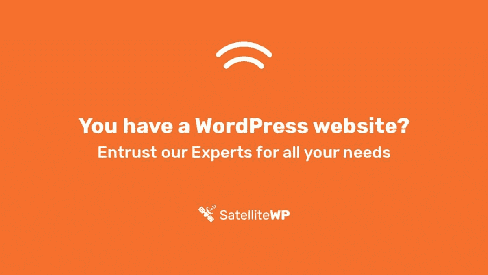

# 金斯塔·金并:采访让·弗朗索瓦·阿尔塞纳奥

> 原文：<https://kinsta.com/blog/interview-with-jean-francois-arseneault/>

jean-Fran ois Arseneault 在 2005 年发现了 WordPress，在尝试了许多不同的软件后，他决定选择 WordPress 来创建他的个人和专业网站。从那以后，他从未离开过这个 CMS，甚至推出了专门针对它的新服务，如[satellite ewp](https://www.satellitewp.com/)。

如果你喜欢采访，请务必查看我们的[金斯塔·金并](https://kinsta.com/?post_type=post&s=kingpin)系列了解更多！

[Check out our interview with the awesome @jfarsen, Co-Founder at @satellitewp and hear how WordPress changed his professional life!Click to Tweet](https://twitter.com/intent/tweet?url=https%3A%2F%2Fkinsta.com%2Fblog%2Finterview-with-jean-francois-arseneault%2F&via=kinsta&text=Check+out+our+interview+with+the+awesome+%40jfarsen%2C+Co-Founder+at+%40satellitewp+and+hear+how+WordPress+changed+his+professional+life%21&hashtags=wpmtl%2Cwppreneurs)

### Q1:你的背景是什么，你是如何开始使用 WordPress 的？

我记得在 2005 年 9 月发现 WordPress(版本 1.5.2，如果你想知道的话)，我知道这一点是因为我的[个人博客有一篇](https://arseneault.ca/2005/09/14/mambo-was-nice-but-its-over/)描述了我是如何远离曼波/ [Joomla](https://kinsta.com/blog/joomla-vs-wordpress/) 的。尽管当时我是 IBM 的一名员工，但我一直在尝试开源软件，因为我在软件部门工作。接下来的几年，我尝试了很多软件: [Drupal](https://kinsta.com/blog/wordpress-vs-drupal/) ，Xoops，Prestashop， [Magento](https://kinsta.com/magento-market-share/) ，wikis 等等。

我开始以咨询为副业，WordPress 的易用性和优雅的用户界面让我大吃一惊。几年后，当我开始咨询业务的时候，WordPress 成为我为客户建立网站的首选工具。

### Q2:读者应该知道你最近在 WordPress 做了些什么？

我已经靠 WordPress 谋生将近 10 年了。2017 年，我作为一个团队共同创立了 SatelliteWP，我们为 WordPress 网站所有者提供管理服务，并通过处理所有技术方面的问题，如[备份](https://kinsta.com/help/wordpress-backups/)、[更新](https://kinsta.com/blog/how-to-update-wordpress-theme/)、[安全](https://kinsta.com/blog/wordpress-security/)和[性能](https://kinsta.com/blog/third-party-performance/)，帮助他们专注于他们的业务。我在企业中身兼数职；前一天，我在做解决方案架构，以改善我们的平台和发展我们的业务，第二天，我在做前端工作和管理客户项目，以确保客户满意。但有一点是不变的，那就是我对社区的参与。

2010 年，我在蒙特利尔参加了我的第一次世界夏令营，每个参与者的友好让我深受鼓舞。从 2011 年开始，我在加拿大的各种单词营做志愿者和演讲。2017 年，我们还开始赞助各种与 WordPress 相关的活动，我参与了为整个 WordPress 生态系统以及 Beaver Builder 和 WP Rocket 等关键供应商改进对*法语的翻译。*

SatelliteWP, your WordPress experts.

### Q3:在职业生涯中，你遇到了哪些挑战？

这些年来我们发现的一个不变的事实是让客户明白运营一个网站存在着真正的风险，并且这种风险随着时间的推移而大大增加。毕竟，WordPress 是 CMS 的 MS Windows，随着受欢迎程度的提高，由于成千上万的插件和主题，入侵企图和潜在漏洞也在增加。因此，我们的工作变成了教育客户并提供威胁确实存在的证据，所有这些听起来都不像是危言耸听。

一个相关的挑战是，一旦客户信任我们，我们处理他们的网站的正常运行时间和安全性，没有任何不好的事情发生，然后客户可能会问“为什么我们付钱给你，没有任何不好的事情发生”，对此我们的回答是“是的”。因为我们在那里。”

## 注册订阅时事通讯

### 想知道我们是怎么让流量增长超过 1000%的吗？

加入 20，000 多名获得我们每周时事通讯和内部消息的人的行列吧！

[Subscribe Now](#newsletter)

### 在 WordPress 的世界里，有没有什么让你感到惊讶的事情？

来自一个企业背景，我第一次涉足单词营是大开眼界！我刚从公司工作中出来，开始了我的网络咨询业务……所有这些设计师和 WordPress 企业都在公开分享获得客户的技巧，提高我的技能，提供线索。没有竞争，只有专业人士分享和帮助我开始正确的道路，没有任何回报！

从那天起，我决定通过帮助有抱负的 web 开发人员、提供实习机会以及在多个论坛[上分享我的知识来回报这些。](https://kinsta.com/blog/wordpress-support/#forums-groups-and-channels)

### Q5:你认为 WordPress 世界的未来会是怎样的？

我相信 WordPress 的发展已经进入了一个新的周期，block editor ( [Gutenberg](https://kinsta.com/blog/wordpress-5-0/) )在 5.0 中的到来，以及它带来的所有新的可能性，以及其他开源项目的牵引，如 Drupal，一个即将到来的 Block Repository 和计划中的“Block ify”WordPress 后端的每个界面元素。

厌倦了你的 WordPress 站点缓慢的主机？我们提供超快的服务器和来自 WordPress 专家的 24/7 世界级支持。[查看我们的计划](https://kinsta.com/plans/?in-article-cta)

它确实为 WordPress 平台的下一个发展阶段带来了范式的转变。

但是现在 [WordPress 已经在市场](https://kinsta.com/wordpress-market-share/)中占据了主导地位，我希望解决的事情之一是提供数据和配置之间的分离(今天，两者都在数据库中),这将允许在使用多种环境时使用更强大的企业部署场景，例如测试、[测试、](https://kinsta.com/add-ons/?plan=visits-business1&interval=month#h-premium-staging-environments)集成和生产。

### 你在 WordPress 主机中寻找什么？

对我来说，最重要的是当问题出现时，技术支持能够反馈的速度和频率。无论是主机提供商还是互联网上的其他基础设施提供商，问题都会发生。但是，没有什么比作为客户被蒙在鼓里更糟糕的了，因此，在我看来，记录问题的透明度，原因是什么，如何解决这些问题，以及未来将采取什么措施来减轻这些问题，是[卓越的主机服务提供商与其他](https://kinsta.com/clients/)不同的地方！

### 问题 7:当你离开笔记本电脑时，你喜欢做什么？

我一直是个科幻迷，不管是小说、电影还是电子游戏。以至于我在看有问题的 B 系列电影，因为“嘿，它有飞船，一定很棒”！虽然我也喜欢偶尔骑自行车，并试图为第一个 5 公里(然后是 10 公里)做准备，但我长期以来的一个激情是帆船运动，去年，我买了自己的帆船(我已经在我的博客上用法语记录了它)，现在我是划船俱乐部的成员，这是向经验丰富的水手学习、谈论(帆船)商店以及显然驾船练习我的技术的好方法。

### 问题 8:接下来我们应该采访谁&为什么？

这些年来，多亏了 WordPress，我已经在世界各地建立了几十个友谊…这么多来自各行各业的有趣的人，但都有一个共同的目的，那就是看到 WordPress 在网络出版民主化方面的进步。

如果我不得不说出一个人的名字，我会说克里斯·弗兰纳根，他在个人和职业层面上都是一个健康的、没有废话的人，努力养家，尽自己最大的努力，通过各种副业享受生活(问他关于“吃翅膀”)。

* * *

让你所有的[应用程序](https://kinsta.com/application-hosting/)、[数据库](https://kinsta.com/database-hosting/)和 [WordPress 网站](https://kinsta.com/wordpress-hosting/)在线并在一个屋檐下。我们功能丰富的高性能云平台包括:

*   在 MyKinsta 仪表盘中轻松设置和管理
*   24/7 专家支持
*   最好的谷歌云平台硬件和网络，由 Kubernetes 提供最大的可扩展性
*   面向速度和安全性的企业级 Cloudflare 集成
*   全球受众覆盖全球多达 35 个数据中心和 275 多个 pop

在第一个月使用托管的[应用程序或托管](https://kinsta.com/application-hosting/)的[数据库，您可以享受 20 美元的优惠，亲自测试一下。探索我们的](https://kinsta.com/database-hosting/)[计划](https://kinsta.com/plans/)或[与销售人员交谈](https://kinsta.com/contact-us/)以找到最适合您的方式。