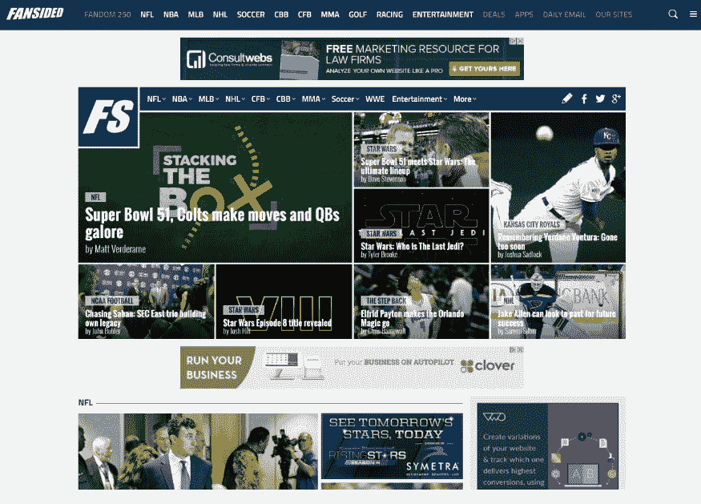

# 金斯塔·金并:莫拉·蒂尔访谈

> 原文：<https://kinsta.com/blog/interview-with-maura-teal/>

你可以在 [LinkedIn](https://www.linkedin.com/in/maurateal) 或 [Twitter](https://twitter.com/mlteal) 上找到莫拉。这是我们最近对她的采访，是我们[金斯塔·金并](https://kinsta.com/search/kingpin/)系列的一部分。

Q1:你的背景是什么，&你最初是如何加入 WordPress 的？

我的父母都是一家大银行的软件工程师，所以在我成长的过程中，我总能接触到电脑和互联网。我建了几个网站，写了一点代码，但大部分时间我想成为一名平面设计师。直到上了大学，我才发现 WordPress，意识到我的职业道路是写代码，而不是平面设计。

今天，我是时代公司旗下网站**和包含 360 多个站点的 WordPress 多站点网络**的网站开发者，每天为超过 100 万用户提供服务。作为组织者，我也参与了最近几届[凤凰世界夏令营](https://2016.phoenix.wordcamp.org/)活动。

Q2:读者应该知道你最近在 WordPress 做了些什么？

我们在 FanSided 遇到了一个有趣而独特的挑战，为网络上的 1800 多名贡献者构建写作工具，同时考虑我们可以利用哪些新技术来不断改善读者在网站前端的体验。

[T2】](http://fansided.com/)

去年我遇到的最有趣的挑战之一是为远程 API 调用构建一个缓存解决方案。我们正在寻找一种方法来消除用户在缓存呼叫过期时偶尔经历的等待时间——这些呼叫通常是优先级较低的呼叫，如“相关帖子”或类似的呼叫，当然不需要是最近的呼叫。这些需求产生了一个 REST 缓存系统，它在后台(在 crons 上)而不是在页面加载时运行过期值的更新。

在职业生涯中，你遇到过哪些挑战？

到目前为止，我的职业生涯真的很幸运。离开自由职业以来，我做过的每一个职位都是一个积木，都有自己独特的挑战。作为每家机构的首席开发人员，我发现自己在编写代码方面进步很快，但直接与客户合作以及我们所说的“客户翻译”并不总是那么容易。我为自己教授他人的能力感到自豪，但在与非技术客户讨论功能和产品时，即时翻译技术语言的学习曲线无疑是一项学习技能。

当我开始在 FanSided 工作时，我意识到虽然客户可能会有不同的包(我们不是代理，但我们确实构建和支持产品)，但我仍然有机会在指导初级开发人员和会见我们公司的编辑时提供客户翻译。虽然我们大部分时间都在电脑前争论代码，但我们工作中最重要的部分仍然是帮助人们。

在 WordPress 的世界里，有什么让你感到惊讶的事情吗？

## 注册订阅时事通讯

### 想知道我们是怎么让流量增长超过 1000%的吗？

加入 20，000 多名获得我们每周时事通讯和内部消息的人的行列吧！

[Subscribe Now](#newsletter)

人们，WordPress 社区。我是在我大学附近的一家咖啡店里，在我们一起黑网站的时候，一个朋友介绍我认识 WordPress 的。我没有参加 meetup，一个 [WordCamp](https://central.wordcamp.org/) ，实际上任何一种技术社区活动。我最初对我的第一次 WordCamp 的欢迎态度印象深刻，然后是我的第一次聚会，坦率地说，当我提到我在一段代码中遇到的问题时，我很惊讶人们这么快就愿意加入并提供帮助。没有竞争意识，只有知识共享和对自己帮助他人的能力的自豪感。

你认为 WordPress 世界的未来会是怎样的？

如果我有一个水晶球，我会说我看到自己越来越多地与 [REST API](https://kinsta.com/blog/wordpress-rest-api/) 合作，并强调我们可以利用 WordPress 来进一步增强我们的贡献者和 FanSided 以及时代公司的能力。WordPress(和 FanSided)是跳板([http://digiday . com/publishers/Time-Inc-learned-small-sites-acquired/](http://digiday.com/publishers/time-inc-learned-small-sites-acquired/))的核心，连接着多个品牌、作家和 CMS。

同样，我期待从 WordPress 核心设计中获得线索，改进 WordPress 的编辑和定制体验。可用性和简单性的提高有利于整个生态系统，随着技术的进步，我们的“易用性”标准也应该提高。

你在 WordPress 主机中寻找什么？

我推荐的主机类型很大程度上取决于你共享的网站类型。也就是说，当谈到 WordPress 主机时，我会寻找一些普通共享环境中没有的特性。

性能、维护和技术都值得注意，但可能不是决定性因素。例如，许多网站在 PHP 5.6 上运行良好，但如果我寻求性能，并且有一个项目准备在 [PHP 7](https://kinsta.com/blog/php-7-3/) 上运行，那将是理想的。[托管](https://kinsta.com/blog/managed-wordpress-hosting/)是另一大优势，因为自动备份和核心更新管理总是很好的功能，但有些项目不符合托管平台偶尔带来的备份流程或限制。

然而，除此之外，还有支持。支持对我来说是最重要的:如果我推荐一个非开发人员自己主持他们的项目，我希望他们得到的支持是初学者友好的。类似地，在企业托管的情况下，可用的支持应该更高级。我们都希望永远不要使用它，但当谈到保持业务或项目在线时，重要的是要知道你正在与什么样的公司合作，并准确地反映出这一点。

当你离开笔记本电脑时，你喜欢做什么？

在我涉足计算机之前，我的爱好是骑马，虽然我不再参加高水平的比赛，但我仍然每周花几个上午骑马，并偶尔教骑马课。我也喜欢摄影和修理我的车。

问题 8:接下来我们应该采访谁&为什么？

carol Stam baugh([@ carolstam baugh](https://twitter.com/carolstambaugh))一位企业主，联合创始人，亚利桑那州 WordPress 社区的核心成员。

* * *

让你所有的[应用程序](https://kinsta.com/application-hosting/)、[数据库](https://kinsta.com/database-hosting/)和 [WordPress 网站](https://kinsta.com/wordpress-hosting/)在线并在一个屋檐下。我们功能丰富的高性能云平台包括:

*   在 MyKinsta 仪表盘中轻松设置和管理
*   24/7 专家支持
*   最好的谷歌云平台硬件和网络，由 Kubernetes 提供最大的可扩展性
*   面向速度和安全性的企业级 Cloudflare 集成
*   全球受众覆盖全球多达 35 个数据中心和 275 多个 pop

在第一个月使用托管的[应用程序或托管](https://kinsta.com/application-hosting/)的[数据库，您可以享受 20 美元的优惠，亲自测试一下。探索我们的](https://kinsta.com/database-hosting/)[计划](https://kinsta.com/plans/)或[与销售人员交谈](https://kinsta.com/contact-us/)以找到最适合您的方式。