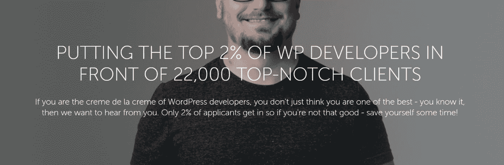
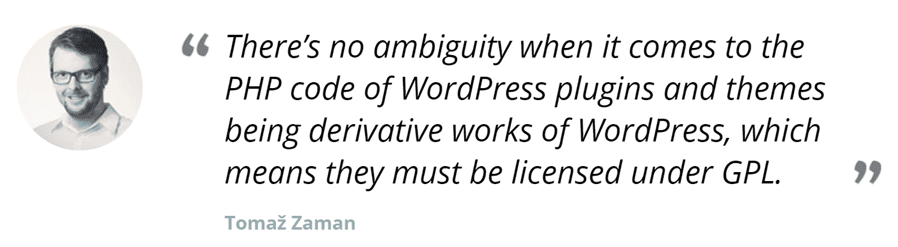

# 金斯塔·金并:佩尔·埃斯本森访谈

> 原文：<https://kinsta.com/blog/interview-with-per-esbensen/>

你可以在 LinkedIn 或者 T2 的 Twitter 上找到 Per。这是我们最近对他的采访，作为我们[金斯塔·金并](https://kinsta.com/?post_type=post&s=kingpin)系列的一部分。

### Q1:你的背景是什么，你是如何开始使用 WordPress 的？

实际上，在开始 [Codeable](https://codeable.io/) 之前，我的职业生涯相当动荡，做过各种各样的工作，大多与销售和市场营销有关。老实说，我不是最好的员工，而且因为我对糟糕的想法和人的容忍度低而被解雇了好几次——你可以说我不擅长与权威打交道，尤其是当我认为所说的权威缺乏领导技能和知识的时候。

我在 Codeable 之前的最后一份朝九晚五的工作是一家小型在线代理公司的客户总监，在这家代理公司中，我们使用了另一个名为 [TYPO3](https://typo3.org/) 的 CMS，这是一个非常受北欧企业客户欢迎的平台。我们为各种公司建立和维护大型网站(大多数超过 2000 多页)。

我自己不是开发人员，所以我最擅长的领域是启动和讨论项目，然后确保它们按时高质量地完成。当然，这并不容易，但是我在职业生涯中学到了一些技巧，甚至在今天的 Codeable 中我也很好地利用了这些技巧。我正在帮助我们的专业自由职业者通过一本不断发展的指南赢得和留住客户，这本指南是我们和我的联合创始人 Tomaz 一起写的，现在正由我们出色的客户支持人员积极维护和更新。

在经营这家代理公司时，我们偶然发现了一个我们最大的客户的网站的大问题，我们根本无法在内部解决，这就是我决定寻找另一个名为 Elance 的外包服务的外部建议的时候。在那里，我很幸运地与我现在的共同创始人兼朋友托马兹·扎曼取得了联系。他是一名认证的 TYPO3 集成商，问题不到一天就解决了。

几年后，Tomaz 成了我的顾问和开发人员，负责我们公司所有的 TYPO3 项目。我们不仅越来越多地雇佣他，我们还成了亲密的朋友——尽管是虚拟的朋友。

有一天，Tomaz 有了一个疯狂的想法，我们应该建立自己的外包服务，专注于专业知识和高于标准的客户支持。他可以提供技术技能(毕竟他是一名开发人员)，而我将负责销售、会计和法律事务。我们一点也不知道这个想法会以超出我们想象的方式改变我们的生活。我们都被它深深吸引，几乎完全不再谈论其他任何事情；只有集思广益如何才能实现它。不久之后，我们辞掉了工作，踏上了一段仍然充满惊喜、兴奋，有时还会有一些挫折的旅程。

像任何负责任的企业主一样，我们也知道我们需要做功课，制定一个合适的商业计划。我们意识到没有外部资金我们不会成功，为了筹集资金，我们需要向投资者展示一个很好的案例。这就是我们如何偶然发现 WordPress 的。与 Elance 这样的巨头竞争是一项不可能完成的任务，这就是为什么我们需要仔细选择一个利基市场并专注于此。这个利基就是 WordPress。其余的，正如他们所说，都是历史了。

Codeable – Outsourcing service to find WordPress experts

### Q2:读者应该知道你最近在 WordPress 做了些什么？

自 2013 年 1 月发布以来，我们的承诺从未改变。我们希望建立一种服务，将优秀的客户与经过严格审查的专家联系起来，这样他们就可以在截止日期前交付高质量的解决方案。Tomaz 有时开玩笑地称我们为“WordPress 的火绒”😄

> 需要在这里大声喊出来。Kinsta 太神奇了，我用它做我的个人网站。支持是迅速和杰出的，他们的服务器是 WordPress 最快的。
> 
> <footer class="wp-block-kinsta-client-quote__footer">
> 
> 
> 
> <cite class="wp-block-kinsta-client-quote__cite">Phillip Stemann</cite></footer>

[View plans](https://kinsta.com/plans/)

我们的最终目标是成为有各种各样 WordPress 问题的人会雇佣我们的专家的地方，不仅仅是一次性的项目，而且从长远来看也是对他们的 WordPress 网站的极大关注。

事实上，我们控制了等式的供应部分(数量有限的专家，目前大约 300 人)，这也让我们实现了一个意想不到的，但受欢迎的副作用:**我们的专家成为同事，朋友，并在需要时互相帮助。**他们也不参与竞争，这是我们在其他外包服务中观察到的现象。我们甚至为他们建立了一个 Slack 频道，那里的讨论很活跃，不仅仅围绕 WordPress。例如，现在我们正在讨论谁将参加在巴黎举行的 2017 年欧洲世界语言营。大约有 60 名我们的专家和 11 名我们的核心团队成员将在那里相互联系，成为一个更强大的团队，并在活动前享受一顿美好的晚餐。

Expert WordPress developers

我想你可以说我们正在做一些我们永远不会停止的事情:为一个了不起的 WordPress 开发者社区建立和发展一个健康的工作环境；确保他们提供的工作有益于他们的客户，并确保他们的辛勤工作和专业知识得到公平的补偿。

[Check out how @Codeablehq is building a community of amazing WordPress developers! 👏Click to Tweet](https://twitter.com/intent/tweet?url=https%3A%2F%2Fkinsta.com%2Fblog%2Finterview-with-per-esbensen%2F&via=kinsta&text=Check+out+how+%40Codeablehq+is+building+a+community+of+amazing+WordPress+developers%21+%F0%9F%91%8F&hashtags=WordPress%2Cwebdev)

### Q3:在职业生涯中，你遇到了哪些挑战？

我从哪里开始？😄

## 注册订阅时事通讯

### 想知道我们是怎么让流量增长超过 1000%的吗？

加入 20，000 多名获得我们每周时事通讯和内部消息的人的行列吧！

[Subscribe Now](#newsletter)

我想最大的挑战之一是弄清楚我的工作在这个世界上的位置。我一直从事营销/销售工作，但很少质疑这是否是我所感兴趣的事情，这只是生活的进程让我进入其中。有了 Codeable，这些问题的答案变得更加清晰，我开始意识到我们都有独特的技能和天赋，但并不是所有人都足够幸运(或有时足够勇敢)去发现它们并善加利用。

我确信我的神奇秘方是与[托马兹](https://twitter.com/TomazZaman)会面并共同创立 Codeable。我们是两个非常不同的人，有着完全不同的背景和技能，但幸运的是，我们有着共同的激情和愿景:**做一些对人们的生活有影响的事情，在做的时候享受乐趣，在赚钱的同时在个人和职业方面都有所成长。**

Codeable founders – Tomaž Zaman and Per Esbensen

这种多样性使我们成为一个伟大的团队(现在我们的员工更是如此)，但这需要一些时间来适应这些动态。

我一直有点控制狂，我觉得有必要对每一个过程和活动进行微观管理，所以我不得不强迫自己摆脱这种心态，为了公司本身和我的精神健康的更大利益，开始信任公司里的人。这对公司所有人之间的关系都有好处，这确实释放了我们与 Tomaz 合作的全部潜力。更不用说它解放了我，让我真正专注于我的优势，并为公司贡献最好的我。诚然，这花了我几年时间，但我相信要完全治愈这一点。

### 在 WordPress 的世界里，有没有什么让你感到惊讶的事情？

事实上，的确如此。在创建 Codeable 之前，我来自一个更加公司化的环境，我习惯了决策层，更重要的是，在开始任何工作之前，我已经知道了大多数事情的答案。

对于 Codeable，情况正好相反，我们不得不在这个过程中随机应变，以真正确定商业模式和我们为客户和专家提供优质服务的方法。虽然一开始感觉很混乱，或者我喜欢称之为“嬉皮士风格”，但当整个团队接受这种方法并发挥其优势时，它变得相当自由。现在我们正在成长，我们当然需要引入一些秩序，但我们不会忘记我们的根源，我们试图采取两个世界最好的东西。

另一个让我惊讶的是 WordPress 社区的包容性和开放性。开源是我们在我管理的机构中使用的东西，不是因为它的哲学，而是因为它是免费的——我对此毫不犹豫。但是现在，我是开源运动的大力提倡者——即使我自己不是开发者——我觉得我的个人使命是教育社区，即使有 [GPL3 许可](https://kinsta.com/learn/wordpress-gpl/)，WordPress 社区中的人们所做的工作也应该得到赞赏和鼓励——不管是什么类型的工作。

Struggling with downtime and WordPress problems? Kinsta is the hosting solution designed to save you time! [Check out our features](https://kinsta.com/features/)

[T2】](https://codeable.io/wordpress-gpl/)

我想这是最后一个最大的惊喜。人们组织活动、写博客、翻译 WordPress 以及以许多其他方式做出贡献——所有这些都是免费的。因为这是健康社区成长的方式，加强了 WordPress 在市场上的地位，并从长远来看为每个人提供了有偿工作。

### Q5:你认为 WordPress 世界的未来会是怎样的？

正如我在前面的回答中提到的，我对教育社区关于开发人员可以用来充分利用技能的最佳方法和技术充满热情，不管目的是什么；一些人想赚更多的钱，而另一些人想有更多的空闲时间。

至于 Codeable，我们正不知疲倦地与我们的客户和专家密切合作，真正建立一个平台，让每个人都能发挥他们最大的潜力；让客户能够“放手”，依靠他们选择的专家，让他们专注于自己的业务，而不是网站带来的技术问题。另一方面，对于专家来说，不必担心他们的工作报酬是否足够，或者他们是否会在第一时间找到工作。

我们拥有超过 25，000 名客户和 300 名专家，这一事实证明我们走在正确的道路上。

### 你在 WordPress 主机中寻找什么？

我坚信“企业就是人”这句话。当涉及到其他公司时，我总是更多地关注流程和活动(或缺乏流程和活动)。最重要的活动之一是**大客户支持。**

我坚信是客户的支持让 [Codeable](https://codeable.io/) 与众不同，帮助我们走到了今天。对其他公司来说没什么不同；当客户有问题时，他们不一定期望问题马上消失——他们想要的是被听到。我认为这是大多数在线企业——不仅仅是 WordPress 主机——失败的地方。

当然，如果一个主机提供商提供 4 美元/月的计划，那么客户需要能够自己解决尽可能多的问题，否则，计算就不合理。但这是一场最终对谁都没有好处的逐底竞赛。好的一面是，许多托管公司开始意识到这一点，并在提高价格的同时，在其他功能和服务上提供足够的价值，让客户坚持使用。

### 问题 7:当你离开笔记本电脑时，你喜欢做什么？

作为一个有家室的男人，我喜欢和我的妻子和女儿在一起。我们经常旅行，Codeable 让我们看到了世界上一些令人惊叹的地方——还有很多地方有待我们一起去发现。

当我需要一些属于自己的时间时，我会带上我的高尔夫设备，和同样热爱这项运动的朋友一起享受一场精彩的比赛。我从小就开始打高尔夫，我喜欢它让我完全脱离其他一切。

有一件事我最近没能做到，但在未来很期待，那就是偶尔享受一本好书。

* * *

让你所有的[应用程序](https://kinsta.com/application-hosting/)、[数据库](https://kinsta.com/database-hosting/)和 [WordPress 网站](https://kinsta.com/wordpress-hosting/)在线并在一个屋檐下。我们功能丰富的高性能云平台包括:

*   在 MyKinsta 仪表盘中轻松设置和管理
*   24/7 专家支持
*   最好的谷歌云平台硬件和网络，由 Kubernetes 提供最大的可扩展性
*   面向速度和安全性的企业级 Cloudflare 集成
*   全球受众覆盖全球多达 35 个数据中心和 275 多个 pop

在第一个月使用托管的[应用程序或托管](https://kinsta.com/application-hosting/)的[数据库，您可以享受 20 美元的优惠，亲自测试一下。探索我们的](https://kinsta.com/database-hosting/)[计划](https://kinsta.com/plans/)或[与销售人员交谈](https://kinsta.com/contact-us/)以找到最适合您的方式。