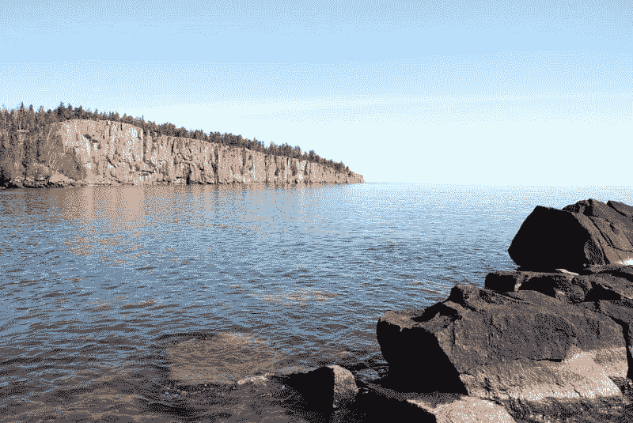

# 金斯塔·金并:采访《现代部落》的特拉维斯·托茨

> 原文：<https://kinsta.com/blog/interview-with-travis-totz-from-modern-tribe/>

Travis 曾是 Westwerk 的合伙人，因此他对 WordPress 和机构生活非常了解。他也是一个很酷的人。下面是我们最近对 T4 的采访，作为我们新的[金斯塔·金并系列](https://kinsta.com/search/kingpin/)的一部分。

Q1:你在摩登部落的职位和日常职责是什么？

这是一个有趣的问题，我敢肯定，如果你问现代部落的合伙人，他们可能会说，“我们对头衔不感兴趣。”这是真的。当然，Tribe 的每个人都有自己的专长，专注于特定的日常任务，但没有复杂职位和副总裁这样或那样的疯狂层级。从组织的角度来看，它是相当扁平的。我的官方非官方头衔是“高级网络战略家”，目前我一天大约 50%的时间用于项目策略和设计方向，50%的时间用于新项目和整个评估过程中与新客户合作。

Q2:在摩登部落工作感觉如何？

这就像和全世界一群非常酷的人(大约 54 人)一起工作；一群真正乐于助人的小伙子和姑娘，他们有着快乐、积极的性格，这使得整个团队能够创造出杀手级的作品。Tribe 绝对不是一个典型的代理机构，在那里你与一个客户经理打交道，然后得到一个项目。

每个项目都有一个由设计师、开发人员和战略家组成的专门团队——每个人都非常努力地工作以使他们的项目成功。这是全面的；从产品到服务。你对自己工作的奉献精神在摩登部落体现得淋漓尽致。有一种强烈的问责文化。和我信任的成年人一起工作很愉快。

摩登部落相信为他人和自己制造高质量的产品，并以高质量的生活来平衡。这真的很好，因为这一切都是为了保持健康的生活，工作内外都是如此。人们有自己的生活，部落明白这一点。部落生活就是这样。

问题 3:你的代理机构如何从其他 WordPress 代理机构中脱颖而出？

我觉得各种类型的机构说自己“不一样”很容易，但是直到我加入摩登部落，我才真正开始相信他们有点不一样。Tribe 使人们能够非常有意识地做他们所做的事情——这对客户和团队都是如此。有意识地生活和工作真的有助于我们在人群中脱颖而出。用心设计，用心建造，所有这些都能让我们的客户成功。我们让客户看起来很好，这让我们很开心。

有一小撮机构主导着我们的利基市场，每个机构都找到了自己的组合。客户经常来部落挑战 WordPress 的边界，无论是规模还是复杂性。虽然我们的项目基础的核心是基于 WordPress，但我们有一个深厚的设计基础，并做了大量的纯设计/用户体验项目，从易贝的汽车和时尚移动应用程序到 Mozilla 的移动操作系统。多年来，我们一直在经营 R&D，为 SAP &松下等公司解决业务问题。战略是核心产品的重要组成部分，并建立在合作关系的基础上。我们经常听到自己被称为企业精品。

对于那些对我们的[日历&事件插件](https://theeventscalendar.com/)了解现代部落的人来说，你可以想象我们对这个空间略知一二。我们的经验让我们找到了 Eventbrite、IEEE Conferences、Maker Faire、Harvard & Stanford 和其他许多希望推广基于活动的产品的客户。

我们相信生活应该有目的地去过。我们相信工匠和工匠阶层能够控制他们的工作，他们解决人们的问题，而不仅仅是制造更多的垃圾。我们相信开源的可持续发展前景，并因此不断地为 WordPress 生态系统做出贡献。我们专注于拓展 WordPress 的能力范围。

Q4:你们公司的目标客户是什么类型的？

我们组建了一支由高技能技术人员组成的团队，为财富 500 强公司、高等教育和政府机构以及资金雄厚的初创企业设计和开发软件。这是我们的强项，但我们喜欢与各种客户交谈，并帮助解决各种复杂的问题。我们有机会为哈佛大学、斯坦福大学、Steelcase、Bon Appétit 和易贝等客户从事一些出色的项目。

## 注册订阅时事通讯

### 想知道我们是怎么让流量增长超过 1000%的吗？

加入 20，000 多名获得我们每周时事通讯和内部消息的人的行列吧！

[Subscribe Now](#newsletter)

问 5:有什么类型的 WordPress 项目不适合你的公司吗？

主要是一些小事情。Modern Tribe 在处理企业级 WordPress 项目的系统和流程方面做得非常出色。

你所在的明尼阿波利斯的 WordPress 社区是什么样的？

充满活力，引人入胜，不断发展。明尼阿波利斯的人们很棒，开发社区很大，并且因为更大的专注于开发的机构而持续增长。对于 WordPress 来说，这是一个美好的时代，我们确实看到并感受到了它在我们当地社区的发展。

许多美国人从未去过明尼苏达州。住在那里是什么感觉，有哪些地方会让大多数人感到惊讶？

这是真的。明尼苏达州是一个非常整洁的州，真正拥有 10，000 个湖泊，它们无处不在！明尼阿波利斯和圣保罗是如此酷的小都会区，周围有一些最酷的公园和徒步旅行路线，还有一些非常棒的食物！我想人们会惊讶地发现明尼苏达州并不总是很冷。这里的夏天会变得超级热，如果你是明尼苏达州人，你会在夏天的几个月里尽可能多做些事情，因为你知道冬天的寒冷和无情就在眼前。

###### 图片来源[https://www.flickr.com/photos/kristin-and-adam/4470493236/](https://www.flickr.com/photos/kristin-and-adam/4470493236/)

Q8:你用 WordPress 做设计多久了？

什么感觉像永远！但实际上已经过去了 10 年左右。我和我的好朋友尼克·佩尔顿从 2.0 版本开始就一直在钻研 WordPress，能够继续在一个平台上工作真是太棒了[，这个平台经历了如此美妙的增长模式和历史上的采用](https://kinsta.com/learn/wordpress-history/)。如果你像我一样坚持使用 WordPress，你就会知道你喜欢它:)

随着 Calypso 的发布和所有关于 JavaScript 的讨论，你如何看待未来围绕 WordPress 的设计变化？

我认为这是平台的一个巨大进步，也是一个超级令人兴奋的进步。但我认为，未来围绕 WordPress 的设计将更加专注于设计不同的“视图”和“状态”，而不是围绕静态模板进行设计。设计师将不得不更多地考虑交互，这将更像是围绕一种体验而不是一堆页面进行设计。

问 10:对于一个刚从大学毕业、想在 WordPress 工作的年轻平面设计师，你有什么建议？

参与进来。WordPress [的美妙之处在于它的社区和人们](https://kinsta.com/learn/wordpress-communities/)，我认为这种联系在我们的世界里有很长的路要走。开始尽你所能了解这个平台以及它能做什么。学习一点代码，即使只是对 WordPress 周围不同语言的基本理解——这些东西将帮助你设计更好的体验，并帮助你更容易地融入团队。

* * *

让你所有的[应用程序](https://kinsta.com/application-hosting/)、[数据库](https://kinsta.com/database-hosting/)和 [WordPress 网站](https://kinsta.com/wordpress-hosting/)在线并在一个屋檐下。我们功能丰富的高性能云平台包括:

*   在 MyKinsta 仪表盘中轻松设置和管理
*   24/7 专家支持
*   最好的谷歌云平台硬件和网络，由 Kubernetes 提供最大的可扩展性
*   面向速度和安全性的企业级 Cloudflare 集成
*   全球受众覆盖全球多达 35 个数据中心和 275 多个 pop

在第一个月使用托管的[应用程序或托管](https://kinsta.com/application-hosting/)的[数据库，您可以享受 20 美元的优惠，亲自测试一下。探索我们的](https://kinsta.com/database-hosting/)[计划](https://kinsta.com/plans/)或[与销售人员交谈](https://kinsta.com/contact-us/)以找到最适合您的方式。