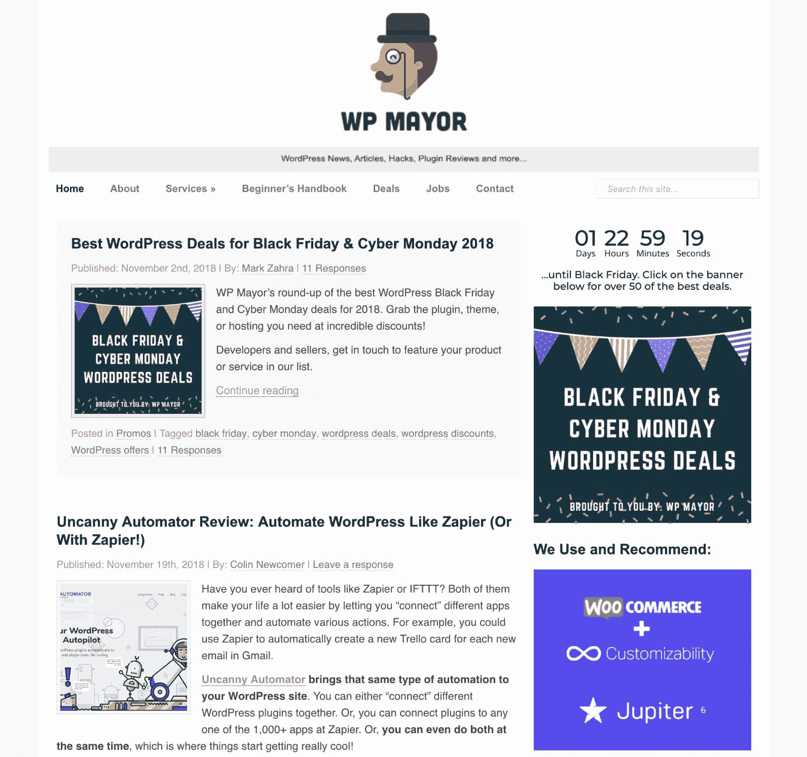
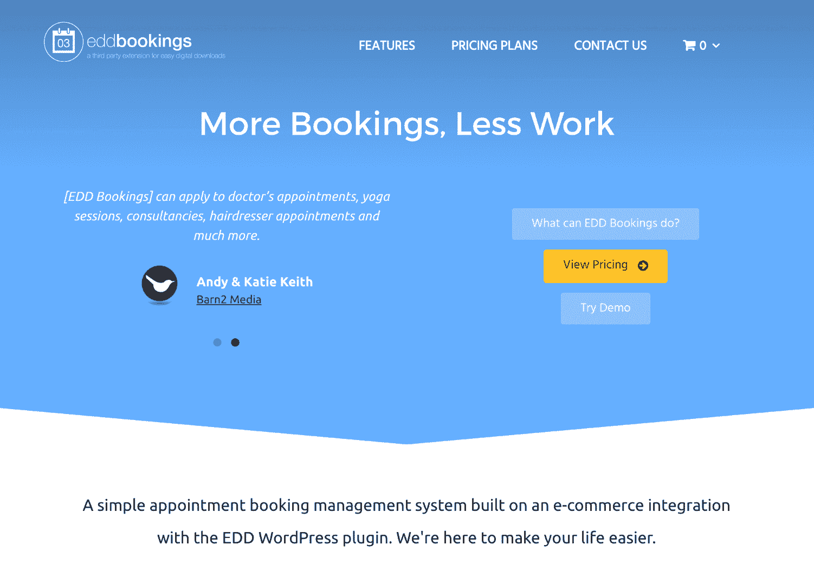

# 金斯塔·金并:采访 WP 市长让·加利亚和马克·萨拉

> 原文：<https://kinsta.com/blog/interview-with-wp-mayor/>

今天，我们有幸采访了 Jean Galea(创始人)和 Mark Zahra(首席执行官)，他们是广受欢迎的 WP 市长博客的幕后团队。WP 市长是网络上最古老和最受欢迎的 WordPress 资源之一！了解他们是如何开始的，他们面临的一些挑战，以及他们目前正在进行的项目。

通常我们的[金斯塔·金并](https://kinsta.com/search/kingpin/)系列只有一个受访者，但这一次，我们认为改变一下事情，从这两个人身上获得一些见解会很有趣。

### Q1:你的背景是什么，你是如何开始使用 WordPress 的？

我开始是一名自由网站开发者，因此，我很快就需要一个 CMS 来实现我客户的网站。那是在 2006 年，开源 CMSs 的市场份额仍然被 Mambo/Joomla、WordPress、 [Drupal](https://kinsta.com/blog/wordpress-vs-drupal/) 和 MODx 瓜分，它们都在争夺首选 CMS 的头把交椅。

我一开始用的是 Joomla(当时叫 Mambo ),但是很快意识到对于客户来说使用起来太复杂了。不久之后，我发现了 WordPress，从此再也没有回头。

Jean Galea

老实说，我的背景与 WordPress 或网站没有太大关系。直到 20 岁，我还是一名大学生，学习成为一名建筑师。两年后我意识到这不适合我。在那之后，我花了几个月的时间尝试网络开发的在线课程，学习 HTML、 [CSS](https://kinsta.com/blog/wordpress-css/) 、JS 和 PHP 的基础知识。与此同时，我第一次用 WordPress 管理我的曲棍球俱乐部的网站。

在与 Jean 偶遇之后，我们最终讨论了我为 WP Mayor 写几篇简单文章的可能性，看看进展如何。就像他们说的，剩下的就是历史了。在写了几个月的文章后，我转向了对 WP RSS 聚合器插件的基本支持。后来，我被介绍到业务的其他领域，最终进入了项目管理职位，从今年 11 月开始，担任首席执行官。

Mark Zahra

### Q2:对于你参与的公司/项目，读者应该知道些什么？

WP Mayor 是网上访问量最大的 WordPress 资源网站之一，我和我的妻子 Alyona 和 Mark 一起运营。我们也有几个作家来帮助我们每天不断地写出好的内容。

我也喜欢构建产品，这种热情的结果是我们业务的产品方面，包括 [WP RSS 聚合器](http://www.wprssaggregator.com/)以及一些便于数字下载的扩展。WP RSS 聚合器拥有成千上万的用户和几个高级附加组件。

最近，我们正在努力开发 [EDD 预订](https://kinsta.com/blog/wordpress-booking-plugins/#edd-bookings)，我对这个插件非常乐观，因为这些年来我和无数人交谈过，他们敦促我为 WordPress 创建一个预订解决方案。

最后但同样重要的是，我共同主持了 Mastermind.fm 播客，这是一个关于在 WordPress 平台上建立成功企业的播客。我非常喜欢与我的共同主持人詹姆斯·劳斯以及我们的受访者聊天。我真的很期待作为一名播客主持人的进步，并进一步发展这个项目。

Jean Galea

WP Mayor

考虑到我们过去几年承接的项目，我们是一个小团队。我们只有我，两个开发人员和一个全职支持工程师(当然除了 Jean)。也就是说，这是一群敬业的人。我们热爱我们所做的事情，每天带着兴奋的心情投入到工作中，为那些能让别人的生活更轻松，让他们的事业更成功的项目而工作。

现在的情况确实如此。我们正在将 [EDD 预订](https://eddbookings.com/)插件发展成为一个成熟的 WordPress 预订系统。这是一个令人兴奋的过程，因为我们越来越多地参与 UI/UX 设计，并详细了解我们用户的需求。

WP RSS 聚合器插件已经在它的空间里建立起来了，所以我们专注于维护插件，同时在其他地方进行改进。例如，改善我们的知识库和支持产品，使我们的网站更加用户友好，并计划用户界面/UX 的变化，以方便后端的饲料管理。

WP 市长现在已经成为我最喜欢的项目之一。我们正在改造网站，继续为我们的读者提供有价值的资源。能够与我们的作家、分支机构和合作伙伴更紧密地合作是很有趣的，因为这开启了一个充满机会的新世界。

最后，我不能忘记 [Mastermind.fm](https://mastermind.fm/) 播客。与 WordPress 空间内外的一些最聪明的人交谈是一种令人兴奋的经历。

Mark Zahra

EDD Bookings

### Q3:你在创业过程中遇到了哪些挑战？

事实上，我经常旅行并不容易；很难兼顾工作和旅行计划，还要适应新的地方，找到共同工作的空间等等。另一方面，我很幸运地找到了优秀的人和我们一起工作，我们现在有一个非常棒的远程团队，即使在我旅行的时候，我也可以 100%地依赖他们。

Jean Galea

正如我之前解释的，我只是和 Jean Galea 一起建立我们的业务的一部分，所以我不能对迄今为止所做的工作完全负责。也就是说，对我个人来说，在不牺牲个人生活的情况下适应我的新角色是一个挑战。总有一些小火要扑灭，或者有人需要你的帮助，所以找到正确的平衡并相应地优先处理每件事就变得很关键。我喜欢这种挑战，所以我很好奇我能从这个过程中学到什么。

Mark Zahra

### Q4:在种植它们的过程中，有什么让你感到惊讶的事情吗？

我想不出有什么特别的，但我正在不断学习，所以每天都会遇到挑战。我热爱创业，所以这是游戏的一部分。

Jean Galea

因为这是一个过程，而且这不是我以前学过或参与过的东西，所以这是关于边学边做。谢天谢地，我有机会得到 Jean 这位伟大导师的指导，也有机会向其他伟大的人学习。

我在这里可以提到的一件事是，像这样的工作需要大量的小细节。你不断被拉向不同的方向。不管你读了多少书，也不管你和别人谈了多少，亲身经历是完全不同的。这很令人惊讶，但一旦你开始看到积极的结果，就会感到振奋。

Mark Zahra

### 问 5:WP 市长的未来是什么样的？

我们希望为网站引入新功能，并改进设计，使某些内容更容易访问。随着时间的推移，该网站已经有了很大的发展，所以我们需要确保新用户可以找到他需要的东西，而不需要太多的搜索。当然，主要目的是增加观众，或许在不久的将来推出播客。

Jean Galea

WP 市长的未来看起来一片光明。我们已经制定了计划，其他计划也在进行中，以继续在我们今天拥有的平台上进行构建。我们仍然每周都在生产高质量的内容，我们正在想办法为我们的读者提供更多的内容。关于我们的计划，我不能透露太多，但你绝对应该留意未来几个月的一些逐渐变化。

Mark Zahra

### Q6:你所在地区的 WP 社区是什么样的？

作为一个数字流浪者，这是一个很难回答的问题，但是，我可以告诉你，全球的 WP 社区真的很棒。每当我搬到一个新的国家，我做的第一件事就是参加 WordPress meetup 来认识人们。在清迈，我甚至创建了当地的 WordPress meetup，并结交了几个多年来一直保持联系的朋友。

Jean Galea

不幸的是，由于我目前住在马耳他，这个社区似乎很小。我们是地中海中的一个小岛，虽然一年中有一些小聚会，但我最好的选择是去国外参观更多的单词营，比如欧盟单词营。

Mark Zahra

### 问题 7:当你离开笔记本电脑时，你喜欢做什么？

我喜欢旅行和练习一些运动，这取决于我所处的位置。我也喜欢阅读各种各样的主题。

Jean Galea

目前，我的重点是在变得太懒(在家工作的一个缺陷)几个月后恢复健康。我又开始和朋友们一起参加五人制足球比赛，我们每周都尝试这样做。除了身体健康之外，我还一直致力于精神健康，在日常生活中引入更多的阅读和播客。计划是保持这一切，逐步消除你在家远程工作时养成的坏习惯。

Mark Zahra

### 问题 8:接下来我们应该采访谁，为什么？

我的播客联合主持人[詹姆斯·劳斯](https://kinsta.com/blog/interview-james-laws/)，一个全能的好人，他在[忍者形态](https://ninjaforms.com/)方面做得很好。

Jean Galea

我会推荐几个我最近有机会进一步了解的人。首先， [Markus](https://twitter.com/mschwing) ，ThemeFusion 的首席技术官，他最近在 Envato 上的销售额达到了 2500 万美元——我们在 Mastermind.fm 播客上有一个关于它的[精彩片段](https://mastermind.fm/episode-103-reaching-25m-in-sales-with-markus-from-themefusion/)。

其次，[米歇尔·海曼斯](https://twitter.com/badlog)，约斯特的首席运营官。我们最近还和他一起参加了[播客的一集](https://mastermind.fm/episode-102-conversion-optimization-michiel-heijmans-yoast/)，他肯定有一些值得与更多观众分享的见解。

Mark Zahra

## 与吉恩和马克联系

想和吉恩和马克交流吗？

*   你可以在 LinkedIn 或者 T2 的 Twitter 上找到吉恩·加利亚。
*   你可以在 LinkedIn 或 T2 的 Twitter 上找到马克·萨拉。

* * *

让你所有的[应用程序](https://kinsta.com/application-hosting/)、[数据库](https://kinsta.com/database-hosting/)和 [WordPress 网站](https://kinsta.com/wordpress-hosting/)在线并在一个屋檐下。我们功能丰富的高性能云平台包括:

*   在 MyKinsta 仪表盘中轻松设置和管理
*   24/7 专家支持
*   最好的谷歌云平台硬件和网络，由 Kubernetes 提供最大的可扩展性
*   面向速度和安全性的企业级 Cloudflare 集成
*   全球受众覆盖全球多达 35 个数据中心和 275 多个 pop

在第一个月使用托管的[应用程序或托管](https://kinsta.com/application-hosting/)的[数据库，您可以享受 20 美元的优惠，亲自测试一下。探索我们的](https://kinsta.com/database-hosting/)[计划](https://kinsta.com/plans/)或[与销售人员交谈](https://kinsta.com/contact-us/)以找到最适合您的方式。