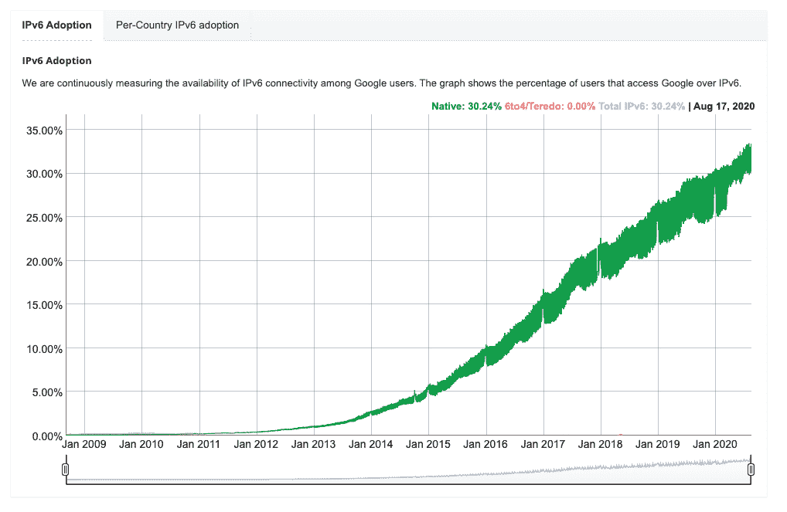
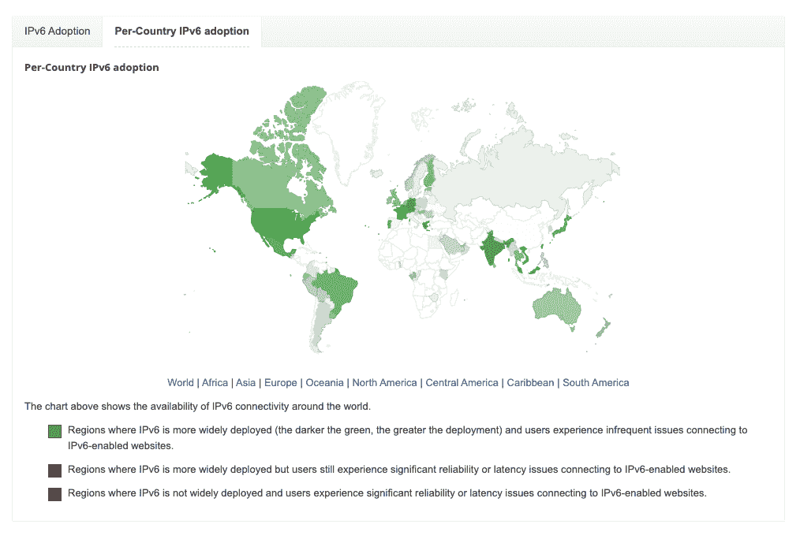

# IPv4 与 IPv6 —这两种协议有什么区别？

> 原文：<https://kinsta.com/blog/ipv4-vs-ipv6/>

对 IPv4 和 IPv6 的区别感到困惑？

IP 是互联网协议的缩写，是一种帮助计算机/设备通过网络相互通信的协议。顾名思义，互联网协议有不同的版本:IPv4 和 IPv6。

在本帖中，我们将深入了解你需要知道的一切，以理解 IPv4 和 IPv6 之间的区别。以下是我们将要介绍的内容:

### 更喜欢看[视频版](https://www.youtube.com/watch?v=U-22FneZhd0)？

## 什么是互联网协议(IP)？

互联网协议(IP)是一组帮助路由数据包的规则，以便数据可以跨网络移动并到达正确的目的地。

当计算机试图发送信息时，它会被分解成更小的块，称为数据包。为了确保这些数据包都到达正确的地点，每个数据包都包含 IP 信息。

这个难题的另一部分是，互联网上的每一个设备或域都被分配了一个 IP 地址，这个 IP 地址唯一地将它与其他设备区分开来。

这包括你自己的电脑，你可能以前遇到过。如果你去许多[“我的 IP 地址是什么？”工具](https://kinsta.com/tools/what-is-my-ip/what-is-my-ip/)，他们会显示你的电脑的 IP 地址和你的位置的粗略估计(*，这应该是准确的，除非你使用 VPN* )。

您最熟悉的 IP 地址可能是这样的:

`192.168.10.150`

通过给每个设备分配一个 IP 地址，网络能够有效地路由所有这些数据包，并确保它们到达正确的地点。

### 什么是 IPv4？

尽管名称中有“4”，但 IPv4 实际上是第一个使用的 IP 版本。它早在 1983 年就推出了，即使在今天，它仍然是识别网络设备的最知名版本。

IPv4 使用 32 位地址，这可能是您在讨论“IP 地址”时最熟悉的格式。这个 32 位地址空间提供了近 43 亿个唯一地址，尽管有些 IP 地址块是为特殊用途保留的。

以下是 IPv4 地址的示例:

`192.168.10.150`

### 什么是 IPv6？

IPv6 是 IP 的更新版本，使用 128 位地址格式，包括数字和字母。以下是 IPv6 地址的一个示例:

`3002:0bd6:0000:0000:0000:ee00:0033:6778`

### 为什么我们需要新版本的 IP？

在这一点上，你可能想知道为什么 IPv6 会存在。

虽然 IPv4 中的 43 亿个潜在 IP 地址看起来很多，但我们需要更多的 IP 地址！

世界上有很多人有很多设备。随着物联网设备(物联网)和传感器的兴起，这是一个更大的问题，因为这些设备极大地扩展了联网设备的数量。

简而言之，世界上唯一的 IPv4 地址正在耗尽，这是我们需要 IPv6 的最大原因。

不过，还有一些其他更本质的技术原因——让我们来讨论一下。

[💡 IP, short for Internet Protocol, helps computers/devices communicate over a network. This guide digs into the differences between versions IPv4 and IPv6 👇Click to Tweet](https://twitter.com/intent/tweet?url=https%3A%2F%2Fkinsta.com%2Fblog%2Fipv4-vs-ipv6%2F&via=kinsta&text=%F0%9F%92%A1+IP%2C+short+for+Internet+Protocol%2C+helps+computers%2Fdevices+communicate+over+a+network.+This+guide+digs+into+the+differences+between+versions+IPv4+and+IPv6+%F0%9F%91%87&hashtags=WPTips%2CWordPress)

## IPv4 和 IPv6 有什么区别？

现在，让我们来了解一下 IPv4 与 IPv6 的区别。

最明显的区别，也是最适用于普通人的区别，是格式的不同:

## 注册订阅时事通讯

### 想知道我们是怎么让流量增长超过 1000%的吗？

加入 20，000 多名获得我们每周时事通讯和内部消息的人的行列吧！

[Subscribe Now](#newsletter)

*   IPv4 使用 32 位地址
*   IPv6 使用 128 个地址

不用进入数学领域(我们将在下一节讨论)，这意味着 IPv6 提供的地址比 IPv4 多 1，028 倍，这基本上解决了“地址用尽”的问题(至少在可预见的未来)。

IPv6 也是由冒号分隔的字母数字地址，而 IPv4 只有数字，由句点分隔。同样，下面是每种方法的一个例子:

*   IP v4—`192.168.10.150`
*   IPv6—`3002:0bd6:0000:0000:0000:ee00:0033:6778`

IPv4 和 IPv6 之间也有一些技术差异，尽管非开发人员并不需要了解这些差异。一些最显著的技术差异是:

*   IPv6 包含内置的服务质量(QoS)。
*   IPv6 有一个内置的网络安全层(IPsec)。
*   IPv6 消除了网络地址转换(NAT ),并允许 IP 层的端到端连接。
*   多播是 IPv6 基本规范的一部分，而在 IPv4 中是可选的。多播允许在一次操作中将数据包传输到多个目的地。
*   IPv6 具有更大的数据包报头(大约是 IPv4 的两倍)。

### IPv4 和 IPv6 共有多少个地址？

如上所述，IPv6 支持的 IP 地址是 IPv4 的 1，028 倍。

IPv4 支持大约 42.9 亿个地址。

另一方面，IPv6 支持…嗯，最简单的写法是`2^128`不同的地址。如果你对确切的数字感兴趣，这里是 IPv6 提供的唯一地址数量:340，282，366，920，938，463，463，374，607，431，768，211，456

这意味着我们在用完 IPv6 地址之前还有很长的路要走！

### IPv4 和 IPv6 的速度有区别吗？哪个更快？

一般来说，IPv4 和 IPv6 的速度没有太大区别，尽管一些证据表明 IPv6 在某些情况下可能会稍微快一些。

与宕机和 WordPress 问题做斗争？Kinsta 是一款考虑到性能和安全性的托管解决方案！[查看我们的计划](https://kinsta.com/plans/?in-article-cta)

在“无差异”方面， [Sucuri 在支持 IPv4 和 IPv6 的网站上进行了一系列测试](https://blog.sucuri.net/2016/08/ipv4-vs-ipv6-performance-comparison.html)，发现在他们测试的大多数网站上基本上没有差异。

然而，你也可以找到一些证据表明 IPv6 更快。例如，[脸书的工程博客](https://engineering.fb.com/networking-traffic/ipv6-it-s-time-to-get-on-board/)称“我们观察到访问脸书比 IPv6 快 10-15%”。

类似地， [Akamai 在 iPhone/移动网络上测试了](https://blogs.akamai.com/2016/06/preparing-for-ipv6-only-mobile-networks-why-and-how.html)一个单独的 [URL](https://kinsta.com/knowledgebase/what-is-a-url/) ，发现该网站使用 IPv6 的平均加载时间比使用 IPv4 快 5%。

然而，有很多变量，所以如果不进行严格控制的实验，很难[比较性能](https://kinsta.com/blog/debugging-wordpress-performance/)。

IPv6 可能更快的一个原因是它不会在网络地址转换(NAT)上浪费时间。然而，IPv6 也有更大的数据包报头，因此在某些情况下可能会更慢。

### IPv4 还是 IPv6 更受欢迎？

尽管随着 IPv6 越来越多地被采用，这个数字正在发生变化，但 IPv4 仍然是使用最广泛的互联网协议。

IPv6 adoption worldwide

谷歌[维护着全球各国谷歌用户 IPv6 可用性的公开统计数据](https://www.google.com/intl/en/ipv6/statistics.html)。这些数字是通过 IPv6 而不是 IPv4 访问谷歌网站的所有流量的百分比。

在全球范围内，IPv6 的可用性约为 32%,但各国之间差异很大。例如，美国有超过 41%的 IPv6 采用率，而英国有大约 30%的采用率，西班牙只有 2.5%。

Per-Country IPv6 adoption

## Kinsta 用的是什么互联网协议版本？

如果你在 Kinsta 托管你的站点，你可能想知道 Kinsta 是使用 IPv4 还是 IPv6。金斯塔目前[使用 IPv4](https://kinsta.com/help/ipv4-address/) 。

为什么？因为 Kinsta 是由 Google Cloud 的高级层提供支持的，而且目前 Google Cloud 还不完全支持 IPv6。

也就是说，IPv6 支持在谷歌云的路线图上，所以这在未来可能会改变。然而，谷歌云何时加入 IPv6 支持还没有官方时间表。

[Confused by IPv4 and IPv6? 🥴 Click to see how these two Internet Protocol versions differ.Click to Tweet](https://twitter.com/intent/tweet?url=https%3A%2F%2Fkinsta.com%2Fblog%2Fipv4-vs-ipv6%2F&via=kinsta&text=Confused+by+IPv4+and+IPv6%3F+%F0%9F%A5%B4+Click+to+see+how+these+two+Internet+Protocol+versions+differ.&hashtags=IPAddress%2CWPHelp)

## 摘要

互联网协议(IP)有助于在网络中路由数据。为此，每台设备都分配了一个 IP 地址。

IPv4 是 1983 年推出的原始版本。然而，它的 32 位格式只允许大约 43 亿个唯一地址，这不能满足现代世界的需要。

为了解决缺乏唯一 IPv4 地址的问题(并进行一些其他技术更改)，IPv6 应运而生。IPv6 使用 128 位地址格式允许 3.4 x 10 38 的唯一 IP 地址。

对于大多数人来说，这就是你需要知道的一切——IPv6 使用不同的格式，并提供比 IPv4 更多的唯一地址。

Kinsta 使用 IPv4 是因为支撑 Kinsta 基础设施的 GCP 还没有推出 IPv6 支持。IPv6 在谷歌云的路线图上，所以这在未来可能会改变。

* * *

让你所有的[应用程序](https://kinsta.com/application-hosting/)、[数据库](https://kinsta.com/database-hosting/)和 [WordPress 网站](https://kinsta.com/wordpress-hosting/)在线并在一个屋檐下。我们功能丰富的高性能云平台包括:

*   在 MyKinsta 仪表盘中轻松设置和管理
*   24/7 专家支持
*   最好的谷歌云平台硬件和网络，由 Kubernetes 提供最大的可扩展性
*   面向速度和安全性的企业级 Cloudflare 集成
*   全球受众覆盖全球多达 35 个数据中心和 275 多个 pop

在第一个月使用托管的[应用程序或托管](https://kinsta.com/application-hosting/)的[数据库，您可以享受 20 美元的优惠，亲自测试一下。探索我们的](https://kinsta.com/database-hosting/)[计划](https://kinsta.com/plans/)或[与销售人员交谈](https://kinsta.com/contact-us/)以找到最适合您的方式。