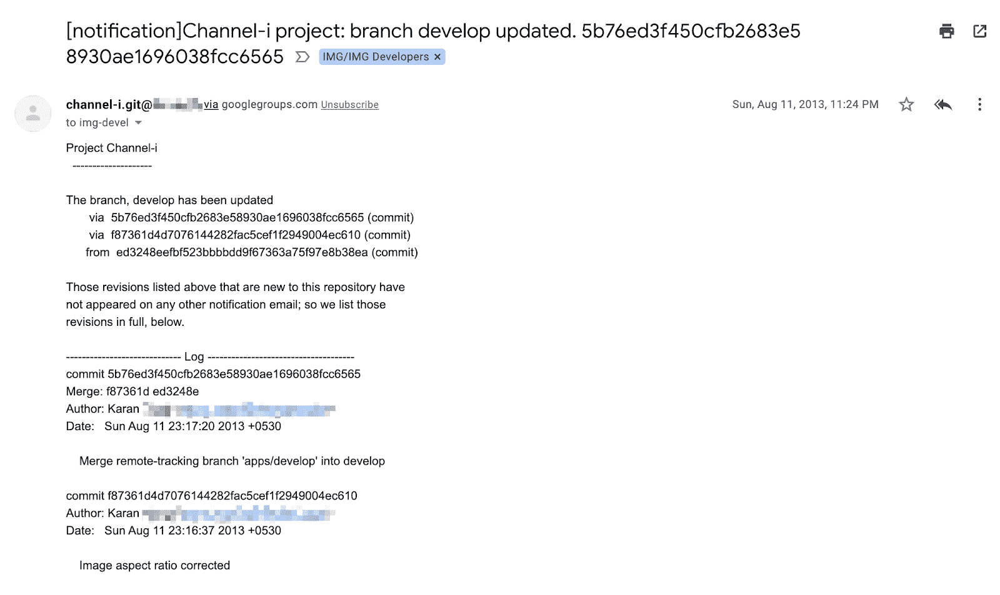
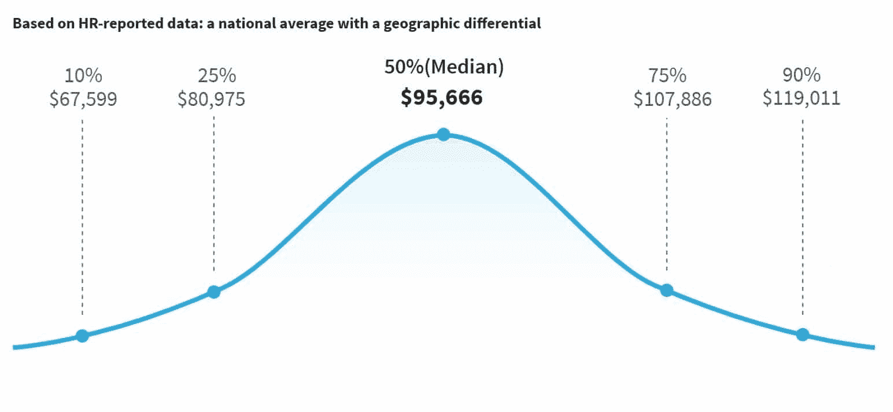
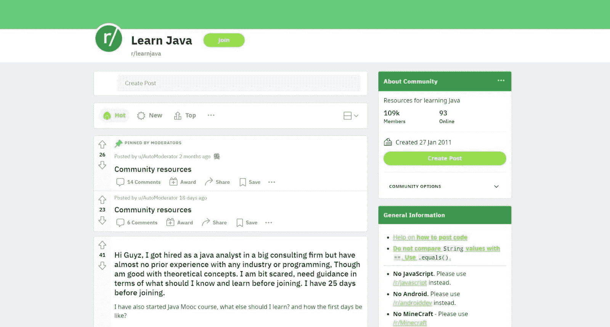
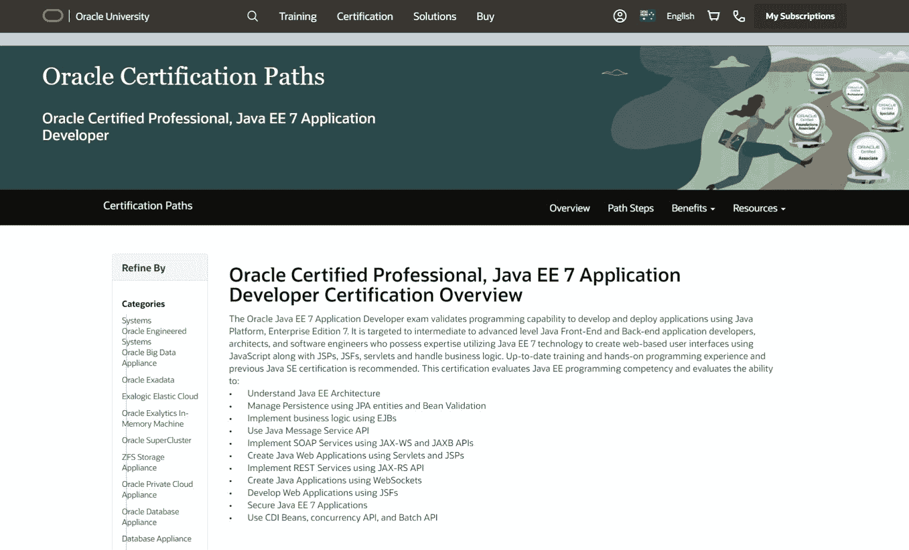
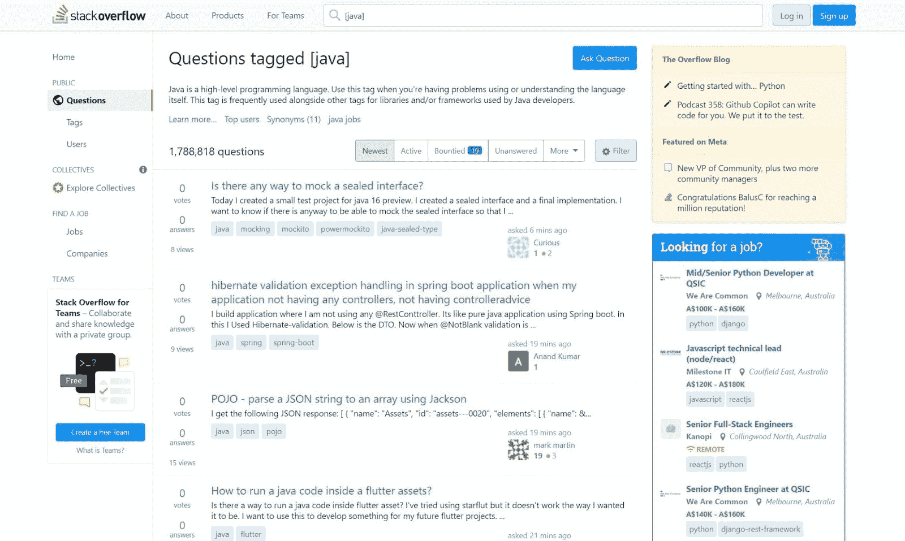
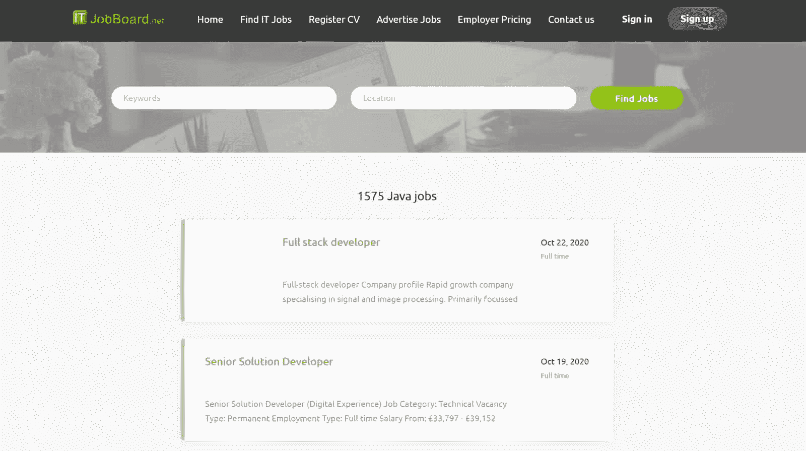

# 如何成为一名 Java 开发人员:你需要知道的一切

> 原文：<https://kinsta.com/blog/java-developer/>

美国劳工统计局估计全国有超过 1，469，000 名软件开发人员。【2021 年的数据显示，这些开发者中有 35.35%使用 Java ，这是世界上使用最广泛的五大编程语言之一。

自然，对于任何对软件开发感兴趣的人来说，学习 Java 并成为一名 Java 开发人员是一个明智的职业选择。

在这本全面的指南中，您将学到成为 Java 开发人员所需要知道的一切。我们将分解你需要的技能，工作职责，以及你期望你的雇主付给你多少钱。

开始吧！

## Java 是什么？

在我们探索成为 Java 开发人员所需了解的一切之前，您需要了解什么是 Java。

Java 是开发人员用于移动、软件和 web 开发的编程语言。20 世纪 90 年代早期，一个名为“绿色团队”的小团队最初将 Java 概念化。该团队包括詹姆斯·高斯林，他后来因其工作而被称为“Java 之父”。Gosling 在 Sun Microsystems(今天甲骨文的子公司)担任工程师期间开发了 Java。

Java 最初被设计成:

> 需要在这里大声喊出来。Kinsta 太神奇了，我用它做我的个人网站。支持是迅速和杰出的，他们的服务器是 WordPress 最快的。
> 
> <footer class="wp-block-kinsta-client-quote__footer">
> 
> 
> 
> <cite class="wp-block-kinsta-client-quote__cite">Phillip Stemann</cite></footer>

[View plans](https://kinsta.com/plans/)

*   简单的
*   粗野的
*   轻便的
*   独立于平台
*   担保
*   高性能
*   多线程
*   建筑中立
*   解释
*   动态的

自从 Java 在 1995 年发布以来，许多现代编程语言都是从它派生出来的，包括 Python、Scala、 [JavaScript 和 PHP](https://kinsta.com/blog/php-vs-javascript/) 。自然，Java 一直是 T2 最受欢迎的编程语言之一。

目前，Java 有四个不同的版本:

*   **Java 卡，**人们用来为处理能力较小的设备(如 SIM 卡和 ATM 卡)开发程序
*   **Java 标准版(Java SE)** ，人们用来开发桌面和服务器的程序。
*   **Java Micro Edition (Java ME)** ，人们用来为移动设备(像 iOS 和 Android 手机)开发程序。
*   **Java Platform Enterprise Edition(Java EE)**，人们用来开发大型应用。

[对新职业感兴趣？👀从这里开始👇 点击推文](https://twitter.com/intent/tweet?url=https%3A%2F%2Fkinsta.com%2Fblog%2Fjava-developer%2F&via=kinsta&text=Interested+in+a+new+career%3F+%F0%9F%91%80+Start+here+%F0%9F%91%87&hashtags=Java%2CWebDev)

### 什么是面向对象编程？

Java 是一种面向对象的编程(OOP)语言，这意味着它围绕对象(与功能和逻辑相对)组织设计。“对象”是具有唯一身份(即标签)、特征(有时称为“状态”)和行为的实体。

OOP 开发有四个关键原则。其中包括:

*   **封装**是当一个对象的状态是私有的，被封装在它的类中(开发人员用来创建对象的具有相似属性的模板)，并且公共函数不能访问它时实现的条件。
*   抽象发生在对象只暴露你需要使用它们的关键细节的时候(使你的程序更容易开发)。
*   **继承**发生在对象被构造成父结构和子结构时，共享公共逻辑而不需要相同。
*   多态性是一种像使用父类一样使用子类而不改变子类的方法。

当使用 OOP 时，许多开发人员也依赖于开发的坚实原则(由罗伯特·马丁或“鲍勃叔叔”创造)。坚实的原则包括:

*   单一责任原则说一个类应该只负责一个问题(除非这个问题是通过互连的子系统解决的)。
*   **O** :开闭原则说你应该扩展而不是修改实体(即函数、模块、类)。
*   Liskov 替换原则认为你应该能够在不破坏代码的情况下用子类替换超类。
*   接口分离原则说你应该为每个客户端创建一个单独的接口。
*   **D** :依赖倒置原则，说的是高层模块不应该支持低层模块。

### Java vs JavaScript

由于 Java 和 JavaScript 有相似的名字，许多新开发人员经常混淆这两者。然而，它们是截然不同的语言。Java 是一种编译语言，这意味着它被编译器翻译成机器代码。或者， [JavaScript](https://kinsta.com/knowledgebase/what-is-javascript/) 是一种解释型脚本语言，这意味着它在运行时被翻译成机器代码。

Java 和 JavaScript 也有不同的用途。开发人员主要使用 Java 进行服务器端开发，使用 JavaScript 进行客户端项目。

### Java 开发人员 vs 软件工程师

新开发人员也会混淆 Java 开发人员和软件工程师，尽管这些职业也是不同的。Java 开发人员是高度专业化的专业人员，他们(通常)只从事 Java 项目。

或者，软件工程师拥有更广泛的技能来处理不同的编程语言和项目。由于 Java 开发人员和软件开发人员具有相似的角色和技能，许多专业人员为了多样化、新的挑战或学习新的技能而在这两种角色之间转换。

现在您已经了解了 Java 的基础知识，您已经准备好学习更多关于 Java 开发的知识了。

## 什么是 Java 开发者？

Java 开发人员(有时称为“Java 工程师”或“Java 开发人员”)是使用 Java 的专业 IT 人员。Java 开发人员负责使用 Java 开发软件、网站和应用程序。

在您成为 Java 程序员之前，有许多重要的事情需要考虑，包括您是否觉得 Java 开发人员的日常工作生活令人兴奋，以及您是否有能力胜任 Java 开发人员的角色和职责。本节将涵盖这些考虑事项。

### Java 开发人员是做什么的？

Java 开发人员的日常工作取决于您是入门级、中级还是高级开发人员。

#### 入门级 Java 开发人员

作为一名入门级的 Java 开发人员，你很可能会在专业经验有限的情况下进入这个行业。很自然，你会花时间:

*   发展您的 [Java 编程技能](https://kinsta.com/blog/best-programming-language-to-learn/)
*   编写基本代码
*   修复基本错误
*   执行测试
*   帮助您的团队规划 Java 项目
*   创建帮助用户浏览系统的最终用户文档

#### 中级 Java 开发人员

作为一名中级 Java 开发人员，您将拥有 2-5 年的专业经验，并且对您企业的 IT 架构有着非常丰富的知识。由于您的技能比入门级 Java 开发人员更高级，您将把工作时间花在:

*   编写更复杂的代码
*   修复更高级的错误
*   执行(或监督)测试
*   规划 Java 项目
*   创建最终用户文档
*   与供应商合作
*   管理初级开发人员

#### 高级 Java 开发人员

作为一名高级 Java 开发人员，您将拥有 5 年以上的经验，对您企业的 IT 系统有着深刻的理解，并且精通各种项目。你可能会把工作时间花在:

*   规划、咨询和评审复杂的 Java 项目
*   监督初级工作人员的工作
*   与供应商合作
*   监督发展的金融方面

### 信息

你工作的企业规模可能会影响你的日常工作。由于许多大公司专门雇佣管理测试、网络安全和供应商管理的人员，一些 Java 开发人员有专门的角色。

### Java 开发人员的职责是什么？

作为一名 Java 开发人员，你的具体日常职责将取决于雇主的需求。然而，大多数 Java 开发人员执行类似的角色功能，包括:

#### 与 IT 供应商合作

作为一名 Java 开发人员，您的雇主可能希望您与为您的企业提供基础设施、软件和平台的供应商合作(即[基础设施即服务(IaaS)](https://kinsta.com/blog/what-is-iaas/) 、[平台即服务(PaaS)](https://kinsta.com/blog/what-is-paas/) 和[软件即服务(SaaS)](https://kinsta.com/blog/saas-products/) 供应商)。具体来说，您可能需要:

*   发展与现有供应商的关系
*   为新供应商制定标准
*   研究供应商选择，关注新技术市场
*   代表你的企业评估报价和谈判
*   准备询价(RFQ)和投标文件

#### 与 IT 团队联络

作为一名 Java 开发人员，您与企业的开发团队密切合作。这意味着你需要定期参加会议，帮助同事解决问题，并帮助你的团队计划和管理你的项目。你也可以向用户、经理和其他团队咨询你的 Java 项目。

#### 开发代码

作为一名开发人员，你将不断地用 Java 开发代码。您可以在新项目、现有项目的持续更新或错误修复中使用此代码。

#### 测试代码

一旦你写了代码，你将需要用[代码审查工具](https://kinsta.com/blog/code-review-tools/)来测试它，以识别潜在的问题。您的雇主可能希望您对代码执行一系列 rests，包括功能测试、静态代码测试、单元测试和单用户性能测试。您可能还需要参与传递测试。传递测试是开发团队在部署前通过电子邮件向同事发送代码来寻求反馈的一种方式。您可以在下图中看到一个传递测试的示例。

循环测试的一个例子

#### 部署代码

作为一名 Java 开发人员，您需要部署代码来成功地将代码交付给用户。

#### 调试软件问题

没有一个项目是完美的，Java 开发人员负责解决他们程序中的错误。具体来说，您需要诊断问题，开发解决方案，并部署该解决方案。

在许多组织中，开发人员会收到调试由其他团队成员和用户发现的问题的请求——因此，在整个调试过程中，您需要与其他人保持联系。

#### 理解程序架构

如果你是一个有经验的开发人员，你需要深入了解你的业务程序、IT 基础设施和程序架构。理解程序架构是至关重要的，因为它会告诉你如何开发新项目。

#### 准备更新

由于开发人员必须更新程序以确保它们的功能性和安全性，所以您需要开发定期更新。您将需要计划、设计、测试、部署和收集用户对更新的反馈，以便高效地进行构建。如果您在大型企业或繁忙的行业中工作，您可能需要同时管理多个更新。

#### 准备最终用户文档

作为一名开发人员，你会非常了解你的项目，你的雇主会希望你开发最终用户文档来帮助人们使用你的程序。本文档包括安装指南、用户手册、发行说明和培训手册。

## 注册订阅时事通讯

### 想知道我们是怎么让流量增长超过 1000%的吗？

加入 20，000 多名获得我们每周时事通讯和内部消息的人的行列吧！

[Subscribe Now](#newsletter)

#### 监控应用程序安全性和性能

最后，你的雇主会希望你持续跟踪你的项目。持续的监控使您能够发现潜在的错误，跟踪使用统计数据，并确定您可以更改的内容，以便为用户改进程序。

### Java 开发者赚多少钱？

由于 Java 开发人员技术高超，职责多样，成为一名 Java 开发人员可以获得不错的薪水。根据 Salary.com 的数据，美国 Java 开发人员的平均年薪为 96297 美元(截至 2021 年 10 月 29 日)。

一半全职工作的 Java 开发人员的年薪在 80，975 美元到 107，886 美元之间。这种偏差是由几个因素造成的，包括开发人员的教育、多年的经验、他们的业务(及其盈利能力)、他们的任何管理职责、地点、加班和奖金。

如果你想了解美国 Java 开发人员的全部工资，请看下面的钟形曲线图。

Java 开发人员薪资范围

相比之下，网络开发人员的平均年收入在 60，000 美元到 75，000 美元之间。

### 成为一名 Java 开发人员需要具备哪些技能？

如果你想成为一名 Java 开发人员，你需要掌握一些基本技能。这包括发展您的:

#### Java 开发能力

作为一名 Java 程序员，您需要为一系列基于 web 和非基于 web 的项目从头开始创建代码。这意味着你需要理解 Java 并使用它来创建新的项目、更新和修复错误。你还需要知道:

*   Java Card、Java SE、Java ME 和 Java EE 之间的区别
*   如何使用常见的 Java 框架，如 Spring 框架和 Hibernate 框架
*   如何使用像 [DevKinsta](https://kinsta.com/devkinsta/) 这样的开发套件

#### 代码测试技巧

因为您需要在部署之前测试您的代码，所以您需要学习如何执行功能测试、静态代码测试、单元测试和单用户性能测试。

#### SQL 技能

许多 Java 程序在构建和使用数据库时使用 [SQL](https://kinsta.com/blog/sql-injection/) (结构化查询语言)。您还需要了解如何使用 SQL。理想情况下，你还应该熟悉 Oracle 12c、微软 SQL 和 [MySQL](https://kinsta.com/knowledgebase/mysql-community-server/) 数据库系统。

#### 项目管理技能

作为 Java 开发人员，您需要遵循系统开发生命周期(SDLC)。自然，您应该了解如何将一个项目经历六个阶段:规划、分析、设计、实现、测试和集成，以及维护。您还应该熟悉瀑布和敏捷的项目管理方法。

#### 项目架构技能

因为您需要从头开始设计和构建项目，所以您必须知道如何构建一个逻辑的、一致的、可长期扩展的项目架构。

#### 供应商联络技巧

由于许多 Java 开发人员与 IT 供应商保持联系，您将需要良好的口头和书面沟通技巧。理想情况下，你还应该发展自己的谈判技巧，与他人建立融洽的关系，使与供应商的联络更容易。

厌倦了低于 1 级的 WordPress 托管支持而没有答案？试试我们世界一流的支持团队！[查看我们的计划](https://kinsta.com/plans/?in-article-cta)

#### 面向对象的编程知识

由于 Java 是一种面向对象的语言，你应该理解四个面向对象的原则和面向对象开发的坚实原则。

## 如何成为一名 Java 开发者

如果你有兴趣成为一名 Java 开发人员，你可以采取六个简单的步骤来提高你的技能，成为一名 Java 专家。

现在让我们来看看这些步骤。

### 第一步。学习 Java

首先，你需要学习如何用 Java 编码。有许多学习 Java 的好方法，包括播客、短期课程、书籍和教程。如果你正在寻找一个教程，我们推荐使用 Oracle 的 Java 教程，因为它是免费和全面的。Java 教程涵盖了以下主题:

*   Java 设计基础
*   如何用 Java 创建图形用户界面
*   如何使用 Java 平台的特性
*   如何使用 Java Web Start 和 Java 插件部署应用程序

您还可以使用像 r/LearnJava 这样的子编辑器来联系其他初露头角的 Java 开发人员。在 r/LearnJava subreddit 上，您可以找到 Java 资源、书籍推荐，以及寻求代码反馈的人的帖子。

学习 Java 资源

### 第二步。提高您的 Java 项目管理技能

当你学习 Java 的时候，你也应该开始提高你的项目管理技能。在这一步中，您应该将重点放在用 Java 规划、设计和构建小规模项目上。管理小项目将帮助你发展你的系统架构和管理技能(以及在工作面试时给你一些项目展示给潜在的雇主)。

如果你正在寻找一些东西来充实你的简历，你也可以完成一个 Java 认证项目。Oracle 提供了几种 Java 认证(尽管它们可能很贵)。

甲骨文 Java 认证

### 第三步。加入 Java 社区，向同行学习

接下来，你应该加入 Java 社区，这样你可以向你的同行学习。加入社区是提高你解决问题的技巧和技术知识的好方法。

观察其他开发人员解决问题也会帮助您学会像开发人员一样思考。虽然网上有许多很棒的 Java 社区，但我们建议您去看看:

*   [StackOverflow 的 Java 标签](https://stackoverflow.com/questions/tagged/java)
*   [r/Java](https://www.reddit.com/r/java/)
*   [甲骨文的 Java 社区](https://www.oracle.com/java/technologies/community-glance.html)

StackOverflow 的 Java 标签。

### 第四步。练习你的技能，开发一个投资组合

接下来，你要练习你的新 Java 技能，并[建立一个作品集](https://kinsta.com/blog/portfolio-website/)展示给潜在的雇主。您应该致力于为您的投资组合创建几个 Java 应用程序(至少包括一个 web 应用程序)。这些项目不必复杂或完美，因为它们只是一种简单的方式，让你证明你可以用 Java 开发一系列的应用程序。

你的投资组合也不需要过分夸张。最终，最好的开发人员投资组合关注两件关键的事情:

1.  通过描述你的经历、技能和兴趣的“关于我”部分向读者介绍你
2.  通过你创作的 1-3 个项目向读者展示你的技能。为了最大限度地利用这些项目，你应该包括项目的简短描述，开发过程的截图，以及最终项目的实时链接。

### 第五步。建立你的简历，申请成为一名 Java 开发人员

一旦你掌握了 Java 并开发了一些小应用程序，你就可以重新设计你的简历并申请初级 Java 开发人员的职位了。

在设计你的简历时，确保包括你新的 Java 开发技能。这些技能可能包括 Java 开发技能、代码测试技能、SQL 知识、项目管理技能、供应商联络技能和 OOP 知识。你还应该加上你拥有的任何“软技能”。软技能帮助人们在工作中取得成功，包括沟通、解决问题和团队合作技能。

你可以在 Indeed、LinkedIn、IT 职业搜索、Monster 和 ITJobBoard.net 上找到 Java 工作。

求职网

### 第六步。专注于不断提高您的 Java 技能

最后，您应该确保在您的新角色中专注于不断提高您的 Java 开发人员技能。提高你的技能将有助于你在计算机科学职业生涯中取得长期成功，因为你将能够承担更大更复杂的项目。

## 招聘 Java 开发人员时要注意什么

每个开发人员都带来了独特的技能和专业知识，但一些关键的属性使伟大的开发人员脱颖而出。因此，如果你想雇佣一名 Java 开发人员，请确保你寻找的人具备以下特质:

### 具有团队精神的人

因为 Java 开发人员必须一起工作来解决问题、启动新程序或更新程序，所以你需要有人在团队中工作。当雇佣一个开发人员时，寻找一个有提升和支持团队成员历史的人。

### 解决问题的人

因为 Java 开发需要重新设计和修复不工作的代码，所以一个好的开发人员可以检查他们的代码，发现错误，并快速修复问题。当雇佣一个开发人员时，寻找一个喜欢反馈并能展示优秀的创造性解决问题技巧的人。

### 能继续学习的人

由于 Java 开发需要大量的技术知识和专业技能，最好的开发人员总是在学习。当雇佣一个开发人员时，寻找一个能在工作中不断提高技能的人。

### 能够管理自己的人

虽然 Java 开发是一项团队运动，但 Java 开发人员独自完成许多日常任务。自然地，当雇佣一个 Java 开发人员时，寻找一个能够管理他们的时间表，保持专注，并且几乎没有监督地交付工作的人。

[Did you know that 35.35% of developers use Java? 😲 See how you could make it part of your career with this guide 🤝Click to Tweet](https://twitter.com/intent/tweet?url=https%3A%2F%2Fkinsta.com%2Fblog%2Fjava-developer%2F&via=kinsta&text=Did+you+know+that+35.35%25+of+developers+use+Java%3F+%F0%9F%98%B2+See+how+you+could+make+it+part+of+your+career+with+this+guide+%F0%9F%A4%9D&hashtags=DeveloperJobs%2CJava)

## 摘要

从 2019 年到 2029 年，美国劳工统计局估计，软件开发人员的工作岗位将[增长 22%](https://www.bls.gov/ooh/computer-and-information-technology/software-developers.htm)——他们将其描述为“比平均水平快得多”。自然，如果你想成为软件革命的一部分，成为一名 Java 开发人员是一个很棒的职业选择。

要成为一名优秀的全栈 Java 开发人员，您需要学习 Java，并建立您在数据库管理、面向对象编程和项目管理方面的专业知识。当 Java 开发人员与企业 IT 部门的其他人员一起解决技术问题时，您还需要出色的沟通和解决问题的技能。

那么你认为呢？Java 开发适合你吗？

* * *

让你所有的[应用程序](https://kinsta.com/application-hosting/)、[数据库](https://kinsta.com/database-hosting/)和 [WordPress 网站](https://kinsta.com/wordpress-hosting/)在线并在一个屋檐下。我们功能丰富的高性能云平台包括:

*   在 MyKinsta 仪表盘中轻松设置和管理
*   24/7 专家支持
*   最好的谷歌云平台硬件和网络，由 Kubernetes 提供最大的可扩展性
*   面向速度和安全性的企业级 Cloudflare 集成
*   全球受众覆盖全球多达 35 个数据中心和 275 多个 pop

在第一个月使用托管的[应用程序或托管](https://kinsta.com/application-hosting/)的[数据库，您可以享受 20 美元的优惠，亲自测试一下。探索我们的](https://kinsta.com/database-hosting/)[计划](https://kinsta.com/plans/)或[与销售人员交谈](https://kinsta.com/contact-us/)以找到最适合您的方式。