# 2022 年 40 个最佳 JavaScript 库和框架

> 原文：<https://kinsta.com/blog/javascript-libraries/>

JavaScript 库和框架通过广泛的特性和功能使网站和应用程序开发变得更加容易——这都要归功于 [JavaScript 的动态、灵活和引人入胜的特性](https://kinsta.com/blog/scripting-languages/#1-javascriptecmascript)。根据 [StackOverflow 从 2020 年](https://insights.stackoverflow.com/survey/2020)开始的调查，JavaScript 仍然是[最常用的编程语言](https://kinsta.com/blog/best-programming-language-to-learn/#javascript)(第八年)，67.7%的受访者使用它。

除了测试后端和前端开发之外，它的多功能性有利于后端和前端开发。因此，您可以找到许多服务于各种目的的 JavaScript 库和框架。因此，当开发人员为他们的项目选择合适的时候，可能会感到困惑。

但是你不用担心！在本文中，我们一共编译了 40 个 JavaScript 库和框架，以及它们的特性、优点和用例。请继续关注它们，并决定哪一个适合您的项目。

## 什么是 JavaScript 库？

JavaScript 库包含各种函数、方法或对象，用于在网页或基于 JS 的应用程序上执行实际任务。你甚至可以用它们[建立一个 WordPress 网站](https://kinsta.com/blog/gatsby-wordpress/)。

把它们想象成一个图书馆，在那里你可以重温你最喜欢的书。你可能是一个作家，喜欢其他作家的书，获得一个新的视角或想法，并在你的生活中使用。

类似地，JavaScript 库拥有开发人员可以重用和重新调整用途的代码或函数。一个开发人员编写这些代码，其他开发人员重用相同的代码来执行特定的任务，比如准备幻灯片，而不是从头开始编写。这为他们节省了大量的时间和精力。

它们正是创建 JavaScript 库的动机，这就是为什么您可以找到许多用于多种用例的 JavaScript 库。它们不仅节省了您的时间，还简化了整个开发过程。

> Kinsta 把我宠坏了，所以我现在要求每个供应商都提供这样的服务。我们还试图通过我们的 SaaS 工具支持达到这一水平。
> 
> <footer class="wp-block-kinsta-client-quote__footer">
> 
> 
> 
> <cite class="wp-block-kinsta-client-quote__cite">Suganthan Mohanadasan from @Suganthanmn</cite></footer>

[View plans](https://kinsta.com/plans/)

[你知道 JavaScript 已经连续 8 年被评为最常用的编程语言吗？😲请在这里查看您的下一个项目中使用的 40 个最佳 JavaScript 框架和库👩‍💻 点击推文](https://twitter.com/intent/tweet?url=https%3A%2F%2Fkinsta.com%2Fblog%2Fjavascript-libraries%2F&via=kinsta&text=Did+you+know+that+JavaScript+has+been+named+the+most+commonly+used+programming+language+for+8+years+in+a+row%3F+%F0%9F%98%B2+See+the+40+best+JavaScript+frameworks+and+libraries+to+use+in+your+next+project+right+here+%F0%9F%91%A9%E2%80%8D%F0%9F%92%BB&hashtags=WebDev%2CJavaScript)

### 如何使用 JavaScript 库

要在应用程序中使用 JavaScript 库，使用引用库源路径或 URL 的`src`属性将`<script>`添加到`<head>`元素。

阅读您打算使用的 JavaScript 库文档以获得更多信息，并遵循其中提供的步骤。

### JavaScript 库是用来做什么的？

正如我们所说的，JavaScript 库用于执行特定的功能。它们大约有 83 种，每一种都是为某种目的而创建的，我们将在这一部分介绍它们的一些可用性。

您可以将 JavaScript 库用于:

*   #### 地图和图表中的数据可视化

    [应用程序中的数据可视化](https://kinsta.com/blog/data-visualization-tools/)对于用户在管理面板、仪表盘、性能指标等中清晰地查看统计数据至关重要。

    在图表和地图中呈现这些[数据](https://kinsta.com/blog/wordpress-charts/)有助于您轻松分析数据并做出明智的商业决策。

    *示例:Chart.js、Apexcharts、Algolia Places*

*   #### DOM 操作

    [文档对象模型(DOM)](https://kinsta.com/blog/critical-rendering-path/#the-dom) 将网页(文档)表示为对象和节点，您可以使用 JavaScript 对其进行修改。您可以更改其内容、样式和结构。

    *例子: [jQuery](https://kinsta.com/knowledgebase/what-is-jquery/) ，保护伞 JS*

*   #### 数据处理

    如今，企业每天都要处理大量的数据，正确处理和管理这些数据至关重要。使用 JavaScript 库可以更容易地根据内容处理文档，同时增加更多的交互性。

    *例子:D3.js*

*   #### 数据库ˌ资料库

    [有效的数据库管理](https://kinsta.com/blog/adminer/)是读取、创建、删除、编辑和分类数据所必需的。您还可以使用复杂的查询、自动创建表、同步和验证数据，等等。

    *示例:TaffyDB，ActiveRecord.js*

*   #### 形式

    使用 JS 库[简化表单功能](https://kinsta.com/blog/wordpress-contact-form-plugins/)，包括表单验证、同步、处理、条件能力、字段控制、转换布局等等。

    *示例:wForms、LiveValidation、Validanguage、qForms*

*   #### 动画片

    人们喜欢动画，你可以利用它们使你的网页更具互动性和吸引力。通过使用 JavaScript 库，添加微交互和动画很容易。

    *例子:Anime.js，JSTweener*

*   #### 图像效果

    用户可以使用 JS 库给图像添加效果并使其突出。效果包括模糊、变亮、浮雕、锐化、灰度、饱和度、色调、调整对比度、翻转、反转、反射等。

    *例子:ImageFX，Reflection.js*

*   #### 字体

    用户可以根据内容类型使用任何他们想要的字体来使他们的网页更有吸引力。

    *示例:typeface.js*

*   #### 数学和字符串函数

    添加数学表达式、日期、时间和字符串可能会很棘手。例如，日期由许多格式、斜线和点组成，使事情变得复杂。这同样适用于矩阵和向量。

    除了轻松操作和处理 URL 之外，还可以使用 JavaScript 库来简化这些复杂性。

    *例子:Date.js，Sylvester，JavaScript URL 库*

*   #### 用户界面及其组件

    你可以通过网页提供[更好的用户体验](https://kinsta.com/blog/website-usability-testing/),方法是让它们更具响应性和动态性，减少 DOM 操作的数量，提高页面速度等等。

    *示例:ReactJS，Glimmer.js*

这些只是最常见的使用案例。JavaScript 库的其他用途包括:

*   创建自定义对话框
*   创建键盘快捷键
*   交换平台
*   创建圆角
*   影响数据检索/AJAX
*   对齐页面布局
*   创建导航和路线
*   日志记录和调试
*   还有更多

## 最流行的 JavaScript 库

下面，我们总结了当今最流行的 JavaScript 库。

### jQuery

jQuery 是一个经典的 JavaScript 库，快速、轻量、功能丰富。它是 2006 年由纽约 BarCamp 的 John Resig 建造的。jQuery 是免费的开源软件，拥有麻省理工学院的许可。

它简化了 HTML 文档操作和遍历、动画、事件处理和 Ajax。

根据 W3Techs 的数据，77.6%的网站使用 jQuery(截至 2021 年 2 月 23 日)。

[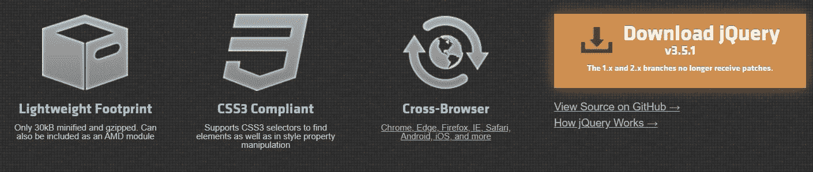](https://kinsta.com/wp-content/uploads/2021/03/jquery.jpg)

jQuery library

**特性/优点:**

*   它有一个简单易用的 API。
*   它使用 CSS3 选择器来操作样式属性和查找元素。
*   jQuery 是轻量级的，只需要 30 kb 来压缩和缩小，并且支持 AMD 模块。
*   由于其语法与 CSS 非常相似，因此初学者很容易学习。
*   可扩展插件。
*   API 支持多种浏览器，包括 Chrome 和 Firefox。

**用例:**

*   使用 CSS 选择器的 DOM 操作，使用特定的标准在 DOM 中选择一个节点。这些标准包括元素名及其属性(如类和 id)。
*   使用 Sizzle(一个开源的多浏览器选择器引擎)在 DOM 中选择元素。
*   创建效果、事件和动画。
*   JSON 解析。
*   Ajax 应用程序开发。
*   特征检测。
*   用承诺和延迟对象控制异步处理。

### React.js

[React.js](https://reactjs.org/) (也称为 ReactJS 或 React)是一个开源的前端 JavaScript 库。它是由在脸书工作的软件工程师乔丹·沃克于 2013 年创建的。

现在，它拥有 MIT 许可证，但最初是在 Apache 许可证 2.0 下发布的。React 旨在使交互式 UI 创建变得轻松。

只需在你的应用程序中为各个州设计一个简单的视图。接下来，它将在数据更改时高效地呈现和更新正确的组件。

[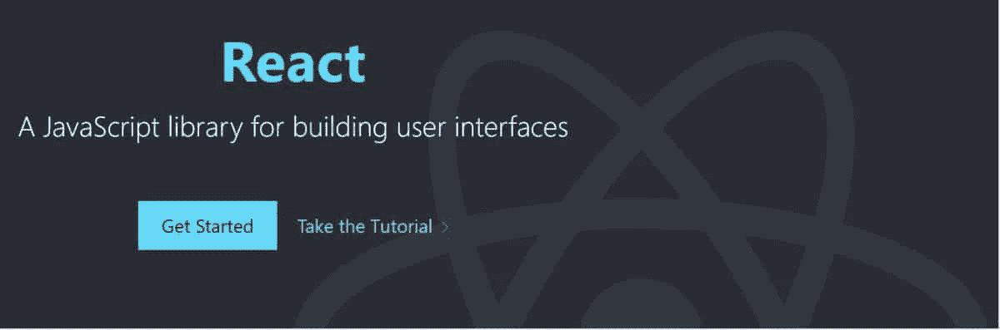](https://kinsta.com/wp-content/uploads/2021/03/reactjs1.jpg)

React library

**特性/优点:**

*   React 代码包含需要借助 React DOM 库呈现给 DOM 中特定元素的组件或实体。
*   它通过在数据结构中创建内存缓存、计算差异并有效地更新浏览器中的显示 DOM 来使用虚拟 DOM。
*   由于这种选择性渲染，应用程序的性能得到了提升，同时节省了开发人员重新计算页面布局、 [CSS 样式](https://kinsta.com/blog/wordpress-css/#what-is-css-editing)和整页渲染的工作量。
*   它使用像 render 和 componentDidMount 这样的生命周期方法来允许代码在实体生命周期的特定点执行。
*   它支持结合了 JS 和 HTML 的 JavaScript XML (JSX)。它有助于嵌套元素、属性、JS 表达式和条件语句的组件呈现。

**用例:**

*   作为开发移动或单页应用程序的基础。
*   向 DOM 呈现一个状态并管理它。
*   在开发 web 应用程序和交互式网站时构建高效的用户界面。
*   调试和测试更加容易。

一个加分点:[脸书](https://kinsta.com/blog/facebook-statistics/)，Instagram，Whatsapp 都用 React。

### D3.js

Data-Driven Documents (D3)或 [D3.js](https://d3js.org/) 是另一个著名的 js 库，开发人员用它来基于数据进行文档操作。它于 2011 年在 BSD 许可下发布。

D3.js library

**特性/优点:**

*   它强调 web 标准，为你提供现代的浏览器功能，而不局限于单一的框架。
*   D3.js 支持强大的数据可视化。
*   它支持 HTML、CSS 和 SVG。
*   采用数据驱动的方法并应用它来操作 DOM。
*   D3.js 速度很快，支持动画和交互的大量动态行为和数据集。
*   它减少了开销，在高帧速率下允许更大的图形复杂度。

**用例:**

*   以产生交互式和动态的数据可视化。
*   将数据绑定到 DOM 并对其执行数据驱动的转换。例如，您可以从数字数组中生成 HTML 表格，然后使用 D3.js 创建 SVG 条形图或 3D 曲面图。
*   它的功能代码使得它可以与大量的模块集合一起重用。
*   D3 提供了各种方式来改变节点，比如通过声明的方式改变样式或属性，添加、排序或删除节点，改变文本或 HTML 内容等。
*   创建动画转场，通过事件对复杂转场排序，执行 CSS3 转场等。

### 下划线. js

[下划线](https://underscorejs.org/)是一个 JavaScript 实用程序库，为典型的编程任务提供了各种函数。它是由 Jeremy Askenas 在 2009 年创建的，并获得了麻省理工学院的许可。现在，洛达什已经超过了它。

Underscore library

**特性/优点:**

*   它的特性类似于 Prototype.js(另一个流行的实用程序库)，但是 Underscore 具有函数式编程设计，而不是对象原型扩展。
*   它有 4 种不同类型的 100 多个函数，基于它们操作的数据类型。这些是要操作的功能:

*   下划线兼容 [Chrome、Firefox、Edge 等等](https://kinsta.com/browser-market-share/)。

**用例:**

它支持过滤器、地图等功能助手。，以及诸如绑定、快速索引、JavaScript 模板、质量测试等专门功能。

### 洛达什

Lodash 也是一个 JS 实用程序库，可以更容易地处理数字、数组、字符串、对象等。它于 2013 年发布，也使用了类似下划线. js 的函数式编程设计。

Lodash library

**特性/优点:**

*   它帮助您编写可维护的、简洁的 JavaScript 代码。
*   简化常见任务，如数学运算、绑定、节流、修饰、约束、去抖动等。
*   像修剪、骆驼大小写和大写字母这样的字符串函数变得更简单。
*   创建、修改、压缩和排序数组。
*   对集合、对象和序列的其他操作。

**用例:**

其模块化方法可帮助您:

*   迭代数组、字符串和对象。
*   制作复合函数。
*   操作和测试值。

### 阿尔戈利亚广场

Algolia Places 是一个 JavaScript 库，它提供了一种在你的站点上使用地址自动完成的简单和分布式的方法。这是一个惊人的快速和惊人的准确的工具，可以帮助提高您的网站用户体验。Algolia Places 利用 OpenStreetMap 令人印象深刻的开源数据库来覆盖全球各地。

例如，你可以用它来[提高你的产品页面转化率](https://kinsta.com/blog/conversions-woocommerce-product-pages/#boost-product-page-conversions)。

Algolia Places library

**特性/优点:**

*   它通过同时填充多个输入来简化检查。
*   您可以毫不费力地使用国家或城市选择器。
*   您可以通过在地图上实时显示链接建议来快速查看结果。
*   Algolia Places 可以处理输入错误，并相应地显示结果。
*   它通过将所有查询自动路由到最近的服务器，在几毫秒内提供结果。

**用例:**

*   允许你合并一张地图来显示一个非常有用的特定位置。
*   它使您能够有效地使用表单。

### Anime.js

如果你想给你的网站或应用程序添加动画， [Anime.js](https://animejs.com/) 是你能找到的最好的 JavaScript 库之一。它于 2019 年发布，是一款轻量级的产品，具有强大而简单的 API。

[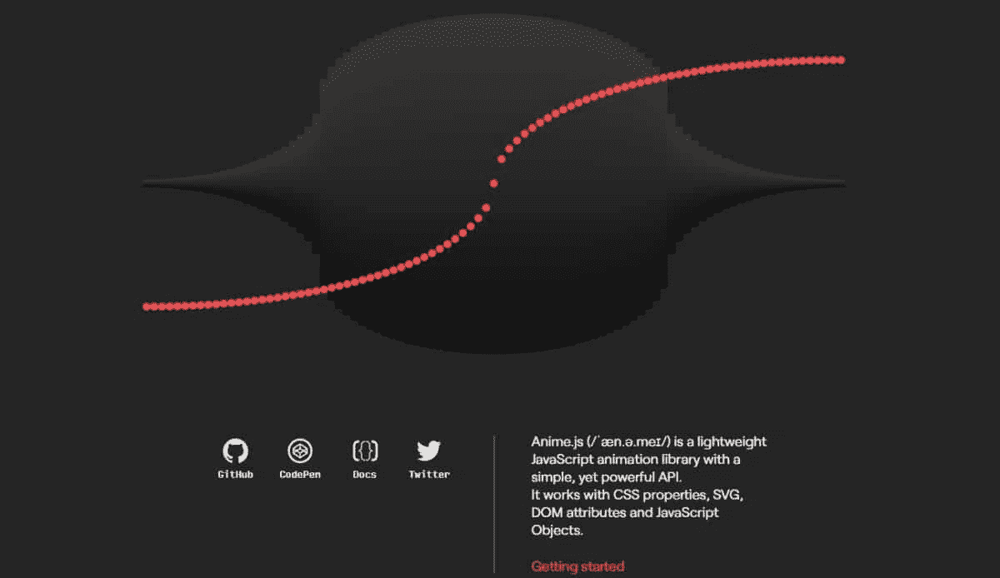](https://kinsta.com/wp-content/uploads/2021/03/anime-1.jpg)

Anime.js library

**特性/优点:**

*   Anime.js 使用 DOM 属性、CSS 属性、 [SVG](https://kinsta.com/blog/what-is-an-svg-file/) 、CSS 变换和 js 对象运行。
*   适用于各种浏览器，如 Chrome、Safari、Firefox、Opera 等。
*   它的源代码很容易破译和使用。
*   复杂的动画方法，如重叠和交错跟进变得更加容易。

**用例:**

*   可以使用 Anime.js 在属性和计时上的错开系统。
*   在一个 HTML 元素上同时创建具有多个计时的分层 CSS 转换。
*   使用 Anime.js 回调和控制功能以同步方式播放、暂停、触发、反转和控制事件。

### 卷轴动画(AOS)

[滚动动画](https://michalsnik.github.io/aos/)非常适合单页视差网站。这个 JS 库是完全开源的，它可以帮助你在你的页面上添加[像样的动画](https://kinsta.com/blog/web-design-trends/#more-effects-and-animations)，当你上下滚动的时候看起来很可爱。

它通过帮助你添加淡入淡出效果、静态锚点位置等来取悦你的用户，从而使你的网站设计充满乐趣。

Animate On Scroll library

**特性/优点:**

*   当元素出现在视口中时，库可以检测元素位置并添加合适的类。
*   除了可以轻松添加动画，它还可以帮助您在视口中更改动画。
*   它可以在不同的设备上无缝运行，无论是手机、平板电脑还是电脑，
*   因为它是用纯 JavaScript 编写的，所以没有依赖性。

**用例:**

*   根据一个元素的位置制作另一个元素的动画。
*   根据元素在屏幕上的位置制作动画。
*   禁用手机上的元素动画。
*   创建不同的动画，如淡入淡出，翻转，滑动，缩放，锚点放置等。

### Bideo.js

你想把全屏视频合并到你的网站背景中吗？试试 [Bideo.js](https://rishabhp.github.io/bideo.js/) 。

[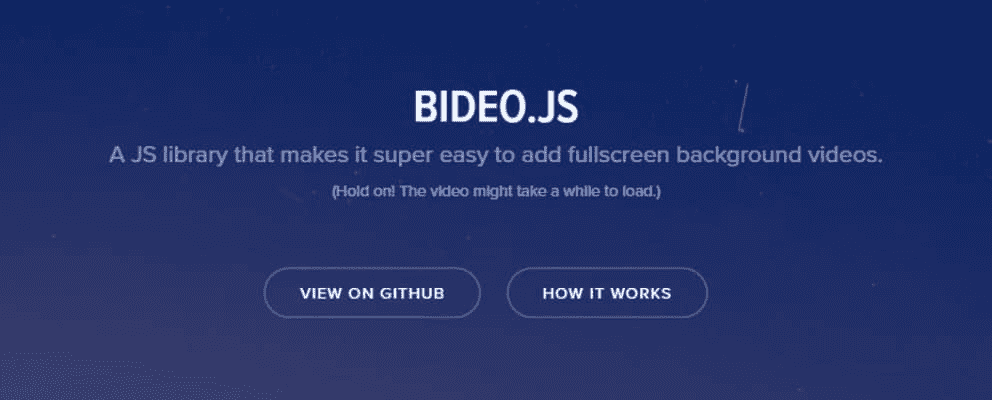](https://kinsta.com/wp-content/uploads/2021/03/bideojs-1.jpg)

Bideo.js library

**特性/优点:**

*   使用这个 JavaScript 库，添加视频背景很容易。
*   这项功能在不同比例和大小的屏幕上看起来很酷，并且运行流畅。
*   添加的视频可以根据使用的浏览器调整大小。
*   使用 CSS/HTML 易于实现。

**用例:**

在网站上添加[响应全屏背景视频](https://kinsta.com/blog/wordpress-background-image/#adding-unique-background-images-with-brizy)。

### Chart.js

你的网站或项目是否与数据分析领域相关？

你需要提供大量的统计数据吗？

Chart.js 是一个非常好的 JavaScript 库。

Chart.js 是一个灵活而简单的库，设计人员和开发人员可以立即将漂亮的图表和图形添加到他们的项目中。它是开源的，有麻省理工学院的许可。

[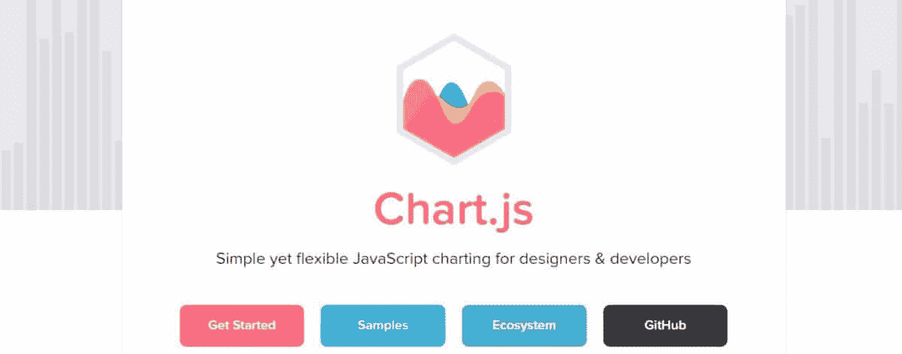](https://kinsta.com/wp-content/uploads/2021/03/chartjs-1.jpg)

Chart.js library

**特性/优点:**

*   优雅而简单地添加基本的图表和图形。
*   结果在[响应网页](https://kinsta.com/blog/responsive-web-design/)中。
*   轻量级加载，易于学习和实现。
*   8 种不同类型的图表。
*   非常适合初学者。
*   动画功能使页面更具互动性。

**用例:**

*   在混合图表类型的帮助下使用不同数据集时，提供清晰的可视化表示。
*   以对数、日期、时间或自定义比例绘制稀疏和复杂的数据集。

### Cleave.js

如果你想格式化你的文本内容，Cleave.js 提供了一个有趣的解决方案。它的创建旨在提供一种更简单的方法，通过格式化类型化数据来增加输入字段的可读性。

这样，您不再需要屏蔽模式或编写正则表达式来格式化文本。

Cleave.js library

**特性/优点:**

*   为[表单提交](https://kinsta.com/blog/contact-form-7/#how-to-create-a-wordpress-contact-form)提供一致的数据，提升用户体验。
*   您可以对信用卡号码、电话号码、日期、时间和数字执行不同的格式类型。
*   格式化自定义块、前缀和分隔符。
*   支持 ReactJS 组件等等。

**用例:**

*   用 CSS 选择器对多个 DOM 元素实现 cleave.js。
*   更新特定的原始值。
*   获取文本字段的引用。
*   在 Vue.js、jQuery 和 Playground 中，它与 redux 表单一起使用。

### 编舞师. js

使用 [Chreographer.js](https://christinecha.github.io/choreographer-js/) 有效地制作复杂 CSS 的动画。它甚至可以为非 CSS 动画添加更多自定义函数。

要使用这个 JavaScript 库，通过 npm 安装它的包或添加它的脚本文件。

[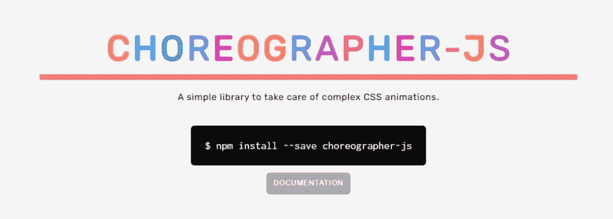](https://kinsta.com/wp-content/uploads/2021/03/choreographerjs-1.jpg)

Choreographer.js library

**特性/优点:**

*   它的动画类管理单个动画数据。
*   animationConfig 对象配置每个动画实例。
*   包括两个内置动画功能“变化”和“缩放”
*   “Scale”用于将渐进测量值映射到节点的样式属性。
*   “更改”删除或添加样式属性。

**用例:**

*   执行即时滚动动画。
*   根据鼠标移动创建动画。

### 少许

2017 年发布的 [Glimmer](https://glimmerjs.com/) 采用了轻量级和快速的 UI 组件。它使用强大的 Ember CLI，并可以作为一个组件与 EmberJS 一起工作。

[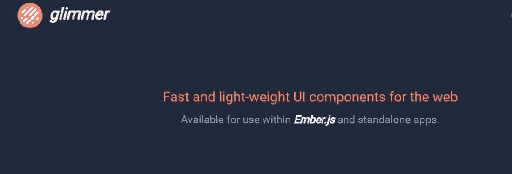](https://kinsta.com/wp-content/uploads/2021/03/glimmer-1.jpg)

Glimmer library

**特性/优点:**

*   Glimmer 是一个快速的 DOM 渲染引擎，可以为渲染和更新提供令人难以置信的性能。
*   它是多功能的，可以与您当前的技术堆栈一起工作，而不需要您重写代码。

**用例:**

*   您可以将它作为一个独立的组件使用，或者将其作为一个 [web 组件](https://kinsta.com/blog/web-components/)添加到现有应用程序中。
*   DOM 渲染。
*   它帮助您区分静态和动态内容。
*   当你想使用 Ember 的功能，但在一个更轻的包时，使用 Glimmer。

### Granim.js

Granim.js 是一个 js 库，可以帮助你创建流畅的交互式渐变动画。这样，你可以用丰富多彩的背景使你的网站脱颖而出。

[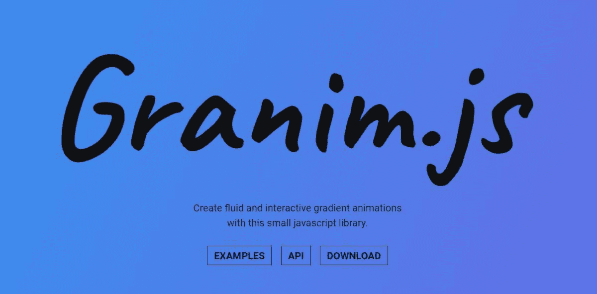](https://kinsta.com/wp-content/uploads/2021/03/granimjs.jpg)

Granim.js library

**特性/优点:**

*   渐变可以覆盖图像、独立工作、在图像遮罩下滑动等等。
*   您可以使用百分比或像素值来自定义渐变方向。
*   将渐变方向设置为对角线、上下、左右、放射状或自定义。
*   随着状态的变化，以毫秒(ms)为单位设置动画持续时间。
*   自定义渐变颜色和位置。
*   基于画布位置、来源、缩放比例等的图像定制。
*   其他选项包括设置回调、发出事件、渐变控制方法等。

**用例:**

*   使用 3 种渐变和 2 种颜色创建一个基本的渐变动画。
*   使用 2 种渐变和 3 种颜色的复杂渐变动画。
*   使用一个背景图像、两种颜色和一种混合模式制作渐变动画。
*   使用一个图像遮罩在特定形状下创建渐变动画。
*   创建响应事件的渐变动画。

### 全页. js

开源的 JS 库， [fullPage.js](https://github.com/alvarotrigo/fullPage.js/) ，帮助你轻松创建全屏滚动的网站或者单页网站。它使用简单，还可以[在你的站点部分添加一个横向滑块](https://kinsta.com/blog/wordpress-slider/#best-wordpress-slider-plugin-options-in-2021)。

[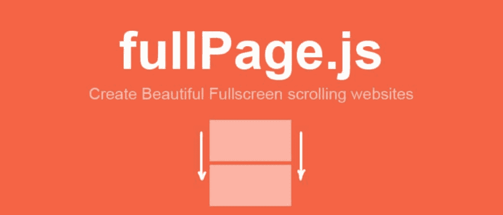](https://kinsta.com/wp-content/uploads/2021/03/fullpage.jpg)

fullpage.js library

**特性/优点:**

*   提供广泛的定制和配置选项。
*   支持 JavaScript 框架，如 [react-fullpage](https://alvarotrigo.com/react-fullpage/) 、 [angular-fullpage](https://alvarotrigo.com/angular-fullpage/) 和 [vue-fullpage](https://alvarotrigo.com/vue-fullpage/) 。
*   启用垂直和水平滚动。
*   [响应式设计](https://kinsta.com/blog/javascript-media-query/#why-is-responsive-design-important)适合不同尺寸的屏幕以及多种浏览器。
*   页面加载时自动滚动。
*   视频/图像延迟加载。

**用例:**

*   使用大量扩展来改进默认特性。
*   创建全屏滚动网站。
*   建立一个单页网站。

### 传单

传单是最好的 JavaScript 库之一，你可以用它在你的网站中加入交互式地图。它是开源的，移动友好的，重约 39kb。用于 WordPress 插件的[MapPress Maps](https://kinsta.com/blog/wordpress-map-plugin/#2-mappress-maps-for-wordpress)使用传单来驱动它的交互式地图。

Leaflet library

**特性/优点:**

*   提供移动硬件加速和 CSS 功能等性能特性。
*   独特的图层，包括切片图层、弹出窗口、标记、矢量图层、GeoJSON 和影像叠加。
*   交互功能，包括拖动平移、缩放、键盘导航、事件等。
*   地图控件，如图层切换器、属性、比例和缩放按钮。
*   支持 Chrome、Safari、Firefox、Edge 等浏览器。
*   定制，包括 OOP 工具、HTML 和基于图像的标记、CSS3 控件和弹出窗口。

**用例:**

通过更好的缩放和平移、智能多边形/折线渲染、模块化构建和点击延迟移动动画，将地图添加到您的站点中。

### Multiple.js

[Multiple.js](https://multiple.js.org/) 通过使用 CSS 或 HTML，无需 JavaScript 坐标处理，即可实现跨各种元素的背景图像共享。

因此，它创造了一个惊人的视觉效果，以增加更多的用户互动。

[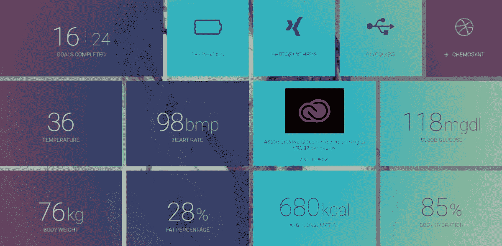](https://kinsta.com/wp-content/uploads/2021/03/multiple-1.jpg)

Multiple.js library

**特性/优点:**

*   支持多种背景。
*   渐变不透明度支持。
*   支持许多手机和网络浏览器。

**用例:**

*   分享[背景图片](https://kinsta.com/blog/wordpress-background-image/)。

### Moment.js

[Moment.js](https://momentjs.com/) 帮助你在不同时区、API 调用、[本地语言](https://kinsta.com/blog/ecommerce-statistics/#personalization-and-localization)等工作时有效管理时间和日期。

您可以通过验证、解析、格式化或操作日期和时间来简化它们。

[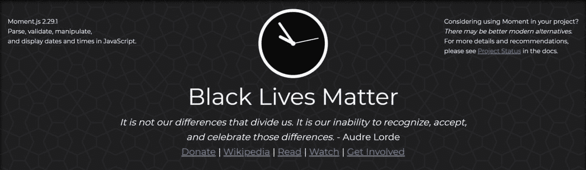](https://kinsta.com/wp-content/uploads/2021/03/momentjs-1.jpg)

Moment.js library

**特性/优点:**

*   它支持许多国际语言。
*   对象可变性。
*   多种内部属性，如纪元转换、检索本地日期对象等。
*   为了正确使用它的解析器，有一些指导原则，如严格模式、日期格式、宽容模式等。

**用例:**

*   在已发布的文章中显示时间。
*   用当地语言与世界各地的人交流。

### 砖石建筑

[Masonry](https://masonry.desandro.com/) 是一个牛逼的 JS 网格布局库。这个库可以根据可用的垂直空间大小，帮助您将网格元素放置在合适的位置。它甚至被一些流行的[图片库 WordPress 插件](https://kinsta.com/blog/wordpress-photo-gallery-plugins/)使用。

相比之下，石匠在砌墙时是如何安装石头的。

[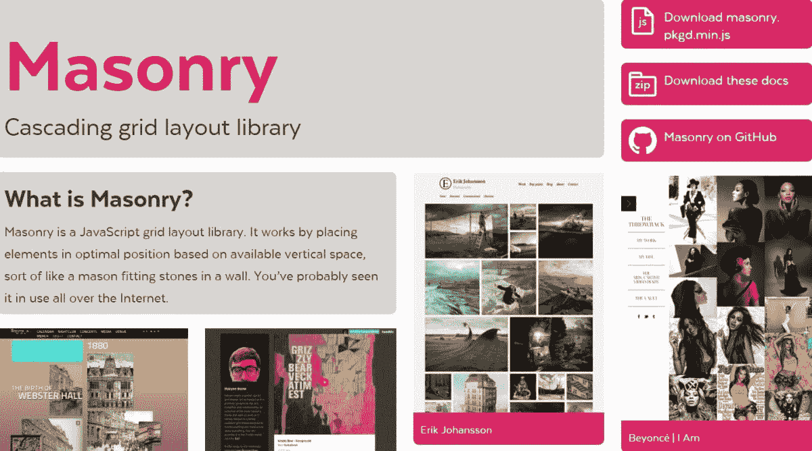](https://kinsta.com/wp-content/uploads/2021/03/masonry.jpg)

Masonry library

**特性/优点:**

*   Masonry 的网格布局基于列，没有固定的行高。
*   通过消除不必要的间隙来优化网页上的空间。
*   在不影响布局结构的情况下对元素进行排序和过滤。
*   动画效果。
*   动态元素，自动调整布局以获得最佳结构。

**用例:**

*   创建具有不同图像尺寸的图库。
*   在多个专栏中列出最新的博客文章，同时保持一致性，即使它们的摘要长度不同。
*   [代表组合项目](https://kinsta.com/blog/wordpress-portfolio-plugins/)如图像、设计、项目等。

### 无所不知的

是一个 js 库，它提供了 React 组件抽象，用于包含不可变数据的即时自顶向下呈现。

这个库可以帮助您无缝地构建您的项目，因为它已经过优化并提供了有趣的功能。

[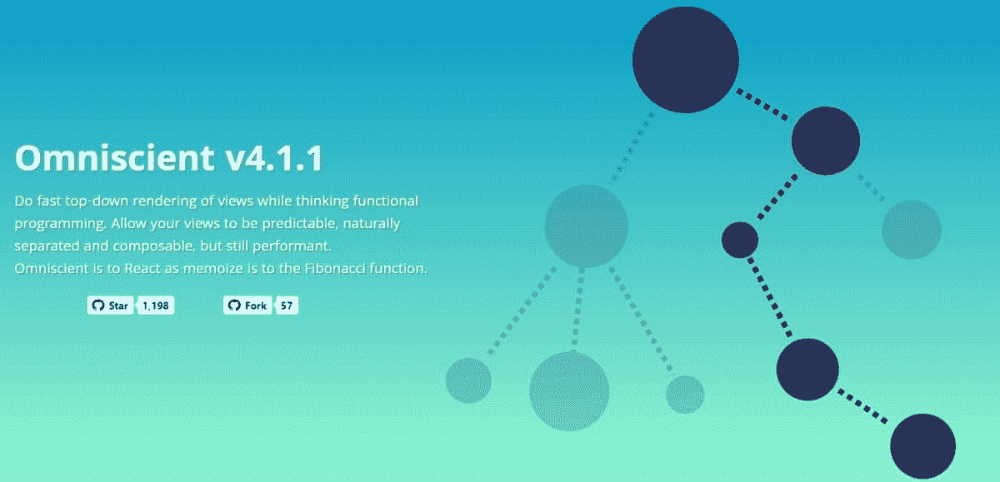](https://kinsta.com/wp-content/uploads/2021/03/omniscient-1.jpg)

Omniscient library

**特性/优点:**

*   记忆无状态的 React 组件。
*   用户界面的函数式编程。
*   自顶向下组件呈现。
*   使用 Immutable.js 支持不可变数据。
*   使用 mixins 支持具有共享功能的小型可组合组件。

**用例:**

*   以提供组件密钥。
*   使用辅助函数或构造与父代码对话。
*   覆盖组件。
*   过滤和调试。

### 欧芹

是否要将表单添加到项目中？

如果是的话，[欧芹](http://parsleyjs.org/)可能对你有用。这是一个简单而强大的 JS 库，可以用来验证表单。

[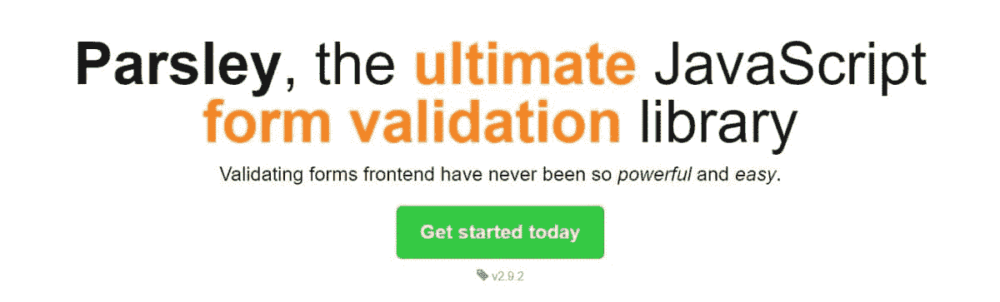](https://kinsta.com/wp-content/uploads/2021/03/parsley-1.jpg)

Parsley library

**特性/优点:**

## 注册订阅时事通讯

### 想知道我们是怎么让流量增长超过 1000%的吗？

加入 20，000 多名获得我们每周时事通讯和内部消息的人的行列吧！

[Subscribe Now](#newsletter)

*   其直观的 DOM API 直接从 HTML 标记中获取输入，不需要您编写 JS 行
*   通过动态检测表单修改进行动态表单验证
*   12+内置验证器、Ajax 验证器和其他扩展
*   您可以覆盖荷兰芹的默认行为，并提供用户界面和 UX 集中的经验
*   免费、开源、超级可靠，可以在许多浏览器上运行

**用例:**

*   创建简单的表单
*   进行复杂的验证
*   创建多步表单
*   验证多个输入
*   处理承诺和 Ajax 请求
*   设计输入以创建精致的浮动错误标签

### 波普. js

创建 Popper.js 是为了更容易定位弹出窗口、下拉菜单、工具提示和其他出现在按钮或其他类似元素附近的上下文元素。

Popper 提供了一种很好的方式来排列它们，将它们粘贴到其他站点元素上，并使它们能够在任何屏幕尺寸上无缝地执行。

Popper.js library

**特性/优点:**

*   大约 3kb 大小的轻量级库
*   确保当您在滚动容器内滚动时，工具提示继续停留在引用元素上
*   高级可配置性
*   使用 Angular 或 React 等强大的库来编写 ui，实现无缝集成

**用例:**

*   从头开始构建工具提示。
*   平稳地放置这些元素。

### 三. js

Three.js 可以让你的 3d 设计变得令人愉快。它使用 WebGL 在现代浏览器上渲染场景。如果您使用 IE 10 及更低版本，请使用其他 CSS3、CSS2 和 SVH 渲染器。

Three.js library

**特性/优点:**

*   支持 Chrome 9+，Opera 15+，Firefox 4+，IE 11，Edge 和 Safari 5.1
*   支持 JS 特性，比如类型化数组、Blob、Promise、URL API、Fetch 等等
*   你可以创建不同的几何图形，物体，灯光，阴影，加载器，材质，数学元素，纹理等。

**用例:**

*   创建几何立方体、球体等。
*   创建相机或场景

### Screenfull.js

使用 [Screenfull.js](https://github.com/sindresorhus/screenfull.js/) 将全屏元素添加到您的项目中。由于其令人印象深刻的跨浏览器效率，您在使用这个 JavaScript 库时不会遇到麻烦。

Screenfull.js library

**特性/优点:**

*   全屏显示页面或元素
*   隐藏手机上的导航用户界面
*   使用 jQuery 和 Angular 添加全屏元素。
*   检测全屏修改，错误等。

**用例:**

*   在网页上添加全屏元素
*   在文档中导入 Screenfull.js
*   退出并切换全屏模式
*   处理事件

### 聚合物

Google 的开源 JavaScript 库-[Polymer](https://polymer-library.polymer-project.org/)用于使用组件构建 web 应用。

[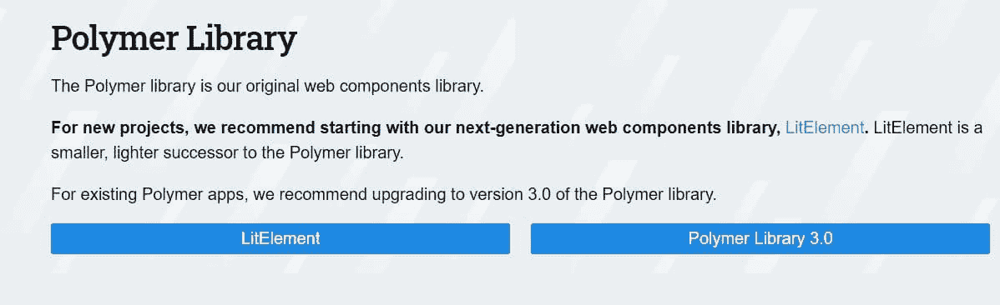](https://kinsta.com/wp-content/uploads/2021/03/polymerproject.jpg)

Polymer library

**特性/优点:**

*   创建自定义元素的简单方法。
*   计算属性。
*   支持两种数据绑定:单向和双向。
*   手势事件。

**用例:**

*   使用 JS、CSS 和 HTTP 创建带有自定义 web 组件的交互式 web 应用程序。
*   它被 YouTube、Google Earth 和 Play 等领先的网站和服务所使用。

### Voca

创建 [Voca](https://vocajs.com/) 的想法是为了减轻使用 JavaScript 字符串时的痛苦。它附带了一些有用的函数，可以很容易地操作字符串，比如改变大小写、填充、修剪、截断等等。

Voca library

**特性/优点:**

*   由于其模块化结构，整个库或其单个功能可以快速加载，同时减少了应用程序的构建。
*   提供截断、格式化、操作、查询和转义字符串的功能。
*   没有依赖关系

**用例:**

*   可以在 Node.js、Webpack、Rollup、Browserify 等多种环境中使用 Voca。
*   将主题转换为标题大小写、骆驼大小写、烤肉串大小写、蛇大小写、大写和小写。
*   将第一个字符转换为大写和小写。
*   创建包围主题的链对象，启用隐式/显式链序列。
*   执行其他操作，如计算字符数、格式化字符串等。

## 什么是 JavaScript 框架？

JavaScript 框架是允许开发人员操作代码以满足他们独特需求的应用程序框架。

Web 应用程序开发类似于建造房子。你可以选择用建筑材料从头开始创造一切。但这将耗费时间，并可能导致高昂的成本。

但是，如果你使用现成的材料，如砖，并根据建筑来组装它们，那么施工会变得更快，为你节省金钱和时间。

应用程序开发也是如此。您可以使用预先编写的代码作为基于应用程序架构的构建块，而不是从头开始编写每个代码。框架可以更快地适应网站设计，并使 JavaScript 的工作变得容易。

### 如何使用 JavaScript 框架

要使用 JavaScript 框架，请阅读您打算使用的 JS 框架文档，并按照步骤操作。

### JavaScript 框架是用来做什么的？

*   建立网站
*   前端应用程序开发
*   后端应用程序开发
*   混合应用程序开发
*   电子商务应用
*   构建模块化脚本，例如 Node.js
*   手动更新 DOM
*   使用模板和双向绑定自动执行重复性任务
*   开发视频游戏
*   创建图像传送带，
*   测试代码和调试
*   捆绑模块

## 最流行的 JavaScript 框架

### 安古斯

Google 的 AngularJS 是 2010 年发布的开源 JavaScript 框架。这是一个前端 JS 框架，可以用来创建 web 应用。

它的创建是为了通过 MVC 和 MVVM 客户端架构的框架来简化 web 应用程序的开发和测试。

[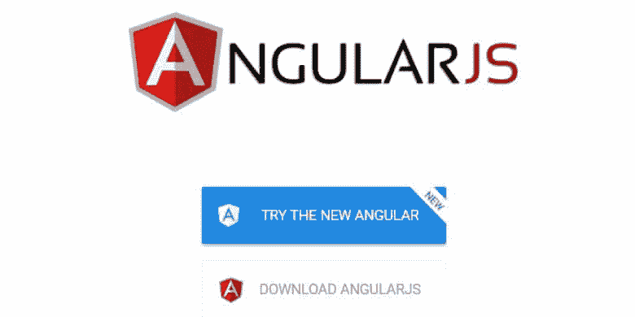](https://kinsta.com/wp-content/uploads/2021/03/angularjs.jpg)

AngularJS framework

**特性/优点:**

*   支持双向数据绑定
*   使用指令插入 HTML 代码，并为应用程序提供更好的功能
*   快速简单地声明静态文档
*   它的环境是可读的、富于表现力的，并且开发速度很快。
*   令人印象深刻的可扩展性和可定制性
*   内置的可测试性和对依赖注入的支持

**用例:**

*   开发电子商务应用程序。
*   为天气更新开发实时数据应用程序
*   例如:YouTube PlayStation 3

**注意:**谷歌已经停止了 AngularJS 的积极开发，但他们已经承诺继续对其进行[延长的长期支持](https://blog.angular.io/finding-a-path-forward-with-angularjs-7e186fdd4429)直到 2021 年 12 月 31 日，主要是为了修复安全问题。之后谷歌就不再支持了。

### 引导程序

使用最流行的前端开发开源工具包之一的 [Bootstrap](https://getbootstrap.com/) 快速设计快速的移动响应网站。

需要为您的客户站点提供超快的、安全的、开发人员友好的托管服务吗？Kinsta 是为开发人员设计的，它提供了大量具有强大仪表板的工具。[查看我们的计划](https://kinsta.com/plans/?in-article-cta)

它于 2011 年发布，为开发人员提供了极大的灵活性，可以根据客户的需求定制各种元素。

[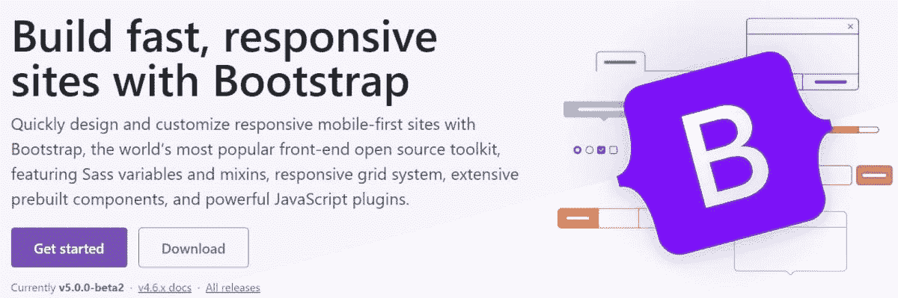](https://kinsta.com/wp-content/uploads/2021/03/bootstrap-1.jpg)

Bootstrap framework

**特性/优点:**

*   响应式网格系统。
*   强大的 JS 插件。
*   广泛的内置组件、Sass 变量和 mixins。
*   包括开源的 SVG 图标，这些图标可以很好地与它们的组件一起工作，并使用 CSS 进行样式化。
*   提供美丽和优质的主题。
*   它们确保您在更新新的引导版本时不必处理大量的错误。

**用例:**

*   为表单、按钮、版式、导航、下拉菜单、表格、模态等创建基于 CSS 或 HTML 的设计模板。
*   对于图像、图像转盘和图标。

### 蛹

发布于 2016 年， [Aurelia](http://aurelia.io/) 是一个简单、不引人注目、功能强大的开源前端 JS 框架，用于构建响应迅速的移动、桌面和浏览器应用。

它旨在将 web 规范与约定而不是配置结合起来，并且需要更少的框架干扰。

[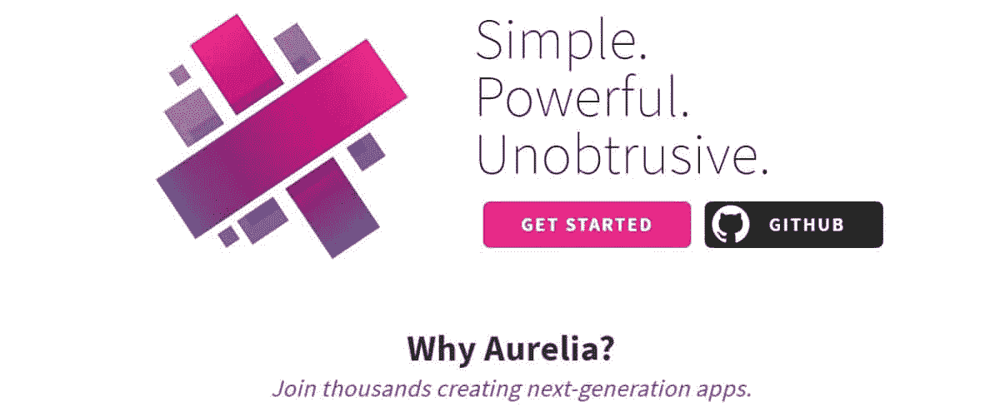](https://kinsta.com/wp-content/uploads/2021/03/aurelia-1.jpg)

Aurelia framework

**特性/优点:**

*   Aurelia 旨在高效地执行高性能和批量 DOM 更新。
*   即使使用复杂的 UI，也能提供一致且可扩展的性能。
*   具有状态管理、验证和国际化的广泛生态系统。
*   启用反应式绑定，并以高性能自动同步您的状态。
*   更简单的单元测试。
*   无与伦比的可扩展性，可以创建定制元素、添加属性、管理模板生成等。
*   利用高级客户端路由、UI 合成和渐进式增强。

**用例:**

*   来开发应用程序。
*   使用服务器端呈现。
*   执行双向数据绑定。

### view . js-检视. js

Vue.js 是尤雨溪在 2014 年为谷歌工作时创建的。它是一个用于构建用户界面的渐进式 JavaScript 框架。

Vue.js 可从其核心逐步采用，并可基于各种用例在框架和库之间轻松扩展。

[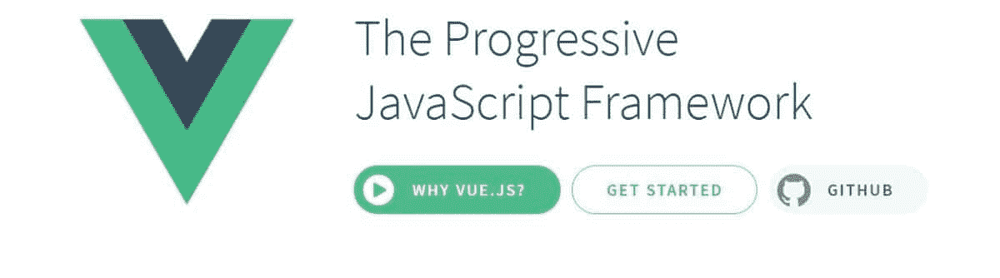](https://kinsta.com/wp-content/uploads/2021/03/vuejs-1.jpg)

Vue.js framework

**特性/优点:**

*   支持符合 ES5 的浏览器。
*   它有一个易于接近的核心库，只关注视图层。
*   它还支持其他有用的库，可以帮助您管理与单页应用程序相关的复杂性。
*   超快的虚拟 DOM，20 kb min+gzip 运行时，需要更少的优化。

**用例:**

*   非常适合在需要较少反应的小型项目中使用，显示一个模态，包括一个使用 Ajax 的表单等等。
*   您还可以使用它的 Vuex 和路由器组件在大型单页应用程序上使用它。
*   创建事件、绑定类、更新元素内容等。

### Ember.js

开源 JS 框架 [Ember.js](https://emberjs.com/) 经过了实战测试，可以高效地构建具有丰富 ui 的 web 应用程序，能够跨设备工作。

它于 2011 年发布，当时被命名为 SproutCore 2.0。

[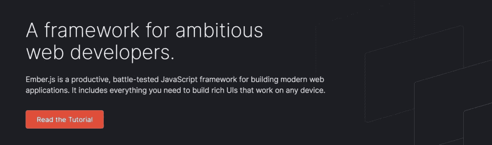](https://kinsta.com/wp-content/uploads/2021/03/emberjs-1.jpg)

Ember.js framework

**特性/优点:**

*   可扩展的用户界面架构。
*   “包括电池”视角帮助您找到立即开始构建应用程序所需的一切。
*   以 Ember CLI 为特色，作为 Ember 应用程序的主干，并为创建新实体提供代码生成器。
*   附带一个内置的开发环境，可以快速自动重新加载、重新构建和测试运行程序。
*   一流的路由器，使用带有查询参数和 URL 段的数据加载。
*   Ember Data 是一个数据访问库，可以同时处理多个数据源并保持模型更新。

**用例:**

*   来构建现代的交互式网络应用。
*   被 DigitalOcean、Square、Accenture 等使用。

### 节点. js

Node.js 是一个服务器端的开源 JavaScript 框架，基于 Chrome 的 JS V8 引擎，创建于 2009 年。它是一个在浏览器之外执行 JS 代码的运行时环境。

Node.js 旨在帮助您开发可伸缩、快速、可靠的基于网络的服务器端应用程序。

[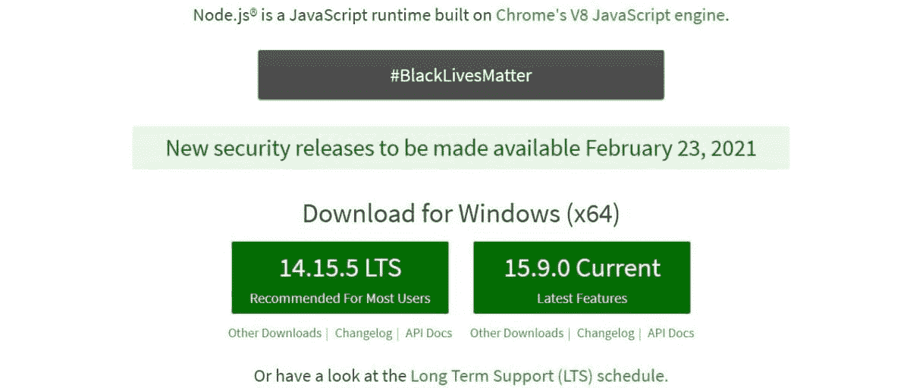](https://kinsta.com/wp-content/uploads/2021/03/nodejs-1.jpg)

Node.js framework

**特性/优点:**

*   更快的代码执行。
*   它可以使用其事件驱动架构来驱动异步 I/O。
*   显示了类似的 Java 属性，如形成包装、线程或形成循环。
*   单线程模型。
*   通过减少大量的处理时间，没有视频或音频缓冲的麻烦。

**用例:**

*   开发服务器端应用程序。
*   创建实时 web 应用程序。
*   交流项目。
*   开发浏览器游戏。
*   它的企业应用包括 GoDaddy、LinkedIn、网飞、PayPal、AWS、IBM 等等。

### 骨干网. js

轻量级 JS 框架 [Backbone.js](https://backbonejs.org/) 创建于 2010 年，基于 Model View Presenter (MVP)架构。

它有一个 RESTful JSON 接口，帮助您构建客户端 web 应用程序。它使用自定义事件和键值绑定的模型、使用高效 API 的集合以及使用声明性事件处理的视图来构建 web 应用程序。

[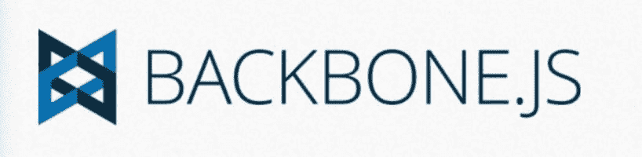](https://kinsta.com/wp-content/uploads/2021/03/backbonejs-1.jpg)

Backbone.js framework

**特性/优点:**

*   免费开源，有 100 多个可用的扩展。
*   令人印象深刻的设计，代码更少。
*   提供结构化和有组织的应用程序开发。
*   代码简单，易于学习和维护。
*   对 jQuery 的依赖性较弱，而对下划线. js 的依赖性较强。

**用例:**

*   开发简单页面的应用程序。
*   流畅的前端 JS 函数。
*   创建有组织的、定义良好的客户端移动或 web 应用程序。

### Next.js

[Next.js](https://nextjs.org/) 的开源平台提供了 React 前端 [JavaScript 框架](https://kinsta.com/topic/javascript-frameworks/)。它于 2016 年发布，允许您启用创建静态网站和服务器端渲染等功能。

[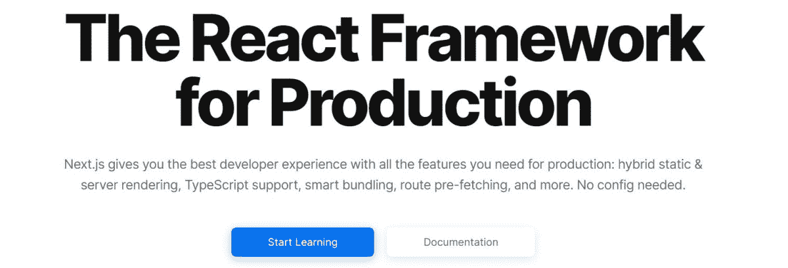](https://kinsta.com/wp-content/uploads/2021/03/nextjs-1.jpg)

Next.js framework

**特性/优点:**

*   使用即时构建自动优化图像。
*   内置域和子域路由和语言自动检测。
*   显示访问者数据和每页洞察的实时分析分数。
*   自动捆绑和编译。
*   您可以在请求时(SSR)或构建时(SSG)预呈现页面。
*   支持类型脚本、文件系统路由、API 路由、CSS、代码分割和捆绑等等。

**用例:**

*   这个生产就绪的框架允许您创建静态和动态 JAMstack 站点。
*   服务器端渲染。

### 摩卡

每个应用程序在部署之前都需要测试。这就是 [Mocha](https://mochajs.org/) 或 Mocha.js 为你做的事情。

它是一个功能丰富的开源 JS 测试框架，既可以在 Node.js 上运行，也可以在浏览器中运行。

[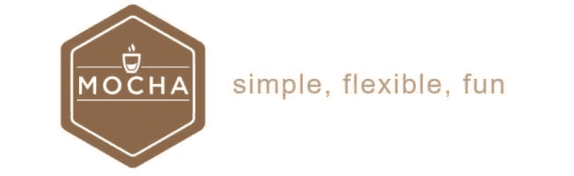](https://kinsta.com/wp-content/uploads/2021/03/mocha-1.jpg)

Mocha framework

**特性/优点:**

*   它让异步测试变得有趣而轻松。
*   允许同时运行 Node.js 测试。
*   自动检测并关闭非 TTY 流的颜色。
*   报告测试持续时间。
*   显示慢速测试。
*   元生成套件和测试用例。
*   支持多种浏览器，配置文件，节点调试器，源地图，咆哮，等等。

**用例:**

*   执行应用审计。
*   使用函数按照一定的顺序执行函数，并记录测试结果。
*   清理被测软件的状态，确保每个测试用例单独运行。

### 离子的

发布于 2013 年的 [Ionic](https://ionicframework.com/) 是一个开源的 JavaScript 框架，用于构建高质量的混合移动应用。它的最新版本允许你选择任何 UI 框架，比如 [Vue.js，Angular](https://kinsta.com/blog/angular-vs-vue/) ，或者 React。它使用 CSS、Sass 和 [HTML5](https://kinsta.com/blog/html-vs-html5/#what-is-html5) 来构建应用程序。

Ionic framework

**特性/优点:**

*   利用 Cordova 和电容器插件访问主机操作系统功能，如 GPS、摄像头、手电筒等。
*   包括版式、移动组件、交互式范例、漂亮的主题和自定义组件。
*   提供用于创建对象的 CLI。
*   启用推送通知，创建应用程序图标、本机二进制文件和闪屏。

**用例:**

*   来构建混合移动应用。
*   构建前端 UI 框架。
*   创造引人入胜的互动。

### Webix

易于使用的框架 [Webix](https://webix.com/) 帮助你通过使用较轻的代码开发丰富的 ui。它提供了 102 个用户界面小部件，如数据表、树、电子表格等。，以及功能丰富的 HTML5/CSS JS 控件。

[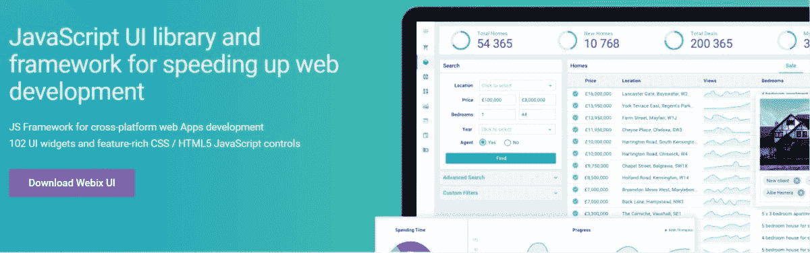](https://kinsta.com/wp-content/uploads/2021/03/webix-1.jpg)

Webix framework

**特性/优点:**

*   用户友好的 JS 文件管理。
*   通过使用内置的小部件和 UI 控件节省时间。
*   易于理解的代码。
*   跨平台和浏览器支持。
*   与其他 JavaScript 库和框架无缝集成。
*   快速渲染窗口小部件，甚至是像树、列表等大型数据集。
*   [符合 GDPR 和 HIPAA 标准](https://kinsta.com/blog/cloud-security/)以及无限的可扩展性和网络可访问性。

**用例:**

*   开发用户界面。
*   跨平台 web 应用程序开发。

### 盖茨比（姓）

[Gatsby](https://www.gatsbyjs.com/) 用 React 帮你开发快速运行的网站和应用。这是一个开源免费的前端 JS 框架。在 [GitHub](https://github.com/gatsbyjs/gatsby) 上看看这个。

[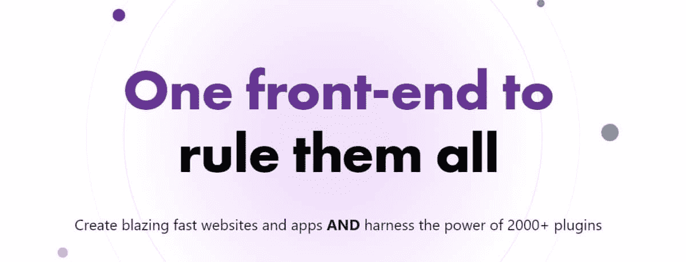](https://kinsta.com/wp-content/uploads/2021/03/gatsbyjs-1.jpg)

Gatsby framework

**特性/优点:**

*   通过自动代码分割、内联样式、图像优化、延迟加载等实现高性能。优化网站。
*   它的无服务器呈现在构建时创建 attic HTML。因此，没有服务器和 DDoS 攻击或恶意请求。
*   更高的网络可访问性。
*   2000 多个插件、主题和食谱。

**用例:**

*   前端 app 和网站开发。
*   静态站点生成。
*   服务器端渲染。
*   由 Airbnb 和 Nike 等网站使用，后者用于他们的“Just Do It”项目。

### 流星. js

[Meteor](https://www.meteor.com/) 是 2012 年发布的开源 JS 框架。它允许您为移动、桌面和 web 无缝构建全栈应用。

[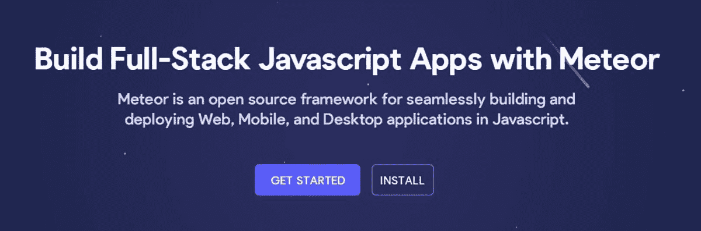](https://kinsta.com/wp-content/uploads/2021/03/meteorjs-1.jpg)

Meteor.js framework

**特性/优点:**

*   集成更多功能的工具和框架，如 MongoDB、React、Cordova 等。
*   在任何设备上构建应用程序。
*   APM 查看应用程序性能。
*   实时浏览器重新加载。
*   开源同构开发生态系统(IDevE ),方便从头开始开发。

**用例:**

*   快速原型制作。
*   跨平台应用。
*   用流星建造的站点:Pathable，Maestro，Chatra 等。

### 米特里尔斯

虽然不像列表中的其他一些项目那样受欢迎，但是 [Mithril](https://mithril.js.org/) 是一个开发客户端应用程序的高级客户端 JS 框架。它是轻量级的——不到 10kb gzip——但速度很快，并提供 XHR 和路由实用程序。

MithrilJS framework

**特性/优点:**

*   纯 JS 框架。
*   支持所有主流浏览器，无需 polyfills。
*   创建 Vnode 数据结构。
*   提供声明式 API 来管理 UI 复杂性。

**用例:**

*   单页应用程序。
*   由 Vimeo、Nike 等网站使用。

### ExpressJS

[Express.js](https://expressjs.com/) 是一个开发 web 应用的后端 js 框架。它于 2010 年以麻省理工学院的名义作为免费开源软件发布。

这是一个快速且极简的 Node.js web 框架，具有一系列有用的特性。

[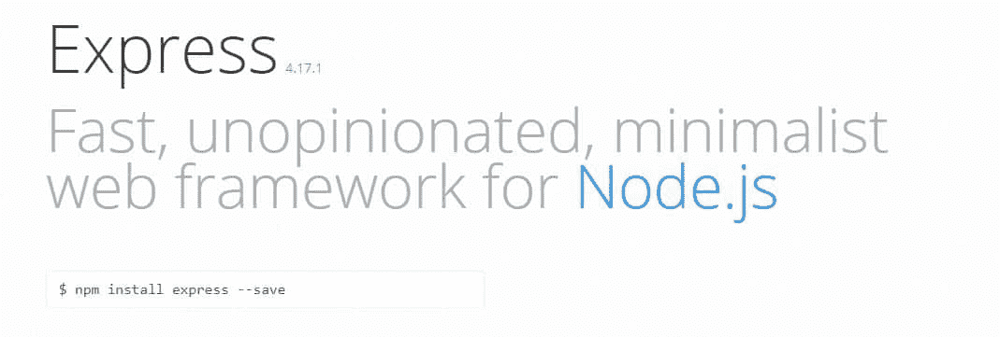](https://kinsta.com/wp-content/uploads/2021/03/express.jpg)

ExpressJS framework

**特性/优点:**

*   可扩展且轻量级。
*   通过允许您设置中间件来允许接收 HTTP 响应。
*   具有一个路由表，可以根据 URL 和 HTTP 方法采取行动。
*   包括动态 HTML 页面呈现。

**用例:**

*   基于节点的快速应用程序开发。
*   REST APIs 的创建。

## 一些必须知道的有用的 JavaScript 工具

*   ### Smooth

Slick 是一个有用的 JS 工具，可以满足你的 carousel 需求。它对其容器具有响应性和可伸缩性。它的特性包括 CSS3 支持，滑动，鼠标拖动，完全可访问性，无限循环，自动播放，[延迟加载](https://kinsta.com/blog/wordpress-lazy-load/)，等等。

*   ### Babylonian city

Babel 是一个开源的免费 JS 编译器，你可以用它来转换新的 JS 特性以运行旧的 JS 标准。该插件还用于旧版本不支持的语法转换。它提供聚合填充来支持某些 JS 环境中缺少的功能。

*   izi 模态

iziModal 是一个优雅、轻量、灵活、响应迅速的模态插件，可以与 jQuery 协同工作。这对于[通知你的用户](https://kinsta.com/blog/google-mobile-popup-penalty/#acceptable-popups)或者使用弹出模式询问信息是很有用的。它易于使用，并带有许多定制。

*   ### Eislint

使用 [ESLint](https://eslint.org/) 可以很容易地在 JS 代码中找到并修复 bug。它对代码进行统计分析，以快速捕捉语法错误、命令行风格问题等。，并自动修复它们。

*   ### razor

Shave 是一个零依赖性 JS 插件，你可以通过设置最大高度来截断 HTML 元素中的文本，以完全适应元素。它还在隐藏元素``中存储了一些额外的原始文本，确保您不会丢失这些文本。

*   ### network packet

Webpack 是一个为现代应用捆绑 JS 模块的工具。您可以编写代码并使用它来合理地捆绑您的资产，同时保持代码的整洁。

## JavaScript 库和框架如何协同工作

JavaScript 库和框架的区别在于它的控制流。它们只是在流动中相反，或者说颠倒了。

在 JS 库中，父代码调用库提供的函数。

在 JS 框架中，框架本身调用代码并以特定的方式使用它。它定义了整个应用程序设计。

简单地说，你可以把 JavaScript 库想象成一个特定的应用功能。相比之下，框架的作用就像它的骨架，而 API 则充当将它们连接在一起的连接器。

通常，开发人员从 JS 框架开始开发过程，然后用 JS 库和 API 的帮助完成应用程序功能。

[有这么多 JavaScript 框架&库可供选择，如何找到最适合你项目需求的呢？🤯我们整理了 40 个最佳选项，以及它们的好处&用例化繁为简✅ 点击推文](https://twitter.com/intent/tweet?url=https%3A%2F%2Fkinsta.com%2Fblog%2Fjavascript-libraries%2F&via=kinsta&text=With+so+many+JavaScript+frameworks+%26amp%3B+libraries+to+choose+from%2C+how+can+you+find+the+one+that+best+suits+your+project%27s+needs%3F+%F0%9F%A4%AF+We+compiled+the+40+best+options%2C+along+with+their+benefits+%26amp%3B+use+cases+to+make+thi...&hashtags=WebDev%2CJavaScript)

## 摘要

JavaScript 库和框架可以有效地加速你的网站或应用程序的开发过程。作为一名 web 开发人员，为你的项目使用正确的工具是至关重要的。如果你是 [Kinsta 的客户](https://kinsta.com/plans/?plan=visits-business1&interval=month)，你也可以利用[的代码缩小功能](https://kinsta.com/help/kinsta-cdn-code-minification)，它内置在 [MyKinsta 仪表板](https://kinsta.com/mykinsta/)中。这使得客户只需点击一下，就可以轻松实现 CSS 和 JavaScript 的自动缩小。

不同的库和框架服务于不同的目的，有各自的优缺点。因此，您需要根据您的独特需求以及与网站或应用程序相关的未来目标来选择它们。

我希望这个 JavaScript 库和框架的广泛列表能帮助您为下一个项目选择正确的库和框架。

* * *

让你所有的[应用程序](https://kinsta.com/application-hosting/)、[数据库](https://kinsta.com/database-hosting/)和 [WordPress 网站](https://kinsta.com/wordpress-hosting/)在线并在一个屋檐下。我们功能丰富的高性能云平台包括:

*   在 MyKinsta 仪表盘中轻松设置和管理
*   24/7 专家支持
*   最好的谷歌云平台硬件和网络，由 Kubernetes 提供最大的可扩展性
*   面向速度和安全性的企业级 Cloudflare 集成
*   全球受众覆盖全球多达 35 个数据中心和 275 多个 pop

在第一个月使用托管的[应用程序或托管](https://kinsta.com/application-hosting/)的[数据库，您可以享受 20 美元的优惠，亲自测试一下。探索我们的](https://kinsta.com/database-hosting/)[计划](https://kinsta.com/plans/)或[与销售人员交谈](https://kinsta.com/contact-us/)以找到最适合您的方式。