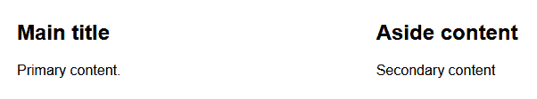

# 在 JavaScript 中使用媒体查询的完整指南

> 原文：<https://kinsta.com/blog/javascript-media-query/>

大多数现代网站使用[响应式网页设计](https://kinsta.com/blog/responsive-web-design/)技术，以确保它们看起来不错，可读，并在任何屏幕尺寸的设备上保持可用，如手机、平板电脑、笔记本电脑、台式电脑显示器、电视、投影仪等。

使用这些技术的站点只有一个模板，它可以根据屏幕尺寸修改布局:

*   较小的屏幕通常显示一个线性的单列视图，通过点击(汉堡包)图标来激活 UI 控件，如[菜单](https://kinsta.com/blog/wordpress-menu-plugins/)。
*   更大的屏幕显示更多的信息，也许还有水平排列的侧边栏。诸如菜单项之类的 UI 控件可能总是可见的，以便于访问。

响应式 web 设计的一个重要部分是实现一个 [CSS](https://kinsta.com/blog/wordpress-css/) 或 JavaScript 媒体查询来检测设备尺寸，并自动提供适合该尺寸的设计。我们将讨论为什么这些查询是重要的，以及如何使用它们，但首先，让我们讨论一下响应式设计的一般情况。

## 为什么响应式设计很重要？

提供一个[单页面布局](https://kinsta.com/blog/responsive-web-design/)并期望它在任何地方都能工作是不可能的。

当手机在 21 世纪初首次获得基本的网络访问时，网站所有者通常会围绕手机和桌面视图创建两到三个独立的页面模板。随着设备种类呈指数级增长，这变得越来越不切实际。

今天，屏幕尺寸多种多样，从微型手表显示器到 8 K 显示器甚至更大。即使只考虑手机，最近的设备也能有比很多低端笔记本电脑更高的分辨率。


> 需要在这里大声喊出来。Kinsta 太神奇了，我用它做我的个人网站。支持是迅速和杰出的，他们的服务器是 WordPress 最快的。
> 
> <footer class="wp-block-kinsta-client-quote__footer">
> 
> 
> 
> <cite class="wp-block-kinsta-client-quote__cite">Phillip Stemann</cite></footer>

[View plans](https://kinsta.com/plans/)

手机的使用也已经超过了台式电脑。除非你的网站有特定的用户群，否则你可以预期大多数人会通过智能手机访问它。小屏幕设备不再是事后才想到的，应该从一开始就考虑，尽管大多数网页设计者、开发者和客户继续使用标准 PC。

谷歌已经认识到移动设备的重要性。当网站在智能手机上可用且运行良好时，它们在谷歌搜索中的排名会更好。好的内容仍然是至关重要的，但是一个不能适应你的用户群屏幕尺寸的缓慢加载的网站可能会损害你的业务。

最后，考虑可访问性。一个适合所有人的网站，不管他们使用什么设备，都会吸引更多的观众。在许多国家，可访问性是一项法律要求，但即使你不在那里，也要考虑到更多的观众会带来更多的转化和更高的利润。

## 响应式设计是如何工作的？

响应式设计的基础是[媒体查询](https://developer.mozilla.org/docs/Web/CSS/Media_Queries):一种 CSS 技术，可以根据输出类型(屏幕、打印机甚至语音)、屏幕尺寸、显示纵横比、设备方向、颜色深度和指针准确度等指标应用样式。媒体查询也可以考虑用户偏好，包括简化的动画、亮/暗模式和更高的对比度。

我们展示的例子演示了仅使用屏幕宽度的媒体查询，但是站点可以更加灵活。详情请参考 MDN 上的[全套选项。](https://developer.mozilla.org/docs/Web/CSS/Media_Queries/Using_media_queries)

[媒体查询支持非常出色](https://caniuse.com/css-mediaqueries)在浏览器中已经存在十多年了。只有 IE8 及以下不支持。他们会忽略媒体查询所应用的样式，但这有时会是一个好处(在下面的**最佳实践**部分阅读更多)。

使用媒体查询应用样式有三种标准方法。第一个在 [HTML 代码](https://kinsta.com/blog/html-vs-html5/)中加载特定的样式表。例如，当设备的屏幕至少有 800 像素宽时，下面的标记加载 **wide.css** 样式表:

```

```

其次，可以使用一个`@import` at-rule 将样式表有条件地加载到 CSS 文件中:

```
/* main.css */
@import url('wide.css') screen and (min-width: 800px);
```


### 信息

注意应该避免使用`@import`，因为每个导入的 CSS 文件都是渲染阻塞的。HTML ``标签是并行下载的，而`@import`是串行下载的。


更典型的是，您将使用修改特定样式的@media CSS at-rule 块在样式表中应用媒体查询。例如:

```
/* default styles */
main {
  width: 400px;
}

/* styles applied when screen has a width of at least 800px */
@media screen and (min-width: 800px) {
  main {
    width: 760px;
  }
}
```

开发人员可以应用任何必要的媒体查询规则来调整站点的布局。


## 媒体查询最佳实践

当媒体查询首次被设计出来时，许多网站选择了一套严格固定的布局。这在概念上更容易设计和编码，因为它有效地复制了一组有限的页面模板。例如:

1.  小于 600 像素的屏幕宽度使用 400 像素的类似手机的布局。
2.  600 像素到 999 像素之间的屏幕宽度使用 600 像素宽的平板布局。
3.  大于 1000 像素的屏幕宽度使用 1000 像素宽的类似桌面的布局。

这项技术有缺陷。在非常小和非常大的屏幕上的结果可能看起来很差，并且 CSS 维护可能是必需的，因为设备和屏幕大小会随着时间而改变。

更好的选择是使用[移动优先的](https://kinsta.com/blog/google-mobile-first-index/)流体设计，该设计带有断点，以适应特定尺寸的布局。本质上，默认布局使用最简单的小屏幕样式，将元素放置在线性垂直块中。

例如，`<main>`容器中的`<article>`和``:

```
/* default small-screen device */
main {
  width: 100%;
}

article, aside {
  width: 100%;
  padding: 2em;
}
```

以下是所有浏览器的结果——甚至是不支持媒体查询的非常旧的浏览器:

[](https://kinsta.com/wp-content/uploads/2021/08/site-linear-example.png)

Example screenshot without media query support.


当支持媒体查询并且屏幕超过特定宽度(比如 500 像素)时，`<article>`和``元素可以水平放置。这个例子使用了一个 [CSS 网格](https://developer.mozilla.org/docs/Web/CSS/grid)，其中主要内容使用大约三分之二的宽度，次要内容使用剩余的三分之一:

```
/* larger device */
@media (min-width: 500px) {
  main {
    display: grid;
    grid-template-columns: 2fr 1fr;
    gap: 2em;
  }

  article, aside {
    width: auto;
    padding: 0;
  }
}
```

这是大屏幕上的结果:

[](https://kinsta.com/wp-content/uploads/2021/08/site-horizontal.png)

Example screenshot with media query support.


## 媒体查询备选方案

响应式设计也可以在现代 CSS 中使用更新的属性来实现，这些属性在本质上适应布局，而无需检查视口尺寸。选项包括:

*   `calc`、`min-width`、`max-width`、`min-height`、`max-height`以及更新的`clamp`属性都可以根据已知的限制和可用的空间来定义确定元素大小的维度。
*   视口单元`vw`、`vh`、`vmin`和`vmax`可以根据屏幕尺寸分数来调整元素的大小。
*   文本可以显示在 CSS 列中，这些列在空间允许的情况下出现或消失。
*   可以使用`min-content`、`fit-content`和`max-content`维度根据子元素的大小来调整元素的大小。
*   当元素开始超出可用空间时，CSS flexbox 可以换行(或者*不换行)。*
*   CSS 网格元素可以用比例分数`fr`单位来调整大小。重复 CSS 功能可与`minmax`、`auto-fit`和`auto-fill`结合使用，以分配可用空间。
*   新的和(目前)试验性的 [CSS 容器查询](https://developer.mozilla.org/docs/Web/CSS/CSS_Container_Queries)可以对布局中组件可用的部分空间做出反应。

这些选项超出了本文的范围，但是它们通常比粗糙的媒体查询更实用，后者只能响应屏幕尺寸。如果您可以实现一个没有媒体查询的布局，它可能会使用更少的代码，更有效，并且随着时间的推移需要更少的维护。

也就是说，有些情况下，媒体查询仍然是唯一可行的布局选项。当您需要考虑其他屏幕因素(如纵横比、设备方向、颜色深度、指针准确度)或用户偏好(如简化动画和亮/暗模式)时，它们仍然是必不可少的。

## JavaScript 中需要媒体查询吗？

到目前为止，我们主要讨论了 CSS。这是因为大多数布局问题都可以——而且*应该*——在 CSS 中单独解决。

然而，在某些情况下，使用 JavaScript 媒体查询代替 CSS 是可行的，例如:

*   一个组件，如菜单，在小屏幕和大屏幕上有不同的功能。
*   在纵向/横向之间切换会影响 web 应用程序的功能。
*   基于触摸的游戏必须改变`<canvas>`布局或调整控制按钮。
*   web 应用程序遵循用户偏好，如暗/亮模式、减少动画、触摸粗糙等。

接下来的部分演示了在 [JavaScript](https://kinsta.com/blog/vue-js/) 中使用媒体查询或者类似媒体查询的选项的三种方法。所有示例都返回一个状态字符串，其中:

*   **小**视图=宽度在 400 像素以下的屏幕；
*   **中等**视图=宽度在 400 到 799 像素之间的屏幕；和
*   **大**视图= 800 像素或更宽的屏幕。

## 选项 1:监控视口尺寸

在媒体查询实施之前的黑暗日子里，这是唯一的选择。JavaScript 会监听浏览器的“调整大小”事件，使用`window.innerWidth`和`window.innerHeight`(或者旧 ie 中的`document.body.clientWidth`和`document.body.clientHeight`)分析视窗尺寸，并做出相应的反应。

这段代码将计算出的**小**、**中**或**大**字符串输出到控制台:

```
const
  screen = {
    small: 0,
    medium: 400,
    large: 800
  };

// observe window resize
window.addEventListener('resize', resizeHandler);

// initial call
resizeHandler();

// calculate size
function resizeHandler() {

  // get window width
  const iw = window.innerWidth;

  // determine named size
  let size = null;
  for (let s in screen) {
    if (iw >= screen[s]) size = s;
  }

  console.log(size);
}
```

您可以在此查看[工作演示。(如果使用桌面浏览器，请在新窗口中打开此链接，以便于调整大小。移动用户可以旋转设备。)](https://codepen.io/craigbuckler/full/mdmBymR)

## 注册订阅时事通讯


### 想知道我们是怎么让流量增长超过 1000%的吗？

加入 20，000 多名获得我们每周时事通讯和内部消息的人的行列吧！

[Subscribe Now](#newsletter)

上面的示例在调整浏览器大小时检查了视区的大小；确定它是小、中还是大；并将其设置为 body 元素上的一个类，这会更改背景颜色。

这种方法的优点包括:

*   它适用于所有可以运行 JavaScript 的浏览器，甚至是古老的应用程序。
*   你捕捉到了准确的维度，并能做出相应的反应。

缺点是:

*   这是一项需要大量代码的老技术。
*   是不是太确切了？你真的需要知道什么时候宽度是 966px 对 967px 吗？
*   您可能需要手动将维度匹配到相应的 CSS 媒体查询。
*   用户可以快速调整浏览器的大小，每次都会重新运行处理函数。这可能会通过抑制事件而使较旧且较慢的浏览器过载。每 500 毫秒只能触发一次。

总之，除非您有非常具体和复杂的大小调整要求，否则不要监视视口尺寸。

## 选项 2:定义和监控 CSS 自定义属性(变量)

这是一种有点不寻常的技术，它在媒体查询被触发时改变 CSS 中自定义属性字符串的值。所有现代浏览器都支持自定义属性[(但不支持 IE)。](https://kinsta.com/blog/most-secure-browser/)

在下面的示例中，在@media 代码块中，`--screen custom property`被设置为“小”、“中”或“大”:

```
body {
  --screen: "small";
  background-color: #cff;
  text-align: center;
}

@media (min-width: 400px) {

  body {
    --screen: "medium";
    background-color: #fcf;
  }

}

@media (min-width: 800px) {

  body {
    --screen: "large";
    background-color: #ffc;
  }

}
```

可以使用伪元素在 CSS 中单独输出该值(但请注意，它必须包含在单引号或双引号中):

```
p::before {
  content: var(--screen);
}
```

您可以使用 JavaScript 获取自定义属性值:

```
const screen = getComputedStyle(window.body)
                 .getPropertyValue('--screen');
```

不过，这还不是全部，因为返回值包含 CSS 中冒号后定义的所有空格和引号字符。该字符串将会很“大”，因此需要稍微整理一下:

```
// returns small, medium, or large in a string
const screen = getComputedStyle(window.body)
                 .getPropertyValue('--screen')
                 .replace(/\W/g, '');
```

您可以在此查看[工作演示。(如果使用桌面浏览器，请在新窗口中打开此链接，以便于调整大小。移动用户可以旋转设备。)](https://codepen.io/craigbuckler/full/BaRwNzG)

该示例每两秒钟检查一次 CSS 值。它需要一点 JavaScript 代码，但是有必要对更改进行轮询——您无法使用 CSS 自动检测自定义属性值是否已更改。

需要一个给你带来竞争优势的托管解决方案吗？Kinsta 为您提供了令人难以置信的速度、一流的安全性和自动伸缩功能。[查看我们的计划](https://kinsta.com/plans/?in-article-cta)

也不可能将值写入伪元素并使用 [DOM 突变观察器](https://developer.mozilla.org/docs/Web/API/MutationObserver)来检测变化。伪元素不是 DOM 的“真实”部分！

优点:

*   这是一种简单的技术，主要使用 CSS 并匹配真实的媒体查询。
*   可以同时修改任何其他 CSS 属性。
*   不需要复制或解析 JavaScript 媒体查询字符串。

主要缺点是不能自动对浏览器视口尺寸的变化做出反应。如果用户将手机从纵向旋转到横向，JavaScript 永远不会知道。您可以频繁地轮询更改，但这是低效的，会导致您在我们的演示中看到的时间延迟。

监控 CSS 自定义属性是一种新颖的技术，但是只有在以下情况下才实用:

1.  布局可以固定在最初呈现页面的点上。一个售货亭或销售终端也是可能的，但是它们可能有固定的分辨率和单一的布局，所以 JavaScript 媒体查询变得无关紧要。
2.  该网站或应用程序已经运行频繁的基于时间的功能，如游戏动画。可以同时检查自定义属性，以确定是否需要更改布局。

## 选项 3:使用 matchMedia API

[matchMedia API](https://developer.mozilla.org/docs/Web/API/Window/matchMedia) 略有不同，但它允许您实现 JavaScript 媒体查询。从 IE10 开始，大多数浏览器都支持 T2。构造函数返回一个 [MediaQueryList 对象](https://developer.mozilla.org/docs/Web/API/MediaQueryList)，该对象具有一个 matches 属性，该属性针对其特定的媒体查询计算为 true 或 false。

当浏览器视区宽度为 800px 或更大时，以下代码输出 true:

```
const mqLarge  = window.matchMedia( '(min-width: 800px)' );
console.log( mqLarge.matches );
```

“更改”事件可以应用于 MediaQueryList 对象。每次 matches 属性的状态改变时都会触发该事件:在先前为假(低于 800 像素)之后变为真(高于 800 像素)，反之亦然。

将 MediaQueryList 对象作为第一个参数传递给接收处理程序函数:

```
const mqLarge  = window.matchMedia( '(min-width: 800px)' );
mqLarge.addEventListener('change', mqHandler);

// media query handler function
function mqHandler(e) {

  console.log(
    e.matches ? 'large' : 'not large'
  );

}
```

该处理程序仅在 matches 属性更改时运行。它不会在页面初始加载时运行，因此您可以直接调用该函数来确定开始状态:

```
// initial state
mqHandler(mqLarge);
```

当你在两个不同的状态之间移动时, [API](https://kinsta.com/blog/wordpress-http-api-part-2/) 工作得很好。要分析三个或更多的状态，比如**小**、**中**和**大**，就需要更多的代码。

首先定义一个带有相关 matchMedia 对象的屏幕状态对象:

```
const
  screen = {
    small : null,
    medium: window.matchMedia( '(min-width: 400px)' ),
    large : window.matchMedia( '(min-width: 800px)' )
  };
```

没有必要在**小**状态下定义 matchMedia 对象，因为在**小**和**中**之间移动时会触发 medium 事件处理程序。

然后可以为**中型**和**大型**事件设置事件监听器。这些函数调用同一个 mqHandler()处理函数:

```
// media query change events
for (let [scr, mq] of Object.entries(screen)) {
  if (mq) mq.addEventListener('change', mqHandler);
}
```

处理函数必须检查所有 MediaQueryList 对象，以确定**小**、**中**或**大**当前是否处于活动状态。匹配必须按大小顺序进行，因为 999px 的宽度将匹配**中型**和**大型**——只有最大的应该“赢”:

```
// media query handler function
function mqHandler() {

  let size = null;
  for (let [scr, mq] of Object.entries(screen)) {
    if (!mq || mq.matches) size = scr;
  }

  console.log(size);

}
```

您可以在此查看[工作演示。(如果使用桌面浏览器，请在新窗口中打开此链接，以便于调整大小。移动用户可以旋转设备。)](https://codepen.io/craigbuckler/full/VwbMroZ)

使用的示例有:

1.  CSS 中的媒体查询来设置和显示自定义属性(如上面的**选项 2** 所示)。
2.  matchMedia 对象中的相同媒体查询用于监视 JavaScript 中的维度变化。JavaScript 输出将在同一时间发生变化。

使用 matchMedia API 的主要优点是:

*   它是事件驱动的，在处理媒体查询更改方面非常高效。
*   它使用与 CSS 相同的媒体查询字符串。

缺点是:

*   处理两个或更多的媒体查询需要更多的思考和代码逻辑。
*   您可能需要在 CSS 和 JavaScript 代码中复制媒体查询字符串。如果不保持同步，这可能会导致错误。

为了避免媒体查询不匹配，可以考虑在构建系统中使用设计标记。媒体查询字符串在 JSON(或类似的)文件中定义，并且在构建时将值插入 CSS 和 JavaScript 代码中。

总之，matchMedia API 可能是实现 JavaScript 媒体查询的最有效和最实用的方法。它有些古怪，但在大多数情况下是最好的选择。

[想知道响应式设计是如何工作的？👀JavaScript 媒体查询起着关键的作用...👩‍💻](https://twitter.com/intent/tweet?url=https%3A%2F%2Fkinsta.com%2Fblog%2Fjavascript-media-query%2F&via=kinsta&text=Wondering+how+responsive+design+works%3F+%F0%9F%91%80+JavaScript+media+queries+play+an+key+role...+%F0%9F%91%A9%E2%80%8D%F0%9F%92%BB&hashtags=JavaScript%2CResponsiveDesign)

## 摘要

内在的 CSS 尺寸选项越来越可行，但是对于大多数网站来说，媒体查询仍然是响应式网站设计的基础。它们总是需要处理更复杂的布局和用户偏好，比如亮/暗模式。

尽可能保持对 CSS 的媒体查询。当您别无选择只能进入 JavaScript 领域时，matchMedia API 为 JavaScript 媒体查询组件提供了额外的控制，这些组件需要额外的基于维度的功能。

对于实现 JavaScript 媒体查询，你还有其他的技巧吗？在评论区分享吧！

* * *

让你所有的[应用程序](https://kinsta.com/application-hosting/)、[数据库](https://kinsta.com/database-hosting/)和 [WordPress 网站](https://kinsta.com/wordpress-hosting/)在线并在一个屋檐下。我们功能丰富的高性能云平台包括:

*   在 MyKinsta 仪表盘中轻松设置和管理
*   24/7 专家支持
*   最好的谷歌云平台硬件和网络，由 Kubernetes 提供最大的可扩展性
*   面向速度和安全性的企业级 Cloudflare 集成
*   全球受众覆盖全球多达 35 个数据中心和 275 多个 pop

在第一个月使用托管的[应用程序或托管](https://kinsta.com/application-hosting/)的[数据库，您可以享受 20 美元的优惠，亲自测试一下。探索我们的](https://kinsta.com/database-hosting/)[计划](https://kinsta.com/plans/)或[与销售人员交谈](https://kinsta.com/contact-us/)以找到最适合您的方式。