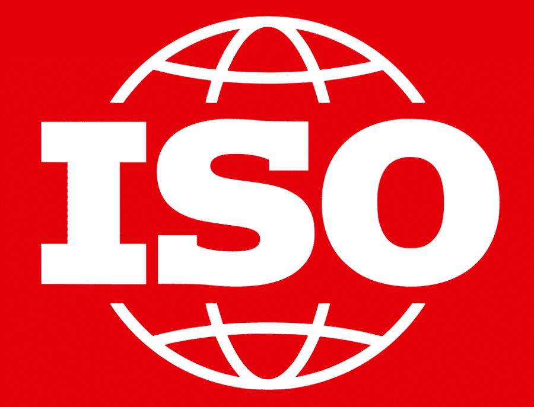
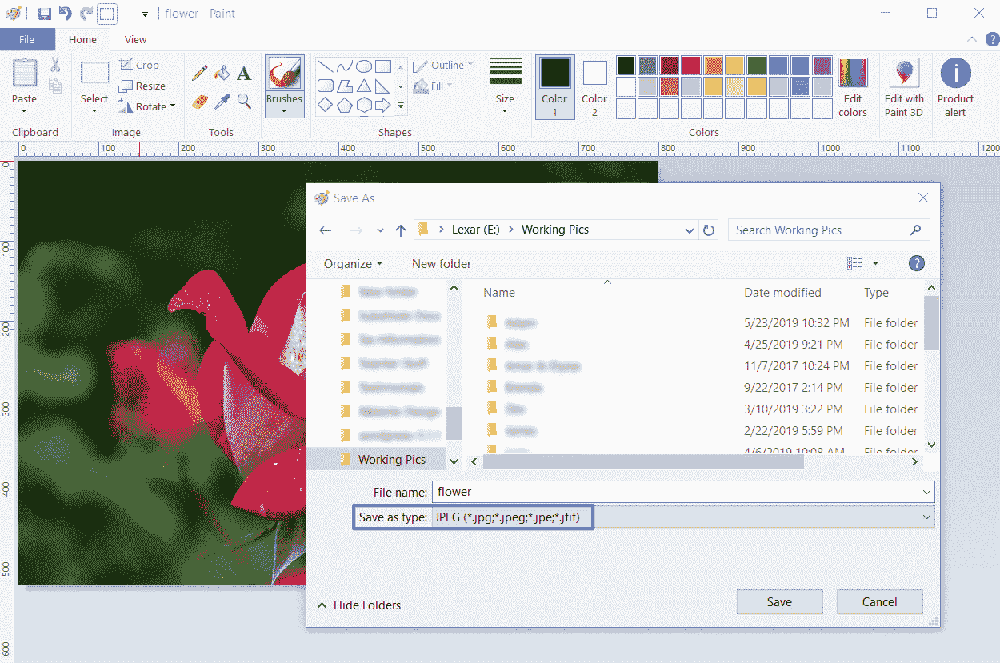
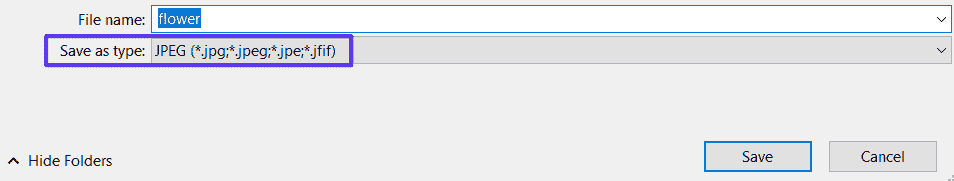
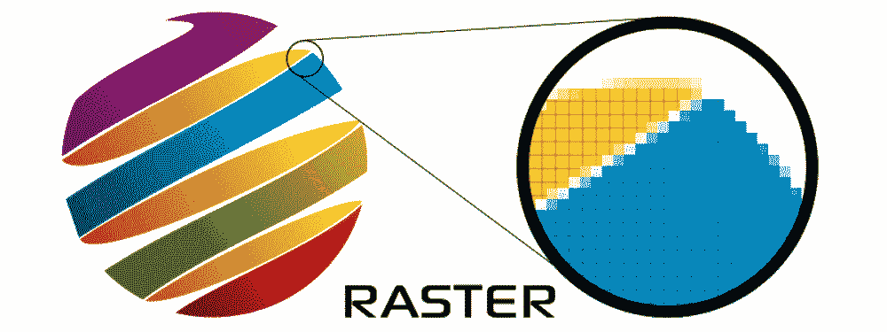
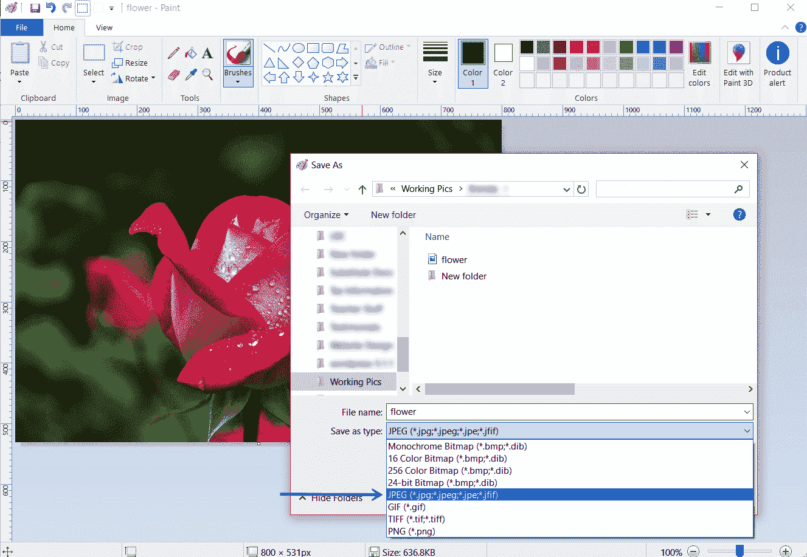
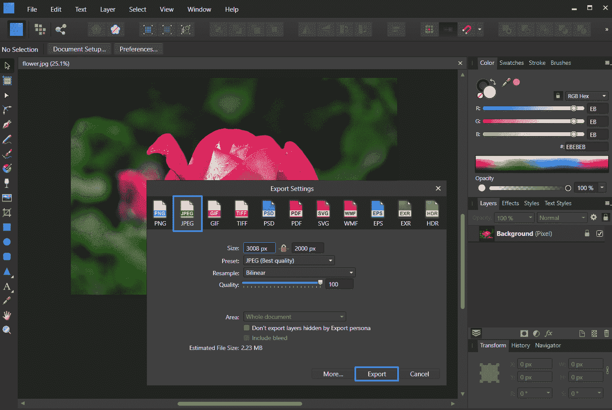
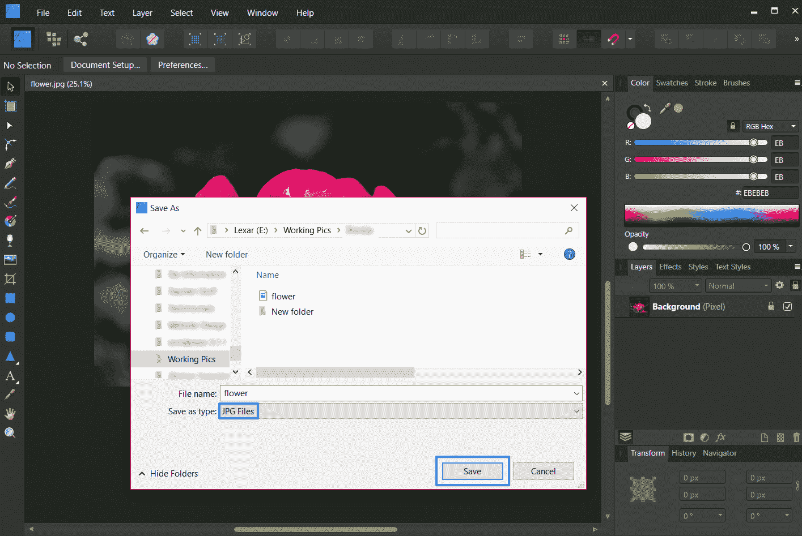
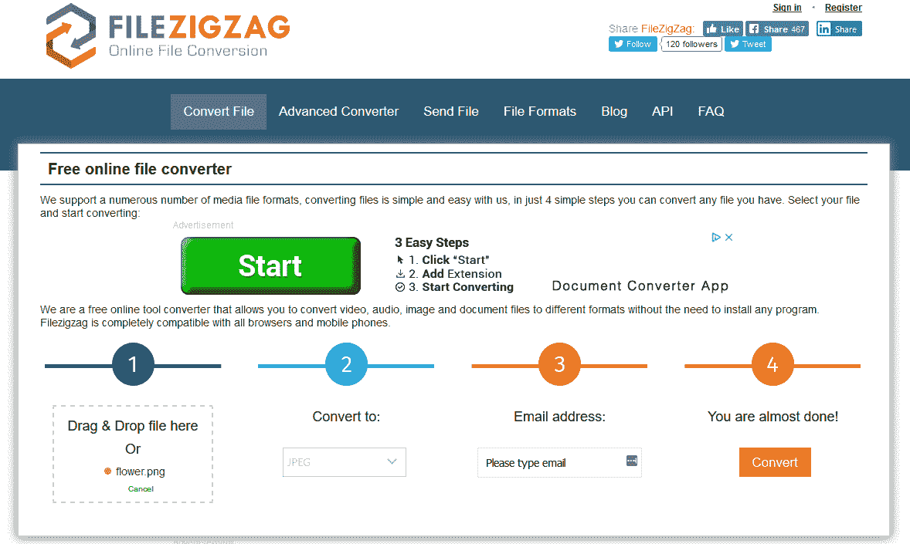

# JPG 与 JPEG:了解最常见的图像文件格式

> 原文：<https://kinsta.com/blog/jpg-vs-jpeg/>

网站所有者总是会遇到图像文件。虽然你不一定要成为图像专家才能编辑和上传图像到网站，但是你应该熟悉常见的文件格式，比如 JPEG。*还是 JPG？*

在本文中，我将展示一个 JPG 和 JPEG 的对决，这样你就能理解它们的区别，以及其他细节，帮助你将最好的图像上传到你的网站，以获得最终的用户体验。如果你在寻找一本关于现代生活的深度指南。webp 文件格式，我们也帮你搞定了。

准备好了吗？我们开始吧！

## 什么是 JPEG？

作为一个处理图像的网站所有者，你很可能在编辑和上传的过程中见过 JPEG 文件格式。

> 但是你知道吗，术语 JPEG 实际上是指三种不同的东西。

是的，我们在这里解释所有的问题:

### 1.JPEG 有损压缩

当你上传图片到你的网站时，重要的是你要注意不要使用浪费资源的大图片来影响网站的速度和性能。事实上，所有网站所有者都应该[以某种方式优化他们的图片](https://kinsta.com/blog/optimize-images-for-web/)，以减少他们图片的文件大小[保持加载时间](https://kinsta.com/blog/wordpress-lazy-load/)和用户体验。

> 需要在这里大声喊出来。Kinsta 太神奇了，我用它做我的个人网站。支持是迅速和杰出的，他们的服务器是 WordPress 最快的。
> 
> <footer class="wp-block-kinsta-client-quote__footer">
> 
> 
> 
> <cite class="wp-block-kinsta-client-quote__cite">Phillip Stemann</cite></footer>

[View plans](https://kinsta.com/plans/)

这就是 JPEG 派上用场的地方。JPEG 是一种[有损压缩方法](https://kinsta.com/blog/lossy-compression/),用于确保使用的数字图像尽可能小，并在有人想要查看时快速加载。

关于有损压缩，请记住以下几点:

*   通过从图像中删除不必要的(*冗余*)信息，被压缩图像的文件大小被永久减小。
*   图像质量确实受到了影响，尽管这种影响通常非常轻微，一般的网站访问者无法察觉。
*   在压缩过程中，每个像素与其周围的像素以 2:1 到 100:1 的比率进行比较(*任何与原始像素相同的像素都被删除，因为它们被认为是冗余的*)。
*   JPEG 有损压缩通常用于照片和复杂的静态图像。
*   当您使用有损压缩来压缩图像时，您需要确定文件大小和图像质量之间的平衡(*例如，较小的文件=较差的图像质量*)。
*   对单个图像进行的编辑和保存越多，图像的质量就越差。

如果您在使用有损压缩编辑图像方面更有经验，那么您可以通过处理原始 JPEG 图像、进行编辑并一次性存储图像，在降低文件大小的同时保存图像质量。

如果你不想对你网站上的图像进行 JPEG 有损压缩，总有另一种选择:[无损压缩](https://kinsta.com/blog/lossy-compression/#lossless-compression)。

无损压缩以完全不同的格式保存你的图像(*通常是 PNG* )。虽然图像质量绝不会因为没有信息被删除而降低，但要知道，使用无损压缩，图像的最终文件大小总是比有损压缩大。这可能会导致页面加载速度变慢。

### 2.联合图像专家组(JPEG)

JPEG 代表联合摄影专家组，它是帮助创建 JPEG 标准的子委员会的名称，以及更广泛的称为 ISO 的组下的其他静止图像编码标准。

第一个 JPEG 标准由 ISO ( *国际标准化组织*)于 1992 年发布。 [ISO 负责](https://www.iso.org/standards.html)创建文件，这些文件“……提供可持续使用的要求、规范、指南或特征，以确保材料、产品、流程和服务符合其目的。”

ISO 为包括数字图像在内的许多事物制定了标准，努力为用户和消费者提供最高质量的产品和服务。

Image source: [Wikimedia Commons](https://commons.wikimedia.org/wiki/File:ISO_Logo_(Red_square).svg)

这个国际组织是由超过 164 个国家的成员组成的志愿团体，是世界上最大的标准制定者。

### 3.JPEG 作为一种文件格式

术语 JPEG 的最后一种用法是指文件格式名称或存储和保存数字图像的方式。这可能是您最习惯看到 JPEG 的方式，因为这是编辑图像后保存图像时可以选择的文件格式之一。

JPEG file format

这里有一些有趣的事实。jpeg 文件格式:

*   数码相机和其他图像捕捉设备使用的最常见的图像文件格式。
*   支持 16，777，216 种颜色，每种颜色在 RGB 颜色模型中使用 8 位生成。
*   可以一次显示超过 1600 万种颜色，使[配色方案](https://kinsta.com/blog/website-color-schemes/)和对比度分辨率近乎完美。
*   支持的最大尺寸为 65，535 x 65，535 像素。
*   保存时将图像尺寸缩小约 50-75% ( *因为有损压缩*)

最后，这种类型的文件格式对于边缘清晰的图像来说并不理想，因为与保存为. png 文件相比，这种文件格式的颜色混合程度更高，因为. png 文件将单个像素显示为一个组合。

那么，现在让我们看看 JPG 是什么。

## 什么是 JPG？

与 JPEG 相比，JPG 究竟算什么？

File extensions in Windows

说到。jpeg vs .jpg，真相是**两个**除了字符数没有区别。

*疯狂吧？*我们来解释一下。

术语 JPG 的存在是因为早期版本的 Windows 操作系统。具体来说，MS-DOS 8.3 和 FAT-16 文件系统在文件名方面有一个最多 3 个字母的限制，而像 Mac 或 Linux 这样的类 UNIX 操作系统没有这个限制。

因此，在 Mac 或 Linux 系统上，保存为 jpeg 格式的图像使用. JPEG 文件扩展名。但当使用 Windows 保存相同类型的图像时，文件扩展名必须缩短为。所以它没有超过 3 个字母的限制。

如今，Windows 操作系统接受 3 或 4 个字母的文件扩展名，如。jpeg 或者. jpg .但是既然这么多人用 Windows 这么久了，而且习惯了把图片存成 jpg，他们就没有停过。因此，Adobe Photoshop 和 GIMP 等照片编辑软件会将所有 JPEG 图像默认保存到。jpg 文件扩展名，以避免混淆。

## JPG vs JPEG:两者的相似之处

好吧，你知道的。jpeg 和。jpg 文件是完全一样的东西。但是为了让你明白这一点，并帮助你在未来长久地记住它，我们将看看 JPEG 和 JPG 图像的相似之处。

### 1.两者都是光栅图像(不是矢量图像)

计算机图像可以创建为光栅或矢量图像。因为 JPEGs 是光栅图像，所以 jpg 也是。

光栅图形是图像的位图。位图是由单个像素组成的网格，当这些像素组合在一起时，就形成了一幅完整的图像。换句话说，光栅图像是无数颜色小方块(*或像素*)的集合，每个小方块都以特定的色调或阴影进行编码，当它们放在一起时，会创建一个看起来有意义的整体图像。

Image source: [PrintCNX](https://www.printcnx.com/resources-and-support/addiational-resources/raster-images-vs-vector-graphics/)

以下是关于光栅图像的更多信息，有助于您更好地理解:

*   最适用于非线条图像，如照片、扫描的艺术品或详细的图形。
*   他们有微妙的色调或阴影层次和非常不明确的线条和形状。
*   由于它们基于像素的性质，当放大尺寸时，它们会遇到质量问题(*它们会变得锯齿状，并暴露单个像素*)。
*   它们以特定的分辨率定义和显示，以每英寸点数( *dpi* )为单位。
*   dpi 越高，图像的分辨率和视觉吸引力就越好。
*   常见的光栅文件格式包括:TIFF、JPEG、GIF、PCX 和 BMP 文件。
*   光栅图像是网络标准，这意味着它们是互联网上所有图像的首选。

同样，JPEGs 和 jpg**不是矢量图像**。

## 注册订阅时事通讯

### 想知道我们是怎么让流量增长超过 1000%的吗？

加入 20，000 多名获得我们每周时事通讯和内部消息的人的行列吧！

[Subscribe Now](#newsletter)

Image source: [PrintCNX](https://www.printcnx.com/resources-and-support/addiational-resources/raster-images-vs-vector-graphics/)

这里有一些关于矢量图像的信息，这样你就可以理解它们的区别了:

*   图像是基于数学公式定义的几何形状，如多边形、直线、曲线、圆形和矩形。
*   非常适合线条艺术等直边图像。
*   因为没有颜色渐变，所以它们适用于颜色均匀的平面图像。
*   包括流行的图形，如徽标、信头和字体。
*   放大或缩小都不会降低质量，因为它们不依赖像素来使图像完整。

### 2.这两个术语意思相同

还记得我们讨论术语 JPEG 以及它是如何代表联合图像专家组的吗？嗯，你猜对了；JPEG 和 JPG 都是同一个 ISO 分委员会的缩写。

### 3.两者都用于相同的图像类型

因为它们是光栅图像，而不是矢量，两者都是。jpeg 和。jpg 文件格式最适合用于数码摄影。数码照片具有丰富的色彩层次，当保存为光栅 JPEG/JPG 图像时，看起来无缝。这意味着如果你的网站访问者保存为. jpeg/格式，他们将会看到一张漂亮的照片。jpg 并上传到你的网站。

了解更多关于[图像文件类型](https://kinsta.com/blog/image-file-types/)及其对您网站的影响。

### 4.两者在保存时都会失去一些质量

自从。jpeg 与 jpg 的比较为空(*因为它们是完全相同的东西*)，这说明每种文件格式使用的压缩方法——有损压缩——会随着图像文件大小的减小而导致图像质量的损失。

此外，这意味着无论您使用什么文件扩展名(*)。jpeg 或者。jpg* )，你的图片的文件大小将会比原来的小，并且当上传到你的网站并被网站访问者浏览时会导致更快的加载时间。

归根结底，JPEGs 和 jpg 是一回事，它们有几个主要目的:减小图像的文件大小，以便更好地在网上浏览；给人们提供一种在保存时压缩图像的简单方法，并使用许多人都认可的通用文件扩展名来命名文件。

所以问问自己: *JPG vs JPEG，哪个更好？从那里开始，不要想太多，因为答案是两者都不是。它们是一样的，你选择哪一个，只是个人喜好的问题。*

## JPG vs JPEG 2000

如果你曾经发现自己在搜索关于 JPEG 和 jpg 的信息，你可能遇到过术语 **JPEG 2000** 并且想知道那究竟是什么。毕竟，这不是大多数图像编辑软件的选项。

如果你在你的网站上上传了大量的照片和图像，你不希望为你的访问者提供速度慢的页面，对吗？我们提供超快的服务器和来自 WordPress 专家的 24/7 世界级支持。[查看我们的计划](https://kinsta.com/plans/?in-article-cta)

JPEG 2000 是由联合图像专家组在 2000 年创建的图像编码系统，旨在比现有的 JPEG 标准更好。事实上，它被设计成使用离散波长变换的高级压缩技术来实现图像的无损压缩。

它为人们提供了一种方式来优化他们的图像，并将其保存为 JPEGs 和 T2 格式，而不会降低图像的质量。

以下是 JPEG 2000 的一些最重要的功能:

*   **高级压缩技术:**与传统的 JPEG 不同，JPEG 2000 能够执行有损和无损压缩(*甚至对单个图像文件进行压缩*)。
*   **渐进式解码:**使网站访问者能够看到图像的较低质量版本，而整个图像仍在后台下载。随着下载的数据越来越多，观看者的图像质量也越来越好。
*   **更高的压缩比:**在有损压缩方面，JPEG 2000 可以比 JPEG 多压缩 20-200%的图像，同时与相同大小的 JPEG 图像相比，保持相同的图像质量。

此外，JPEG 2000:

*   在图像中提供透明保护。
*   可以描述二值、灰度、调色板颜色和全色图像数据。
*   包括无限量的私有或专用信息。
*   可以处理更大的图像尺寸(*大于 64K x 64K 像素*)，不会倾斜。
*   超低延迟，这对于直播电视内容尤其有用。
*   分辨率和质量的可扩展性。

### JPEG 2000 的限制

尽管 JPEG 2000 有许多出色的功能，似乎是数字图像的下一个最佳编码标准，但它仍然不是大多数人喜欢的文件格式，这是有原因的:

*   不支持通用浏览器(*只支持 Safari* )。
*   与 JPEG 不兼容(*必须编码新标准并支持原始 JPEG* )。
*   对 JPEG 2000 文件进行编码是 CPU 密集型的，这会给服务器带来压力并降低速度。
*   许多网站和相机还没有准备好接受这种格式，因为它没有被普遍接受。

由于它的局限性，你很难找到 JPEG 2000 文件格式作为保存数字图像的选项。虽然它可以说比 JPEG 更好，但在它被普遍接受之前，你可能会遇到一系列兼容性问题，使你作为网站所有者的工作变得更加困难。

## 将图像文件转换为 JPG:常用方法

有很多方法可以将您的数码图像保存为。jpg 或者。jpeg 文件。下面我们来看几个。

### 1.Windows 油漆

如果你有 Windows，你可以很容易地将任何图像保存为. jpeg 或。使用 Windows 画图。只需将您的图像上传到 Windows Paint，进入**文件** > **另存为**，选择文件目标，命名您的图像，并选择 **JPEG (*。jpg，*。jpeg，*。jpe，*。从[下拉菜单](https://kinsta.com/knowledgebase/wordpress-dropdown-menu/)中选择**。

Windows Paint

然后点击**保存。**

### 2.亲和力设计者

Affinity Designer 很像 Adobe Photoshop 等其他图像编辑软件。要使用这样的软件将图像保存为 JPG，首先打开应用程序并上传您的图像。进行任何想要的编辑，然后单击**文件** > **导出…** 。然后，选择 JPEG 图标，选择质量(*最佳、高、中、低*，点击**导出**。

Affinity Designer

当你这样做，另存为对话框将打开，这样你就可以选择一个文件的目的地，命名你的图像，并再次确保你是保存文件为 JPG。

“Save as” in Affinity Designer

点击**保存**。

### 3.在线转换器工具

如果你想把图片转换成 JPG，有很多免费的在线 jpg 转换工具可以帮助你。例如， [FileZigZag](https://www.filezigzag.com/) 是一个免费的在线文件转换器，使用简单。只需拖放或上传您的图像文件，选择要将图像转换成的文件类型，输入电子邮件地址，然后单击**转换**。

Convert png to jpeg FileZigZag

当然，你可能不想交出你的电子邮件来换取将你的图像转换成 JPG。因此，我们收集了一些其他免费和高级解决方案供您查看:

*   [XnConvert](https://www.xnview.com/en/xnconvert/#downloads) **:** 非常适合需要大量图像文件格式、能够批量转换并使用 Windows、Mac 或 Linux 的高级图像编辑器。
*   [Zamzar](https://www.zamzar.com/) **:** 一款免费的在线工具，适用于那些拥有大尺寸图片(*高达 50MB* )的用户，他们可以选择是否通过电子邮件发送最终结果。
*   [适配器](https://macroplant.com/adapter/image-converter) **:** 一个简单的图像转换器，支持批量图像和即时转换，在 macOS 和 Windows 上都可以工作。

当然，如果你想把图片转换成 JPG，这些只是你可以选择的一部分。

[JPG vs JPEG: What's the difference? What about JPEG 2000? 😫 Get the answer (and more) in our extensive guide! 💪Click to Tweet](https://twitter.com/intent/tweet?url=https%3A%2F%2Fkinsta.com%2Fblog%2Fjpg-vs-jpeg%2F&via=kinsta&text=JPG+vs+JPEG%3A+What%27s+the+difference%3F+What+about+JPEG+2000%3F+%F0%9F%98%AB+Get+the+answer+%28and+more%29+in+our+extensive+guide%21+%F0%9F%92%AA&hashtags=wordpress%2Cwebdesign)

## 摘要

对于那些想要存储和保存数字图像的人来说，JPG 和 JPEG 是最常见的文件扩展名和压缩方法。对于希望展示视觉上吸引人的图像并保持卓越用户体验的网站所有者来说，尤其如此。

你很幸运，不管你是否喜欢。jpeg，。jpg 或者。webp 文件类型，你会得到同样的结果:美丽的图像，为网站访问者加载速度极快。

* * *

让你所有的[应用程序](https://kinsta.com/application-hosting/)、[数据库](https://kinsta.com/database-hosting/)和 [WordPress 网站](https://kinsta.com/wordpress-hosting/)在线并在一个屋檐下。我们功能丰富的高性能云平台包括:

*   在 MyKinsta 仪表盘中轻松设置和管理
*   24/7 专家支持
*   最好的谷歌云平台硬件和网络，由 Kubernetes 提供最大的可扩展性
*   面向速度和安全性的企业级 Cloudflare 集成
*   全球受众覆盖全球多达 35 个数据中心和 275 多个 pop

在第一个月使用托管的[应用程序或托管](https://kinsta.com/application-hosting/)的[数据库，您可以享受 20 美元的优惠，亲自测试一下。探索我们的](https://kinsta.com/database-hosting/)[计划](https://kinsta.com/plans/)或[与销售人员交谈](https://kinsta.com/contact-us/)以找到最适合您的方式。