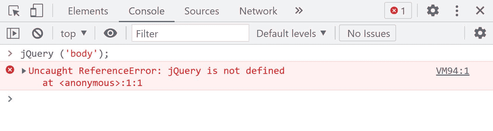
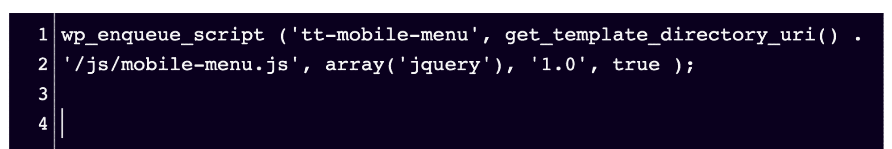
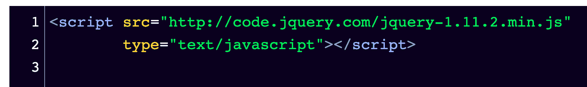
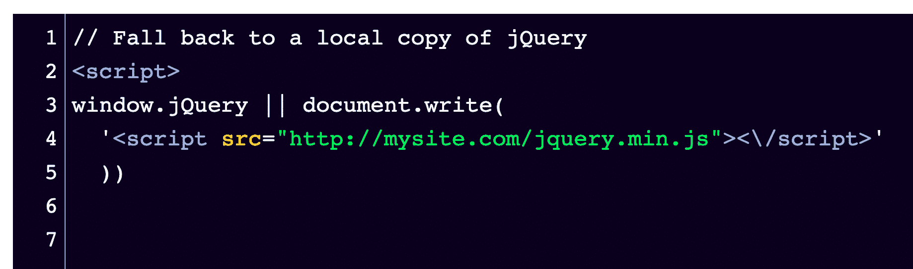
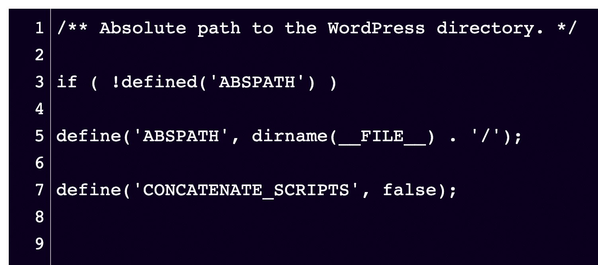
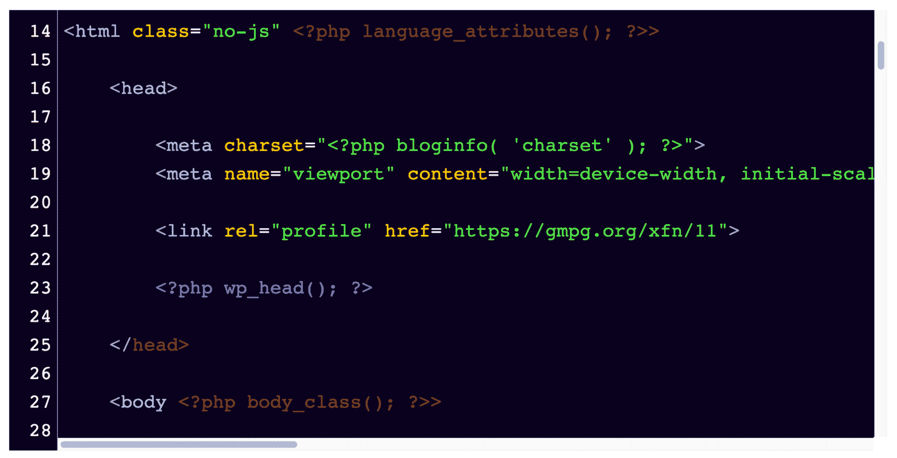

# 修复“jQuery 未定义”错误的 5 种简单方法

> 原文：<https://kinsta.com/blog/jquery-is-not-defined/>

无论你是否对 WordPress 错误感到陌生，在你的网站上工作时遇到“jQuery 未定义”都不是一件有趣的事情。这可能是一个令人吃惊和困惑的消息。幸运的是，这是一个标准错误，使用 [jQuery](https://kinsta.com/knowledgebase/what-is-jquery/) 的网站可能会在某个时候遇到。

也许您的站点关闭了，当您检查浏览器控制台的错误时，您会看到“jQuery 未定义”找到错误是第一步——干得好！

下一步是解决它。因为这是一个更容易修复的 JavaScript 错误，所以不会花你太多时间。

在本帖中，我们将带你了解快速修复它所需的一切。这包括错误意味着什么，为什么它可能会发生在第一位，所有的关键信息，以防止这种错误在未来发生。最后，我们将引导您完成几个步骤来解决这个问题。

让我们开始吧！

### 查看我们的[视频指南](https://www.youtube.com/watch?v=VPlBognZHP0)来修复“jQuery 未定义”错误

T3】

## 什么是“jQuery 未定义”错误？

您的浏览器中便利的[控制台日志是您可能会发现这个错误的地方。但这并不是难以置信的描述。“jQuery 未定义”实际上是什么意思？](https://kinsta.com/blog/inspect-element/)

> Kinsta 把我宠坏了，所以我现在要求每个供应商都提供这样的服务。我们还试图通过我们的 SaaS 工具支持达到这一水平。
> 
> <footer class="wp-block-kinsta-client-quote__footer">
> 
> 
> 
> <cite class="wp-block-kinsta-client-quote__cite">Suganthan Mohanadasan from @Suganthanmn</cite></footer>

[View plans](https://kinsta.com/plans/)

简单地说，这个错误试图告诉你，你的站点上的某个东西——可能是一个插件——需要 jQuery 才能在你的站点上运行。出于某种原因，当浏览器试图加载网站并调用特定的 jQuery 时，它不可用。

这个错误可能会对访问者关闭您的网站。因为互联网上大约 78%的网站运行在 jQuery 上，这是一个常见的错误。

jQuery is not defined” error in the console log.

### “jQuery 未定义”错误的潜在原因

这个错误可能相当令人惊讶。你的网站昨天还好好的，怎么了？这可能有点让人挠头。

引发“jQuery 未定义”错误的可能原因有以下几种:

1.  你的 WordPress 站点上安装的旧插件与你最近安装并激活的插件相冲突。如果您[最近安装或激活了新插件](https://kinsta.com/knowledgebase/how-to-install-wordpress-plugins/)或者您网站上的一些插件最近没有更新，这可能是原因。
2.  运行缓慢或性能不佳的托管环境会增加 jQuery 被调用时的执行时间。请仔细检查您的服务器资源或错误日志以确认这一点。
3.  在 jQuery 完全加载之前，您的网站上的 JavaScript 正在运行。或者在页面加载时 JavaScript 文件没有被正确加载。
4.  你用来提高网站性能的 CDN 无法到达你的服务器。如果你根本不用 CDN，你可以完全排除这种可能性。
5.  您的 jQuery 版本中有错误或打字错误。也许有人最近编辑了一个核心文件或插件，现在已经引起了冲突。

## 如何修复“jQuery 未定义”错误

在我们开始修复之前，记得在编辑代码之前[备份你的网站](https://kinsta.com/blog/backup-wordpress-site/)！即使是最有经验的开发人员也会犯错误，手头有一份备份可以防止您在排除故障时丢失任何重要的工作。

如果你可以选择，首先在[试运行或开发站点](https://kinsta.com/help/premium-staging-environments/)上解决错误，就像 Kinsta 的客户所做的那样，然后确认修复并[将这些更改推送到现场](https://kinsta.com/help/push-staging-live/)。

一旦你采取了必要的预防措施，就该纠正错误了。

解决此错误需要熟悉添加、移除和编辑代码。不要担心——您不需要从头开始编写任何代码。但是如果你准备好访问你网站的代码，不管是通过 SFTP 还是通过你的托管环境，都会有所帮助。

对于通过 WordPress dashboard 代码编辑器编辑代码来说，这并不理想。如果你手头还没有一个[好的文本编辑器](https://kinsta.com/blog/best-text-editors/)，现在是时候安装一个了。

这里有几个选项，你可以利用来解决这个错误，让您的网站回到访客。

### 方法 1:如果正在加载 jQuery，使用 Network 选项卡进行调试

查看浏览器开发工具的 **Network** 选项卡，查看 jQuery 是否被加载。这为您提供了一个快速验证的地方。

## 注册订阅时事通讯

### 想知道我们是怎么让流量增长超过 1000%的吗？

加入 20，000 多名获得我们每周时事通讯和内部消息的人的行列吧！

[Subscribe Now](#newsletter)

另一种方法是查看可能导致错误的多个插件和主题。仔细检查站点的代码，确保包含 jQuery。最好是只装一次。

如果没有包含 jQuery 库，用下面的代码片段将它添加到您的`wp_enqueue_script()`函数中:

`wp_enqueue_script( 'tt-mobile-menu', get_template_directory_uri() .
'/js/mobile-menu.js', array('jQuery'), '1.0', true );` 

通过进入 **wp-includes** 文件夹找到这个代码，然后打开 script-loader.php 文件**。如果这不起作用，或者如果您发现 jQuery 库实际上已经包含在内，请继续使用下面的方法。**

How your snippet will look in the script-loader.php file.

### 方法 2:确保 jQuery 已加载

当包含了 [jQuery](https://kinsta.com/blog/javascript-libraries/#jquery) 但未加载时，您可能会遇到“jQuery 未定义”错误。确保通过找到脚本源并在新的浏览器或标签中粘贴 URL 来加载它。

例如，如果`<script src=`设置为:

The snippet of text you should look for to find the URL to test.

然后，将`http://code.jquery.com/jquery-1.11.2.min.js`部分复制并粘贴到一个新窗口或标签中。如果 jQuery 文件加载并显示了全部内容，您可以从列表中检查这一点。

厌倦了低于 1 级的 WordPress 托管支持而没有答案？试试我们世界一流的支持团队！[查看我们的计划](https://kinsta.com/plans/?in-article-cta)

### 方法 3:包含 Google 托管的 jQuery 和本地回退

这是包含在您的 JavaScript 中的一个很好的选项，因为在 [localhost](https://kinsta.com/knowledgebase/what-is-localhost/) 上运行 jQuery 可以从整体上改善您的网站体验。这将有助于避免任何其他 CDN jQuery 加载问题。

`// Fall back to a local copy of jQuery
window.jQuery || document.write(''))`

This is what your code snippet should look like in your code editor. Don’t forget the note!

### 方法 4:将代码片段添加到 wp-config.php 文件中

如果以上都不起作用，打开**wp-config.php**文件并完整粘贴以下代码片段:

`/** Absolute path to the WordPress directory. */
if ( !defined('ABSPATH') )
define('ABSPATH', dirname(__FILE__) . '/');
define('CONCATENATE_SCRIPTS', false);`

What the snippet will look like in your wp-config.php file.

### 方法 5:手动插入 jQuery 库

作为最后一种方法，您可以直接进入**header.php**文件并添加 jQuery 库。

方法如下:

1.  首先，访问 Google 托管库，完整复制最新版本的 jQuery 库。
2.  打开你的主题文件夹中的 header.php 文件。
3.  添加第一步中的 jQuery 库。确保它就在头部标签之后的[中。](https://kinsta.com/knowledgebase/add-code-wordpress-header-footer/)
4.  完成后保存文件。

What the snippet will look like in your wp-config.php file.

[好消息——你已经发现了“jQuery 未定义”的错误。🙃现在是时候解决了！⬇️ 点击推文](https://twitter.com/intent/tweet?url=https%3A%2F%2Fkinsta.com%2Fblog%2Fjquery-is-not-defined%2F&via=kinsta&text=Good+news-+you%27ve+found+the+%E2%80%9CjQuery+is+not+defined%E2%80%9D+error.+%F0%9F%99%83+Now+it%27s+time+to+solve+it%21+%E2%AC%87%EF%B8%8F&hashtags=jQuery%2CJavaScript)

## 摘要

现在你知道了！按照这些步骤，您应该能够解决“jQuery 未定义”错误并访问您的站点。

由于这个问题通常是由于浏览器无法连接到您的 jQuery 库造成的，因此您可以尝试的解决方案非常有限。大多数人发现以上任何一种选择都是成功的。

如果出于某种原因，以上步骤都没有解决错误，那么[联系你的托管公司](https://kinsta.com/kinsta-support/)寻求支持是个好主意。

*你以前遇到过这个错误吗？你是怎么解决的？请在评论区告诉我们！*

* * *

让你所有的[应用程序](https://kinsta.com/application-hosting/)、[数据库](https://kinsta.com/database-hosting/)和 [WordPress 网站](https://kinsta.com/wordpress-hosting/)在线并在一个屋檐下。我们功能丰富的高性能云平台包括:

*   在 MyKinsta 仪表盘中轻松设置和管理
*   24/7 专家支持
*   最好的谷歌云平台硬件和网络，由 Kubernetes 提供最大的可扩展性
*   面向速度和安全性的企业级 Cloudflare 集成
*   全球受众覆盖全球多达 35 个数据中心和 275 多个 pop

在第一个月使用托管的[应用程序或托管](https://kinsta.com/application-hosting/)的[数据库，您可以享受 20 美元的优惠，亲自测试一下。探索我们的](https://kinsta.com/database-hosting/)[计划](https://kinsta.com/plans/)或[与销售人员交谈](https://kinsta.com/contact-us/)以找到最适合您的方式。