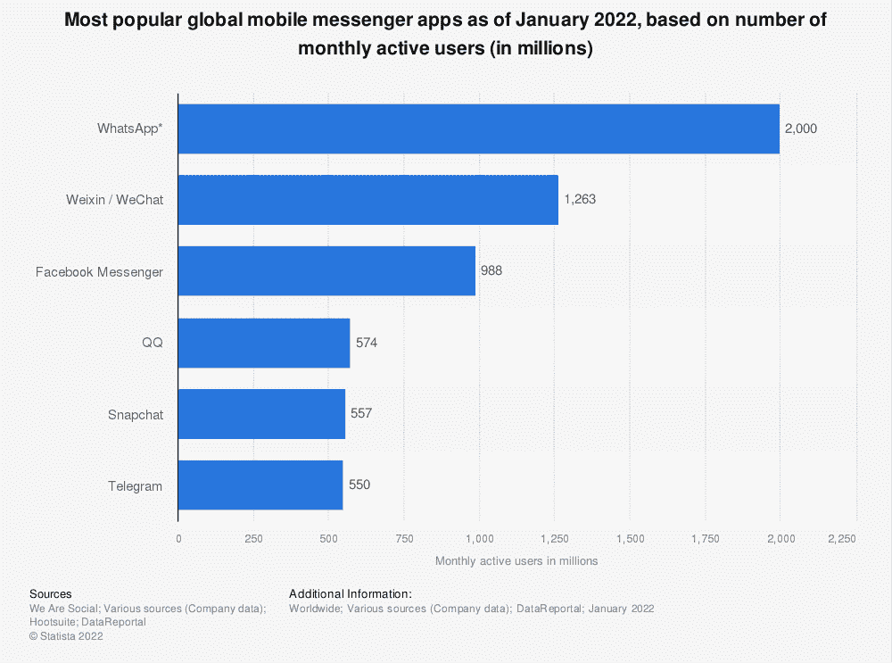
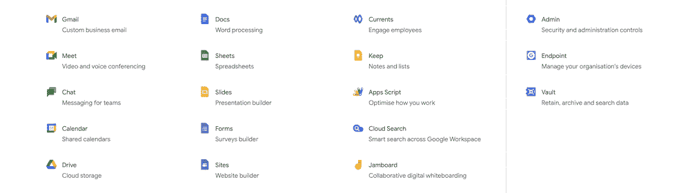
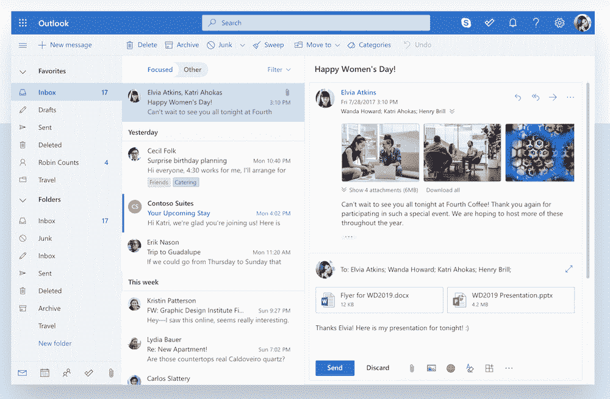
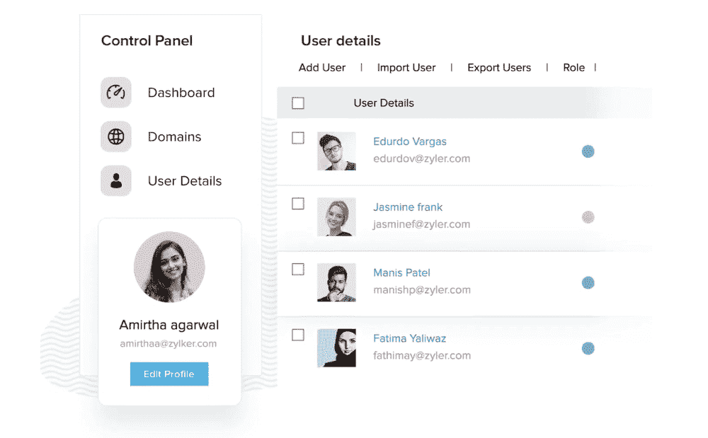
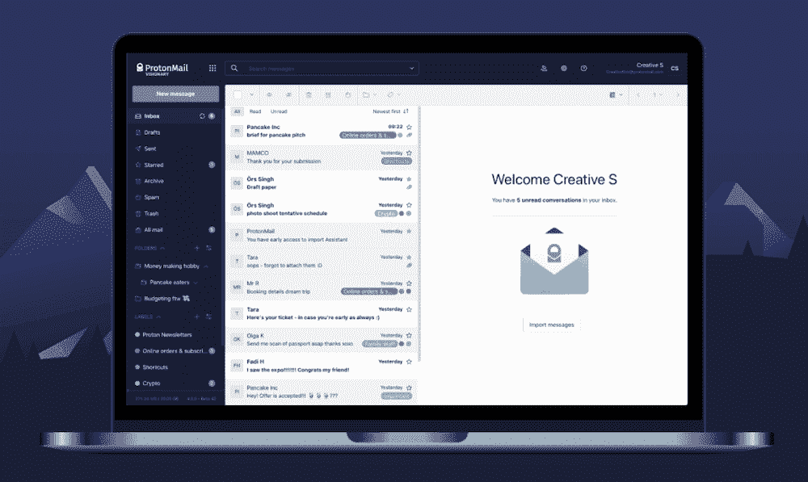
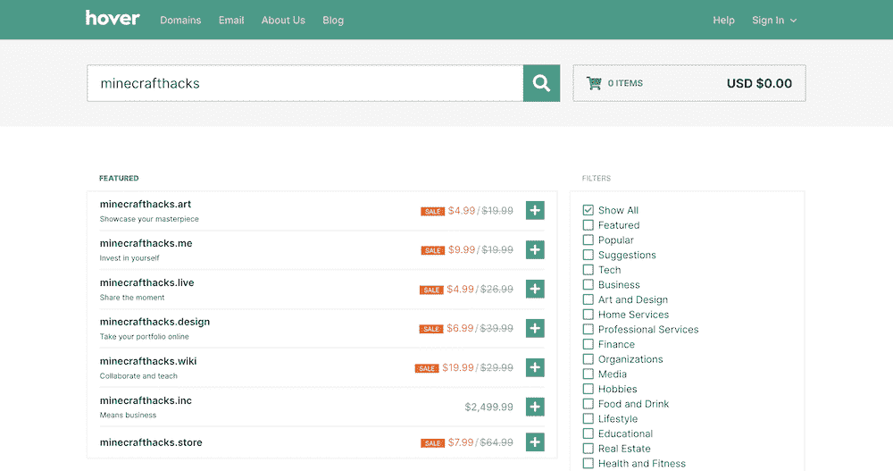
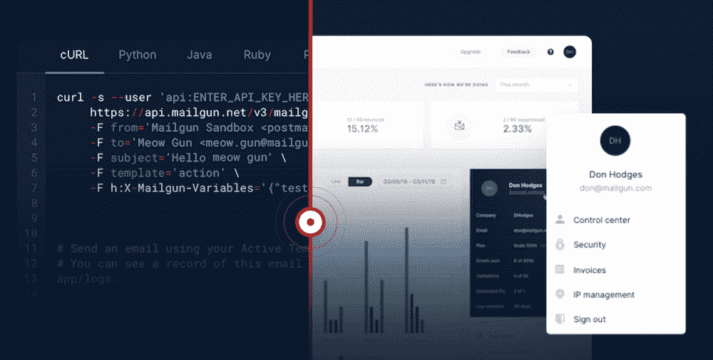
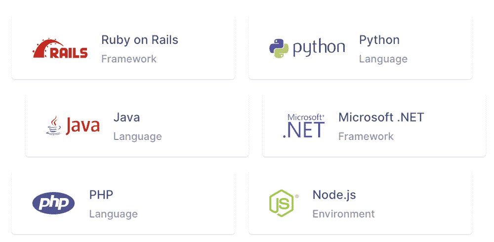

# 为什么你应该把你的邮箱和主机分开

> 原文：<https://kinsta.com/blog/keep-email-and-hosting-separate/>

你的虚拟主机和摇摆舞活动没有最明显的联系。然而，在一次活动中，每个人都必须遵守一条重要的规则:“一次跳一支舞。”换句话说，在跳下一个舞之前专注于一个舞。这也解释了为什么把你的邮箱和主机分开是个好主意。

任何一个称职的网络主机都想为其客户提供一流的服务器基础设施和 T2 坚如磐石的安全性。因此，提供电子邮件等其他(但相关的)服务可能会稀释核心产品。虽然这可能不是唯一的因素，但仍然是一个很大的因素。

鉴于此，我们将深入探讨为什么你应该保持电子邮件和托管分开。我们将讨论为什么 Kinsta 不提供电子邮件托管，然后收集一些优秀的电子邮件托管提供商。此外，我们还将带您参观如何设置自己的电子邮件服务器。

我们开始吧！

## 电子邮件对于个人和商业用途的重要性

快速突击测验:保证别人会收到你的信件的唯一方法是什么？

一封信可能会丢失，电话有时会消失在空气中，当你敲他们的门时，收件人可能会躲在沙发后面。

答案是电子邮件。

> Kinsta 把我宠坏了，所以我现在要求每个供应商都提供这样的服务。我们还试图通过我们的 SaaS 工具支持达到这一水平。
> 
> <footer class="wp-block-kinsta-client-quote__footer">
> 
> 
> 
> <cite class="wp-block-kinsta-client-quote__cite">Suganthan Mohanadasan from @Suganthanmn</cite></footer>

[View plans](https://kinsta.com/plans/)

是的，有可能一封电子邮件被放入了垃圾邮件文件夹，但它仍然会到达你的收件人那里，只是在不同于收件箱的文件夹中。不管怎样，这不是你能控制的。

即使有了即时消息渠道和社交媒体，电子邮件仍然是联系人们的一种成功方式。尽管即时平台之间有相似之处，但电子邮件更直接——毕竟它是电子邮件。而且是通用的。

数据证实了这一点。目前的数据显示，全球大约有 40 亿电子邮件用户。那是[和 WhatsApp、](https://www.statista.com/statistics/258749/most-popular-global-mobile-messenger-apps/) [Facebook Messenger](https://kinsta.com/blog/facebook-marketing/) 、Telegram、Snapchat *加起来*差不多的数字。

Most popular global mobile messenger apps as of July 2021\. (Image source: [Statista)](https://www.statista.com).

更重要的是，电子邮件用户帐户的数量看起来在未来将继续上升。鉴于电子邮件有 90%的渗透率，它将会存在很长一段时间。

[PSA:将电子邮件和托管分开，找到各自的最佳提供商👀了解更多此文⬇️ 点击推文](https://twitter.com/intent/tweet?url=https%3A%2F%2Fkinsta.com%2Fblog%2Fkeep-email-and-hosting-separate%2F&via=kinsta&text=PSA%3A+Keep+email+and+hosting+separate+to+find+the+best+providers+for+each+%F0%9F%91%80+Learn+more+in+this+article+%E2%AC%87%EF%B8%8F&hashtags=WebHosting%2CEmailTips)

## 为什么 Kinsta 不提供电子邮件托管(而有些主机提供)

因为这些统计数据，很容易理解为什么主机公司会选择在提供主要服务的同时提供电子邮件。

最终，[电子邮件的发送和送达能力](https://www.smartinsights.com/email-marketing/email-deliverability/)都在主机的掌控之中。这些方面使用发送域和 IP 进行验证和检查，非常适合 web 主机。毕竟，有谁比网络专家更能确保
信息快速准确地到达接收者手中呢？

可能有更好的选择。

你的虚拟主机*不会成为电子邮件托管各方面的专家。出于这个原因，Kinsta [不提供电子邮件托管](https://kinsta.com/help/email-hosting/)。我们在 Kinsta 网站的其他地方讨论过这个问题，但是让我们总结一下为什么会这样:*

> 我们所有的资源都致力于使 Kinsta 成为业界最好的应用程序、数据库和托管 WordPress 托管平台。

上面的引用应该告诉你你需要知道的一切。我们的[方法是成功的](https://reviewsignal.com/blog/tag/kinsta/)，我们知道，虽然 Kinsta 为 WordPress 网站提供一流的托管服务，但像 [Google Workspace](https://kinsta.com/blog/google-workspace/) 这样的解决方案也能为电子邮件托管提供同样的服务。

当我们可以专注于我们擅长的事情时，为什么要尝试重新发明轮子呢？此外，这为我们的客户提供了更好的选择，对每个人来说都是双赢！

## 为什么你应该保持电子邮件和托管分开

虽然有很多个人原因让你应该把电子邮件和主机分开，但也有很多技术原因。

对于初学者来说，资源使用是一个很大的优势，因为你不会通过你的[带宽和存储](https://kinsta.com/knowledgebase/website-bandwidth-usage-cloudflare/)供应搅动。此外，你可以将这些资源投入到与托管网站相关的元素上，而不是从你的电子邮件账户中抽走一些。

反过来也一样。您的电子邮件主机有自己的专用资源，不会受到其他服务的影响。在大多数情况下，同步这些帐户就像合并提供商一样简单。

它对两个平台的可靠性都有连锁反应:每个服务负责一项工作，可以分配时间和精力以确保两者都坚如磐石。然而，有可能你的主机或电子邮件提供商中的一个不如另一个优秀。当你涉及预算时，这是可以理解的。

在这种情况下，你可能会选择一家联合供应商。然而，如果电子邮件或主机宕机，通常会导致另一方宕机。这对于任何依赖在线交流的企业来说都是灾难性的——也许这是最重要的原因。

说到商业，将电子邮件和虚拟主机分开有一个节省时间的好处。如果你觉得某项服务不适合你，或者你想寻求更好的服务，那么在不影响你的另一半业务的情况下，你可以很容易地做到这一点。

如果你在两个方面与一个合并的提供商捆绑在一起，就很难打破这些链条。因此，你最好选择独立的电子邮件和主机提供商。

## 6 大电子邮件托管提供商

在这一点上，你可能会点点头，准备抛弃你的电子邮件和虚拟主机。不过，首先，你需要一个合适的电子邮件提供商。

以下六种解决方案都适用于单独的主机，不过我们将在接下来的几节中更详细地讨论它们。使用任何一种方法都可以让你把电子邮件和主机分开。

### 1.谷歌工作空间

The Google Workspace website.

首先，我们有谷歌工作空间。对数百万用户来说，这是一项熟悉的服务，不仅仅是因为它提供了高质量的电子邮件。顾名思义，它是一整套工具和应用程序，帮助你开展日常工作(尽管我们在这里只关注电子邮件)。

Google Workspace apps.

Gmail 当然是 Workspace 的电子邮件托管部分。这是谷歌的一项长期服务，从一开始，它就确定了电子邮件的内容。你可以使用[一键式快捷键](https://kinsta.com/blog/gmail-keyboard-shortcuts/)来执行几乎每一个动作，让砍掉一个庞大的收件箱变得轻而易举。我们很欣赏 Vim 式的导航快捷方式来浏览您的收件箱。

毫不夸张地说，Gmail 重新定义了许多人眼中的电子邮件。几乎每个提供商现在都使用一个存档文件夹来存放旧邮件，并且大多数都包括受 Gmail 启发的彩色标签来标记特定的电子邮件以备后用。由于 Gmail 的流行，过去的旧文件夹系统现在几乎过时了。

因为 Kinsta 运行在[谷歌云平台](https://kinsta.com/google-cloud-wordpress/)上，你也可以更好地与工作区应用集成。这一点我们稍后会详细讨论，但如果你是 Kinsta 用户，你可以[“自动应用”你选择的域名的 MX 记录](https://kinsta.com/help/google-mx-records/)。

总的来说，Gmail 几乎拥有一切优势:

*   它是安全的，现在对每个人都是无广告的。
*   你有一套很棒的键盘快捷键，其他应用程序现在也在使用。
*   谷歌给你 99.9%的正常运行时间保证和“零计划停机时间”这是一项永不停息的服务。
*   您可以将 Gmail 用于企业或个人账户。
*   与 Google Workspace 的其他部分有大量的集成，例如 Google Meet、 [Google Calendar](https://kinsta.com/blog/wordpress-calendar-plugin/) 以及其他各种实用的商业应用。

[的定价也很棒](https://workspace.google.com/intl/en/pricing.html)。每个用户的等级从 6 美元到 12 美元不等，尽管每个用户 30 GB 的云存储对大多数人来说是完美的。

我们将诚实地说，如果你还没有使用谷歌工作空间，这不是偶然的。但是，如果您不是当前客户，我们建议您再次查看。这可能是全年最划算的采购。

### 2.Microsoft Outlook

如果你从未使用过 Hotmail，你就不能说你是一个老派的互联网用户。经典的免费电子邮件客户端在 2011 年变成了 [Outlook](https://outlook.live.com/owa/) ，随之而来的是业务应用的重心转移。

The Microsoft Outlook app.

虽然 Hotmail 的声誉并不完美(改名的原因之一)，但微软一直在努力将这项一次性的免费服务转变为一个受人尊敬的托管电子邮件的商业平台。他们将它与微软 365 云服务结合起来运行，就像谷歌一样，你可以将整套应用程序集成到你的电子邮件中。

日历、任务管理器和用户配置文件等常见的疑点都在这里。一切都留在云中，并使用您的 [OneDrive 帐户](https://www.microsoft.com/en-us/microsoft-365/onedrive/online-cloud-storage)在设备之间进行同步。

虽然谷歌这样的服务并没有过多提及其平台的安全性，但微软将其企业级安全放在了首要位置。它对你的邮箱和发送的邮件都使用数据加密技术。

Outlook 还会停用它检测到的不安全链接，如[恶意软件或病毒](https://kinsta.com/knowledgebase/the-site-ahead-contains-malware/)。最重要的是，您可以检测勒索软件，这对企业至关重要，还可以选择 OneDrive 恢复选项。

## 注册订阅时事通讯

### 想知道我们是怎么让流量增长超过 1000%的吗？

加入 20，000 多名获得我们每周时事通讯和内部消息的人的行列吧！

[Subscribe Now](#newsletter)

下面是我们喜欢 Outlook 的一个快速总结:

*   您将获得微软作为支持您业务的电子邮件提供商近 25 年的经验。
*   Outlook 界面很吸引人，并提供了一组集中的视觉效果。
*   您的电子邮件将获得企业级的安全性，以及额外的工具来抵御诈骗、病毒等。
*   也有一些内置应用程序，如日历和任务管理器。即便如此，你也可以将 Outlook 与微软 365 的整套应用程序集成在一起。

它的定价让其他解决方案也不逊色。在核心层面上，Outlook 是 100%免费的。整个微软 365 套件都是免费的。如果您希望[升级到高级](https://www.microsoft.com/en-us/microsoft-365/business/compare-all-microsoft-365-business-products)，有一组有竞争力的等级可供选择。大多数用户可能想要 5 美元或 12 美元的套餐，这取决于您是否使用远程工作功能。

总的来说，Outlook 是一个更具功能性的工具，它(很像 Google、Zoho 和其他公司)希望让你留在它的生态系统中。它通过提供一套出色的应用程序来管理您的整个业务。然而，它的电子邮件服务是领跑者，而且很可能在未来许多年都是如此。

### 3.Zoho 邮件

紧随其电子邮件托管解决方案之后， [Zoho](https://www.zoho.com/) 也提供了一系列应用程序来管理你的业务。然而，它的[邮件服务](https://www.zoho.com/mail/)每天都赢得许多新顾客。

The Zoho Mail app.

Zoho 包含了数量惊人的特性来扩展其软件包的整体功能。基本上，电子邮件客户端是一个简单的(尽管运行良好)应用程序，看起来很像 Gmail 和 Outlook，但不太像 T1。你得到了日历、任务列表、联系人管理器和笔记的标准集成，这些都是大多数其他电子邮件客户端所拥有的。

然而，Zoho Mail 的用户体验(UX)是领先的。您可以从团队投入到仪表板和一般帐户管理的努力中看出这一点。例如，您可以设置一个[自定义域](https://kinsta.com/blog/professional-email-address/)，使用户能够通过一个*邮件*子域登录。这有助于每个人知道去哪里收发电子邮件。

Zoho Mail 也对特定的 IP 地址使用基于限制的功能。这意味着您可以让您的电子邮件帐户更加安全，因为只有特定位置的少数用户可以访问。还有其他很棒的用户管理工具，比如[用户角色](https://kinsta.com/blog/wordpress-user-roles/)设置。

关于 Zoho，我们还可以谈论更多，但这里有一个快速的纲要:

*   你有一个发送和接收电子邮件的功能客户端。
*   包装盒中有大量的用户和组管理工具，这意味着您可以根据自己的需求定制系统。
*   Zoho 也提供了一套强大的垃圾邮件策略工具，它使用多种验证协议。
*   Zoho Mail 提供[企业级安全](https://www.zoho.com/mail/secure-email.html)帮助保护你的数据安全。
*   一个令人兴奋的内置工具是[电子发现门户](https://www.zoho.com/mail/ediscovery.html)。简而言之，这有助于您跟踪您的电子邮件保留政策，并且对于任何必须遵守隐私和数据保护法的企业来说都是必不可少的。

令人震惊的是，Zoho Mail 的价格与其他解决方案相比也是很便宜的。最高价大约是每个用户每月 4-5 美元，考虑到该服务的特性集，这意味着你至少不能调查它。

Zoho 在过去几年里取得了很大的进展，并将继续这样做。鉴于 Zoho 邮件的质量，我们可以看到这是为什么。

### 4.质子机

从 Zoho 的印度，我们前往瑞士和[质子邮件](http://protonmail.com)。它是一个开源的电子邮件提供商，重视隐私高于一切，由 [CERN 工程师团队](https://home.cern/)(也是网络的发源地)开发。

The ProtonMail website.

瑞士拥有世界上最严格的隐私法。因此，有了 [ProtonMail 的服务器](https://kinsta.com/blog/protonmail-vs-gmail/#protonmail-pros)和在该国的业务，你的数据会尽可能的[安全](https://protonmail.com/security-details)。它对你的电子邮件使用端到端加密，你可以选择是否在发送时应用。

需要一个给你带来竞争优势的托管解决方案吗？Kinsta 为您提供了令人难以置信的速度、一流的安全性和自动伸缩功能。[查看我们的计划](https://kinsta.com/plans/?in-article-cta)

网络界面很友好，尽管它缺少一些功能。您只能将该服务连接到少数外部电子邮件客户端，即使它接受 [ProtonMail Bridge](https://protonmail.com/bridge/) 连接。这是一个棘手的问题，但隐私的好处远远超过这里的负面影响。

此外，您的数据非常安全，如果您丢失了密码，即使是 ProtonMail 也无法恢复您的帐户。那当然很可怕。然而，它也让您放心，敏感数据只供您的眼睛和客户使用([除了少数例外](https://www.cpomagazine.com/data-privacy/request-from-french-police-compelled-protonmail-to-reveal-ip-logs/)涉及执法)。

以下是我们认为使 ProtonMail 脱颖而出的原因:

*   它提供了我们从电子邮件提供商那里遇到的最高级别的隐私。
*   你的电子邮件有适当的端到端加密，你甚至可以在 Gmail、雅虎和其他网站上利用它。
*   电子邮件网络界面很好用，尽管有些地方缺乏功能。
*   你有 iOS 和 Android 的应用程序，你可以通过 ProtonMail Bridge 软件将 ProtonMail 链接到 Outlook、[雷鸟](https://www.thunderbird.net/en-US/)、[苹果邮件](https://support.apple.com/mail)等等。

ProtonMail 有四种不同的定价方案。好消息是，有一个免费层可用，虽然这不像其他免费电子邮件主机的产品堆叠。

其他层的价格都很合理；专业计划将是最有吸引力的。每个用户每月 6.25 美元，允许您使用一个[自定义域](https://kinsta.com/blog/how-much-does-a-domain-name-cost/)，提供灵活的存储管理，并授予您对团队的高级管理控制权。

### 5.盘旋

如果你不知道[悬停](https://www.hover.com/email)，让我们告诉你细节。这符合我们“一次跳一支舞”的理念，因为该公司完全是关于领域的。这是一个提供疯狂数量的[顶级域名(TLD)](https://kinsta.com/knowledgebase/what-is-a-tld/) 扩展的注册商:

A Hover list of domains.

然而，电子邮件和域名放在一起要比和主机放在一起舒服得多。这似乎是一个更好的搭配，而且只有两个核心服务可供选择也很有帮助。

Hover 最大的优点是它没有多余的东西，也不麻烦。你有一个像样的网络客户端来查看你的电子邮件，但你也可以将这项服务连接到你的桌面或移动客户端。其中一个卖点是，你不必改变你的工作流程或做法来使用悬停，这将吸引许多繁忙的业务。

让我们给你一个关于悬停的优点的快速列表:

*   这是一项简单的服务，能满足你的一切需求，仅此而已。
*   您可以购买您的域名，并从 Hover 的仪表板内将您的电子邮件链接到该域名。同样的道理也适用于定价，因为你的域名和电子邮件是同时计费的。
*   您可以根据需要为一个域添加任意数量的邮箱。
*   Hover 是一个私人的、无广告的、无追踪的解决方案。
*   它有一个内置的垃圾邮件检查器和杀毒软件。

至于[定价](https://www.hover.com/email)，有两层:小邮箱和大邮箱。小邮箱是 10 GB 的存储，每月 20 美元，而大邮箱是 29 美元的 1 TB 存储。你也可以使用一个“只转发”的插件，将任何发往你的域名的邮件直接重定向到你当前的邮箱。

如果你想把你的域名和电子邮件与你的主机分开，悬停将是完美的选择。毕竟，如果你的域名关闭，你以域名为中心的电子邮件地址也将无法使用。无论您是否使用单独的提供者，都是如此。它不会妨碍你的体验，对于直截了当的商务邮件，它会很好地为你服务。

### 6.Mailgun

Mailgun 是我们在关于免费 SMTP 服务器的文章中提到的一个解决方案。因此，我们拥有丰富的服务知识和经验。

The Mailgun website.

这是一个基于[应用编程接口(API)](https://kinsta.com/blog/wordpress-rest-api/) 的服务。你可以用各种编程语言与它连接，比如 [Python](https://kinsta.com/blog/python-object-oriented-programming/) 、 [Node.js](https://kinsta.com/knowledgebase/what-is-node-js/) 、Java、 [PHP](https://kinsta.com/blog/is-php-dead/) 。

A table of languages you can use with Mailgun’s API.

Mailgun 非常适合事务性或批量电子邮件，因为它可以与最佳产品一起扩展。它有助于提高你的投递率，并且为费率管理提供了很好的工具。我们喜欢它如何包括一个[电子邮件模板生成器](https://www.mailgun.com/email-templates/email-template-builder/)来帮助你起草固定的回复并回到正题。

这有助于在你的电子邮件中包含广泛的变量。当你试图个性化你的邮件时，这可以帮你一把。

我们可以一整天都抒情地谈论 Mailgun。你可以在我们关于如何在 WordPress 中设置 Mailgun[的专门文章中读到所有相关内容。值得一读，更熟悉平台。](https://kinsta.com/knowledgebase/mailgun-wordpress/)

也就是说，请注意，虽然 Mailgun 曾经有一个自由层，但现在已经没有了。相反，你可以获得为期三个月的慷慨试用，每 1000 封电子邮件的付费率约为 0.80 美元。至于其他等级，您可以从他们的 [$35、$80 或$90 等级](https://www.mailgun.com/pricing/)中进行选择。在每个增量层上提供更多功能，同时增加计划中包含的电子邮件数量。

如果你发送许多交易和营销相关的电子邮件，Mailgun 是一个很好的选择，以保持电子邮件和主机分开。

## 如何设置您的电子邮件服务器(MX Records 简介)

在我们开始之前，让我们给你一个如何设置你的电子邮件服务器的快速概述。

要用 WordPress 设置这个，你需要一个适合的 SMTP 插件。更重要的是，你(当然)需要一个电子邮件提供商。

如果你打算选择像 Google Workspace 这样的解决方案，这个过程会很简单(或者说已经准备好了)。然而，如果您要使用诸如 Mailgun 之类的 SMTP 服务，这个过程会更复杂。

除了我们的 Mailgun 使用指南，我们还有一个使用谷歌免费 SMTP 服务器的指南。可能你也想把你的提供商的邮件发送到你选择的客户端，比如苹果邮件或者 Outlook。我们将介绍如何通过[雅虎的电子邮件服务](https://kinsta.com/blog/yahoo-smtp-settings/)做到这一点，这个过程与其他提供商类似。

下一步将是设置您的[邮件交换器(MX)记录](https://kinsta.com/help/google-mx-records/)。简而言之，这是你如何让你的电子邮件从你的域名发送，所以他们是必不可少的。不管你的域名注册商和主机提供商是什么，这个过程通常都是一样的，所以不管你最终选择哪个提供商，你都会得到很好的照顾。

[想知道为什么要把电子邮件和主机分开？📧以下是一些原因...👇](https://twitter.com/intent/tweet?url=https%3A%2F%2Fkinsta.com%2Fblog%2Fkeep-email-and-hosting-separate%2F&via=kinsta&text=Wondering+why+you+should+keep+email+and+hosting+separate%3F+%F0%9F%93%A7+Here+are+few+reasons...+%F0%9F%91%87&hashtags=WebHosting%2CEmailTips)

## 摘要

虚拟主机提供商为你的网站提供一流的基础设施，但有时他们会超出自己的站点。这是合乎逻辑的，看看为什么网站主机也可能提供电子邮件给客户。毕竟，那些 [HTTP 请求](https://kinsta.com/blog/make-fewer-http-requests/)必须去某个地方，还有谁比通过你的主机更好呢？

在 Kinsta，我们认为你应该把电子邮件和主机分开。主持人应该专注于自己擅长的领域，并投入资源提供尽可能最好的服务。

对于电子邮件，你可以从一系列出色的电子邮件托管服务中进行选择，如谷歌工作空间、悬停和邮件枪。每一个都很容易设置和连接您的域名，网站和电子邮件客户端。

你认为你应该把你的电子邮件和虚拟主机分开，还是把它们合二为一？请在下面的评论区告诉我们你的想法！

* * *

让你所有的[应用程序](https://kinsta.com/application-hosting/)、[数据库](https://kinsta.com/database-hosting/)和 [WordPress 网站](https://kinsta.com/wordpress-hosting/)在线并在一个屋檐下。我们功能丰富的高性能云平台包括:

*   在 MyKinsta 仪表盘中轻松设置和管理
*   24/7 专家支持
*   最好的谷歌云平台硬件和网络，由 Kubernetes 提供最大的可扩展性
*   面向速度和安全性的企业级 Cloudflare 集成
*   全球受众覆盖全球多达 35 个数据中心和 275 多个 pop

在第一个月使用托管的[应用程序或托管](https://kinsta.com/application-hosting/)的[数据库，您可以享受 20 美元的优惠，亲自测试一下。探索我们的](https://kinsta.com/database-hosting/)[计划](https://kinsta.com/plans/)或[与销售人员交谈](https://kinsta.com/contact-us/)以找到最适合您的方式。