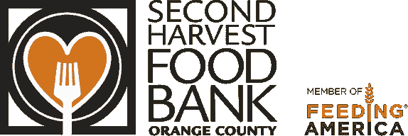
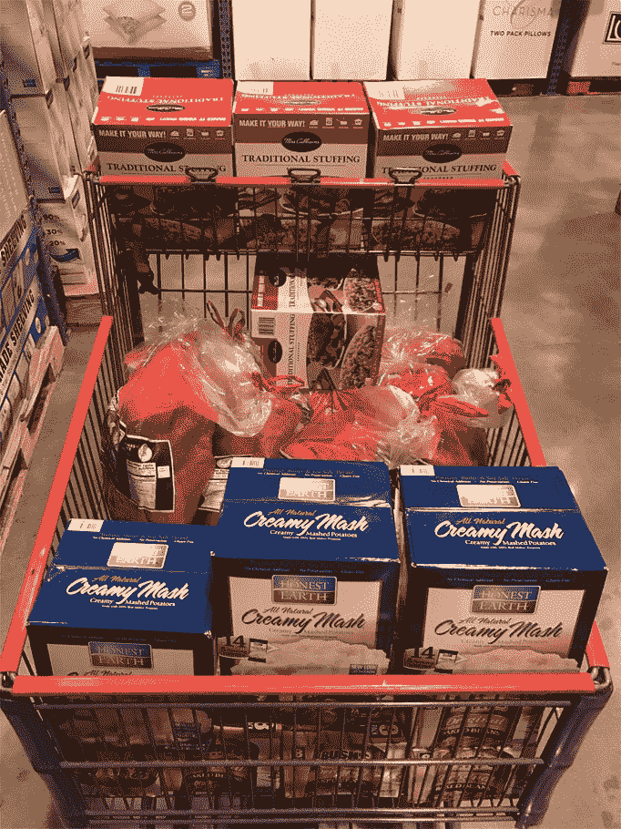

# 金斯塔在感恩节为 300 名无家可归者提供食物

> 原文：<https://kinsta.com/blog/kinsta-feeds-homeless-thanksgiving/>

在金斯塔，我们尽力回馈社区。仅今年一年，我们就在奥兰治县、东京、悉尼、达拉斯、里约热内卢、纳什维尔、凤凰城、西雅图、斯德哥尔摩、日内瓦、乌代布尔、圣保罗和巴塞罗那赞助了单词营。我们还赠送了一份奖学金给我们参加单词营。但有时我们也会回馈非 WordPress 社区。

今年，我们决定为洛杉矶的无家可归者提供食物，向美国最大的食物银行之一第二丰收组织捐赠食物。

我们去了好市多，买了 200 份土豆泥、红薯、面包卷、馅料和烘豆。最后在捐赠现场称了 140 磅的食物，他们说因为我们捐赠了这么多东西，如果加上他们每年收到的火鸡捐赠，他们可以轻松地做 300 顿饭。

如果你的公司想做类似的事情，这里有一些建议。

首先，如果你的团队中有人有好市多或山姆的卡，无论你的预算是多少(我们花了几百)，它都会让你得到比一般杂货店多得多的食物。

第二，如果你要提前购买，一定要检查保质期，以确保食物至少能保存到感恩节之后几天。

第三，你很可能想把重点放在不需要冷藏的物品上，所以这就是我们所做的。像火鸡这样的东西通常是由专业的大型供应商在当天送达的，因为许多避难所缺乏额外的冷藏空间。

最后，在你去购物之前，一定要打电话给收容所，问问他们需要什么。我们做到了，而且效果很好。

* * *

让你所有的[应用程序](https://kinsta.com/application-hosting/)、[数据库](https://kinsta.com/database-hosting/)和 [WordPress 网站](https://kinsta.com/wordpress-hosting/)在线并在一个屋檐下。我们功能丰富的高性能云平台包括:

*   在 MyKinsta 仪表盘中轻松设置和管理
*   24/7 专家支持
*   最好的谷歌云平台硬件和网络，由 Kubernetes 提供最大的可扩展性
*   面向速度和安全性的企业级 Cloudflare 集成
*   全球受众覆盖全球多达 35 个数据中心和 275 多个 pop

在第一个月使用托管的[应用程序或托管](https://kinsta.com/application-hosting/)的[数据库，您可以享受 20 美元的优惠，亲自测试一下。探索我们的](https://kinsta.com/database-hosting/)[计划](https://kinsta.com/plans/)或[与销售人员交谈](https://kinsta.com/contact-us/)以找到最适合您的方式。