# 如何阻止谷歌分析中的语言垃圾

> 原文：<https://kinsta.com/blog/language-spam/>

没有人喜欢垃圾邮件，这可能会让网站所有者非常沮丧，因为它通常需要花时间来设置过滤器，并研究阻止垃圾邮件的最佳方法。

到目前为止，许多人已经习惯于处理[推荐垃圾信息](https://kinsta.com/blog/google-analytics-spam/)，因为这是困扰我们多年的问题。然而，在过去的几个月里，出现了一种新的解决方法，那就是大家现在所说的“T2”语言垃圾邮件“T3”。

你们大多数人可能在 2016 年美国大选前后开始注意到这一点。请遵循我们下面的教程，了解阻止语言垃圾的最佳方式，并防止它扭曲你的流量和分析统计数据。一旦这些问题开始出现，立即解决是非常重要的。

[68% of a WordPress site's traffic we tested was from language spam. 😱 Combat it now.Click to Tweet](https://twitter.com/intent/tweet?url=https%3A%2F%2Fbit.ly%2F2txLDXE&via=kinsta&text=68%25+of+a+WordPress+site%27s+traffic+we+tested+was+from+language+spam.+%F0%9F%98%B1+Combat+it+now.&hashtags=spam%2Cmarketing)

*   什么是语言垃圾邮件？
*   [如何在谷歌分析中拦截语言垃圾](#block-language-spam-google-analytics)

## 什么是语言垃圾邮件？

虽然推荐垃圾邮件主要针对搜索引擎，但语言垃圾邮件通常被垃圾邮件发送者用于特定目的或推广他们自己的网站或产品。所发生的是他们操纵真实网站使用的语言，如 motherboard.vice.com、thenextweb.com、lifehacker.com、reddit.com 等。语言垃圾邮件通常只在你网站的主页上注册浏览量。

他们能得到什么？来自 Dowser [的 Peter Velchev 很好地解释了这一点](http://dowser.org/block-secret-google-com-referral-spam-google-analytics/):

> 这背后的想法是，一旦你看到新访客的网址，你可能会忍不住追踪到它的来源。这反过来会产生对黑客网站的实际访问，从而推动其评级阶梯上升…

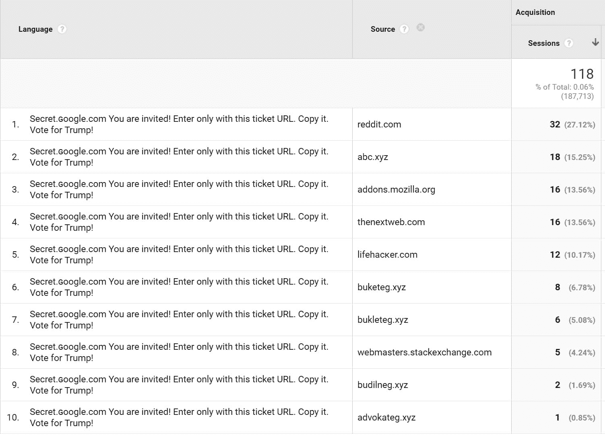

Language spam referral source


语言垃圾可以在你的仪表盘上的谷歌分析[中看到，或者在“受众>地理>语言”部分下看到。以下是您最近可能在报告中看到的一些语言垃圾邮件攻击的例子:](https://kinsta.com/blog/how-to-use-google-analytics/#how-to-use-google-analytics-reports)


> 需要在这里大声喊出来。Kinsta 太神奇了，我用它做我的个人网站。支持是迅速和杰出的，他们的服务器是 WordPress 最快的。
> 
> <footer class="wp-block-kinsta-client-quote__footer">
> 
> 
> 
> <cite class="wp-block-kinsta-client-quote__cite">Phillip Stemann</cite></footer>

[View plans](https://kinsta.com/plans/)

*   Secret.ɢoogle.com 你被邀请了！仅使用此票证 URL 进入。复制它。投票给川普！
*   祝贺特朗普和所有美国人
*   维塔利统治谷歌☆*:｡゜ﾟ･*ヽ(^ᴗ^)ﾉ*･゜ﾟ｡:*☆\_(ツ)_/(ಠ益ಠ)(ಥ‿ಥ)(ʘ‿ʘ)ლ(ಠ_ಠლ)(͜͡ʖ͡)ヽ(ﾟдﾟ)ﾉʕ•̫͡•ʔᶘᵒᴥᵒᶅ(=^ ^=)oo
*   o-o-8-o-o.com 搜索壳比谷歌好得多！
*   谷歌官方推荐 o-o-8-o-o.com 搜索外壳！

谷歌显然正在解决这个问题，但是越来越多的问题不断出现。一旦一个停止，另一个似乎开始。

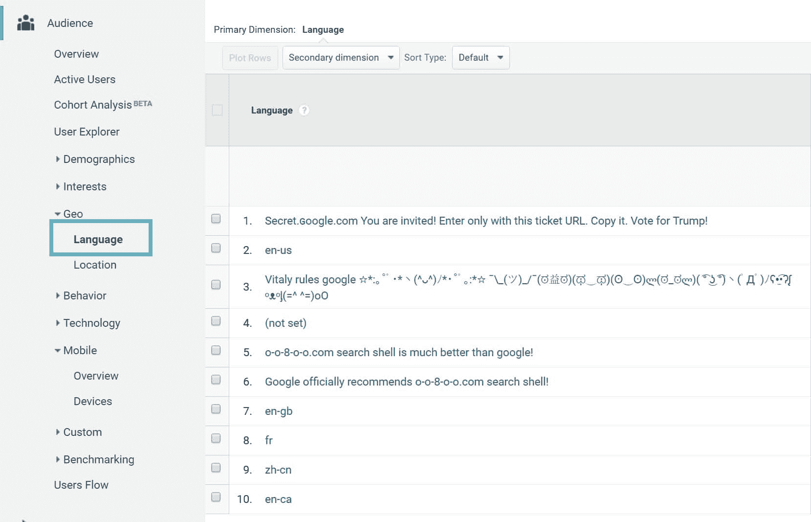

Google Analytics language spam


这是在一个全新的网站上拍摄的截图，如你所见，在 11 月 1 日至 12 月 17 日期间，**1377 个会话中有 929 个来自语言垃圾邮件！**谈谈扭曲你的数据。

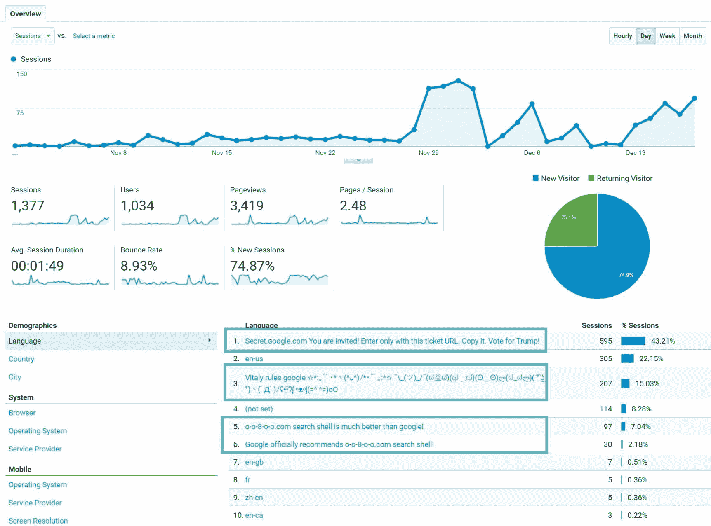

Language spam traffic


语言垃圾问题在 11 月 9 日的搜索引擎圆桌会议上被提出。如果我们看一下[谷歌趋势](https://www.google.com/trends/explore?date=today%203-m&q=google%20analytics%20spam)，我们可以看到从 2016 年 11 月开始，围绕“谷歌垃圾分析”的活动激增。

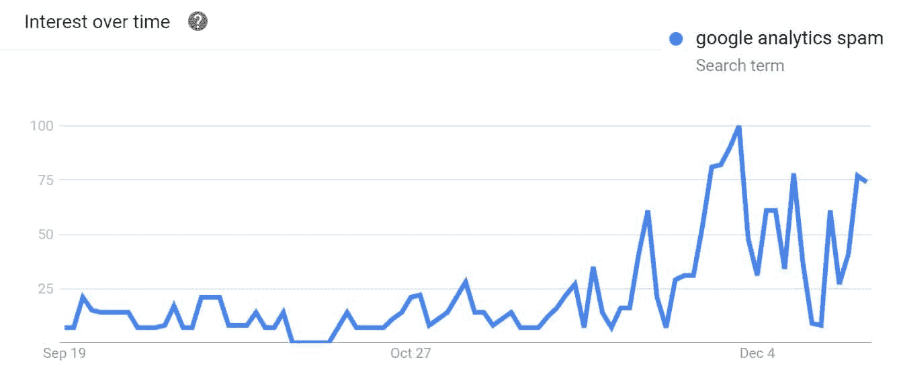

Google Analytics spam trends


### 为什么要屏蔽语言垃圾？

阻止语言垃圾的第一个原因显然是不要完全扭曲你的分析数据，如上所述。如果你想使用你的访问者的语言数据，比如说在一个多语言的 WordPress 设置中，那么你希望数据是准确的。

另一个很多人没有意识到的重要原因是**谷歌分析过滤器不能追溯应用**。这意味着过滤器仅适用于从过滤器创建之日起收集的数据。这就是为什么立即解决垃圾邮件问题很重要。历史数据不能用过滤器来修复。然而，这样做的缺点是，如果您错误地实现了过滤器，您可能会永远丢失有价值的数据。还有**高级段**可以帮助你处理历史数据，我们将在下面详细介绍。


## 如何阻止谷歌分析中的语言垃圾

在谷歌分析中处理语言垃圾[有几个选择。我们不一定推荐使用插件，因为通常在接近问题根源的地方使用会更好。还有，外挂很难](https://kinsta.com/blog/google-analytics-wordpress/)[消除幽灵下线](https://kinsta.com/blog/google-analytics-spam/)。在处理、过滤和分割数据方面，谷歌分析实际上非常强大。通过不使用插件，你可以确保无论你的网站安装发生什么情况，过滤器/片段都不会被移除。

*   [选项 1:用过滤器阻止语言垃圾邮件](#language-spam-filter)
*   [选项 2:用高级段拦截语言垃圾邮件](#language-spam-segment)
*   [选项 3:用第三方列表阻止语言垃圾邮件](#language-spam-3rd-party-lists)

### 选项 1:用过滤器阻止语言垃圾邮件

在 Google Analytics 中阻止语言垃圾的第一个也可能是最简单的方法是使用过滤器。过滤器允许您修改和限制数据。例如，您可以从特定 IP 或 IP 范围中排除某些子目录、白名单流量等。我们建议您在创建过滤器时设置一个新的视图，因为如果出现任何问题，您应该始终可以访问您的原始数据。然后将所有自定义过滤器应用于新视图。

**第一步(可选)**

第一步是复制当前视图，这样就可以只在单独的视图中筛选数据。为了您的安全，这是可选的。您可能已经有了一个单独的视图，在这种情况下，您可以跳到步骤 2。否则，点击进入谷歌分析的管理部分，进入你当前的“视图设置”然后点击“复制视图”你之所以要使用 copy，是因为它会延续你网站上已经有的其他过滤器和目标。

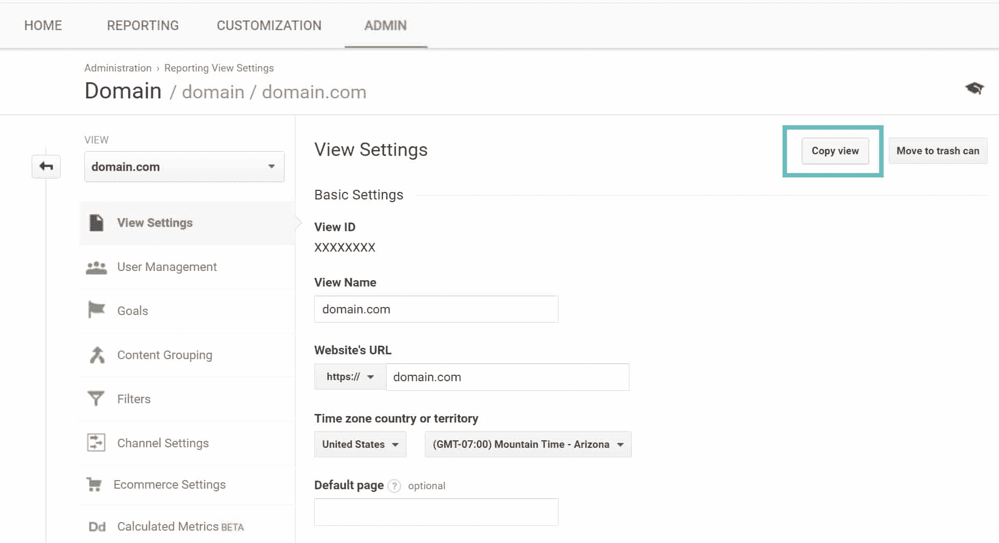

Copy view in Google Analytics


命名您的新视图。在我们的示例中，我们选择“filtered domain.com”，然后单击“Copy view”

## 注册订阅时事通讯


### 想知道我们是怎么让流量增长超过 1000%的吗？

加入 20，000 多名获得我们每周时事通讯和内部消息的人的行列吧！

[Subscribe Now](#newsletter)


Copy view


**第二步**

点击进入新的过滤视图(或原始视图)并点击进入“过滤器”然后点击“+添加过滤器。”

You will need “Edit” access at the “Account” level in Google Analytics in order to set up new filters, or you won’t have the ability to follow through on these next steps.

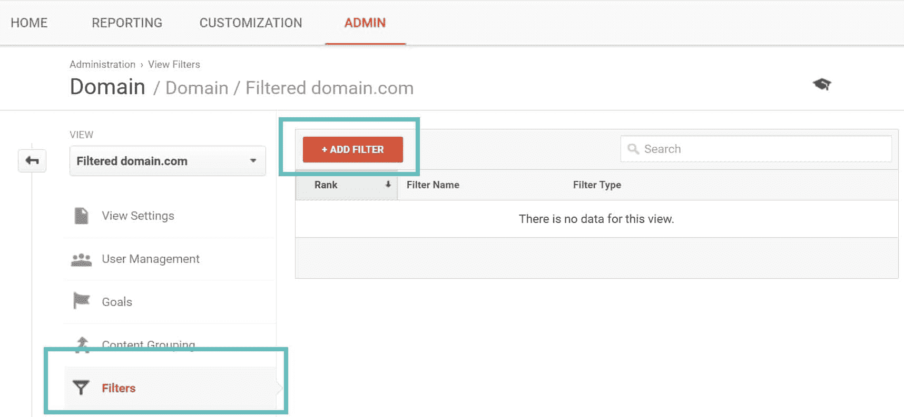

Add new filter in Google Analytics


**第三步**

给你的过滤器一个名字(例如:过滤语言垃圾邮件)。然后从过滤器类型中选择自定义。您需要选择“语言设置”过滤器，并在过滤器模式字段中输入以下内容:

```
.{15,}|\s[^\s]*\s|\.|,|\!|\/
```

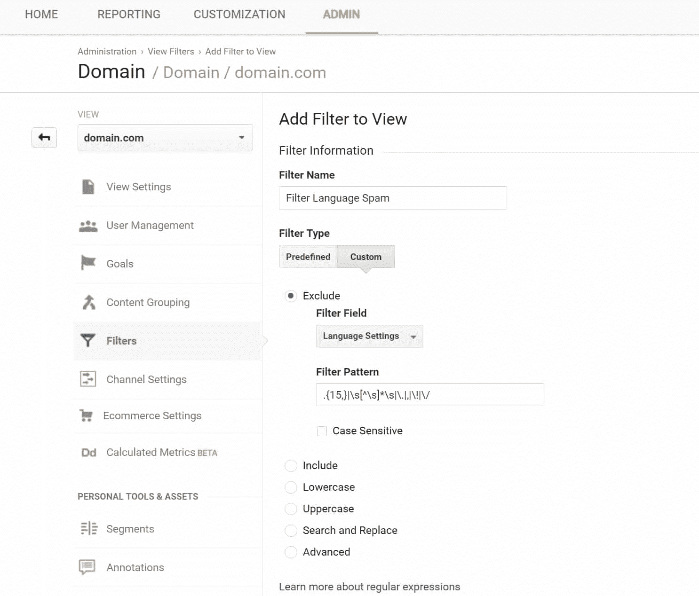

Language spam filter


然后，您可以单击“验证”按钮，查看过滤器在过去 7 天中发现的内容示例。然后单击“保存”以应用过滤器。

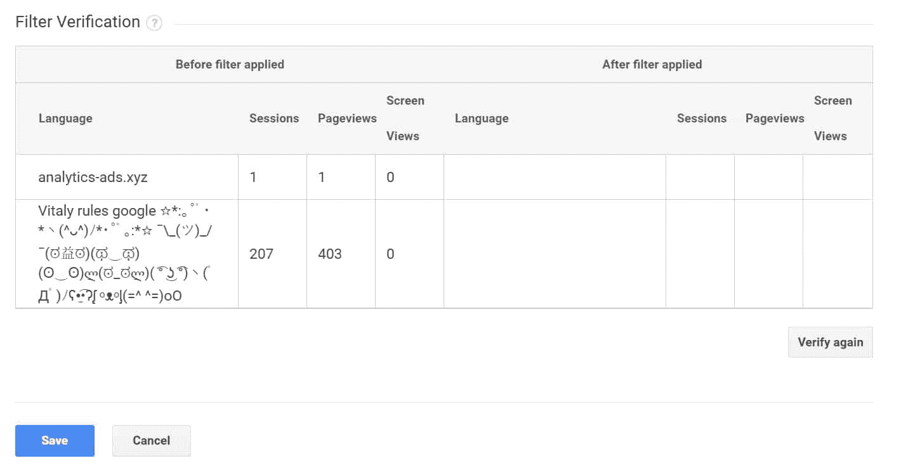

Verify language spam filter


就是这样！你现在只能在谷歌分析中看到有效的/真实的语言。

Struggling with downtime and WordPress problems? Kinsta is the hosting solution designed to save you time! [Check out our features](https://kinsta.com/features/)

### 选项 2:用高级段拦截语言垃圾邮件

在谷歌分析中，对抗语言垃圾的第二个选择是使用高级段。这些实际上与您的历史数据一起工作，并且通常被认为是更改您的数据的更安全的选择，因为它们不会改变任何东西。您可以随时取消激活它们以返回到以前的状态。然而，如果你使用一个带有过滤器的**单独视图，就像我们上面展示的那样，这也是安全的。**

**第一步**

要创建一个细分市场，请点击谷歌分析的管理部分，进入“细分市场”然后点击“+新细分。”

Just like with filters, you will need “Edit” access at the “Account” level in Google Analytics in order to set up new filters, or you won’t have the ability to follow through on these next steps.

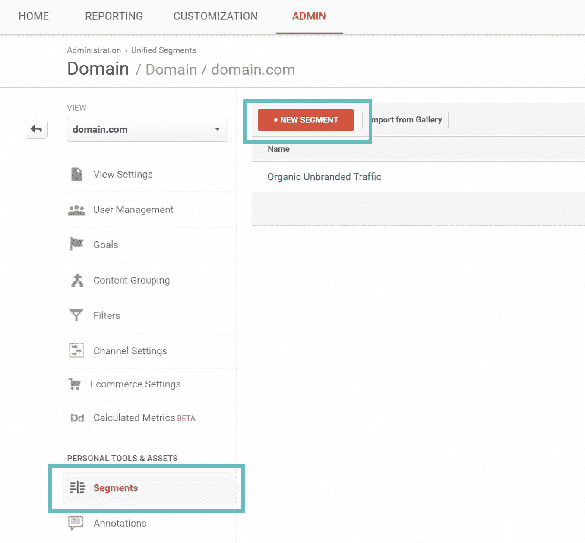

Create segment in Google Analytics


**第二步**

为您的段命名(例如:段语言垃圾邮件),在语言字段下，将下拉列表更改为“不匹配正则表达式”,并输入以下内容:

```
.{15,}|\s[^\s]*\s|\.|,|\!|\/
```

然后点击“保存”

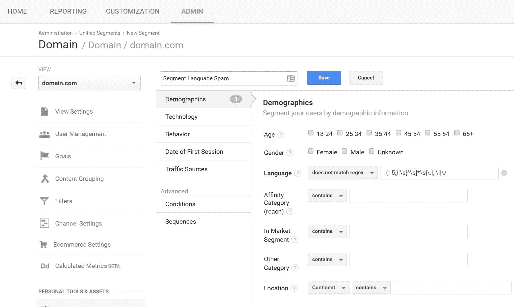

Language spam advanced segment


仅此而已。然后，您可以在 Analytics dashboard 上选择该语言段，并删除“所有用户”请记住，数据段会实时修改数据。提示:您可以使用已经应用的新细分创建自定义仪表板/快捷方式，以便以后快速查看。

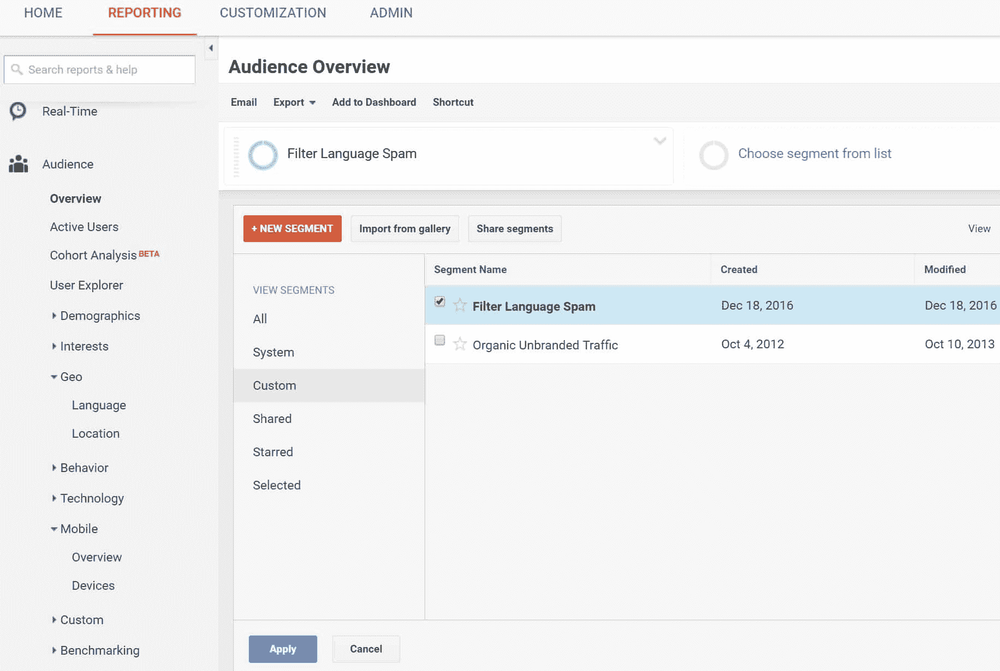

View segment in Google Analytics


### 选项 3:用第三方列表阻止语言垃圾邮件

垃圾邮件最令人讨厌的一点是，对于我们这些网站所有者来说，这很费时间。我们必须不断更新我们的细分市场和过滤器，以确保我们的数据尽可能准确。但是，如果您没有时间，也有一些资源和第三方工具可以帮助您加快这个过程。以下是你可能想看看的几个选项:

*   Analytics-Toolkit:这家公司提供了一个他们称之为[的自动垃圾邮件过滤器](https://www.analytics-toolkit.com/auto-spam-filters/)，它会为你不断更新。
*   Analytics Edge 有免费的[预建段](https://analytics.google.com/analytics/gallery/#posts/search/%3F_.term%3Dauthor%3A%22Analytics%20Edge%22%26_.start%3D0/)，您只需点击一下即可使用。这些也在不断更新。

如果你有兴趣更深入地了解如何最好地从 Google Analytics 中删除垃圾邮件，以下这些教程很棒:

*   [消除谷歌分析中所有垃圾信息的终极指南](https://www.ohow.co/ultimate-guide-to-removing-irrelevant-traffic-in-google-analytics/)
*   [清除所有谷歌分析垃圾邮件的权威指南](http://help.analyticsedge.com/spam-filter/definitive-guide-to-removing-google-analytics-spam/)

## 摘要

如您所见，过滤和排除这种新的语言垃圾邮件策略非常容易。我们建议浏览您网站上的分析，并确保您的数据没有失真。你对语言垃圾有什么看法？我们发现这简直是令人讨厌，希望在未来谷歌可以帮助打击更多的这种无用的数据，企业主现在不得不处理。

* * *

让你所有的[应用程序](https://kinsta.com/application-hosting/)、[数据库](https://kinsta.com/database-hosting/)和 [WordPress 网站](https://kinsta.com/wordpress-hosting/)在线并在一个屋檐下。我们功能丰富的高性能云平台包括:

*   在 MyKinsta 仪表盘中轻松设置和管理
*   24/7 专家支持
*   最好的谷歌云平台硬件和网络，由 Kubernetes 提供最大的可扩展性
*   面向速度和安全性的企业级 Cloudflare 集成
*   全球受众覆盖全球多达 35 个数据中心和 275 多个 pop

在第一个月使用托管的[应用程序或托管](https://kinsta.com/application-hosting/)的[数据库，您可以享受 20 美元的优惠，亲自测试一下。探索我们的](https://kinsta.com/database-hosting/)[计划](https://kinsta.com/plans/)或[与销售人员交谈](https://kinsta.com/contact-us/)以找到最适合您的方式。