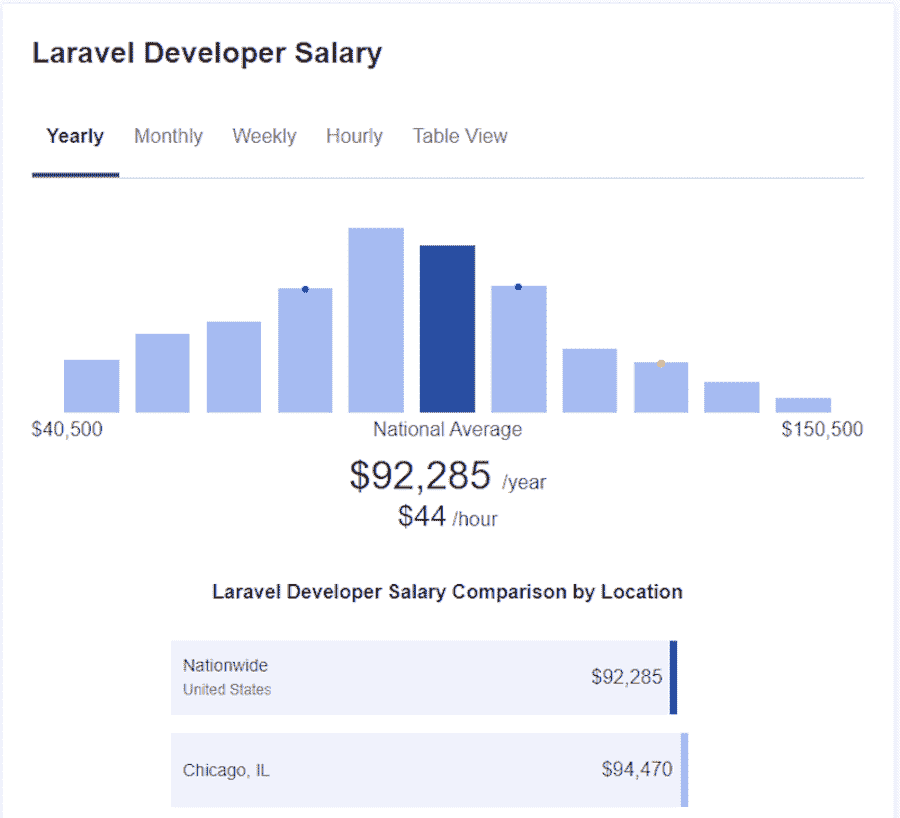
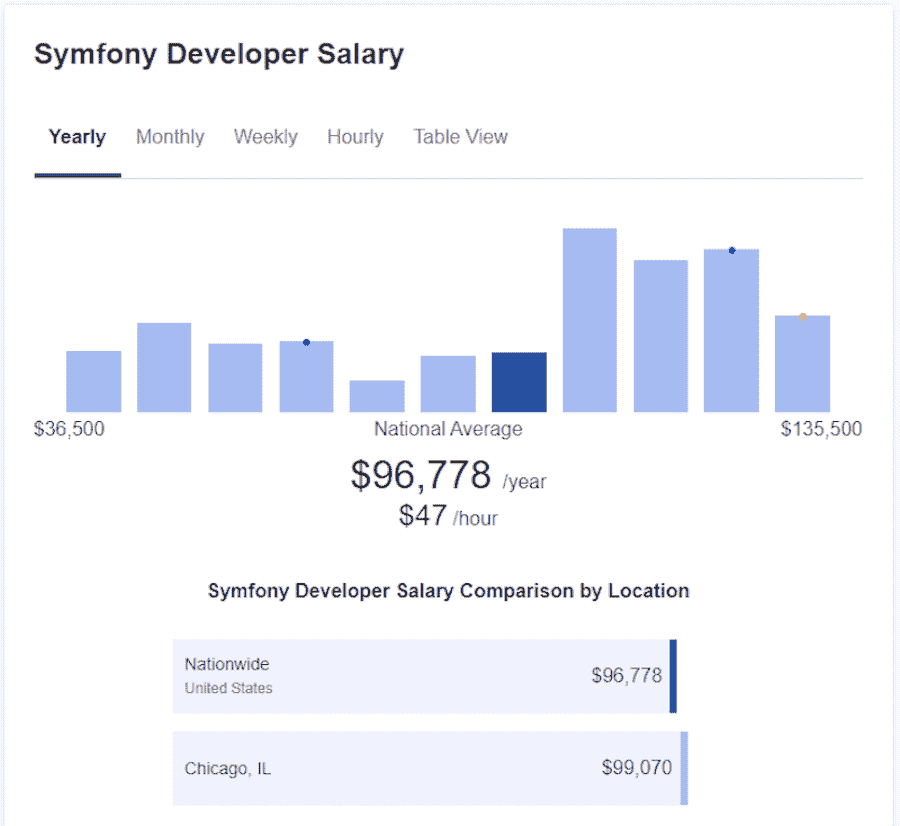
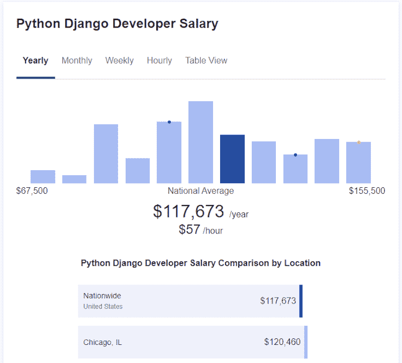
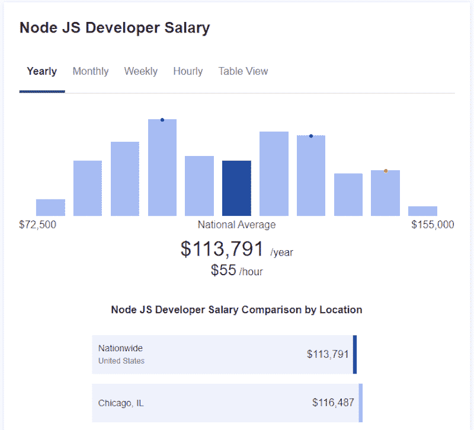
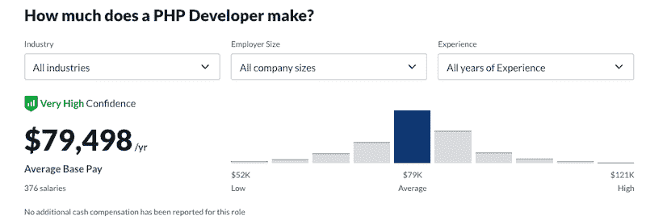

# Laravel 开发者的平均工资是多少？2022 年的新数据

> 原文：<https://kinsta.com/blog/laravel-developer-salary/>

不管你可能听说了什么，PHP 并没有死亡，它比以往任何时候都更受欢迎。无论你是一个经验丰富的 PHP 开发人员，还是刚进入这个领域，在开始找工作之前准备好当前的工资数据是明智的。

PHP 开发人员的平均年薪是 81，000 美元。虽然不是编程行业的最高工资，但对于一个多面手 PHP 程序员来说，这当然是不错的。

但是当你决定专注于像 Laravel 这样的 PHP 框架时会发生什么呢？Laravel 开发人员的平均工资与[类似开发人员的工资](https://kinsta.com/blog/web-developer-salary/)相比如何？如果你决定缩小差距，成为一名 Laravel 专业人士，你的工作要求会有什么变化？

这就是我们将在本文中讨论的内容。我们还将讨论从事 Laravel 开发是否值得。

## 拉勒维尔:这是什么？

在我们进入实质细节之前，让我们澄清一下【Laravel 是什么以及它的用途。

Laravel 是 PHP 的一个 [web 应用框架](https://kinsta.com/blog/php-frameworks/)(类似于 Ruby on Rails 或 ASP.NET)。这是一个免费的开源框架，包括各种资源，如库和 API，使得使用 PHP 更加容易。框架也加速了开发过程，使得构建和部署站点和应用程序更快。

[Despite what you may have heard, PHP isn't dead 😉 In fact, it's more in demand than ever! 💰 Learn what you can make as a specialized Laravel developer with this guideClick to Tweet](https://twitter.com/intent/tweet?url=https%3A%2F%2Fkinsta.com%2Fblog%2Flaravel-developer-salary%2F&via=kinsta&text=Despite+what+you+may+have+heard%2C+PHP+isn%27t+dead+%F0%9F%98%89+In+fact%2C+it%27s+more+in+demand+than+ever%21+%F0%9F%92%B0+Learn+what+you+can+make+as+a+specialized+Laravel+developer+with+this+guide&hashtags=PHP%2CLaravel)

Laravel 用于开发使用 MVC(模型-视图-控制器)模式的网站和应用程序。它使 PHP 代码变得可读和简单，也方便了常见的开发任务。

此外，大量的 Laravel 工具，比如 [Laravel Forge](https://forge.laravel.com/) ，可以帮助你在流行的服务器上部署你的项目。

典型的 Laravel 项目包括科学、技术和电子商务网站；售票和订购系统；和管理仪表板，用于更复杂的实时应用程序。也就是说，Laravel 可以用于任何规模的项目。

Laravel 相对来说比较好学。你会在[官方网站](https://laravel.com/)上找到大量文档，以及大量在线 [Laravel 教程和资源](https://kinsta.com/blog/laravel-tutorial/)来帮助你踏上学习之旅。

### Laravel 开发人员要求和责任

作为一名 Laravel 开发人员，您需要掌握几项技能。精通 PHP 是必须的，但你也需要知道如何使用和管理[数据库和 SQL](https://kinsta.com/knowledgebase/what-is-mysql/) 。

服务器工具和技术的知识会派上用场，前端开发的 T2 技能也会派上用场。更具体地说，你需要知道其他[编程语言](https://kinsta.com/blog/best-programming-language-to-learn/)的基础，尤其是 [HTML](https://kinsta.com/blog/html-vs-html5/) ，CSS 和 JavaScript。

虽然拥有计算机科学相关领域的学士学位或更好的学位是很好的，但这并不是必要的，因为即使你是自学的或只参加过编码训练营，你也可以成为一名成功的 Laravel 开发人员。

作为一名 Laravel 开发人员，你的主要职责是开发和维护 [web 应用程序](https://kinsta.com/blog/nodejs-vs-python/)，根据需要编写安全的模块化代码，开发必要的 PHP 模块。

你还将和其他人一起工作——无论是在开发团队还是在公司的其他团队，比如营销或运营团队。您在这里的主要职责是确保 web 应用程序拥有所有必要的功能。您还将处理[调试和优化](https://kinsta.com/blog/wordpress-debug/)代码的任务。

其他职责可能包括[测试和优化](https://kinsta.com/blog/performance-testing-tools/)用户界面、设计数据库、记录整个流程和开发计划，以及检查代码在整个应用程序中的有效性和一致性。

### Laravel 有需求吗？

到目前为止，我们已经介绍了什么是 Laravel，以及如果您决定成为 Laravel 开发人员，您的责任是什么。但是 Laravel 受欢迎吗？

根据 [BuiltWith](https://trends.builtwith.com/framework/Laravel) 汇编的 Laraval 使用统计数据，Laravel 的受欢迎程度一直在稳步增长，有超过 70 万个现场网站在使用它。

根据 [Stack Overflow 从 2021 年开始的开发者调查](https://insights.stackoverflow.com/survey/2021#web-frameworks)，Laravel 框架被 10%的开发者使用。Laravel 还被 SitePoint 评为 2015 年 T2 最受欢迎的框架。虽然它在[堆栈溢出趋势](https://insights.stackoverflow.com/trends?tags=laravel)上不是排名第一的框架，但它仍然有相当多的追随者，这表明作为 Laravel 开发人员的职业生涯是可行的。

## Laravel 开发人员的平均工资

既然我们已经介绍了作为一名 Laravel 开发人员的基本细节，是时候看看这些数字了，看看它们描绘了什么样的画面。

[根据 Glassdoor](https://www.glassdoor.com/Salaries/laravel-php-developer-salary-SRCH_KO0,21.htm) 的数据，Laravel 开发人员的平均年薪为 90487 美元。这是基于向 Glassdoor 报告的 8640 份工资，最低工资为 6.5 万美元，最高为 12.6 万美元。

Average Laravel salary according to ZipRecruiter.

ZipRecruiter 报告的数字略高，为每年 92，285 美元，最低 4 万美元，最高 15 万美元。

另一方面，Payscale 报告的数字略低，为每年 7.8 万美元，而[Salary.com 同样列出了](https://www.salary.com/research/salary/posting/laravel-developer-salary)平均年薪 7.9 万美元，最低 6.5 万美元，最高 9.5 万美元。

当你把上面的数字平均一下，最终的数字是每年 85，000 美元。虽然不像其他类似的工作那样收入很高，但这仍然是一份不错的薪水。

先不说这个，让我们看看 Laravel 开发人员的工资与类似职业相比如何，以及经验和位置在你能赚多少钱方面如何发挥作用。

### 经验工资

不管你决定从事什么样的职业，有一点是肯定的:你的经验越多，你挣的就越多。作为一名 Laravel 开发人员也不例外。

根据 Glassdoor 的数据，作为一名初级 Laravel 开发人员，你可以期望平均每年赚 56K 美元。

在你的职业生涯中，你可以期待 3 万美元的增长——在 ZipRecruiter 上列出的高级 Laravel 开发人员的平均工资为 8.6 万美元/年[。](https://www.ziprecruiter.com/Salaries/Junior-Laravel-Developer-Salary)

### 按国家列出的 Laravel 开发人员工资

上面列出的数字都是美国的数据。那么，当谈到 Laravel 开发人员的工资时，其他国家的情况如何呢？

下面，我们列出了几个不同国家的数据，让你对薪酬差异有所了解。请注意，为了便于比较，工资已转换为美元。

*   [Bangladesh](https://www.payscale.com/research/BD/Skill=Laravel_Web_Framework/Salary) :每年 4K 美元或৳360K BDT
*   加拿大:5.3 万美元/年或 6.8 万加元/年
*   4K 美元/年或埃及镑 61K/年
*   德国:5.3 万美元/年或 4.5 万欧元/年
*   ₹403K/year 每年 5000 美元
*   4K 美元/年或 6000 万印尼盾/年
*   意大利:3.1 万美元/年或 2.6 万欧元/年
*   [马拉西亚](https://www.payscale.com/research/MY/Skill=Laravel_Web_Framework/Salary):10K 美元/年或 42000 令吉/年
*   荷兰:4.9 万美元/年或 4.2 万欧元/年
*   新西兰:56K 美元/年或 79K 新西兰元/年
*   4K 美元/年或 72 万卢比/年
*   ₱313K/year 每年 6000 美元
*   葡萄牙:18K 美元/年或 15K 欧元/年
*   俄国:960k₽/year 每年 1.3 万美元
*   新加坡:3.3 万美元/年或 4.5 万新元/年
*   南非:2.3 万美元/年或 34.6 万兰特/年
*   西班牙:2.8 万美元/年或 2.4 万欧元/年
*   斯里兰卡:5000 美元/年或 100 万 LKR/年
*   [英国](https://www.payscale.com/research/UK/Skill=Laravel_Web_Framework/Salary):4.1 万美元/年或者 3 万美元/年

基于这些数字，我们可以看到加拿大、新西兰和大部分西欧国家提供与美国相当的薪水。与此同时，西班牙和葡萄牙沿线的亚洲和非洲国家列出了最低的 Laravel 开发人员工资。

## 注册订阅时事通讯

### 想知道我们是怎么让流量增长超过 1000%的吗？

加入 20，000 多名获得我们每周时事通讯和内部消息的人的行列吧！

[Subscribe Now](#newsletter)

换句话说，如果你生活在一个更发达的国家，你会挣得更多。通过这些数字，很容易看出你的位置会显著影响你的薪水。

### Laravel vs Symfony、Django 和 Node.js

说到 web 应用程序框架，并不缺少选择。现在最流行的框架是 Symfony、 [Django](https://kinsta.com/blog/django-vs-wordpress/) 和 [Node.js](https://kinsta.com/knowledgebase/what-is-node-js/) ，分别是 PHP、Python 和 JavaScript 框架。

这是他们的工资总额。

就 Symfony 而言， [Glassdoor 报道](https://www.glassdoor.com/Salaries/symfony-developer-salary-SRCH_KO0,17.htm)平均年薪为 8.1 万美元，最低为 4.7 万美元，最高为 13.8 万美元。 [ZipRecruiter 列出了略高的数字，Symfony 开发人员的平均年薪为 9.7 万美元。](https://www.ziprecruiter.com/Salaries/Symfony-Developer-Salary)

Average Symfony developer salary according to ZipRecruiter.

作为一名 Django 开发人员工作会导致数字稍微高一点。

更具体地说， [Glassdoor 列出了](https://www.glassdoor.com/Salaries/django-developer-salary-SRCH_KO0,16.htm)Django 开发人员的平均年薪为 9 万美元，最低为 61 美元，最高为 13.1 万美元。 [ZipRecruiter 的数据](https://www.ziprecruiter.com/Salaries/Python-Django-Developer-Salary)为每年 1.8 万美元，而 [Payscale 的数据](https://www.payscale.com/research/US/Skill=Django/Salary)是三家公司中最低的，每年 8.9 万美元。

Average Python Django developer salary according to ZipRecruiter.

最后，我们来看看一个 Node.js 开发者的[平均工资。](https://kinsta.com/blog/node-js-developer-salary/)

[据 Glassdoor](https://www.glassdoor.com/Salaries/node-js-developer-salary-SRCH_KO0,17.htm) 报道，平均年薪为 88K 美元，最低 64K 美元，最高 126K 美元。 [ZipRecruiter 说](https://www.ziprecruiter.com/Salaries/Node-JS-Developer-Salary)node . js 开发人员的平均工资是 11.4 万美元/年，而 [Payscale 列出的是](https://www.payscale.com/research/US/Job=Node.JS_Developer/Salary)10.5 万美元/年。

Average Node.js developer salary on ZipRecruiter.

如果我们处理所有这些数字，我们会得到以下信息:

*   Symfony 开发人员平均工资:8.9 万美元/年
*   Django 开发人员的平均工资:9.9 万美元/年
*   Node.js 开发人员的平均工资:10.2 万美元/年

从这些数字中，很容易看出 Laravel 开发人员的平均工资较低。然而，差别并不太大，尤其是与其他 PHP 框架相比。

需要一流的，快速的，安全的主机为您的新电子商务网站？Kinsta 提供超快的服务器和来自 WooCommerce 专家的 24/7 世界级支持。[查看我们的计划](https://kinsta.com/plans/?in-article-cta)

同样值得注意的是，Node.js 既可以用作前端框架[，也可以用作后端框架](https://kinsta.com/blog/node-js-apps/)，所以平均工资最高也就不足为奇了。

### Laravel 开发者工资 vs PHP 开发者工资

作为一名 Laravel 开发人员，您将拥有更专业的技能和知识。说到你的薪水，和一个 PHP 开发人员的平均薪水相比会有多大的不同？

数字是这样说的。

Average PHP developer salary on Glassdoor.

如果你是一名 PHP 开发人员， [Glassdoor 报道](https://www.glassdoor.com/Salaries/php-developer-salary-SRCH_KO0,13.htm)平均年薪为 8.1 万美元，最低 5.5 万美元，最高 10 万美元。 [ZipRecruiter 列出的](https://www.ziprecruiter.com/Salaries/PHP-Developer-Salary) it 费用为 86K 美元/年，最低 16K 美元，最高 137K 美元。

[Payscale 报道](https://www.payscale.com/research/US/Job=PHP_Developer/Salary)一个 PHP 开发人员的平均工资为 64K 美元/年，最低 43K 美元，最高 94K 美元。最后，[确实列出了平均年薪 94，000 美元。](https://www.indeed.com/career/php-developer/salaries)

上面的数字给出了平均 81，000 美元/年，只比一个 Laravel 开发人员的平均工资少$4K。

### Laravel 开发人员工资与后端和全栈开发人员工资

Laravel 开发人员比非专业 PHP 开发人员略胜一筹……但是当你把他们的薪水与后端或全栈开发人员的要求更高的职业相比时，会发生什么呢？

就全栈开发人员的[平均工资而言，最终平均工资充分说明了这个职位的要求有多高:](https://kinsta.com/blog/full-stack-developers-salary/)

*   实际上:10.8 万美元/年，基于 1.05 万的报告工资
*   glass door:99K 美元/年，最低 63K 美元，最高 157K 美元
*   zip recruiter:10.3 万美元/年(49 美元/小时)，最低 3.8 万美元，最高 15.9 万美元
*   工资级别:79K 美元/年，最低 54K 美元，最高 115K 美元

至于[后端开发人员的工资](https://kinsta.com/blog/backend-developer-salary/),以下是主要网站列出的工资:

*   玻璃门:8.1 万美元/年
*   zip recruiter:10 万美元/年
*   薪酬等级:8.1 万美元/年

从上面的这些数字来看，全栈开发人员的平均工资为 97，000 美元/年，而后端开发人员的工资为 87，000 美元/年。

换句话说，作为一名后端开发人员，你将获得与 Laravel 开发人员相当的薪水。拥有全栈开发人员的前端开发技能和后端开发技能将会让你每年多赚$10K。

如果你正在考虑做一名 Laravel 开发人员，[提高你的前端开发技能](https://kinsta.com/blog/html-best-practices/)以及你在 Laravel 开发方面的技能可能是一个获得加薪和增加你日常工作需求多样性的好方法。

## Laravel 开发值得吗？

如前所述，Laravel 框架越来越受欢迎。这是一个相当容易学习的框架，比你作为一个非专业的 PHP 开发人员赚的要多一点。

然而，请记住，一些更受欢迎的工作，如 Django 开发人员或全栈开发人员，会带来更好的工资。

与其他类似的工作相比，作为一名 Laravel 开发人员，你的收入会比专注于一个不同的框架要少一些。然而，差别并不太大。

值得一提的是，如果金钱是主要考虑因素，你可以不断扩展你的技能组合，并在职业生涯的后期添加另一个框架。与任何其他工作一样，随着职业的发展，以及获得更多经验和对 Laravel 框架的实际使用，你会赚得更多。

这种特殊的 PHP 框架越来越受欢迎，并被评为最受欢迎和喜爱的 PHP 框架之一，因此工作保障看起来相当不错。

## 摘要

Laravel 开发人员无疑是一个不错的选择。根据我们上面看到的数字，平均工资略高于 PHP 开发人员，这证明了专攻某项特定技术可以带来工资增长。

要成为一名 Laravel 开发人员，您需要拓宽自己的技能。你的工作职责会比你是一名普通的 PHP 开发人员要求稍微高一点，但不会像一名全栈开发人员或一名 DevOps 工程师那样要求高。

考虑到这一点，如果您希望有机会与其他人合作，并在运行整个行业的令人兴奋的项目上工作，那么成为 Laravel 开发人员是一个体面而可行的职业选择。

你对 Laravel 开发人员的工资水平有什么看法？请在评论区告诉我们！

* * *

让你所有的[应用程序](https://kinsta.com/application-hosting/)、[数据库](https://kinsta.com/database-hosting/)和 [WordPress 网站](https://kinsta.com/wordpress-hosting/)在线并在一个屋檐下。我们功能丰富的高性能云平台包括:

*   在 MyKinsta 仪表盘中轻松设置和管理
*   24/7 专家支持
*   最好的谷歌云平台硬件和网络，由 Kubernetes 提供最大的可扩展性
*   面向速度和安全性的企业级 Cloudflare 集成
*   全球受众覆盖全球多达 35 个数据中心和 275 多个 pop

在第一个月使用托管的[应用程序或托管](https://kinsta.com/application-hosting/)的[数据库，您可以享受 20 美元的优惠，亲自测试一下。探索我们的](https://kinsta.com/database-hosting/)[计划](https://kinsta.com/plans/)或[与销售人员交谈](https://kinsta.com/contact-us/)以找到最适合您的方式。