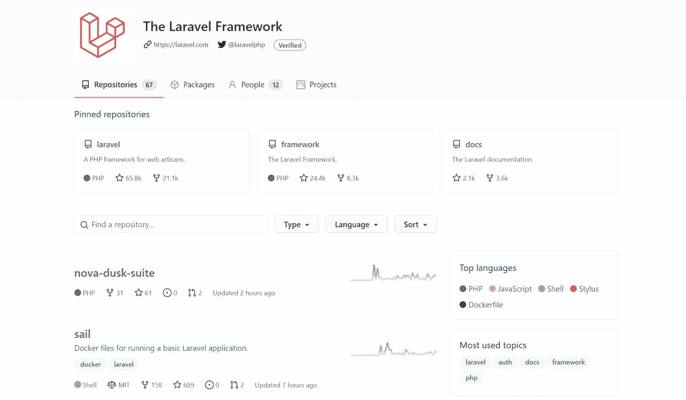
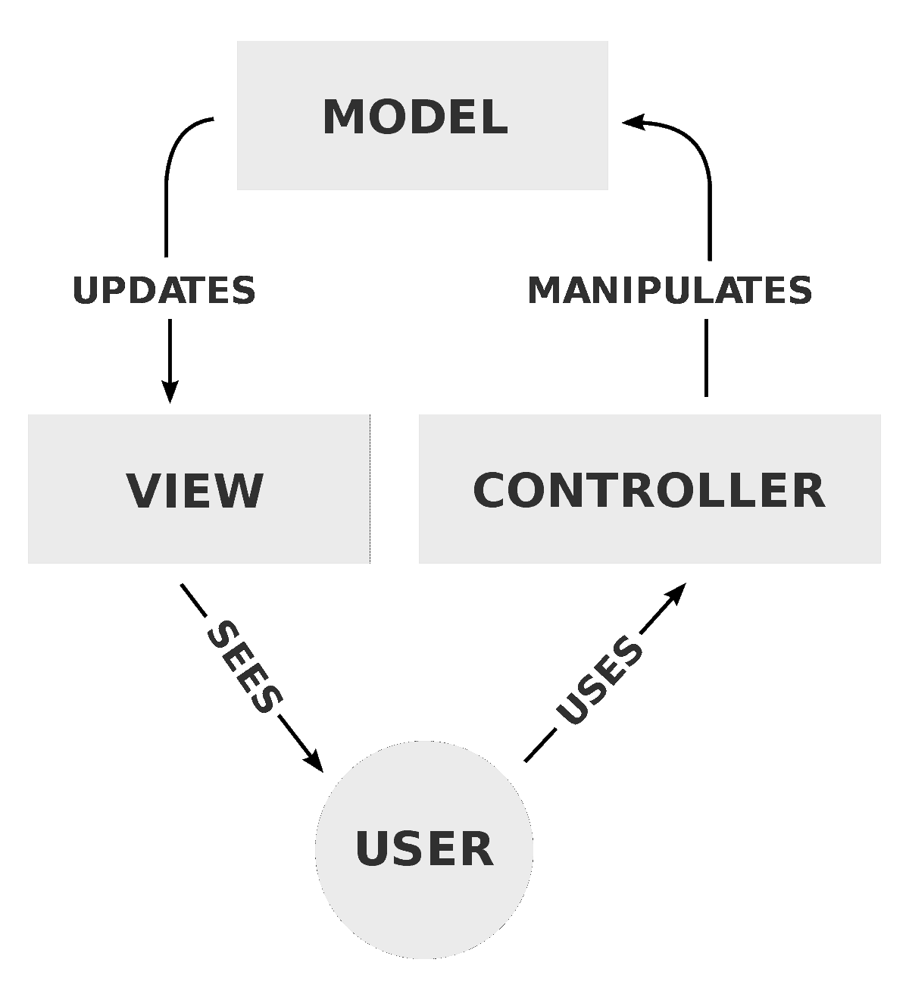
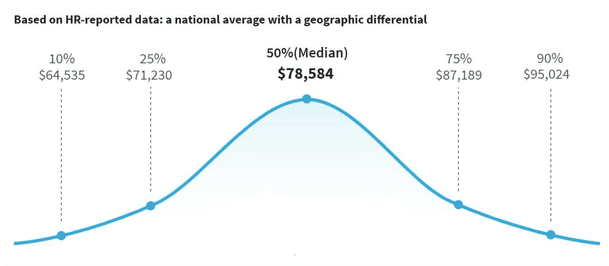
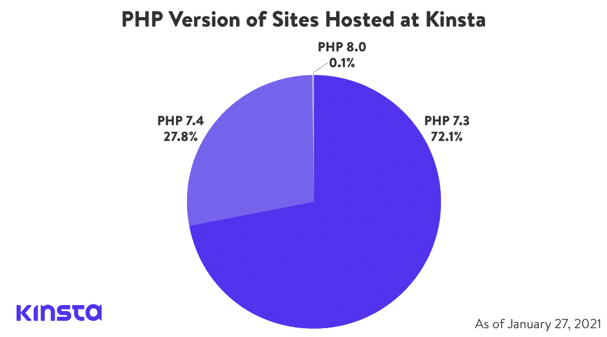
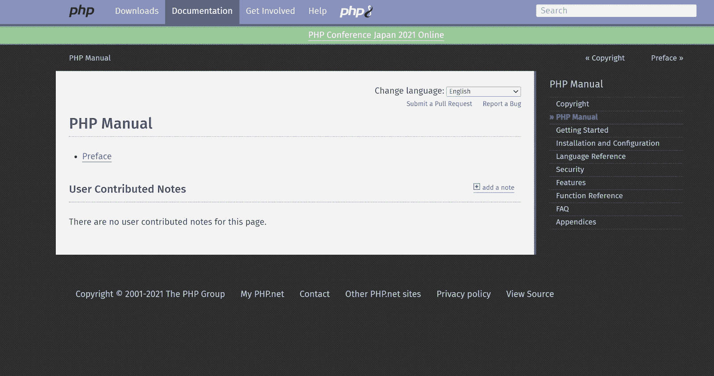
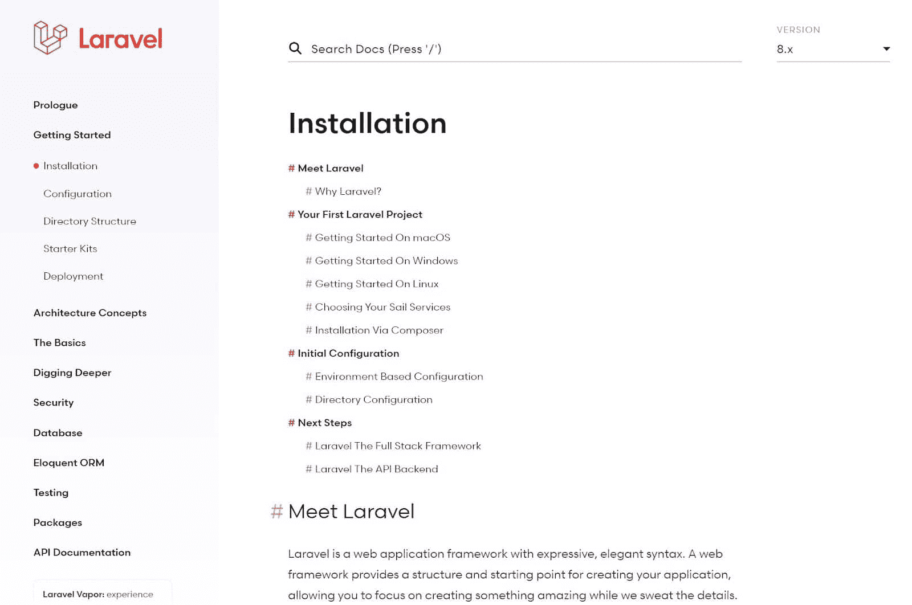
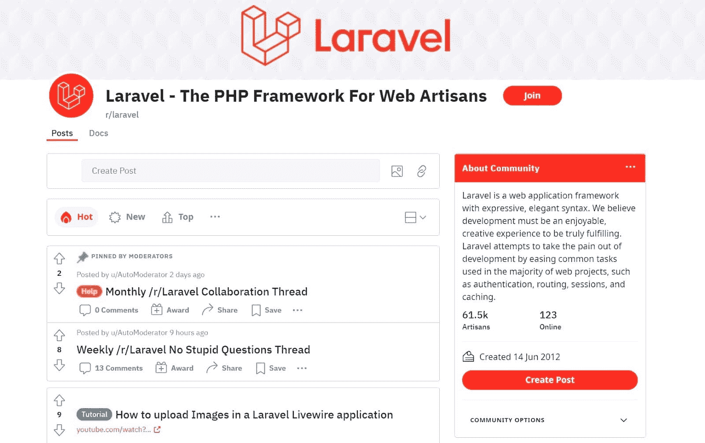
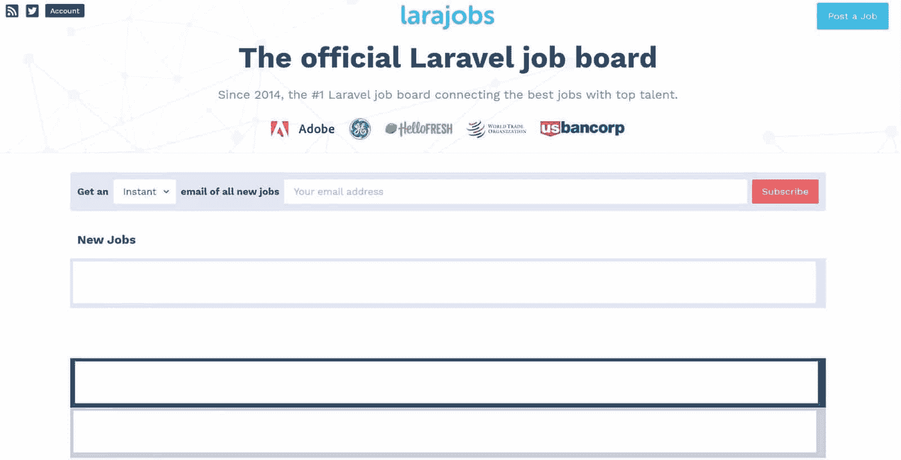

# 想成为 Laravel 开发者？这是你需要知道的一切

> 原文：<https://kinsta.com/blog/laravel-developer/>

自 2011 年以来，Laravel 在全球范围内越来越受欢迎。今天，超过[130 万个网站](https://trends.builtwith.com/framework/Laravel)使用 Laravel 框架，包括美国托管的 284，000 多个网站。

Laravel 是一个优秀的 web 应用程序框架，因为它可以帮助开发人员快速轻松地构建项目。因此，很自然地，对 Laravel 开发人员的需求预计在未来几年只会增长。

在本指南中，您将了解成为 Laravel 开发专家所需的一切。这包括什么是 Laravel 开发，它是如何工作的，以及作为开发人员工作时需要的技能。

我们还将介绍在雇佣 Laravel 开发人员将这一技能引入内部时需要注意的事项。

### 查看我们的[视频指南](https://www.youtube.com/watch?v=oqHV9TOOLY4)成为一名 Laravel 开发者

T3】

## 什么是 Laravel？

在您将 Laravel 发展作为职业进行探索之前，您需要了解 Laravel 的基础知识。

Laravel 是一个用于创建网站和网络应用的开发框架。Laravel 的创造者泰勒·奥特威尔在 2011 年 6 月 9 日发布了它的测试版。此后，Laravel 出现了八个主要版本，包括:

> Kinsta 把我宠坏了，所以我现在要求每个供应商都提供这样的服务。我们还试图通过我们的 SaaS 工具支持达到这一水平。
> 
> <footer class="wp-block-kinsta-client-quote__footer">
> 
> 
> 
> <cite class="wp-block-kinsta-client-quote__cite">Suganthan Mohanadasan from @Suganthanmn</cite></footer>

[View plans](https://kinsta.com/plans/)

*   Laravel 2 =年 9 月发布
*   Laravel 3 =年发布
*   Laravel 4 =年 5 月发布(人们也称 Laravel 4 为“照亮”)
*   Laravel 5 =年 2 月发布
*   Laravel 6 =年 9 月发布
*   Laravel 7 =年 3 月发布
*   Laravel 8 =年 9 月发布

你还应该注意到 [Laravel 9 计划于 2022 年 1 月](https://kinsta.com/blog/laravel-9/)发布。

要成为一名优秀的 Laravel 开发人员，您不需要理解不同 Laravel 版本之间的差异。然而，你需要了解 Laravel 8 的特性，我们将在' *Laravel 特性'*一节中介绍。

拉勒维尔框架。

今天，Laravel 被托管在 GitHub(T1)上，那里有 T2 65，900 名观星者，已经被下载了 1 . 44 亿次。麻省理工学院许可它。

[您是否知道超过 130 万个网站使用 Laravel 框架，其中包括 284，000+个托管在美国的网站？🚀根据这个指南，看看你是否适合从事职业发展⬇️ 点击推特](https://twitter.com/intent/tweet?url=https%3A%2F%2Fkinsta.com%2Fblog%2Flaravel-developer%2F&via=kinsta&text=Did+you+know+that+over+1.3+million+websites+use+the+Laravel+framework%2C+including+284%2C000%2B+websites+hosted+in+the+United+States%3F+%F0%9F%9A%80+See+if+a+career+in+Laravel+development+is+right+for+you+with+this+guide+%E2%AC%87%EF%B8%8F&hashtags=Laravel%2CTechJobs)

### Laravel 是如何工作的？

Laravel 是一个开源的 PHP(超文本预处理器)框架，开发者用来构建网站。PHP 框架为开发者提供了一个预编程模块库，他们可以用它来快速创建 web 应用程序。

尽管许多人指责 PHP 已经“死亡”，但全世界的开发人员仍在使用它。统计显示，在所有已知服务器端编程语言的网站中，几乎有 [78.9%使用 PHP。](https://kinsta.com/blog/is-php-dead/)

你需要知道两个基本事实来理解 Laravel 是如何工作的。

首先，需要注意的是，Laravel 使用的是 PHP，一种脚本语言，而不是一种通用编程语言(通常只称为“编程语言”)。

虽然脚本语言和编程语言相似，但是脚本语言是特定于平台的，并且在运行时编译，而编程语言不是特定于平台的，并且在编译期间编译。

虽然每个开发人员都有独特的工作习惯，但许多人发现像 Laravel 这样的框架使用起来更快。

第二，你需要知道 Laravel 使用的是 MVC(模型视图控制器)架构。MVC 是一种使用三个组件的架构模式。

其中包括:

*   **模型:**定义项目中数据和规则的核心组件
*   **视图:**模型定义的数据和逻辑的表达
*   **控制器:**控制功能，将它们转换成可用格式，并将数据传递给视图和模型组件的部件。

您可以在下图中看到模型、视图和控制器之间的交互。

一张 MVC 图。(**来源:** [百科](https://en.wikipedia.org/wiki/File:MVC-Process.svg) )

### 拉勒维尔特征

接下来，我们需要覆盖 Laravel 的特性。

Laravel 最受欢迎的功能包括:

*   完整的身份验证系统:帮助开发人员安全工作
*   对象关系映射(ORM):帮助开发人员更有效地使用表格
*   模块库:开发者不用写代码就可以用它来构建应用
*   带有预构建命令的命令行界面(CLI):开发人员使用它来构建、修复和测试他们的应用程序
*   自动测试:帮助开发人员加速测试过程
*   虚拟开发环境:为开发人员提供一个家园和他们构建应用程序所需的所有工具

### 为什么要和 Laravel 一起发展？

2022 年，有大量[流行的 PHP 框架](https://kinsta.com/blog/php-frameworks/)可用。那么是什么让人们选择 Laravel 呢？Laravel 为企业和开发者提供了许多好处，我们在下面列出了其中最好的。

#### 开发者利益

*   Laravel 反应灵敏，使用简单。
*   Laravel 为开发人员提供了一个[内置工具库](https://kinsta.com/blog/laravel-comments/)，减少了他们需要做的编码量。
*   Laravel 很好学。
*   Laravel 允许开发人员专注于他们的 web 应用程序的设计、架构和功能。
*   Laravel 具有内置的测试和安全功能。

#### 公司福利

*   Laravel 应用程序从设计到发布都很快。
*   Laravel 集成了邮件服务。
*   Laravel [与 Redis 和 Memcached 等缓存后端工具](https://kinsta.com/blog/laravel-caching/)集成。
*   Laravel 具有内置的安全功能，可以保护 Laravel 网站免受 [SQL 注入](https://kinsta.com/blog/sql-injection/)、跨站点脚本和伪造的攻击。

自然，学习使用 Laravel 对你的职业生涯来说是一项了不起的投资。

## 什么是 Laravel 开发者？

Laravel 开发人员专门使用 Laravel 框架开发项目。如果你对此感兴趣，请继续阅读。本节将概述成为一名 Laravel 程序员所需的一切。

但是首先，让我们从每个新开发人员都会问的一个问题开始。

一个 Laravel 开发者在工作中做什么？

### 一个 Laravel 开发者是做什么的？

Laravel 开发人员花费他们的工作日来构建新的 web 应用程序，并使用 Laravel 来维护它们。

Laravel 开发人员既可以单独工作，也可以在团队环境中工作。

当你独自工作时，你会花时间修复错误，一点一点地构建你的应用程序，实施安全措施，进行测试，以及编写代码。

当你在一个团队中工作时，你会花时间设计你的应用程序的架构，咨询用户，评估彼此的工作。

当然，Laravel 开发人员的职责是非常多样的。

### 一个 Laravel 开发者的职责是什么？

作为一名 Laravel 开发人员，您将执行各种需要不同技能的工作职能。这些责任包括:

#### 使用 Laravel 构建新的 Web 应用程序

Laravel 开发人员使用该框架为他们的公司或客户构建新的 web 应用程序。作为一名 Laravel 程序员，您将构建各种应用程序，包括静态、单页(SPA)、多页(MPA)、动态和门户 web 应用程序。

#### 用 Laravel 维护当前的 Web 应用程序

Laravel 开发人员不仅仅是创建新的应用程序；他们也维护旧的。由于 web 应用程序需要频繁的维护，Laravel 开发人员花费他们的工作日来创建安全更新，修复 bug，并更新应用程序的功能以更好地满足用户的需求。

#### 调试和修复代码问题

Laravel 开发人员经常修复用户、其他开发人员和管理人员记录的问题。作为一名 Laravel 开发人员，您的雇主会希望您找到这些问题，诊断潜在的问题，并创建一个解决问题的方案。

#### 执行 UI 测试

Laravel 开发人员在启动新应用程序或重新设计旧应用程序时会进行用户界面测试。虽然许多开发人员使用 UI 测试工具，如 Parasoft Selenic、Katalon、Mabl 和 TestCraft 来测试他们的应用程序，但您也需要执行手动测试作为您职责的一部分。

#### 制作文档

Laravel 开发人员创建文档来帮助用户安装、使用和导航他们的应用程序。他们还制作软件开发文档来帮助其他开发人员使用他们的应用程序。

#### 规划每个 Web 应用程序的架构

Laravel 开发人员在开发过程之前和期间规划出他们应用的架构。

#### 编写代码

虽然开发人员使用 Laravel 预先设计的模块来构建 web 应用程序，但是他们还需要用代码来补充这些模块。自然，作为一名开发人员，你会花一些时间编写、测试和执行代码。

#### 设计数据库

Laravel 开发人员需要设计、构建和维护他们应用程序的数据库。虽然您不需要成为数据库专家，但您偶尔会作为 Laravel 开发人员使用 SQL。

### Laravel 开发者赚多少？

由于 Laravel 开发人员在工作中需要身兼数职，成为 Laravel 开发人员可能会非常有利可图。根据 Salary.com 的数据，美国 Laravel 开发者的平均年收入为 78，584 美元(2021 年 6 月 28 日)。

由于这个数字只是一个平均值，雇主可能会给你不同的薪水。当面试 Laravel 的工作时，请记住全职 Laravel 开发人员的典型工资范围是 71，230 美元到 87，189 美元。

工资的偏离是由几个因素造成的。这些因素包括开发人员的教育程度、经验年限、雇主的规模(和盈利能力)、是否获得奖金、管理责任、加班和地点。

如果你想知道美国 Laravel 工资的全部范围，你可以在钟形曲线图上看到。

拉勒维尔开发商的薪水。(**来源:【salary.com】)**

### 成为一名 Laravel 开发者需要哪些技能？

虽然每个 Laravel 工作的需求是不同的，但是每个 Laravel 开发人员都需要掌握一些基本技能。其中包括:

## 注册订阅时事通讯

### 想知道我们是怎么让流量增长超过 1000%的吗？

加入 20，000 多名获得我们每周时事通讯和内部消息的人的行列吧！

[Subscribe Now](#newsletter)

#### Web 开发技能

Laravel 开发人员需要具备创建 web 应用程序的知识和经验。虽然您可能只使用 Laravel 编写代码，但您也需要理解和使用:

*   CSS(层叠样式表):Laravel 开发人员使用 CSS 来控制他们的 web 应用程序中 HTML 元素的显示——你需要 [CSS](https://kinsta.com/blog/optimize-css/) 来获得好的设计。
*   Javascript: Laravel 开发人员使用 [Javascript](https://kinsta.com/knowledgebase/what-is-javascript/) 来控制他们的 web 应用程序在用户与之交互时如何响应——你需要 Javascript 来创建良好的用户体验。
*   HTML(超文本标记语言):Laravel 开发者使用 HTML 来区分他们网站的不同部分(如标题、正文、副标题等)。)—你需要 HTML 来建立一个网站。

#### 数据库管理技能

Laravel 开发人员需要知道如何构建和管理数据库。您还需要了解如何使用 MySQL、Microsoft SQL 和 Oracle 12c 等数据库系统。

#### 项目管理框架技能

Laravel 开发者需要彻底了解网站开发流程。这包括理解如何运行敏捷和瀑布开发项目。即使你不是项目经理，理解这个过程也会帮助你管理你的工作量，和你的团队一起朝着目标努力。

#### PHP 经验

由于 Laravel 使用 PHP 框架，您需要了解如何使用 PHP 成为一个好的 Laravel 框架。理想情况下，您还应该知道如何使用不同的 PHP 版本，因为许多项目都运行在旧版本上。

例如，在 2021 年 1 月 27 日由 Kinsta 托管的 WordPress 网站中， [72.1%运行在 PHP 7.3](https://kinsta.com/blog/php-benchmarks/) 上，27.8%运行在 PHP 7.4 上，不到 0.1%运行在 PHP 8.0 上。

金斯塔托管网站的 PHP 版本。

#### 网站设计技巧

Laravel 开发人员花费他们的工作日来构建网站和基于网络的应用程序。

当然，你需要理解优秀网页设计的原则，包括:

*   如何使用视觉层次来突出网站的重要部分
*   如何使你的网站保持视觉吸引力(提示:你需要理解黄金比例和斐波那契数列，以及如何在网页设计中使用它们)
*   如何让你的网站易于导航
*   如何有效地使用空白

#### 网络安全知识

Laravel 开发人员需要知道如何构建能够抵御网络攻击的 web 应用程序。这意味着您需要了解 DoS(拒绝服务)、SQL 注入攻击、跨站点脚本攻击、恶意软件攻击和中间人(MITM)攻击的工作原理。虽然你不需要成为一名网络安全专家，但你需要知道如何设计你的 web 应用程序来最小化这些攻击的风险。

#### MVC 架构知识

由于 Laravel 是基于 MVC 架构的，您需要理解 MVC 是如何工作的，并使用它来构建 web 应用程序。

## 如何成为一名 Laravel 开发者

假设你是一名有经验的开发人员，正在寻找职业改变。在这种情况下，您可能已经掌握了“成为一名 Laravel 开发人员需要哪些技能”一节中提到的许多技能。

然而，如果你是开发领域的新手，你需要从头开始培养你的技能。

记住这一点，让我们来看看如何成为一名 Laravel 专家。

### 第一步。学习 PHP

首先，您需要学习如何用 PHP 构建 web 应用程序。学习 PHP，我们建议从一个 [PHP 教程](https://kinsta.com/blog/php-tutorials/)开始。教程是学习 PHP 的好方法，因为它们会给你一个 PHP 及其工作原理的完整概述。

需要为您的电子商务网站提供超快的、可靠的、完全安全的托管服务吗？Kinsta 提供所有这些服务，并由 WooCommerce 专家提供 24/7 的世界级支持。[查看我们的计划](https://kinsta.com/plans/?in-article-cta)

一旦你完成了一个 PHP 教程，你需要阅读 PHP 开发者写的官方文档。这个文档将帮助你安装 PHP 并掌握它的基本语法。

该手册还涵盖了 PHP 的安全性、特性和许多常见问题，因此它是您在整个职业生涯中想要随身携带的资源。

PHP 手册。

最后，你需要[下载一个 PHP 编辑器](https://kinsta.com/blog/php-editor/)，这样你就可以创建你的 PHP 项目了。

### 第二步。通过在线教程学习 Laravel 的基础知识

接下来，你会希望[通过在线教程](https://kinsta.com/blog/laravel-tutorial/)了解更多关于 Laravel 的信息。因为 Laravel 是一个流行的框架，所以有很多网站、视频和播客可供你学习。

在这个学习阶段，你还需要通读[官方 Laravel 文档指南](https://laravel.com/docs/8.x/installation)。

本指南将指导您在计算机上安装 Laravel 以及如何配置它。像 PHP 手册一样，您应该将 Laravel 指南加入书签，以便以后参考。

拉勒韦尔手册。

### 第三步。加入 Laravel 社区，向同行学习

一旦你开始学习 PHP 和 Laravel，你会想要加入 Laravel 社区。通过阅读其他社区成员的帖子，与社区内的其他用户互动将有助于培养你的技能和知识。

Laravel 社区也是一个学习像开发人员一样思考的好地方。观察其他开发人员如何处理问题将有助于培养您解决问题的技能。

参与 Laravel 社区的方式有很多。你可以在社交媒体上关注像泰勒·奥特威尔这样的大师，或者加入最受欢迎的 Laravel 论坛和 subreddits。

其中包括:

*   Laracasts 论坛，里面充满了来自 Laravel 开发者的问题
*   [Laravel.io](https://laravel.io/) ，帮助开发者解决问题和分享知识
*   StackOverflow 上的[‘Laravel’标签](https://stackoverflow.com/questions/tagged/laravel)，允许开发者解决问题
*   r/laravel ，包括 laravel 新闻、问题、讨论和教程

Laravel subreddit。

### 第四步。通过构建 Web 应用程序来练习您的技能

接下来，您将希望通过创建小规模的 Laravel 应用程序来开始构建您的 Laravel 开发技能。虽然您可以通过观看教程学到很多有用的信息，但反复试验是磨练开发技能的最佳方式。

如果你也在这个阶段[开始投资组合](https://kinsta.com/blog/portfolio-website/)会有所帮助。投资组合是你时间的绝佳投资，因为你可以用投资组合向潜在的雇主展示你的工作技能。

最好的开发者作品集是简单明了的，包含一个“关于我”的部分，一个你的技能列表，以及最多三个你最好的项目。

对于你包含的每个项目，确保你添加了它的描述，一些开发过程的截图，和一个项目的实时链接。这将有助于你未来的雇主看到你的发展进程。

### 第五步。建立你的简历并申请成为一名 Laravel 开发者

一旦你发展了你的 Laravel 技能并建立了一个投资组合，你就可以去找一份 Laravel 开发人员的工作了。在这个阶段，你需要重新设计你的简历来反映你的新技能。

正如我们在“成为一名 Laravel 开发人员需要哪些技能”一节中所述，您需要具备以下技能:

*   Web 开发
*   数据库管理
*   项目管理
*   PHP 经验
*   网站设计
*   Laravel 应用程序开发知识
*   网络安全知识
*   MVC 架构知识

你还应该在简历中加入你所拥有的任何软技能。

软技能是帮助你适应工作的个人和人际交往技能。许多 Laravel 开发人员具有软技能，如沟通、良好的时间管理、团队合作和解决问题。

在建立你的简历之后，是时候申请工作了。寻找 Laravel 开发人员的公司使用像 Indeed、Glassdoor、CareerBuilder、Monster 这样的工作板，以及像 LaraJobs 这样的 Laravel 专用工作板。

拉约伯板。

### 重要的

不要忘记在你的求职中包括远程 Laravel 开发者职位！

### 第六步。专注于不断提高你的学习技能

最后，不要忘记，作为一名专门的 Laravel 开发人员，要不断地培养自己的技能。为了保持你的技能增长，确保总是从你的同事那里寻求反馈，接受新的和具有挑战性的项目，并保持与 Laravel 的新版本保持同步。

## 雇用 Laravel 开发人员时要注意什么

到目前为止，本文主要关注 Laravel 开发人员。但是雇主呢？如果你想雇佣一个专门的 Laravel 开发人员，你应该寻找一些关键的品质。让我们现在覆盖那些。

### 1.能在团队中工作的人

Laravel 开发需要团队合作，所以最好的开发人员是分享他们的想法、集体头脑风暴、给出反馈和与同事管理项目的大师。当雇佣一个开发人员时，寻找一个有在紧密的团队环境中工作经验的人。

### 2.有技术专长的人

由于 Laravel 开发是一项 IT 工作，您需要很强的技术专长。招聘开发人员的时候，找懂 PHP，MVC，web security，Laravel，如何建立和管理数据库，如何用敏捷和瀑布方法管理项目的人。

### 3.能够管理自己的人

由于 Laravel 开发人员单独完成许多日常任务，Laravel 开发需要良好的自我管理技能。当雇佣 Laravel 开发人员时，寻找有经验的专业人员，他们可以有效地管理他们的时间，几乎不受监督。

### 4.解决问题的人

Laravel 开发人员不只是构建新的 web 应用程序。他们修复、更新、重新设计和调试旧的应用程序。当雇佣一个 Laravel 开发人员时，你会想找一个能够展示解决问题的技巧和利用反馈来通知他们的设计决策的人。

### 5.会继续学习的人

自从 2011 年 Laravel 的第一个测试版发布以来，其开发者大约每 6 到 12 个月就会发布一次 Laravel 的新版本。当雇佣一个新的开发者时，找一个能适应 Laravel 最新版本的人。理想情况下，你也希望有人有挑战自我的动力，提高自己的工作技能，这样他们就能在自己的岗位上长期发展。

[在本指南的帮助下，学习成为一名 Laravel 开发者所需要知道的一切...那就准备好走上新的事业吧！🚀](https://twitter.com/intent/tweet?url=https%3A%2F%2Fkinsta.com%2Fblog%2Flaravel-developer%2F&via=kinsta&text=Learn+everything+you+need+to+know+to+become+a+Laravel+developer+with+help+from+this+guide...+then+get+ready+to+take+on+a+new+career%21+%F0%9F%9A%80&hashtags=Laravel%2CTechJobs)

## 摘要

对于热爱构建 web 应用程序并希望使用健壮框架的人来说，Laravel 开发是一个极好的职业选择。

如果你有 PHP 背景或目前是一名开发人员，你可以通过学习使用 Laravel 和用一个新的投资组合来增加你的简历的味道，从而转变成 Laravel 的角色。

如果您是开发新手，请确保您学习了 PHP，并通过教程和测试项目建立了您的 Laravel 技能。

最终，作为一名经验丰富的 Laravel 开发人员，你需要提高你的 PHP、数据库管理、团队合作和开发技能。

* * *

让你所有的[应用程序](https://kinsta.com/application-hosting/)、[数据库](https://kinsta.com/database-hosting/)和 [WordPress 网站](https://kinsta.com/wordpress-hosting/)在线并在一个屋檐下。我们功能丰富的高性能云平台包括:

*   在 MyKinsta 仪表盘中轻松设置和管理
*   24/7 专家支持
*   最好的谷歌云平台硬件和网络，由 Kubernetes 提供最大的可扩展性
*   面向速度和安全性的企业级 Cloudflare 集成
*   全球受众覆盖全球多达 35 个数据中心和 275 多个 pop

在第一个月使用托管的[应用程序或托管](https://kinsta.com/application-hosting/)的[数据库，您可以享受 20 美元的优惠，亲自测试一下。探索我们的](https://kinsta.com/database-hosting/)[计划](https://kinsta.com/plans/)或[与销售人员交谈](https://kinsta.com/contact-us/)以找到最适合您的方式。