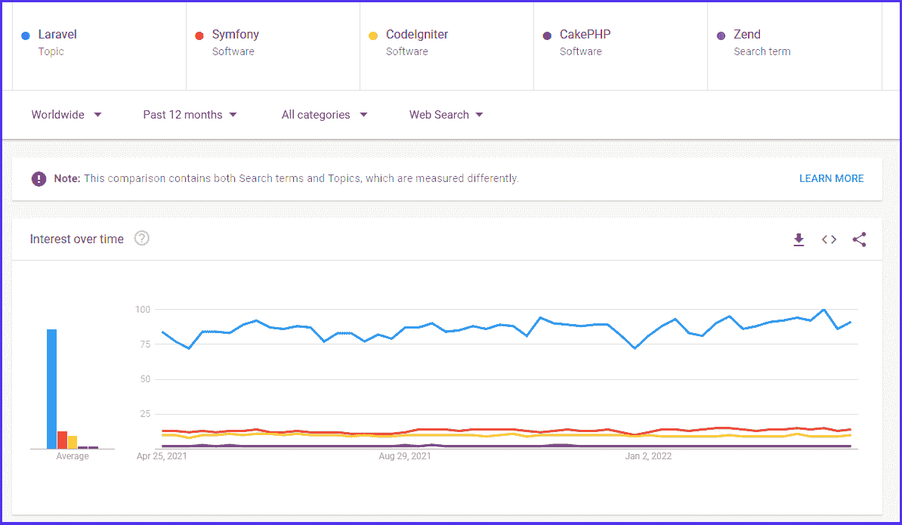
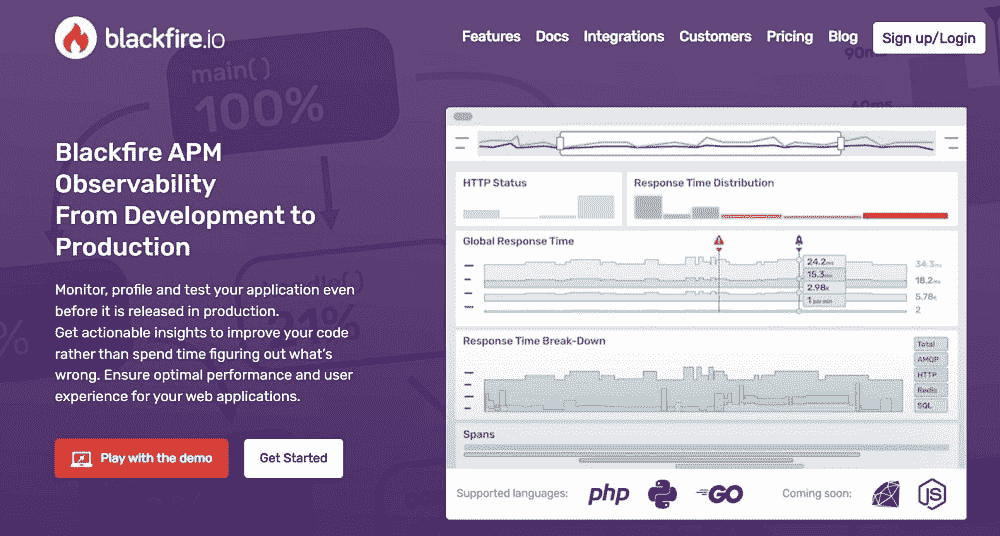
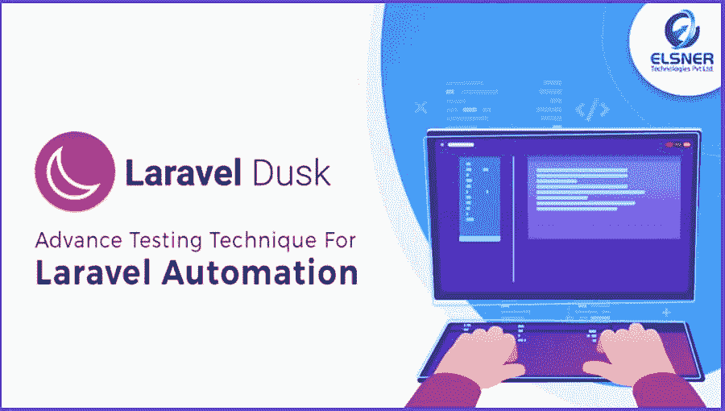
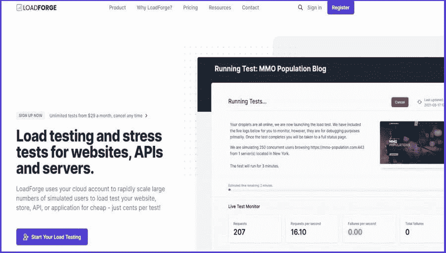

# 优化 Laravel 性能的 17 种方法

> 原文：<https://kinsta.com/blog/laravel-performance/>

您是否正在寻找成功的方法来提高 Laravel 的性能，同时处理您的项目？你来对地方了！

Laravel 是一个流行的开源 PHP 框架，以其健壮的安全性和简单而复杂的编码架构而闻名。对于构建能够增加收入和推动业务发展的尖端 web 应用程序来说，这是一个很好的选择。

尽管如此，如果没有使用正确的优化技术，Laravel 的性能会变得很慢。

幸运的是，有很多方法可以最大化 Laravel 的性能。我们总结了一系列最有效的优化技巧，您可以遵循。

 [Looking for ways to speed up Laravel performance while working on your project? 👀 Look no further...🚀Click to Tweet](https://twitter.com/intent/tweet?url=https%3A%2F%2Fkinsta.com%2Fblog%2Flaravel-performance%2F&via=kinsta&text=Looking+for+ways+to+speed+up+Laravel+performance+while+working+on+your+project%3F+%F0%9F%91%80+Look+no+further...%F0%9F%9A%80&hashtags=Laravel%2CWebDev)

## 为什么 Laravel 性能优化如此重要？

开发人员在发布之前必须非常关注每一个 Laravel 应用程序的性能，以确保其成功。这是一个 Laravel 开发者应该具备的几个品质之一[。](https://kinsta.com/blog/laravel-developer/)


> 需要在这里大声喊出来。Kinsta 太神奇了，我用它做我的个人网站。支持是迅速和杰出的，他们的服务器是 WordPress 最快的。
> 
> <footer class="wp-block-kinsta-client-quote__footer">
> 
> 
> 
> <cite class="wp-block-kinsta-client-quote__cite">Phillip Stemann</cite></footer>

[View plans](https://kinsta.com/plans/)

通过代码调整和命令来优化 Laravel 的性能可以帮助实现这一点，并且也可以对你的应用程序的效率产生重大影响。

### Laravel 慢吗？

Laravel 是一个快速的框架，具有大量的特性和功能(例如 Memcache、[数据库支持](https://kinsta.com/knowledgebase/laravel-database/)、Redis 等)。)来帮助提高性能。Laravel 还让软件专业人员用相对较少的努力就能产生健壮的代码，以满足他们或大或小的项目目标。
 由于数据是以键值对的形式存储在服务器的 RAM 中，用户可以随心所欲地缓存，以快速流畅的方式维护他们的应用或网站。基于 Google Trend，Laravel 是目前 PHP 最受欢迎的后端工具。



Laravel’s popularity on Google (Image Source: [Google Trend](https://trends.google.com/trends/explore?q=%2Fm%2F0jwy148,%2Fm%2F09cjcl,%2Fm%2F02qgdkj,%2Fm%2F09t3sp,Zend))


最近发布的 [Laravel 9](https://kinsta.com/blog/laravel-9) 提供了新的性能改进。例如，它有最低的 PHP 规范，需要 Symphony 6.0，而[在 PHP 8.1](https://kinsta.com/blog/php-benchmarks/) 上的运行速度要快 20.65%。对**路线:列表**命令的新设计现在减少了复杂命令的混乱视图。Laravel 9 还包括一个更高效的查询构建器界面，以及更多的特性。

然而，一些因素导致了较慢的 Laravel 性能。许多开发人员都有糟糕的习惯，比如上传大量沉重的图像，使用[旧的 PHP 版本](https://kinsta.com/cheatsheets/wordpress-update-php/)，编译大量不需要的数据，或者忘记从他们的项目中删除不必要的文件。

Laravel 复杂的 MVC PHP 架构和相关的库提供了安全性、性能和可用性的完美结合。这就是为什么学习一些 Laravel 优化技巧来实现更高的性能是一个很好的经验法则。

### 网站速度很重要

第一印象对任何品牌形象都是持久的。网站速度是你给网站访问者的第一印象。你知道吗？大约有 50%的在线客户会放弃那些加载时间超过三秒的网站。


Website Speed (Image Source: [Cuso Magazine](https://cusomag.com/))


网站速度(又名网站性能)是指浏览器从特定网站加载完全正常运行的网页所需的时间。因此，它对用户体验(UX)和转化率有直接影响。

网站表现也会影响你在搜索引擎上的搜索引擎优化排名。如果多个网站提供你的访问者所寻找的信息，速度更快的网页会首先出现。如果你的网站运行缓慢，它就不太可能在谷歌搜索结果中排名靠前。

因此，你应该花些时间应用有效的[网站性能优化解决方案](https://kinsta.com/learn/speed-up-wordpress/)。

### Laravel 性能优化的优势

虽然您可能已经设计了一个很棒的 Laravel 应用程序，但是总有改进的空间来达到完美。提高您的 Laravel 性能有许多好处:

*   **促进业务增长:【Laravel 性能的提高意味着网站或应用程序更加高效。因此，你接触到更多观众的机会增加了。**

*   **更流畅的开发环境:**下面列出的 Laravel 的性能优化技巧可以帮助开发者节省更多的编码时间，更快地执行任务，消耗更少的资源。

*   **更好地处理流量:**学习如何巧妙地使用 Laravel 队列系统有助于你的网站在增长和获取大量流量时管理请求数量。

## 如何衡量 Laravel 的绩效

你已经投入了大量的时间和精力来让你时髦的网络应用程序工作，但是如果它很慢，没有人会使用它，你就会像一头头痛的熊。这就是 Laravel 性能测试的用武之地。

你可以使用各种工具对你的宝贝作品进行性能测试。让我们来看看其中的三个。

### 1.黑火. io



Blackfire.io (Source: [Blackfire.io](https://blackfire.io/))


Blackfire.io 是一个直观的 web 应用程序分析器，它可以识别基本路径，因此您可以专注于 PHP 应用程序的重要领域。

它包括多种性能监控功能，并显示内存使用、CPU 时间以及 I/o。black fire . io 还允许您对函数调用和路径进行排序，以查看您的 Laravel 应用程序如何工作。

### 2.拉勒维尔黄昏



Laravel Dusk (Source: [ELSNER](https://www.elsner.com/))


Laravel Dusk 允许您测试您的应用程序，并从用户的角度检查它是如何工作的。你不需要安装硒或 JDK 来使用黄昏，因为它默认包括 Chromedriver。

有了像 Dusk 这样对开发人员友好的 API，您可以自动进行浏览器测试，而不需要 ChromeDriver 和 PHP WebDriver 分别要求的严格过程。

此外，Dusk 存储了失败测试的屏幕截图和浏览器控制台输出，以便您能够找出任何错误。

### 3.LoadForge



LoadForge (Source: [LoadForge](https://loadforge.com/))


LoadForge 专为 Laravel 定制，它会自动扫描您的网站，识别问题，并为每个页面提供全面的图表和性能统计。

在 Chrome 中，LoadForge 允许您捕获浏览器动作，然后将它们转换成 LoadForge 测试。这样，您将能够通过模拟他们登录、浏览您的网站，甚至下订单来创建真实的用户体验。

## 如何优化 Laravel 性能(17 种方法)

在这一部分，我们将仔细梳理一些最佳的想法和策略，帮助你提高你的 Laravel 表现。

### 1.路由缓存

路线缓存是一个非常好的特性，特别是对于那些有大量配置和路线分布在代码中的应用程序。它是打包在一个命令中的一组路线，有助于减少手动绘制路线的繁琐任务。因此，你网站的页面加载速度会快很多。

路由缓存允许 Laravel 定期从预编译的缓存中检索路由，而不必为每个新用户从头开始。

使用此命令缓存所需的路由数据:

```
php artisan route:cache
```

请记住，当用户离开您的站点时，缓存就会过期。每次对您的网站进行结构更改(例如，路由文件和配置)后，运行路由缓存命令也很重要，因为之后所做的任何修改都不会生效。

如果要清除路由缓存，请运行以下命令:

```
php artisan route:clear
```

### 2.优化作曲家

Laravel 使用一个名为 Composer 的独立工具来管理不同的依赖项。当您最初安装 Composer 时，默认情况下它会将开发依赖项加载到您的系统中。

这些依赖对于开发网站很有用。但是一旦你的站点完全运行了，它们就不再需要了，事实上，它们只会降低速度。

当利用 Composer 安装软件包时，使用下面的`--no-dev`和`-o`参数来删除开发依赖项:

```
composer install --prefer-dist --no-dev -o
```

此命令允许 Composer 创建一个目录来优化自动加载器并提高性能。它只是请求检索和打包正式发行版，没有开发依赖性。

注意不要消除任何运行时依赖。这可能会危及您的网站的性能，甚至导致它崩溃。

### 3.减少自动加载的服务

Laravel 的目标是让开发过程尽可能轻松。例如，当您启动 Laravel 时，它会自动加载在 **config/app.php** 文件中列出的大量服务提供者，以帮助您快速启动项目。

虽然这是 Laravel 的一个有益步骤，但是您不需要使用所有这些服务来构建应用程序。

以 REST API 为例。您不需要查看服务提供商或会话服务提供商等服务。此外，许多开发人员不遵循默认的框架设置。您可以简单地禁用您不需要的服务(如分页服务提供程序、翻译服务提供程序、身份验证服务提供程序等)。

通过将相同的原理应用于其他应用程序，您将能够提高 Laravel 应用程序的速度。只要确保你没有删除任何重要的服务，并在你放下锤子之前仔细检查一切。

### 4.有效使用 Artisan 命令和缓存

Artisan 是 Laravel 附带的一个流行的命令行工具。它使得开发人员可以很容易地自动执行重复性的复杂任务。网站创建者也可以用它来进行测试和生成命令。

巧妙地使用 Artisan 命令可以提高你的应用程序性能。下面，我们列出了几个你可以利用的最好的缓存命令。

#### 配置缓存

缓存配置是提高速度的一个很好的命令。它将应用程序的所有配置值编译到一个文件中，以便框架可以更快地加载。你只需要跑:

```
php artisan config:cache
```

请注意，您不应该在本地开发期间执行**配置缓存**命令。这是因为在应用程序的开发过程中，配置设置可能需要经常更改。

要清除配置缓存，请运行以下命令:

```
php artisan config:clear
```

#### 视图缓存

视图缓存是包含缓存的应用程序的另一个方面。视图缓存存储生成的刀片模板，以提高项目的速度。您可以使用下面的 artisan 命令手动编译所有视图并优化性能:

```
php artisan view:cache
```

当你上传新代码时，记得清空缓存；否则，Laravel 将使用您的旧视图，您将花费大量时间尝试解决这个问题。运行以下命令清除视图缓存:

## 注册订阅时事通讯


### 想知道我们是怎么让流量增长超过 1000%的吗？

加入 20，000 多名获得我们每周时事通讯和内部消息的人的行列吧！

[Subscribe Now](#newsletter)

```
php artisan view:clear
```

#### 应用程序缓存

这是拉弗尔的主要贮藏处。它会保存您在应用程序中手动缓存的所有数据。使用 Laravel 的缓存是一种聪明的方法，可以加速经常访问的数据并优化 Laravel 的性能。如果您使用标记或多个缓存存储，则只能刷新缓存中的某些元素。

下面是清除 Laravel 缓存的 artisan 命令:

```
php artisan cache:clear
```

请记住，该命令不会删除位于/bootstrap/cache/文件夹中的任何路由、配置或视图缓存。

### 5.减少包装使用

作为一个拥有众多社区的[开源框架](https://kinsta.com/blog/php-frameworks/)，在 Laravel 中看到越来越多的包发布或现有包中的新版本是很自然的。你可以自由地在你的应用程序中直接使用它们和它们的特性。

您必须将这些包包含在`composer.json`文件中。Laravel 将随后安装它们及其依赖项。

然而，在向任何应用程序添加新包之前，有几个因素需要考虑。例如，它们并非都是为同一目的而设计的。还创建了一些包来执行广泛的功能。

当您包含具有大量依赖项的包时，应用程序的大小会增长，其性能最终会受到影响。这就是为什么在添加任何包之前仔细检查依赖关系是非常重要的。

### 6.升级至 PHP 的最新版本

就像任何其他代码或软件程序一样，最好是将你的 PHP 版本升级到最新版本。

使用最新 PHP 版本的主要原因是安全性。两年来，每个 PHP 版本都会收到安全补丁和错误修复。如果您继续使用不再维护的早期版本，您的系统可能会受到危害。

许多开发人员可能也没有意识到，PHP 版本越老，其性能就变得越慢。为了提高效率，[当前的 PHP 版本](https://kinsta.com/blog/php-8-1/)具有突出的性能改进，比如更快地执行请求、枚举、纤程和继承缓存。

在 Kinsta，我们使用最新的主要 PHP 版本( [PHP 8.1](https://kinsta.com/feature-updates/php-8-1/) )用于所有环境，因此用户可以从平台的广泛功能中受益，并优化他们的应用程序，以实现最大的速度和效率。

### 7.使用队列

将缓慢的任务卸载到队列作业是一种快速最大化 Laravel 应用程序速度的简单技术。

有时候你并不需要 UI 中的信息。在这种情况下，这些任务可以被推迟，稍后由单独的进程在后台运行(例如，[发送电子邮件](https://kinsta.com/blog/secure-email-providers/))。这可以显著提高应用程序在线请求的性能。

使用队列发送邮件的示例(图片来源: [GeekFlare](https://geekflare.com/)

Laravel 支持各种队列驱动程序，如 IronMQ、Redis、亚马逊 SQS 和 Beanstalkd。它还包括一个内置的队列工作器，可以使用以下命令执行该工作器:

```
php artisan queue:work
```

您可以使用以下方法将新作业添加到队列中:

```
Queue::push('SendEmail', array('message' => $message));
```

如果您想推迟一个队列作业的执行，请使用下面的方法。例如，假设您想要安排一个在客户创建帐户 10 分钟后向其发送电子邮件的作业:

```
$date = Carbon::now()->addMinutes(10);

Queue::later($date, '[[email protected]](/cdn-cgi/l/email-protection)', array('message' => $message)); 
```

### 8.使用部署工具调用所有命令

好吧，我们意识到这不是 Laravel 的纯性能技巧，但是对于开发人员来说，这是一种非常好的节省时间的技术，对于提高生产率同样重要。

Struggling with downtime and WordPress problems? Kinsta is the hosting solution designed to save you time! [Check out our features](https://kinsta.com/features/)

Deployer 是一个基于 PHP 的部署工具，允许您将代码部署到不同的服务器上。它包括流行框架的脚本，比如 Laravel、Symfony、Zend、Magento、CakePHP 等等。

如果您以前没有使用 Composer 来管理项目依赖项，那么您将很快熟悉 Deployer。使用此工具可以自动执行所有机器部署操作，例如启动服务器、克隆到远程服务器以及监控远程主机。

Deployer 提供了在 Laravel 应用程序中执行迁移、种子和优化功能的设置，只需一个命令:

```
php deployer.phar deploy production
```

### 9.将 Lumen 用于小型项目

有时候，开发一个小应用程序(例如移动或角度应用程序)不需要使用像 Laravel 这样的全栈框架。在这种情况下，请考虑使用 Lumen。

Lumen 是由 Laravel 的同一个创建者开发的微框架。就像一个更轻版本的 Laravel 一样，Lumen 的核心是微服务的速度和性能。在构建 web 应用程序时，它需要最少的设置和替代路由参数，从而加快开发过程。

例如，Lumen 每秒可以处理 100 个请求。你也可以集成第三方的工具或包来获得新的特性。而且 Lumen 支持所有平台，允许你升级到 Laravel。

### 10.利用 JIT 编译器

PHP 是一种服务器端语言，需要解释器将代码翻译成计算机可以理解的字节码。

这个过程需要大量的时间，消耗大量的资源。这就是为什么程序员选择像 Zend engine 这样的脚本引擎来执行 C 子程序，每次执行应用程序时都必须重复这些子程序，这会降低应用程序的速度。

为了提高效率，开发人员使用[实时(JIT)编译器](https://kinsta.com/blog/tailwind-jit/)重复这个过程一次。由脸书发明并广泛使用的 HHVM 是 Laravel 的首选 JIT 编译器。Etsy、维基百科和许多其他网站也使用它。

### 11.利用急切装载

为了愉快地与数据库交互，Laravel 提供了一个奇妙的对象关系映射器(ORM ),名为口才。它使您能够以一种简单的格式关联表和处理 PHP 中的所有 CRUD 函数。

当您从数据库中检索模型，然后对它们的关系执行任何类型的处理时，关系数据是“[延迟加载的](https://kinsta.com/blog/wordpress-lazy-load/)”。这意味着在您访问关系之前不会加载数据。

您将运行 N+1 个查询来查找延迟加载的响应，如下例所示:

```
$books = AppBook::all();

foreach ($books as $book) {

echo $book->author->name;

} 
```

为了优化 Laravel 的性能并解决 N+1 查询问题，Laravel 可以“快速加载”数据，如下所示:

```
$books = AppBook::with('author')->get();

foreach ($books as $book) {

echo $book->author->name;

} 
```

### 12.压缩图像

图像在网站设计中起着重要的作用。它们对于提升用户体验(UX)和提升搜索排名至关重要。

一个网站的平均加载时间是两秒。沉重的图像会降低网站的加载速度。如果你的网站运行缓慢，很有可能会失去很多访问者。

[图像压缩](https://kinsta.com/blog/lossy-compression/)在不牺牲图像质量的情况下最小化原始图像的尺寸，帮助[优化网站速度](https://kinsta.com/blog/optimize-images-for-web/)。出于这个原因，Laravel 提供了压缩照片的简洁选项，如 TinyPNG、reSmush.it 或 ImageMin。

### 13.使用 CDN

使用[内容交付网络(CDN)](https://kinsta.com/blog/wordpress-cdn/) 可以真正优化 Laravel 性能。通过从 CDN 服务器加载静态内容，而不是直接从托管文件的机器上加载，数据可以更快地到达您的受众。

换句话说，它将你网站的最新版本缓存到全球云服务器网络中。因此，即使你的访问者在地理上远离你的位置，他们仍然能够快速访问你的网站。

[Kinsta CDN](https://kinsta.com/help/kinsta-cdn/) 是由 Cloudflare 驱动的[，免费提供。它允许你的网站的缓存文件从你的主域而不是二级 CDN 域传递，提升你的 SEO 排名。](https://kinsta.com/cloudflare-integration/)

Kinsta CDN 还可以帮助您删除 JavaScript (JS)和 CSS 文件中不需要的组件。这极大地减少了网站页面加载的时间，并减少了带宽消耗。

### 14.最小化 JS 和 CSS 代码

在继续资产捆绑过程之前，通过[缩小您的 JavaScript 和 CSS 文件](https://kinsta.com/help/kinsta-cdn-code-minification/)来提高您的 Laravel 性能。

这个缩小步骤删除了应用程序中任何不必要的代码，比如空格、注释和使用缩写名称重命名变量。如有必要，您可以调整图像大小来创建缩略图。

因此，您将提高 UX，同时减少 HTTP 调用。


### 15.使用资产捆绑

有几个工具可以用来将 Javascript 和 CSS 等文件压缩打包成一个文件，比如 Laravel Mix 和 Laravel Packer。

默认情况下，所有 Laravel 应用程序都包含 Laravel Mix。这是一个用户友好的 API，使用一系列常见的 JavaScript 和 CSS 预处理程序为 PHP 应用程序创建 Webpack 构建。

假设您的应用程序文件需要某种样式格式的集合，您可以输入如下内容:

```
mix.styles([

'public/css/vendor/normalize.css',

'public/css/styles.css'

], 'public/css/all.css'); 
```

现在，Laravel Mix 将自动从`normalize.css`和`style.css`文件生成一个`all.css`文件。因此，您可以将它们合并到一个 all.css 文件中，而不是分别获取每个样式表。

Laravel Packer 是一个命令行工具，可以通过 Composer 安装。它让你减少和捆绑你的 JS 和 CSS 代码。然而，它比 Laravel Mix 更难使用。

尽管这个技巧对于提升 Laravel 性能很有帮助，但是合并大量文件会使它变得很大，最终会产生相反的效果。要解决这个问题，请运行以下命令，使用 Laravel Mix 缩小文件:

```
npm run prod
```

### 16.限制包含的库

Laravel 让您可以自由添加任意数量的库。虽然这是一个很棒的特性，但是添加大量的库会给应用程序的性能带来很大的压力。它还会影响整个用户体验。

因此，扫描代码中当前使用的所有库数据是至关重要的。您可以在`config/app.php file`中找到这些库。在检查库的时候，删除那些你知道对你不再有用的库。

查看`composer.json`中不需要的依赖项也是一个好主意。

### 17.考虑使用新遗迹

New Relic 是一个[应用性能管理(APM)工具](https://kinsta.com/blog/apm-tools/)，由开发者集成到他们的 Laravel 应用中。它用于分析和监控反映其性能的统计数据，以优化效率并避免实时中断。

New Relic 可以帮助您评估您的 Apdex 分数，并衡量您的应用程序与市场上的竞争对手相比如何。它还使您能够根据您的标准创建警报策略。

如果不想注册第三方服务，可以使用 [Kinsta 的 APM 工具](https://kinsta.com/help/apm-tool/)。它可以帮助你找到你的 WP 网站上的 PHP 性能瓶颈，而不需要额外付费。
[看看这些技巧，最大限度地提高你的工作表现&准备好迎接你的下一个项目💪 点击推文](https://twitter.com/intent/tweet?url=https%3A%2F%2Fkinsta.com%2Fblog%2Flaravel-performance%2F&via=kinsta&text=Check+out+these+hacks+to+maximize+your+Laravel+performance+%26amp%3B+get+ready+to+power+through+your+next+project+%F0%9F%92%AA&hashtags=Laravel%2CWebDev)

## 摘要

Laravel 是一个快速成长的 PHP 框架，有[大量的教程可供](https://kinsta.com/blog/laravel-tutorial/)各类用户学习 Laravel，无论他们的知识水平如何。

谈到数字世界中的用户体验，性能是建立强大在线形象的关键因素。毫无疑问，组织会投入更多的时间和资源来提供高质量的 UX。

如果您是一名 Laravel 开发人员，您可以确信，通过使用上面概述的方法，您将会注意到性能的显著提高，并且能够保持应用程序平稳运行。

你还用过哪些方法来提高 Laravel 应用程序的速度？请在下面的评论区告诉我们。

* * *

让你所有的[应用程序](https://kinsta.com/application-hosting/)、[数据库](https://kinsta.com/database-hosting/)和 [WordPress 网站](https://kinsta.com/wordpress-hosting/)在线并在一个屋檐下。我们功能丰富的高性能云平台包括:

*   在 MyKinsta 仪表盘中轻松设置和管理
*   24/7 专家支持
*   最好的谷歌云平台硬件和网络，由 Kubernetes 提供最大的可扩展性
*   面向速度和安全性的企业级 Cloudflare 集成
*   全球受众覆盖全球多达 35 个数据中心和 275 多个 pop

在第一个月使用托管的[应用程序或托管](https://kinsta.com/application-hosting/)的[数据库，您可以享受 20 美元的优惠，亲自测试一下。探索我们的](https://kinsta.com/database-hosting/)[计划](https://kinsta.com/plans/)或[与销售人员交谈](https://kinsta.com/contact-us/)以找到最适合您的方式。