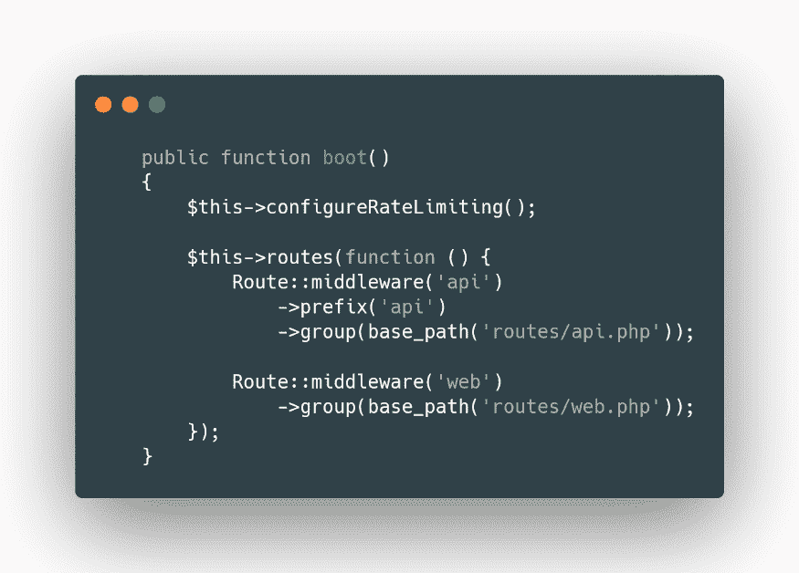
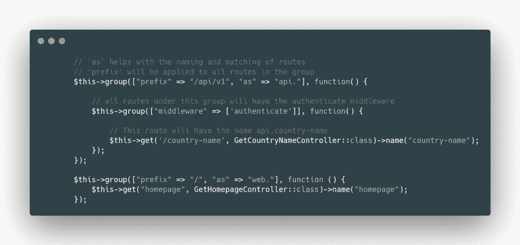

# 掌握拉勒维尔路线

> 原文：<https://kinsta.com/blog/laravel-routes/>

到了后端，开发者最终遇到的是路由。路由可以被认为是后端的主干，因为服务器接收到的每个请求都通过将请求映射到控制器或动作的路由列表被重定向到控制器。

Laravel 为我们隐藏了许多实现细节，并附带了许多语法糖来帮助新的和有经验的开发者开发他们的 web 应用程序。

让我们仔细看看如何管理 Laravel 的路线。

## Laravel 中的后端路由和跨站点脚本

在服务器上，同时存在公共路由和私有路由。由于跨站点脚本(XSS)的可能性，公共路由可能是一个令人担忧的原因，这是一种类型的[注入攻击](https://kinsta.com/blog/sql-injection/)，可能会使您和您的用户[容易受到恶意参与者](https://kinsta.com/blog/types-of-malware/)的攻击。

问题是，用户可以从不需要会话令牌的路由重定向到需要会话令牌的路由，但他们仍然可以在没有令牌的情况下访问。

[Dive into the 'backbone of the backend' in this guide to Lavavel Routing 🚀Click to Tweet](https://twitter.com/intent/tweet?url=https%3A%2F%2Fkinsta.com%2Fblog%2Flaravel-routes%2F&via=kinsta&text=Dive+into+the+%27backbone+of+the+backend%27+in+this+guide+to+Lavavel+Routing+%F0%9F%9A%80&hashtags=Laravel%2CWebDev)

解决这个问题的最简单的方法是实施一个新的 HTTP 报头，在路由中添加“referrer”来缓解这种情况:


```
'main' => [
  'path' => '/main',
  'referrer' => 'required,refresh-empty',
  'target' => Controller\DashboardController::class . '::mainAction'
]
```

## Laravel 基本路由

在 [Laravel](https://kinsta.com/blog/laravel-9/) 中，路由允许用户将适当的请求路由到所需的控制器。最基本的 Laravel 路由接受一个统一的资产标识符(您的路由路径)和一个闭包，这个闭包可以是函数也可以是类。

在 Laravel 中，路径是在**web.php**和**api.php**文件中创建的。默认情况下，Laravel 有两条路径:一条用于 WEB，一条用于 API。

这些路由位于 **routes/** 文件夹中，但是它们被加载到**Providers/routeserviceprovider . PHP**中。

[](https://kinsta.com/wp-content/uploads/2022/10/laravel-route-provider-default.png)

Default state of Laravel’s route service provider.


代替这样做，我们可以直接在**RouteServiceProvider.php**中加载路线，完全跳过**路线/** 文件夹。

[](https://kinsta.com/wp-content/uploads/2022/10/loading-laravel-routes-directly.png)

Loading Laravel routes directly in the provider.


### 重新寄送

当我们定义一个路由时，我们通常希望重定向访问它的用户，这样做的原因有很多。可能是因为这是一个不推荐使用的路线，我们改变了后端或服务器，也可能是因为我们想安装[双因素身份验证(2FA)](https://kinsta.com/help/two-factor-authentication/) 等等。

Laravel 有一个简单的方法来做到这一点。由于框架的简单性，我们可以在 Route facade 上使用 redirect 方法，它接受入口路由和要重定向到的路由。

可选地，我们可以给出重定向的状态代码作为第三个参数。除了总是返回一个 [301 状态码](https://kinsta.com/blog/http-status-codes/)之外，`permanentRedirect`方法与`redirect`方法做的一样:

```
// Simple redirect
Route::redirect("/class", "/myClass");

// Redirect with custom status
Route::redirect("/home", "/office", 305);

// Route redirect with 301 status code
Route::permanentRedirect("/home", "office");
```

在重定向路由中，我们被禁止使用“目的地”和“状态”关键字作为参数，因为它们是 Laravel 保留的。

```
// Illegal to use
Route::redirect("/home", "/office/{status}");
```

### 视图

视图是。**blade.php**我们用来渲染 Laravel 应用程序前端的文件。它使用刀片模板引擎，并且是仅使用 Laravel 构建全栈应用程序的默认方式。

如果我们希望我们的路由返回一个视图，我们可以简单地在路由外观上使用 view 方法。它接受要传递给视图的路由参数、视图名称和可选的值数组。

```
// When the user accesses my-domain.com/homepage
// the homepage.blade.php file will be rendered
Route::view("/homepage", "homepage");
```

让我们假设我们的视图想要通过传递一个带有该参数的可选数组来说“Hello，`{name}`”。我们可以用下面的代码做到这一点(如果视图中需要缺少的参数，请求将失败并抛出一个错误):

```
Route::view('/homepage', 'homepage', ['name' => "Kinsta"]);
```

### 路线列表

随着应用程序规模的增长，需要路由的请求数量也会增加。大量的信息会带来巨大的混乱。

这就是`artisan route:list command`可以帮助我们的地方。它概述了应用程序中定义的所有路由、它们的中间件和控制器。

```
php artisan route:list
```

它将显示一个没有中间件的所有路线的列表。为此，我们必须使用`-v`标志:

```
`php artisan route:list -v`
```

在您可能使用域驱动设计的情况下，您的路由在其路径中具有特定的名称，您可以像这样利用此命令的过滤功能:

```
php artisan route:list –path=api/account
```

这将只显示以 **api/account** 开始的路线。

另一方面，我们可以通过使用`–except-vendor`或`–only-vendor`选项来指示 Laravel 排除或包含第三方定义的路由。

## 路线参数

有时，您可能需要捕捉 URI 的路段，如用户 ID 或令牌。我们可以通过定义一个路由参数来做到这一点，这个参数总是用花括号(`{}`)括起来，并且应该只包含字母字符。

如果我们的路由在它们的回调中有依赖关系，Laravel 服务容器会自动注入它们:

```
use Illuminate\Http\Request;
use Controllers/DashboardController;
Route::post('/dashboard/{id}, function (Request $request, string $id) {
  return 'User:' . $id;
}
Route::get('/dashboard/{id}, DashboardController.php);
```

### 必需的参数

Laravel 的必需参数是在我们打电话时不允许跳过的路由中的参数。否则，将会引发一个错误:

```
Route::post("/gdpr/{userId}", GetGdprDataController.php");
```

现在，在**GetGdprDataController.php**中，我们将可以直接访问 **$userId** 参数。

## 注册订阅时事通讯


### 想知道我们是怎么让流量增长超过 1000%的吗？

加入 20，000 多名获得我们每周时事通讯和内部消息的人的行列吧！

[Subscribe Now](#newsletter)

```
public function __invoke(int $userId) {
  // Use the userId that we received…
}
```

路由可以接受任意数量的参数。它们根据列出的顺序被注入到路由回调/控制器中:

```
 // api.php
Route::post('/gdpr/{userId}/{userName}/{userAge}', GetGdprDataController.php);
// GetGdprDataController.php
public function __invoke(int $userId, string $userName, int $userAge) {
  // Use the parameters…
}
```

### 可选参数

如果我们想在一条路线上做一些事情，而这条路线上只有一个参数，而没有其他任何东西，并且不影响整个应用程序，我们可以添加一个可选的参数。这些可选参数由附加在它们后面的`?`表示:

```
 Route::get('/user/{age?}', function (int $age = null) {
  if (!$age) Log::info("User doesn't have age set");
  else Log::info("User's age is " . $age);
}
Route::get('/user/{name?}', function (int $name = "John Doe") {
  Log::info("User's name is " . $name);
}
```

### 路由通配符

Laravel 为我们提供了一种过滤可选或必需参数的方法。

假设我们需要一个用户 ID 字符串。我们可以使用`where`方法在路由级别验证它。

`where`方法接受参数名和将应用于验证的正则表达式规则。默认情况下，它接受第一个参数，但是如果我们有很多参数，我们可以传递一个数组，将参数的名称作为键，将规则作为值，Laravel 将为我们解析所有参数:

```
Route::get('/user/{age}', function (int $age) {
  //
}->where('age', '[0-9]+');
Route::get('/user/{age}', function (int $age) {
  //
}->where('[0-9]+');
Route::get('/user/{age}/{name}', function (int $age, string $name) {
  //
}->where(['age' => '[0-9]+', 'name' => '[a-z][A-z]+');
```

我们可以更进一步，通过在`Route`外观上使用`pattern`方法，在应用程序中的所有路线上应用验证:

```
 Route::pattern('id', '[0-9]+');
```

这将用这个正则表达式验证每个`id`参数。一旦我们定义了它，它将自动应用于使用该参数名称的所有路由。

正如我们所看到的，Laravel 在路径中使用了`/`字符作为分隔符。如果我们想在路径中使用它，我们必须使用一个`where`正则表达式显式地允许它成为占位符的一部分。

```
 Route::get('/find/{query}', function ($query) {
  //
})->where('query', , '.*');
```

唯一的缺点是它只在最后一个路由段受支持。

Struggling with downtime and WordPress problems? Kinsta is the hosting solution designed to save you time! [Check out our features](https://kinsta.com/features/)

## 命名路线

顾名思义，我们可以命名路由，这使得[生成 URL](https://kinsta.com/knowledgebase/what-is-a-url/)或重定向特定路由变得非常方便。

### 如何创建命名路由

链接在`Route`外观上的`name`方法提供了一种创建命名路由的简单方法。每条路线的名称应该是唯一的:

```
 Route::get('/', function () {
})->name("homepage");
```

## 路由组

路由组允许您跨大量路由共享路由属性，如中间件，而无需在每条路由上重新定义它。

### 中间件

首先通过使用`group`方法，为我们拥有的所有路由分配一个中间件允许我们将它们组合在一个组中。需要考虑的一点是，中间件是按照它们应用于组的顺序执行的:

```
 Route:middleware(['AuthMiddleware', 'SessionMiddleware'])->group(function () {
  Route::get('/', function() {} );
  Route::post('/upload-picture', function () {} );
});
```

### 控制器

当一个组使用同一个控制器时，我们可以使用`controller`方法为该组内的所有路径定义公共控制器。现在我们必须指定路由将调用的方法。

```
 Route::controller(UserController::class)->group(function () {
  Route::get('/orders/{userId}', 'getOrders');
  Route::post('/order/{id}', 'postOrder');
});
```

### 子域路由

[子域名](https://kinsta.com/blog/wordpress-subdomain/)是添加到网站域名开头的一段附加信息。这允许网站从网站的其余部分分离和组织其内容以实现特定功能，如在线商店、博客、演示等。

我们的路由可用于处理子域路由。我们可以捕获域和子域的一部分，以便在我们的控制器和路由中使用。借助于`Route` facade 上的`domain`方法，我们可以将我们的路由分组到一个域中:

```
 Route::domain('{store}.enterprise.com')->group(function() {
  Route::get('order/{id}', function (Account $account, string $id) {
    // Your Code
  }
});
```

### 前缀和姓名前缀

每当我们有一组路由时，我们可以利用 Laravel 提供的额外实用程序，比如`Route`门面上的`prefix`和`name`，而不是逐个修改它们。

`prefix`方法可用于给组中的每条路由添加给定 URI 的前缀，而`name`方法可用于给每条路由添加给定字符串的前缀。

这允许我们创建新的东西，如管理路由，而不需要修改每个名称或前缀来识别它们:

```
 Route::name('admin.")->group(function() {
  Route::prefix("admin")->group(function() {
    Route::get('/get')->name('get');
    Route::put('/put')->name(put');
    Route::post('/post')->name('post');
  });
});
```

现在这些航线的 URIs 将会是`admin/get`、`admin/put`、`admin/post`，名字为`admin.get`、`admin.put`、`admin.post`。

## 路由缓存

当将应用程序部署到生产服务器时，一个优秀的 Laravel 开发者会利用 Laravel 的路由缓存。

### 什么是路由缓存？

路由缓存减少了注册所有应用程序路由所需的时间。

运行`php artisan route:cache`生成`Illuminate/Routing/RouteCollection`的一个实例，经过编码后，序列化的输出被写入`bootstrap/cache.routes.php`。

现在任何其他请求将[加载这个缓存](https://kinsta.com/blog/laravel-caching/)文件，如果它存在的话。因此，我们的应用程序不再需要解析 route 文件中的条目并将其转换成`Illuminate/Routing/RouteCollection`中的`Illuminate/Routing/Route`对象。

### 为什么使用路径缓存很重要

如果不使用 Laravel 提供的路线缓存功能，你的应用程序可能会运行得更慢，这反过来会降低销售额、用户保留率和对你品牌的信任度。

根据你项目的规模和路线的数量，运行一个简单的路线缓存命令可以使你的应用程序加速 130%到 500%——几乎不费吹灰之力就能获得巨大的收益。

## 摘要

路由是后端开发的支柱。Laravel 框架在这方面表现出色，它提供了一种详细的定义和管理路由的方式。 [【得心应手】在此彻底指导🛠 点击推文](https://twitter.com/intent/tweet?url=https%3A%2F%2Fkinsta.com%2Fblog%2Flaravel-routes%2F&via=kinsta&text=Get+comfortable+with+Laravel+routing+in+this+thorough+guide+%F0%9F%9B%A0&hashtags=Laravel%2CWebDev)

开发确实可以为每个人所用，并帮助[加速一个应用程序](https://kinsta.com/blog/laravel-performance/),仅仅因为它是在 Laravel 中构建的。

关于 Laravel 路线，你还遇到过哪些技巧和提示？请在评论区告诉我们！

* * *

让你所有的[应用程序](https://kinsta.com/application-hosting/)、[数据库](https://kinsta.com/database-hosting/)和 [WordPress 网站](https://kinsta.com/wordpress-hosting/)在线并在一个屋檐下。我们功能丰富的高性能云平台包括:

*   在 MyKinsta 仪表盘中轻松设置和管理
*   24/7 专家支持
*   最好的谷歌云平台硬件和网络，由 Kubernetes 提供最大的可扩展性
*   面向速度和安全性的企业级 Cloudflare 集成
*   全球受众覆盖全球多达 35 个数据中心和 275 多个 pop

在第一个月使用托管的[应用程序或托管](https://kinsta.com/application-hosting/)的[数据库，您可以享受 20 美元的优惠，亲自测试一下。探索我们的](https://kinsta.com/database-hosting/)[计划](https://kinsta.com/plans/)或[与销售人员交谈](https://kinsta.com/contact-us/)以找到最适合您的方式。