# Laravel vs Node:一个头对头的比较

> 原文：<https://kinsta.com/blog/laravel-vs-node/>

Laravel 和 Node.js 是过去十年中最有影响力和最有效的两种 web 开发技术。它们的性能和出色的解决问题的特性对现代开发人员来说是有利的，自从它们问世以来，已经对 web 开发行业产生了重大影响。

Laravel 是一个 PHP 框架，具有更强的强度和稳定性。由于 PHP [驱动了 78%的 web](https://kinsta.com/php-market-share/) ，Laravel 获得了巨大的市场份额。

Node.js 也称为 Node，是一个用 JavaScript、C 和 C++构建的 JavaScript 运行时，它提供了开发人员进行全栈开发和快速性能所需的所有工具。

他们两人在各方面都很出色。你需要熟悉每一个选项，以便为即将到来的项目确定正确的选项。

[Laravel or Node.js? 🤔 This guide will help you decide which one is best for your upcoming project 🚀Click to Tweet](https://twitter.com/intent/tweet?url=https%3A%2F%2Fkinsta.com%2Fblog%2Flaravel-vs-node%2F&via=kinsta&text=Laravel+or+Node.js%3F+%F0%9F%A4%94+This+guide+will+help+you+decide+which+one+is+best+for+your+upcoming+project+%F0%9F%9A%80&hashtags=Laravel%2CNodejs)

为什么我们要比较这两种技术？虽然 PHP 框架和 JS 运行时环境没有直接的相似性，但是我们注意到很多用户在线提出了 Laravel vs Node 的问题。本文将通过查看每种技术的关键特性、主要差异和用例来尝试回答这个问题。

我们开始吧！

## 什么是 Laravel？

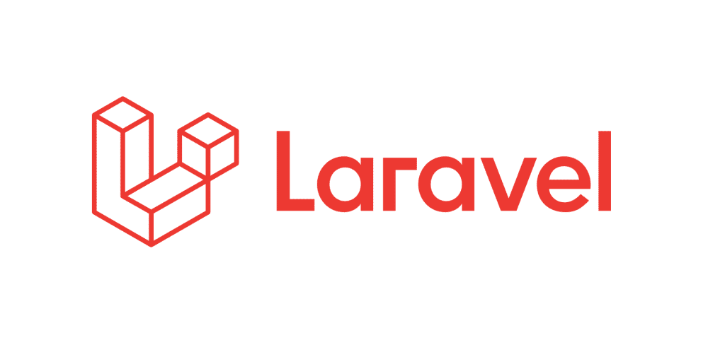

Laravel’s official logo. (Image source: [Github](https://github.com/laravel/laravel))


Laravel 是一个 PHP 框架，旨在简化现代 PHP 应用[的创建](https://kinsta.com/blog/node-js-vs-php/)。由于其强大的生态系统，许多开发人员利用它来简化开发过程，利用 Laravel 的内置功能和多个兼容的包和扩展。


> Kinsta 把我宠坏了，所以我现在要求每个供应商都提供这样的服务。我们还试图通过我们的 SaaS 工具支持达到这一水平。
> 
> <footer class="wp-block-kinsta-client-quote__footer">
> 
> 
> 
> <cite class="wp-block-kinsta-client-quote__cite">Suganthan Mohanadasan from @Suganthanmn</cite></footer>

[View plans](https://kinsta.com/plans/)

Laravel 在开发方面取得了杰出的成就，并且一直满足用户的编码期望。正是这个框架阻止了 [PHP 逐渐消亡](https://kinsta.com/blog/is-php-dead/)。

Laravel 通过提供常规使用的方法或 API(如路由或认证)来促进 web 开发。您可以利用这些预构建的特性和模板来采用一个省时的 web 开发过程，而不是从头开始编写所有代码。

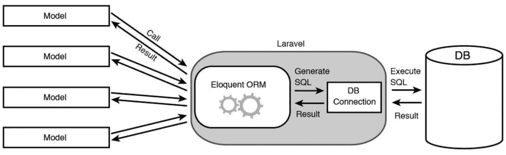

Laravel Eloquent ORM. (Image source: [TheCodework](https://thecodework.com/))


[Laravel 开发](https://kinsta.com/blog/laravel-developer/)在开发应用时遵循模型-视图-控制器(MVC)架构。它维护项目的目录结构，实现安全措施，包含 Voyager、Laravel-Breeze、Laravel-Debugbar 等多种包。

与其他现代 web 开发框架不同，Laravel 简化了数据库交互，允许您使用 raw SQL、流畅的查询构建器和支持任何数据库(如 MariaDB 或 MySQL)的雄辩 ORM。

## Laravel 的主要特点

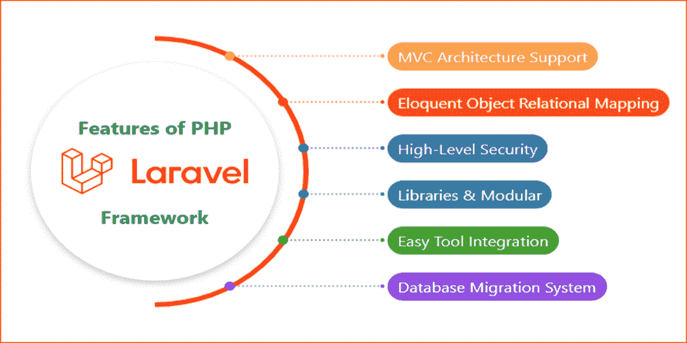

Laravel framework features. (Image source: [MavenCluster](https://www.mavencluster.com/blog/laravel-vs-codeigniter-php-framework/))


 让我们来了解一下 Laravel 的一些主要特性:

*   **Blade 模板引擎:** Blade，Laravel 的内部模板引擎，通过将几个模板整合成一个数据模型来产生一个视图。它有自己的控制结构，由条件语句和循环组成，允许干净的动态代码。
*   **模型-视图-控制器(** **MVC)架构:** Laravel 的 MVC 架构保证了表示层和业务逻辑层的分离，使得开发过程更快。这种 MVC 设计提高了应用程序的效率，并为开发人员增加了安全性和可伸缩性。
*   **口才对象关系映射(ORM):** Laravel 使用口才，一个对象关系映射(ORM)框架。ORM 允许 web 开发人员用 PHP 而不是 SQL 构建数据库查询。它还通过分配匹配的模型来集成程序员和数据库表，从而获得比旧的 [PHP 框架](https://kinsta.com/blog/php-frameworks/)更快的性能。
*   **内置包:**Laravel 中众多的预配置包简化了你的代码，帮助你保持一个整洁的环境。例如，社交软件将脸书或谷歌认证整合到你的网站中，允许用户点击注册。
*   **安全性:** Laravel 通过其内置的安全系统在内部处理您网站的安全性。由于 Laravel 的功能是作为一个中介系统来拦截所有的请求和进程，它可以防止黑客[远程将有害代码引入你的服务器](https://kinsta.com/blog/sql-injection/)。此外，它内置的 CSRF 令牌可以保护您免受其他安全威胁。
*   Artisan: Artisan 是一个命令行工具，在 Laravel 框架中自动执行重复的编程任务。它可以创建数据库结构、代码框架或代码迁移，它可以通过命令行生成和维护原始的 MVC 文件，并使用它们的选项管理这些资产。

## Laravel 用例

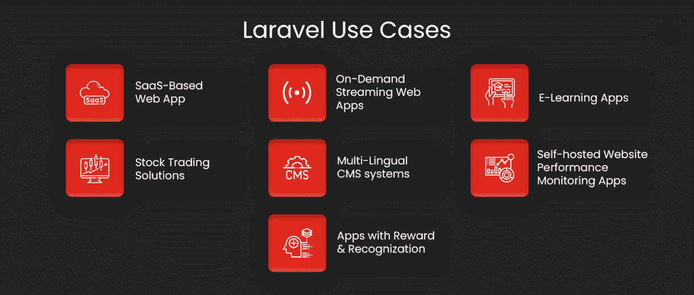

Laravel use cases. (Image source: [Aglowid](https://aglowiditsolutions.com/blog/laravel-vs-symfony/))


让我们看看 Laravel 的一些引人注目的用例，从自由开发者到企业级公司:

*   **高性能 web 应用:**开发人员使用 Laravel 框架创建高性能、安全的在线应用或网站。
*   **微服务架构应用:** Laravel 的微框架设计对于电子商务应用非常高效。它由多个独立运行的模块组成，并基于单个构建块集成大规模 Laravel 应用程序。因此，将一个冗长的程序分成更小的、独立的部分变得很容易。
*   **高级别安全应用:**散列秘密词、Bcrypt 散列计算和结构化 SQL 等安全特性允许开发高度安全的应用。而且 Laravel 生成的所有 cookies 都是加密签名的；如果客户修改了它们，它们就会失效。因此，Laravel 比 PHP 更安全。
*   **预建应用:** Laravel 拥有众多预建应用，为开发者和用户节省时间。如果你需要建立一个类似的应用程序，你可以很容易地使用在 Laravel 网站上找到的模板。

### 谁用 Laravel？

作为最流行的 web 开发框架，Laravel 为开发人员创造了一个受欢迎的利基市场。今天，各种规模的企业，从初创企业到公司，都依赖于 Laravel。

以下是一些使用 Laravel 的公司:

*   英国广播公司(British Broadcasting Corporation)
*   辉瑞
*   9GAG
*   旅游雷达
*   关于你
*   诺维尔公司。
*   发票忍者
*   艾莉森（女子名）
*   拉拉卡斯特
*   阿尔法编码员

## Node.js 是什么？

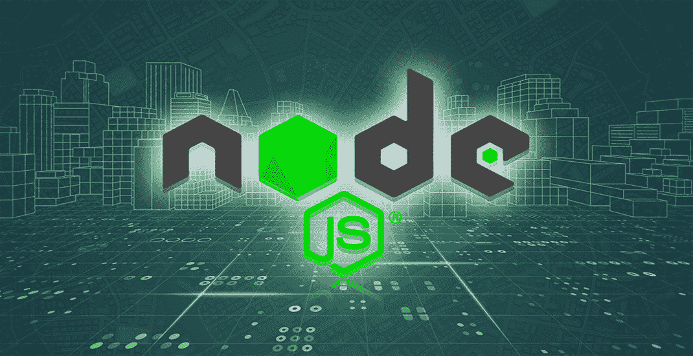

The Node.js logo. (Image source: [ZTM](https://zerotomastery.io/courses/learn-node-js/))


许多 IT 和开发爱好者经常承认 Node 是一种编程语言，这是一种普遍存在的误解。

Node 更像是 JavaScript 编程语言的超级套装，赋予了它传统编程语言所没有的特殊能力——例如，客户端和服务器端开发的能力。

[Node.js](https://kinsta.com/knowledgebase/what-is-node-js/) 是一个单线程、开源、跨平台的运行时环境，它在浏览器之外执行 JavaScript 代码，用于服务器端开发。它也用于构建网络应用程序。如前所述，它采用了 Google V8 JavaScript 运行时引擎和非阻塞、事件驱动的 I/O 架构。

对于那些正在为构建另一端而烦恼的开发人员来说，这是一个理想的工具。Learning Node 让你成为一名全栈开发人员，可以构建应用程序的前端和后端。

Node 采用异步、事件驱动的方法，非常适合开发在分散设备上运行的时间敏感、数据密集型应用程序。由于 Node 的非阻塞特性，它对于构建实时应用程序来说也是高度可扩展的。

Node 拥有丰富的 JavaScript 模块库，在创建 web 应用程序时非常有用。所以，好消息是，如果你在发展中遇到困难，援助永远不会远离你。

而且 [Node 很容易安装](https://kinsta.com/blog/how-to-install-node-js/)，可以马上开始使用。

## 节点主要功能

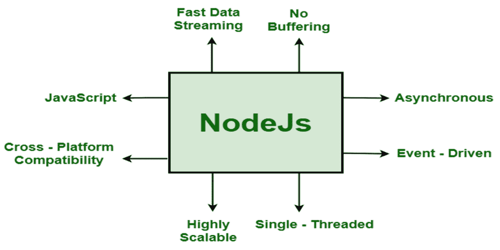

Node main features. (Image source: [GeeksforGeeks](https://www.geeksforgeeks.org/what-are-the-key-features-of-node-js/))


让我们来看看 Node 的一些主要特性:

*   **异步和事件驱动:**节点库提供的所有 API 都是异步的(非阻塞)。基于节点的服务器从不等待来自 API 的数据。相反，在访问一个 API 之后，服务器继续下一个。它还使用一个名为 Events 的通知系统来接收和监控对以前的 API 查询的响应。
*   **全栈:**节点是为了理解和执行 JavaScript 代码而设计的。有了 Node，客户端和服务器端的开发变得轻而易举。它允许 JavaScript 能力开发人员开发全栈应用程序。因此，前端和后端是同步的，因为您可以在两端使用 JavaScript。
*   **单线程:**由于其单线程事件循环架构，Node 具有极佳的可扩展性。与使用有限线程处理请求的传统服务器相比，node.js 的事件机制使其无阻塞且可伸缩。与 Apache HTTP Server 相比，Node 使用单线程软件，可以处理更多的请求。
*   **跨平台兼容性:** Node 兼容 Windows、Unix、Linux、Mac OS X 和移动平台。您可以将它与相关的包结合起来，生成一个自给自足的可执行文件。使用 NW.js 和 Electron，开发人员可以构建跨平台的实时应用程序，而无需为每个平台单独编写代码。
*   **快速数据流:** Node 是一个轻量级的、快速的、支持本地流 API 的框架。它允许用户互相转发请求。因此，它将数据直接传输到目的地。由于回调函数的概念，节点应用程序以块的形式输出数据。它减少了所需的处理时间，并且在没有缓冲的情况下提供有效的数据流。
*   **物联网协议:**节点不需要大量的服务器端内存和资源。因此，软件开发人员可以使用物联网开发来实现多个设备之间的并发链接。此外，Node 支持大多数物联网应用程序采用的消息队列遥测传输(MQTT)协议。因此，独立和第三方设备的后端集成变得毫不费力。
*   **节点程序包管理器(npm):** 节点程序包管理器(npm)是节点的本机程序包管理器。npm 帮助您下载和安装基本的应用程序包，并允许您利用其他地方的代码，而不是从头开始编写。NPN 是世界上最大的软件库注册中心。除了帮助安装软件包库之外，它还处理库依赖关系。
*   **性能:**作为谷歌 Chrome 的 V8 JavaScript 引擎运行 Node，可以高速率执行代码。此外，它将 JavaScript 代码翻译成机器代码，实现起来更容易、更快。其优异的性能源于异步编程和非阻塞输入输出过程等概念。此外，Node 广泛使用事件，这有助于其非凡的速度。
*   **可伸缩:** [节点](https://kinsta.com/blog/node-js-apps/) [应用](https://kinsta.com/blog/node-js-apps/)由于其异步(非阻塞)操作，具有很强的可伸缩性。节点在单线程上运行，当请求到达时，它就开始处理请求，并准备接收后续请求。此外，一旦准备好响应，就会将其发送给客户端。

## 节点用例

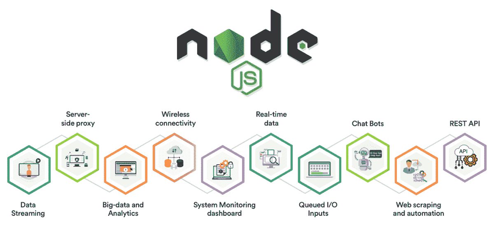

Node use cases. (Image source: [Simform](https://www.simform.com/blog/nodejs-use-case/))


让我们来看看为开发人员和企业服务的一些引人注目的节点使用案例:

*   **Web 流应用:** Node 包含一个本地流 API，可以利用 Unix 管道有效地进行流传输。类似地，它允许只下载网络应用程序的某些部分，其余部分在后台下载以避免缓冲。因此，像网飞这样的公司使用 Node 为他们的客户提供优雅的流媒体体验。
*   **实时应用:**实时应用可以说是 Node 的最佳用例。节点允许重用和共享库代码包，这加快了服务器到客户端的数据同步。此外，Node 的 WebSockets 和事件 API 可以处理密集的 I/O。因此，Node 在实时协作解决方案的开发人员中很受欢迎。
*   **高度可扩展的应用:** Node 包含多种尖端功能，例如允许在多个 CPU 内核上实现负载平衡的集群模块，从而更容易通过更小的模块提供所需的结果，而不会耗尽 RAM。因此，随着用户群的持续增长，它已经成为所有应用程序和平台的首选。
*   **服务器端代理:**第三方代理导致混乱和糟糕的 web 应用程序性能。甚至像 [Nginx](https://www.nginx.com/) 和 [HAProxy](http://www.haproxy.org/) 这样的著名代理也不能同时处理多个请求。Node 可以容纳多个并发的非阻塞连接，这使它成为一个理想的服务器端代理。例如， [BBC News](https://www.bbc.com/news) 使用 Node 来管理与其第三方信息服务器的连接。
*   **服务器端渲染:**在 Node 中使用服务器端渲染(SSR)，你的应用可以生成一个完整渲染的网页，直接发送给客户端，绕过浏览器。它还具有库支持和浏览器特性，而不是并发模型。最近，Airbnb 迁移了一项类似的服务，该服务可以在 Node 中生成类似的完整的、由服务器呈现的网页。

### 谁使用 Node？

自 2009 年成立以来，Node 已经为多个市场领导者发挥了举足轻重的作用。[节点](https://kinsta.com/blog/node-js-apps/) [开发的应用](https://kinsta.com/blog/node-js-apps/)目前被各种规模的企业使用，从初创公司到财富 500 强企业。

让我们看看一些实施 Node 的行业领先公司:

*   网飞
*   [PayPal](https://kinsta.com/blog/paypal-donate-button-wordpress/)
*   [推特](https://kinsta.com/blog/twitter-marketing/)
*   Spotify
*   通过易趣网购买
*   [LinkedIn](https://kinsta.com/blog/linkedin-statistics/)
*   <u>Airbnb</u>
*   超级的
*   沃尔玛
*   特雷罗

## Laravel vs Node:一个头对头的比较

现在我们已经了解了什么是 Laravel 和 Node，它们的特性和应用，让我们更深入地比较和对比它们的具体参数。

### 相似之处:

虽然 Laravel 和 Node 看起来不一样，但两者之间有明显的相似之处。在我们深入剖析这些编程奇迹之前，让我们讨论一下它们之间的相似之处。

*   **开源:【Laravel 和 Node 都是开源应用。Node 是一个开源的运行时环境，而 Laravel 是一个开源的 web 开发框架。**
*   **全栈:【Laravel 和 Node 都提供了[全栈开发](https://kinsta.com/blog/what-is-a-full-stack-developer/)。在前端，Laravel 在后端使用 JavaScript 和 PHP。节点的前端和后端都使用 JavaScript。**
*   **可靠性:** Laravel 和 Node 得到了全球众多软件开发商的支持和利用。大量的软件应用程序都是用这两种语言构建的。由于它们的可靠性和可靠性，这两种技术仍然处于所有 web 技术的前沿。

### 结构和灵活性

编程语言的效率和性能取决于它的结构，而结构决定了函数。Laravel 使用模型视图控制器(MVC)架构，而 Node 使用单线程事件循环架构。让我们比较和对比一下这两者有什么不同。

#### 拉勒韦尔

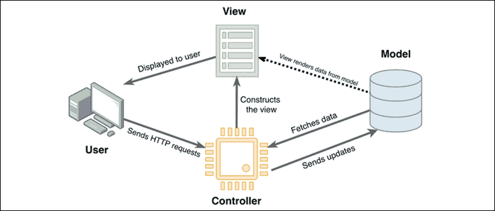

Laravel framework workflow. (Image source: [How-To-Geek](https://www.howtogeek.com/devops/what-is-laravel-and-how-do-you-get-started-with-it/))


Laravel 是一个基于 PHP 的 web 框架，深受模型视图控制器(MVC)架构的影响。MVC 架构将程序的业务逻辑从其表现中分离出来，并影响程序的性能。控制器充当管理所有请求的桥梁，联系模型以检索请求的数据，并将数据传输到视图。

Laravel 旨在让 PHP 开发人员更容易启动新项目。使用 Laravel，您可以更少地关注项目的设置、架构和依赖性，而更多地关注项目的核心功能。

### 结节

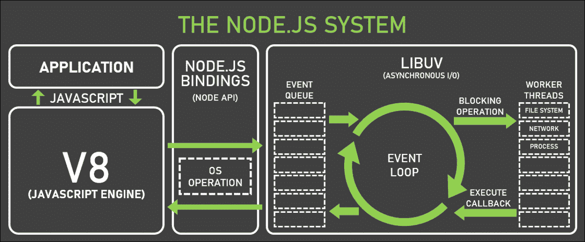

Node workflow. (Image credit: [Appiness](https://www.appinessworld.com/blogs/267/serverside-development-with-nodejs))


Node 遵循单线程事件循环设计范例。它与多线程的请求/响应技术有很大的不同。但是，一个线程可以同时管理几个客户端。值得注意的是，JavaScript 的基于事件的模型和回调机制是 Node 的主要处理组件。

节点向应用程序发送阻塞和非阻塞请求。然后事件循环逐个接收请求。它为不需要客户端外部授权的单个请求提供服务并返回响应。

如果请求很复杂并且需要客户端联系，则从线程池中分配一个线程。线程将完成块请求，包括数据库通信。

### 扩展性和可伸缩性

可伸缩性主要指系统处理不断增加的工作量的能力。如果您使用的系统可能会与大量流量交互，那么您应该选择能够有效管理流量的技术。

#### 拉勒韦尔

Laravel 采用 MVC 架构和几个线程来处理请求。当它接收到多个请求时，就变得有些欺骗性。由于 Laravel 需要执行额外的计算工作来服务请求，维护可伸缩性可能会变得困难。

工作量越大，需要的逻辑和能力就越多。因此，它需要更大的存储容量和功能，从而降低了作曲者的速度。

有了 Laravel，开发人员现在可以创建可伸缩的系统。通过平衡 HTTP 请求的负载，利用 HTTP 平衡器可以使基于 Laravel 的系统更具可伸缩性。

#### 结节

Node 的单线程事件循环架构使其具有高度的可扩展性。因此，它作为一种开发工具受到了极大的关注。此外，异步操作的特性使得平稳处理重负载变得更加容易。

Node 可以提供管理实时微服务所需的最具可扩展性的解决方案。此外，它比 Python 提供了更多的可伸缩性。

### 学习曲线

学习编码时，每个人的体验都不一样。学习 Laravel 和 Node 需要分别熟悉 PHP 和 JavaScript，因此对于初学者来说，学习曲线可能很难。

#### 拉勒韦尔

据说拉勒维尔有一个陡峭的学习曲线。在整个 Laravel 学习过程中，你必须具备 PHP 的工作知识和 HTML 和 CSS 的编程经验。

也就是说，Laravel 的模板和预装资源将加速 web 应用程序的开发。它还为您管理一些基本的开发功能。

如果您想使用 Laravel，您需要熟悉 Laravel 的代码结构、MVC 架构、Laravel 库和数据库集成等等。然而，有了 Laracasts 这样的工具和大量的文档，掌握框架和 [PHP 编程语言](https://kinsta.com/blog/php-tutorials/)应该不难。

#### 结节

如果你熟悉 JavaScript，Node 很容易理解。您还需要理解 Node 的架构，它是建立在 JavaScript 和 npm 包模块之上的。您可以从一个节点演示项目开始学习架构和模块安装。

如果您已经牢牢掌握了 JavaScript，您可以立即开始使用 Node 进行开发。

## 注册订阅时事通讯


### 想知道我们是怎么让流量增长超过 1000%的吗？

加入 20，000 多名获得我们每周时事通讯和内部消息的人的行列吧！

[Subscribe Now](#newsletter)

### 性能(速度)

Laravel 是公认的各种特点，但不是它的速度。另一方面，Node 快得令人难以置信。然而，由于 Node 是单线程的，因此使用 Node 执行复杂的数值计算会很耗时。

Node 明显比 Laravel 快，但 Laravel 更健壮。把 Laravel 想象成一辆双层巴士，而 Node 更像一辆摩托车。

如果您计划执行大量计算过程，请使用 Laravel 否则，使用节点。

#### 拉勒韦尔

Laravel 具有一个刚性架构，可以有效地处理简单和复杂的基于计算的应用程序。它在数据库交互和安全性等方面表现出令人印象深刻的效率。

Laravel 提供了大量经过 Laravel 开发人员验证的库，为您的项目提供了效率和可靠性

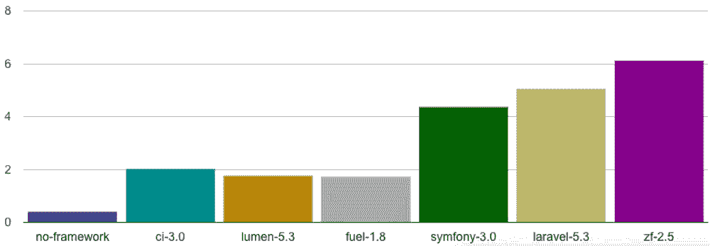

Laravel execution time. (Image source: [Medium](https://medium.com/))


如果您的网站需要身份验证，您可以从多个身份验证包(如 Laravel-Auth 或 Breeze)中进行选择，以自动启用安全功能。

Laravel 还包括用于定制的预构建代码。因此，您可以减少花费在开发上的时间，并从质量和时间效率的提高中获益。

#### 结节

Node 中的单线程事件循环架构提供了显著的性能提升。查询不必等待外部请求，因此处理所述请求所需的时间显著减少。这可以大大提高实时应用程序和单页应用程序(spa)的性能。

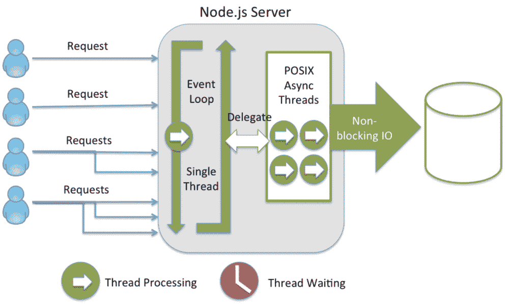

Node request handling. (Image source: [Medium](https://medium.com/))


npm 模块为几乎所有场景提供了代码模板。然而，越来越多的图书馆让找到合适的图书馆变得更加困难。此外，因为 Node 允许创建和重用来自不同用户的代码片段，所以每个模块的性能可能不同。

此外，在管理具有复杂计算和数据库集成的高端业务时，Node 可能不太可靠。

也就是说，它擅长管理应用程序的可伸缩性。

### 用户化

因为两者都是开源的，所以都允许定制的机会。但是，由于它们的操作方式不同，选项也会有所不同。

#### 拉勒韦尔

作为开源软件，Laravel 为你提供了功能代码，让你随心所欲地进行实验。如果你精通 PHP，你甚至可以根据你的应用规范修改这些代码。

此外，Laravel-Auth 和 Laravel-Breeze 为您的应用程序提供了一个前端认证系统。您可以使用 Laravel 包库修改前端和后端身份验证代码的功能和外观。

#### 结节

和 Laravel 一样，Node 运行时环境是开源的。您可以根据您的开发规范定制包模块并管理依赖版本。Node 还提供了一个样板文件，您可以将它修改成一个功能齐全的应用程序，并与他人共享(如果您愿意的话)。

### 受欢迎程度和就业市场

Laravel 的流行源于 PHP 的流行，而 Node 的流行源于 JavaScript 的流行。通过查看下面的谷歌趋势报告，我们可以看到用户搜索这些网络技术的频率。

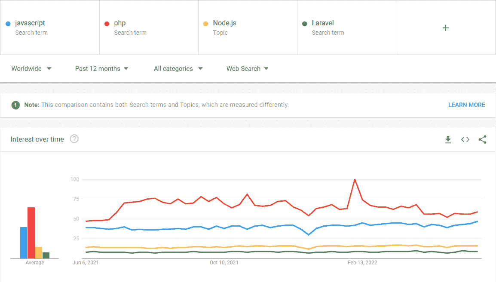

Laravel and Node popularity on Google.


#### 拉勒韦尔

Laravel 是最流行的 PHP 开发框架，因为它有清晰的语法、浅显的学习曲线、可靠的安全性和高性能。根据 JetBrains 在 2020 年进行的一项调查，50%的 PHP 开发人员经常使用 Laravel，Github 的一项排名显示，Laravel 是最受欢迎的 PHP 框架。

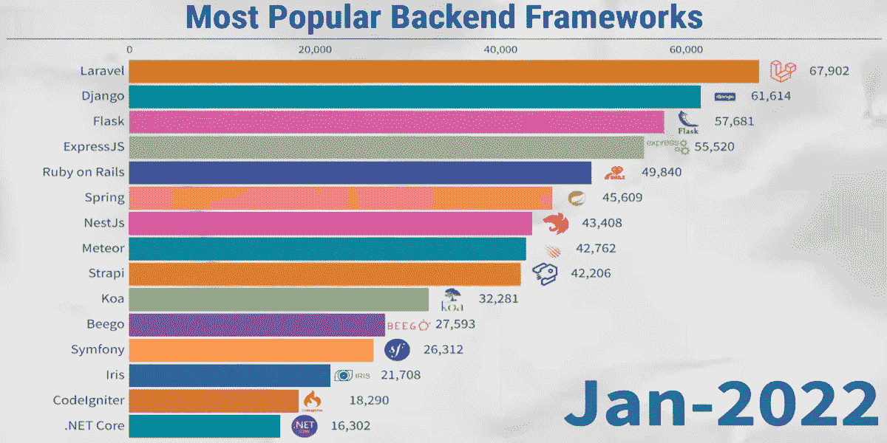

The most popular backend frameworks. (Image source: [Statistics & Data](https://statisticsanddata.org/))


对 Laravel 开发者的需求是巨大的，这意味着 Laravel 开发者有权要求足够的补偿。在美国，Laravel 开发人员的平均[工资约为每年 92，000 美元，或每小时 44 美元。](https://kinsta.com/blog/laravel-developer-salary/)

Struggling with downtime and WordPress problems? Kinsta is the hosting solution designed to save you time! [Check out our features](https://kinsta.com/features/)

由于互联网的大部分都是建立在 PHP 之上的，Laravel 及其开发者的胃口不太可能很快消失。

#### 结节

JavaScript 是过去十年中最流行的编程语言，68%的专业开发人员以某种方式使用它。Node 使 JavaScript 开发人员能够管理前端和后端，这证明了其受欢迎程度的指数增长。

根据 [StackOverflow](https://insights.stackoverflow.com/survey/2021#most-popular-technologies-language-prof) 的数据，目前有 36%的专业开发人员将 Node 作为他们的主要语言或框架。Node 在 [Github](https://github.com/nodejs/node) 上也有 87000 颗星星。

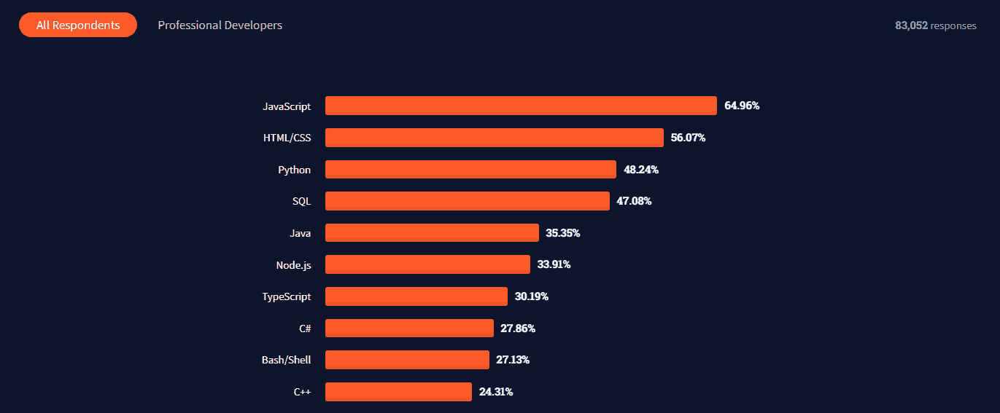

Most Popular Programming Technologies 2021 (Image source: [Stack Overflow](https://insights.stackoverflow.com/survey/2021))


Node 是一种未来的编程语言，所以在可预见的未来，对 Node 工作的需求减少的可能性很小。得益于此，节点开发者获得了丰厚的报酬。一个远程[节点](https://kinsta.com/blog/node-js-developer-salary/) [开发人员的工资](https://kinsta.com/blog/node-js-developer-salary/)大约是每年 114000 美元，或者每小时 55 美元。

如果你对 Node 的职业感兴趣，现在是时候开始了。

### 安全性

在安全性方面，Laravel 比 Node 更突出，因为 Laravel 可以防范常见的漏洞。除非您将 Laravel 用于原始查询，否则它会清理所有数据。然而，Node.js 的核心是安全的，但是第三方包通常需要额外的安全性。

#### 拉勒韦尔

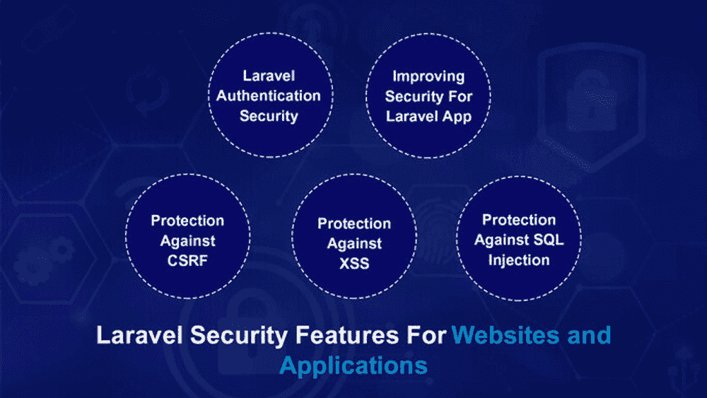

Laravel Security Features (Image source: [Webnexs](https://www.webnexs.com/))


Laravel 的安全特性是其最重要的方面。它使用安全的 Bcrypt 哈希算法来加密我们的密码和 CSRF 令牌来保护您的表单数据。

拉勒维尔用雄辩的 ORM 防御 SQL 注入。PDO 或 PHP 数据对象类是雄辩的 ORM 安全的主要原因。Laravel 还支持 HTTPS 传输敏感数据的请求。

#### 结节

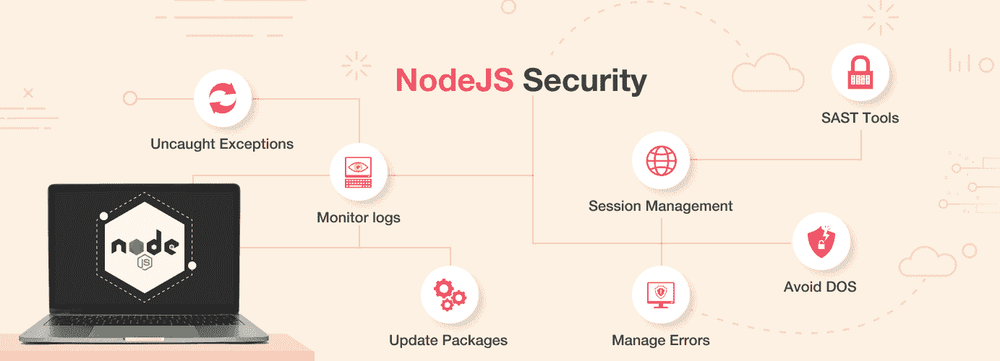

Potential Node security issues. (Image source: [Simform](https://www.simform.com/blog/nodejs-security/))


使用其授权组件时，Node 还提供高级别的安全性。然而，这并不承认开源软件的安全性和许可困难。

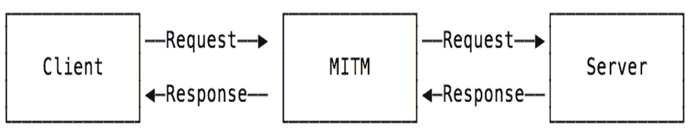

A Node machine-in-the-middle (MIDM) attack. (Image source: [Medium](https://medium.com/))


Node 塞满了第三方模块，其中许多都有安全缺陷。然而，Node 已经实现了一个反 CSRF 令牌来检查身份验证，用户也可以使用 cookie 会话模块。此外，自动化的[漏洞扫描](https://kinsta.com/blog/scan-wordpress-for-malware/)可以帮助识别典型的节点安全漏洞。

### 生态系统(支持和社区)

#### 拉勒韦尔

Laravel 是全球最流行的 web 开发框架之一，全世界的开发者都在用它构建大量的应用程序。因此，Laravel 有一个丰富的用户社区。

大多数开发人员互相帮助，共享他们的包，并指导新的开发人员。Laravel.io 或 Laracast 是框架的实质性技术支持社区的例子。

此外，Laravel 使用 PHP，这意味着任何人在使用 PHP 代码时遇到困难都可以从 Laravel 社区寻求帮助。此外，科技巨头如脸书、Github、T2、LinkedIn、其他社交网络和在线用户论坛拥有众多的 Laravel 用户支持团体。

#### 结节

Node 拥有大量的用户论坛，提供技术援助和建议。Node 官方网站有自己的用户社区，网站 Nodejs.dev 提供了补充的 Node 用户支持社区。

用户可以在脸书、Github、StackOverflow、Linkedin 和其他社交网络上找到专门的地方来讨论与节点相关的问题和解决方案。随着越来越多的网站和应用程序使用 Node 开发，社区对该框架的支持继续呈指数级增长。

### 句法

Laravel 使用 Blade 语法，而 Node 使用 JavaScript 语法。让我们更深入地讨论每一个问题。

#### 拉威尔刀片式服务器

Laravel Blade 是一个强大的模板引擎，它使 Laravel 用户能够快速开发语法并毫无困难地使用模板引擎。它提供了一个实质性的结构，包括条件表达式和循环。

您可以通过创建一个视图文件并使用 **.blade.php** 扩展名而不是**来保存它，从而创建一个刀片模板。php** 。

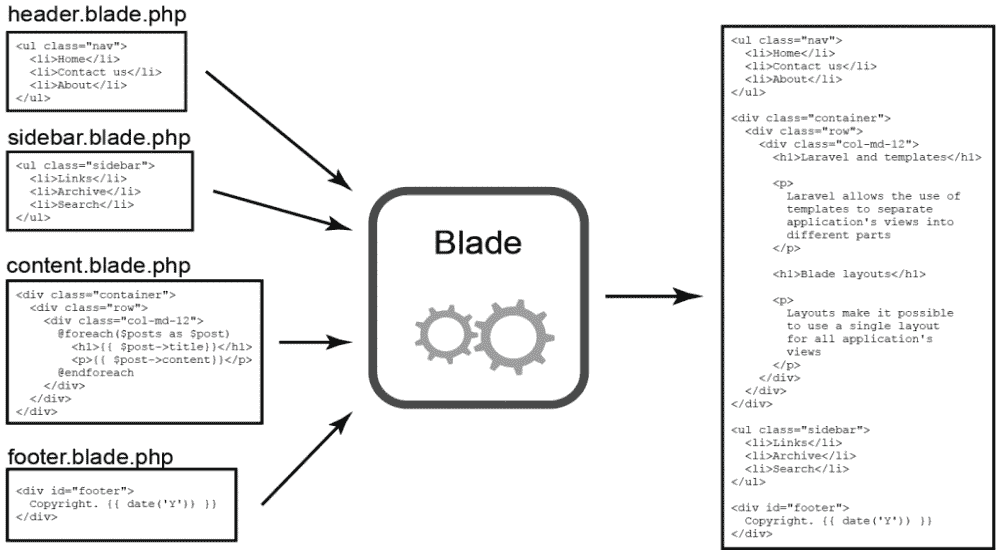

Laravel Blade syntax. (Image Source: [Medium](https://medium.com/))


让我们看看一些 Laravel 刀片语法:

*   **显示数据:**要打印变量的值，请用花括号括起来:

    ```
    {{$variable}};
    ```

*   **三元**T3】运算符:刀片模板中三元运算符的语法是这样的:

    ```
    {{ $variable or 'default value'}}
    ```

*   **刀片循环:**刀片模板引擎提供循环指令，包括`@for`、`@endfor`、`@foreach`、`@endforeach`、`@while`和`@endwhile` :

    ```
    @for ($i = 0; $i < 10; $i++)
     The current value is {{ $i }}
    @endfor
    @foreach ($users as $user)
      <p>This is user {{ $user->id }}</p>
    @endforeach
    @forelse ($users as $user)
      <li>{{ $user->name }}</li>
    @empty
      <p>No users</p>
    @endforelse
    @while (true)
      <p>I'm looping forever.</p>
    @endwhile
    ```

*   **If 语句:**使用`@if`、`@elseif`、`@else`和`@endif`指令，可以创建 If 语句。这些指令和它们的 PHP 对等物有相同的功能

    ```
    :@if (count($records) === 1)
      I have one record!
    @elseif (count($records) > 1)
      I have multiple records!
    @else
      I don't have any records!
    @endif
    ```

*   **原始 PHP:** 有时候，在你的视图中加入 PHP 代码会很有帮助。使用 Blade `@php`指令，您可以在您的模板中执行一个普通的 PHP 块:

    ```
    @php
     $counter = 1;
    @endphp
    ```

*   **评论:**刀锋也允许你在你的观点中添加[拉拉威尔评论](https://kinsta.com/blog/laravel-comments/)。与 HTML 注释不同，Blade 注释不包含在应用程序提供的 HTML 中:

    ```
    {{--The resulting HTML will not contain this comment. *--}}*
    ```

*   **CSRF 字段:**在应用程序中定义 HTML 表单时，要包含一个隐藏的 CSRF 令牌字段，这样中间件就可以验证请求。您可以使用`@csrf`刀片指令:

    ```
    <form method="POST" action="/profile">
      @csrf
      ...
    </form>
    ```

    生成令牌字段
*   **堆栈:** Blade 支持推送命名堆栈，您可以在不同的视图或布局中的其他地方呈现这些堆栈。这对于指定孩子的视图需要的 JavaScript 库很有用:

    ```
    @push('scripts')
      <script src="/example.js"></script>
    @endpush
    ```

#### 结节

Node 和 JavaScript 使用相同的语法。但是，这些 API 之间存在差异。

Node 不支持传统的浏览器 DOM，尽管在 nodejs.org 可以获得额外的 API。然而，浏览器的怪癖导致了语法上的差异。

让我们看看 Node 的一些语法:

*   **原始类型:**节点支持以下原始数据类型:
*   **字符串**
*   **号**
*   **未定义**
*   **布尔型**
*   **Null**
*   **正则表达式**
*   **松散类型:**Node 中的 JavaScript 允许松散类型，类似于基于浏览器的 JavaScript。可以用 var 关键字声明任何变量。
*   **对象文字:**对象文字语法与浏览器的 JavaScript:

    ```
    var obj = {
      authorName: 'Zadhid Powell',
      language: '*Node**'
    }*
    ```

    相同
*   **职能:**节点视职能为一等公民。此外，一个函数还可能具有特征和性质。它也可以被视为一个 JavaScript 类:

    ```
    function Display(x) {
      console.log(x);
    }
    Display(100);
    ```

*   **节点调试器:**节点有简单的 TCP 协议和[调试客户端](https://kinsta.com/blog/node-debug/)。您可以使用`debug`后跟**。js** 用于调试 JavaScript 的文件名:

    ```
    node debug [script.js | -e "script" | <host>:<port>]
    ```

*   **节点文件系统(FS):** 节点通过封装在简单包装器中的传统 POSIX 方法提供 I/O 文件。您可以使用下面的语法导入[节点文件系统【T4:

    ```
    var fs = require("fs")
    ```](https://kinsta.com/knowledgebase/nodejs-fs/) 
*   **节点事件:**节点线程完成一个任务后，释放相关事件，执行事件监听器函数:

    ```
    // Import events module
    var events = require('events');

    // Create an eventEmitter object
    var eventEmitter = new events.EventEmitter();
    ```

*   **node . js V8:**node . js V8 模块包含 V8 特有的接口和事件。通过`v8.getHeapStatistics()`和`v8.getHeapSpaceStatistics()`函数，它提供了对堆内存统计数据的访问:

    ```
    const v8 = require('v8');
    ```

*   **节点 Punycode:** Punycode 将 Unicode (UTF-8)字符串转换成 ASCII 字符串。使用 Punycode 是因为主机名只理解 ASCII。Punycode.js 随 Node.js 版本 0.6.2 及更高版本一起提供:

    ```
    punycode = require('punycode');
    ```

## Laravel 与节点:对照表

让我们看一下 Laravel 与 Node 的对比，并回顾一些基本的编程参数:

|  | 拉勒韦尔 | 结节 |
| --- | --- | --- |
| 创造 | Two thousand and eleven | Two thousand and nine |
| 种类 | 语言(PHP)框架 | JavaScript 运行时环境 |
| 易于编码 | 简明的 | 长的 |
| 流行 | 0.35%的网站 | 4.24%的网站 |
| 发动机 | 刀片模板引擎 | 谷歌的 V8 JavaScript |
| 包管理器 | Composer 包管理器 | 节点程序包管理器(npm) |
| 执行 | 同步的 | 异步的 |
| 执行速度 | 强大而轻巧 | 更快、更轻便 |
| 并发 | 多线程阻塞 I/O | 事件驱动的非阻塞 I/O |
| 表演 | 慢的 | 更快的 |
| 网络服务器 | 不需要 | Apache 和 IIS |
| 数据库ˌ资料库 | 4 (MySQL、PostgreSQL、SQLite、SQL) | 关系型和传统型 |
| JSON | json_encode | JSON.stringify()和 JSON.parse |
| 最新版本 | [拉勒韦尔 9](https://kinsta.com/blog/laravel-9/) | [节点 18.3.0](https://nodejs.org/en/) |
| 社区 | 小但在上升；分享 PHP 社区 | 庞大的在线社区 |

## Laravel vs Node:你该选哪个？

既然我们已经深入探讨了这两个开发奇迹，您应该对它们有了更好的理解。这两个框架提供了大量的功能，使您的开发更易访问、更稳定、更安全、更可伸缩。

我们的研究表明两者各有利弊。为此，基于客观证据的优势宣言是无益的。

最后，您应该选择与您的项目所需的特性集相匹配的技术..

### 何时使用 Laravel

如果您的项目有以下要求，您应该使用 Laravel:

*   **快速开发:**由于其预制的模板和社区支持，Laravel 是最快的应用程序开发框架之一。
*   **全面系统:** Laravel 为任何规模的基于 [CMS](https://kinsta.com/cms-market-share/) 的网站提供了一个强大的系统。以 PHP 为基础，Laravel 可以高效地管理大型网站。
*   **行业** **-g** **拉德:**拉勒维尔在专业、教育、购物、商业等主流行业都欣欣向荣，除了艺术和娱乐行业，这个节点占主导地位。
*   **高度安全:** Laravel 禁止在数据库中存储明文密码，因为它需要散列和加盐密码。此外，它还包含一个集成的安全和授权系统以及 Bcrypt 哈希算法来进行密码加密。

### 何时使用节点

您应该将 Node 用于需要以下内容的开发项目:

*   **全栈:**选择服务器端和客户端同时开发的节点。Node 消除了协调独立的[前端和后端](https://kinsta.com/blog/backend-vs-frontend/)框架或团队的麻烦。
*   **速度和性能:** Node 运行程序的速度比大多数编程语言都要快，从而显著提高了性能和稳定性。如果希望应用程序同时处理许多命令和请求，请选择 Node。
*   **聊天 app:** Node 是开发实时应用的最佳选择。没有其他类似的技术。如果要创建多用户实时应用程序，请使用 Node。
*   **数据流:**在常规平台中，HTTP 请求是独立的事件。Node 提供了类似的功能，并支持流式传输(在上传期间处理文件)。使用 Node 构建音频/视频流应用程序。
*   **仪表板监控:** Node 是开发监控仪表板的优秀工具，尤其是[应用和系统监控仪表板](https://kinsta.com/blog/apm-tools/)。Node 的实时功能、双向套接字和事件循环功能有助于开发强大的监控功能。

[Need a little help picking the right framework for your project? 👩‍💻 Start here ✅Click to Tweet](https://twitter.com/intent/tweet?url=https%3A%2F%2Fkinsta.com%2Fblog%2Flaravel-vs-node%2F&via=kinsta&text=Need+a+little+help+picking+the+right+framework+for+your+project%3F+%F0%9F%91%A9%E2%80%8D%F0%9F%92%BB+Start+here+%E2%9C%85&hashtags=Laravel%2CNodejs)

## 摘要

Laravel 和 Node 在功能和预期用途上都是独一无二的，毫无疑问，它们在最近几年非常受开发人员的欢迎。

 然而，最终的决定更多地取决于您的用户需求，而不是 Laravel vs Node 可能提供的特性。当涉及到您的开发时，一种技术可能包含您需要的所有基本内容，而另一种可能不包含。

无论哪种方式，在可预见的未来，您都可以依靠 Laravel 和 Node 这两个仍然可行的开发选项。

你有机会在最近的作品中使用 Laravel 或 Node 吗？在下面的评论中分享你的想法吧！

* * *

让你所有的[应用程序](https://kinsta.com/application-hosting/)、[数据库](https://kinsta.com/database-hosting/)和 [WordPress 网站](https://kinsta.com/wordpress-hosting/)在线并在一个屋檐下。我们功能丰富的高性能云平台包括:

*   在 MyKinsta 仪表盘中轻松设置和管理
*   24/7 专家支持
*   最好的谷歌云平台硬件和网络，由 Kubernetes 提供最大的可扩展性
*   面向速度和安全性的企业级 Cloudflare 集成
*   全球受众覆盖全球多达 35 个数据中心和 275 多个 pop

在第一个月使用托管的[应用程序或托管](https://kinsta.com/application-hosting/)的[数据库，您可以享受 20 美元的优惠，亲自测试一下。探索我们的](https://kinsta.com/database-hosting/)[计划](https://kinsta.com/plans/)或[与销售人员交谈](https://kinsta.com/contact-us/)以找到最适合您的方式。